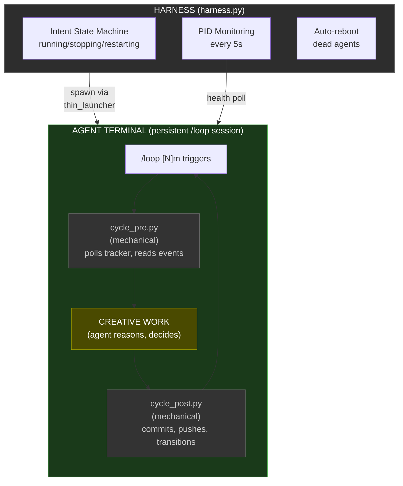
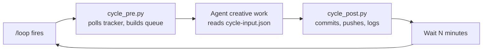
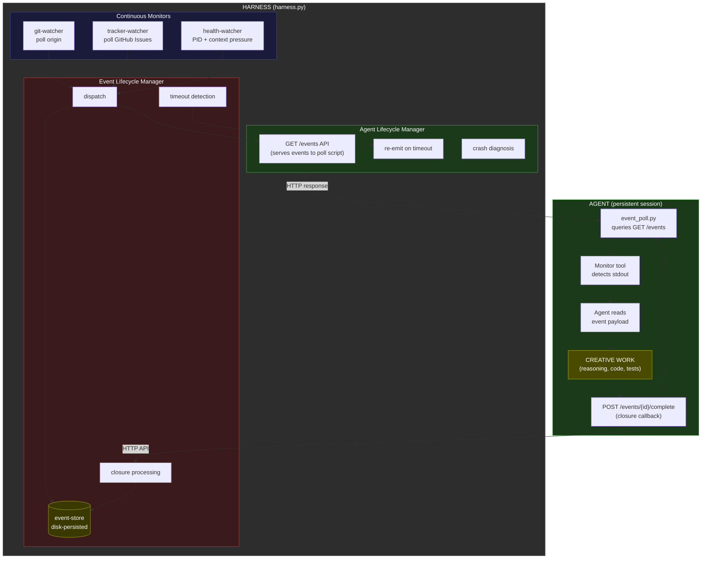
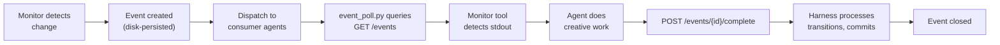
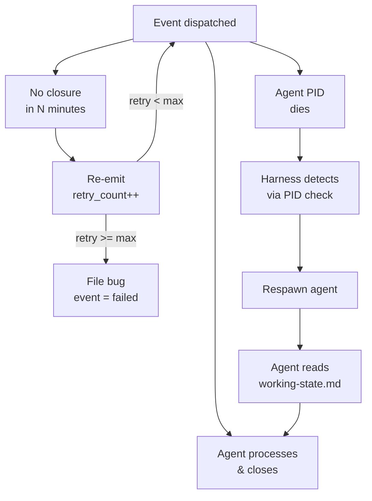
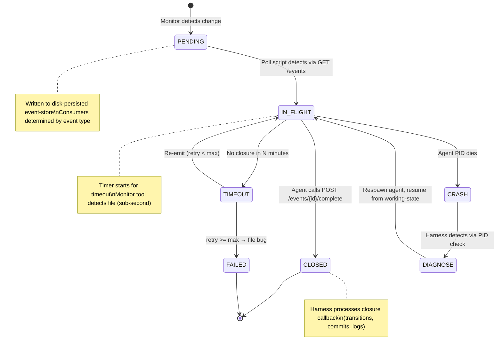

# FEAT-PM-7630 PRD — Event-Driven Agent Architecture

## Summary

**What was researched**: The entire SquidSquad agent lifecycle — from harness.py (FastAPI lifecycle manager, references/scripts/harness.py), through the Ralph Loop cycle scripts (cycle_pre.py, cycle_post.py, cycle.py), event bus (event_bus.py, event_bus_reader.py, event_catalog.py, event_validator.py), configuration (config.py), agent boot (thin_launcher.py, boot_remote.py), composition (compose.py), and all agent-facing templates (cycle-runner.md, event-reactions.md, agent-instructions.md, and 150+ sub-skills across 4 roles).

**Recommendation**: The migration is feasible with caveats. The event bus infrastructure (#4709, #5622) is already 70% built — harness has POST/GET /events endpoints, bounded event stream, cursor-based consumption in cycle_pre, per-role event filtering, mechanical reactions. What's missing is: (a) harness-owned continuous monitors that detect work and emit events proactively, (b) event closure API so agents signal "I handled this," (c) the agent template rewrite from /loop-based polling cycles to event-driven wake, (d) event bus disk persistence for crash recovery. Phase 1.5 (prerequisites) must ship before any template changes.

**Primary risks**: (1) A given event might need to wake multiple agents — the closure protocol must handle multi-consumer correctly. (2) Agent idle periods become invisible — no cycle_start/cycle_end events means different observability. (3) The Monitor tool (Claude Code v2.1.98+) is the wake mechanism — agents are persistent sessions that use Monitor to watch the event bus for new events. If Monitor tool behavior differs from assumptions (timeout, reconnection, Windows support), the wake model must be revised. (4) Event bus is in-memory only — crash loses all events. Must add disk persistence first.

## Vault Context

- **BRIEFING.md priorities**: #7630 EPIC explicitly listed as active priority; supersedes #6056, #5775, #5613. "All mechanical cycle steps move to harness."
- **Related decisions**: [[decision-cycle-runner-architecture]] — The cycle_pre/cycle_post split (#2057) was the intermediate step toward this EPIC. The decision explicitly references #7630 as the successor. All mechanical operations must move into harness.
- **Related patterns**: [[pattern-deterministic-scripts-over-prose]] — "Cyclic/mechanical agent work must be programmatic, not LLM-interpreted prose." This is the foundational pattern driving #7630. Agents should react to events, not run multi-step cycles.
- **Human preferences**: "any kind of cyclic work needs to be programmed deterministically" — LLMs reliably drop steps when context compresses. Agents should react to events, not run multi-step cycles. PID-first liveness, OS-level truth over application state. Terse, direct communication.
- **Related learnings**: [[decision-self-healing-sentinel]] — two-tier self-healing (immediate unstick + root-cause bug filing) applies to the event monitors too. If a monitor fails, the harness should detect and self-heal.

## Impact Analysis

- **Files touched**:
  - **harness.py** (references/scripts/harness.py, ~1429 lines): New POST /events/{id}/complete endpoint; continuous monitor threads (git watcher, tracker watcher, health watcher); event lifecycle management (timeout/re-emit); new in-flight event queue per role; thread safety hardening
  - **event_bus.py** (references/scripts/event_bus.py, ~104 lines): Add disk persistence layer; add closure callback support
  - **event_bus_reader.py** (references/scripts/event_bus_reader.py, ~90 lines): Minimal changes — add `ack` function for agent-side closure
  - **event_catalog.py** (references/scripts/event_catalog.py, ~218 lines): Add new event types (event-timeout, event-closed, monitor-error, agent-wake, agent-diagnose)
  - **cycle_pre.py** (references/scripts/cycle_pre.py, ~1060 lines): Remove polling logic; become thin event-dispatcher (read latest events, filter, react mechanically, write cycle-input.json only when work exists)
  - **cycle_post.py** (references/scripts/cycle_post.py, ~747 lines): Add POST /events/{id}/complete call; keep commit/push but remove stop-after-cycle check (harness handles intent)
  - **thin_launcher.py** (references/scripts/thin_launcher.py, ~118 lines): Boot prompt changes for event-driven mode; agent uses poll script + Monitor tool
  - **boot_remote.py** (references/scripts/boot_remote.py, ~653 lines): Return terminal PID for cleanup; no event payload passing needed
  - **event_poll.py** (references/scripts/event_poll.py, ~30 lines): **NEW** — lightweight poll script querying `GET /events?since=<cursor>&role=<role>`, outputs new events to stdout for Monitor tool
  - **config.py** (references/scripts/config.py, ~575 lines): New config section `## Event Driven` with new FIELD_MAP entries
  - **tracker.py** (references/scripts/tracker.py): No functional changes needed — already emits events
  - **cycle.py** (references/scripts/cycle.py, ~287 lines): No changes — still used for timestamps/status-bar/iteration-log
  - **compose.py** (references/scripts/compose.py): Template changes auto-propagate via compose
  - **Agent templates**: cycle-runner.md → replaced by event-driven-workflow.md; event-reactions.md → updated; self-restart.md → removed (harness handles); interval-sync.md → removed; all role instructions.md files → updated
  - **Sub-skill manifest**: cycle-runner.md removed from all includes.yml; event-driven-workflow.md added
  - **Tests**: ~15 test files need updates (test_cycle_pre, test_cycle_post, test_event_bus, test_event_bus_reader, test_harness, test_feat_6126, test_start_team, test_thin_launcher, test_event_config, test_event_validator, test_event_derivation, test_event_catalog)

- **Behavior changes**:
  - Agents no longer self-loop via `/loop` — harness triggers each cycle
  - Agents sit idle (claude process alive but not executing) until harness detects work
  - Harness owns all "should I work?" decisions — agents only do creative work
  - Event closure creates audit trail — every event that woke an agent gets closed
  - cycle_pre becomes mechanical-only: pull, filter events, write input — no polling logic
  - No more quiet cycles — harness only wakes agents when work exists
  - Context-pressure exit moves entirely to harness: harness monitors context-pressure file, kills/respawns agent

- **Dependencies**:
  - Requires Phase 1.5 prerequisites (disk persistence, clone discovery fix, per-role event queue, thread safety)
  - Requires Claude Code subprocess control (kill + respawn with event payload)
  - Depends on existing event bus infrastructure (#4709, #5622, #5868, #6126)
  - Depends on harness lifecycle management (#4966) — already shipped
  - Depends on compose.py + event_validator.py (#5868) — already shipped

## Side Effects

- **Risk 1**: Race condition on event closure when multiple agents consume same event — Severity: H — Mitigation: Event closure is idempotent (POST /events/{id}/complete is safe to call multiple times). Each agent closes independently. The event is "done" only when all registered consumers have closed. Track consumers in event payload.
- **Risk 2**: Agent terminal sits idle for long periods — human observes blank terminal and thinks agent is dead — Severity: M — Mitigation: Status bar must show "idle — waiting for events" with a pulse animation. The harness console shows which agents are waiting and why.
- **Risk 3**: If harness crashes while events are in-flight, event state is lost (in-memory only) — Severity: H — Mitigation: Phase 1.5 adds disk persistence (.squidsquad/.event-state.json). On crash recovery, harness replays open events.
- **Risk 4**: Monitor tool is the sole wake mechanism — if it has limitations (1-hour timeout, single subscription, Windows quirks), the entire architecture degrades — Severity: H — Mitigation: Validate Monitor tool API before prototyping Phase 2. Agent runs `event_poll.py` (queries harness `GET /events` API), Monitor tool watches script stdout. No file-based delivery. If Monitor tool is insufficient, fall back to stateless spawn (PHASE2-PREP Option A).

## Edge Cases

- **No events for long periods**: Agent sits idle. Harness writes "idle" to status bar. Health poller confirms process alive. No cycle logs written (no work). Human sees "idle — waiting for events" for hours/days. This is correct behavior.
- **Event storm (many events arrive simultaneously)**: Per-role in-flight queue caps at 50 events. After cap, oldest unprocessed events are dropped with a counter increment. Agent receives first event, processes, closes it, then immediately receives next. No starvation.
- **Agent crashes mid-work**: Harness detects death via PID check. On respawn, agent reads working-state.md and resumes. The in-flight event remains open until agent explicitly closes it. After 3 crash cycles on same event, harness escalates to PM.
- **Event timeout**: If an event is dispatched but not closed within N minutes (configurable), harness re-emits it. Re-emission count tracked. After 3 re-emissions, harness files a bug against the agent (self-healing tier 2).
- **Clone isolation**: Agent clones may not share filesystem with harness. The poll script reads `.harness-port` locally and queries the harness HTTP API directly — no filesystem coordination between harness and clones needed. Event closure also uses the HTTP API.
- **Multi-agent wake**: A single event (e.g., pr-merged) may need to wake pm (to transition issues) AND skill (to pull latest). Harness emits one event with consumers=["pm","skill"]. Both agents wake and close independently.

## Integration Risks

- **Compose/deploy integration**: Changing sub-skills and includes.yml requires compose.py deploy-all. Event contract derivation (#5868) must work with new event types. Must add new types to event_catalog.py RECOGNIZED tier before compose runs.
- **Harness merge (#6126)**: Harness already owns PR merge + compose. The event-driven model extends this — harness merge emits pr-merged, which wakes PM+QA. No conflict; it's the same pattern.
- **Tracker authority**: tracker.py already emits status-transition events. No changes needed. The harness tracker watcher (new) detects new issues/comments on GitHub and emits events without agent polling.
- **Config.md versioning**: New config section "## Event Driven" must be added to config.md. The upgrade path must handle existing configs that lack this section (graceful default: all features enabled with sensible defaults).

## Upgrade & Migration

- **New config values**:
  - `event-driven` (Event Driven → Enabled): "yes" | "no" — default "yes". Gates entire event-driven mode.
  - `event-timeout-minutes` (Event Driven → Timeout Minutes): integer — default "10". How long before an undispatched event times out and re-emits.
  - `event-max-retries` (Event Driven → Max Retries): integer — default "3". Max re-emission attempts before filing bug.
  - `event-poll-interval` (Event Driven → Poll Interval Seconds): integer — default "30". How often continuous monitors poll external systems.
  - `event-queue-cap` (Event Driven → Queue Cap): integer — default "50". Max events per agent in-flight queue.

- **New files**: 
  - `.squidsquad/.event-state.json` — disk-persisted event state (in-flight events, closed cursors, retry counts)
  - `references/sub-skills/common/event-driven-workflow.md` — new sub-skill replacing cycle-runner.md
  - `references/scripts/event_poll.py` — poll script for Monitor tool (queries harness API, outputs events to stdout)

- **Template changes**:
  - **Removed sub-skills**: `common/cycle-runner`, `common/context-pressure` (moves to harness), `common/interval-sync` (no more /loop), `common/self-restart` (harness handles), `common/boot-remote-agents` (harness owns boot)
  - **Added sub-skills**: `common/event-driven-workflow` — how agents receive events, process them, and close them
  - **Rewritten sub-skills**: `common/event-reactions` — updated for event-driven model (no more "cycle-input.json recent_events")
  - **Role instructions.md**: Remove all Ralph Loop references, /loop invocation, cycle numbering. Replace with "Use the Monitor tool with event_poll.py to watch for events from the harness."
  - **agent-instructions.md**: Regenerated via compose.py deploy-all
  - **All role SOUL.md files**: Remove Ralph Loop references

- **Upgrade steps**:
  1. Stop all agents (`start_team.py --stop --all` or Ctrl+C harness)
  2. Pull latest code containing #7630 changes
  3. Run `python references/scripts/compose.py deploy-all` — regenerates all CLAUDE.md + SOUL.md
  4. Clean stale sentinel files from clone directories
  5. Start harness (`python references/scripts/harness.py`) — auto-spawns agents in idle mode
  6. If rollback needed: set `event-driven: no` in config.md, revert compose, restart harness

- **Graceful degradation**: If `event-driven` is "no" or absent, harness falls back to current behavior — agents boot and self-loop via `/loop`. The event-driven-workflow sub-skill is not included when the config gate is off. Full backward compatibility for one version.

## Architecture Diagrams

### 2.1 Current Architecture (Cycle-Based)



**Cycle flow** — agent self-loops via `/loop`, deciding what to do each cycle:



**Component ownership in current architecture:**

| Concern | Owner | Mechanism |
|---------|-------|-----------|
| Activation | Claude Code `/loop` | Cron-like re-invocation every N minutes |
| Health monitoring | harness.py | PID check every 5s, auto-reboot dead agents |
| Git pull/push | cycle_pre/post.py | Scripts called by agent each cycle |
| Work detection | Agent (LLM) | Agent reads tracker, decides if work exists |
| Status transitions | cycle_post.py | Reads cycle-output.json, calls tracker.py |
| Scanning (quiet cycles) | Agent (LLM) | Agent decides to scan when no work |
| Stopping | harness.py | Intent API, queried by cycle_post.py |
| Restarting | harness.py | Intent API + context pressure exit 42 |
| Event bus | harness.py | In-memory deque, POST/GET /events |

### 2.2 Target Architecture (Event-Driven)



**Event flow** — harness detects work, dispatches to agent, agent closes via API:



**Failure paths:**



### 2.3 Architecture Comparison Table

| Concern | Current (Cycle-Based) | Target (Event-Driven) |
|---------|----------------------|----------------------|
| **Activation** | `/loop` cron-like re-invocation every N minutes | Harness monitors detect work → poll script queries `GET /events` → Monitor tool detects stdout → agent wakes (persistent session) |
| **Health** | harness.py PID poll every 5s | Same + context-pressure monitor triggers proactive restart |
| **Git pull** | cycle_pre.py per cycle (agent-initiated) | Harness git-watcher detects new commits → emits event → agent pulls on wake |
| **Git commit/push** | cycle_post.py per cycle (agent-initiated) | Agent commits after creative work, harness pushes on event closure |
| **Work detection** | Agent (LLM) reads tracker, builds queue | Harness tracker-watcher detects new/updated issues → emits events |
| **Status transitions** | cycle_post.py reads cycle-output.json | Agent writes cycle-output.json; harness executes transitions on event closure |
| **Scanning** | Agent decides on quiet cycles | Harness detects "no events for N cycles" → emits scan event → agent scans |
| **Stopping** | Intent API queried by cycle_post.py | Harness sends stop-event, agent exits on next wake boundary |
| **Restarting** | cycle_post.py exit 42 on context pressure | Harness monitors context-pressure file, proactively kills/respawns |
| **Idle behavior** | "Quiet cycle" — agent still runs full cycle_pre → creative → cycle_post | Agent process alive, Monitor tool watching inbox. Zero context consumption. Zero API calls until event arrives. |
| **Observability** | cycle_start/end events, iteration logs per cycle | Event lifecycle events (dispatched, in-flight, closed, timed-out), iteration logs per wake |
| **Error recovery** | cycle_post.py exit codes, harness auto-reboot | Event timeout → re-emit → bug filing. Crash → harness respawn → agent resumes from working-state. Unclosed events = diagnostic signal. |

## Event System Design

### 3.1 Event Lifecycle Diagram



### 3.2 Event Types Table

| Event Type | Emitter | Consumer(s) | Payload Schema | Trigger Condition | Expected Agent Response |
|---|---|---|---|---|---|
| **cycle-start** | cycle_pre.py | harness (observability) | `{cycle_number}` | Agent begins work cycle | N/A (informational) |
| **cycle-end** | cycle_post.py | harness (observability) | `{cycle_number, cycle_type, summary}` | Agent completes work cycle | N/A (informational) |
| **git-pull** | git_ops.py | harness (observability) | `{result}` | Agent pulls from remote | N/A |
| **git-push** | git_ops.py | harness (observability) | `{branch}` | Agent pushes to remote | N/A |
| **git-commit** | git_ops.py | harness (observability) | `{message, branch, files_changed, commit_type}` | Agent creates commit | N/A |
| **status-transition** | tracker.py | pm, qa, dm, skill (filtered by role) | `{issue_number, from, to}` | Tracker item changes status | Check if it affects own work queue |
| **tracker-comment** | tracker.py | pm, qa, dm, skill (filtered by role) | `{issue_number, commenter_role, comment_preview, mentioned_roles}` | Agent posts comment | Read if mentions own task |
| **branch-checkout** | git_ops.py | harness (observability) | `{branch, task_number}` | Agent checks out branch | N/A |
| **pr-create** | git_ops.py | pm, qa (observability) | `{pr_number, title, branch}` | Agent creates PR | N/A |
| **pr-merge** | git_ops.py (DEPRECATED) | — | `{pr_number}` | Legacy, replaced by pr-merged | N/A |
| **pr-merged** | harness.py (POST /merge) | pm, qa, skill, dm | `{pr_number, branch, issue_number, files_changed, success, requesting_role}` | Harness completes merge | PM: transition issues. Skill: pull latest. QA: check if verification needed. DM: check if delivery needed. |
| **compose-completed** | harness.py | all roles | `{success, error, trigger_pr}` | Harness runs compose after merge | Check if own templates changed |
| **request-merge** | harness.py | harness (audit) | `{pr_number, branch, role}` | Agent requests merge | N/A (audit trail) |
| **verification-failed** | PM or QA agent | skill (assigned role) | `{issue_number, findings}` | QA/PM verification finds gaps | Fix gaps, re-submit |
| **verification-passed** | PM or QA agent | dm, pm | `{issue_number}` | QA/PM verification passes | DM: prepare delivery. PM: track status. |
| **agent-health** | harness.py health poller | pm, dm | `{role, status, previous_status}` | Agent health changes (alive↔stalled) | PM: investigate. DM: note for delivery. |
| **phase-change** | harness or PM | all roles | `{issue_number, phase}` | Task moves lifecycle phase | Check if unblocks own queue |
| === NEW EVENT TYPES (Phase 2) === |
| **new-commits** | harness git-watcher | skill, dm | `{branch, commit_count, latest_sha}` | Git watcher detects new commits on working branch | Pull latest, check if changes affect own work |
| **new-issue** | harness tracker-watcher | pm, assigned role | `{issue_number, title, role, severity, reporter}` | Tracker watcher detects new issue filed | PM: triage. Assigned role: note for queue. |
| **issue-updated** | harness tracker-watcher | pm, all | `{issue_number, updated_by, change_type}` | Tracker watcher detects issue comment/label change | PM: check context. Others: if assigned, investigate. |
| **context-pressure** | harness health-watcher | affected role | `{role, used_pct, threshold}` | Health watcher detects context pressure > threshold | Agent: finish current work, checkpoint, prepare for restart |
| **pr-conflict** | harness git-watcher | skill (PR owner) | `{pr_number, branch, conflicting_with}` | Git watcher detects PR merge conflict | Resolve conflict via merge |
| **scan-needed** | harness event-lifecycle | skill, pm | `{reason: "no\_events\_N\_cycles"}` | No events for N cycles for a role | Run improvement scan |
| **stop-request** | harness intent API | target role | `{role, intent: "stopping"}` | Human/API requests agent stop | Finish current work, exit cleanly |
| **restart-request** | harness intent API | target role | `{role, intent: "restarting"}` | Human/API requests agent restart | Finish current work, exit for restart |
| **event-timeout** | harness event-lifecycle | harness (self) | `{original_event_id, event_type, retry_count}` | Event not closed within timeout | Harness re-emits or files bug |
| **event-closed** | harness event-lifecycle | harness (audit) | `{event_id, closed_by, duration_seconds}` | All consumers closed event | N/A (audit trail) |
| **agent-wake** | harness lifecycle | harness (audit) | `{role, trigger_event_id, wake_reason}` | Harness wakes an agent | N/A (audit trail) |
| **agent-diagnose** | harness lifecycle | pm | `{role, event_id, crash_count, last_error}` | Agent crashed N times on same event | PM: investigate, possibly reassign or re-plan |

### 3.3 Event-Reaction Matrix

**Role terminology**: PM (project manager), Technical Worker (dev/skill — the agent that implements), Verifier (QA — the agent that tests), DM (delivery manager).

**Reaction layer model (L1-L4)**:
- **L1 (Universal)**: Reactions ALL roles share — defined in `common/event-driven-workflow.md`. Only `stop-requested` and idempotency rules.
- **L2 (Role-specific)**: Per-role reactions — defined in `roles/{role}/event-reactions.md` sub-skills.
- **L3 (Behavioral adaptation)**: Project-tunable reaction parameters — separate mechanism from SOUL.md (soul is personality only). Categories: `event-sensitivity`, `reaction-latency`, `scan-priority`.
- **L4 (Human overrides)**: Config.md fields for muting events, timeout tuning, grace periods.

**Harness filtering**: 18 mechanical-only events (git ops, cycle bookkeeping, work lifecycle) are filtered by the harness and never delivered to agents. Only the 14 events below require creative agent judgment.

| Event Type | PM Action | Verifier Action | Technical Worker Action | DM Action | Layer |
|---|---|---|---|---|---|
| **status-transition** | Check pipeline state; detect stalls | If pending-test → queue verification | If own task moved → adapt | If pending-ship → prepare delivery | L2 |
| **tracker-comment** | Scan for human input; route to correct agent | Read verification feedback | Read if on own task; respond | Read delivery notes; apply | L2 |
| **pr-merged** | Pipeline sentinel — check state invalidation | Update verification queue (retesting?) | Pull latest; check for conflicts with in-progress work | Check if merged PR has pending-ship items | L2 |
| **verification-failed** | Route failure to correct worker; note in sentinel | Record in verification log; track re-submission | Read feedback; fix all gaps; re-submit | Await re-verification — do not ship | L2 |
| **verification-passed** | Update sentinel; route to DM | Record pass; hand off to DM | Clear working state; move to next task | Pick up for delivery packaging | L2 |
| **agent-health** | Investigate unhealthy agents; restart/reassign | Note in health log | Adapt if dependent agents unhealthy | Defer shipments if Verifier unhealthy | L2 |
| **phase-change** | Track lifecycle; detect stuck phases | If triggers verification, queue it | If affects own task, adapt | If triggers delivery, prepare | L2 |
| **compose-completed** | Verify deploy reached all roles | Re-read CLAUDE.md | Re-read CLAUDE.md | Check if changed user-facing docs | L2 |
| **scan-due** | Run improvement scan; file findings | — | — | — | L2 (PM only) |
| **human-input-received** | Process per checkin protocol | Check if references verification | Check if references own work | Check if references delivery | L2 |
| **vault-reflect** | Run vault reflection pipeline | Check for new patterns affecting verification | Check for new decisions affecting implementation | Check for new learnings affecting delivery | L2 |
| **pipeline-stalled** | Diagnose; unstick; file root-cause bug | Check if stall affects verification | Check if stall affects own work | Check if stall affects delivery | L2 |
| **stop-requested** | Checkpoint working-state; exit cleanly | Checkpoint working-state; exit cleanly | Checkpoint working-state; exit cleanly | Checkpoint working-state; exit cleanly | **L1** (universal) |
| **work-available** | Read event; do PM creative work | Read event; do verification work | Read event; do implementation work | Read event; do delivery work | L2 |

## Harness API Reference

### 4.1 Existing Endpoints (harness.py)

| Method | Path | Description | Request | Response |
|---|---|---|---|---|
| GET | `/status` | Harness + all agent health (line 563) | None | `{harness: {status, port, uptime}, agents: [...]}` |
| GET | `/agents` | List all agents with state (line 579) | None | `{agents: [{role, status, intent, ...}]}` |
| GET | `/agents/{role}` | Get single agent state (line 649) | None | `{role, status, intent, claude_pid, ...}` |
| GET | `/agents/{role}/health` | Agent health detail (line 689) | None | `{role, alive, status, last_cycle, current_phase, context_pressure}` |
| GET | `/agents/{role}/config` | Agent config sync state (line 726) | None | `{role, branch_workflow, pr_flow, interval_minutes, version}` |
| POST | `/agents/all/start` | Spawn all agents (line 586) | None | `{results: [{role, action, success, message}]}` |
| POST | `/agents/all/stop` | Stop all agents (line 611) | None | `{results: [{role, action, success, message}]}` |
| POST | `/agents/{role}/start` | Spawn agent (line 660) | None | `{role, action, success, message}` |
| POST | `/agents/{role}/stop` | Stop agent via intent (line 890) | None | `{role, action: "stop", message}` |
| POST | `/agents/{role}/restart` | Restart agent via intent (line 907) | None | `{role, action: "restart", success, message}` |
| POST | `/shutdown` | Stop all agents + exit harness (line 939) | None | `{status: "shutting_down", message}` (202 Accepted) |
| POST | `/events` | Receive event from agent script (line 827) | `{event_type, role, payload?, cycle_number?}` | `{status: "ok"}` |
| GET | `/events` | Retrieve events with filtering (line 857) | query: `?since=&role=&event_type=&limit=` | `{events: [...], total: N}` |
| POST | `/merge` | Async merge PR + compose if needed (line 1081) | `{pr_number, branch, role}` | `{status: "accepted", message}` (202 Accepted) |

### 4.2 New Endpoints Required

| Method | Path | Description | Request | Response |
|---|---|---|---|---|
| POST | `/events/{id}/complete` | Agent signals event processed successfully | `{role, summary?, status_transitions?, tracker_comments?}` | `{status: "ok", remaining_consumers: N}` or `{status: "closed"}` |
| GET | `/events/{id}` | Get single event state | None | `{id, event_type, status, consumers, consumer_status: {role: "pending"\|"closed"}, retry_count, created_at, dispatched_at, closed_at}` |
| POST | `/events/replay` | Replay events from disk after crash | None | `{replayed: N, failed: M}` |
| GET | `/monitors` | Get status of continuous monitors | None | `{git_watcher: {status, last_check, last_change}, tracker_watcher: {...}, health_watcher: {...}}` |
| POST | `/monitors/reset` | Reset a stuck monitor | `{monitor: "git_watcher"\|"tracker_watcher"\|"health_watcher"}` | `{status: "reset", monitor}` |
| GET | `/events/in-flight/{role}` | Get agent's current in-flight events | None | `{role, in_flight: [{id, event_type, dispatched_at, age_seconds}]}` |

### 4.3 Harness State Model

**.harness-state.json** (existing + new fields):

```json
{
  "harness_pid": 12345,
  "start_time": 1715000000.0,
  "port": 7373,
  "agents": {
    "skill": {
      "intent": "running",
      "status": "idle",
      "boot_time": 1715000100.0,
      "clone_path": "/path/to/clone",
      "claude_pid": 67890,
      "current_cycle": null,
      "last_cycle_start": null,
      "last_cycle_end": null,
      "last_cycle_type": null,
      "current_phase": "idle",
      "in_flight_events": ["a1b2c3d4"],
      "last_wake_at": 1715000200.0,
      "idle_since": 1715000250.0
    }
  },
  "event_state": {
    "last_processed_id": "x9y8z7w6",
    "in_flight": {
      "a1b2c3d4": {
        "event_type": "pr-merged",
        "status": "in-flight",
        "consumers": {"pm": "closed", "skill": "pending"},
        "retry_count": 0,
        "created_at": 1715000100.0,
        "dispatched_at": 1715000105.0,
        "timeout_at": 1715000705.0,
        "closed_at": null
      }
    }
  }
}
```

**New fields added:**
- `agents.<role>.in_flight_events`: list of event IDs currently being processed
- `agents.<role>.last_wake_at`: timestamp of last harness-initiated wake
- `agents.<role>.idle_since`: timestamp when agent went idle
- `event_state`: new top-level key — persisted event lifecycle state

**Persisted**: `harness_pid`, `start_time`, `port`, `agents.*`, `event_state.*` (all saved to disk on change)
**In-memory only**: `EventStream._events` deque (bounded history, replayed from event_state on crash)

## Changes Required

### 5.1 Harness Changes (harness.py)

**New endpoints:**

1. **POST /events/{id}/complete** (after line 889, near other /events endpoints):
   - Accept `{role, summary?, status_transitions?, tracker_comments?}`
   - Mark consumer as closed for this role
   - If all consumers closed, emit `event-closed` event, move to closed state
   - Return remaining consumers count or "closed" status

2. **GET /events/{id}** — single event state lookup

3. **POST /events/replay** — replay from disk on crash recovery

4. **GET /monitors** — continuous monitor status

5. **GET /events/in-flight/{role}** — agent's current event queue

**Continuous monitors (new, add after line 402):**

6. **Git watcher** (~100 lines): Background thread that polls `git fetch origin` every N seconds, compares HEAD with origin, emits `new-commits` event when new commits detected. Also checks open PRs for merge conflicts, emits `pr-conflict`.

7. **Tracker watcher** (~80 lines): Background thread that polls `gh issue list` every N seconds, detects new issues and comments, emits `new-issue` and `issue-updated` events. Uses cursor-based polling (store last-seen issue `updatedAt`).

8. **Health watcher enhancement** (~40 lines): Extends existing `update_health()` to also read `.squidsquad/<role>/context-pressure` and emit `context-pressure` event when threshold exceeded. Proactively restarts agent instead of waiting for agent to self-detect.

**Event lifecycle management (new class, ~150 lines):**

9. **EventLifecycleManager** class:
   - `dispatch(event, consumers)` — marks event as in-flight per consumer, serves via GET /events API
   - `close(event_id, role)` — marks consumer closed
   - `timeout_scan()` — background thread checks for timed-out events, re-emits or files bugs
   - `persist()` / `load()` — disk persistence to `.squidsquad/.event-state.json`

**State persistence modifications:**

10. **`save_state()`** (line 298): Add `event_state` to persisted data
11. **`load_state()`** (line 328): Add `event_state` restore logic + replay in-flight events

**Thread safety fixes:**

12. **`EventStream`** already has `threading.Lock` (lines 365-366). Verify all access paths use the lock.
13. **`HarnessState._lock`** (line 125): Already used for agents dict. Extend to cover new event_state.
14. **`EventLifecycleManager`** needs its own `threading.Lock` for dispatch/close operations.

**New imports needed:**
- `import threading` (already present)
- `from event_catalog import EMITTED, RECOGNIZED` for event validation

### 5.2 Script Changes

**cycle_pre.py** (references/scripts/cycle_pre.py):
- **ABSORBED INTO HARNESS** — per Locked Decision #3, cycle_pre.py is eliminated. Its operations move to:
  - Git pull → harness git-watcher continuous monitor
  - Branch enforcement → harness pre-work operation (before writing event to inbox)
  - Context pressure read → harness health-watcher continuous monitor
  - Working state read → agent reads directly on wake (no script needed)
  - Tracker queries → harness tracker-watcher continuous monitor
  - Event bus read → harness event lifecycle manager (IS the event system)
  - Mechanical reactions → harness processes inline on event receipt
  - Role-specific context building → harness includes relevant context in event payload served via `GET /events` API
- **File disposition**: Retained in codebase for `event-driven: no` backward compat. Not called by agents when event-driven mode is active.

**cycle_post.py** (references/scripts/cycle_post.py):
- **ABSORBED INTO HARNESS** — per Locked Decision #3, cycle_post.py is eliminated. Its operations move to:
  - Status transitions → harness executes from event closure callback payload
  - Tracker comments → harness executes from event closure callback payload
  - Git commit/push → harness executes after processing closure callback
  - Iteration logging → harness writes per-event log entry
  - Version bump (DM) → harness executes on `version-bump-due` event
  - Working state update → agent writes directly; harness commits
  - Stop-after-cycle check → replaced by `stop-requested` event on event bus
  - Event cursor advancement → replaced by event lifecycle manager (closed events)
- **File disposition**: Retained in codebase for `event-driven: no` backward compat. Not called by agents when event-driven mode is active.

**event_bus.py** (references/scripts/event_bus.py):
- **Add**: `close(event_id, role, summary=None)` function (~30 lines): POST to `/events/{id}/complete`. Fire-and-forget like `emit()`.
- **Add**: Disk fallback: if harness unreachable, append event to `.squidsquad/.event-outbox.json` for retry.

**event_catalog.py** (references/scripts/event_catalog.py):
- **Add to RECOGNIZED**: `new-commits`, `new-issue`, `issue-updated`, `context-pressure`, `pr-conflict`, `scan-needed`, `stop-request`, `restart-request`, `event-timeout`, `event-closed`, `agent-wake`, `agent-diagnose` — all new event types with descriptions and planned sources.

**event_bus_reader.py** (references/scripts/event_bus_reader.py):
- **Add**: `ack(event_id, role)` function (~15 lines): Calls POST /events/{id}/complete. Thin wrapper for agent use.

**thin_launcher.py** (references/scripts/thin_launcher.py):
- **Modify**: Boot prompt (line 86): Change from `"Boot. Begin your first Ralph Loop cycle now."` to event-driven orientation: `"Boot. Run event_poll.py with Monitor tool to watch for events from the harness. Process each event and close it via the API."` Must be conditional on `event-driven` config flag.
- **Add**: Read `event-driven` config flag to decide which boot prompt to emit.
- **Add**: Return terminal PID to harness for terminal cleanup on stop (Locked Decision #6).

**boot_remote.py** (references/scripts/boot_remote.py):
- **Modify**: `_spawn_windows` (line 395), `_spawn_macos`, `_spawn_linux` must return terminal PID alongside agent PID for terminal cleanup.
- **Modify**: `_find_boot_script()` (line 346): Always use thin launcher (legacy wrappers fully deprecated).

**config.py** (references/scripts/config.py):
- **Add FIELD_MAP entries** (after line 95):
  ```python
  "event-driven": ("Event Driven", "Enabled"),
  "event-timeout-minutes": ("Event Driven", "Timeout Minutes"),
  "event-max-retries": ("Event Driven", "Max Retries"),
  "event-poll-interval": ("Event Driven", "Poll Interval Seconds"),
  "event-queue-cap": ("Event Driven", "Queue Cap"),
  ```

**tracker.py** (references/scripts/tracker.py):
- **No functional changes**. Already emits status-transition and tracker-comment events. These events are consumed by harness monitors to detect work, but the emission path is unchanged.

**cycle.py** (references/scripts/cycle.py):
- **No changes**. Still used for timestamps, status-bar, iteration-logs. The name "cycle" is legacy but the utilities remain.

### 5.3 Template Changes

**Sub-skills REMOVED from all includes.yml manifests:**

1. `common/cycle-runner` — replaced by `common/event-driven-workflow`
2. `common/context-pressure` — harness health-watcher handles this
3. `common/interval-sync` — no more /loop scheduling
4. `common/self-restart` — harness handles all restart logic
5. `common/boot-remote-agents` — harness owns all boot decisions

**New sub-skill: `common/event-driven-workflow.md`**

Content outline:
```markdown
<!-- sub-skill: event-driven-workflow -->
## Event-Driven Workflow

You do NOT self-loop or poll for work. The harness monitors external systems and
delivers events to your inbox. You use the Monitor tool to watch for new events.

### Startup

On boot, use the Monitor tool to watch the output of `event_poll.py`:
```bash
Monitor: python references/scripts/event_poll.py [ROLE]
```
The poll script queries `GET /events?since=<cursor>&role=[ROLE]` from the harness
API. When new events arrive, it outputs them as JSON to stdout. The Monitor tool
detects the output and wakes you. When no events exist, sit idle.

Print: `[🦑 HH:MM:SS] Idle — polling harness for events...`

### Processing an Event

1. Read the event from the Monitor tool output (JSON on stdout):
   The event contains: `event_id`, `event_type`, `payload`, and `work_context`
   (pre-computed by harness — equivalent to what cycle-input.json provided).

2. Do your creative work based on the event type and payload.
   You have full bash access for: reading code, running tests, spawning subagents.
   You do NOT: run git pull/push, execute status transitions, post tracker comments.

3. Close the event via the harness API with your results:
   ```bash
   python references/scripts/event_bus.py close <event_id> [ROLE] \
     --summary "Brief description of work done" \
     --transitions '[{"number": 42, "from": "approved", "to": "in-progress"}]' \
     --comments '[{"number": 42, "message": "Picking up."}]' \
     --commit-message "role: description of changes"
   ```
   The harness processes the closure: executes transitions, posts comments,
   commits and pushes your changes, and logs the event.

4. Resume watching the poll script output for the next event.

### Stop Events

If you detect a `stop-requested` event in your inbox:
1. Checkpoint your working state to `.squidsquad/[ROLE]/working-state.md`
2. Close the stop event via the API
3. Exit cleanly

### What You Do NOT Do

- No `/loop` — the Monitor tool replaces it
- No `cycle_pre.py` or `cycle_post.py` — harness handles all mechanical operations
- No `git pull` or `git push` — harness owns git operations
- No direct `tracker.py` calls for transitions/comments — these go through closure API
- No context pressure checking — harness monitors and restarts you if needed

### Event Types and Responses

[Event-reaction matrix table — see Section 3.3 of PRD]
<!-- /sub-skill: event-driven-workflow -->
```

**Rewritten sub-skill: `common/event-reactions.md`** (L1 — universal only)

Stripped to L1 content only (~25 lines). Contains ONLY:
- `stop-requested` universal reaction (checkpoint → exit) — all roles identical
- `event-reemitted` idempotency rule (check if already processed)
- Catch-all for unknown events: "log event ID, note in working state, proceed"
- Statement: "You will only see events requiring your judgment. Mechanical events are filtered by the harness."

All role-specific reactions MOVE to L2 sub-skills (see below).

**NEW L2 sub-skills: `roles/{role}/event-reactions.md`** (× 4 files)

Each role gets its own event-reaction sub-skill with reactions from the matrix in Section 3.3:
- `references/sub-skills/roles/pm/event-reactions.md` — PM reactions (pipeline sentinel, triage, investigation)
- `references/sub-skills/roles/dev/event-reactions.md` — Technical Worker reactions (implementation, conflict resolution)
- `references/sub-skills/roles/qa/event-reactions.md` — Verifier reactions (verification queue, health log)
- `references/sub-skills/roles/dm/event-reactions.md` — DM reactions (delivery packaging, shipment tracking)

**L3 — Behavioral Adaptation (separate from SOUL.md)**

SOUL.md is personality only. Event-reaction behavioral tuning uses a SEPARATE mechanism:
- New script or config section for behavioral adaptation (NOT `soul_adaptation.py`)
- Categories: `event-sensitivity` (reactive ↔ proactive), `reaction-latency` (response urgency), `scan-priority` (which events trigger scans)
- Storage: `config.md` section or dedicated `behavior-adaptation.md` per role
- PM writes behavioral tuning entries that shape how agents interpret their L2 event reactions
- Example: "event-sensitivity: high → PM investigates pipeline-stalled within 5 minutes"

**L4 — Human Overrides (config.md)**

Human can override any L2/L3 reaction via config.md fields:
- `Muted Event Types`: comma-separated list of event types to suppress
- `Stop Grace Period`: seconds before forced kill on stop-requested
- `Max Event Retries`: max re-emissions before filing bug
- `Scan Idle Timeout`: minutes of idle before scan-due emitted
- Event-reaction preferences in `human-profile.md`: escalation threshold, auto-unstick policy, notification preferences

**Includes.yml changes (all roles):**

Each role's `includes.yml` changes:
- REMOVE: `common/event-reactions` (old flat L1 file)
- ADD: `roles/{role}/event-reactions` (new L2 role-specific file)
- KEEP: `common/event-driven-workflow` (L1 mechanism — how to watch inbox, close events)

**Harness event filtering:**

18 mechanical-only events are filtered by the harness before delivery to agents:
`cycle-start`, `cycle-end`, `git-pull`, `git-push`, `git-commit`, `branch-checkout`, `pr-create`, `pr-merge` (deprecated), `request-merge`, `work-started`, `work-completed`, `agent-idle`, `agent-stopping`, `agent-stopped`, `event-timeout`, `event-reemitted`, `work-failed`, `templates-updated`

Agents only see the 14 events requiring creative judgment (see Section 3.3).

**Role instructions.md changes (all 4 roles):**

- **REMOVE**: "When you first receive these instructions, first verify GitHub Issues access... Then invoke the `/loop` command"
- **REMOVE**: "## The Ralph Loop" section header and "Each invocation executes one cycle..." prose
- **REMOVE**: `/loop [INTERVAL]m execute one Ralph Loop cycle`
- **REMOVE**: "Print the cycle-complete marker. This cycle is finished — /loop will trigger the next one."
- **REPLACE WITH**: "When the harness boots you, use the Monitor tool with event_poll.py to watch for events. Process events as they arrive and close them via the harness API."
- **ADD**: "The harness monitors GitHub, git, and agent health. It delivers events to your inbox when there's work. You do not poll or self-schedule."

**Role SOUL.md changes:**
- Remove Ralph Loop references ("You follow the Ralph Loop" → "You react to events dispatched by the harness")
- NO event-reaction behavioral tuning in SOUL.md — soul is personality only

### 5.4 Config Changes

**New config section in config.md:**

```markdown
## Event Driven

- **Enabled**: yes
- **Timeout Minutes**: 10
- **Max Retries**: 3
- **Poll Interval Seconds**: 30
- **Queue Cap**: 50
```

**FIELD_MAP additions** (config.py, after line 95):
```python
"event-driven": ("Event Driven", "Enabled"),
"event-timeout-minutes": ("Event Driven", "Timeout Minutes"),
"event-max-retries": ("Event Driven", "Max Retries"),
"event-poll-interval": ("Event Driven", "Poll Interval Seconds"),
"event-queue-cap": ("Event Driven", "Queue Cap"),
```

## Prerequisites (Phase 1.5)

These infrastructure items MUST ship before event-driven wake can work:

### P-1: Event Bus Disk Persistence
- **What's broken today**: `EventStream` (harness.py line 361) is purely in-memory (`collections.deque`). Harness crash = all events lost. No crash recovery for in-flight events.
- **Fix**: Add `.squidsquad/.event-state.json` file. Persist on every `EventLifecycleManager.dispatch()`, `close()`, and `timeout_scan()`. On harness boot, `load_state()` (line 328) reads the file and replays open events. In-flight events with `dispatched_at` but no `closed_at` are re-dispatched.
- **Files changed**: `harness.py` (new `EventLifecycleManager` class, modify `save_state()`/`load_state()`)

### P-2: Clone Event Bus Discovery Fix
- **What's broken today**: `event_bus.py._discover_port()` (line 28) and `event_bus_reader.py._discover_port()` (line 27) walk parent directories to find `.harness-port`. In clone isolation, an agent clone at `/projects/proj-skill` may not be a child of the primary repo at `/projects/proj`. The parent-dir walk fails.
- **Fix**: Harness already distributes `.harness-port` to each clone's `.squidsquad/` directory (harness.py line 465-477, deferred init). The discover functions check direct path first (which works for clones). But the parent-dir walk is unreliable. Remove the parent-dir walk for clones and always rely on the direct `.harness-port` file (distributed by harness).
- **Files changed**: `event_bus.py` (simplify `_discover_port()`), `event_bus_reader.py` (simplify `_discover_port()`)

### P-3: Per-Role In-Flight Event Queue
- **What's broken today**: All events go into a single `EventStream` deque. No per-agent queue. No way to know which agent is processing which event. No way to cap events per agent.
- **Fix**: Add `AgentState.in_flight_events: list[str]` (line 94 already has the slot!). Add `EventLifecycleManager._role_queues: dict[str, list[str]]`. Cap at `event-queue-cap` (default 50). When cap exceeded, drop oldest pending event and increment a counter.
- **Files changed**: `harness.py` (AgentState already has the field, add queue management to EventLifecycleManager)

### P-4: Harness Thread Safety
- **What's broken today**: `HarnessState._lock` (line 125) protects the agents dict. `EventStream._lock` (line 366) protects the event deque. But `save_state()` (line 298) and `update_health()` (line 155) access both under separate locks — a health update could interleave with a save, producing inconsistent state.
- **Fix**: Use a single re-entrant lock or ensure all multi-struct operations are atomic. `save_state()` already snapshots under `_lock` (line 305). The risk is `update_health()` calling `save_state()` while another thread also calls `save_state()`. The current atomic-write pattern (tmp file + replace, line 322-324) mitigates but doesn't prevent inconsistent snapshots.
- **Files changed**: `harness.py` (review all lock usage, ensure single-lock consistency for state persistence)

## Migration & Rollback

### Migration Steps (Ordered)

1. **Ship Phase 1.5 prerequisites** — disk persistence, clone fix, per-role queue, thread safety
2. **Ship harness changes** — new endpoints, continuous monitors, event lifecycle manager. All behind `event-driven` config gate (default "no").
3. **Ship script changes** — cycle_pre.py event-id support, cycle_post.py closure call, event_bus.py close function. All backward compatible (ignore event-id if absent).
4. **Ship template changes** — event-driven-workflow.md sub-skill, updated role instructions, removed cycle-runner. Behind config gate: compose.py checks `event-driven` and includes appropriate sub-skills.
5. **Flip config gate** — set `event-driven: yes` in config.md. Run `compose.py deploy-all`. Restart harness. Agents now boot in event-driven mode.
6. **Observe** — monitor for one version. Fix issues.
7. **Cleanup Phase 4** — remove `/loop` references, remove legacy cycle-runner.md, remove context-pressure sub-skill, remove interval-sync sub-skill.

### Rollback Procedure

1. Set `event-driven: no` in config.md
2. Run `python references/scripts/compose.py deploy-all` (regenerates CLAUDE.md with cycle-runner)
3. Restart harness (`Ctrl+C` then `python references/scripts/harness.py`)
4. Agents boot in cycle-based mode with `/loop`

### Config Gating

All new behavior gated behind `config.md → Event Driven → Enabled: yes`. When "no" (default during Phase 2-3 development):
- Harness continuous monitors do not start
- Event-driven-workflow sub-skill excluded from compose
- cycle-runner sub-skill included normally
- Agents self-loop via `/loop`
- Event closure API returns 200 but is no-op (for forward compat)

## Phasing Plan

### Phase 1.5: Prerequisites (Estimated: L)
**Deliverables**: 
- P-1: Event bus disk persistence (.event-state.json)
- P-2: Clone event bus discovery fix
- P-3: Per-role in-flight event queue
- P-4: Harness thread safety audit + fixes

**Success criteria**: 
- Harness crash + restart replays in-flight events
- Agent clones can reach harness event API from any path
- Each role has independent event queue with cap
- No race conditions detected under load

**Dependencies**: None (purely infrastructure)

### Phase 2: Event Driven + Closure (Estimated: L)
**Deliverables**:
- POST /events/{id}/complete endpoint
- EventLifecycleManager (dispatch, close, timeout)
- Harness continuous monitors (git-watcher, tracker-watcher, health-watcher enhancement)
- cycle_post.py closure call
- event_bus.py close() function
- thin_launcher.py --event flag + idle mode
- boot_remote.py boot_agent_with_event()
- All new event types in event_catalog.py RECOGNIZED tier

**Success criteria**:
- Harness detects new commits on origin → emits new-commits event → wakes skill agent
- Harness detects new GitHub issue → emits new-issue event → wakes PM agent
- Agent processes event → calls POST /events/{id}/complete → event marked closed
- Event timeout → re-emit → max retries → bug filed
- Agent crash mid-event → harness detects → respawns → agent resumes

**Dependencies**: Phase 1.5 complete

### Phase 3: Template Migration (Estimated: M)
**Deliverables**:
- New sub-skill: event-driven-workflow.md
- Rewritten sub-skill: event-reactions.md
- Updated role instructions.md (all 4 roles + base)
- Updated role SOUL.md files
- Updated includes.yml manifests (all roles)
- Config.md new "Event Driven" section
- Config gating (event-driven flag)

**Success criteria**:
- When event-driven = "yes", compose produces event-driven CLAUDE.md
- When event-driven = "no", compose produces cycle-based CLAUDE.md (unchanged)
- All comprehension tests pass against both modes
- Event contract derivation (#5868) works with new event types

**Dependencies**: Phase 2 complete (endpoints exist, monitors work)

### Phase 4: Cleanup (Estimated: S)
**Deliverables**:
- Remove `/loop` references from remaining files
- Remove legacy sub-skills: cycle-runner.md, context-pressure.md, interval-sync.md, self-restart.md
- Archive: move to `references/sub-skills/legacy/` for reference
- Remove boot-remote-agents.md sub-skill
- Clean up cycle_pre.py polling remnants
- Clean up cycle_post.py context pressure remnants
- Update manifest.md sub-skill registry

**Success criteria**:
- No `/loop` or "Ralph Loop" references in any composed template
- No legacy sub-skills in active includes.yml manifests
- All tests pass without legacy references
- Upgrade path documented

**Dependencies**: Phase 3 complete + one version of dual-mode operation to confirm stability

## Risk Register

| Risk | Severity | Likelihood | Mitigation | Owner |
|------|----------|------------|------------|-------|
| Monitor tool behavior differs from assumptions (timeout, reconnection, Windows) | H | M | Validate Monitor tool API checklist before Phase 2. Fallback: stateless spawn (PHASE2-PREP Option A). Prototype early. | Skill |
| Multi-consumer event closure race condition | H | M | Idempotent closure: POST /events/{id}/complete is safe to call N times. Server-side consumer tracking prevents double-counting. | Skill |
| Event storm overwhelms agent (rapid sequential events) | M | M | Per-role queue cap (50). Agent processes one event at a time. Harness queues remaining. Batch multiple events into single inbox delivery where appropriate. | Skill |
| Git watcher adds constant `git fetch` load | L | H | Poll interval configurable (default 30s). Cached last-seen SHA to avoid false positives. | Skill |
| Tracker watcher hits GitHub API rate limits | M | L | Poll interval 30-60s. Use conditional requests (ETag/If-None-Match) if supported. Cache last-seen updatedAt. | Skill |
| Agent idle terminal looks "dead" to human observer | M | H | Status bar shows "idle — waiting for events" with timestamp. Harness console shows all agent states. Health endpoint confirms alive. | PM |
| Template migration breaks existing installs | H | L | Config gating (event-driven). Full backward compat. Dual-mode compose. Upgrade doc. | Skill |
| Continuous monitor bug causes event loop (emit → react → emit same) | M | L | Event ID deduplication. Per-event retry counter. Reaction cycle detection from event_validator.py already exists. | Skill |
| Harness resource usage with 3+ continuous monitor threads | L | M | All monitors are daemon threads with sleep intervals. Combined overhead <5% CPU on idle. | Skill |

## Open Questions

- **Q1**: RESOLVED — Wake mechanism is persistent session + Monitor tool + poll script (Locked Decision #1). Poll script queries harness `GET /events` API, Monitor tool watches script stdout, agent wakes within the same session. No file-based delivery, no kill/respawn. Validate Monitor tool API before Phase 2 implementation.
- **Q2**: Should continuous monitors live in harness.py or as separate processes? — **Why**: A monitor crash in a thread takes down the harness (daemon threads share fate). Separate processes (microservices) would be more resilient but add complexity. The vault decision [[decision-watchdog-supervisor]] may provide guidance.
- **Q3**: How do we handle the "no events for hours" scenario for the human operator? — **Why**: Currently, the human sees cycle markers scrolling in agent terminals. With event-driven, terminals sit idle. Need a clear visual indicator that the system is healthy but waiting. Proposed: harness console dashboard showing all agent states and last event time.
- **Q4**: Do we keep cycle_number for iteration logs, or switch to event_id-based logging? — **Why**: "Cycle" concept goes away. But iteration logs are valuable audit trail. Proposed: keep iteration logs but number them sequentially per wake, not per cycle. Include triggering event_id in log metadata.

## Recommendation

**Feasible with caveats**. The infrastructure is 70% built (event bus, harness lifecycle, cursor-based consumption). The remaining 30% is significant but well-bounded: continuous monitors, event closure API, disk persistence, and template migration. The biggest unknown is Monitor tool validation (Locked Decision #1 prerequisite). The config gating strategy provides safe rollout and rollback.

## Vault Candidates

- **Type**: pattern — **Event dispatch with multi-consumer closure tracking** — **Why**: The pattern of dispatching an event to N consumers, tracking closure independently per consumer, and auto-remediating on timeout is generic and reusable beyond this feature. Captures the idempotent-closure and retry-with-escalation pattern.
- **Type**: decision — **Harness-owned continuous monitors vs agent polling** — **Why**: The architectural choice to move all "is there work?" detection from agent LLM interpretation to deterministic harness monitors is a fundamental shift. This decision will shape all future agent work patterns.
- **Type**: learning — **Config gating for phased architectural migration** — **Why**: The strategy of gating the entire event-driven mode behind a single config flag (`event-driven`) while maintaining backward compatibility through compose.py dual-mode is a reusable migration pattern for any future architectural overhauls.
- **Type**: learning — **Clone isolation + event bus discovery** — **Why**: The parent-dir walk for `.harness-port` discovery is fragile across clone isolation boundaries. The fix (harness distributes port file to all clones at boot) is a pattern worth capturing for any future cross-clone communication.
- **Type**: decision — **Event timeout + re-emit + bug escalation flow** — **Why**: The three-tier event failure handling (timeout → re-emit → max-retries → file bug) embodies the two-tier self-healing philosophy from [[decision-self-healing-sentinel]] in a new domain (event processing rather than pipeline state).