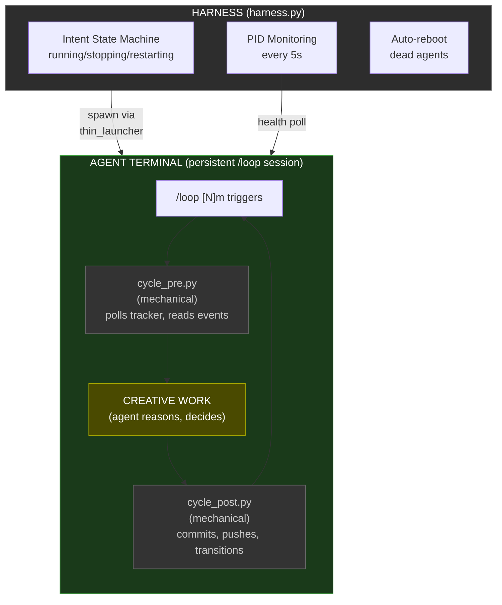
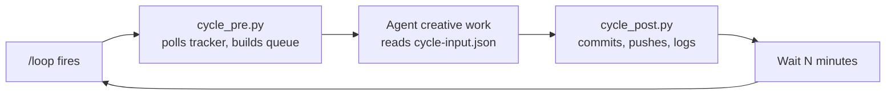
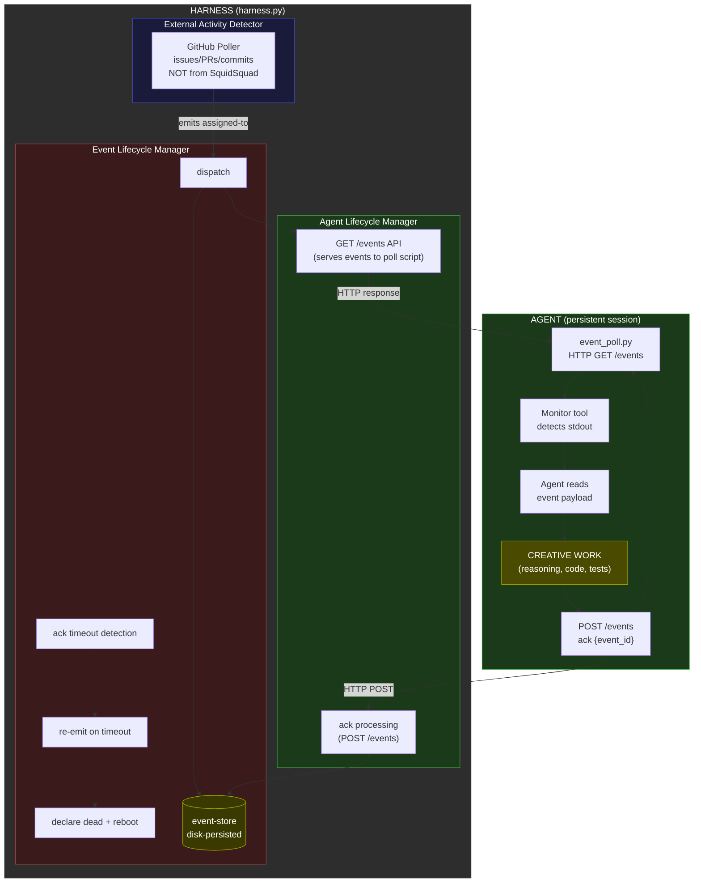
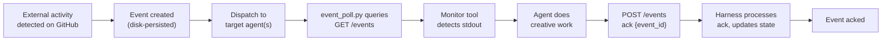
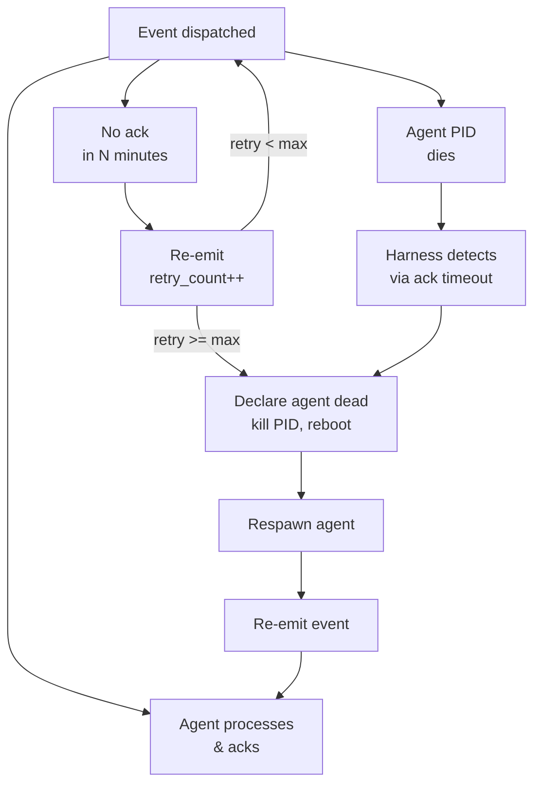
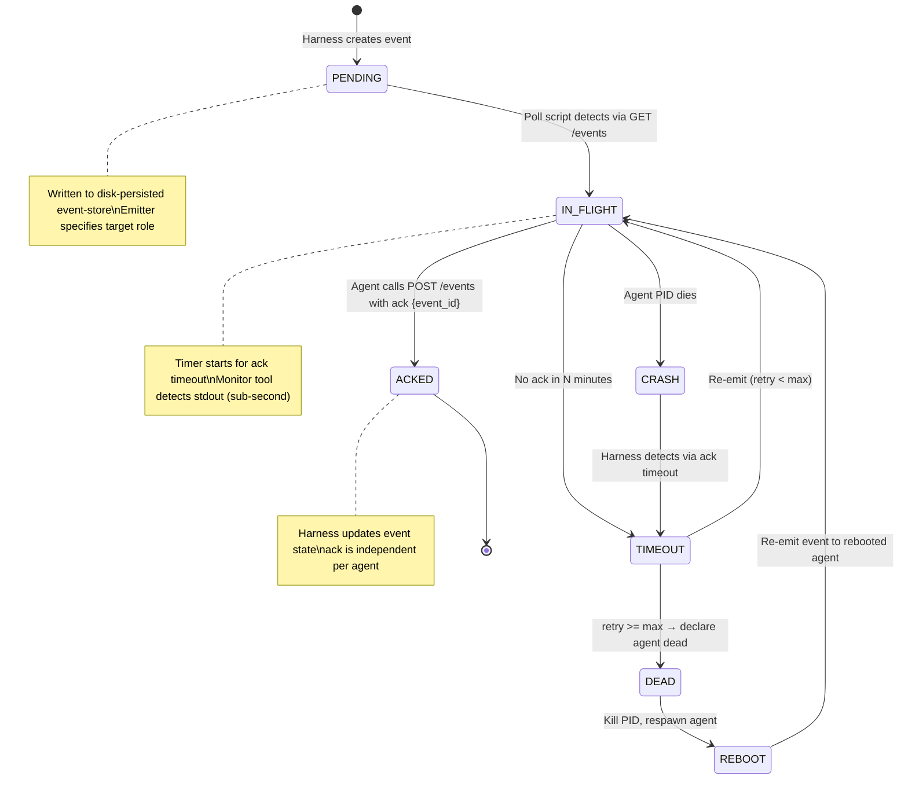

# FEAT-PM-7630 PRD — Event-Driven Agent Architecture

## Summary

**What was researched**: The entire SquidSquad agent lifecycle — from harness.py (FastAPI lifecycle manager, references/scripts/harness.py), through the Ralph Loop cycle scripts (cycle_pre.py, cycle_post.py, cycle.py), event bus (event_bus.py, event_bus_reader.py, event_catalog.py, event_validator.py), configuration (config.py), agent boot (thin_launcher.py, boot_remote.py), composition (compose.py), and all agent-facing templates (cycle-runner.md, event-reactions.md, agent-instructions.md, and 150+ sub-skills across 4 roles).

**Recommendation**: The migration is feasible with caveats. The event bus infrastructure (#4709, #5622) is already 70% built — harness has POST/GET /events endpoints, bounded event stream, cursor-based consumption, per-role event filtering. What's missing is: (a) harness-owned external activity detector that monitors GitHub and emits assigned-to for PM triage, (b) ack-based event closure via POST /events (agent emits ack event after handling), (c) agent template rewrite from /loop-based polling cycles to event-driven wake via Monitor tool + event_poll.py, (d) event bus disk persistence for crash recovery, (e) ack-based health monitoring (no ack within timeout → retry → after N retries → declare dead, kill PID, reboot). Phase 1.5 (prerequisites) must ship before any template changes.

**Primary risks**: (1) Monitor tool is the sole wake mechanism — if it has limitations (timeout, reconnection, Windows support), the architecture degrades. (2) Ack timeout must be tuned correctly to avoid false-positive death declarations on long-running work. (3) External activity detector must reliably filter SquidSquad's own changes to prevent event loops. (4) Event bus is in-memory only — crash loses all events. Must add disk persistence first.

## Vault Context

- **BRIEFING.md priorities**: #7630 EPIC explicitly listed as active priority; supersedes #6056, #5775, #5613. "All mechanical cycle steps move to harness."
- **Related decisions**: [[decision-cycle-runner-architecture]] — The cycle_pre/cycle_post split (#2057) was the intermediate step toward this EPIC. The decision explicitly references #7630 as the successor. All mechanical operations must move into harness.
- **Related patterns**: [[pattern-deterministic-scripts-over-prose]] — "Cyclic/mechanical agent work must be programmatic, not LLM-interpreted prose." This is the foundational pattern driving #7630. Agents should react to events, not run multi-step cycles.
- **Human preferences**: "any kind of cyclic work needs to be programmed deterministically" — LLMs reliably drop steps when context compresses. Agents should react to events, not run multi-step cycles. PID-first liveness, OS-level truth over application state. Terse, direct communication.
- **Related learnings**: [[decision-self-healing-sentinel]] — two-tier self-healing (immediate unstick + root-cause bug filing) applies to ack timeouts too. If an agent fails to ack, the harness escalates through retry → kill/reboot → file bug.

## Impact Analysis

- **Files touched**:
  - **harness.py** (references/scripts/harness.py, ~1429 lines): Ack processing in existing POST /events handler; EventLifecycleManager class (dispatch, timeout scan, retry/escalation, disk persistence); external activity detector (GitHub polling for non-SquidSquad activity, emits assigned-to for PM); per-role in-flight event queue; thread safety hardening
  - **event_bus.py** (references/scripts/event_bus.py, ~104 lines): Add `ack(event_id, role)` function; add disk outbox fallback
  - **event_bus_reader.py** (references/scripts/event_bus_reader.py, ~90 lines): No functional changes needed — query already supports filtering
  - **event_catalog.py** (references/scripts/event_catalog.py, ~218 lines): Add 5 L1 event types to RECOGNIZED: assigned-to, stop-requested, shipped, version-bump, ack
  - **cycle_pre.py** (references/scripts/cycle_pre.py, ~1060 lines): Absorbed into harness for event-driven mode. Retained during development phases. Removed in Phase 4.
  - **cycle_post.py** (references/scripts/cycle_post.py, ~747 lines): Absorbed into harness for event-driven mode. Retained during development phases. Removed in Phase 4.
  - **thin_launcher.py** (references/scripts/thin_launcher.py, ~118 lines): Boot prompt changes for event-driven mode
  - **boot_remote.py** (references/scripts/boot_remote.py, ~653 lines): Return terminal PID for cleanup; no event payload passing needed
  - **event_poll.py** (references/scripts/event_poll.py, ~30 lines): **NEW** — lightweight HTTP poll script querying `GET /events?since=<cursor>&role=<role>`, outputs new events to stdout for Monitor tool
  - **config.py** (references/scripts/config.py, ~575 lines): New config section `## Event Driven` with new FIELD_MAP entries
  - **tracker.py** (references/scripts/tracker.py): No functional changes needed — already emits events (harness-internal observability)
  - **cycle.py** (references/scripts/cycle.py, ~287 lines): No changes — still used for timestamps/status-bar/iteration-log
  - **compose.py** (references/scripts/compose.py): Template changes auto-propagate via compose
  - **Agent templates**: cycle-runner.md → replaced by event-driven-workflow.md; event-reactions.md → deleted (replaced by event-driven-workflow.md); self-restart.md → removed (harness handles via ack timeout); interval-sync.md → removed; all role instructions.md files → updated
  - **Sub-skill manifest**: cycle-runner.md removed from all includes.yml; event-driven-workflow.md added
  - **Tests**: ~15 test files need updates (test_cycle_pre, test_cycle_post, test_event_bus, test_event_bus_reader, test_harness, test_feat_6126, test_start_team, test_thin_launcher, test_event_config, test_event_validator, test_event_derivation, test_event_catalog)

- **Behavior changes**:
  - Agents no longer self-loop via `/loop` — harness delivers events, agents wake via Monitor tool + event_poll.py
  - Agents sit idle (persistent Claude session alive, Monitor tool watching) until harness delivers events
  - Harness owns all "should I work?" decisions — agents only do creative work
  - Ack-based closure: agent emits `ack {event_id}` via POST /events after handling any event (universal mechanism)
  - Ack-based health monitoring: no separate health watcher polling PIDs. Harness sends event → no ack within timeout → retry → after N retries → declare agent dead, kill PID, reboot
  - cycle_pre and cycle_post absorbed into harness — no mechanical scripts for agents in event-driven mode
  - No more quiet cycles — harness only wakes agents when work exists
  - Context-pressure monitoring moves entirely to harness

- **Dependencies**:
  - Requires Phase 1.5 prerequisites (disk persistence, clone discovery fix, per-role event queue, thread safety)
  - Requires Claude Code subprocess control (kill + respawn)
  - Depends on existing event bus infrastructure (#4709, #5622, #5868, #6126)
  - Depends on harness lifecycle management (#4966) — already shipped
  - Depends on compose.py + event_validator.py (#5868) — already shipped

## Side Effects

- **Risk 1**: Monitor tool is the sole wake mechanism — if it has limitations (1-hour timeout, single subscription, Windows quirks), the entire architecture degrades — Severity: H — Mitigation: Validate Monitor tool API before prototyping Phase 2. Agent runs `event_poll.py` (queries harness `GET /events` API), Monitor tool watches script stdout. No file-based delivery. If Monitor tool is insufficient, fall back to stateless spawn (PHASE2-PREP Option A).
- **Risk 2**: Ack timeout false-positive — agent is working on a long task, doesn't ack within timeout, harness declares agent dead and kills PID — Severity: H — Mitigation: Timeout must be generous (configurable, default 10 min). Agent should send interim ack for long-running work. Harness checks PID via OS before killing.
- **Risk 3**: Agent terminal sits idle for long periods — human observes blank terminal and thinks agent is dead — Severity: M — Mitigation: Status bar must show "idle — waiting for events" with a pulse animation. The harness console shows which agents are waiting and why.
- **Risk 4**: If harness crashes while events are in-flight, event state is lost (in-memory only) — Severity: H — Mitigation: Phase 1.5 adds disk persistence (.squidsquad/.event-state.json). On crash recovery, harness replays open events.
- **Risk 5**: External activity detector reacts to SquidSquad's own GitHub changes → event loop — Severity: H — Mitigation: Filter by squidsquad label and agent commit prefix. Must NOT react to SquidSquad's own changes (Locked Decision 9).

## Edge Cases

- **No events for long periods**: Agent sits idle. Harness writes "idle" to status bar. Agent process alive, Monitor tool watching event_poll.py output. No cycle logs written (no work). Human sees "idle — waiting for events" for hours/days. This is correct behavior. Harness can optionally send periodic heartbeat events.
- **Event storm (many events arrive simultaneously)**: Per-role in-flight queue caps at 50 events. After cap, oldest pending events are dropped with a counter increment. Agent receives first event, processes, acks it, then immediately receives next. Monitor tool naturally queues notifications behind current work. No starvation.
- **Agent crashes mid-work**: Harness detects via ack timeout (event sent, no ack within timeout, retries exhausted). Harness kills PID, reboots agent. On respawn, agent reads working-state.md and resumes. The event is re-emitted to the rebooted agent.
- **Ack timeout**: If an event is dispatched but not acked within N minutes (configurable), harness re-emits it. Re-emission count tracked. After max retries, harness declares agent dead, kills PID, reboots agent, re-emits event to rebooted agent. If reboots also fail, harneess escalates to PM (self-healing tier 2).
- **Clone isolation**: Agent clones may not share filesystem with harness. The poll script reads `.harness-port` locally and queries the harness HTTP API directly — no filesystem coordination between harness and clones needed. Ack also uses the HTTP API.
- **Multi-agent broadcast**: Announcement events (shipped, version-bump) are dispatched to all agents. Each agent acks independently. Harness does NOT wait for all agents to ack — each ack is independent (Locked Decision 4). No multi-consumer tracking.

## Integration Risks

- **Compose/deploy integration**: Changing sub-skills and includes.yml requires compose.py deploy-all. Event contract derivation (#5868) must work with new event types. Must add new types to event_catalog.py RECOGNIZED tier before compose runs.
- **Harness merge (#6126)**: Harness already owns PR merge + compose. The event-driven model extends this — harness merge emits shipped or assigned-to, which wakes relevant agents. No conflict; it's the same pattern.
- **Tracker authority**: tracker.py already emits status-transition events. These are harness-internal (observability only). The harness external activity detector detects new issues/comments on GitHub and emits assigned-to for PM to triage.
- **Config.md versioning**: New config section "## Event Driven" must be added to config.md. The upgrade path must handle existing configs that lack this section (graceful default: all features enabled with sensible defaults).

## Upgrade & Migration

- **New config values**:
  - `event-timeout-minutes` (Event Driven → Timeout Minutes): integer — default "10". How long before an unacknowledged event times out and re-emits.
  - `event-max-retries` (Event Driven → Max Retries): integer — default "3". Max re-emission attempts before declaring agent dead and rebooting.
  - `event-poll-interval` (Event Driven → Poll Interval Seconds): integer — default "30". How often the external activity detector polls GitHub.
  - `event-queue-cap` (Event Driven → Queue Cap): integer — default "50". Max events per agent in-flight queue.
  - `scan-cooldown` (Event Driven → Scan Cooldown Minutes): integer — default "15". Minutes between self-initiated improvement scans.

- **New files**: 
  - `.squidsquad/.event-state.json` — disk-persisted event state (in-flight events, ack status, retry counts)
  - `references/sub-skills/common/event-driven-workflow.md` — new sub-skill replacing cycle-runner.md
  - `references/scripts/event_poll.py` — HTTP poll script for Monitor tool (queries harness API, outputs events to stdout)

- **Template changes**:
  - **Removed sub-skills**: `common/cycle-runner`, `common/context-pressure` (moves to harness), `common/interval-sync` (no more /loop), `common/self-restart` (harness handles via ack timeout), `common/boot-remote-agents` (harness owns boot)
  - **Added sub-skills**: `common/event-driven-workflow` — how agents receive events, process them, and ack them
  - **Deleted sub-skills**: `common/event-reactions` — deleted entirely, replaced by `common/event-driven-workflow`
  - **Role instructions.md**: Remove all Ralph Loop references, /loop invocation, cycle numbering. Replace with "Use the Monitor tool with event_poll.py to watch for events from the harness."
  - **agent-instructions.md**: Regenerated via compose.py deploy-all
  - **All role SOUL.md files**: Remove Ralph Loop references

- **Upgrade steps**:
  1. Stop all agents (`start_team.py --stop --all` or Ctrl+C harness)
  2. Pull latest code containing #7630 changes
  3. Run `python references/scripts/compose.py deploy-all` — regenerates all CLAUDE.md + SOUL.md
  4. Clean stale sentinel files from clone directories
  5. Start harness (`python references/scripts/harness.py`) — auto-spawns agents in event-driven idle mode

## Architecture Diagrams

### 2.1 Current Architecture (Cycle-Based)



**Cycle flow** — agent self-loops via `/loop`, deciding what to do each cycle:



**Component ownership in current architecture:**

| Concern | Owner | Mechanism |
|---------|-------|-----------|
| Activation | Claude Code `/loop` | Cron-like re-invocation every N minutes |
| Health monitoring | harness.py | PID check every 5s, auto-reboot dead agents |
| Git pull/push | cycle_pre/post.py | Scripts called by agent each cycle |
| Work detection | Agent (LLM) | Agent reads tracker, decides if work exists |
| Status transitions | cycle_post.py | Reads cycle-output.json, calls tracker.py |
| Scanning (quiet cycles) | Agent (LLM) | Agent decides to scan when no work |
| Stopping | harness.py | Intent API, queried by cycle_post.py |
| Restarting | harness.py | Intent API + context pressure exit 42 |
| Event bus | harness.py | In-memory deque, POST/GET /events |

### 2.2 Target Architecture (Event-Driven)



**Event flow** — harness detects work, dispatches to agent, agent acks via POST /events:



**Failure paths:**



### 2.3 Architecture Comparison Table

| Concern | Current (Cycle-Based) | Target (Event-Driven) |
|---------|----------------------|----------------------|
| **Activation** | `/loop` cron-like re-invocation every N minutes | Harness external activity detector → poll script queries `GET /events` → Monitor tool detects stdout → agent wakes (persistent session) |
| **Health** | harness.py PID poll every 5s | Ack-based: no ack within timeout → retry → after N retries → declare dead, kill PID, reboot |
| **Git pull** | cycle_pre.py per cycle (agent-initiated) | Harness git operations on event dispatch; agent works on latest code |
| **Git commit/push** | cycle_post.py per cycle (agent-initiated) | Agent commits after creative work; harness pushes after processing ack |
| **Work detection** | Agent (LLM) reads tracker, builds queue | Harness external activity detector detects new/updated GitHub issues/PRs → emits assigned-to for PM triage |
| **Status transitions** | cycle_post.py reads cycle-output.json | Harness processes transitions internally; agent focuses on creative work |
| **Scanning** | Agent decides on quiet cycles | Agent self-initiates per cooldown (15 min, scan immediately on idle) |
| **Stopping** | Intent API queried by cycle_post.py | Harness emits stop-requested event; agent finishes current event atomically, acks, exits |
| **Restarting** | cycle_post.py exit 42 on context pressure | Harness monitors context-pressure; sends stop-requested, then respawns agent |
| **Idle behavior** | "Quiet cycle" — agent still runs full cycle_pre → creative → cycle_post | Agent process alive, Monitor tool watching event_poll.py stdout. Zero context consumption. Zero API calls until event arrives. |
| **Observability** | cycle_start/end events, iteration logs per cycle | Event lifecycle events (dispatched, acked, timed-out), iteration logs per wake |
| **Error recovery** | cycle_post.py exit codes, harness auto-reboot | Ack timeout → re-emit → max retries → declare dead + reboot. Unacked events = diagnostic signal. |

## Event System Design

### 3.1 Event Lifecycle Diagram



### 3.2 Event Types Table

The event model uses 5 event types, all at L1 (universal). Previous versions of this PRD had 30+ event types across L1-L4; this was consolidated after architectural audit. The key insight: the forge (GitHub Issues/PRs) already contains all work context — events are routing signals, not context carriers. Agents read the forge to understand what's needed, not the event payload.

| Event Type | Direction | Payload | Trigger | Agent Reaction |
|---|---|---|---|---|
| **assigned-to** | agent/human/harness → target agent | `{role, issue_or_pr}` | Work handoff — one agent/human passes responsibility to another. Also emitted by external activity detector when new GitHub activity detected. | Read the issue/PR from the forge, act per your role. Emit `ack` when done. |
| **stop-requested** | agent/human/harness → target agent | `{source, target}` | Graceful shutdown — source can be another agent, human (Ctrl+C), or harness (e.g., context pressure) | Finish current event atomically, checkpoint working-state, stop Monitor, emit `ack`. |
| **shipped** | DM → harness → all agents | `{issue_or_pr}` | DM marks delivery complete | Read, update status line. Emit `ack`. |
| **version-bump** | DM → harness → all agents | `{version}` | DM cuts a new version | Read, update status line. Emit `ack`. |
| **ack** | agent → harness | `{event_id}` | Agent confirms it handled an event | Harness marks event as handled. If acking `stop-requested`: harness treats as shutdown confirmation. If reboot requested: harness kills PID and restarts agent. No ack within timeout: harness re-emits, then escalates. |

**Design principles:**
- **Forge is the source of truth.** `assigned-to` carries only {role, issue/pr number}. All context — comments, status, history, findings — lives in the GitHub Issue or PR. The agent reads the forge when it receives the event.
- **Events are atomic.** When an agent is processing an event, it completes the entire unit of work before picking up the next event. Monitor tool notifications naturally queue behind the current event.
- **Every event gets an `ack`.** Universal closure mechanism. Agent emits `ack {event_id}` via `POST /events` after handling any event. Harness uses `ack` for lifecycle tracking (timeout detection, re-emission, health monitoring). An `ack` of `stop-requested` = agent stopped. No separate `stopped` event needed.
- **Each ack is independent.** Harness does NOT wait for all agents to ack broadcast events. Each agent acks independently. No multi-consumer tracking.
- **Ack-based health monitoring.** No separate health watcher polling PIDs. If harness sends event and gets no ack within timeout, it retries. After N retries, declares agent dead, kills PID, reboots.
- **No L2/L3 event-reaction sub-skills needed.** Roles already know how to handle issues from their existing role instructions. The event model does not add event-specific per-role guidance.
- **All events are L1 (universal).** Every agent handles these identically at the event protocol level. Role-specific behavior comes from the role's existing instructions, not from event-reaction files.
- **Emitter specifies target.** The source of an event specifies which role(s) should receive it, rather than consumers being determined by event type.

**Harness-internal events (not delivered to agents):**

The harness tracks additional internal state (git operations, health checks, audit trail) but does NOT deliver these as events to agents. These are harness observability only: `git-pull`, `git-push`, `git-commit`, `branch-checkout`, `pr-create`, `compose-completed`, `status-transition`, `tracker-comment`, etc.

**External activity detector (harness-internal):**

The harness monitors GitHub for issues, PRs, and commits NOT created by SquidSquad agents (filtered by squidsquad label or agent commit prefix). When external activity is detected, the harness emits `assigned-to` for the PM agent to triage. The detector must NOT react to SquidSquad's own changes. This is harness-internal — no new event types are exposed to agents.

**Behavioral tuning defaults (L1, overridable at L4 via config.md):**
- `scan-cooldown`: 15 minutes between scans (scan immediately on idle, then cooldown)
- `events-atomic`: true (events are never interrupted mid-handling)

These defaults are defined at L1 (universal, ships with SquidSquad core). Projects can override them at L4 via config.md.

**Future event types (out of scope for #7630):**
- Chat events (agent-to-agent and human-to-agent messaging) — separate task

### 3.3 Event Flow Examples

**Example 1: QA finds gaps in dev's work**
1. QA verifies #123, finds 3 gaps, comments on the issue with findings
2. QA tells harness: fire `assigned-to` for `skill` on `#123`
3. Harness emits `assigned-to {role: "skill", issue_or_pr: 123}` with event_id `evt-abc`
4. Dev's Monitor picks it up, dev reads #123, sees QA's comments, fixes gaps
5. Dev emits `ack {event_id: "evt-abc"}` via POST /events — harness marks event handled

**Example 2: Human requests agent stop via Ctrl+C**
1. Human presses Ctrl+C at harness terminal
2. Harness emits `stop-requested {source: "human", target: "skill"}` with event_id `evt-def` (and for each other agent)
3. Skill agent finishes current event atomically, checkpoints working-state, stops Monitor
4. Skill agent emits `ack {event_id: "evt-def"}` via POST /events — harness recognizes this as shutdown confirmation
5. Each agent acks independently. Harness exits when all stop-requested events are acked or agents are confirmed dead.

**Example 3: DM ships a task**
1. DM completes delivery for #456, emits `shipped {issue_or_pr: 456}` with event_id `evt-ghi`
2. Harness relays to all agents
3. All agents update status line, each independently emits `ack {event_id: "evt-ghi"}` via POST /events

**Example 4: External activity detected on GitHub**
1. Human files a new issue #999 on GitHub (not a SquidSquad agent)
2. Harness external activity detector polls GitHub, detects new issue without squidsquad label
3. Harness emits `assigned-to {role: "pm", issue_or_pr: 999}` with event_id `evt-jkl`
4. PM's Monitor picks it up, PM reads #999, triages: labels, assigns, fires further assigned-to events as needed
5. PM emits `ack {event_id: "evt-jkl"}` — harness marks event handled

**Example 5: Ack timeout — agent unresponsive**
1. Harness emits `assigned-to {role: "skill", issue_or_pr: 789}` with event_id `evt-mno`
2. No `ack` received within timeout (10 min)
3. Harness re-emits the event (retry_count: 1)
4. Still no ack after 3 retries
5. Harness declares skill agent dead, kills PID, reboots agent
6. Event re-emitted to rebooted agent

## Harness API Reference

### 4.1 Existing Endpoints (harness.py)

| Method | Path | Description | Request | Response |
|---|---|---|---|---|
| GET | `/status` | Harness + all agent health (line 563) | None | `{harness: {status, port, uptime}, agents: [...]}` |
| GET | `/agents` | List all agents with state (line 579) | None | `{agents: [{role, status, intent, ...}]}` |
| GET | `/agents/{role}` | Get single agent state (line 649) | None | `{role, status, intent, claude_pid, ...}` |
| GET | `/agents/{role}/health` | Agent health detail (line 689) | None | `{role, alive, status, last_cycle, current_phase, context_pressure}` |
| GET | `/agents/{role}/config` | Agent config sync state (line 726) | None | `{role, branch_workflow, pr_flow, interval_minutes, version}` |
| POST | `/agents/all/start` | Spawn all agents (line 586) | None | `{results: [{role, action, success, message}]}` |
| POST | `/agents/all/stop` | Stop all agents (line 611) | None | `{results: [{role, action, success, message}]}` |
| POST | `/agents/{role}/start` | Spawn agent (line 660) | None | `{role, action, success, message}` |
| POST | `/agents/{role}/stop` | Stop agent via intent (line 890) | None | `{role, action: "stop", message}` |
| POST | `/agents/{role}/restart` | Restart agent via intent (line 907) | None | `{role, action: "restart", success, message}` |
| POST | `/shutdown` | Stop all agents + exit harness (line 939) | None | `{status: "shutting_down", message}` (202 Accepted) |
| POST | `/events` | Receive event from agent script (line 827) | `{event_type, role, payload?, cycle_number?}` | `{status: "ok"}` |
| GET | `/events` | Retrieve events with filtering (line 857) | query: `?since=&role=&event_type=&limit=` | `{events: [...], total: N}` |
| POST | `/merge` | Async merge PR + compose if needed (line 1081) | `{pr_number, branch, role}` | `{status: "accepted", message}` (202 Accepted) |

### 4.2 New Endpoints Required

| Method | Path | Description | Request | Response |
|---|---|---|---|---|
| GET | `/events/{id}` | Get single event state | None | `{id, event_type, status, acked_by, retry_count, created_at, dispatched_at, acked_at}` |
| POST | `/events/replay` | Replay events from disk after crash | None | `{replayed: N, failed: M}` |
| GET | `/monitors` | Get status of external activity detector | None | `{github_detector: {status, last_check, last_activity}}` |
| POST | `/monitors/reset` | Reset the external activity detector | `{monitor: "github_detector"}` | `{status: "reset", monitor}` |
| GET | `/events/in-flight/{role}` | Get agent's current in-flight events | None | `{role, in_flight: [{id, event_type, dispatched_at, age_seconds}]}` |

**Note**: The `POST /events/{id}/complete` endpoint from earlier PRD drafts is removed. Agents signal completion by emitting an `ack` event via the existing `POST /events` endpoint — same mechanism as any other event. Harness processes the ack in the existing receive_event handler. No dedicated closure endpoint needed.

### 4.3 Harness State Model

**.harness-state.json** (existing + new fields):

```json
{
  "harness_pid": 12345,
  "start_time": 1715000000.0,
  "port": 7373,
  "agents": {
    "skill": {
      "intent": "running",
      "status": "idle",
      "boot_time": 1715000100.0,
      "clone_path": "/path/to/clone",
      "claude_pid": 67890,
      "current_cycle": null,
      "last_cycle_start": null,
      "last_cycle_end": null,
      "last_cycle_type": null,
      "current_phase": "idle",
      "in_flight_events": ["a1b2c3d4"],
      "last_wake_at": 1715000200.0,
      "idle_since": 1715000250.0
    }
  },
  "event_state": {
    "last_processed_id": "x9y8z7w6",
    "in_flight": {
      "a1b2c3d4": {
        "event_type": "assigned-to",
        "status": "in-flight",
        "acked_by": [],
        "retry_count": 0,
        "created_at": 1715000100.0,
        "dispatched_at": 1715000105.0,
        "timeout_at": 1715000705.0,
        "acked_at": null
      }
    }
  }
}
```

**New fields added:**
- `agents.<role>.in_flight_events`: list of event IDs currently being processed
- `agents.<role>.last_wake_at`: timestamp of last harness-initiated wake
- `agents.<role>.idle_since`: timestamp when agent went idle
- `event_state`: new top-level key — persisted event lifecycle state
- `event_state.in_flight.<id>.acked_by`: list of roles that have acked (for broadcast events — observability only, not gating)
- `event_state.in_flight.<id>.status`: "pending" | "in-flight" | "acked" | "timed-out"

**Persisted**: `harness_pid`, `start_time`, `port`, `agents.*`, `event_state.*` (all saved to disk on change)
**In-memory only**: `EventStream._events` deque (bounded history, replayed from event_state on crash)

## Changes Required

### 5.1 Harness Changes (harness.py)

**Modified existing endpoint:**

1. **POST /events** (modify receive_event, line 827): Add ack processing. When event_type is "ack", look up the referenced event_id, mark it as acked by the emitting role. If ack references a stop-requested event, treat as shutdown confirmation. Update event_state and persist.

**New endpoints:**

2. **GET /events/{id}** — single event state lookup for debugging/observability

3. **POST /events/replay** — replay from disk on crash recovery

4. **GET /monitors** — external activity detector status

5. **GET /events/in-flight/{role}** — agent's current event queue

**External activity detector (new, add after line 402):**

6. **GitHub poller** (~120 lines): Background daemon thread that polls GitHub API every N seconds for issues, PRs, and commits. Filters out activity created by SquidSquad agents (check for squidsquad label or agent commit prefix). When external activity detected, emits `assigned-to {role: "pm", issue_or_pr: <number>}`. Uses cursor-based polling (store last-seen updatedAt/createdAt).

**Event lifecycle management (new class, ~180 lines):**

7. **EventLifecycleManager** class:
   - `dispatch(event, target_role)` — marks event as in-flight, serves via GET /events API
   - `process_ack(event_id, role)` — marks event as acked by role, updates state
   - `timeout_scan()` — background thread checks for timed-out events (no ack within timeout), re-emits or escalates
   - `escalate(event_id)` — after max retries, declares agent dead, kills PID, reboots, re-emits event
   - `persist()` / `load()` — disk persistence to `.squidsquad/.event-state.json`

**State persistence modifications:**

8. **`save_state()`** (line 298): Add `event_state` to persisted data
9. **`load_state()`** (line 328): Add `event_state` restore logic + replay in-flight events

**Thread safety fixes:**

10. **`EventStream`** already has `threading.Lock` (lines 365-366). Verify all access paths use the lock.
11. **`HarnessState._lock`** (line 125): Already used for agents dict. Extend to cover new event_state.
12. **`EventLifecycleManager`** needs its own `threading.Lock` for dispatch/ack operations.

**New imports needed:**
- `import threading` (already present)
- `from event_catalog import EMITTED, RECOGNIZED` for event validation

### 5.2 Script Changes

**cycle_pre.py** (references/scripts/cycle_pre.py):
- **ABSORBED INTO HARNESS** — per Locked Decision, cycle_pre.py is eliminated in event-driven mode. Its operations move to:
  - Git pull → harness executes before dispatching events
  - Branch enforcement → harness pre-work operation
  - Context pressure read → harness monitors internally
  - Working state read → agent reads directly on wake
  - Tracker queries → replaced by harness external activity detector
  - Event bus read → harness event lifecycle manager (IS the event system)
  - Mechanical reactions → harness processes inline on event receipt
- **File disposition**: Retained during development phases. Removed in Phase 4.

**cycle_post.py** (references/scripts/cycle_post.py):
- **ABSORBED INTO HARNESS** — per Locked Decision, cycle_post.py is eliminated in event-driven mode. Its operations move to:
  - Status transitions → harness executes internally (harness-internal, not agent-facing)
  - Tracker comments → harness executes internally
  - Git commit/push → harness executes after processing ack
  - Iteration logging → harness writes per-event log entry
  - Version bump (DM) → harness processes on `version-bump` event
  - Working state update → agent writes directly; harness commits
  - Stop-after-cycle check → replaced by `stop-requested` event on event bus
  - Event cursor advancement → replaced by event lifecycle manager (acked events)
- **File disposition**: Retained during development phases. Removed in Phase 4.

**event_bus.py** (references/scripts/event_bus.py):
- **Add**: `ack(event_id, role)` function (~20 lines): POST ack event to `/events`. Fire-and-forget like `emit()`. The ack is an event with event_type="ack" and payload containing the event_id being acknowledged.
- **Add**: Disk outbox fallback: if harness unreachable, append ack to `.squidsquad/.event-outbox.json` for retry.

**event_catalog.py** (references/scripts/event_catalog.py):
- **Add to RECOGNIZED**: `assigned-to`, `stop-requested`, `shipped`, `version-bump`, `ack` — the 5 L1 event types with descriptions and planned sources.
- **Remove from active planning**: old event types that are now harness-internal only (`new-commits`, `new-issue`, `issue-updated`, `context-pressure`, `pr-conflict`, etc.) are not delivered to agents — they remain in EMITTED for harness observability but are not part of the agent-facing event model.

**event_bus_reader.py** (references/scripts/event_bus_reader.py):
- **No functional changes**. The `query()` function already supports role and event_type filtering. Agents use it through event_poll.py. The ack function lives in event_bus.py (write side).

**thin_launcher.py** (references/scripts/thin_launcher.py):
- **Modify**: Boot prompt (line 86): Change from `"Boot. Begin your first Ralph Loop cycle now."` to event-driven orientation: `"Boot. Run event_poll.py with Monitor tool to watch for events from the harness. Process each event and emit ack via POST /events when done."`
- **Add**: Return terminal PID to harness for terminal cleanup on stop/re boot.

**boot_remote.py** (references/scripts/boot_remote.py):
- **Modify**: `_spawn_windows` (line 395), `_spawn_macos`, `_spawn_linux` must return terminal PID alongside agent PID for terminal cleanup.
- **Modify**: `_find_boot_script()` (line 346): Always use thin launcher (legacy wrappers fully deprecated).

**config.py** (references/scripts/config.py):
- **Add FIELD_MAP entries** (after line 95):
  ```python
  "event-timeout-minutes": ("Event Driven", "Timeout Minutes"),
  "event-max-retries": ("Event Driven", "Max Retries"),
  "event-poll-interval": ("Event Driven", "Poll Interval Seconds"),
  "event-queue-cap": ("Event Driven", "Queue Cap"),
  "scan-cooldown": ("Event Driven", "Scan Cooldown Minutes"),
  ```

**tracker.py** (references/scripts/tracker.py):
- **No functional changes**. Already emits status-transition and tracker-comment events. These are harness-internal (observability only). The emission path is unchanged.

**cycle.py** (references/scripts/cycle.py):
- **No changes**. Still used for timestamps, status-bar, iteration-logs. The name "cycle" is legacy but the utilities remain.

### 5.3 Template Changes

**Sub-skills REMOVED from all includes.yml manifests:**

1. `common/cycle-runner` — replaced by `common/event-driven-workflow`
2. `common/context-pressure` — harness monitors this internally
3. `common/interval-sync` — no more /loop scheduling
4. `common/self-restart` — harness handles via ack timeout + reboot
5. `common/boot-remote-agents` — harness owns all boot decisions

**New sub-skill: `common/event-driven-workflow.md`**

Content outline:
```markdown
<!-- sub-skill: event-driven-workflow -->
## Event-Driven Workflow

You do NOT self-loop or poll for work. The harness monitors external systems and
delivers events to your inbox. You use the Monitor tool to watch for new events.

### Startup

On boot, use the Monitor tool to watch the output of `event_poll.py`:
```bash
Monitor: python references/scripts/event_poll.py [ROLE]
```
The poll script queries `GET /events?since=<cursor>&role=[ROLE]` from the harness
API. When new events arrive, it outputs them as JSON to stdout. The Monitor tool
detects the output and wakes you. When no events exist, sit idle.

Print: `[🦑 HH:MM:SS] Idle — polling harness for events...`

### Processing an Event

1. Read the event from the Monitor tool output (JSON on stdout):
   The event contains: `event_id`, `event_type`, and `payload`.

2. For `assigned-to`: the payload contains `{role, issue_or_pr}`. Read the issue/PR
   from the forge (GitHub). The forge is the source of truth — all context,
   comments, history, and findings live there. Act per your role.

3. For `stop-requested`: finish your current event atomically, checkpoint your
   working state to `.squidsquad/[ROLE]/working-state.md`, stop the Monitor tool,
   and emit `ack` for the stop-requested event.

4. For `shipped` / `version-bump`: read the payload, update your status line.

5. After completing your work, ack the event:
   ```bash
   python references/scripts/event_bus.py ack <event_id> [ROLE]
   ```
   This POSTs an `ack` event to the harness `/events` endpoint. The harness
   processes the ack: updates event state, commits/pushes your changes,
   and logs the event.

6. Resume watching the poll script output for the next event.

### What You Do NOT Do

- No `/loop` — the Monitor tool + event_poll.py replaces it
- No `cycle_pre.py` or `cycle_post.py` — harness handles all mechanical operations
- No `git pull` or `git push` — harness owns git operations
- No direct `tracker.py` calls for transitions/comments — harness handles internally
- No context pressure checking — harness monitors and restarts you if needed
- No self-restart — harness detects unresponsive agents via ack timeout

### Event Types and Responses

[See Section 3.2 of PRD for the 5-event model]
<!-- /sub-skill: event-driven-workflow -->
```

**Deleted sub-skill: `common/event-reactions.md`**

Deleted entirely — replaced by `common/event-driven-workflow.md`. The old event-reactions.md described per-event-type reaction tables. With the 5-event model, all event guidance lives in event-driven-workflow.md.

**No L2 event-reaction sub-skills needed.** The simplified 5-event model eliminates the need for per-role event-reaction files. Roles already know how to handle issues from their existing role instructions (L2 `instructions.md`). When an agent receives `assigned-to`, it reads the issue/PR and acts per its role — no event-specific guidance required.

**No L3 event-reaction overrides needed.** L3 domain variants (e.g., dev/skill vs dev/web) inherit L2 role behavior. Since event reactions are not event-type-specific but role-instruction-driven, domain variants naturally handle events through their existing domain knowledge.

**L4 — Project Overrides (config.md)**

Projects can override L1 behavioral tuning defaults via config.md:
- `Scan Cooldown`: minutes between scans (default: 15)
- `Timeout Minutes`: minutes before ack timeout (default: 10)
- `Max Retries`: re-emission attempts before declaring agent dead (default: 3)

These are the only event-related config fields. The L1 defaults ship with SquidSquad core; L4 overrides per-project.

**Includes.yml changes (all roles):**

Each role's `includes.yml` changes:
- REMOVE: `common/event-reactions` (old flat file)
- ADD: `common/event-driven-workflow` (L1 — how to watch inbox via Monitor, process events, ack)
- No new L2 event-reaction includes needed

**Role instructions.md changes (all 4 roles):**

- **REMOVE**: "When you first receive these instructions, first verify GitHub Issues access... Then invoke the `/loop` command"
- **REMOVE**: "## The Ralph Loop" section header and "Each invocation executes one cycle..." prose
- **REMOVE**: `/loop [INTERVAL]m execute one Ralph Loop cycle`
- **REMOVE**: "Print the cycle-complete marker. This cycle is finished — /loop will trigger the next one."
- **REPLACE WITH**: "When the harness boots you, use the Monitor tool with event_poll.py to watch for events. Process events as they arrive and ack them via the harness API."
- **ADD**: "The harness monitors GitHub and agent health. It delivers events to your inbox when there's work. You do not poll or self-schedule."

**Role SOUL.md changes:**
- Remove Ralph Loop references ("You follow the Ralph Loop" → "You react to events dispatched by the harness")
- NO event-reaction behavioral tuning in SOUL.md — soul is personality only

### 5.4 Config Changes

**New config section in config.md:**

```markdown
## Event Driven

- **Timeout Minutes**: 10
- **Max Retries**: 3
- **Poll Interval Seconds**: 30
- **Queue Cap**: 50
- **Scan Cooldown Minutes**: 15
```

**FIELD_MAP additions** (config.py, after line 95):
```python
"event-timeout-minutes": ("Event Driven", "Timeout Minutes"),
"event-max-retries": ("Event Driven", "Max Retries"),
"event-poll-interval": ("Event Driven", "Poll Interval Seconds"),
"event-queue-cap": ("Event Driven", "Queue Cap"),
"scan-cooldown": ("Event Driven", "Scan Cooldown Minutes"),
```

## Prerequisites (Phase 1.5)

These infrastructure items MUST ship before event-driven wake can work:

### P-1: Event Bus Disk Persistence
- **What's broken today**: `EventStream` (harness.py line 361) is purely in-memory (`collections.deque`). Harness crash = all events lost. No crash recovery for in-flight events.
- **Fix**: Add `.squidsquad/.event-state.json` file. Persist on every `EventLifecycleManager.dispatch()`, `process_ack()`, and `timeout_scan()`. On harness boot, `load_state()` (line 328) reads the file and replays open events. In-flight events with `dispatched_at` but no `acked_at` are re-dispatched.
- **Files changed**: `harness.py` (new `EventLifecycleManager` class, modify `save_state()`/`load_state()`)

### P-2: Clone Event Bus Discovery Fix
- **What's broken today**: `event_bus.py._discover_port()` (line 28) and `event_bus_reader.py._discover_port()` (line 27) walk parent directories to find `.harness-port`. In clone isolation, an agent clone at `/projects/proj-skill` may not be a child of the primary repo at `/projects/proj`. The parent-dir walk fails.
- **Fix**: Harness already distributes `.harness-port` to each clone's `.squidsquad/` directory (harness.py line 465-477, deferred init). The discover functions check direct path first (which works for clones). Remove the parent-dir walk for clones and always rely on the direct `.harness-port` file (distributed by harness).
- **Files changed**: `event_bus.py` (simplify `_discover_port()`), `event_bus_reader.py` (simplify `_discover_port()`)

### P-3: Per-Role In-Flight Event Queue
- **What's broken today**: All events go into a single `EventStream` deque. No per-agent queue. No way to know which agent is processing which event. No way to cap events per agent.
- **Fix**: Add `AgentState.in_flight_events: list[str]` to the slots (currently not present — line 71-74). Add `EventLifecycleManager._role_queues: dict[str, list[str]]`. Cap at `event-queue-cap` (default 50). When cap exceeded, drop oldest pending event and increment a counter.
- **Files changed**: `harness.py` (add slot to AgentState, add queue management to EventLifecycleManager)

### P-4: Harness Thread Safety
- **What's broken today**: `HarnessState._lock` (line 125) protects the agents dict. `EventStream._lock` (line 366) protects the event deque. But `save_state()` (line 298) and `update_health()` (line 155) access both under separate locks — a health update could interleave with a save, producing inconsistent state.
- **Fix**: Use a single re-entrant lock or ensure all multi-struct operations are atomic. `save_state()` already snapshots under `_lock` (line 305). The risk is `update_health()` calling `save_state()` while another thread also calls `save_state()`. The current atomic-write pattern (tmp file + replace, line 322-324) mitigates but doesn't prevent inconsistent snapshots.
- **Files changed**: `harness.py` (review all lock usage, ensure single-lock consistency for state persistence)

## Migration & Rollback

### Migration Steps (Ordered)

1. **Ship Phase 1.5 prerequisites** — disk persistence, clone fix, per-role queue, thread safety
2. **Ship harness changes** — ack processing in POST /events, EventLifecycleManager, external activity detector. All backward compatible.
3. **Ship script changes** — event_bus.py ack() function, event_poll.py, event_catalog.py updates. All backward compatible.
4. **Ship template changes** — event-driven-workflow.md sub-skill, updated role instructions, removed cycle-runner. Compose generates event-driven CLAUDE.md.
5. **Deploy** — run `compose.py deploy-all`. Restart harness. Agents now boot in event-driven mode.
6. **Observe** — monitor for one version. Fix issues.
7. **Cleanup Phase 4** — remove `/loop` references, remove legacy cycle-runner.md, remove context-pressure sub-skill, remove interval-sync sub-skill.

## Phasing Plan

### Phase 1.5: Prerequisites (Estimated: L)
**Deliverables**: 
- P-1: Event bus disk persistence (.event-state.json)
- P-2: Clone event bus discovery fix
- P-3: Per-role in-flight event queue
- P-4: Harness thread safety audit + fixes

**Success criteria**: 
- Harness crash + restart replays in-flight events
- Agent clones can reach harness event API from any path
- Each role has independent event queue with cap
- No race conditions detected under load

**Dependencies**: None (purely infrastructure)

### Phase 2: Event Driven + Ack (Estimated: L)
**Deliverables**:
- Ack processing in existing POST /events handler
- EventLifecycleManager (dispatch, process_ack, timeout_scan, escalate)
- External activity detector (GitHub polling, emits assigned-to for PM)
- event_bus.py ack() function
- event_poll.py — HTTP poll script for Monitor tool
- thin_launcher.py event-driven boot prompt
- boot_remote.py terminal PID return
- 5 event types added to event_catalog.py RECOGNIZED tier

**Success criteria**:
- Harness detects external GitHub activity → emits assigned-to for PM → PM triages
- Agent processes event → emits ack via POST /events → event marked acked
- Ack timeout → re-emit → max retries → agent declared dead, PID killed, rebooted
- Agent booted in event-driven mode sits idle with Monitor tool watching event_poll.py
- Agent crash mid-event → harness detects via ack timeout → escalates → reboots

**Dependencies**: Phase 1.5 complete

### Phase 3: Template Migration (Estimated: M)
**Deliverables**:
- New sub-skill: event-driven-workflow.md
- Deleted sub-skill: event-reactions.md (replaced by event-driven-workflow.md)
- Updated role instructions.md (all 4 roles + base)
- Updated role SOUL.md files
- Updated includes.yml manifests (all roles)
- Config.md new "Event Driven" section

**Success criteria**:
- Compose produces event-driven CLAUDE.md with correct sub-skills
- All comprehension tests pass
- Event contract derivation (#5868) works with new 5 event types

**Dependencies**: Phase 2 complete (event infrastructure works)

### Phase 4: Cleanup (Estimated: S)
**Deliverables**:
- Remove `/loop` references from remaining files
- Remove legacy sub-skills: cycle-runner.md, context-pressure.md, interval-sync.md, self-restart.md
- Archive: move to `references/sub-skills/legacy/` for reference
- Remove boot-remote-agents.md sub-skill
- Clean up cycle_pre.py polling remnants
- Clean up cycle_post.py context pressure remnants
- Update manifest.md sub-skill registry

**Success criteria**:
- No `/loop` or "Ralph Loop" references in any composed template
- No legacy sub-skills in active includes.yml manifests
- All tests pass without legacy references
- Upgrade path documented

**Dependencies**: Phase 3 complete + one version of dual-mode operation to confirm stability

## Risk Register

| Risk | Severity | Likelihood | Mitigation | Owner |
|------|----------|------------|------------|-------|
| Monitor tool behavior differs from assumptions (timeout, reconnection, Windows) | H | M | Validate Monitor tool API checklist before Phase 2. Fallback: stateless spawn (PHASE2-PREP Option A). Prototype early. | Skill |
| Ack timeout false-positive — agent working on long task, declared dead | H | M | Generous timeout (default 10 min, configurable). Agent can emit interim heartbeat ack for long work. Harness verifies PID via OS before killing. | Skill |
| Event storm overwhelms agent (rapid sequential events) | M | M | Per-role queue cap (50). Agent processes one event at a time (atomic). Monitor tool naturally queues behind current work. | Skill |
| External activity detector hits GitHub API rate limits | M | L | Poll interval 30-60s configurable. Use conditional requests (ETag/If-None-Match). Cache last-seen timestamps. | Skill |
| External activity detector reacts to SquidSquad's own changes → event loop | H | L | Filter by squidsquad label and agent commit prefix. Must NOT react to own changes. Test with real SquidSquad activity. | Skill |
| Agent idle terminal looks "dead" to human observer | M | H | Status bar shows "idle — waiting for events" with timestamp. Harness console shows all agent states. Health endpoint confirms alive. | PM |
| Template migration breaks existing installs | H | L | Phased rollout with backward-compatible script changes before template changes. Upgrade doc. | Skill |
| Harness resource usage with continuous detector thread | L | M | Single daemon thread with sleep intervals. Overhead <2% CPU on idle. | Skill |
| Ack loss — agent acks but harness doesn't receive (network blip) | M | L | event_bus.py ack() is fire-and-forget with disk outbox fallback (.event-outbox.json). Harness timeout + re-emit handles the case where ack is truly lost. Idempotent: duplicate acks are safe. | Skill |

## Open Questions

- **Q1**: RESOLVED — Wake mechanism is persistent session + Monitor tool + HTTP poll script (Locked Decision). event_poll.py queries harness `GET /events` API, Monitor tool watches script stdout, agent wakes within the same session. No file-based delivery, no kill/respawn. Validate Monitor tool API before Phase 2 implementation.
- **Q2**: Should the external activity detector live in harness.py as a thread or as a separate process? — **Why**: A thread crash takes down the harness (daemon threads share fate). Separate process (like watchdog.py) would be more resilient but adds complexity. The vault decision [[decision-watchdog-supervisor]] provides guidance — watchdog is a separate process. Proposed: start as harness thread for Phase 2, evaluate separate process for Phase 4 cleanup.
- **Q3**: How do we handle the "no events for hours" scenario for the human operator? — **Why**: Currently, the human sees cycle markers scrolling in agent terminals. With event-driven, terminals sit idle. Need a clear visual indicator that the system is healthy but waiting. Proposed: harness console dashboard showing all agent states and last event time.
- **Q4**: Do we keep cycle_number for iteration logs, or switch to event_id-based logging? — **Why**: "Cycle" concept goes away. But iteration logs are valuable audit trail. Proposed: keep iteration logs but number them sequentially per wake, not per cycle. Include triggering event_id in log metadata.

## Recommendation

**Feasible with caveats**. The infrastructure is 70% built (event bus, harness lifecycle, cursor-based consumption). The remaining 30% simplifies significantly from the original PRD: 5 events instead of 30+, ack-based closure via existing POST /events instead of a dedicated endpoint, ack-based health monitoring instead of separate PID poller, and monitors that translate to assigned-to instead of emitting their own event types. The biggest unknown is Monitor tool validation (Locked Decision prerequisite). The phased rollout strategy provides safe incremental delivery.

## Vault Candidates

- **Type**: pattern — **Ack-based health monitoring via event timeout** — **Why**: Using event acknowledgment timeouts instead of PID polling is a novel architectural pattern. If harness sends event and gets no ack within timeout → retry → after N retries → declare dead → kill PID → reboot. Replaces separate health watcher threads. Embodies [[decision-pid-primary-liveness]] in event-driven form. Reusable for any event-driven agent system.
- **Type**: decision — **Monitors translate external signals to assigned-to, never emit own event types** — **Why**: The architectural choice to have git watcher and GitHub watcher emit assigned-to for PM rather than their own event types (new-commits, new-issue, etc.) keeps the agent-facing event model at exactly 5 types. PM triages all external signals. This is a fundamental architectural constraint worth capturing.
- **Type**: learning — **Phased architectural migration** — **Why**: The strategy of shipping backward-compatible script changes before template changes, observing for one version, then cleaning up in a dedicated Phase 4 is a reusable migration pattern for any future architectural overhauls.
- **Type**: learning — **Clone isolation + event bus discovery** — **Why**: The parent-dir walk for `.harness-port` discovery is fragile across clone isolation boundaries. The fix (harness distributes port file to all clones at boot) is a pattern worth capturing for any future cross-clone communication.
- **Type**: pattern — **Event timeout + re-emit + escalate + reboot flow** — **Why**: The three-tier event failure handling (ack timeout → re-emit → max-retries → declare dead + kill PID + reboot → re-emit to rebooted agent) embodies the two-tier self-healing philosophy from [[decision-self-healing-sentinel]] in a new domain (event processing rather than pipeline state). Escalation from retry to kill/reboot is a reusable pattern.