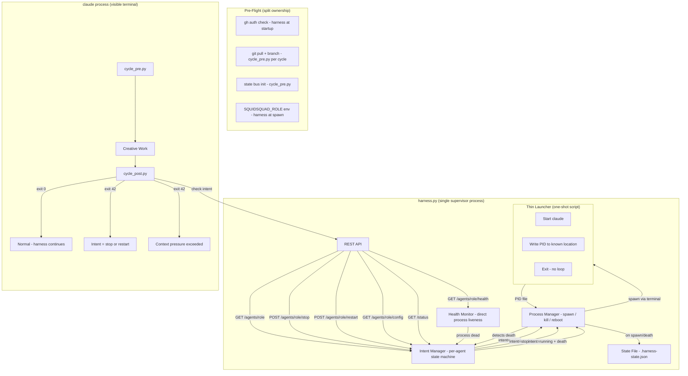
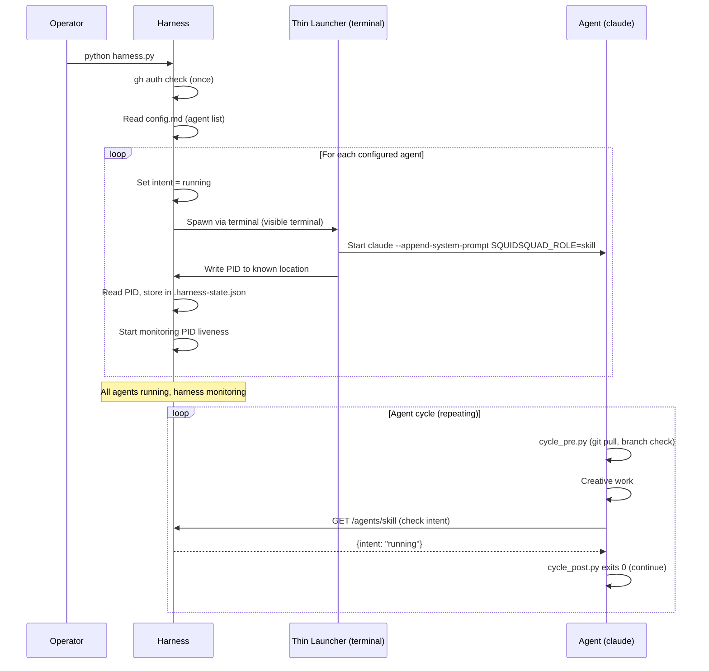
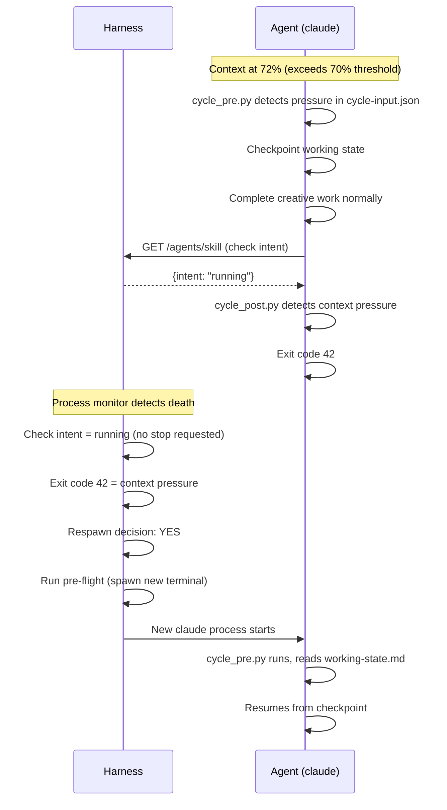
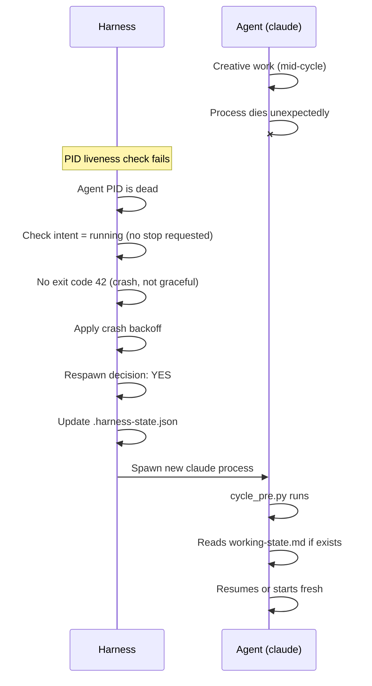
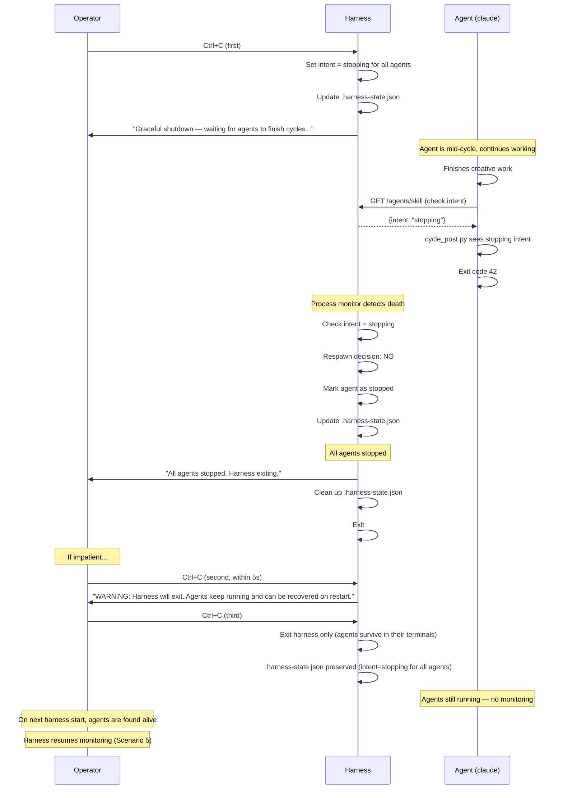
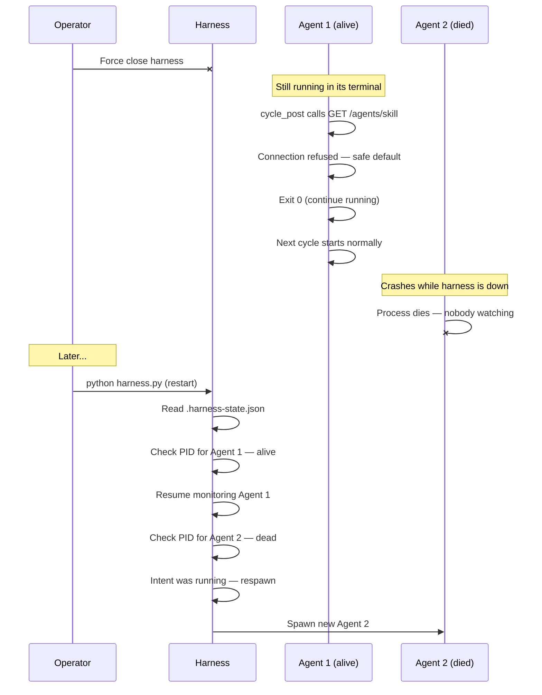
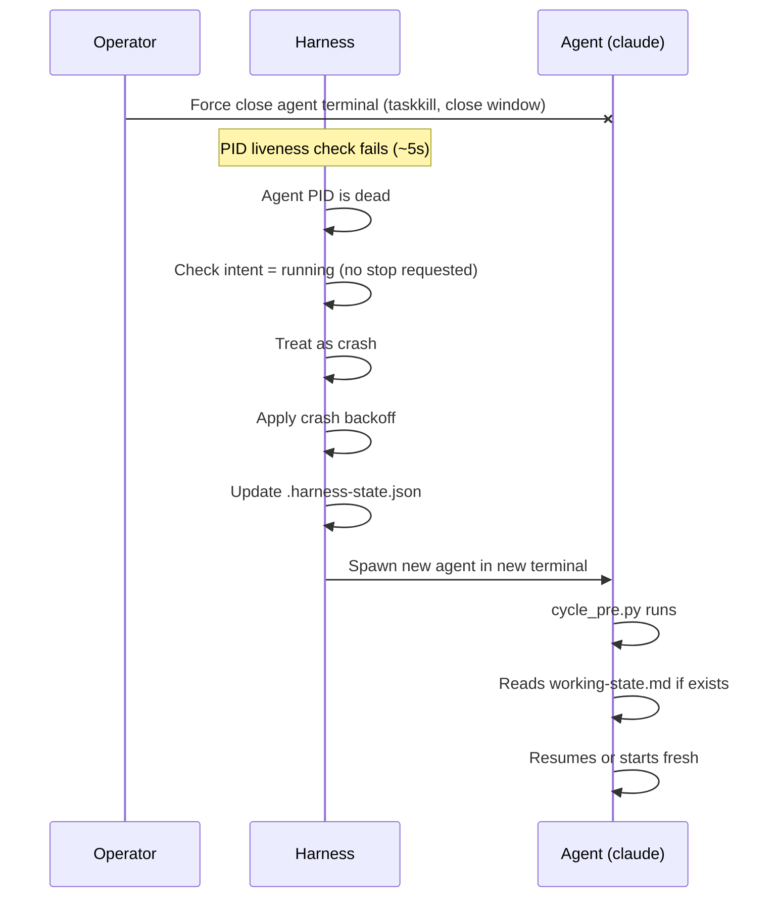
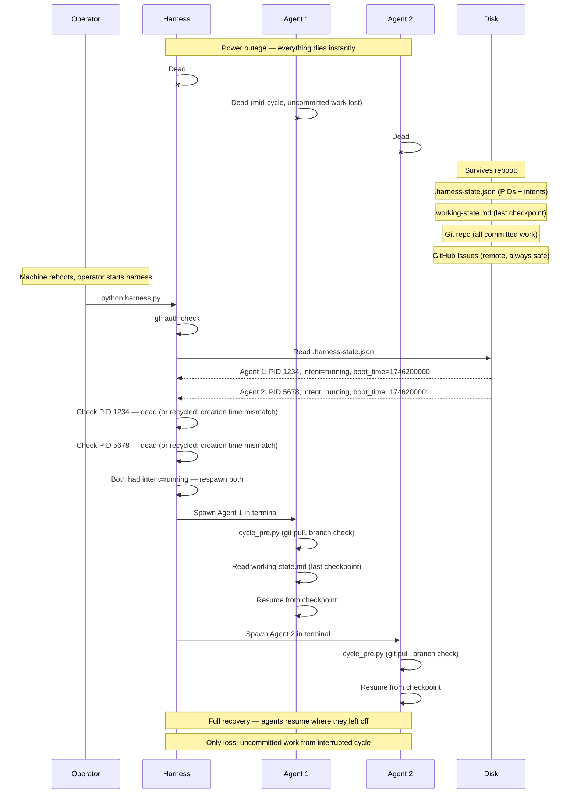

# PRD: Harness Absorbs Wrapper — Full Agent Lifecycle Ownership

**Priority**: High
**Epic**: harness
**Reporter**: pm-lead
**Task**: #4966
**Research**: FEAT-PM-4966-RESEARCH.md, FEAT-PM-4966-SENTINEL-RESEARCH.md
**Context**: FEAT-PM-4966-CONTEXT.md

## Vision

The harness becomes the single owner of agent lifecycle. Wrapper scripts are eliminated. The harness spawns, monitors, restarts, and stops agents directly. All sentinel files are eliminated — zero files, API-only communication. Future: harness becomes a console app with agent view switching + web frontend relaying shells.

## Architecture Diagram

## Scenario Sequence Diagrams

### 1. Startup — harness boots all agents

### 2. Context pressure — agent reboots

### 3. Crash — unexpected agent death

### 4. User shutdown — graceful stop

### 5. Harness force-closed — agent recovery

### 6. Agent force-closed — crash recovery

### 7. Power outage — full system restart

## What Gets Removed

| Component | Current Owner | Action |
|-----------|--------------|--------|
| start-*.sh / start-*.ps1 | Wrapper scripts | **Delete entirely** |
| .health heartbeat file | Wrapper background job | **Eliminated — harness monitors process directly** |
| .pid file | Wrapper singleton lock | **Eliminated — harness process table** |
| .claude-pid file | Wrapper | **Eliminated — harness process table** |
| .stop sentinel | harness + start_team | **Eliminated — harness in-memory intent** |
| .stop-after-cycle sentinel | harness + cycle_post | **Eliminated — replaced with GET /agents/role intent API** |
| .restart sentinel | reboot_agent | **Eliminated — harness manages restarts directly** |
| Crash retry logic | Wrapper (one retry) | **Moved to harness with configurable policy** |
| Respawn loop | Template wrapper | **Moved to harness** |
| Heartbeat background job | Wrapper | **Eliminated — harness monitors process directly** |
| .booting sentinel | boot_remote.py | **Eliminated — harness internal mutex replaces concurrent spawn prevention** |

**Zero sentinel files in target architecture.**

## What Gets Added to Harness

### 1. Pre-Flight (split ownership)

- **Harness at startup**: `gh auth` verification (once, not per-spawn)
- **Harness at spawn**: Set `SQUIDSQUAD_ROLE` env var, spawn via terminal with thin launcher
- **cycle_pre.py per cycle**: git checkout working branch, git pull --ff-only, state bus init
- ~~Inject permissions~~ — not needed
- Singleton enforcement via harness process table (not PID file)

### 2. Process Management

- Spawn claude via terminal (platform-agnostic: wt.exe, Terminal.app, tmux, or PTY — dev discretion)
- Thin launcher writes claude PID to known location, harness reads it
- Track PIDs + boot_time in `.squidsquad/.harness-state.json` (durable across harness restarts)
- Monitor process liveness directly (PID check + creation time validation, no heartbeat file)
- PID recycling detection: compare stored boot_time against actual process creation time. Mismatch = recycled PID, treat as dead.
- Detect death -> check intent -> act (respawn or stop)

### 3. Intent State Machine

Per-agent states: `running`, `stopping`, `restarting`, `stopped`, `crashed`

Transitions:
- `/stop` -> intent=stopping -> cycle_post queries API -> sees stopping -> exits 42 -> harness: intent=stopped
- `/restart` -> intent=restarting -> cycle_post queries API -> sees restarting -> exits 42 -> harness: respawn -> intent=running
- crash detected (process dies, intent was running) -> harness: apply backoff -> respawn -> intent=running
- context pressure (cycle_post detects locally) -> exits 42 -> harness checks intent:
  - intent=running -> respawn (context pressure recovery)
  - intent=stopping -> do NOT respawn (operator intent wins)

**Priority rule**: Operator intent always wins over automatic signals. If intent=stopping or intent=stopped at the moment of death, harness never respawns — regardless of exit code.

### 4. Intent API (replaces .stop-after-cycle)

`GET /agents/{role}` already returns `intent` field. cycle_post.py calls this endpoint at cycle end:
- intent = `stopping` or `restarting` -> exit 42
- intent = `running` -> exit 0 (continue)
- API unreachable -> safe default: exit 0 (continue running)

Port discovery: default port 7373 + parent-directory walk for `.harness-port` fallback.
HTTP timeout: 5 seconds.

### 5. Health Endpoint

`GET /agents/{role}/health` returns:
- Process alive/dead (direct PID check)
- Last cycle timestamp
- Current phase (from current-state file)
- Context pressure

### 6. Config Endpoint

`GET /agents/{role}/config` exposes agent configuration sync state.

### 7. Ctrl+C Graceful Shutdown

- First Ctrl+C -> graceful stop (set intent=stopping for all agents, wait for cycle end). When all agents have exited, harness exits cleanly.
- Second Ctrl+C within 5s -> warn: "Harness will exit. Agents keep running and can be recovered on restart."
- Third Ctrl+C -> harness exits only (agents survive in their terminals, recoverable via Scenario 5)

### 8. Crash Recovery

On harness restart:
- Read `.squidsquad/.harness-state.json` for per-agent PIDs and intents
- Check which PIDs are still alive
- Resume monitoring live agents
- Respawn dead agents that had intent=running

## User Stories

**US-1: Operator starts agents via harness**
As an operator, I run `python references/scripts/harness.py` and it spawns all configured agents in visible terminals. No separate wrapper scripts needed.

**US-2: Operator stops an agent gracefully**
As an operator, I call `/agents/skill/stop` or press Ctrl+C. The harness sets intent=stopping. The agent finishes its current cycle, cycle_post queries the API, sees intent=stopping, and exits. The harness does not respawn it.

**US-3: Operator restarts an agent**
As an operator, I call `/agents/skill/restart`. The agent finishes its current cycle, exits, and the harness respawns it. cycle_pre.py handles git pull on the new session.

**US-4: Agent crashes and auto-recovers**
An agent dies unexpectedly. The harness detects process death via PID monitoring. Intent was `running` (no stop requested), so harness respawns automatically. No operator intervention.

**US-5: Context pressure triggers restart**
cycle_post.py detects context pressure exceeded (from cycle-input.json). It exits with code 42. The harness detects the exit, intent is `running`, so it respawns with fresh session.

**US-6: Operator queries agent health**
As an operator (or PM agent), I call `GET /agents/skill/health`. It returns process status, last cycle time, current phase, and context pressure — no file reading needed.

**US-7: Agent config sync**
As an operator, I call `GET /agents/skill/config` to see the agent's current configuration state.

**US-8: Graceful shutdown from terminal**
As an operator at the harness terminal, I press Ctrl+C to initiate graceful stop. Double Ctrl+C warns. Triple Ctrl+C exits harness only — agents survive and are recoverable on next harness start.

**US-9: Harness crash recovery**
The harness crashes while agents are running (in visible terminals). On restart, harness reads `.harness-state.json`, checks which PIDs are alive, and resumes monitoring them.

## Acceptance Criteria

- [ ] All start-*.sh and start-*.ps1 wrapper scripts deleted from .squidsquad/ and all clones
- [ ] Template wrappers (references/templates/start-role.*) deleted or replaced with thin launcher
- [ ] compose.py boot subcommand generates thin launcher (PID-reporting one-shot) not full wrapper
- [ ] Harness spawns agents via terminal with thin launcher (visible terminals)
- [ ] Thin launcher writes claude PID to known location, harness reads it after spawn
- [ ] ALL sentinel files eliminated: .health, .pid, .claude-pid, .stop, .stop-after-cycle, .restart, .booting
- [ ] Harness tracks per-agent PIDs, intents, and boot_time in `.squidsquad/.harness-state.json`
- [ ] Harness validates stored PIDs against process creation time (PID recycling detection)
- [ ] Intent state machine: running/stopping/restarting/stopped/crashed transitions correct
- [ ] cycle_post.py queries `GET /agents/{role}` for intent instead of reading .stop-after-cycle file
- [ ] cycle_post.py safe default on API failure: continue running (exit 0)
- [ ] cycle_post.py port discovery: default 7373 + parent-directory walk for .harness-port
- [ ] Harness auto-reboots on unexpected agent death (PID monitoring, intent=running)
- [ ] Harness crash recovery: reads .harness-state.json, checks PIDs, resumes monitoring
- [ ] `GET /agents/{role}/health` returns process status, last cycle, phase, context pressure
- [ ] `GET /agents/{role}/config` exposes agent config sync state
- [ ] Ctrl+C escalation: single=graceful stop, double=warn, triple=harness exits (agents survive)
- [ ] Context pressure exit (42) from cycle_post triggers harness reboot ONLY when intent=running (operator intent wins)
- [ ] .harness-state.json handles first-run (file doesn't exist = empty state, no error)
- [ ] Pre-flight split: harness does gh auth at startup, cycle_pre.py does git pull/branch per cycle
- [ ] health_check.py updated to query harness API instead of reading .health files (or deprecated)
- [ ] boot_remote.py updated to call harness API instead of spawning terminals (or deprecated)
- [ ] start_team.py updated to call harness API instead of writing sentinels
- [ ] agent-lifecycle sub-skill updated to reflect zero-sentinel, API-based lifecycle
- [ ] self-restart sub-skill removed (harness owns restart)
- [ ] cycle-runner sub-skill updated for API intent check
- [ ] All existing tests updated or replaced for new architecture
- [ ] Upgrade path documented: stop agents, deploy, clean stale files, recompose, start via harness

## Implementation Sequence

1. Add intent API to harness (extend existing `GET /agents/{role}` — already exposes intent)
2. Add `.harness-state.json` persistence (write on spawn/death/intent change)
3. Implement harness process monitoring (PID liveness check loop, replace heartbeat)
4. Implement harness crash recovery (read state file on startup, check PIDs)
5. Add harness agent spawn via terminal + thin launcher (PID report back)
6. Implement Ctrl+C escalation in harness
7. Update cycle_post.py: API-first intent check with .stop-after-cycle file fallback (dual-write transition for one version)
8. Add port discovery helper to cycle_post.py (default 7373 + parent-dir walk)
9. Split pre-flight: move gh auth to harness startup, ensure cycle_pre handles git
10. Add `/agents/{role}/health` and `/agents/{role}/config` endpoints
11. Update health_check.py, boot_remote.py, start_team.py to use harness API
12. Delete wrapper scripts (start-*.sh, start-*.ps1) from all clones and templates
13. Update compose.py boot command to generate thin launcher
14. Update sub-skills: agent-lifecycle, self-restart, cycle-runner
15. Recompose all agents
16. Write upgrade documentation
17. (Next version) Remove .stop-after-cycle file fallback from cycle_post.py — API-only
