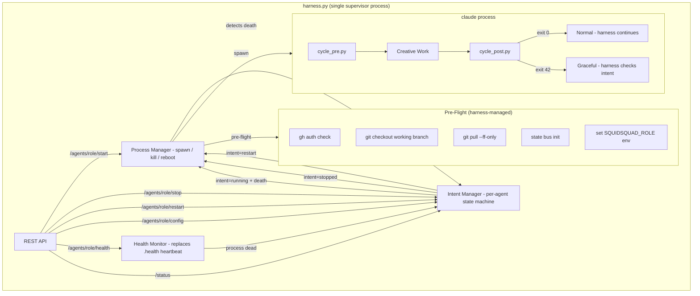
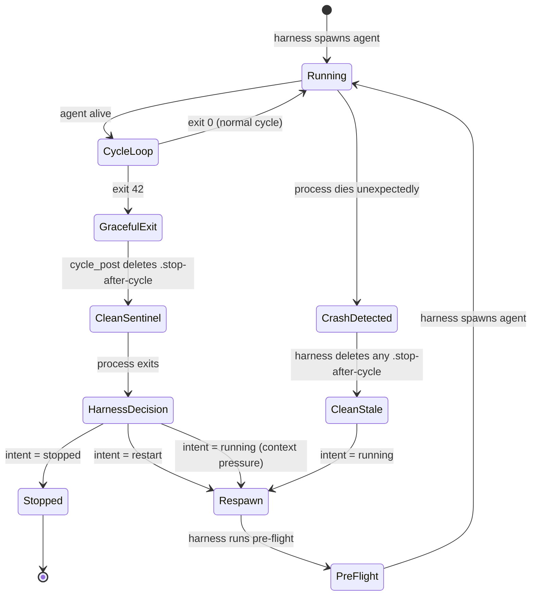
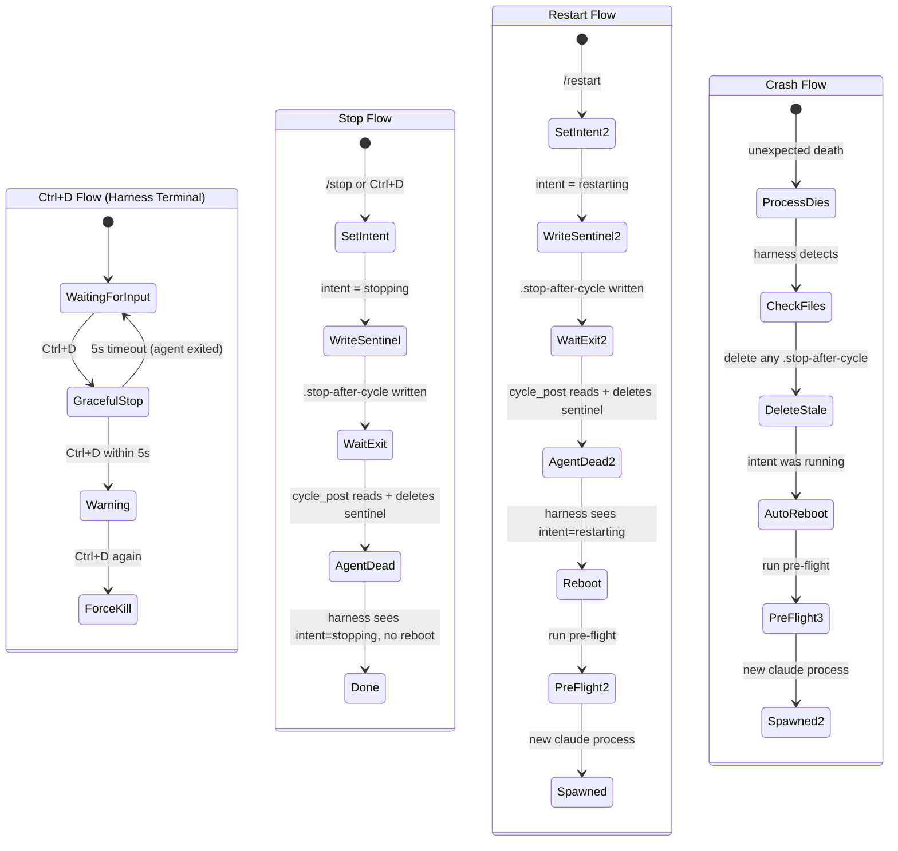

# PRD: Harness Absorbs Wrapper — Full Agent Lifecycle Ownership

**Priority**: High
**Epic**: harness
**Reporter**: pm-lead

## Vision

The harness becomes the single owner of agent lifecycle. Wrapper scripts are eliminated. The harness spawns, monitors, restarts, and stops agents directly. All process management, health tracking, and pre-flight operations move into the harness.

## Architecture Diagram

## What Gets Removed

| Component | Current Owner | Action |
|-----------|--------------|--------|
| start-*.sh / start-*.ps1 | Wrapper scripts | **Delete entirely** |
| .health heartbeat file | Wrapper background job | **Replace with harness process monitoring** |
| .pid file | Wrapper singleton lock | **Replace with harness process table** |
| .claude-pid file | Wrapper | **Replace with harness process table** |
| .stop sentinel | harness + start_team | **Replace with harness in-memory intent** |
| .stop-after-cycle sentinel | harness + cycle_post | **Keep as harness-to-agent signal only. cycle_post deletes after reading** |
| .restart sentinel | reboot_agent | **Delete — harness manages restarts directly** |
| Crash retry logic | Wrapper (one retry) | **Move to harness with configurable policy** |
| Respawn loop | Template wrapper | **Move to harness** |
| Heartbeat background job | Wrapper | **Delete — harness monitors process directly** |

## What Gets Added to Harness

### 1. Pre-Flight (before agent spawn)

- ~~Inject permissions~~ — not needed
- Sync agents in config (`/agents/role/config` endpoint exposes this)
- State bus worktree init
- Set `SQUIDSQUAD_ROLE` env var on spawned process
- `gh auth` verification
- Git checkout working branch + `git pull --ff-only` on working branch
- Singleton enforcement (harness process table, not PID file)

### 2. Process Management

- Spawn claude with correct args (`--dangerously-skip-permissions --name --append-system-prompt`)
- Track process PID internally (no file)
- Monitor process liveness directly (no heartbeat file needed)
- Detect death -> check intent -> act

### 3. Intent State Machine

Per-agent states: `running`, `stopping`, `restarting`, `stopped`, `crashed`

Transitions:
- `/stop` -> intent=stopping -> write .stop-after-cycle -> agent exits -> intent=stopped
- `/restart` -> intent=restarting -> write .stop-after-cycle -> agent exits -> respawn -> intent=running
- crash detected -> clean .stop-after-cycle -> respawn -> intent=running
- context pressure (exit 42) -> respawn -> intent=running

### 4. Health Endpoint

`/agents/role/health` replaces health_check.py reading .health files. Returns:
- Process alive/dead
- Last cycle timestamp (from iteration logs or cycle-output.json)
- Current phase (from current-state file)
- Context pressure (from context-pressure file)

### 5. Config Endpoint

`/agents/role/config` exposes agent configuration sync state. Replaces `config.py sync-agents`.

### 6. Ctrl+D Graceful Shutdown

- First Ctrl+D in harness terminal -> graceful stop (write .stop-after-cycle, wait for cycle end)
- Second Ctrl+D within 5s -> warn: "Will force-kill agent. Press Ctrl+D again to confirm."
- Third Ctrl+D -> force kill process, no wait

## User Stories

**US-1: Operator starts agents via harness**
As an operator, I run `python references/scripts/harness.py` and it spawns all configured agents. No separate wrapper scripts needed.

**US-2: Operator stops an agent gracefully**
As an operator, I call `/agents/skill/stop` or press Ctrl+D. The agent finishes its current cycle and exits. The harness does not respawn it.

**US-3: Operator restarts an agent**
As an operator, I call `/agents/skill/restart`. The agent finishes its current cycle, exits, and the harness respawns it with fresh pre-flight (git pull, branch check).

**US-4: Agent crashes and auto-recovers**
An agent dies unexpectedly. The harness detects process death, cleans any stale .stop-after-cycle, and respawns. No operator intervention.

**US-5: Context pressure triggers restart**
cycle_post.py returns exit 42. The harness detects this, treats it as a context pressure restart, and respawns with fresh pre-flight.

**US-6: Operator queries agent health**
As an operator (or PM agent), I call `/agents/skill/health`. It returns process status, last cycle time, current phase, and context pressure — no file reading needed.

**US-7: Agent config sync**
As an operator, I call `/agents/skill/config` to see the agent's current configuration state. The harness tracks sync-agents internally.

**US-8: Graceful shutdown from terminal**
As an operator at the harness terminal, I press Ctrl+D to initiate graceful stop. Double Ctrl+D warns about force kill. Triple Ctrl+D force-kills.

## Acceptance Criteria

- [ ] All start-*.sh and start-*.ps1 files deleted from .squidsquad/
- [ ] compose.py boot subcommand updated (no wrapper generation, or generates minimal launcher harness calls)
- [ ] Harness spawns agents directly with correct env vars and claude args
- [ ] Harness runs pre-flight per agent before spawn (gh auth, branch switch, git pull, state bus init)
- [ ] .health, .pid, .claude-pid files eliminated — harness tracks internally
- [ ] .stop file eliminated — intent in harness memory only
- [ ] .stop-after-cycle is write-only from harness, deleted by cycle_post.py after reading
- [ ] .restart file eliminated — harness manages restarts directly
- [ ] Harness auto-reboots on unexpected agent death (process monitoring, not heartbeat polling)
- [ ] Harness cleans .stop-after-cycle on crash detection before reboot
- [ ] `/agents/role/health` endpoint returns process status, last cycle, phase, context pressure
- [ ] `/agents/role/config` endpoint exposes agent config sync state
- [ ] Ctrl+D graceful stop, double Ctrl+D warns, triple Ctrl+D force-kills
- [ ] Context pressure exit (42) from cycle_post triggers harness reboot
- [ ] health_check.py updated to query harness API instead of reading files (or deprecated)
- [ ] boot_remote.py updated to call harness API instead of spawning terminals
- [ ] start_team.py updated to call harness API instead of writing sentinels
- [ ] agent-lifecycle sub-skill updated to reflect harness-owned lifecycle
- [ ] All existing tests updated or replaced for new architecture
- [ ] Heartbeat threshold inconsistency resolved (single source: harness process monitoring)

## Migration Path

1. Implement harness lifecycle management (process spawn, intent state machine, health monitoring)
2. Add pre-flight to harness (git pull, branch switch, gh auth, state bus init)
3. Add API endpoints (/health, /config)
4. Implement Ctrl+D flow
5. Update cycle_post.py (.stop-after-cycle deletion)
6. Update health_check.py, boot_remote.py, start_team.py to use harness API
7. Delete wrapper scripts and update compose.py boot command
8. Update agent-lifecycle sub-skill documentation
9. Recompose all agents
