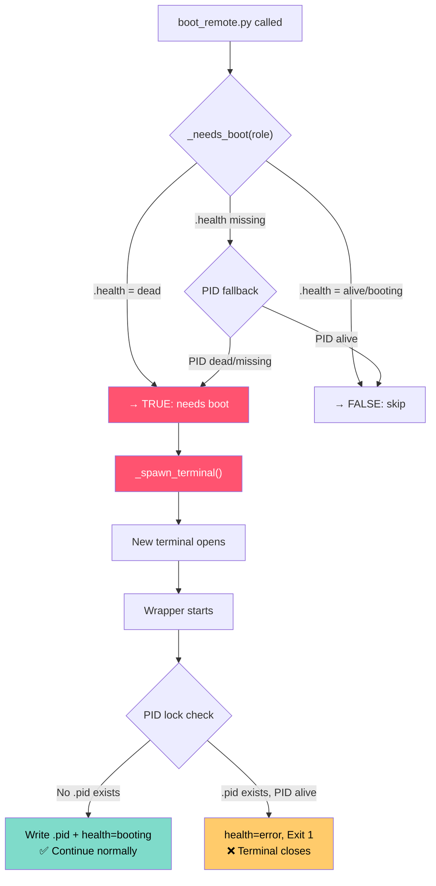
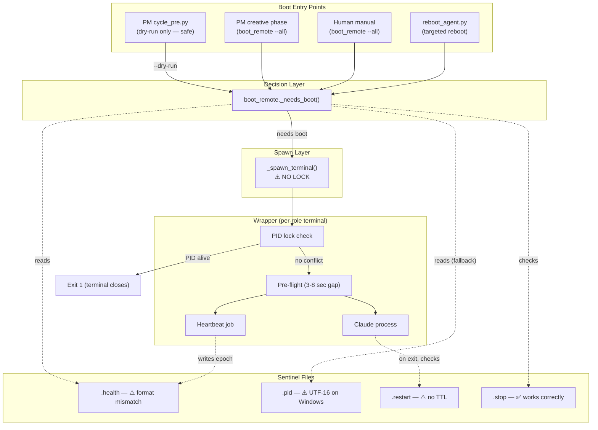

# Agent Lifecycle — Boot Research

Investigation into how agent boot/spawn works and what caused multiple instances to spawn simultaneously.

> **TL;DR**: Three bugs found. The boot lock was removed in #2183 with no replacement, so two concurrent boot calls both spawn terminals. The heartbeat format changed but `boot_remote.py` wasn't updated, causing false "needs boot" for running agents. Stale `.restart` sentinels cause extra spawns on fresh boots.

---

## 1. Happy Path — Single Boot, No Conflicts

This is how the boot flow is *supposed* to work when only one caller triggers it.

```mermaid
sequenceDiagram
    participant H as PM / Human
    participant B as boot_remote.py
    participant W as Wrapper (start-role.sh)
    participant C as Claude Agent

    H->>B: boot_remote.py --all

    rect rgb(30, 40, 60)
    Note over B: For each role...
    B->>B: _needs_boot(role)
    B->>B: read .health → "dead"
    B->>B: → TRUE (needs boot)
    end

    B->>W: _spawn_terminal() — opens new terminal

    rect rgb(20, 50, 30)
    Note over W: Wrapper startup
    W->>W: PID lock check — .pid exists? → No
    W->>W: Write $$ to .pid
    W->>W: write_health("booting")
    W->>W: Pre-flight (gh auth, git pull) — 3-8 sec
    W->>W: Start heartbeat (epoch → .health every 5s)
    end

    W->>C: Launch claude process
    C->>C: Ralph Loop cycles...
    C-->>W: Claude exits
    W->>W: Cleanup: rm .pid, write_health("dead")
```

---

## 2. The Double-Boot Race Condition (What You Experienced)

Two concurrent `boot_remote.py` calls (previous PM instance + human reboot) both see agents as "dead" during the same window.

```mermaid
sequenceDiagram
    participant P as Old PM Instance
    participant H as Human (manual reboot)
    participant B as boot_remote.py
    participant WA as Wrapper A (1st spawn)
    participant WB as Wrapper B (2nd spawn)

    P->>B: boot --all (call 1)
    B->>B: _needs_boot(skill) — .health = "dead" → TRUE
    B->>WA: spawn terminal (wt.exe)

    rect rgb(80, 20, 20)
    Note over WA,WB: ⚠️ DANGER ZONE (3-8 sec gap)<br/>.health still = "dead"<br/>.pid not yet written<br/>Pre-flight running...
    end

    H->>B: boot --all (call 2)
    B->>B: _needs_boot(skill) — .health STILL = "dead" → TRUE
    B->>WB: spawn ANOTHER terminal (wt.exe)

    Note over WA: Pre-flight finishes first
    WA->>WA: Write .pid = 12345
    WA->>WA: write_health("booting")

    Note over WB: Pre-flight finishes second
    WB->>WB: Read .pid → 12345 — PID alive!
    WB->>WB: "Already running (PID 12345). Aborting."
    WB->>WB: write_health("error|already running")

    rect rgb(80, 20, 20)
    Note over WB: ❌ Terminal flashes & closes<br/>But user saw multiple windows open
    end

    WA->>WA: Start heartbeat — agent runs normally
```

**Key insight**: The wrapper PID lock catches the duplicate — but only AFTER both terminals have opened. The user sees a flood of windows appearing and disappearing.

---

## 3. Why The Race Window Exists

The gap between `_spawn_terminal()` and the wrapper writing `.health = "booting"` is 3-8 seconds (pre-flight: git pull, gh auth). During this window, `.health` still says `"dead"`. **No lock prevents a second caller from entering during this gap** — the old `BOOT_LOCK` was removed in #2183.

---

## 4. Heartbeat Format Mismatch (PM-Specific)

The wrapper heartbeat writes a raw epoch number to `.health`. But `boot_remote._needs_boot()` only understands named statuses. This causes false "needs boot" for running agents.

```mermaid
sequenceDiagram
    participant B as boot_remote.py
    participant HF as .health file
    participant PF as .pid file

    B->>HF: _read_health_file()
    HF-->>B: "1777205526" (raw epoch)

    rect rgb(80, 20, 20)
    Note over B: parse: split("|")<br/>status = "1777205526"<br/><br/>Not in known statuses:<br/>[alive, booting, restarting,<br/>dead, error, backoff]<br/><br/>→ Falls through to PID fallback!
    end

    B->>PF: _read_pid_file() (fallback)

    rect rgb(80, 60, 20)
    Note over PF: PowerShell wrote: $PID > $PidFile<br/>File is UTF-16 LE with BOM<br/>Python reads UTF-8 → decode fails<br/>→ returns None
    end

    PF-->>B: None

    rect rgb(80, 20, 20)
    Note over B: pid == None<br/>→ "needs boot"<br/><br/>❌ FALSE POSITIVE!<br/>Agent is actually alive (PID 49384)
    end
```

Two bugs compound: heartbeat format unrecognized + PID file encoding wrong = `boot_remote` thinks a running agent is dead.

---

## 5. Stale .restart Sentinel

`reboot_agent.py` writes a `.restart` file. If the agent dies before processing it, the sentinel persists. The next fresh boot finds it and does an unwanted extra respawn.

```mermaid
sequenceDiagram
    participant R as reboot_agent.py
    participant S as .restart sentinel
    participant W as Wrapper
    participant C1 as Claude (1st run)
    participant C2 as Claude (unwanted 2nd run)

    R->>S: Write "reboot requested"
    Note over R,S: Agent dies before seeing .restart

    rect rgb(50, 50, 50)
    Note over S: ⏳ Hours/days pass...<br/>.restart persists on disk
    end

    Note over W: Fresh boot triggered
    W->>C1: Launch claude
    C1-->>W: Claude exits (normal)

    W->>S: Check .restart → EXISTS (stale!)
    W->>S: Delete .restart
    W->>C2: Respawn claude (unwanted!)

    rect rgb(80, 60, 20)
    Note over C2: ⚠️ Unexpected 2nd instance<br/>from stale sentinel
    end
```

---

## 6. Full Architecture Overview

---

## Bugs Summary

| # | Bug | Impact | Severity |
|---|-----|--------|----------|
| 1 | **No boot lock** — removed in #2183, no replacement. Two concurrent `boot_remote` calls both spawn terminals for the same role. | Multiple terminal windows per agent, panic-kill required | **High** |
| 2 | **Heartbeat epoch not parsed by `_needs_boot()`** — only handles named statuses, not the numeric epoch. Falls through to PID fallback, which also fails on Windows (UTF-16). False positive "needs boot" for running agents. | PM could be double-booted while alive | **High** |
| 3 | **Stale `.restart` sentinels** — if agent dies before processing the sentinel, it persists indefinitely. Next boot triggers an unwanted extra respawn. | Unexpected extra agent spawn after fresh boot | **Medium** |

## Current File State

| Role | .health | .pid | .restart | .stop |
|------|---------|------|----------|-------|
| pm | epoch (stale 4h) — STALLED | 49384 (UTF-16) | None | None |
| dm | "dead" | None | None | None |
| skill | "dead" | None | ~~stale~~ (cleaned by PM) | None |
| qa | "dead" | None | ~~stale~~ (cleaned by PM) | None |
| designer | None | None | None | Yes (human stopped) |

## Fix Options to Discuss

**Bug 1 — Boot lock**:
- (a) Restore file-based boot lock with TTL (reverts #2183 removal)
- (b) Per-agent `.booting` sentinel — `boot_remote` writes it before `_spawn_terminal()`, wrapper deletes it. Readers skip if present.
- (c) `boot_remote` writes `.health = "spawning"` before calling `_spawn_terminal()` — closes the race window using existing infrastructure.

**Bug 2 — Heartbeat parsing**:
- `_read_health_file()` should detect numeric-only content as heartbeat epoch. Treat as "alive" if within 15s, "dead" if stale.
- Also fix `_read_pid_file()` to handle UTF-16 LE encoding.

**Bug 3 — Stale sentinels**:
- (a) `boot_remote` cleans stale `.restart` files when booting a dead agent.
- (b) Write a timestamp into the sentinel; wrapper ignores sentinels older than N minutes.

---

*Generated by PM cycle 625 — 2026-04-26*
