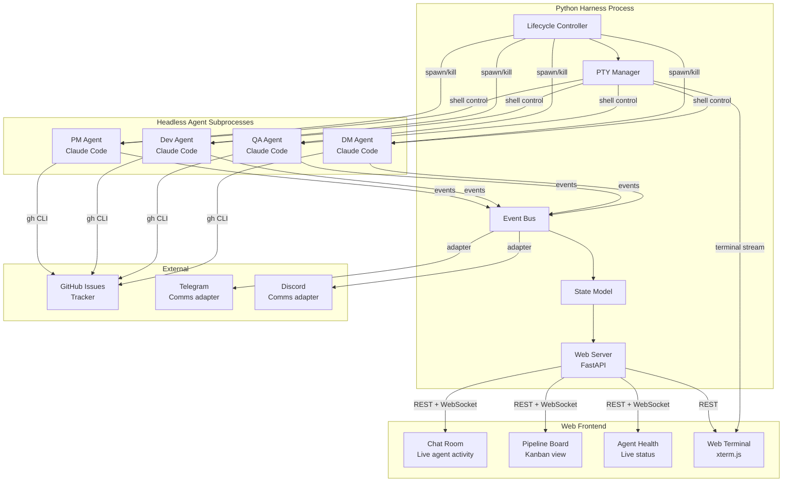
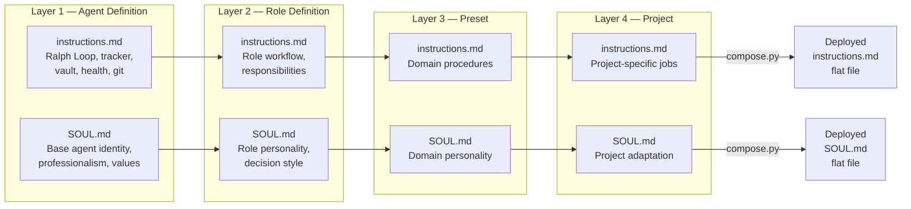
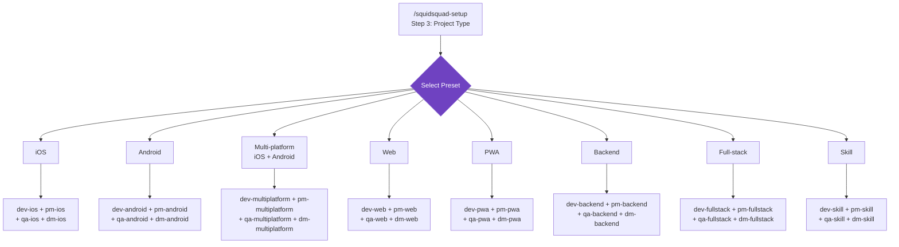
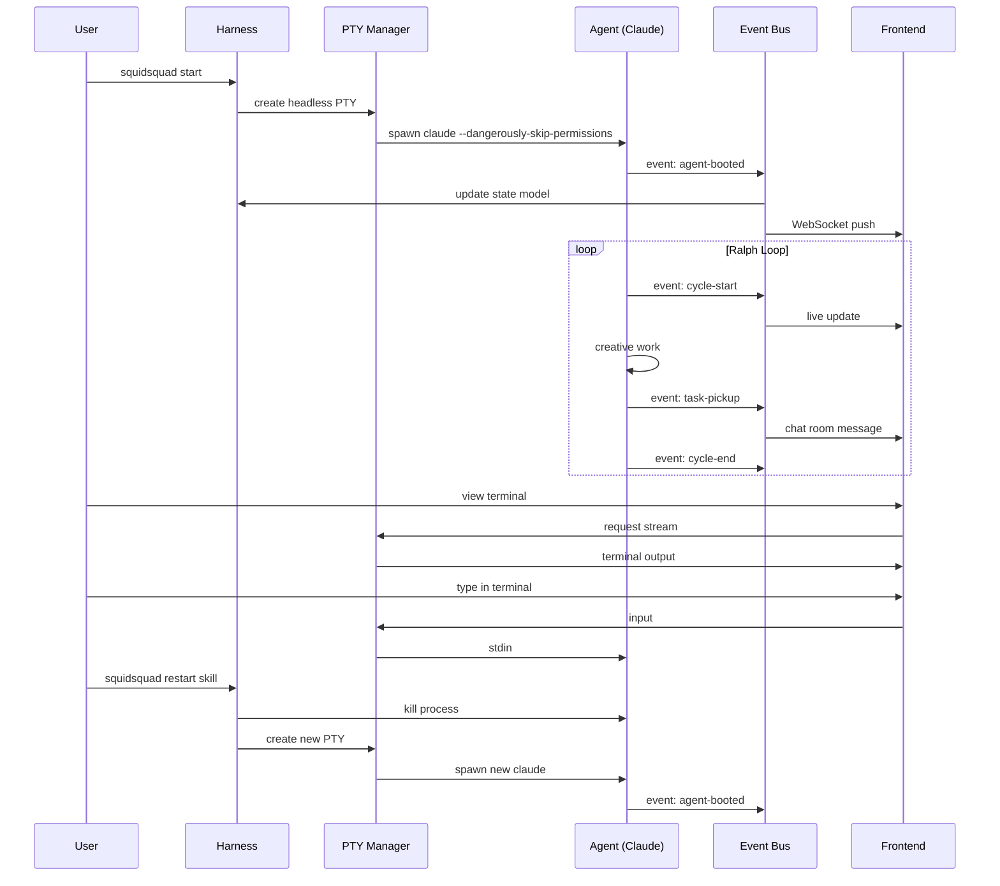
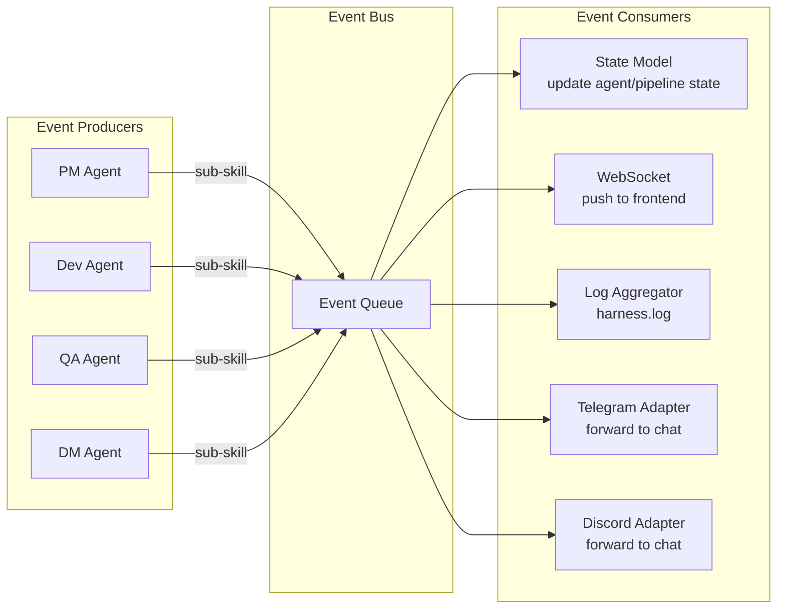
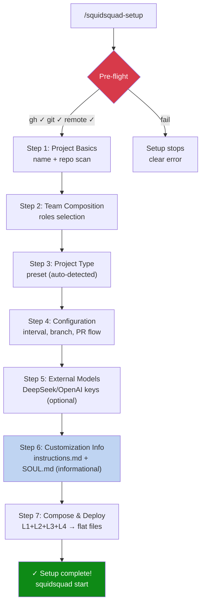
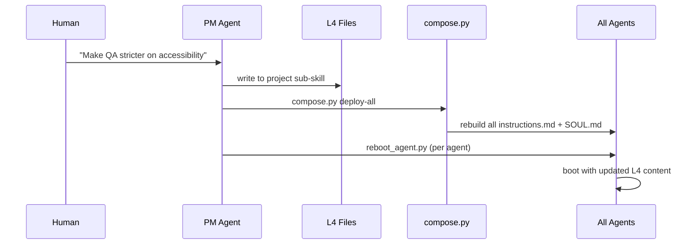

# SquidSquad Harness Architecture

## System Overview

```mermaid
graph TB
    subgraph Harness["Python Harness Process"]
        SM[State Model]
        EB[Event Bus]
        WS[Web Server<br/>FastAPI]
        PTY[PTY Manager]
        LC[Lifecycle Controller]

        LC --> PTY
        EB --> SM
        SM --> WS
    end

    subgraph Agents["Headless Agent Subprocesses"]
        PM[PM Agent<br/>Claude Code]
        DEV[Dev Agent<br/>Claude Code]
        QA[QA Agent<br/>Claude Code]
        DM[DM Agent<br/>Claude Code]
    end

    subgraph Frontend["Web Frontend"]
        CR[Chat Room<br/>Live agent activity]
        PB[Pipeline Board<br/>Kanban view]
        AH[Agent Health<br/>Live status]
        WT[Web Terminal<br/>xterm.js]
    end

    subgraph External["External"]
        GH[GitHub Issues<br/>Tracker]
        TG[Telegram<br/>Comms adapter]
        DC[Discord<br/>Comms adapter]
    end

    LC -->|spawn/kill| PM
    LC -->|spawn/kill| DEV
    LC -->|spawn/kill| QA
    LC -->|spawn/kill| DM

    PM -->|events| EB
    DEV -->|events| EB
    QA -->|events| EB
    DM -->|events| EB

    PTY -->|shell control| PM
    PTY -->|shell control| DEV
    PTY -->|shell control| QA
    PTY -->|shell control| DM

    WS -->|REST + WebSocket| CR
    WS -->|REST + WebSocket| PB
    WS -->|REST + WebSocket| AH
    WS -->|REST| WT
    PTY -->|terminal stream| WT

    EB -->|adapter| TG
    EB -->|adapter| DC

    PM -->|gh CLI| GH
    DEV -->|gh CLI| GH
    QA -->|gh CLI| GH
    DM -->|gh CLI| GH
```

## Layer System

```mermaid
graph LR
    subgraph L1["Layer 1 — Agent Definition"]
        L1C[instructions.md<br/>Ralph Loop, tracker,<br/>vault, health, git]
        L1S[SOUL.md<br/>Base agent identity,<br/>professionalism, values]
    end

    subgraph L2["Layer 2 — Role Definition"]
        L2C[instructions.md<br/>Role workflow,<br/>responsibilities]
        L2S[SOUL.md<br/>Role personality,<br/>decision style]
    end

    subgraph L3["Layer 3 — Preset"]
        L3C[instructions.md<br/>Domain procedures]
        L3S[SOUL.md<br/>Domain personality]
    end

    subgraph L4["Layer 4 — Project"]
        L4C[instructions.md<br/>Project-specific jobs]
        L4S[SOUL.md<br/>Project adaptation]
    end

    L1C --> L2C --> L3C --> L4C
    L1S --> L2S --> L3S --> L4S

    L4C -->|compose.py| DEPLOYED_C[Deployed<br/>instructions.md<br/>flat file]
    L4S -->|compose.py| DEPLOYED_S[Deployed<br/>SOUL.md<br/>flat file]
```

## Preset System

```mermaid
graph TD
    SETUP["/squidsquad-setup<br/>Step 3: Project Type"] --> PRESET{Select Preset}

    PRESET --> IOS[iOS]
    PRESET --> AND[Android]
    PRESET --> MP[Multi-platform<br/>iOS + Android]
    PRESET --> WEB[Web]
    PRESET --> PWA[PWA]
    PRESET --> BE[Backend]
    PRESET --> FS[Full-stack]
    PRESET --> SK[Skill]

    IOS --> IOS_T[dev-ios + pm-ios<br/>+ qa-ios + dm-ios]
    AND --> AND_T[dev-android + pm-android<br/>+ qa-android + dm-android]
    MP --> MP_T[dev-multiplatform + pm-multiplatform<br/>+ qa-multiplatform + dm-multiplatform]
    WEB --> WEB_T[dev-web + pm-web<br/>+ qa-web + dm-web]
    PWA --> PWA_T[dev-pwa + pm-pwa<br/>+ qa-pwa + dm-pwa]
    BE --> BE_T[dev-backend + pm-backend<br/>+ qa-backend + dm-backend]
    FS --> FS_T[dev-fullstack + pm-fullstack<br/>+ qa-fullstack + dm-fullstack]
    SK --> SK_T[dev-skill + pm-skill<br/>+ qa-skill + dm-skill]

    style PRESET fill:#6f42c1,color:#fff
```

## Harness Lifecycle

```mermaid
sequenceDiagram
    participant U as User
    participant H as Harness
    participant PTY as PTY Manager
    participant A as Agent (Claude)
    participant EB as Event Bus
    participant FE as Frontend

    U->>H: squidsquad start
    H->>PTY: create headless PTY
    PTY->>A: spawn claude --dangerously-skip-permissions
    A->>EB: event: agent-booted
    EB->>H: update state model
    EB->>FE: WebSocket push

    loop Ralph Loop
        A->>EB: event: cycle-start
        EB->>FE: live update
        A->>A: creative work
        A->>EB: event: task-pickup #123
        EB->>FE: chat room message
        A->>EB: event: cycle-end
    end

    U->>FE: view terminal
    FE->>PTY: request stream
    PTY->>FE: terminal output

    U->>FE: type in terminal
    FE->>PTY: input
    PTY->>A: stdin

    U->>H: squidsquad restart skill
    H->>A: kill process
    H->>PTY: create new PTY
    PTY->>A: spawn new claude
    A->>EB: event: agent-booted
```

## Event Bus Flow

```mermaid
graph LR
    subgraph Producers["Event Producers"]
        P1[PM Agent]
        P2[Dev Agent]
        P3[QA Agent]
        P4[DM Agent]
    end

    subgraph Bus["Event Bus"]
        Q[Event Queue]
    end

    subgraph Consumers["Event Consumers"]
        SM2[State Model<br/>update agent/pipeline state]
        WS2[WebSocket<br/>push to frontend]
        LOG[Log Aggregator<br/>harness.log]
        TG2[Telegram Adapter<br/>forward to chat]
        DC2[Discord Adapter<br/>forward to chat]
    end

    P1 -->|sub-skill| Q
    P2 -->|sub-skill| Q
    P3 -->|sub-skill| Q
    P4 -->|sub-skill| Q

    Q --> SM2
    Q --> WS2
    Q --> LOG
    Q --> TG2
    Q --> DC2
```

## Setup Flow

```mermaid
flowchart TD
    START["/squidsquad-setup"] --> PRE{Pre-flight}
    PRE -->|gh ✓ git ✓ remote ✓| S1
    PRE -->|fail| ABORT[Setup stops<br/>clear error]

    S1["Step 1: Project Basics<br/>name + repo scan"] --> S2
    S2["Step 2: Team Composition<br/>roles selection"] --> S3
    S3["Step 3: Project Type<br/>preset (auto-detected)"] --> S4
    S4["Step 4: Configuration<br/>interval, branch, PR flow"] --> S5
    S5["Step 5: External Models<br/>DeepSeek/OpenAI keys (optional)"] --> S6
    S6["Step 6: Customization Info<br/>instructions.md + SOUL.md (informational)"] --> S7
    S7["Step 7: Compose & Deploy<br/>L1+L2+L3+L4 → flat files"]

    S7 --> DONE["✓ Setup complete!<br/>squidsquad start"]

    style PRE fill:#d73a4a,color:#fff
    style DONE fill:#0e8a16,color:#fff
    style S6 fill:#bfd4f2
```

## L4 Propagation

```mermaid
sequenceDiagram
    participant U as Human
    participant PM as PM Agent
    participant L4 as L4 Files
    participant CP as compose.py
    participant AG as All Agents

    U->>PM: "Make QA stricter on accessibility"
    PM->>L4: write to project sub-skill
    PM->>CP: compose.py deploy-all
    CP->>AG: rebuild all instructions.md + SOUL.md
    PM->>AG: reboot_agent.py (per agent)
    AG->>AG: boot with updated L4 content
```
