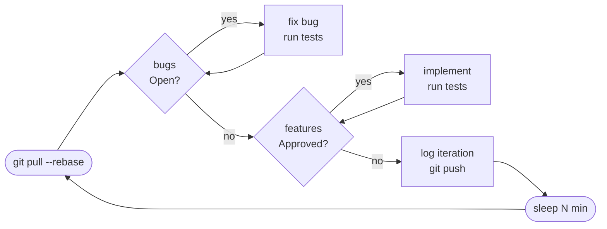
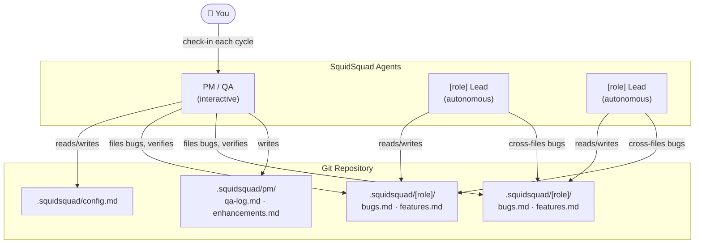

```
      ▗▄▄▄▄▖
     ▟██████▙
      ▐▌▀  ▀▐▌
    ▝▜████▛▘
      ▐████▌
     ▗██████▖
    ▐███    ███▌
   ▐██▘      ▝██▌
  ▐▛▘          ▝▜▌
  ▌▖            ▗▌
  ▝▘            ▝▘

  S Q U I D S Q U A D
```

# SquidSquad

**Your AI dev team that coordinates through markdown, not meetings.**

SquidSquad is a Claude Code skill that spins up autonomous AI agents — one per dev role you define, plus a PM/QA — that work on your codebase in parallel and coordinate through a shared `.squidsquad/` folder. No message queues. No orchestration servers. Just markdown files and git.

---

## What It Is

SquidSquad turns a single git repository into a multi-agent development environment. Each agent runs as a separate Claude Code CLI instance, loops autonomously, and communicates with the other agents by reading and appending to shared tracker files — bugs, features, QA logs — that live alongside your code.

The result: bugs get filed, triaged, fixed, and verified. Features move from backlog to shipped. The PM checks in with you each cycle to surface blockers and get approvals. Everything is traceable in git history.

---

## How It Works

### Agents

SquidSquad always has a **PM/QA** agent. Dev agents are defined by you at setup time — one agent per role.

| Agent | Loop | Mode |
|-------|------|------|
| **[role] Lead** (one per dev role) | Fix bugs → implement features → run tests → push | Autonomous (`--enable-auto-mode`) |
| **PM/QA** | Human check-in → e2e tests → file bugs → verify work → push | Interactive (you talk to this one) |

**Common team shapes:**

| You say at setup | Agents created |
|-----------------|----------------|
| `fe, be` | FE Lead + BE Lead + PM/QA |
| `be` | BE Lead + PM/QA |
| `api, worker` | API Lead + Worker Lead + PM/QA |
| `web, ios, api` | Web Lead + iOS Lead + API Lead + PM/QA |

### The Ralph Loop



Dev agents loop autonomously. PM/QA follows the same cadence but checks in with you at the start of each cycle and runs the full e2e suite.

### Architecture



All coordination is asynchronous through git — agents pull to read the latest state and push after each work unit. No direct agent-to-agent communication needed.

### Shared `.squidsquad/` Folder

```
.squidsquad/
├── config.md                   ← versions, agents, test commands, counters, interval
├── start-[role].sh/.ps1        ← one boot script pair per dev agent
├── start-pm.sh/.ps1            ← PM/QA boot scripts
├── [role]/                     ← one folder per dev agent
│   ├── CLAUDE.md               ← role instructions + Ralph Loop
│   ├── bugs.md                 ← BUG-[ROLE]-XXX tracker
│   ├── features.md             ← FEAT-[ROLE]-XXX tracker
│   └── iterations/             ← per-cycle logs
└── pm/
    ├── CLAUDE.md               ← PM/QA instructions + Ralph Loop
    ├── qa-log.md               ← test run results
    ├── enhancements.md         ← product backlog
    ├── iterations/             ← per-cycle logs
    └── migrations/             ← schema migration logs
```

---

## Quick Start

### 1. Install the Skill

Add SquidSquad as a Claude Code skill by placing `SKILL.md` in your Claude Code skills directory, or reference it directly.

### 2. Set Up Your Project

In a Claude Code session, say:

```
Set up Squidsquad for my project.
```

Claude will ask for your project name, repo URL, dev agent roles (e.g. `be` for BE-only, or `fe, be`, or any custom names), test commands, and loop interval, then generate the full `.squidsquad/` folder structure.

### 3. Launch the Agents

Open three terminal windows and run:

**bash / zsh:**
```bash
# Terminal 1 — FE Lead (autonomous)
bash .squidsquad/start-fe.sh

# Terminal 2 — BE Lead (autonomous)
bash .squidsquad/start-be.sh

# Terminal 3 — PM/QA (interactive — you talk to this one)
bash .squidsquad/start-pm.sh
```

**PowerShell:**
```powershell
# Terminal 1 — FE Lead (autonomous)
.\.squidsquad\start-fe.ps1

# Terminal 2 — BE Lead (autonomous)
.\.squidsquad\start-be.ps1

# Terminal 3 — PM/QA (interactive — you talk to this one)
.\.squidsquad\start-pm.ps1
```

FE and BE run in auto mode (`--permission-mode auto --enable-auto-mode -p`) and loop without any input from you. PM/QA runs as a normal interactive Claude Code session — this is your terminal. You talk to the PM to report bugs, request features, and give approvals. The PM coordinates the rest.

The agents will start their Ralph Loops immediately. Check `.squidsquad/fe/bugs.md`, `.squidsquad/be/features.md`, and `.squidsquad/pm/qa-log.md` to see activity as it accumulates.

### 4. Interact Via PM

The PM/QA agent will check in with you each cycle. You can:
- Report a new bug → it gets filed to the right team
- Request a new feature → it enters the backlog as `Pending`
- Approve a pending feature → it becomes `Approved` and the team picks it up
- Change priorities → the PM updates the tracker

---

## Tracker Formats

### Bugs

```markdown
## BUG-FE-001 — Safari login page crashes on submit

- **Severity**: High
- **Status**: Open
- **Reported By**: pm/qa
- **Assigned To**: fe-lead
- **Description**: Clicking submit on the login form in Safari 17 causes a JS exception.
- **Steps to Reproduce**:
  1. Open the app in Safari 17
  2. Enter valid credentials
  3. Click Submit
- **Expected**: User is redirected to dashboard
- **Actual**: Uncaught TypeError in console, page does not navigate

### Discussion

> [2026-01-15 09:00] **pm/qa**: Reproduced on Safari 17.2, macOS 14.3.
> [2026-01-15 09:45] **fe-lead**: Race condition in useAuthSubmit hook. Fixing.
> [2026-01-15 10:30] **fe-lead**: Fixed in commit abc1234. Status → Fixed.
> [2026-01-15 11:00] **pm/qa**: Verified. No regression. Status → Closed.
```

### Features

```markdown
## FEAT-BE-001 — Rate limiting on auth endpoints

- **Priority**: High
- **Status**: Approved
- **Owner**: be-lead
- **Description**: Add rate limiting to /api/auth/* endpoints to prevent brute force.
- **Acceptance Criteria**:
  - [ ] Max 10 requests per minute per IP on auth endpoints
  - [ ] Returns 429 with Retry-After header when limit exceeded
  - [ ] Rate limit state survives server restart (Redis-backed)

### Discussion

> [2026-01-15 09:00] **pm/qa**: Proposed for this sprint. Security priority.
> [2026-01-15 09:30] **human**: Approved. Go ahead.
> [2026-01-15 09:35] **pm/qa**: Status → Approved.
> [2026-01-15 10:00] **be-lead**: Picking this up. Status → In Progress.
```

---

## Cross-Team Bug Filing

One of SquidSquad's core design principles: **any agent can file a bug to any team — including their own — directly, with no routing bottleneck.**

| Who discovers the bug | Files to | Format |
|-----------------------|----------|--------|
| FE Lead (FE issue found during feature work) | `fe/bugs.md` | `BUG-FE-XXX` |
| FE Lead (root cause is in BE) | `be/bugs.md` | `BUG-BE-XXX` |
| BE Lead (BE issue found during feature work) | `be/bugs.md` | `BUG-BE-XXX` |
| BE Lead (root cause is in FE) | `fe/bugs.md` | `BUG-FE-XXX` |
| PM/QA (FE failure) | `fe/bugs.md` | `BUG-FE-XXX` |
| PM/QA (BE failure) | `be/bugs.md` | `BUG-BE-XXX` |
| PM/QA (unclear boundary) | both trackers | cross-linked via Discussion |

### How it plays out

**FE Lead hits a backend wall:**
The FE Lead is fixing a login bug and discovers the session token validation logic is wrong on the server. Rather than leaving a comment and hoping someone notices, they file `BUG-BE-XXX` directly in `be/bugs.md`, append a Discussion note to the original FE bug linking the two, and move on. The BE Lead picks it up on their next pull.

**PM/QA sees an API failure in e2e tests:**
The PM doesn't need to ask the FE Lead to relay the issue to the BE Lead. They file `BUG-BE-XXX` directly, with full reproduction steps from the test output. Zero hops.

**BE Lead exposes a contract mismatch:**
The BE Lead ships a new endpoint but notices the expected request shape doesn't match what the FE is sending. They file `BUG-FE-XXX` in `fe/bugs.md` describing the contract, without touching any frontend code themselves.

### Why this matters

In traditional team setups, cross-team bugs get stuck in handoff — someone has to triage, assign, and re-explain the issue at every boundary. SquidSquad eliminates this: the agent that discovers the problem has full write access to both trackers and files the bug with complete context, right then. The receiving agent picks it up on their next pull with everything they need.

No standup required.

---

## Requirements

- [Claude Code CLI](https://claude.ai/code) with `claude -p` support
- Claude Code auto mode (`--permission-mode auto --enable-auto-mode`) — agents run unattended and need permission to read/write files and run tests without prompting
- A git repository with a remote (GitHub, GitLab, etc.)
- FE, BE, and e2e test commands that can be run from the repo root

## Boot Logo

SquidSquad setup writes a `SessionStart` hook to `.claude/settings.json` in your project. Every time Claude Code starts in a repo with a `.squidsquad/` folder, the squid logo appears in the terminal automatically — a quick visual signal that the squad is active on this project.

If the project already has a `.claude/settings.json`, SquidSquad merges into the existing `SessionStart` array without overwriting anything.

---

## Git Protocol

SquidSquad agents follow strict append-only conventions to minimize conflicts:

- Always `git pull --rebase` before starting work
- Tracker files are **append-only** — never edit or delete existing entries
- Discussion sections are append-only — always add at the bottom
- Push after every completed work unit
- Rebase conflicts in tracker files are resolved by keeping both versions

---

## Versioning

SquidSquad uses [semver](https://semver.org). Releases are tagged on GitHub (`v0.5.0`, `v1.0.0`, etc.).

The installed version is stored in `.squidsquad/config.md` and shown in the boot logo on every Claude Code session start.

### Installing a specific version

```bash
# clone and checkout a tag
git clone https://github.com/WallyDoodlez/SquidSquad
cd SquidSquad && git checkout v0.5.0
```

Then copy or reference `SKILL.md` as your Claude Code skill.

### Upgrading

1. Pull the latest `SKILL.md` (or check out the new tag)
2. In your project, say: **"upgrade squidsquad"**
3. The skill reads the version in `.squidsquad/config.md`, compares it to the current skill version, and migrates — regenerating boot scripts, CLAUDE.md templates, and the `settings.json` hook without touching your tracker files or config values

See [CHANGELOG.md](./CHANGELOG.md) for what changed between versions.

---

## License

MIT
