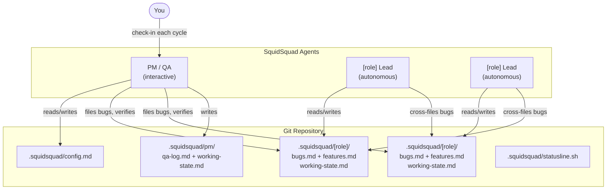

```     
      ▗▄▖
     ▟█ █▙
    ▐█• •█▌
   ███████
   ▐█████▌
    ▐▌▐▌▐▌
  S Q U I D S Q U A D
```

# SquidSquad

**Your AI dev team that coordinates through markdown, not meetings.**

SquidSquad is a Claude Code skill that spins up autonomous AI agents — one per dev role you define, plus a PM/QA — that work on your codebase in parallel and coordinate through a shared `.squidsquad/` folder. No message queues. No orchestration servers. Just markdown files and git.

---

## What It Is

SquidSquad turns a single git repository into a multi-agent development environment. Each agent runs as a separate Claude Code CLI instance, loops autonomously, and communicates with the other agents by reading and appending to shared tracker files — bugs, features, QA logs — that live alongside your code.

The result: bugs get filed, triaged, fixed, and verified. Features move from backlog to shipped. The PM checks in with you each cycle (non-blocking — it won't wait for your answer) to surface blockers and get approvals. Everything is traceable in git history.

---

## How It Works

### Agents

SquidSquad always has a **PM/QA** agent. Dev agents are defined by you at setup time — one agent per role.

| Agent | Loop | Mode |
|-------|------|------|
| **[role] Lead** (one per dev role) | Fix bugs → implement features → run tests → push | Autonomous (`--permission-mode auto`) |
| **PM/QA** | Human check-in → QA pass → file bugs → verify work → push | Interactive (you talk to this one) |

**Common team shapes:**

| You say at setup | Agents created |
|-----------------|----------------|
| `fe, be` | FE Lead + BE Lead + PM/QA |
| `be` | BE Lead + PM/QA |
| `api, worker` | API Lead + Worker Lead + PM/QA |
| `skill` | Skill Lead + PM/QA |

### The Ralph Loop


Dev agents loop autonomously. PM/QA follows the same cadence but runs a QA pass, verifies completed work, monitors agent health, and checks in with you non-blockingly at the start of each cycle.

Every step prints a `[squidsquad]` prefixed marker (e.g. `[squidsquad] Pulling latest...`, `[squidsquad] Triaging bugs...`) so SquidSquad activity is easy to spot in terminal scrollback.

### Architecture



All coordination is asynchronous through git — agents pull to read the latest state and push after each work unit. No direct agent-to-agent communication needed.

### Shared `.squidsquad/` Folder

```
.squidsquad/
├── config.md                   <- versions, agents, test commands, counters, interval, thresholds
├── statusline.sh               <- powers the Claude Code status bar for all agents
├── start-[role].sh/.ps1        <- one boot script pair per dev agent
├── start-pm.sh/.ps1            <- PM/QA boot scripts
├── [role]/                     <- one folder per dev agent
│   ├── CLAUDE.md               <- role instructions + Ralph Loop
│   ├── bugs.md                 <- BUG-[ROLE]-XXX tracker
│   ├── features.md             <- FEAT-[ROLE]-XXX tracker
│   ├── working-state.md        <- persists task progress across context resets
│   └── iterations/             <- per-cycle logs (last 20 kept)
└── pm/
    ├── CLAUDE.md               <- PM/QA instructions + Ralph Loop
    ├── qa-log.md               <- test run results
    ├── enhancements.md         <- product backlog
    ├── working-state.md        <- persists PM task progress
    ├── iterations/             <- per-cycle logs (last 20 kept)
    └── migrations/             <- schema migration logs
```

---

## Features

### Status Line
A live status bar at the bottom of each agent's Claude Code session showing: squid emoji, role label, iteration number, backlog pulse (open bugs + features), context window usage (color-coded), and time since last cycle. PM's status line also shows other agents' health.

### Step Markers
Every Ralph Loop step prints a `[squidsquad]` prefixed line (e.g. `[squidsquad] Pulling latest...`, `[squidsquad] Triaging bugs...`, `[squidsquad] Committing and pushing...`). Makes SquidSquad activity easy to scan in terminal scrollback.

### Working State File
Agents persist current task progress to `.squidsquad/[role]/working-state.md` — what they're working on, completed steps, remaining steps, key decisions. If a context window fills up, the agent saves state and exits cleanly. On restart, it resumes from the saved state instead of starting over.

### Context Pressure Detection
At the start of each cycle, agents check `context_window.used_percentage`. If above the configurable threshold (default 80%), they save working state, commit pending work, and exit for a fresh context. The boot script restarts them automatically.

### Git-Log Health Detection
PM detects agent health by checking `git log` for recent commits with each agent's prefix (e.g. `skill:`, `fe:`). No heartbeat files needed — works across separate clones. Stalled agents are flagged in the QA log. Quiet agents (no work to do) are distinguished from truly stalled ones.

### Quiet Cycle Skipping
Agents skip the iteration log and commit when no work was done. Iteration counters only increment on productive cycles. Keeps git history and iteration logs meaningful.

### Iteration Log Retention
Each agent keeps the last 20 iteration files. Older logs are deleted — git history preserves them if needed.

### PR-Based Approval Flow (optional)
When enabled (`config.md` `PR Flow: yes`), dev agents create feature branches and PRs via `gh` CLI instead of pushing to main. Human reviews and merges on GitHub. PM monitors PR state and syncs comments, merge decisions, and change requests back to the tracker Discussion.

### GitHub Issues Ingestion (optional)
When enabled (`config.md` `GitHub Issues Ingestion: yes`), PM auto-ingests open GitHub Issues into agent trackers each cycle. Issues are classified as bugs/features, routed to the right agent, and tracked with `GitHub Issue #N` references. Shipped items auto-close the original issue.

### `/squidsquad-status` Command
Type `/squidsquad-status` in any Claude session in the repo to get a quick dashboard: agent health, open bugs/features per agent, recently shipped items.

---

## Quick Start

### 1. Install the Skill

Add SquidSquad as a Claude Code skill by placing `SKILL.md` in your Claude Code skills directory, or reference it directly.

### 2. Set Up Your Project

In a Claude Code session, say:

```
Set up SquidSquad for my project.
```

Claude will ask for your project name, repo URL, dev agent roles (e.g. `be` for solo backend, `fe, be` for full-stack, or any custom names), test commands, loop interval, and optional GitHub integrations (PR flow, issue ingestion). Then it generates the full `.squidsquad/` folder structure.

### 3. Launch the Agents

Open one terminal per agent:

**bash / zsh:**
```bash
# Terminal 1 — [role] Lead (autonomous)
bash .squidsquad/start-[role].sh

# Terminal N — PM/QA (interactive — you talk to this one)
bash .squidsquad/start-pm.sh
```

**PowerShell:**
```powershell
# Terminal 1 — [role] Lead (autonomous)
.\.squidsquad\start-[role].ps1

# Terminal N — PM/QA (interactive)
.\.squidsquad\start-pm.ps1
```

All agents run interactively with `--permission-mode auto`. The boot script sets the role and sends a startup message — agents auto-detect their role from `.squidsquad/.active-role` and start their Ralph Loop immediately.

### 4. Interact Via PM

The PM/QA agent prints a non-blocking check-in note each cycle. You can chime in anytime to:
- Report a new bug → it gets filed to the right team
- Request a new feature → it enters the backlog as `Pending`
- Approve a pending feature → it becomes `Approved` and the team picks it up
- Change priorities → the PM updates the tracker

---

## Cross-Team Bug Filing

Any agent can file a bug to any team directly — no routing bottleneck.

| Who discovers the bug | Files to | Format |
|-----------------------|----------|--------|
| [role] Lead (own issue) | `[role]/bugs.md` | `BUG-[ROLE]-XXX` |
| [role] Lead (other team's code) | `[other]/bugs.md` | `BUG-[OTHER]-XXX` |
| PM/QA (from QA pass) | appropriate agent's `bugs.md` | `BUG-[ROLE]-XXX` |

The agent that discovers the problem files it with complete context. The receiving agent picks it up on their next pull. No standup required.

---

## Requirements

- [Claude Code CLI](https://claude.ai/code) — agents run as interactive Claude Code sessions
- `--permission-mode auto` — agents need permission to read/write files and run tests without prompting
- A git repository with a remote (GitHub, GitLab, etc.)
- Test commands that can be run from the repo root (optional per agent)
- `gh` CLI (optional) — required for PR-based approval flow and GitHub Issues ingestion

## Boot Logo

SquidSquad setup writes a `SessionStart` hook to `.claude/settings.json`. Every time Claude Code starts in a repo with a `.squidsquad/` folder, the squid logo appears automatically — a quick visual signal that the squad is active.

---

## Git Protocol

SquidSquad agents follow strict conventions to minimize conflicts:

- Always `git pull --rebase` before starting work
- Tracker files are **append-only** — never edit or delete existing entries
- Discussion sections are append-only — always add at the bottom
- **Commit prefix convention**: every commit starts with `role:` (e.g. `skill: fix bug`, `pm: verify features`) — used by health detection and status line
- Push after every completed work unit
- Rebase conflicts in tracker files are resolved by keeping both versions

---

## Versioning

SquidSquad uses [semver](https://semver.org). Releases are tagged on GitHub (`v0.5.0`, `v1.0.0`, etc.).

The installed version is stored in `.squidsquad/config.md` and shown in the boot logo on every Claude Code session start.

### Upgrading

1. Pull the latest `SKILL.md` (or check out the new tag)
2. In your project, say: **"upgrade squidsquad"**
3. The skill reads the version in `.squidsquad/config.md`, compares it to the current skill version, and migrates — regenerating boot scripts, CLAUDE.md templates, and the `settings.json` hook without touching your tracker files or config values

See [CHANGELOG.md](./CHANGELOG.md) for what changed between versions.

---

## License

MIT
