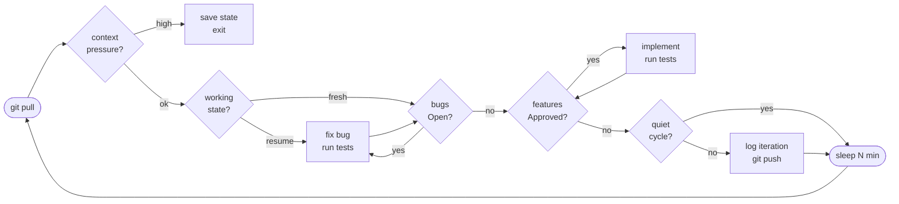
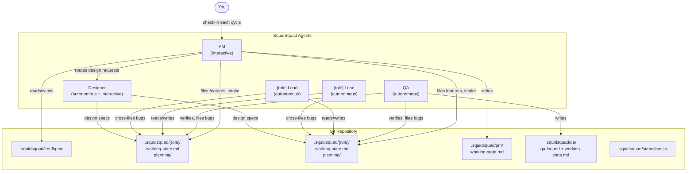

```     
      ▗▄▖
     ▟█ █▙
    ▐█• •█▌
   ███████
   ▐█████▌
    ▐▌▐▌▐▌
  S Q U I D S Q U A D
```

# SquidSquad

**Your AI dev team that coordinates through markdown, not meetings.**

SquidSquad is a Claude Code skill that spins up autonomous AI agents — one per dev role you define, plus a PM and QA — that work on your codebase in parallel and coordinate through a shared `.squidsquad/` folder. No message queues. No orchestration servers. Just markdown files and git.

---

## What It Is

SquidSquad turns a single git repository into a multi-agent development environment. Each agent runs as a separate Claude Code CLI instance, loops autonomously, and coordinates through GitHub Issues — bugs, features, status transitions, and Discussion all live as Issues, labels, and comments on your repo.

The result: bugs get filed, triaged, fixed, and verified. Features move from backlog to shipped. The PM checks in with you each cycle (non-blocking — it won't wait for your answer) to surface blockers and get approvals. Everything is traceable in GitHub and git history.

---

## How It Works

### Agents

SquidSquad always has a **PM** agent. When dev or designer agents are present, a **QA** agent is automatically added to independently verify their work. Dev agents are defined by you at setup time — one agent per role. You can also add a **Designer** agent for projects that need design-to-code workflows.

| Agent | Loop | Mode |
|-------|------|------|
| **[role] Lead** (one per dev role) | Fix bugs → implement features → run tests → push | Autonomous (`--enable-auto-mode`) |
| **Designer** (optional) | Review design requests → interactive design sessions with human → produce specs → hand off to dev | Autonomous with interactive design sessions |
| **QA** (auto-added when dev/designer present) | E2E tests → verify bugs → test features → health checks → push | Autonomous |
| **PM** | Human check-in → feature intake → backlog management → push | Interactive (you talk to this one) |

**Common team shapes:**

| You say at setup | Agents created |
|-----------------|----------------|
| `fe, be` | FE Lead + BE Lead + QA + PM |
| `fe, be, designer` | FE Lead + BE Lead + Designer + QA + PM |
| `be` | BE Lead + QA + PM |
| `api, worker` | API Lead + Worker Lead + QA + PM |
| `skill` | Skill Lead + QA + PM |

### The Ralph Loop



Dev agents loop autonomously. PM follows the same cadence but focuses on human check-ins, feature intake, and backlog management — no testing. QA runs its own independent loop handling E2E tests, bug verification, feature testing, and agent health checks.

Every step prints a `[🦑]` prefixed marker (e.g. `[🦑] Pulling latest...`, `[🦑] Triaging bugs...`) so SquidSquad activity is easy to spot in terminal scrollback.

### Architecture



All coordination is asynchronous through git — agents pull to read the latest state and push after each work unit. No direct agent-to-agent communication needed.

### Shared `.squidsquad/` Folder

```
.squidsquad/
├── config.md                   <- versions, agents, test commands, interval, thresholds
├── templates/                  <- shared agent instruction templates (build-time substituted)
│   ├── dev-agent-[role].md     <- full Ralph Loop instructions per dev agent
│   ├── pm-agent.md             <- full Ralph Loop instructions for PM
│   └── qa-agent.md             <- full Ralph Loop instructions for QA
├── statusline.sh               <- powers the Claude Code status bar for all agents
├── start-[role].sh/.ps1        <- one boot script pair per dev agent
├── start-pm.sh/.ps1            <- PM boot scripts
├── start-qa.sh/.ps1            <- QA boot scripts
├── [role]/                     <- one folder per dev agent
│   ├── CLAUDE.md               <- bootstrapper: role config + Read instruction to template
│   ├── working-state.md        <- persists task progress across context resets
│   └── iterations/             <- per-cycle logs (last 20 kept)
├── pm/
│   ├── CLAUDE.md               <- bootstrapper: role config + Read instruction to template
│   ├── enhancements.md         <- product backlog
│   ├── working-state.md        <- persists PM task progress
│   ├── iterations/             <- per-cycle logs (last 20 kept)
│   └── migrations/             <- schema migration logs
├── qa/
│   ├── CLAUDE.md               <- bootstrapper: role config + Read instruction to template
│   ├── qa-log.md               <- test run results
│   ├── working-state.md        <- persists QA task progress
│   └── iterations/             <- per-cycle logs (last 20 kept)
├── dm/                         <- Delivery Manager (optional)
│   ├── CLAUDE.md               <- bootstrapper: role config + Read instruction to template
│   ├── working-state.md        <- crash recovery state
│   └── iterations/             <- per-cycle logs (last 20 kept)
├── designer/                   <- Designer (optional, when designer role defined)
│   ├── CLAUDE.md               <- bootstrapper: role config + Read instruction to template
│   ├── working-state.md        <- persists designer task progress
│   ├── iterations/             <- per-cycle logs (last 20 kept)
│   └── specs/                  <- design specs produced by designer
└── vault/                      <- shared memory layer (all agents R/W)
    ├── BRIEFING.md             <- daily context briefing for all agents
    ├── projects/               <- active project context, goals, constraints
    ├── areas/                  <- ongoing concerns: conventions, preferences, values
    ├── resources/              <- reference material, external docs
    ├── archives/               <- shipped features, closed decisions, historical context
    └── galaxy/                 <- atomic knowledge notes (decisions, patterns, learnings)
```

---

## Features

### Status Line (Emoji Rich)
A live status bar at the bottom of each agent's Claude Code session. **Line 1**: 🦑 + role/version, backlog (🐛 bugs, ⭐ features) or active task (🔨 FEAT-XXX), context pressure (🧠/🧠🔥/🧠💀 with colored percentage), cycle countdown (🔄/🔜), and for PM: health icons (🦑/👻/❓) + rest nudge. **Line 2**: current Ralph Loop step (emoji + description, truncated at 60 chars) or rotating contextual hints when idle — human-facing prompts like "Msg me any time to file a bug", rotating every 60 seconds, phase-aware. Hint pools defined in `references/hints-dev.txt` and `references/hints-pm.txt`.

### Step Markers
Every Ralph Loop step prints a `[🦑]` prefixed line (e.g. `[🦑] Pulling latest...`, `[🦑] Triaging bugs...`, `[🦑] Committing and pushing...`). Makes SquidSquad activity easy to scan in terminal scrollback.

### Working State File
Agents persist current task progress to `.squidsquad/[role]/working-state.md` — what they're working on, completed steps, remaining steps, key decisions. If a context window fills up, the agent saves state and exits cleanly. On restart, it resumes from the saved state instead of starting over.

### Context Pressure Detection
At the start of each cycle, agents check `context_window.used_percentage`. If above the configurable threshold (default 80%), they save working state, commit pending work, and exit for a fresh context. The boot script restarts them automatically.

### Cross-Clone Health Detection
Agent health is detected by reading each agent's `current-state` file via cross-clone absolute paths stored in `.squidsquad/.local-config` (gitignored, machine-specific). No GitHub API calls, no `git fetch`, no background processes. The `current-state` file is written every cycle (including quiet ones), so its mtime indicates when the agent last completed a cycle. Health icons: 🦑 healthy (within 2× interval), 👻 stalled, ❓ unknown/no data.

### Quiet Cycle Skipping
Agents skip the iteration log and commit when no work was done — and produce no text output at all on quiet cycles. Iteration counters only increment on productive cycles. Keeps git history, iteration logs, and terminal scrollback meaningful.

### Self-Improvement Scanning
When enabled (`config.md` `Improvement Scanning: yes`), agents use quiet cycles to scan the target project for improvements in their domain: dev finds code quality issues, QA finds test coverage gaps, designer spots design inconsistencies, DM catches documentation gaps, and PM identifies process improvements. Findings are rate-limited (max 2 per scan, after 3 consecutive quiet cycles) and routed through PM to be filed as normal features or bugs — you review and approve them like any other work item. Agents scan your project, not SquidSquad's own files.

### Iteration Log Retention
Each agent keeps the last 20 iteration files. Older logs are deleted — git history preserves them if needed.

### PR-Based Approval Flow (optional)
When enabled (`config.md` `PR Flow: yes`), dev agents create feature branches and PRs via `gh` CLI instead of pushing to main. Human reviews and merges on GitHub. PM monitors PR state and syncs comments, merge decisions, and change requests back to the tracker Discussion.

### GitHub Issues as Tracker
All bugs and features are tracked as GitHub Issues with labels for type (`bug`/`feature`), priority, status, and role. Agents use `gh` CLI to create, read, update, and comment on Issues. Discussion entries become Issue comments (same timestamped, role-signed format). Status transitions are label changes. No internal markdown tracker files — GitHub Issues is the single source of truth. External contributors can file Issues directly and PM triages them into the SquidSquad workflow.

### Designer Agent
A dedicated agent type for design-to-code workflows. The designer works interactively with you to produce structured design specs (component specs, design tokens, layout specs, visual states) that dev agents implement from. Supports external design tool integration (Figma, Google Stitch, or any MCP-connected tool) and assesses technical feasibility before committing to a design direction. Features with a `Design` field are routed through the designer before reaching dev. Works without an external tool connected (manual design spec mode).

### Subagent Delegation (Planning Phases)
PM spawns subagents for research-heavy planning phases — Research, Discussion, Planning — so the main PM context stays lean. Each phase produces an artifact (`RESEARCH.md`, `CONTEXT.md`, `TEST-PLAN.md`) that dev agents consume during implementation. Light mode skips subagents for trivial features.

### Status Bar Chaining
SquidSquad no longer replaces the user's existing Claude Code status bar. Setup saves the current `statusLine` command to `.squidsquad/.user-statusline`, and `statusline.sh` chains it — user's output appears first, SquidSquad appends as the last line. Silent 1-second timeout fallback if the user's command hangs.

### Auto Versioning
PM tracks shipped items and auto-bumps the minor version every N items (configurable in `config.md`, default 10) when zero open bugs exist. Creates a git tag, updates `config.md`, `SKILL.md`, and `CHANGELOG.md`. Bypasses PR flow to avoid blocking on review.

### Vault Memory Layer
A git-tracked, Obsidian-compatible shared memory vault (`.squidsquad/vault/`) that gives all agents R/W access to institutional knowledge. Follows the **PARAG** structure — Projects, Areas, Resources, Archives, Galaxy (atomic Zettelkasten notes). Agents build knowledge about your values, styles, preferences, decisions, and patterns over time, shaping the entire squad to be closer to you. Uses wikilinks for relationships, YAML frontmatter for metadata, and append-only changelogs per note. Browsable in the Obsidian app for visual graph exploration. No infrastructure needed — just markdown and git.

### Agent Personalities (SOUL.md)
Each agent role has a distinct personality that shapes how it communicates, makes decisions, and collaborates. PM is the diplomat, QA is the skeptic, dev is the pragmatist, designer is the creative, and DM is the closer. Personalities are hardcoded per role and define tone, communication style, boundaries, and decision-making approach — so Discussion entries and agent behavior feel distinct rather than generic.

### Externalized Agent Templates
Agent `CLAUDE.md` files are small ~20-line bootstrappers containing role config and a Read instruction pointing to a shared template in `.squidsquad/templates/`. Templates are maintained in one place and regenerated on upgrade without touching bootstrappers or tracker files.

### Open Planning Artifacts in VS Code
After each planning phase (Research, Discussion, Planning), PM offers to open the artifact in VS Code. "Never ask again" persists to `config.md` and suppresses all future prompts. Falls back to printing the file path if the `code` CLI is not available.

### `/squidsquad-status` Command
Type `/squidsquad-status` in any Claude session in the repo to get a quick dashboard: agent health, open bugs/features per agent, recently shipped items.

---

## Philosophy

### Git Is the Bus

All agent coordination flows through git. Agents read shared markdown files, append Discussion entries, update statuses, and push. There are no message queues, no orchestration servers, no databases. The `.squidsquad/` folder *is* the system — everything else is just Claude Code instances reading and writing to it.

### Complete Audit Trail

Every decision, bug discussion, feature negotiation, QA result, and status change lives in git history. Tracker Discussion sections are the project's discussion archive — not Slack, not email, not ephemeral chat. `git log` and `git blame` reconstruct the full story of any change: who filed it, who investigated, what the human said, what approach was agreed on, and when it shipped.

### No External Dependencies

Core workflow requires nothing beyond git and Claude Code. No API keys for coordination, no cloud services for state, no third-party integrations for agents to talk to each other. Optional features (PR flow, GitHub Issues ingestion) layer on top without changing the fundamental model.

### One Exception: Real-Time Health

Agent health detection reads `current-state` files across clones via local filesystem paths — the one place where SquidSquad steps outside git. This is purely operational (is the agent alive?) and doesn't carry content, decisions, or audit trail. Everything that matters is in git.

---

## Quick Start

### 1. Install the Skill

Add SquidSquad as a Claude Code skill by placing `SKILL.md` in your Claude Code skills directory, or reference it directly.

### 2. Set Up Your Project

In a Claude Code session, say:

```
Set up SquidSquad for my project.
```

Claude will ask for your project name, repo URL, dev agent roles (e.g. `be` for solo backend, `fe, be` for full-stack, or any custom names), test commands, loop interval, and optional GitHub integrations (PR flow, issue ingestion). Then it generates the full `.squidsquad/` folder structure.

### 3. Launch the Agents

Open one terminal per agent:

**bash / zsh:**
```bash
# Terminal 1 — [role] Lead (autonomous)
bash .squidsquad/start-[role].sh

# Terminal N — QA (autonomous)
bash .squidsquad/start-qa.sh

# Terminal N+1 — PM (interactive — you talk to this one)
bash .squidsquad/start-pm.sh
```

**PowerShell:**
```powershell
# Terminal 1 — [role] Lead (autonomous)
.\.squidsquad\start-[role].ps1

# Terminal N — QA (autonomous)
.\.squidsquad\start-qa.ps1

# Terminal N+1 — PM (interactive)
.\.squidsquad\start-pm.ps1
```

All agents run interactively with `--enable-auto-mode`. The boot script injects the role via `--append-system-prompt "SQUIDSQUAD_ROLE=<role>"` — agents read this from their system prompt, load their role-specific instructions from `.squidsquad/<role>/CLAUDE.md`, and start their Ralph Loop immediately.

### 4. Interact Via PM

The PM agent prints a non-blocking check-in note each cycle. You can chime in anytime to:
- Report a new bug → it gets filed to the right team
- Request a new feature → it enters the backlog as `Pending`
- Approve a pending feature → it becomes `Approved` and the team picks it up
- Change priorities → the PM updates the tracker

---

## Cross-Team Bug Filing

Any agent can file a bug as a GitHub Issue with the appropriate role label — no routing bottleneck.

| Who discovers the bug | Files as | Labels |
|-----------------------|----------|--------|
| [role] Lead (own issue) | `gh issue create` | `bug`, `role:[role]` |
| [role] Lead (other team's code) | `gh issue create` | `bug`, `role:[other]` |
| QA (from test/verification) | `gh issue create` | `bug`, `role:[role]` |

The agent that discovers the problem files it with complete context. The receiving agent picks it up on their next cycle via `gh issue list`. No standup required.

---

## Requirements

- [Claude Code CLI](https://claude.ai/code) — agents run as interactive Claude Code sessions
- `--enable-auto-mode` — agents need permission to read/write files and run tests without prompting
- A GitHub repository — SquidSquad uses GitHub Issues as its tracker
- `gh` CLI — authenticated and with Issues permissions (`gh auth status`)
- Test commands that can be run from the repo root (optional per agent)

---

## Git Protocol

SquidSquad agents follow strict conventions to minimize conflicts:

- Always `git pull --rebase` before starting work
- Tracker lives in GitHub Issues — agents use `gh` CLI for all bug/feature operations
- Discussion entries are Issue comments — timestamped, role-signed, append-only
- **Commit prefix convention**: every commit starts with `role:` (e.g. `skill: fix bug`, `pm: verify features`) — used by health detection and status line
- Push after every completed work unit
- Rebase conflicts in config/state files are resolved by keeping both versions

---

## Versioning

SquidSquad uses [semver](https://semver.org). Releases are tagged on GitHub (`v0.5.0`, `v1.0.0`, etc.).

The installed version is stored in `.squidsquad/config.md` and shown in the boot logo on every Claude Code session start.

### Upgrading

1. Pull the latest `SKILL.md` (or check out the new tag)
2. In your project, say: **"upgrade squidsquad"**
3. The skill reads the version in `.squidsquad/config.md`, compares it to the current skill version, and migrates — regenerating templates in `.squidsquad/templates/`, boot scripts, and the `settings.json` hook without touching your tracker files, bootstrapper CLAUDE.md files, or config values

See [CHANGELOG.md](./CHANGELOG.md) for what changed between versions.

---

## License

[AGPL-3.0](./LICENSE)
