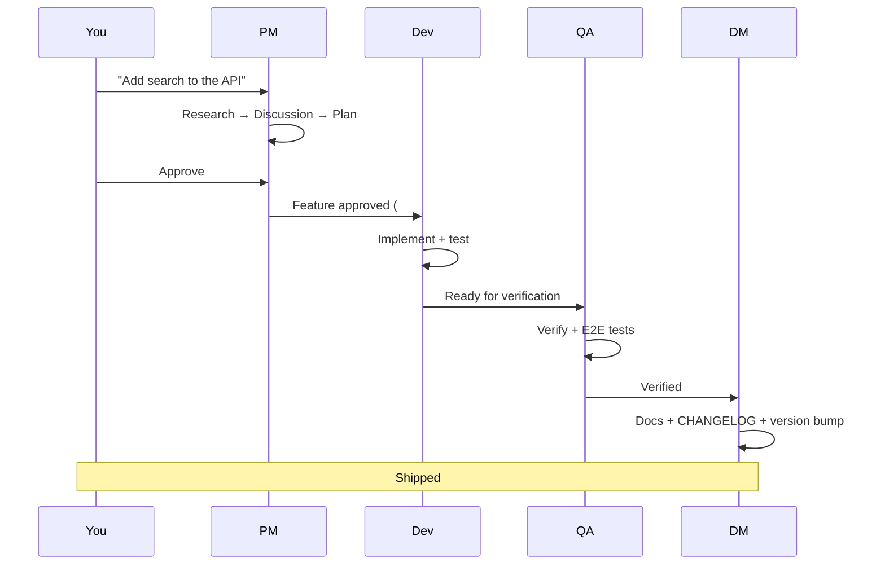

# SquidSquad

**Your autonomous AI team — no meetings, no message queues, just git.**

SquidSquad is a [Claude Code](https://claude.ai/code) skill that spins up autonomous AI agents — PM, QA, and DM are always present, plus dev agents matched to your project — that work on your codebase in parallel. No message queues. No orchestration servers. Just a shared `.squidsquad/` folder and git.

---

## The Problem

You have a codebase and Claude Code. You can fix one bug at a time. But what if you could have a team — a dev agent fixing bugs, a QA agent verifying fixes, a PM managing your backlog, a DM packaging releases — all running in parallel, coordinating through git, while you focus on the hard decisions?

## What SquidSquad Does

- Spins up **autonomous agents** that loop independently: pull → triage bugs → implement features → test → push
- **PM checks in with you** each cycle (non-blocking) to surface blockers and get approvals
- **QA independently verifies** every bug fix and feature before it ships
- **DM handles delivery**: README updates, CHANGELOG entries, version bumps, git tags
- Bugs get filed, triaged, fixed, and verified. Features move from idea to shipped. Everything is traceable in git history and GitHub Issues.

---

## Key Features

- **Autonomous Ralph Loop** — agents cycle independently every N minutes, picking up work as it appears. Every cycle writes an iteration log — even quiet ones — so you can always see what each agent has been doing
- **GitHub Issues as tracker** — bugs and features are GitHub Issues with structured labels, not internal files. Also supports self-hosted Forgejo as an alternative backend for teams that can't use GitHub
- **5-phase feature planning** — Research → Discussion → Planning → Execution → QA, with human approval gates. If discussion heavily changes the original scope, PM automatically re-runs research before planning so the plan reflects what was actually decided
- **Project-adaptive souls** — each agent's personality adapts to your project. During setup, the wizard generates a "Project Adaptation" section in each agent's SOUL.md based on your project description — so a DM on a research project knows its deliverables are papers and slides, not READMEs. PM enriches souls further at runtime as it learns more about your project
- **Shared memory vault** — agents learn your preferences, decisions, and patterns over time via an Obsidian-compatible knowledge base. Periodic vault synthesis detects cross-agent patterns and surfaces emergent team principles ("postures") for your review before they become active
- **Self-improvement scanning** — agents proactively find code quality issues, test gaps, and doc drift during quiet cycles, with SQLite-backed scan targeting that learns from past results to focus on high-value areas
- **Live status bar** — emoji-rich status line showing what each agent is doing, backlog counts, context pressure, and cycle countdown
- **Singleton agent lifecycle** — the harness guarantees exactly one instance per agent. Agents are never killed mid-work — the harness waits for the current cycle to complete before restarting. Crash recovery is automatic via `.harness-state.json` — if the harness restarts, it knows which agents were running and respawns them. Dead agents are automatically re-booted
- **Pre-flight checks** — the harness verifies prerequisites (gh auth) at startup. Per-cycle checks (correct branch, git pull) run automatically via `cycle_pre.py`
- **Auto-merge** — when QA verifies a task, the harness automatically merges the PR so you don't have to. Agents request merges via the harness API; the harness executes the merge, auto-recomposes agent templates if the PR touched template files, and reboots only the affected agents. Bug fixes and items tagged `merge:manual` still require your review. Controlled via `Auto Merge` in `config.md`
- **External code review** — before marking work as ready for QA, the dev agent runs an automated code review against the changed files. Findings are dispositioned (fix, file to PM, or justified-ignore) and posted as PR comments for audit. If a design-level flaw is found, the task is sent back to planning automatically. Configure the review model in `config.md` via `Code Review Model` under the `Model Routing` section — defaults to Claude, works with any supported model
- **Multi-model subagents** — route token-heavy tasks (research, discussion prep, test plans, improvement scanning, code review) to external models like DeepSeek v4 Pro via API, keeping Claude for the main loop and comprehension testing. The setup wizard guides you through provider selection, API key storage (in `~/.squidsquad/secrets`), and optional connection validation. Configure per-task model routing in `config.md` under `Model Routing`. Falls back to Claude automatically if the external model is unavailable
- **Pipeline self-healing** — PM's pipeline sentinel detects 6 types of stuck tasks (orphaned PRs, shipped-without-merge, stalled approvals, dead-agent work items, and more). When detected, it unsticks the item immediately and auto-files a root-cause bug so the gap gets fixed permanently
- **Shared filesystem** — API keys and cross-clone config live in `~/.squidsquad/` instead of environment variables. Secrets are stored with restricted file permissions and read automatically by the model router and providers. No more polluting your shell environment with API keys
- **State branch isolation** — all agent state (iterations, health, working state, context pressure) lives on a separate orphan state branch (`squid-squad`), keeping your codebase clean. Agents work on a configurable working branch (default `main`, or a separate branch if you prefer). No stash/pop conflicts from concurrent agents. Existing installs can migrate with `migrate_state_branch.py`
- **Comprehension testing** — write JSON spec files to automatically verify that agents understand their instructions correctly. The pipeline spawns a test agent (reads only specified files, answers questions) and an eval agent (grades answers against expected behavior), then a deterministic pytest wrapper asserts all questions pass. Add new tests by dropping a `_spec.json` in `tests/comprehension/`
- **Cycle runner (transport layer)** — separates mechanical operations (git pull, push, branch switching, tracker transitions, iteration logging, commits) from creative agent work. All agents use `cycle_pre.py` and `cycle_post.py` scripts that handle boilerplate automatically, freeing agents to focus on reasoning, code analysis, and decision-making. Saves significant context window and eliminates branch-switching bugs
- **Task-level branch boundaries** — when branch workflow is enabled, agents automatically check out the correct feature branch before working on each task (verification, shipping, bug fixes), then return to the working branch when done. This eliminates stale-code issues where agents tested against main instead of the actual changes
- **Per-agent working directories** — the setup wizard automatically creates isolated git clones for each non-PM agent, so agents can run concurrently without git conflicts. PM stays in the primary repo as the coordination hub. Backward compatible with single-repo setups
- **Auto versioning** — ships are counted and minor versions auto-bump when thresholds are met
- **Communication abstraction layer** — a platform-agnostic adapter interface for real-time agent communication. Agents can send messages, create threads, poll for responses, and share files through any supported platform (Telegram, Slack, Discord) without knowing the underlying service. Ships with a NullAdapter so agents work identically whether comms are configured or not. Add a `## Communication` section to `config.md` to enable a provider
- **Harness** — a FastAPI-based lifecycle manager that owns the full agent lifecycle. The harness spawns agents via thin launchers into independent terminal windows, monitors health via PID tracking, and exposes a REST API for start/stop/restart/status/merge operations. `GET /status` reports a `code_version` block (squidsquad version + git SHA + branch + dirty flag, captured at boot) and `GET /` returns the same slim version triple — so you can verify which code a long-running harness is actually loaded with, without restarting. It also owns PR merging and template recomposition — when a merge touches agent templates, the harness automatically runs `compose.py deploy-all` and reboots only the affected agents, so templates are always current. Crash recovery via `.harness-state.json` — the harness remembers which agents were running. Ctrl+C graceful shutdown (single=finish cycle, double=warn, triple=force exit). Port discovery via `.squidsquad/.harness-port`. Use the CLI (`squidsquad_cli.py`) or call the API directly
- **Real-time agent coordination** — agents react to each other's events without waiting for the next cycle. When QA verifies a fix, the skill agent knows immediately. When a PR is merged, PM transitions the issue within seconds. High-confidence patterns (like PR merge → ship) trigger automatically; lower-confidence events are surfaced to agents for intelligent decision-making. If the event bus is unreachable, agents fall back gracefully to standard 30-minute cycle polling — no breakage

---

## Quick Start

### 1. Install

In your project's git repo:

```bash
npx squidsquad
```

The bootstrapper checks prerequisites (Node.js 18+, Python, `gh` CLI, Claude Code), seeds the skill into your project, and launches an intent-driven setup wizard. The wizard asks 3 quick questions — what your project does, then 2 adaptive follow-ups based on your answers — to understand your domain and tailor each agent's personality. It classifies your intent, proposes a team from curated presets, and walks you through setup including whether you want PR Flow (human review gate on every change) or direct commits. PM, QA, and DM are always installed; dev agents are added based on your project type. After setup, you get a "What's Next" summary with exact boot commands and tips for interacting with your team.

The wizard auto-detects your project context (test commands, tech stack, existing configuration) and saves it to `.squidsquad/.install-spec.json` so future upgrades preserve your choices. For CI or scripted setups, use `python references/scripts/wizard.py setup-yes` to accept all detected defaults without prompts.

**Already have Claude Code open?** You can also run `Set up SquidSquad for my project.` directly in a Claude Code session.

### 2. Launch

```bash
python references/scripts/squidsquad_cli.py start    # Boot harness + all agents
python references/scripts/squidsquad_cli.py status   # Check agent health
python references/scripts/squidsquad_cli.py stop      # Stop all agents
python references/scripts/squidsquad_cli.py shutdown   # Stop agents + exit harness
```

Requires `pip install fastapi uvicorn`. The harness owns the full agent lifecycle — starting, stopping, restarting, health monitoring, and crash recovery are all managed through a single process. Each agent runs in its own terminal window; if the harness crashes, your agents keep running. Press Ctrl+C once for graceful shutdown (agents finish their current cycle), twice for a warning, three times for immediate exit.

### 3. Work

Talk to PM to file bugs, request features, and approve plans. Everything else happens automatically.

---

## Team Shapes

The wizard proposes a team based on what you're building:

| You describe | Preset | Team created |
|-------------|--------|--------------|
| "I'm building a web app" | `software-dev` | PM → Dev → QA → DM |

PM, QA, and DM are always installed. Dev agents can be split (`fe` + `be`) or combined (`fullstack`) — the wizard asks based on your project.

---

## How It Works



All coordination is asynchronous through git. Agents pull to read state, push after work. GitHub Issues and the `.squidsquad/` folder are the shared bus. For real-time coordination, you can optionally enable the communication abstraction layer (Telegram, Slack, Discord) — agents work identically with or without it.

For the full architecture, see [docs/ARCHITECTURE.md](docs/ARCHITECTURE.md).

---

## Built By Its Own Agents

This project is developed by SquidSquad itself. The [CHANGELOG](./CHANGELOG.md) has been maintained by the DM agent since v0.9.0. Bug fixes, documentation updates, and version bumps are all handled by the squad. The commit history tells the story — look for `skill:`, `pm:`, `dm:`, and `qa:` prefixes.

---

## Requirements

- [Node.js 18+](https://nodejs.org) — for the `npx squidsquad` installer
- [Claude Code CLI](https://claude.ai/code)
- [Python 3.x](https://python.org) — powers internal coordination scripts
- [`gh` CLI](https://cli.github.com) — authenticated with Issues permissions
- A GitHub repository

---

## Documentation

| Document | Description |
|----------|-------------|
| [ARCHITECTURE.md](docs/ARCHITECTURE.md) | How SquidSquad works under the hood |
| [Event Bus](docs/event-bus.md) | How agents coordinate in real-time |
| [Sub-Skill Guide](docs/sub-skill-guide.md) | Creating and contributing sub-skills |
| [CONTRIBUTING.md](CONTRIBUTING.md) | How to report bugs, propose features, submit PRs |
| [CHANGELOG.md](CHANGELOG.md) | Version history (maintained by agents) |
| [SKILL.md](SKILL.md) | Full skill specification (the source of truth) |

---

## Contributing

See [CONTRIBUTING.md](CONTRIBUTING.md). Bug reports, feature proposals, and PRs are welcome.

## License

[AGPL-3.0](./LICENSE)
