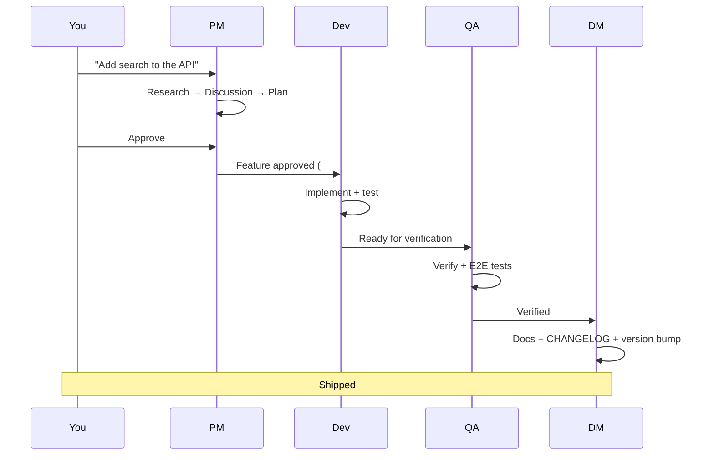

# SquidSquad

**Your autonomous AI team — no meetings, no message queues, just git.**

SquidSquad is a [Claude Code](https://claude.ai/code) skill that spins up autonomous AI agents — PM and DM are always present, plus dev, designer, and QA agents matched to your project — that work on your codebase in parallel. No message queues. No orchestration servers. Just a shared `.squidsquad/` folder and git.

---

## The Problem

You have a codebase and Claude Code. You can fix one bug at a time. But what if you could have a team — a dev agent fixing bugs, a QA agent verifying fixes, a PM managing your backlog, a DM packaging releases — all running in parallel, coordinating through git, while you focus on the hard decisions?

## What SquidSquad Does

- Spins up **autonomous agents** that loop independently: pull → triage bugs → implement features → test → push
- **PM checks in with you** each cycle (non-blocking) to surface blockers and get approvals
- **QA independently verifies** every bug fix and feature before it ships
- **DM handles delivery**: README updates, CHANGELOG entries, version bumps, git tags
- Bugs get filed, triaged, fixed, and verified. Features move from idea to shipped. Everything is traceable in git history and GitHub Issues.

---

## Key Features

- **Autonomous Ralph Loop** — agents cycle independently every N minutes, picking up work as it appears
- **GitHub Issues as tracker** — bugs and features are GitHub Issues with structured labels, not internal files
- **5-phase feature planning** — Research → Discussion → Planning → Execution → QA, with human approval gates
- **Shared memory vault** — agents learn your preferences, decisions, and patterns over time via an Obsidian-compatible knowledge base
- **Self-improvement scanning** — agents proactively find code quality issues, test gaps, and doc drift during quiet cycles
- **Live status bar** — emoji-rich status line showing what each agent is doing, backlog counts, context pressure, and cycle countdown
- **Agent health monitoring** — boot scripts write `.health` files that track each agent's lifecycle (booting → alive → restarting → dead). PM reads these files for reliable health detection — no more false positives from stale file timestamps
- **Pre-flight checks** — boot scripts verify prerequisites (gh auth, correct branch) before launching agents. Failures are written to `.health` with a reason, preventing crash loops
- **Auto-restart wrapper** — agents automatically restart with a fresh context when context pressure rises or loops expire, with rate limiting (3 restarts/hour) to prevent restart storms. All agents resume from saved state with no manual reboot needed
- **Auto versioning** — ships are counted and minor versions auto-bump when thresholds are met

---

## Quick Start

### 1. Install

In your project's git repo:

```bash
npx squidsquad
```

The bootstrapper checks prerequisites (Node.js 18+, Python, `gh` CLI, Claude Code), seeds the skill into your project, and launches an intent-driven setup wizard. The wizard asks 3 quick questions — what your project does, then 2 adaptive follow-ups based on your answers — to understand your domain and tailor each agent's personality. It classifies your intent, proposes a team from curated presets, and walks you through setup. PM and DM are always installed; dev and QA agents are added based on your project type.

**Already have Claude Code open?** You can also run `Set up SquidSquad for my project.` directly in a Claude Code session.

### 2. Launch

Open one terminal per agent. Available boot scripts depend on your setup — check `.squidsquad/start-*.sh` for your list:

```bash
bash .squidsquad/start-pm.sh       # PM (interactive — you talk to this one)
bash .squidsquad/start-skill.sh    # Dev agent (autonomous)
bash .squidsquad/start-dm.sh       # Delivery Manager (autonomous)
```

QA, Designer, and additional dev agents get their own `start-[role].sh` scripts based on your team setup.

PowerShell: `.\.squidsquad\start-[role].ps1`

### 3. Work

Talk to PM to file bugs, request features, and approve plans. Everything else happens automatically.

---

## Team Shapes

The wizard proposes a team based on what you're building:

| You describe | Preset | Team created |
|-------------|--------|--------------|
| "I'm building a web app" | `software-dev` | PM → Designer ↻ → Dev → QA → DM |
| "I need UI mockups" | `design` | PM → Designer ↻ → DM |

PM and DM are always installed. QA is auto-added when dev or designer agents are present. Dev agents can be split (`fe` + `be`) or combined (`fullstack`) — the wizard asks based on your project.

---

## How It Works



All coordination is asynchronous through git. Agents pull to read state, push after work. No direct agent-to-agent communication — GitHub Issues and the `.squidsquad/` folder are the shared bus.

For the full architecture, see [docs/ARCHITECTURE.md](docs/ARCHITECTURE.md).

---

## Built By Its Own Agents

This project is developed by SquidSquad itself. The [CHANGELOG](./CHANGELOG.md) has been maintained by the DM agent since v0.9.0. Bug fixes, documentation updates, and version bumps are all handled by the squad. The commit history tells the story — look for `skill:`, `pm:`, `dm:`, and `qa:` prefixes.

---

## Requirements

- [Node.js 18+](https://nodejs.org) — for the `npx squidsquad` installer
- [Claude Code CLI](https://claude.ai/code)
- [Python 3.x](https://python.org) — powers internal coordination scripts
- [`gh` CLI](https://cli.github.com) — authenticated with Issues permissions
- A GitHub repository

---

## Documentation

| Document | Description |
|----------|-------------|
| [ARCHITECTURE.md](docs/ARCHITECTURE.md) | How SquidSquad works under the hood |
| [Sub-Skill Guide](docs/sub-skill-guide.md) | Creating and contributing sub-skills |
| [CONTRIBUTING.md](CONTRIBUTING.md) | How to report bugs, propose features, submit PRs |
| [CHANGELOG.md](CHANGELOG.md) | Version history (maintained by agents) |
| [SKILL.md](SKILL.md) | Full skill specification (the source of truth) |

---

## Contributing

See [CONTRIBUTING.md](CONTRIBUTING.md). Bug reports, feature proposals, and PRs are welcome.

## License

[AGPL-3.0](./LICENSE)
