# Agent Runtime Architecture (draft)

_How a SquidSquad agent's operating model is defined — what triggers it to act, and what one act looks like._

> **Status**: DRAFT, consolidating prior docs now under `docs/archive/`: `EVENT-ARCHITECTURE.md` (v2 nudge-driven design), `EVENT-BUS-ARCHITECTURE.md` (v1 PRD), and `event-bus.md` (v1 narrative). Those three are kept for traceability; this doc is the canonical reference going forward.

---

## Terminology (L2 categorical role names)

This document uses the L2 categorical role names from `responsibility.md`. The four canonical roles:

| Role | Responsibility (one line) |
|---|---|
| **`pm`** | Coordinates the team and the human; manages workflow and process |
| **`qa`** | Verifies the product being delivered; does not do technical implementation |
| **`worker`** | Implements technical work to acceptance criteria |
| **`dm`** | Delivers (CHANGELOG, version bumps, releases) |

Installs may add `worker` variants (`ios`, `android`, `web`, etc.) or specialized `qa` variants. The architecture below works at the categorical level — wire-format payloads, permission tables, and routing rules name only these four roles.

---

## 1. Goal & scope

This doc covers **how an agent decides when to act, and what one act looks like**:

- Which triggering modes are available (loop vs event-driven), how the agent runs under each, and how an install picks
- The shared infrastructure both modes depend on (process tree, event bus, state files)
- The migration path between them

Out of scope:

- *What* an agent does step-by-step (see [`sub-skill-catalog.md`](sub-skill-catalog.md))
- *How* instructions compose into a CLAUDE.md (see [`COMPOSE-ARCHITECTURE.md`](COMPOSE-ARCHITECTURE.md))
- *What* an agent is in the broader system stack (see [`ARCHITECTURE.md`](ARCHITECTURE.md))

---

## 2. Two triggering modes

Every agent in an install runs in the same mode — there is one global mode for the project, selected at install via `config.md`'s `event-driven:` field:

| Mode | What wakes the agent | Event-bus relationship | When to use |
|---|---|---|---|
| **Loop (polling)** | Cron timer (`/loop 30m execute one Ralph Loop cycle`) | **Emit-only** — agents may publish transient events for observability, but do NOT consume from the bus and do NOT maintain a cursor. Work queue + mechanical reactions both derive from tracker state. | Battle-tested fallback; works without the harness; current default |
| **Event-driven (nudge)** | A nudge from the harness, delivered via the Claude Monitor tool's stdin | **Emit + consume** — agents subscribe with a cursor; nudges + per-event reactions both originate from the bus. | Target steady-state; lower latency; no idle token burn |

The cycle wrapper (pre → creative → post) is the same in both modes — only *what initiates the wrapper* and *where reactions derive from* differs.

**Mutual exclusivity** is intentional: loop mode and event mode are exclusive on both the wake-mechanism axis (cron vs nudge) AND the event-bus axis (emit-only vs emit+consume). A loop-mode agent that consumed events would re-introduce the harness dependency loop mode exists to avoid; an event-mode agent that polled the tracker as its work queue would re-introduce the latency floor event mode exists to fix.

### 2.1 Why both exist

Loop mode has three persistent problems v2's event-driven mode fixes:

1. **Latency floor** — an agent can be idle up to 30 min after work arrives. Worst case end-to-end ship: qa completes at min 0, dm doesn't notice until min 30, ships at min 32. Polling gaps dominate shipping latency.
2. **Tokens burned on idle cycles** — every cycle costs context window even when nothing is happening.
3. **Cycle/work coupling** — the cycle wrapper fires on the timer, not on the work. State churn happens regardless.

Event-driven mode replaces the cron with on-demand wakeups. Claude's Monitor tool sees a stdin line and wakes the session immediately. Agents stay asleep when there's nothing to do; cycles fire because work arrived.

The trade-off: the harness becomes load-bearing infrastructure. If it's down, agents can't be nudged. Loop mode is the fallback for that case (#9580 / #9588).

### 2.2 Before vs after at a glance

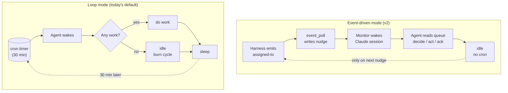

---

## 3. The agent process tree (shared)

Both modes use the same per-agent subprocess shape. Differences are inside the Claude session, not in the tree.

### 3.1 System overview

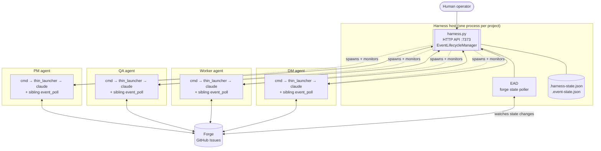

### 3.2 Per-agent subprocess tree (zoomed)

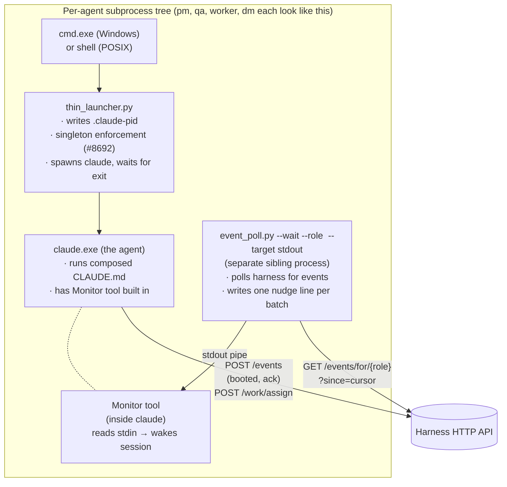

`thin_launcher` and `event_poll` are intentionally separate processes (decided 2026-05-22):

- Monitor needs a long-lived stdin source — `event_poll`'s exact job.
- `thin_launcher` exits when Claude exits — wrong shape for Monitor's contract.
- Failure isolation: an `event_poll` crash doesn't take Claude down.
- Restart semantics: harness can restart `thin_launcher` to respawn Claude without losing polling state.

Conceptually they form "the agent's launcher subprocess tree." Implementation-wise they're two processes.

### 3.3 The `.claude-pid` convention

`thin_launcher` writes its own `cmd.exe` PID (not `claude.exe`'s PID) into `.squidsquad/<role>/.claude-pid` at boot. This is the singleton handle the harness watches. See [`ARCHITECTURE.md`](ARCHITECTURE.md) for the "three claude.exe populations" and orphan-reaping rules.

In loop mode, `event_poll` is not spawned — only `cmd → thin_launcher → claude` runs.

---

## 4. The event bus (shared infrastructure)

The event bus is the harness HTTP API at port `7373` (default). Both modes use it:

- **In loop mode**: optional observability layer. Agents emit events for diagnostics; pre-cycle reads recent events and applies mechanical reactions (e.g., PR merge → status transition). When the harness is down, agents fall back silently to git-only coordination.
- **In event-driven mode**: load-bearing. The bus is how the harness wakes the agent in the first place. When the harness is down, agents fall through to loop mode (#9580 / #9588).

### 4.1 Architectural commitments (locked principles)

From `decision-event-bus-architecture-redesign` vault note (locked cycles 1541–1542):

1. **Harness is a transport bus, not an orchestrator.** It moves signals between producers and consumers. It does NOT track work completion, ticket state, or workflow status.
2. **Forge (GitHub Issues) is the source of truth for work state.** Status labels, comments, PR merges = the project's institutional state. Harness has no opinion on whether work is done.
3. **Agent owns work completion.** The agent acts on signals; what it does with them is between the agent and the forge.
4. **Ack = receipt confirmation, NOT completion confirmation.** "Ack" means "the signal was delivered to the agent's session." It does NOT mean "the agent finished processing."
5. **No `POST /events/{id}/complete` endpoint.** Reject any design that adds endpoints for completion state. The bus uses events, not RPC, for state transitions.

### 4.2 Signal catalog

In v2 the catalog collapses to **3 signal concepts / 4 catalog entries**:

| Signal | Direction | When | Payload |
|---|---|---|---|
| **`booted`** | agent → harness | First action after the agent's Claude session boots | `{role, pid, clone_path, version}` |
| **`assigned-to`** | harness → agent (queue entry) | Harness detects work exists for the role | `{issue_number, target_role, event_context, payload}` (EAD populates `payload.title` from the forge issue; `/work/assign` callers may pass it through the `payload` object) |
| **`ack-cursor`** | agent → harness | Agent has received a delivered signal; advances harness cursor | `{event_id, role}` |
| **`ack-stop`** | agent → harness | Agent has accepted a stop intent and is checkpointing | `{event_id, result}` |

`ack-cursor` and `ack-stop` are sub-types of one concept (receipt confirmation) — shipped in `#9873-A`. Three signal concepts, four catalog entries.

#### Signal-flow at a glance

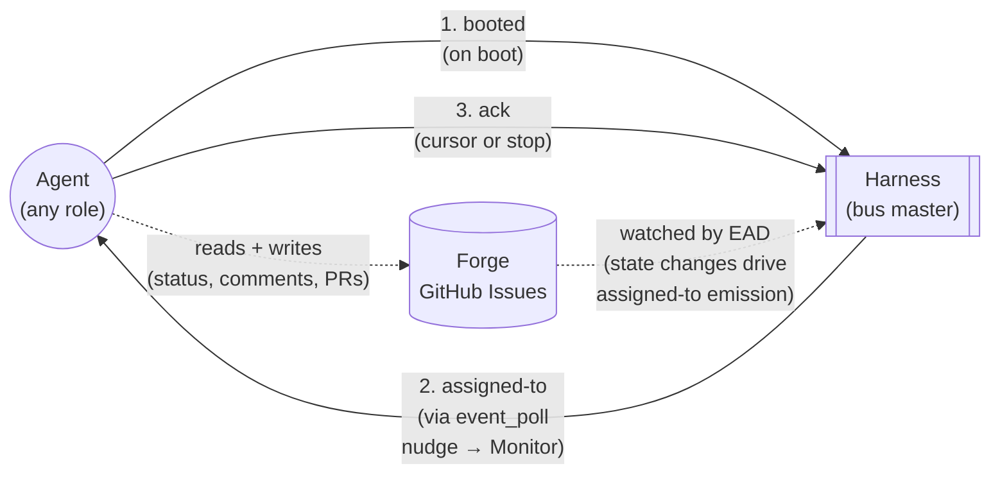

#### What is OUT of the v2 catalog

Removed under v2 (collectively 20 catalog entries):

- **Lifecycle ticks**: `cycle-start`, `cycle-end` — local to the agent, no other agent cares.
- **Git activity**: `git-pull`, `git-push`, `git-commit`, `branch-checkout` — local side effects, recorded in git itself.
- **PR activity**: `pr-create`, `pr-merge`, `pr-merged` — recorded in forge; if relevant to another role, harness translates to `assigned-to`.
- **Tracker activity**: `status-transition`, `tracker-comment` — recorded in forge as source of truth; if relevant to another role, harness translates to `assigned-to`.
- **Harness internal**: `compose-completed`, `agent-health` — harness sees these in its own state; if action needed, harness emits `assigned-to`.
- **Speculative RECOGNIZED entries**: `verification-passed`, `verification-failed`, `phase-change`, `request-merge`, `stop-requested`, `shipped`, `version-bump` — never emitted under v1, dead weight.

> **Loop-mode reality check**: today's loop-mode codebase still emits and reacts to most of the above. The catalog trim is part of the v2 migration (see §8); under loop mode they remain available as observability events.

### 4.3 Harness internals

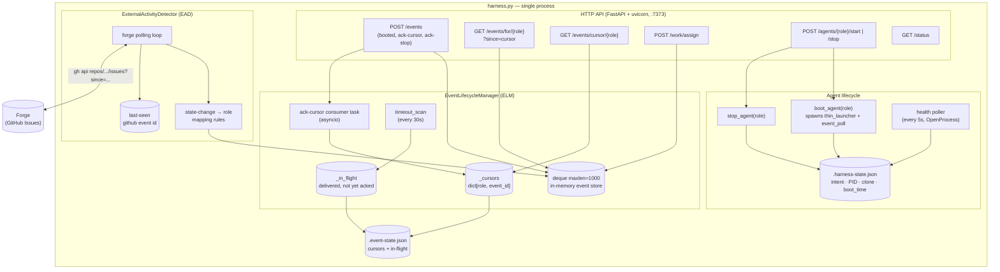

#### Event store (deque)

- `collections.deque(maxlen=1000)` — in-memory, capped at 1000 events.
- Harness restart drops history. At-least-once across restarts requires persistence (separate work, out of scope for v2).
- Eviction: when a new event pushes past 1000, the oldest is dropped. Agents whose cursor was at that evicted event get a `HTTP 410 Gone` response from `GET /events/for/{role}?since=<old_cursor>` with body `{"cursor_evicted": true, "current_head": "<event_id>"}`. Recovery: agent reads forge for current state, emits `ack-cursor(current_head)`, re-enters idle.

#### Cursor model

- Per-role, owned by harness (was per-agent in `working-state.md` pre-`#9873-A`; migrated to harness).
- `null` at first boot → agent reads from the head of the deque.
- Advances via `ack-cursor` consumed by the ack consumer task.
- Cursor-regression attempts rejected (CONTEXT-9873-A D15).
- `GET /events/cursor/{role}` returns `{cursor: <event_id> | null, role}`, HTTP 200 always.

**Event IDs**: `sha256(timestamp + role + event_type + payload + nonce)[:16]` — 16-char hex (64-bit, per #9415). Content hash with per-emit nonce; same event emitted twice produces distinct IDs.

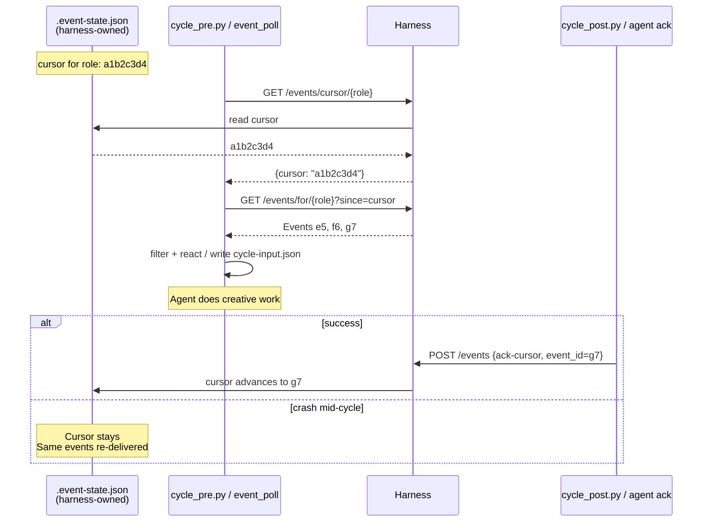

In loop mode the cursor is still harness-owned (`.event-state.json`) post-#9873-A — `working-state.md` no longer stores it. Pre-#9873-A behavior (cursor in `working-state.md`) is retired.

At-least-once delivery: cursor advances only after a successful ack. Crashed agents re-process the same events on restart.

#### Role-based filtering

Events are filtered to what each role cares about. Today's per-role filter (loop mode):

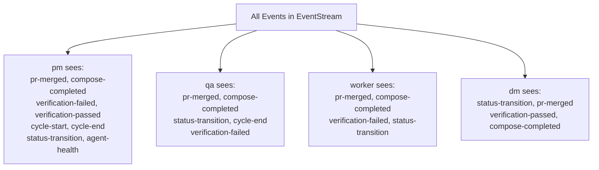

Filtering is client-side in `cycle_pre.py` via `_ROLE_EVENT_TYPES` dict. Roles not in the dict receive all events.

Under v2 this filter collapses dramatically: every role reacts-to `assigned-to` only. Specificity moves to `event_context` and target-role match (§7.4 care filter).

### 4.4 ExternalActivityDetector (EAD)

EAD is the bridge from forge → bus. It runs inside the harness on a polling loop:

1. Polls GitHub via REST API (`gh api repos/<owner>/<repo>/issues?since=<last_seen_iso>&state=all&per_page=100`).
2. Diffs against last-seen timestamp on disk.
3. For each changed issue, maps to a target role per a rule table (status label changes, comments, PR state changes).
4. Emits one `assigned-to` per (forge change, target_role) pair into the deque.
5. Records the new last-seen timestamp so it doesn't re-emit on restart.

EAD is the only emitter of `assigned-to` from forge state. Agents trigger `assigned-to` indirectly via `POST /work/assign` (typically called by `tracker.py`; see §7.3).

**Why REST, not Search API** (locked):
- Search API has a 5–30s indexing lag built in; EAD-driven latency would inherit that floor on every event.
- REST API is real-time (event appears in the response as soon as forge processes the write).
- REST quota is 5000 req/hr; Search is 30 req/min. REST gives more headroom for adaptive polling.

**Polling cadence — adaptive backoff** (locked):

```
default state: active (10s between polls)

  last_poll_found_activity? → stay at 10s
  3 consecutive empty polls at 10s? → step up to 30s
  3 more consecutive empty polls at 30s? → step up to 60s (ceiling)
  activity returns after any backoff? → reset to 10s
  hard floor: 5s   (rate-limit safety; never poll faster)
  hard ceiling: 60s (safety-net usefulness degrades beyond this)
```

Two-tier backoff: 10s → 30s → 60s. A quiet period stabilizes at 60s after ≥6 consecutive empty polls (≈2 minutes of inactivity).

**Latency floors:**

| Path | Worst case | Typical |
|---|---|---|
| `tracker.py` happy path (primary) | sub-second | sub-second |
| EAD safety net, quiet period | 60s | 30s |
| EAD safety net, active period | 10s | 5–10s |

**Forge API budget** (under the cadence rule above; quota = 5000 req/hr):

| State | Polls/hr | Calls/hr (incl. 1–3 follow-ups per change) | % of quota |
|---|---|---|---|
| Steady-state quiet | ~120 | ~120 | 2% |
| Steady-state active | ~360 | ~360–720 | 7–14% |
| Worst-case burst (10 changes/poll, sustained) | ~360 | ~3600 | 72% |

Per-install cadence overrides via `config.md` (`EAD Cadence Active`, `EAD Cadence Quiet`) are NOT v1 scope — defaults are hardcoded. Add as config fields only if a real install hits a quota issue.

**Recovery & restart semantics:**

- **Lost last-seen-id**: on missing/corrupt last-seen file, EAD defaults to `now - 5 minutes`. Bounded dup-emit window; agents dedup via care-filter on `(issue_number, target_role, event_context)` tuple.
- **Harness restart catch-up**: on harness boot, EAD does a 30-minute scan against forge and re-emits `assigned-to` for anything missed during downtime. Beyond 30 min, agents recover from forge on first read (cursor-evicted path above).
- **Orphan in-flight cleanup**: `timeout_scan` (every 30s, per #9873-E) sweeps in-flight entries whose `event_id` is past deque eviction. Passive; no agent involvement.

**Persistence**: `event_lifecycle.load()` / `save_state()` calls are wrapped in `asyncio.to_thread` (CONTEXT-9873-A D4 / H6 mitigation) — disk I/O never blocks the event loop.

### 4.5 Mechanical reactions vs creative decisions

Some state-change patterns are predictable enough to handle deterministically in pre-cycle, without consuming the agent's creative time. **The data source differs by mode** (per §2 mutual-exclusivity):

- **Event mode** — reactions are derived from `recent_events` consumed from the event bus.
- **Loop mode** — reactions are derived from tracker state changes since last cycle (deduplicated by timestamp, not by event cursor). Loop mode does not consume from the bus.

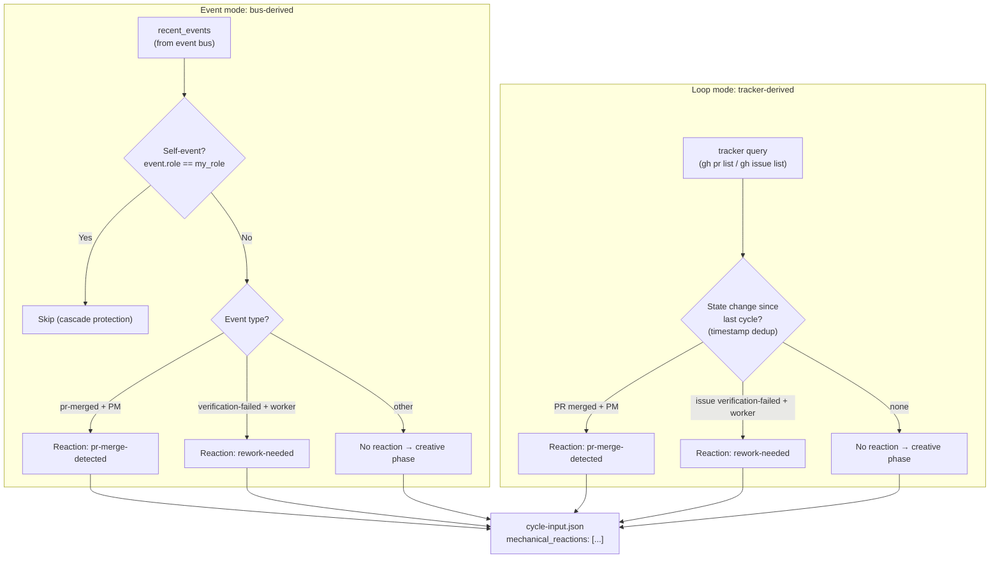

Today only two patterns qualify in either mode:

1. **PR merge detected** (PM) — surfaces merge context.
2. **Rework needed** (worker) — surfaces the verifier's rejection reason.

Everything else lands in `recent_events` (event mode) or is left for the creative phase to detect via tracker reads (loop mode).

### 4.6 Cascade protection

Two mechanisms prevent infinite reaction loops. Mechanism 2 differs by mode (per §2):

1. **Self-event filter** (both modes): `if event.get("role") == role: continue`. An agent's own emissions never trigger its own mechanical reactions. In loop mode the equivalent is a tracker-state filter — an agent doesn't react to its own most-recent transition on an issue.
2. **Dedup mechanism**:
   - **Event mode**: cursor deduplication. Events before the cursor are never re-read.
   - **Loop mode**: timestamp deduplication. Tracker state changes since last cycle's timestamp are considered; older changes are skipped. No cursor.

Chains terminate by construction: A emits/transitions → B reacts → B emits/transitions → A sees next cycle (but won't re-fire because either the cursor has moved or the original state change is now older than last cycle's timestamp).

### 4.7 Port discovery (clone isolation)

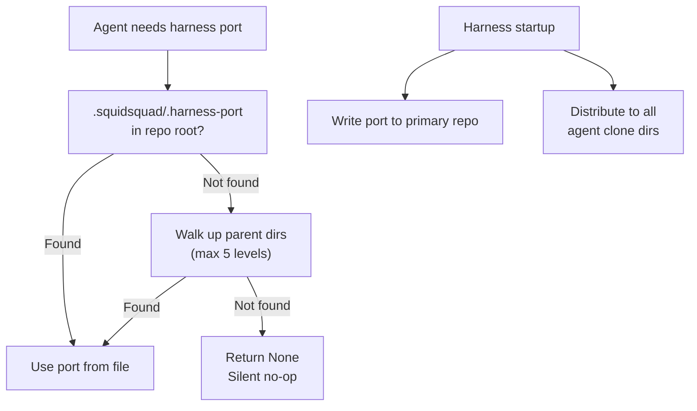

Each agent typically runs in its own git clone. The harness writes its port to `.squidsquad/.harness-port` at startup; agents discover it by checking the file and walking up to 5 parent directories. When the file is missing (harness not running), all event operations silently no-op.

### 4.8 Design properties summary

| Property | Implementation |
|---|---|
| **Non-blocking** | 500ms timeout on all HTTP calls; exceptions silently swallowed |
| **Observational (loop) / load-bearing (event)** | Same wire; different agent dependency on it |
| **No persistence** (deque) | In-memory; harness restart clears history |
| **Self-isolation** | Agents don't react to their own events |
| **At-least-once** | Cursor advances only after successful ack |
| **Role authority** | Bus has no permissions knowledge; `tracker.py` enforces transitions; harness enforces `/work/assign` via L2 bus contract (§7.3) |
| **Graceful degradation** | Harness unreachable = empty events / loop-mode fallback = zero behavior change to git-coordination layer |

---

## 5. State persistence map

| What | Where | Owner | Why |
|---|---|---|---|
| Per-role cursor | `.squidsquad/.event-state.json` | harness | Harness owns delivery state |
| In-flight events | `.squidsquad/.event-state.json` | harness | Re-delivery on timeout (#9873-E) |
| Agent intent + PID | `.squidsquad/.harness-state.json` | harness | Harness owns agent lifecycle |
| Agent singleton PID | `.squidsquad/<role>/.claude-pid` | agent (thin_launcher) | Singleton enforcement (#8692) + harness health-poller's process-liveness check (see §3.3) |
| Agent current-work state | `.squidsquad/<role>/working-state.md` | agent | Resume-from-crash checkpoint for the agent's OWN current work. Does NOT carry an event queue (harness deque + cursor own that) AND does NOT carry a nudge flag (per §7.5 — nudge memory lives only in conversation context) |
| Improvement subloop throttle | `.squidsquad/<role>/.subloop-last-run` | agent | Last-fire timestamp; gates next eligibility (§7.6) |
| Last-seen forge event | EAD-internal persistence | harness | Don't re-emit assigned-to on restart |
| Work state | GitHub Issues (forge) | forge | Source of truth for status, comments, PRs |
| Decisions / institutional memory | `.squidsquad/vault/` | shared | Long-lived rationale — see [`VAULT-ARCH.md`](VAULT-ARCH.md) for architecture (PARAG model, sub-skills, scripts, cycle integration) |

**Invariant**: agents do not write to harness-owned files. Harness does not write to agent-owned files.

---

## 6. Loop mode in detail

### 6.1 The Ralph Loop cycle

A cycle has three phases (vault touchpoints inlined; see §6.5 + VAULT-ARCH §7 for execution-lane detail):

```
Boot (session start, once):
  · read .squidsquad/vault/BRIEFING.md   [vault-protocol, inline]
                       ↓
┌─── Phase 1: Pre-cycle (mechanical) ──────────────┐
│ cycle_pre.py <role>                              │
│ · git pull (with stash/pop)                      │
│ · read working-state.md                          │
│ · query work queue (tracker)                     │
│ · derive mechanical reactions from tracker       │
│   state changes since last cycle (§6.3)          │
│ · build .squidsquad/<role>/cycle-input.json      │
└──────────────────────────────────────────────────┘
                       ↓
┌─── Phase 2: Creative work (agent) ───────────────┐
│ Read cycle-input.json                            │
│ Investigate / decide / act                       │
│   ↳ vault-protocol reads inline as needed        │
│   ↳ vault-protocol writes inline (vault-create / │
│       vault-update + vault-check Level 1)        │
│ End-of-Phase-2 reflection (if not a quiet cycle):│
│   ↳ vault-remember → subagent (`sonnet`)         │
│       returns write decisions → applied inline   │
│ Quiet-cycle additions:                           │
│   ↳ vault-optimize inline (gated: 20+ notes)     │
│   ↳ every 5th quiet (PM): vault-synthesis        │
│       → subagent (`sonnet`) returns ≤1 posture   │
│ Write cycle-output.json                          │
│ (free use of git, bash, subagents for the work)  │
└──────────────────────────────────────────────────┘
                       ↓
┌─── Phase 3: Post-cycle (mechanical) ─────────────┐
│ cycle_post.py <role>                             │
│ · apply status transitions                       │
│ · post tracker comments                          │
│ · write iteration log                            │
│ · git commit + push (incl. vault note writes)    │
│ · update working-state.md (incl. last-cycle      │
│   timestamp for tracker-state dedup)             │
│ · status-bar cleanup                             │
│ · context-pressure check → exit 42 if exceeded   │
└──────────────────────────────────────────────────┘
```

The agent only writes the creative phase. Mechanical phases are deterministic scripts. Vault sub-skills split between inline execution (`vault-protocol`, `vault-optimize`) and background-subagent execution (`vault-remember`, `vault-synthesis`) — see §6.5.

### 6.2 What wakes the agent in loop mode

`thin_launcher` runs `claude` with `/loop 30m execute one Ralph Loop cycle` as the initial command. The `/loop` slash command schedules a recurring cron entry; when it fires, the agent runs one cycle and waits for the next fire.

The 30-minute interval is read from `config.md`'s `Iteration Interval > Minutes` field at compose time and baked into the boot-bootstrap fragment (#9588). Recovery from an interrupted `/loop` re-invokes the same literal command.

### 6.3 Loop-mode mechanical reactions

The pre-cycle script applies the high-confidence reactions from §4.5 before the agent's creative phase runs. Reactions land as `mechanical_reactions` in `cycle-input.json` so the agent can see what was done.

In loop mode, reactions are **derived from tracker state**, not from the event bus (per §2 mutual exclusivity). Dedup is by the last-cycle timestamp persisted in working-state.md; state changes older than that are ignored.

Today's reactions:
- `pr-merge-detected` (PM): `gh pr list` finds PRs that newly transitioned to merged since last cycle's timestamp; for each, look up the linked issue and verify its status.
- `rework-needed` (worker): `gh issue list` finds tasks newly transitioned to `status:in-progress` by the verifier (rework signal) since last cycle's timestamp; for each, prioritize the named issue.

Both are idempotent against already-handled issues (e.g., transitioning a closed issue is a no-op). Loop mode does NOT issue `GET /events/for/<role>` and does NOT maintain an event cursor — those are exclusively event-mode mechanisms (see §7).

### 6.4 Context-pressure exit-42 and respawn

When the cycle's context usage exceeds the configured threshold (default 70%), the agent checkpoints `working-state.md`, commits and pushes, and `cycle_post.py` exits with code 42. What respawns the agent depends on whether the harness is up:

- **With harness running** (#4966): the harness watches the agent's `.claude-pid`, sees the non-zero exit, and re-runs the boot flow (which in loop mode immediately re-schedules `/loop`).
- **Harness-less loop mode**: `thin_launcher` is the parent process and exits when `claude.exe` exits — there is no automatic respawn. The agent stops after exit-42 until an operator restarts it. Context pressure is therefore a soft terminal state in harness-less mode; operators are expected to use a process supervisor (systemd, launchd, NSSM) or to restart agents periodically.

This is loop mode's primary form of session lifecycle — agents don't shut down cleanly between cycles; they respawn (with harness) or stop (without) on context pressure.

### 6.5 Vault touchpoints within Phase 2

Vault sub-skills participate in the creative phase at four touchpoints. They split into two execution lanes by weight — anything that requires meaningful reasoning over vault content runs out of process to keep the consuming agent's context lean:

| Touchpoint | Sub-skill | Lane | When |
|---|---|---|---|
| Continuous reads/writes during work | `vault-protocol` | **inline** | Throughout Phase 2; the agent IS doing the read/write the protocol governs |
| End-of-Phase-2 reflection | `vault-remember` | **background subagent** (`sonnet`) | Step 4b, gated by the non-quiet-cycle check only (always-on; no feature toggle). Returns `{action, path, type, body, reason}` per candidate; consuming agent applies the write list deterministically |
| Quiet-cycle housekeeping | `vault-optimize` | **inline** | Quiet cycle, after improvement-scan check; gated by 20+ note count. Wrapper around `vault_optimize.py run` — no reasoning to offload |
| Every-5-quiet cross-agent synthesis | `vault-synthesis` | **background subagent** (`sonnet`) | PM only; counter resets on real work or completed synthesis. Returns ≤1 posture descriptor; consuming agent writes it via `vault-create` + files the pending-review task |

A fifth touchpoint sits **outside** the per-cycle phases: at boot (session start, once per session), every agent reads `.squidsquad/vault/BRIEFING.md` for active context. That's part of `vault-protocol` and is always inline.

The model pin for subagent-lane sub-skills is the **`sonnet`** tier — see [`VAULT-ARCH.md`](VAULT-ARCH.md) §7 Execution model and `[[decision-vault-subagent-model-sonnet]]` for rationale. The pin is by tier, not by dated version.

**Implementation gap** (today): the subagent lane is the architectural target, not the current behavior. Both `vault-remember` and `vault-synthesis` currently compose into the consuming agent's CLAUDE.md inline; closing the gap requires splitting each sub-skill source into a stub (composed into agent) plus a prompt (loaded by the subagent). Tracked as VAULT-ARCH §11.5 + #10180.

For the full vault architecture (storage model, frontmatter spec, scripts, cycle integration detail beyond what this sub-section captures), see [`VAULT-ARCH.md`](VAULT-ARCH.md) — §7 for sub-skills, §9 for cycle integration, §11 for known gaps.

---

## 7. Event-driven mode in detail

Event mode is the **exclusive home** for event-bus consumption and cursor logic (per §2 mutual exclusivity). Everything in this section — `event_poll` sidecar, nudge contract, per-event cycle wrapping, cursor advancement, cascade protection via cursor dedup — applies only when the install is in event mode. Loop mode does not touch any of this.

### 7.0 The `event_poll` sidecar

A sibling `event_poll.py --wait --role <role> --target stdout` process polls the harness on the agent's behalf and writes a literal `NUDGE\n` line to stdout whenever new events arrive past the agent's cursor. That line is what wakes the Claude session via Monitor.

**Polling cadence** (locked, same adaptive pattern as EAD §4.4 but for the harness HTTP API, not the forge):

```
default state: active (5s between polls)

  last_poll_found_events? → stay at 5s
  3 consecutive empty polls at 5s? → step up to 30s
  3 more consecutive empty polls at 30s? → step up to 60s (ceiling)
  events return after any backoff? → reset to 5s
  hard floor: 2s   (avoid harness churn)
  hard ceiling: 60s
```

Two-tier backoff: 5s → 30s → 60s. A drained queue stabilizes at 60s after ≥6 consecutive empty polls (≈1.75 minutes idle).

Nudge format is literal `NUDGE\n` with no payload — the agent always does `GET /events/for/{role}?since=cursor` to find out what's new. False positives (a `NUDGE` arriving when no relevant events exist) are harmless because the GET returns `[]`.

`event_poll`'s lifecycle is harness-owned: `boot_agent(role)` spawns it alongside `thin_launcher`, the health poller watches its PID, and the harness respawns it on death while `intent=running`.

### 7.1 The nudge contract

Per `#9892`:

```
on each nudge:
    cursor = GET /events/cursor/{role}
    events = GET /events/for/{role}?since=cursor

    last_tended = cursor
    for event in events:
        if event passes my role's care filter:
            run_pre_cycle()    # mechanical: git pull, working-state read, etc.
            do_work(event)     # the agent's creative work
            run_post_cycle()   # mechanical: commit, push, working-state write
        # if skipped, no cycle wrapper fires
        last_tended = event.id

    POST /events  ack-cursor {event_id: last_tended, role}
```

Pre/post-cycle wraps EACH cared event individually. Skipped events do not trigger cycle wrappers. The batched ack at the end signals "I've handled or skipped everything up to last_tended; advance my cursor."

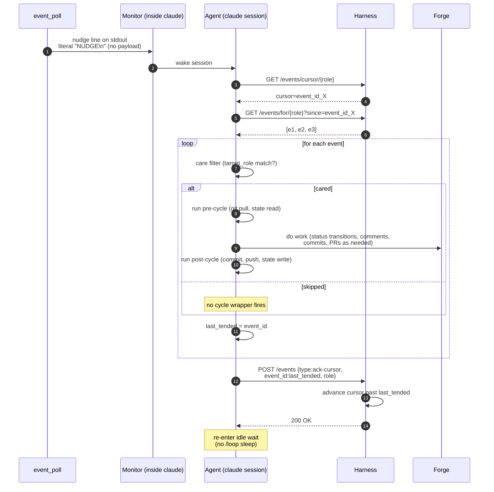

### 7.2 Boot sequence

The harness tracks each agent with two distinct fields in `.harness-state.json`:
- **`intent`** = what the operator wants (`running` | `stopping` | `stopped`)
- **`status`** = what the agent is actually doing (`booting` | `ready` | `stopping` | `stopped` | `crashed`)

These move independently. The operator sets `intent`; the harness updates `status` as it observes lifecycle transitions.

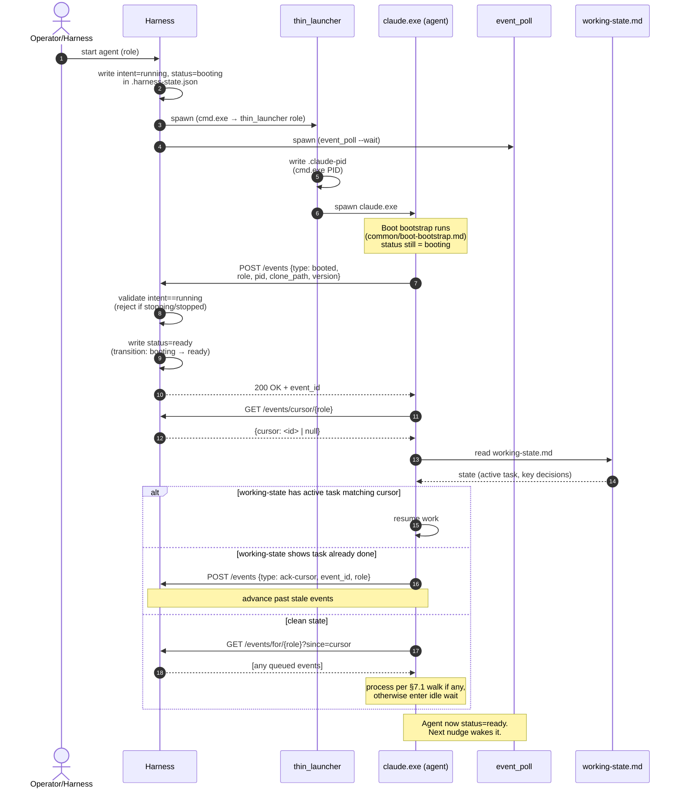

#### Agent state machine

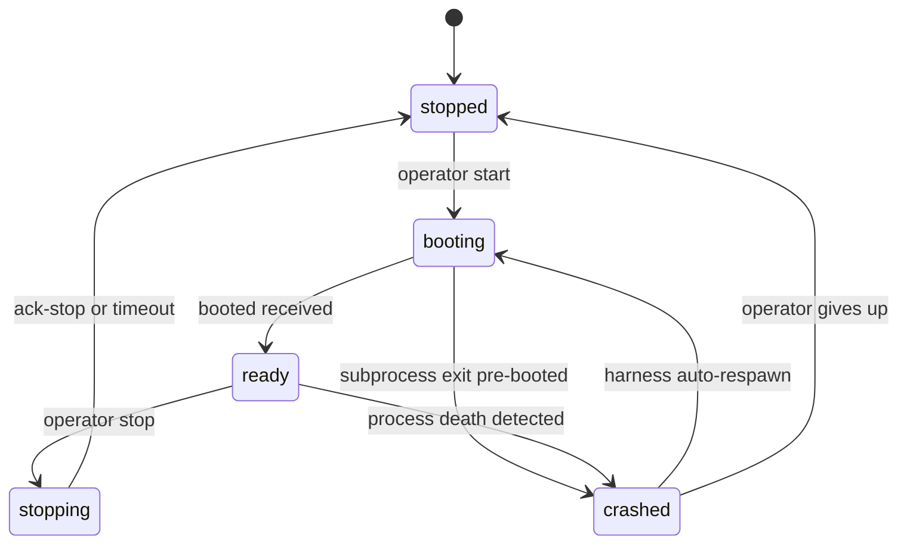

State semantics:
- **`booting`** — `intent=running`, subprocess spawned, `booted` event NOT yet received. Health poller does NOT count agent as alive yet (boot-grace window applies). Any `assigned-to` events for the role queue but are NOT delivered until status flips to `ready`.
- **`ready`** — `intent=running`, `booted` received, agent listening for nudges. Steady-state "alive". Both idle and actively-working agents are `ready`.
- **`stopping`** — `intent=stopping`; harness emits `assigned-to(role, event_context="stop-intent")` so the agent finishes current work and emits `ack-stop`. Timeout: 30s grace → SIGTERM → 10s → SIGKILL.
- **`stopped`** — process is dead AND `intent=stopped`. Terminal until operator restarts.
- **`crashed`** — process death detected by health poller but `intent=running`. Harness auto-respawns; status flips back to `booting`.

Two fields, not one, so recovery semantics are explicit. After a host reboot, the harness reads `.harness-state.json`, sees `intent=running` but no live PID → respawn. If collapsed, the harness couldn't distinguish "operator stopped this" from "this crashed."

### 7.3 Work handoff: explicit `/work/assign`

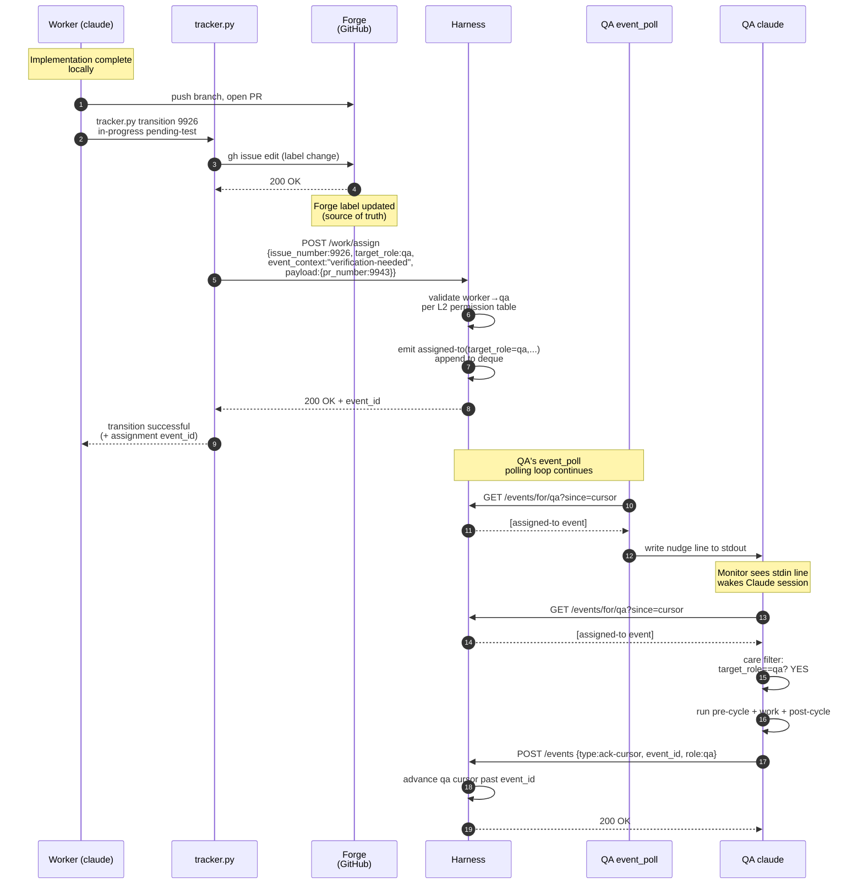

In practice agents never call `/work/assign` directly for transition-driven handoffs — `tracker.py transition` does it automatically.

#### `tracker.py` auto-routing table (locked)

| Transition (from → to) | Implied `target_role` | event_context |
|---|---|---|
| `in-progress → pending-test` | `qa` | `"verification-needed"` |
| `pending-test → pending-ship` | `dm` | `"delivery-needed"` |
| `pending-test → in-progress` | assigned role from `role:*` label; if none, route to `pm` with `event_context="unowned-rejection"` | `"qa-rejected"` |
| `pending-ship → in-progress` | assigned role from `role:*` label; if none, route to `pm` with `event_context="unowned-rejection"` | `"merge-conflict"` |
| `pending → planning` | `pm` | `"planning-needed"` |
| `planning → planned` | (no assign — self-routing) | — |
| `planned → approved` | assigned role from `role:*` label; if none, route to `pm` with `event_context="unowned-approval"` | `"ready-for-pickup"` |
| `approved → in-progress` | (no assign — self-pickup) | — |
| `pending-ship → shipped` | (no assign — terminal) | — |
| `* → pending-human-review` | `pm` | `"human-needed"` |
| `* → pending-human-setup` | `pm` | `"human-needed"` |

Mitigates an entire class of pickup-fidelity bugs (#9946) — agents can't forget to call `/work/assign` because `tracker.py` does it. Replaces the deprecated `status-transition` emit.

#### `/work/assign` permission model

Each role's `responsibility.md` (per #9925) declares a `## Bus contract` section: `accepts assigned-to from: [list]` (or `any`). Harness reads composed `responsibility.md` files at boot, parses bus-contract sections, and builds an in-memory permission table.

- All 4 current roles declare `accepts assigned-to from: any role` — process integrity is everyone's job.
- **Self-assign forbidden by built-in invariant** (not declarable; harness enforces).
- Rejection wire format: `HTTP 403 Forbidden` with body `{"error": "<reason>", "target_accepts_from": [...]}`.
- The permission table is built once at boot. Reloading on recompose ships with the `compose-needed` flow (see §8.5 Group E); until then, operators restart the harness to pick up `responsibility.md` changes.

For non-transition routing (e.g., process concerns surfaced to PM without a state change), agents call `/work/assign` directly:

```bash
python references/scripts/tracker.py work-assign --target pm \
    --event-context process-concern --payload '{"concern": "..."}'
```

#### EAD safety net

If forge state changes through any path OTHER than `tracker.py transition` (human edit in the GitHub UI, third-party automation, or `tracker.py`'s `/work/assign` POST failed), EAD catches it on its next poll:

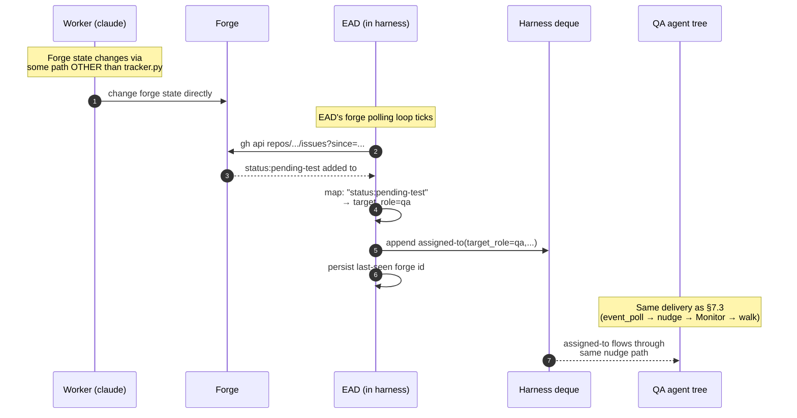

Tracker.py path is sub-second; EAD path is 5–60s polling-cadence-bounded.

### 7.4 Care filter

Each role's care filter is "events with `target_role == my_role`." Future refinement could allow finer-grained filtering on `event_context` or `payload`, but v2 ships with role-only filtering. The L2-derived permission table (`responsibility.md` `## Bus contract`) declares `accepts assigned-to from: [list]` per role.

### 7.5 Nudge handling while busy (context-only, no state mutation)

If a nudge arrives while the agent is mid-cycle:

1. Agent notes the nudge in conversation context — no file write, no queue, no flag.
2. Agent continues processing current event uninterrupted. Emits `ack-cursor` for current event.
3. Post-current, agent enters the §7.1 walk: GETs queue, processes new events in cursor order.

**Why no flag is needed:**

- The harness cursor is canonical. Post-cycle the agent always GETs the queue regardless of whether a nudge was noted.
- `event_poll` is self-healing — even if conversation context is lost (session crash, mid-window compaction), event_poll's next poll within 5–60s (active/idle adaptive) will see events past cursor and re-emit a nudge.
- Monotonic-forward cursor prevents double-processing.

**Crash-safety:**

| Crash point | Recovery |
|---|---|
| Mid-current-event | Restart reads `working-state.md`, resumes. Post-completion walk catches up. |
| Between ack and walk | Restart sees no current work, enters idle. Original mid-cycle nudge is "lost" from context, but `event_poll`'s next poll re-detects past-cursor events and re-nudges. |
| Multiple nudges arrived; agent crashed pre-walk | Any single fresh post-restart nudge triggers the walk that processes all queued events in order. |

Honors the locked principle: forge owns work state, harness owns delivery state (cursor), agent owns ONLY its current work.

### 7.6 Improvement subloop (cursor-at-head)

In loop mode, agents run improvement scans on quiet cycles. In event mode there are no cycles — agents wake only on nudges. If we did nothing else, an agent that handles all its events would never run improvement work.

The improvement subloop fires when the agent's queue is observably drained — `GET /events/for/{role}?since=cursor` returned `[]` on the last walk (no events past cursor). There is no harness endpoint for "am I at deque head?"; the agent infers drained-state from an empty GET response.

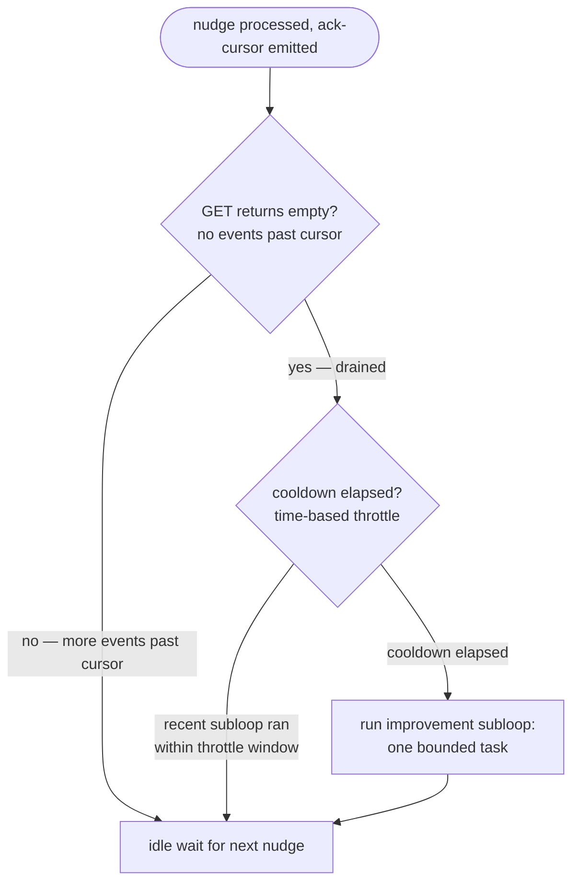

**Throttle** (time-based, NOT token-counting): at most one subloop per agent per N minutes (default 30, matching the old `/loop` cadence — so observable improvement-scan frequency stays the same as loop mode). `.squidsquad/<role>/.subloop-last-run` records the last-fire timestamp; the agent checks this file's age before triggering.

**What the subloop does** (role-specific, one bounded task per fire):
- **pm**: pipeline sentinel + improvement scan (process gaps, stalled items, doc drift)
- **qa**: TEST-PLAN backlog catch-up
- **worker**: doc-scan or test-coverage scan on owned modules
- **dm**: doc realignment + CHANGELOG hygiene + version-bump readiness

Subloop output may emit a new `assigned-to` (e.g., pm-subloop files a bug and routes it). That nudges the owning role into work — via the same `/work/assign` path everything else uses.

---

## 8. Mode selection & migration

### 8.1 Global config

`config.md` has one `event-driven:` field that controls mode for the entire install:

```
event-driven: no    # global — applies to all agents
```

There is no per-role override — mixed modes are not *configurable*, only the global flag controls intent. Note that runtime *degraded fallback* can transiently produce a mixed-mode state (an agent whose harness probe fails at boot falls back to loop mode while peers in the same install whose probes succeed enter event mode; see §8.3). That divergence is per-agent and temporary; it resolves as soon as the failed agent is restarted after the harness recovers. The configured intent is always single-mode.

**How mode selection actually works** (compose-time + runtime, both layers):

- **Compose-time** (#8697): `compose.py` reads `event-driven:` to pick which sub-skill manifest to inline into each composed CLAUDE.md — `includes.yml` for loop mode, `includes-events.yml` for event mode. The non-selected manifest is NOT included; this is a hard compile-time decision.
- **Runtime** (#9588): the *mode-specific procedural fragments* (`roles/<role>/ralph-loop-overview.md` for loop mode; the six `common-events/*.md` fragments for event mode) are NOT inlined at compose time. They're Read at boot by `common/boot-bootstrap` based on the harness probe + config check.

So the composed CLAUDE.md is mode-uniform on disk (no mode-specific fragments inlined), but the agent's running behavior is mode-specific (loaded at boot). This split is what lets §8.2 say "no recompose is strictly needed for a mode flip" — the procedural contract loads at runtime, even though the manifest choice is compose-time.

### 8.2 Flipping the install's mode

A mode flip is install-wide and takes effect on the next restart of each agent. No recompose is strictly needed because boot-bootstrap reads the mode-specific procedural fragments at runtime (#9588). However, when you flip `event-driven:` from `no` → `yes` (or vice versa) you should also recompose so the manifest match is consistent — otherwise the composed CLAUDE.md still references the old-mode sub-skill set, which can produce surprises. Steps:

1. Edit `config.md` `event-driven:` value.
2. Run `compose.py deploy-all` to refresh manifest selection across all composed CLAUDE.md outputs.
3. Restart every agent (`python references/scripts/squidsquad_cli.py restart-all` or equivalent).
4. New sessions boot into the new mode.

### 8.3 Boot decision tree

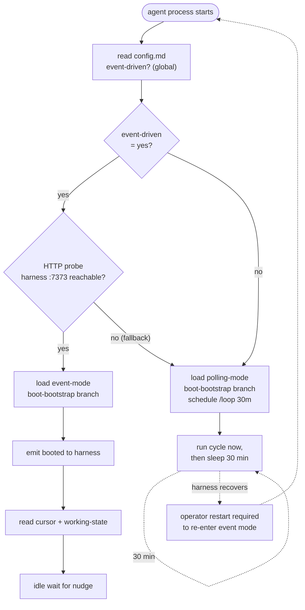

Two gates must both be `yes` for event mode: the install's global `event-driven:` config AND harness reachability. If `event-driven: no`, every agent boots into loop mode regardless of harness state. If `event-driven: yes` but the harness is unreachable at boot, the affected agent falls back to loop mode (per §8.4) while other agents in the same install may still enter event mode if their harness probe succeeds — the config is global but each agent's probe is independent. Only when both align does the agent enter event mode.

Mode is locked at boot — no mid-session switch — to keep the agent's contract predictable. The operator is the only mode-flipping authority.

### 8.4 Polling fallback when the harness is down

When `event-driven: yes` is configured but the harness is unreachable at boot (probe fails per `common/boot-bootstrap` Step 2), the agent falls back to loop mode (`/loop 30m`). When `event-driven: no` is configured, the agent boots into loop mode unconditionally — this is the configured path, not a fallback. Once the harness recovers, the operator restarts the affected agent to re-enter event mode. Mid-session mode-flipping is explicitly not supported ("loaded mode is sticky" — `common/boot-bootstrap`).

### 8.5 Migration from loop → event mode (v2 closure plan)

The migration ships as 6 grouped PRs (originally in `archive/EVENT-ARCHITECTURE.md` §15). The **letters** (A–F) are logical-grouping identifiers — they cluster related work; the **numbers** (1–6) are the dependency-driven implementation order. The two orderings differ on purpose: e.g., Group A is the foundation and ships first, but Group B (cursor wire) is held until after C and D have landed so its wire-format changes don't conflict with EAD restart-safety or permission-table work.

| # | Group | What it does | Risk |
|---|---|---|---|
| 1 | **A — Lifecycle plumbing** | `boot_agent` spawns thin_launcher + event_poll; health poller watches both; cold start order; wizard writes the global `event-driven:` flag | medium |
| 2 | **C — EAD + restart safety** | Last-seen-id recovery, in-flight cleanup, harness restart catch-up | low |
| 3 | **D — L2-derived permissions** | Each role's `responsibility.md` declares `## Bus contract`; harness builds permission table at boot | low |
| 4 | **B — Cursor + delivery wire** | Nudge format = literal `NUDGE\n`; forward-only ack; `HTTP 410 Gone` for cursor-evicted | low |
| 5 | **F — Observability** | TUI polls `/status`, `/agents`, `/events/recent`; lifecycle/git logs stay in iter-NNNN.md | very low |
| 6 | **E — Migration** (3 sub-phases) | E1: stop emitting deprecated types · E2: collapse `Event Reactions` to `assigned-to` only · E3: trim catalog + rewrite event_poll | highest |

After all 6 land: v2 ships under `event-driven: no` default; operators flip per install. Loop mode stays available indefinitely.

**Catalog-trim replacements** (Group E translates retired event types into `assigned-to` with a specific `event_context`):

| Retired type | Replacement | When emitted |
|---|---|---|
| `compose-completed` | `assigned-to(target_role=pm, event_context="compose-needed", payload={touched_files})` | After a merge touches `references/`. PM runs `compose.py deploy-all`, restarts affected agents. |
| `agent-health` (stalled/down) | `assigned-to(target_role=pm, event_context="agent-down", payload={role, last_seen})` | Harness health poller detects a watched agent dies or stalls past threshold. PM's pipeline-sentinel handles. |
| `noop` (#9845) | `assigned-to(target_role=R, event_context="probe", payload={ack_only:true})` | Latency probe / harness liveness check. Agent acks without doing work. `ack_only` is a `payload` extension, not a top-level `assigned-to` field — see §4.2 catalog entry. |

PM's inbox is disambiguated by `event_context`. The full set in use:

- From the `tracker.py` auto-routing table (§7.3): `"planning-needed"`, `"human-needed"` (for `* → pending-human-review|setup` transitions), `"unowned-rejection"` (fallback for rejected items with no `role:*` label), `"unowned-approval"` (fallback for approved items with no `role:*` label).
- From the catalog-trim translators (§8.5): `"compose-needed"` (recompose required), `"agent-down"` (health-poller observed an agent stall).
- From EAD: `"human-comment"` (forge comment by a human author).
- From agents calling `/work/assign` directly: `"process-concern"` for ad-hoc routing of cross-role process issues to PM.

PM agents recognize this set as their care-filter; new values added in future require both an emitter update and an entry in this list.

---

## 9. Open questions

> All §13 questions from `archive/EVENT-ARCHITECTURE.md` were closed in rev 4 (2026-05-23). Listed here so future drift surfaces against a known baseline.

| # | Question | Lock |
|---|---|---|
| Q1 | Booted payload shape | `{role, pid, clone_path, version}` |
| Q2 | `/work/assign` authorization | L2-derived from `responsibility.md` `## Bus contract` |
| Q3 | EAD polling cadence | REST + adaptive 10s active / 30s idle, 5s floor / 60s ceiling |
| Q4 | `event_poll` polling cadence | 5s active / 30s idle, adaptive backoff, 2s floor / 60s ceiling |
| Q5 | Cursor on first boot | `null` per CONTEXT-9873-A D7 |
| Q6 | Care filter granularity | Role-only in v1; `event_context` filter as v2 extension via L2 bus contract |
| Q7 | Queue-while-busy | Context-only; no `working-state.md` flag |
| Q8 | `#9845` (noop) fate | Retired; absorbed into `assigned-to(event_context=probe)` |
| Q9 | `compose.py` changes for v2 | Trim catalog, retire emit calls, add `compose-needed` translator |
| Q10 | Migration plan | Feature flag `event-driven: yes/no` in `config.md` |

> Net-new open questions surfaced during the loop+event merge (this doc): NONE so far. Add below as they surface.

---

## 10. References & terminology

### 10.1 Glossary

- **Cycle wrapper**: the pre/creative/post phase trio that runs around one unit of agent work. Same shape in both modes.
- **Nudge**: a single stdin line written by `event_poll` to wake a Claude session via the Monitor tool.
- **Cursor**: per-role harness-owned pointer to "events tended through here."
- **EAD**: ExternalActivityDetector — the harness's forge poller that translates forge state changes into `assigned-to` events.
- **Care filter**: the per-role decision of whether to act on an event or skip it.
- **Improvement subloop**: time-throttled self-care work the agent runs when its queue is empty (event mode only).

### 10.2 Related docs

- [`ARCHITECTURE.md`](ARCHITECTURE.md) — the 6-layer system stack; process tree, `.claude-pid` semantics, three claude.exe populations.
- [`COMPOSE-ARCHITECTURE.md`](COMPOSE-ARCHITECTURE.md) — the L1-L4 composition model; how `event-driven:` flips compose-time manifest selection.
- [`sub-skill-catalog.md`](sub-skill-catalog.md) — the catalog of sub-skills; `common-events/` runtime-loaded in event mode, polling fragments in loop mode.
- [`sub-skill-guide.md`](sub-skill-guide.md) — how to author and wire sub-skills.

### 10.3 Source material

- `archive/EVENT-ARCHITECTURE.md` (v2 nudge-driven design, rev 5 lock-ready)
- `archive/EVENT-BUS-ARCHITECTURE.md` (v1 PRD)
- `archive/event-bus.md` (v1 narrative)
- Vault: `.squidsquad/vault/galaxy/decision-event-bus-architecture-redesign.md`
- Pre-flip blockers: `#9891` (event_poll nudge-only), `#9892` (agent contract)
- Fallback path: `#9580`, `#9588`

### 10.4 Revision log

- **2026-05-23 (rev 1) — consolidation.** Merged `EVENT-ARCHITECTURE.md` (v2 design), `EVENT-BUS-ARCHITECTURE.md` (v1 PRD), and `event-bus.md` (v1 narrative) into a single runtime architecture doc framed around loop-vs-event triggering. Carried over all key Mermaid diagrams. The three source docs are slated for retirement once this lands.
- **2026-05-23 (rev 2) — first review-loop pass.** Applied 2 Claude-subagent audits (completeness + internal consistency) and one DeepSeek code-review pass. Fixes: 12 DS findings (4 HIGH cross-mode contradictions and wire-format mismatches, 6 MED disambiguations, 2 LOW polish). Notable additions vs rev 1: §8.3 boot decision tree now gates on `event-driven:` config in addition to harness reachability; §6.4 splits respawn paths for harness vs harness-less; §8.1 explicitly separates compose-time manifest selection from runtime fragment loading; §7.0 documents `event_poll` sidecar + `--role` flag + cadence; §4.3 specifies HTTP 410 cursor-evicted body + event-ID hash formula; §7.3 specifies HTTP 403 rejection body + permission table model. Diagrams: EAD now shows REST endpoint (was `gh api / search`); nudge format normalized to literal `NUDGE\n`; subloop throttle relabeled "time-based" (not "token-burn"). Field names normalized to `issue_number` + `target_role` across both catalog and wire diagrams. DS artifact: `.squidsquad/pm/planning/REVIEW-AGENT-RUNTIME-DEEPSEEK.md`.
- **2026-05-23 (rev 3) — review-loop pass 2.** Second DeepSeek pass surfaced 6 new findings (3 MED, 3 LOW) — mostly fallout from incomplete updates in rev 2. Applied: glossary "token-throttled" → "time-throttled" (was inconsistent with §7.6); cursor-model sequence diagram replaced `working-state.md` participant with `.event-state.json` to match the migrated architecture; routing table now has fallbacks for `pending-ship → in-progress` (unowned-rejection) and `planned → approved` (unowned-approval); event_poll cadence specifies `3 consecutive empty polls` (matching EAD); `assigned-to` catalog payload reconciled with wire diagrams (`title` moved under `payload`); subloop trigger reframed as "GET returns empty" (the observable check) instead of "cursor at deque head" (not directly observable). DS artifact: `.squidsquad/pm/planning/REVIEW-AGENT-RUNTIME-DEEPSEEK-2.md`.
- **2026-05-23 (rev 4) — review-loop pass 3.** Third DeepSeek pass surfaced 2 new findings (1 MED, 1 LOW). MED fix: EAD and event_poll cadence blocks now describe a two-tier backoff (10s → 30s → 60s and 5s → 30s → 60s) — the prior single-step backoff couldn't actually reach the documented 60s ceiling. LOW fix: `ack_only=true` for the probe `event_context` is now correctly notated as a `payload` extension, not a top-level `assigned-to` field. DS artifact: `.squidsquad/pm/planning/REVIEW-AGENT-RUNTIME-DEEPSEEK-3.md`.
- **2026-05-23 (rev 5) — review-loop pass 4.** Fourth DeepSeek pass returned 1 LOW finding only and explicitly assessed the doc as "converged well; no HIGH or MED issues remain." Applied: §8.5 PM-inbox `event_context` disambiguation rewritten from an incomplete-and-partially-fictional list (`route-handoff` wasn't defined anywhere) to an exhaustive enumeration sourced from the routing table, catalog-trim translators, EAD, and direct `/work/assign` callers. DS artifact: `.squidsquad/pm/planning/REVIEW-AGENT-RUNTIME-DEEPSEEK-4.md`.
- **2026-05-23 (rev 6) — terminology unification + global-only mode flag.** Two related cleanups.
  - **Terminology**: removed all current-repo concrete-instance references (no `skill`, no `dev`, no "concrete-install snapshot" framing). The doc now uses only the four L2 categorical role names: `pm`, `qa`, `worker`, `dm`. Terminology table simplified to 4 rows with no concrete-instance column; role-filtering diagram drops the per-install qualifier and uses categorical names directly; previous `verifier` → `qa` everywhere (sequence diagrams, routing table, wire-format payloads, `event_context` `"verifier-rejected"` → `"qa-rejected"`); stack-specific specialization is noted as `worker`/`qa` variants rather than as alternative role names.
  - **Mode flag**: dropped per-role event-driven config (`event-driven-pm: yes` etc.). `event-driven:` is now a single global flag for the install — the whole squad runs in loop mode together or event-driven mode together. §8.1 rewritten; §8.2 mode-flip steps now install-wide; §8.3 boot decision tree simplified to one ConfigGate before the harness probe. Rationale: keeps the harness contract uniform (load-bearing for everyone, or observational for everyone), avoids the cross-role coordination puzzle of mixed modes.
- **2026-05-23 (rev 7) — post-rev-6 DS verification + §7.6 diagram fix.** DS round-7 verification found 2 actionable findings (1 MED, 1 LOW); both applied: §8.1 clarified that mixed modes are not *configurable* but degraded fallback can produce a transient mixed-mode state per-agent (the previous wording falsely implied install-wide uniformity even under fallback); §8.4 reworded to distinguish the configured `event-driven: no` path (loop mode by design) from the `event-driven: yes` + probe-fail fallback path (the prior "regardless of config" wording collapsed the two). Also: §7.6 subloop diagram nodes now use quoted-label form ({"…"}, ["…"]) so unquoted parentheses can't break Mermaid rendering. The "sub-skill" terminology is retained as the canonical compose-fragment term and is distinct from the "skill" agent-role term that was removed in rev 6 (DS flagged as info, accepted as intentional). DS artifact: `.squidsquad/pm/planning/REVIEW-AGENT-RUNTIME-DEEPSEEK-7.md`.
- **2026-05-23 (rev 8) — final convergence + cadence-math fixes.** DS round-8 confirmed all R7 fixes correct and returned 2 LOW math errors: EAD cadence "≈3 minutes" → "≈2 minutes" (correct: 6 polls × 10/20/30/60/90/120s = 120s = 2 min); event_poll cadence "≈2.5 minutes idle" → "≈1.75 minutes idle" (correct: 6 polls × 5/10/15/45/75/105s = 105s ≈ 1.75 min). Both fixed. The doc is now mathematically and architecturally converged. DS artifact: `.squidsquad/pm/planning/REVIEW-AGENT-RUNTIME-DEEPSEEK-8.md`.
