# Agent Runtime Architecture (draft)

_How a SquidSquad agent's operating model is defined — what triggers it to act, and what one act looks like._

> **Status**: DRAFT, consolidating prior docs now under `docs/archive/`: `EVENT-ARCHITECTURE.md` (v2 nudge-driven design), `EVENT-BUS-ARCHITECTURE.md` (v1 PRD), and `event-bus.md` (v1 narrative). Those three are kept for traceability; this doc is the canonical reference going forward.
>
> **Companion docs**: [`COMPOSE-ARCHITECTURE.md`](COMPOSE-ARCHITECTURE.md) — **the agent compiler**; owns the format of the composed `CLAUDE.md` that every agent runs on (L1-L4 layering, slot order, frontmatter). The most load-bearing piece of the system: every runtime concern in this doc depends on what compose produced at build time. [`HARNESS-ARCH.md`](HARNESS-ARCH.md) — harness internals (process model, HTTP API, state files, restart safety). [`VAULT-ARCH.md`](VAULT-ARCH.md) — vault layer. [`ARCHITECTURE.md`](ARCHITECTURE.md) — system overview.

---

## Terminology — role classes vs aliases

SquidSquad has a small fixed set of **role classes** and a per-install set of **agent aliases**. Routing targets aliases, not classes.

**Role classes** (4 categorical, post-#6274 rename — `dev` → `worker`, `qa` → `verifier`):

| Class | What this class of agent does (one line) |
|---|---|
| **`pm`** | Coordinates the team and the human; manages workflow and process |
| **`verifier`** | Verifies the product being delivered; does not do technical implementation |
| **`worker`** | Implements technical work to acceptance criteria |
| **`dm`** | Delivers (CHANGELOG, version bumps, releases) |

**Agent aliases** (1..N per class, install-defined in `.squidsquad/config.md` `## Aliases`):

- Every running agent has a unique alias. The alias IS the agent's name in all routing.
- A single-instance install can use the class name as its alias (default: a `worker`-class agent is named `worker`).
- A multi-instance install MUST give each agent of the same class a distinct alias. Example: an install with 2 frontend + 2 backend worker-class agents might use aliases `frontend-1`, `frontend-2`, `backend-1`, `backend-2` — four worker-class agents, four distinct aliases.
- **Instances of the same class + L3 domain are interchangeable.** All instances of the same `(L2 class, L3 domain)` pair (e.g., two FE-worker agents, or two PM agents) compose from byte-identical L1–L4 and share **one L4 file per `(class, domain)` pair** (per `COMPOSE-ARCHITECTURE.md` §3.3 / §7.3). Aliases differ only as routing addresses; the *behaviour* behind each alias within a `(class, domain)` is the same. Sender-side routing logic that needs to pick between interchangeable aliases (e.g., for load balancing) can compare queue depth or any other observable signal. Note: different L3 domains of the *same* L2 class are NOT interchangeable — an FE-worker and a BE-worker have separate L4 files (`fe-worker.md` and `be-worker.md`) and different specialty rules. The simple `worker.md` case applies only to installs without L3 domain specialization.
- Specialty/skill (FE vs BE vs iOS, etc.) lives in **L3 (the domain layer)** and is shared across all agents of the same domain. Two FE-worker agents share L1 + L2 (worker class) + L3 (FE domain); two BE-worker agents share L1 + L2 + L3 (BE domain). The same layering applies to verifier-class agents — FE verifiers share an FE L3 with other FE verifiers, BE verifiers with other BE verifiers. Per-agent identity (personality, situational tone) lives in `SOUL.md`; install/operator-specific overrides live in L4.
- Each agent knows the other aliases on the team and their declared specialties (visible from each agent's composed CLAUDE.md and from the install's `.squidsquad/config.md` `## Aliases` registry); mis-routed work is re-assigned via `/work/assign` to the correct alias (see §7.3 mis-route recovery).

**Routing rule**: `/work/assign` always names a **target alias**. The harness validates the alias is registered (returns 404 if unknown) but does NOT enforce class-from-class permissions — process discipline lives in each agent's L2/L3/L4, not in a harness gate (see §7.3).

The architecture below uses class names when describing a class of behavior, and alias placeholders when describing instance-level routing.

---

## 1. Goal & scope

This doc covers **how an agent decides when to act, and what one act looks like**:

- Which triggering modes are available (loop vs event-driven), how the agent runs under each, and how an install picks
- The shared infrastructure both modes depend on (process tree, event bus, state files)
- The migration path between them

Out of scope:

- *What* an agent does step-by-step (see [`sub-skill-catalog.md`](sub-skill-catalog.md))
- *How* instructions compose into a CLAUDE.md (see [`COMPOSE-ARCHITECTURE.md`](COMPOSE-ARCHITECTURE.md))
- *What* an agent is in the broader system stack (see [`ARCHITECTURE.md`](ARCHITECTURE.md))

---

## 2. Two triggering modes

Every agent in an install runs in the same mode — there is one global mode for the project, selected at install via `.squidsquad/config.md`'s `event-driven:` field:

| Mode | What wakes the agent | Event-bus relationship | When to use |
|---|---|---|---|
| **Loop (polling)** | Cron timer (`/loop 30m execute one Ralph Loop cycle`) | **Emit-only** — agents may publish transient events for observability, but do NOT consume from the bus and do NOT maintain a cursor. Work queue + mechanical reactions both derive from tracker state. | Battle-tested fallback; works without the harness; current default |
| **Event-driven (nudge)** | A nudge from the harness, delivered via the Claude Monitor tool's stdin | **Emit + consume** — agents subscribe with a cursor; nudges + per-event reactions both originate from the bus. | Target steady-state; lower latency; no idle token burn |

The cycle wrapper (pre → creative → post) is the same in both modes — only *what initiates the wrapper* and *where reactions derive from* differs. In loop mode the wrapper fires once per `/loop` timer tick. In event mode it fires once **per cared event** during a nudge-walk; a single nudge can produce multiple cycle wrappers (one per cared event) or zero (if every event in the batch is filtered out by the care filter). See §7.1 for the per-event sequence.

**Mutual exclusivity** is intentional: loop mode and event mode are exclusive on both the wake-mechanism axis (cron vs nudge) AND the event-bus axis (emit-only vs emit+consume). A loop-mode agent that consumed events would re-introduce the harness dependency loop mode exists to avoid; an event-mode agent that polled the tracker as its work queue would re-introduce the latency floor event mode exists to fix.

### 2.1 Why both exist

Loop mode has three persistent problems v2's event-driven mode fixes:

1. **Latency floor** — an agent can be idle up to 30 min after work arrives. Worst case end-to-end ship: verifier completes at min 0, dm doesn't notice until min 30, ships at min 32. Polling gaps dominate shipping latency.
2. **Tokens burned on idle cycles** — every cycle costs context window even when nothing is happening.
3. **Cycle/work coupling** — the cycle wrapper fires on the timer, not on the work. State churn happens regardless.

Event-driven mode replaces the cron with on-demand wakeups. Claude's Monitor tool sees a stdin line and wakes the session immediately. Agents stay asleep when there's nothing to do; cycles fire because work arrived.

The trade-off: the harness becomes load-bearing infrastructure. If it's down, event-mode agents sit idle until it recovers; loop mode is the **manual** recovery target (operator/doctor-agent flips `event-driven: no` and recomposes — see §8.4). There is no automatic runtime fall-back (#9580 / #9588 history).

### 2.2 Before vs after at a glance

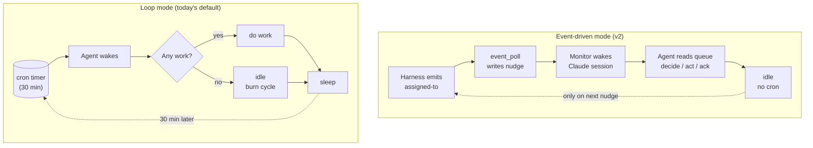

---

## 3. The agent process tree (shared)

Both modes use the same per-agent subprocess shape. Differences are inside the Claude session, not in the tree.

### 3.1 System overview

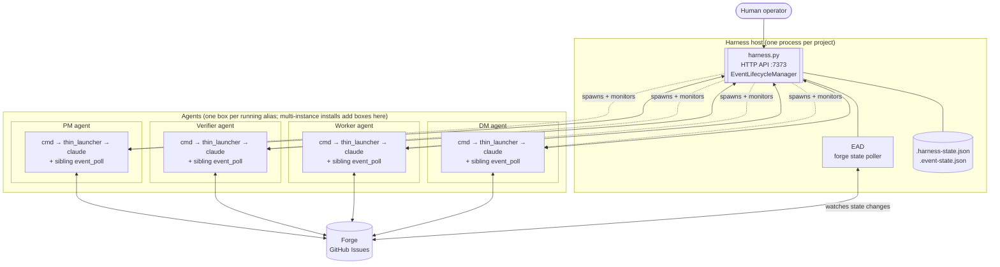

### 3.2 Per-agent subprocess tree (zoomed)

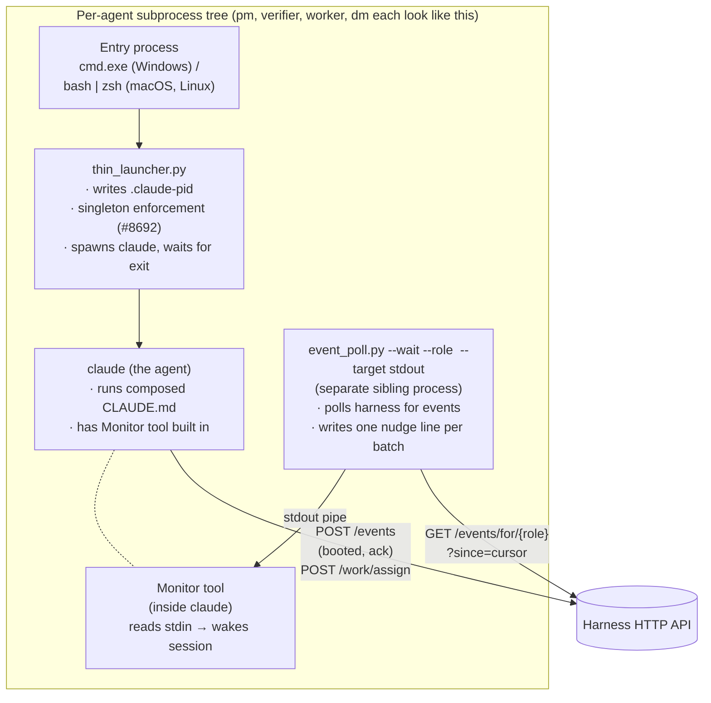

**OS variants** (tree shape is identical across platforms; only the entry-process differs):

| Platform | Entry process | Claude binary | Terminal window |
|---|---|---|---|
| Windows | `cmd.exe` | `claude.exe` | new `cmd.exe` window (visible) |
| macOS | login shell (`bash` / `zsh`) | `claude` | new Terminal.app / iTerm tab via AppleScript (see `boot_remote.py`) |
| Linux | login shell (`bash` / `zsh`) | `claude` | new terminal-emulator window (gnome-terminal / xterm / wezterm, per install) |

`thin_launcher` (Python) and `event_poll.py` (Python) are cross-platform — they run identically on all three OSes. Singleton enforcement via `.claude-pid` and the Monitor stdin contract behave the same regardless of host OS.

**The composed `CLAUDE.md`** that `claude` reads at boot is the agent's full instruction artifact — produced by `compose.py` from L1 (base) + L2 (role class) + L3 (domain) + L4 (install overrides) + per-agent `SOUL.md`, selected per the agent's alias from `.squidsquad/config.md`. AGENT-RUNTIME is intentionally silent on the format itself — see [`COMPOSE-ARCHITECTURE.md`](COMPOSE-ARCHITECTURE.md) for the layering model, slot order, frontmatter spec, and how the L1-L4 + SOUL.md inputs become one composed file. **Compose is the agent compiler**; every runtime behavior described in this doc is downstream of what compose produced.

`thin_launcher` and `event_poll` are intentionally separate processes (decided 2026-05-22):

- Monitor needs a long-lived stdin source — `event_poll`'s exact job.
- `thin_launcher` exits when Claude exits — wrong shape for Monitor's contract.
- Failure isolation: an `event_poll` crash doesn't take Claude down.
- Restart semantics: harness can restart `thin_launcher` to respawn Claude without losing polling state.

Conceptually they form "the agent's launcher subprocess tree." Implementation-wise they're two processes.

### 3.3 The `.claude-pid` convention

`thin_launcher` writes its own `cmd.exe` PID (not `claude.exe`'s PID) into `.squidsquad/<alias>/.claude-pid` at boot. This is the singleton handle the harness watches. See [`ARCHITECTURE.md`](ARCHITECTURE.md) for the "three claude.exe populations" and orphan-reaping rules.

In loop mode, `event_poll` is not spawned — only `cmd → thin_launcher → claude` runs.

---

## 4. The event bus (shared infrastructure)

The event bus is the harness HTTP API at port `7373` (default). Both modes use it:

- **In loop mode**: optional observability layer. Agents emit events for diagnostics; pre-cycle reads recent events and applies mechanical reactions (e.g., PR merge → status transition). When the harness is down, agents fall back silently to git-only coordination.
- **In event-driven mode**: load-bearing. The bus is how the harness wakes the agent in the first place. When the harness is down, event-mode agents sit idle until it recovers (see §8.4); falling back to loop mode is a manual operator action (recompose + restart), not an automatic runtime path.

### 4.1 Architectural commitments (locked principles)

From `decision-event-bus-architecture-redesign` vault note (locked cycles 1541–1542):

1. **Harness is a transport bus, not an orchestrator.** It moves signals between producers and consumers. It does NOT track work completion, ticket state, or workflow status.
2. **Forge (GitHub Issues) is the source of truth for work state.** Status labels, comments, PR merges = the project's institutional state. Harness has no opinion on whether work is done.
3. **Agent owns work completion.** The agent acts on signals; what it does with them is between the agent and the forge.
4. **Ack = receipt confirmation, NOT completion confirmation.** "Ack" means "the signal was delivered to the agent's session." It does NOT mean "the agent finished processing."
5. **No `POST /events/{id}/complete` endpoint.** Reject any design that adds endpoints for completion state. The bus uses events, not RPC, for state transitions.

### 4.2 Signal catalog

In v2 the catalog collapses to **3 signal concepts / 4 catalog entries**:

| Signal | Direction | When | Payload |
|---|---|---|---|
| **`booted`** | agent → harness | First action after the agent's Claude session boots | `{role, pid, clone_path, version}` |
| **`assigned-to`** | harness → agent (queue entry) | Harness detects work exists for the named agent | `{issue_number, target_alias, event_context, payload}` (EAD populates `payload.title` from the forge issue; `/work/assign` callers may pass it through the `payload` object) |
| **`ack-cursor`** | agent → harness | Agent has received a delivered signal; advances harness cursor | `{event_id, role}` |
| **`ack-stop`** | agent → harness | Agent has accepted a stop intent and is checkpointing | `{event_id, result}` |

`ack-cursor` and `ack-stop` are sub-types of one concept (receipt confirmation) — shipped in `#9873-A`. Three signal concepts, four catalog entries.

#### Signal-flow at a glance

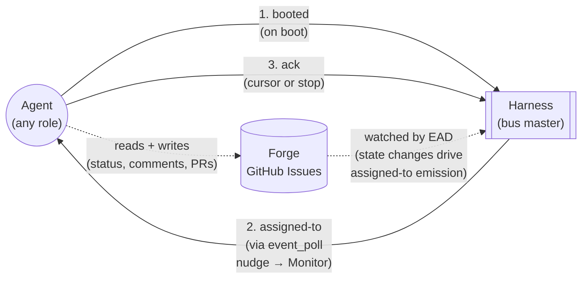

#### What is OUT of the v2 catalog

Removed under v2 (collectively 20 catalog entries):

- **Lifecycle ticks**: `cycle-start`, `cycle-end` — local to the agent, no other agent cares.
- **Git activity**: `git-pull`, `git-push`, `git-commit`, `branch-checkout` — local side effects, recorded in git itself.
- **PR activity**: `pr-create`, `pr-merge`, `pr-merged` — recorded in forge; if relevant to another role, harness translates to `assigned-to`.
- **Tracker activity**: `status-transition`, `tracker-comment` — recorded in forge as source of truth; if relevant to another role, harness translates to `assigned-to`.
- **Harness internal**: `compose-completed`, `agent-health` — harness sees these in its own state; if action needed, harness emits `assigned-to`.
- **Speculative RECOGNIZED entries**: `verification-passed`, `verification-failed`, `phase-change`, `request-merge`, `stop-requested`, `shipped`, `version-bump` — never emitted under v1, dead weight.

> **Loop-mode reality check**: today's loop-mode codebase still emits and reacts to most of the above. The catalog trim is part of the v2 migration (see §8); under loop mode they remain available as observability events.

### 4.3 Harness internals

> **Note**: full harness architecture (process model, HTTP API surface, state files, restart safety, failure modes) is now in [`HARNESS-ARCH.md`](HARNESS-ARCH.md). This subsection covers what an agent author needs to know about the harness's bus + lifecycle interfaces. For internals, follow the cross-references inline.

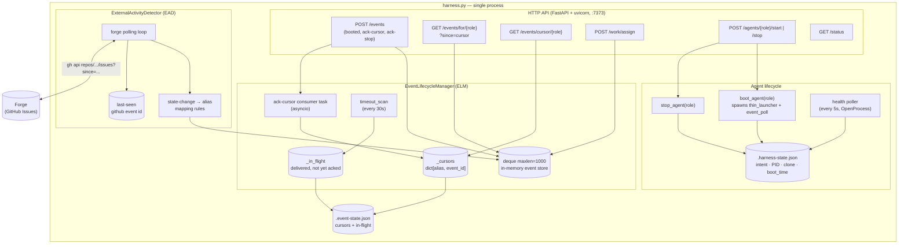

#### Vocabulary note — `{role}` in HTTP paths is actually `{alias}`

The endpoints throughout this section use `{role}` in path parameters (e.g., `GET /events/for/{role}`, `GET /events/cursor/{role}`, `GET /agents/{role}`). **The value passed is always the agent's alias** (e.g., `skill`, `verifier`, `human`, `frontend-1`), not the L2 categorical class (`pm`/`verifier`/`worker`/`dm`). The path-parameter name `{role}` predates the alias concept and is misleading; see [HARNESS-ARCH.md §9](HARNESS-ARCH.md#9-vocabulary-notes) for the canonical statement. A rename to `{alias}` is in the same family as #10358 (`role` → `alias` identifier rename) but is out of scope on that task to limit blast radius. Implementers should treat `{role}` as a synonym for `{alias}` until the rename lands.

#### Event store (deque)

- `collections.deque(maxlen=1000)` — in-memory, capped at 1000 events.
- Harness restart drops history. At-least-once across restarts requires persistence (separate work, out of scope for v2).
- Eviction: when a new event pushes past 1000, the oldest is dropped. Agents whose cursor was at that evicted event get a `HTTP 410 Gone` response from `GET /events/for/{role}?since=<old_cursor>` with body `{"cursor_evicted": true, "current_head": "<event_id>"}`. Recovery: agent reads forge for current state, emits `ack-cursor(current_head)`, re-enters idle.

#### Cursor model

- Per-alias, owned by harness. Persisted in `.squidsquad/.event-state.json`. Agents observe the cursor only through the harness API; they never write it directly.
- `null` at first boot → agent reads from the head of the deque.
- Advances via `ack-cursor` consumed by the ack consumer task.
- Cursor-regression attempts rejected (CONTEXT-9873-A D15).
- `GET /events/cursor/{role}` returns `{cursor: <event_id> | null, role}`, HTTP 200 always.

**Event IDs**: `sha256(timestamp + alias + event_type + payload + nonce)[:16]` — 16-char hex (64-bit, per #9415). Content hash with per-emit nonce; same event emitted twice produces distinct IDs.

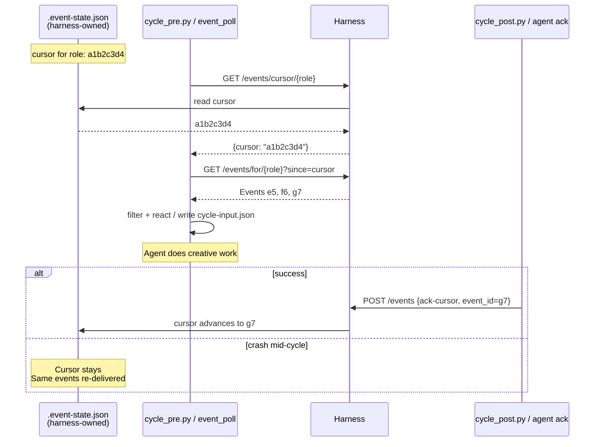

The cursor is harness-owned, persisted in `.squidsquad/.event-state.json`. The agent never writes the cursor directly — it acknowledges progress via the harness API and the harness updates the file. `working-state.md` carries the agent's current-work checkpoint only (see §5); it does not store event-delivery state.

At-least-once delivery: cursor advances only after a successful ack. Crashed agents re-process the same events on restart.

#### Role-based filtering

Under v2 the filter collapses to a single rule: **every role reacts only to `assigned-to`**. Specificity moves to `event_context` and the alias-match care filter (§7.4). There is no per-role event-type allowlist in the v2 catalog because the v2 catalog itself collapses to 3 signal concepts (§4.2) — multi-type filtering is moot once the catalog has one routing signal.

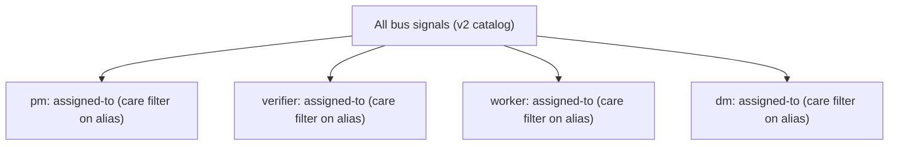

> **v1 loop-mode legacy**. Today's loop-mode codebase still has a per-role event-type allowlist (client-side filter in `cycle_pre.py` via `_ROLE_EVENT_TYPES` dict; roles not in the dict receive all events). That filter exists because loop mode still emits the broader v1 catalog (lifecycle ticks, git/PR/tracker activity, etc. — see §4.2 "What is OUT of the v2 catalog"). The filter is retired as the v2 catalog migration completes (see §8); the diagram above is the v2 target.

### 4.4 ExternalActivityDetector (EAD)

EAD is the bridge from forge → bus. It runs inside the harness on a polling loop:

1. Polls GitHub via REST API (`gh api repos/<owner>/<repo>/issues?since=<last_seen_iso>&state=all&per_page=100`).
2. Diffs against last-seen timestamp on disk.
3. For each changed issue, maps to a target role per a rule table (status label changes, comments, PR state changes).
4. Emits one `assigned-to` per (forge change, target_alias) pair into the deque.
5. Records the new last-seen timestamp so it doesn't re-emit on restart.

EAD is the only emitter of `assigned-to` from forge state. Agents trigger `assigned-to` indirectly via `POST /work/assign` (typically called by `tracker.py`; see §7.3).

**Why REST, not Search API** (locked):
- Search API has a 5–30s indexing lag built in; EAD-driven latency would inherit that floor on every event.
- REST API is real-time (event appears in the response as soon as forge processes the write).
- REST quota is 5000 req/hr; Search is 30 req/min. REST gives more headroom for adaptive polling.

**Polling cadence — adaptive backoff** (locked):

```
default state: active (10s between polls)

  last_poll_found_activity? → stay at 10s
  3 consecutive empty polls at 10s? → step up to 30s
  3 more consecutive empty polls at 30s? → step up to 60s (ceiling)
  activity returns after any backoff? → reset to 10s
  hard floor: 5s   (rate-limit safety; never poll faster)
  hard ceiling: 60s (safety-net usefulness degrades beyond this)
```

Two-tier backoff: 10s → 30s → 60s. A quiet period stabilizes at 60s after ≥6 consecutive empty polls (≈2 minutes of inactivity).

**Latency floors:**

| Path | Worst case | Typical |
|---|---|---|
| `tracker.py` happy path (primary) | sub-second | sub-second |
| EAD safety net, quiet period | 60s | 30s |
| EAD safety net, active period | 10s | 5–10s |

**Forge API budget** (under the cadence rule above; quota = 5000 req/hr):

| State | Polls/hr | Calls/hr (incl. 1–3 follow-ups per change) | % of quota |
|---|---|---|---|
| Steady-state quiet | ~120 | ~120 | 2% |
| Steady-state active | ~360 | ~360–720 | 7–14% |
| Worst-case burst (10 changes/poll, sustained) | ~360 | ~3600 | 72% |

Per-install cadence overrides via `.squidsquad/config.md` (`EAD Cadence Active`, `EAD Cadence Quiet`) are NOT v1 scope — defaults are hardcoded. Add as config fields only if a real install hits a quota issue.

**Recovery & restart semantics:**

- **Lost last-seen-id**: on missing/corrupt last-seen file, EAD defaults to `now - 5 minutes`. Bounded dup-emit window; agents dedup via care-filter on `(issue_number, target_alias, event_context)` tuple.
- **Harness restart catch-up**: on harness boot, EAD does a 30-minute scan against forge and re-emits `assigned-to` for anything missed during downtime. Beyond 30 min, agents recover from forge on first read (cursor-evicted path above).
- **Orphan in-flight cleanup**: `timeout_scan` (every 30s, per #9873-E) sweeps in-flight entries whose `event_id` is past deque eviction. Passive; no agent involvement.

**Persistence**: `event_lifecycle.load()` / `save_state()` calls are wrapped in `asyncio.to_thread` (CONTEXT-9873-A D4 / H6 mitigation) — disk I/O never blocks the event loop.

### 4.5 Mechanical reactions vs creative decisions

Some state-change patterns are predictable enough to handle deterministically in pre-cycle, without consuming the agent's creative time. **The data source differs by mode** (per §2 mutual-exclusivity):

- **Event mode** — reactions are derived from `recent_events` consumed from the event bus.
- **Loop mode** — reactions are derived from tracker state changes since last cycle (deduplicated by timestamp, not by event cursor). Loop mode does not consume from the bus.

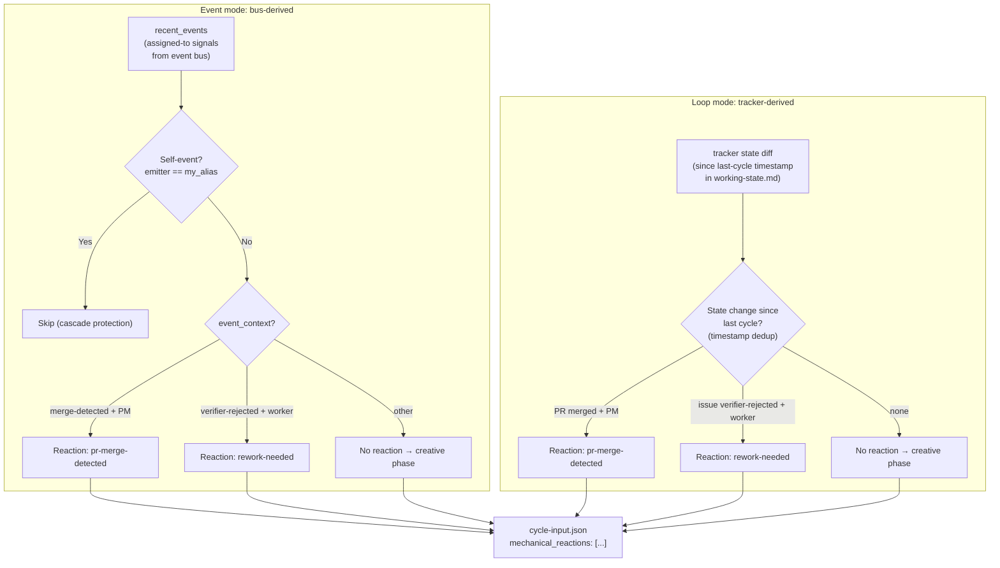

> **v2 catalog alignment**. Event mode branches on `event_context` within `assigned-to` (per §4.2's collapsed catalog) — never on event type, because v1 types like `pr-merged` and `verification-failed` no longer exist as top-level signals. Loop mode still polls forge state directly (no bus consumption per §2 mutual-exclusivity); its branches are state-transition shapes, not v1 event types.

Today only two patterns qualify in either mode:

1. **PR merge detected** (PM) — surfaces merge context.
2. **Rework needed** (worker) — surfaces the verifier's rejection reason.

Everything else lands in `recent_events` (event mode) or is left for the creative phase to detect via tracker reads (loop mode).

### 4.6 Cascade protection

Two mechanisms prevent infinite reaction loops. Mechanism 2 differs by mode (per §2):

1. **Self-event filter** (both modes): `if event.get("role") == role: continue`. An agent's own emissions never trigger its own mechanical reactions. In loop mode the equivalent is a tracker-state filter — an agent doesn't react to its own most-recent transition on an issue.
2. **Dedup mechanism**:
   - **Event mode**: cursor deduplication. Events before the cursor are never re-read.
   - **Loop mode**: timestamp deduplication. Tracker state changes since last cycle's timestamp are considered; older changes are skipped. No cursor.

Chains terminate by construction: A emits/transitions → B reacts → B emits/transitions → A sees next cycle (but won't re-fire because either the cursor has moved or the original state change is now older than last cycle's timestamp).

### 4.7 Port discovery (clone isolation)

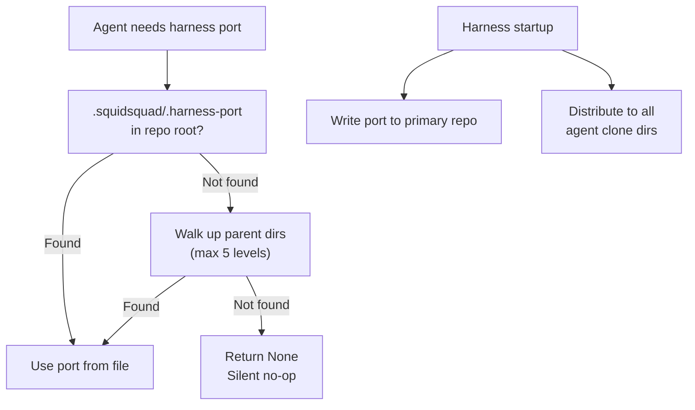

Each agent typically runs in its own git clone. The harness writes its port to `.squidsquad/.harness-port` at startup; agents discover it by checking the file and walking up to 5 parent directories. When the file is missing (harness not running), all event operations silently no-op.

### 4.8 Design properties summary

| Property | Implementation |
|---|---|
| **Non-blocking** | 500ms timeout on all HTTP calls; exceptions silently swallowed |
| **Observational (loop) / load-bearing (event)** | Same wire; different agent dependency on it |
| **No persistence** (deque) | In-memory; harness restart clears history |
| **Self-isolation** | Agents don't react to their own events |
| **At-least-once** | Cursor advances only after successful ack |
| **Role authority** | Bus has no permissions knowledge; `tracker.py` enforces transitions; harness enforces `/work/assign` via L2 bus contract (§7.3) |
| **Graceful degradation** | Harness unreachable in loop mode = empty events, zero behavior change to git-coordination layer. Harness unreachable in event mode = agent idles until recovery; loop mode is the manual operator fall-back (§8.2 / §8.4) |

---

## 5. State persistence map

| What | Where | Owner | Why |
|---|---|---|---|
| Per-alias cursor | `.squidsquad/.event-state.json` | harness | Harness owns delivery state |
| In-flight events | `.squidsquad/.event-state.json` | harness | Re-delivery on timeout (#9873-E) |
| Agent intent + PID | `.squidsquad/.harness-state.json` | harness | Harness owns agent lifecycle |
| Agent singleton PID | `.squidsquad/<alias>/.claude-pid` | agent (thin_launcher) | Singleton enforcement (#8692) + harness health-poller's process-liveness check (see §3.3) |
| Agent current-work state | `.squidsquad/<alias>/working-state.md` | agent | Resume-from-crash checkpoint for the agent's OWN current work. Does NOT carry an event queue (harness deque + cursor own that) AND does NOT carry a nudge flag (per §7.5 — nudge memory lives only in conversation context) |
| Improvement subloop throttle | `.squidsquad/<alias>/.subloop-last-run` | agent | Last-fire timestamp; gates next eligibility (§7.6) |
| Last-seen forge event | EAD-internal persistence | harness | Don't re-emit assigned-to on restart |
| Work state | GitHub Issues (forge) | forge | Source of truth for status, comments, PRs |
| Decisions / institutional memory | `.squidsquad/vault/` | shared | Long-lived rationale — see [`VAULT-ARCH.md`](VAULT-ARCH.md) for architecture (PARAG model, sub-skills, scripts, cycle integration) |

**Invariant**: agents do not write to harness-owned files. Harness does not write to agent-owned files.

---

## 6. Loop mode in detail

### 6.1 The Ralph Loop cycle

A cycle has three phases (vault touchpoints inlined; see §6.6 + VAULT-ARCH §7 for execution-lane detail):

```
Boot (session start, once):
  · read .squidsquad/vault/BRIEFING.md   [vault-protocol, inline]
                       ↓
┌─── Phase 1: Pre-cycle (mechanical) ──────────────┐
│ cycle_pre.py <role>                              │
│ · git pull (with stash/pop)                      │
│ · read working-state.md                          │
│ · query work queue (tracker)                     │
│ · derive mechanical reactions from tracker       │
│   state changes since last cycle (§6.3)          │
│ · build .squidsquad/<alias>/cycle-input.json     │
└──────────────────────────────────────────────────┘
                       ↓
┌─── Phase 2: Creative work (agent) ───────────────┐
│ Read cycle-input.json                            │
│ Investigate / decide / act                       │
│   ↳ vault-protocol reads inline as needed        │
│   ↳ vault-protocol writes inline (vault-create / │
│       vault-update + vault-check Level 1)        │
│ End-of-Phase-2 reflection (if not a quiet cycle):│
│   ↳ vault-remember → subagent (`sonnet`)         │
│       returns write decisions → applied inline   │
│ Quiet-cycle additions:                           │
│   ↳ vault-optimize inline (gated: 20+ notes)     │
│   ↳ every 5th quiet (PM): vault-synthesis        │
│       → subagent (`sonnet`) returns ≤1 posture   │
│ Write cycle-output.json                          │
│ (free use of git, bash, subagents for the work)  │
└──────────────────────────────────────────────────┘
                       ↓
┌─── Phase 3: Post-cycle (mechanical) ─────────────┐
│ cycle_post.py <role>                             │
│ · apply status transitions                       │
│ · post tracker comments                          │
│ · write iteration log                            │
│ · git commit + push (incl. vault note writes)    │
│ · update working-state.md (incl. last-cycle      │
│   timestamp for tracker-state dedup)             │
│ · status-bar cleanup                             │
│ · context-pressure check → exit 42 if exceeded   │
└──────────────────────────────────────────────────┘
```

The agent only writes the creative phase. Mechanical phases are deterministic scripts. Vault sub-skills split between inline execution (`vault-protocol`, `vault-optimize`) and background-subagent execution (`vault-remember`, `vault-synthesis`) — see §6.6.

### 6.2 What wakes the agent in loop mode

`thin_launcher` runs `claude` with `/loop 30m execute one Ralph Loop cycle` as the initial command. The `/loop` slash command schedules a recurring cron entry; when it fires, the agent runs one cycle and waits for the next fire.

The 30-minute interval is read from `.squidsquad/config.md`'s `Iteration Interval > Minutes` field at compose time and inlined into the composed CLAUDE.md's boot section (alongside the loop-mode procedural fragment — see §8.1). Recovery from an interrupted `/loop` re-invokes the same literal command.

### 6.3 Loop-mode mechanical reactions

The pre-cycle script applies the high-confidence reactions from §4.5 before the agent's creative phase runs. Reactions land as `mechanical_reactions` in `cycle-input.json` so the agent can see what was done.

In loop mode, reactions are **derived from tracker state**, not from the event bus (per §2 mutual exclusivity). Dedup is by the last-cycle timestamp persisted in working-state.md; state changes older than that are ignored.

Today's reactions:
- `pr-merge-detected` (PM): `gh pr list` finds PRs that newly transitioned to merged since last cycle's timestamp; for each, look up the linked issue and verify its status.
- `rework-needed` (worker): `gh issue list` finds tasks newly transitioned to `status:in-progress` by the verifier (rework signal) since last cycle's timestamp; for each, prioritize the named issue.

Both are idempotent against already-handled issues (e.g., transitioning a closed issue is a no-op). Loop mode does NOT issue `GET /events/for/<role>` and does NOT maintain an event cursor — those are exclusively event-mode mechanisms (see §7).

### 6.4 Improvement subloop (loop mode)

In loop mode, when a cycle finds no work in the queue (no pending-test, no pending-ship, no nudges to process, no human input), the cycle is **quiet**. Quiet cycles run an improvement scan as their creative phase — the same activity event mode triggers via §7.6's drained-queue path. The trigger is "the cycle wrapper fired and found nothing else to do," not a separate timer; throttling, ownership per role, and output routing all match §7.6.

See §7.6 for the substantive scan rules; this section's purpose is to anchor that those rules are not event-mode-exclusive.

### 6.5 Context-pressure exit-42 and respawn

When the cycle's context usage exceeds the configured threshold (default 70%), the agent checkpoints `working-state.md`, commits and pushes, and `cycle_post.py` exits with code 42. What respawns the agent depends on whether the harness is up:

- **With harness running** (#4966): the harness watches the agent's `.claude-pid`, sees the non-zero exit, and re-runs the boot flow (which in loop mode immediately re-schedules `/loop`).
- **Harness-less loop mode**: `thin_launcher` is the parent process and exits when `claude.exe` exits — there is no automatic respawn. The agent stops after exit-42 until an operator restarts it. Context pressure is therefore a soft terminal state in harness-less mode; operators are expected to use a process supervisor (systemd, launchd, NSSM) or to restart agents periodically.

This is loop mode's primary form of session lifecycle — agents don't shut down cleanly between cycles; they respawn (with harness) or stop (without) on context pressure.

### 6.6 Vault touchpoints within Phase 2

Vault sub-skills participate in the creative phase at four touchpoints. They split into two execution lanes by weight — anything that requires meaningful reasoning over vault content runs out of process to keep the consuming agent's context lean:

| Touchpoint | Sub-skill | Lane | When |
|---|---|---|---|
| Continuous reads/writes during work | `vault-protocol` | **inline** | Throughout Phase 2; the agent IS doing the read/write the protocol governs |
| End-of-Phase-2 reflection | `vault-remember` | **background subagent** (`sonnet`) *— target lane; see §6.6 Implementation gap* | Step 4b, gated by the non-quiet-cycle check only (always-on; no feature toggle). Default write budget 2/cycle (configurable via `.squidsquad/config.md` `Vault Remember > Writes Per Cycle`; surplus deferred by priority decisions > learnings > patterns — see [VAULT-ARCH §7.2](VAULT-ARCH.md#72-vault-remember) for full reflection rules). Returns `{action, path, type, body, reason}` per candidate; consuming agent applies the write list deterministically |
| Quiet-cycle housekeeping | `vault-optimize` | **inline** | Quiet cycle, after improvement-scan check (skips if the scan would fire this cycle); gated by 20+ note count. Wrapper around `vault_optimize.py run` — no reasoning to offload |
| Every-5-quiet cross-agent synthesis | `vault-synthesis` | **background subagent** (`sonnet`) *— target lane; see §6.6 Implementation gap* | PM only; fires after 5 consecutive quiet cycles **and** vault has 10+ galaxy notes. Counter resets on real work or completed synthesis. Returns ≤1 posture descriptor; consuming agent writes it via `vault-create` + files the pending-review task |

A fifth touchpoint sits **outside** the per-cycle phases: at boot (session start, once per session), every agent reads `.squidsquad/vault/BRIEFING.md` for active context. That's part of `vault-protocol` and is always inline. The **BRIEFING.md staleness check** runs *every* cycle including quiet cycles (always-on; not subject to the quiet-cycle gate; doesn't consume the write budget) — see [VAULT-ARCH §5](VAULT-ARCH.md#5-briefingmd) + §7.2 for the staleness rules.

The model pin for subagent-lane sub-skills is the **`sonnet`** tier — see [`VAULT-ARCH.md`](VAULT-ARCH.md) §7 Execution model and `[[decision-vault-subagent-model-sonnet]]` for rationale. The pin is by tier, not by dated version.

**Implementation gap** (today): the subagent lane is the architectural target, not the current behavior. Both `vault-remember` and `vault-synthesis` currently compose into the consuming agent's CLAUDE.md inline; closing the gap requires splitting each sub-skill source into a stub (composed into agent) plus a prompt (loaded by the subagent). Tracked as VAULT-ARCH §11.5 + #10180.

For the full vault architecture (storage model, frontmatter spec, scripts, cycle integration detail beyond what this sub-section captures), see [`VAULT-ARCH.md`](VAULT-ARCH.md) — §7 for sub-skills, §9 for cycle integration, §11 for known gaps.

### 6.7 Subagent invocation rules

Agents may delegate work to subagents via the Agent tool. This subsection describes the **runtime rules** for spawning, model selection, prompt hygiene, and result handling. The L1-L3 source authoring of these rules (which slot, which ordinal) is documented in [`COMPOSE-ARCHITECTURE.md`](COMPOSE-ARCHITECTURE.md) §3.2 — the rules compose into each agent's CLAUDE.md via the regular `(slot, ordinal)` mechanism.

**Default model selection** (L1 baseline, applies to all roles):

- Use the lightest model that can do the job. Sonnet 4.6 is the default for mechanical or scoped subtasks (file searches, summarization, lint passes, narrow research).
- Reserve Opus 4.7 for complex reasoning, multi-step planning, architectural review, or work that requires holding many constraints simultaneously.
- The parent agent's own model is independent of subagent model choice.

**Per-role overrides** (L3 content authored alongside the role's other L3 sub-skills; takes effect by appearing later in compose's `(slot, ordinal)` order than the L1 default):

- `worker` (and variants like `skill`): subagent spawns default to Sonnet — the heavy thinking is in the parent. (Authority: memory rule `feedback_skill_sonnet_subagents`.)
- `dm`: subagent spawns default to Sonnet — `dm`'s work is mostly mechanical packaging. (Authority: memory rule `feedback_dm_sonnet_subagents`.)
- `pm`, `verifier`: use the L1 default — pick per task.

**When to spawn vs inline**:

- **Spawn** when the work is genuinely parallelizable (multiple independent investigations) OR when the output volume would blow the parent's context window (large grep/scan results).
- **Inline** for small lookups (known file path, single grep), narrow questions, anything the parent already has context for.

**Prompt hygiene**:

- Subagent prompts must be self-contained. The subagent doesn't see the parent's conversation; brief it like a smart colleague who just walked in.
- Include exact file paths, line numbers, and what specifically to change/check. Don't write "based on your findings, fix the bug" — that delegates the synthesis the parent should already have done.
- Ask for a length cap when one is appropriate ("report in under 200 words") — keeps the subagent's response from re-bloating the parent's context.

**Trust but verify**:

- A subagent's summary describes what it *intended* to do, not necessarily what it did.
- When a subagent writes or edits code, the parent verifies the actual diff before reporting the work as done.

**Parallelism**:

- Independent subagent calls go in a single tool-use batch (one message, multiple Agent calls) so they run concurrently.
- Sequential dependencies are sequential — don't parallelize when output of A feeds B.

---

## 7. Event-driven mode in detail

**This chapter describes the wake-nudge mechanism, not a communication channel.** The single inter-agent communication channel in SquidSquad is the **forge** — the tracker (GitHub Issues/PRs and their comments). Every cross-agent message is written to forge: append-only, durable, role-tagged via `tracker.py`, queryable across cycles. Agents read forge state at the start of each cycle and act on what they observe. The forge-as-channel principle is canonical and lives at [`COMPOSE-ARCHITECTURE.md`](COMPOSE-ARCHITECTURE.md) §5.1.1 (with the full send-pattern sequence diagram); this chapter does not duplicate it.

Events carry **no semantic payload**. An event is a nudge that tells a target "something changed for you on the forge; consider waking now instead of at your next polling tick." If the target is mid-cycle, the nudge is ignored (no preemption); the target picks up the forge change on its next natural cycle. If the target is idle, the nudge wakes it early via its Monitor subscription. A lost or missed nudge is harmless — the next polling cycle still picks up the forge change.

Concretely, sending another agent a message follows the three-step pattern (canonical sequence in COMPOSE §5.1.1):

1. **Write to forge** — append a tracker comment via the `discussion` sub-skill.
2. **Route to target** — update issue state (assignee, labels) so the message lands in the target's normal pipeline queries.
3. **Nudge** — fire a nudge event with `target_alias=<alias>` so an idle target wakes early.

Event mode is the **exclusive home** for event-bus consumption and cursor logic (per §2 mutual exclusivity). Everything in this section — `event_poll` sidecar, nudge contract, per-event cycle wrapping, cursor advancement, cascade protection via cursor dedup — applies only when the install is in event mode. Loop mode does not touch any of this. Both modes use forge as the comm channel; they differ only in *how* the target finds out a forge change is pending for it (nudge vs. polling tick).

### 7.0 The `event_poll` sidecar

A sibling `event_poll.py --wait --role <role> --target stdout` process polls the harness on the agent's behalf and writes a literal `NUDGE\n` line to stdout whenever new events arrive past the agent's cursor. That line is what wakes the Claude session via Monitor. The `--role` flag accepts the **alias** value (per the §4.3 vocabulary note: the legacy `--role` / `{role}` naming accepts alias values for code-compat; rename to `--alias` ships with #10358).

**Polling cadence** (locked, same adaptive pattern as EAD §4.4 but for the harness HTTP API, not the forge):

```
default state: active (5s between polls)

  last_poll_found_events? → stay at 5s
  3 consecutive empty polls at 5s? → step up to 30s
  3 more consecutive empty polls at 30s? → step up to 60s (ceiling)
  events return after any backoff? → reset to 5s
  hard floor: 2s   (avoid harness churn)
  hard ceiling: 60s
```

Two-tier backoff: 5s → 30s → 60s. A drained queue stabilizes at 60s after ≥6 consecutive empty polls (≈1.75 minutes idle).

Nudge format is literal `NUDGE\n` with no payload — the agent always does `GET /events/for/{role}?since=cursor` to find out what's new. False positives (a `NUDGE` arriving when no relevant events exist) are harmless because the GET returns `[]`.

`event_poll`'s lifecycle is harness-owned: `boot_agent(role)` spawns it alongside `thin_launcher`, the health poller watches its PID, and the harness respawns it on death while `intent=running`.

### 7.1 The nudge contract

Per `#9892`:

```
on each nudge:
    cursor = GET /events/cursor/{role}
    events = GET /events/for/{role}?since=cursor

    last_tended = cursor
    for event in events:
        if event passes my role's care filter:
            run_pre_cycle()    # mechanical: git pull, working-state read, etc.
            do_work(event)     # the agent's creative work
            run_post_cycle()   # mechanical: commit, push, working-state write
        # if skipped, no cycle wrapper fires
        last_tended = event.id

    POST /events  ack-cursor {event_id: last_tended, role}
```

Pre/post-cycle wraps EACH cared event individually. Skipped events do not trigger cycle wrappers. The batched ack at the end signals "I've handled or skipped everything up to last_tended; advance my cursor."

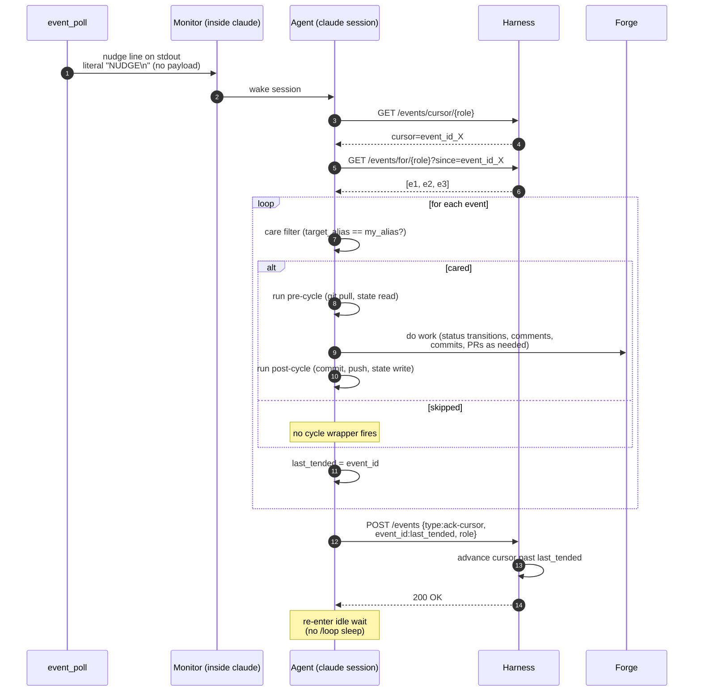

### 7.2 Boot sequence

The harness tracks each agent with two distinct fields in `.harness-state.json`:
- **`intent`** = what the operator wants (`running` | `stopping` | `stopped`)
- **`status`** = what the agent is actually doing (`booting` | `ready` | `stopping` | `stopped` | `crashed`)

These move independently. The operator sets `intent`; the harness updates `status` as it observes lifecycle transitions.

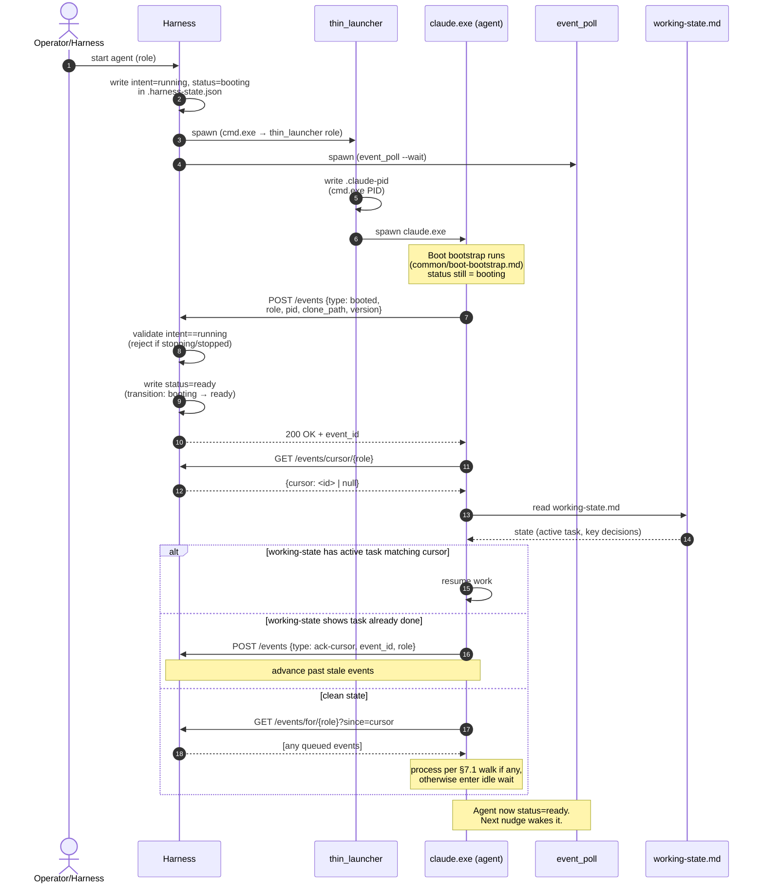

#### Agent state machine

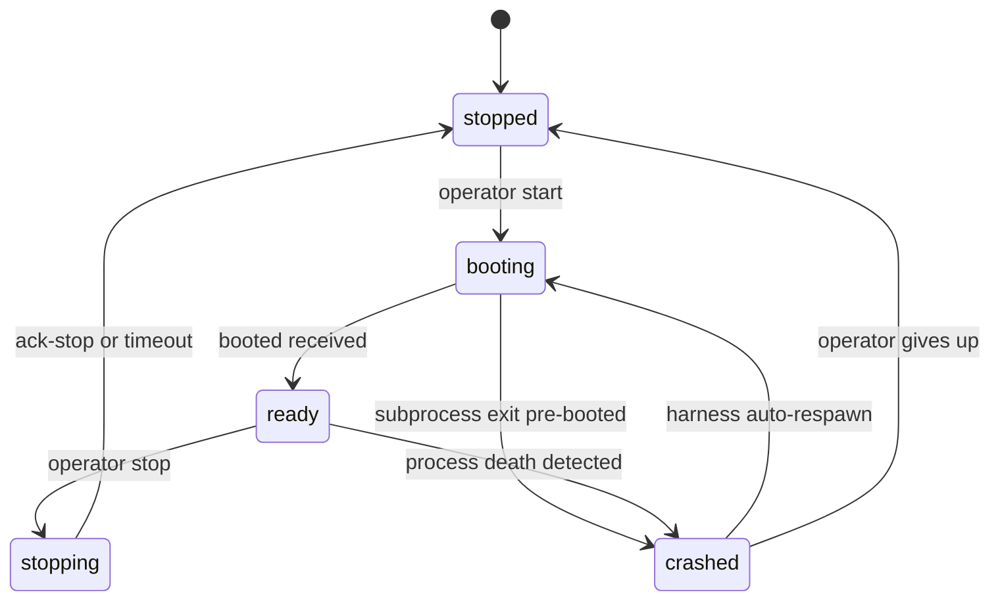

State semantics:
- **`booting`** — `intent=running`, subprocess spawned, `booted` event NOT yet received. Health poller does NOT count agent as alive yet (boot-grace window applies). Any `assigned-to` events for the role queue but are NOT delivered until status flips to `ready`.
- **`ready`** — `intent=running`, `booted` received, agent listening for nudges. Steady-state "alive". Both idle and actively-working agents are `ready`.
- **`stopping`** — `intent=stopping`; harness emits `assigned-to(role, event_context="stop-intent")` so the agent finishes current work and emits `ack-stop`. Timeout: 30s grace → SIGTERM → 10s → SIGKILL.
- **`stopped`** — process is dead AND `intent=stopped`. Terminal until operator restarts.
- **`crashed`** — process death detected by health poller but `intent=running`. Harness auto-respawns; status flips back to `booting`.

Two fields, not one, so recovery semantics are explicit. After a host reboot, the harness reads `.harness-state.json`, sees `intent=running` but no live PID → respawn. If collapsed, the harness couldn't distinguish "operator stopped this" from "this crashed."

### 7.3 Work handoff: explicit `/work/assign`


In practice agents never call `/work/assign` directly for transition-driven handoffs — `tracker.py transition` does it automatically.

#### `tracker.py` auto-routing table (locked)

| Transition (from → to) | Implied `target_alias` | event_context |
|---|---|---|
| `in-progress → pending-test` | alias from issue's `role:*` label (a verifier-class alias); if none, route to `pm` with `event_context="unowned-verification"` | `"verification-needed"` |
| `pending-test → pending-ship` | alias from issue's `role:*` label (a dm-class alias); if none, `dm` (single-instance default) | `"delivery-needed"` |
| `pending-test → in-progress` | alias from issue's `role:*` label; if none, route to `pm` with `event_context="unowned-rejection"` | `"verifier-rejected"` |
| `pending-ship → in-progress` | alias from issue's `role:*` label; if none, route to `pm` with `event_context="unowned-rejection"` | `"merge-conflict"` |
| `pending → planning` | `pm` | `"planning-needed"` |
| `planning → planned` | (no assign — self-routing) | — |
| `planned → approved` | alias from issue's `role:*` label; if none, route to `pm` with `event_context="unowned-approval"` | `"ready-for-pickup"` |
| `approved → in-progress` | (no assign — self-pickup) | — |
| `pending-ship → shipped` | (no assign — terminal) | — |
| `* → pending-human-review` | `pm` | `"human-needed"` |
| `* → pending-human-setup` | `pm` | `"human-needed"` |

The issue's `role:*` label IS the target alias (aliases and label values use the same namespace). The label *key* is `role:` for legacy code-compat reasons, but the label *value* is always alias-typed — in a single-instance install, alias = class name; in a multi-instance install, the label is the specific agent's alias (e.g., `role:frontend-1`, not `role:worker`). A rename of the label key from `role:` to `alias:` is in the same family as #10358 (`role` → `alias` identifier rename) but is currently out of scope on that task to limit blast radius — every existing issue label would need editing in lockstep with `tracker.py`, every care-filter caller, and every composed agent file that mentions `role:<name>`. Revisit once #10358 has phased through code-side first.

Mitigates an entire class of pickup-fidelity bugs (#9946) — agents can't forget to call `/work/assign` because `tracker.py` does it. Replaces the deprecated `status-transition` emit.

#### Routing — sender-side selection + harness alias-existence check + mis-route recovery

**Sender-side selection** (the user-team analogy): before emitting `assigned-to`, the sender consults the install's `## Aliases` registry (visible to every agent via the composed CLAUDE.md's team-awareness block). The sender picks a target alias by:

1. Class match — the work belongs to which role-class (verifier, worker, dm)?
2. Specialty match — within that class, which L3 domain (FE, BE, etc.) does the work map to?
3. Instance selection — if multiple aliases of the matched class+specialty exist, the sender picks one. Selection logic is sender-defined: queue depth (`GET /events/queue-depth/{alias}` or equivalent), most recent reachability, round-robin, etc. Agents within the same `(class, L3 domain)` are interchangeable by construction (instances compose from byte-identical L1–L4 + one shared L4 file per `(class, domain)` pair — see Terminology), so any of them can handle the work.

The sender comments on the issue with a one-line routing rationale when the lane isn't obvious from the status transition alone.

**Harness validation**. The harness performs **one** validation on `/work/assign`: does `target_alias` resolve to a registered agent in this install (per `.squidsquad/config.md` `## Aliases`)?

- **Unknown alias** → `HTTP 404 Not Found` with body `{"error": "unknown alias", "target_alias": "<value>", "known_aliases": [...]}`. Prevents typos and misconfigurations from reaching the deque.
- **Self-assign** → forbidden by built-in invariant (the harness rejects any `assigned-to` where `target_alias == emitter_alias`). Structural anti-loop, not a permission table.
- **No class-from-class permissions**: any alias may assign-to any other alias. Process discipline lives in each agent's L2/L3/L4 — not in a harness gate. This aligns with §4.1's "harness is a transport bus, not an orchestrator" principle (adding a permission table would make the harness gate-keep work assignment, which it explicitly doesn't do).

**Mis-route recovery** (the human-team analogy): when an agent receives `assigned-to` work that doesn't match its declared specialty:

1. Agent reads the event in Phase 2.
2. Agent recognizes the work is outside its domain (per L2/L3/L4 + SOUL.md).
3. Agent re-assigns via `/work/assign` to the correct alias. No special wire-format, no `re-assign` event type — same `/work/assign` call any normal routing uses, with the corrected `target_alias`.
4. Agent emits its own cycle's `ack-cursor` and continues.
5. If the agent doesn't know who the correct alias is, it routes to `pm` with `event_context="route-help"` so PM can triage.

This is the **only** recovery mechanism. There is no harness-side "is this a good match?" check — agents are trusted to recognize and correct mis-assignments the same way a human team-member redirects a misfiled ticket.

For non-transition routing (e.g., process concerns surfaced to PM without a state change), agents call `/work/assign` directly:

```bash
python references/scripts/tracker.py work-assign --target-alias pm \
    --event-context process-concern --payload '{"concern": "..."}'
```

#### EAD safety net

If forge state changes through any path OTHER than `tracker.py transition` (human edit in the GitHub UI, third-party automation, or `tracker.py`'s `/work/assign` POST failed), EAD catches it on its next poll:

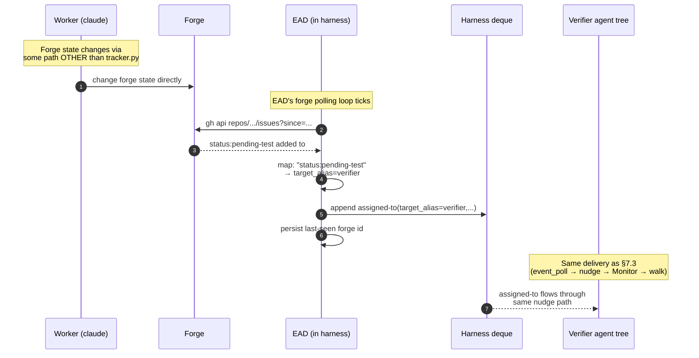

Tracker.py path is sub-second; EAD path is 5–60s polling-cadence-bounded.

### 7.4 Care filter

Each agent's care filter is "events with `target_alias == my_alias`." Future refinement could allow finer-grained filtering on `event_context` or `payload`, but v2 ships with alias-only filtering. There is no permission gate to traverse — the harness has already validated the alias exists; everything past the care filter is the agent's own routing decision.

### 7.5 Nudge handling while busy (context-only, no state mutation)

If a nudge arrives while the agent is mid-cycle:

1. Agent notes the nudge in conversation context — no file write, no queue, no flag.
2. Agent continues processing current event uninterrupted. Emits `ack-cursor` for current event.
3. Post-current, agent enters the §7.1 walk: GETs queue, processes new events in cursor order.

**Why no flag is needed:**

- The harness cursor is canonical. Post-cycle the agent always GETs the queue regardless of whether a nudge was noted.
- `event_poll` is self-healing — even if conversation context is lost (session crash, mid-window compaction), event_poll's next poll within 5–60s (active/idle adaptive) will see events past cursor and re-emit a nudge.
- Monotonic-forward cursor prevents double-processing.

**Crash-safety:**

| Crash point | Recovery |
|---|---|
| Mid-current-event | Restart reads `working-state.md`, resumes. Post-completion walk catches up. |
| Between ack and walk | Restart sees no current work, enters idle. Original mid-cycle nudge is "lost" from context, but `event_poll`'s next poll re-detects past-cursor events and re-nudges. |
| Multiple nudges arrived; agent crashed pre-walk | Any single fresh post-restart nudge triggers the walk that processes all queued events in order. |

Honors the locked principle: forge owns work state, harness owns delivery state (cursor), agent owns ONLY its current work.

### 7.6 Improvement subloop (cursor-at-head)

In loop mode, agents run improvement scans on quiet cycles. In event mode there are no cycles — agents wake only on nudges. If we did nothing else, an agent that handles all its events would never run improvement work.

The improvement subloop fires when the agent's queue is observably drained — `GET /events/for/{role}?since=cursor` returned `[]` on the last walk (no events past cursor). There is no harness endpoint for "am I at deque head?"; the agent infers drained-state from an empty GET response.


**Throttle** (time-based, NOT token-counting): at most one subloop per agent per N minutes (default 30, matching the old `/loop` cadence — so observable improvement-scan frequency stays the same as loop mode). `.squidsquad/<alias>/.subloop-last-run` records the last-fire timestamp; the agent checks this file's age before triggering.

**What the subloop does** (role-specific, one bounded task per fire):
- **pm**: pipeline sentinel + improvement scan (process gaps, stalled items, doc drift)
- **verifier**: TEST-PLAN backlog catch-up
- **worker**: doc-scan or test-coverage scan on owned modules
- **dm**: doc realignment + CHANGELOG hygiene + version-bump readiness

Subloop output may emit a new `assigned-to` (e.g., pm-subloop files a bug and routes it). That nudges the owning role into work — via the same `/work/assign` path everything else uses.

---

## 8. Mode selection & migration

### 8.1 Global config

`.squidsquad/config.md` has one `event-driven:` field that controls mode for the entire install:

```
event-driven: no    # global — applies to all agents
```

There is no per-role override and no runtime mode-detection — mode is settled at compose time for every agent in the install. An install is either entirely event-driven or entirely loop-mode at any given moment; mixed states only exist transiently during a recompose roll-out (some agents restarted, others not yet — §8.2).

**How mode selection actually works** (compose-time only):

`compose.py` reads `event-driven:` and produces a *mode-specific* composed CLAUDE.md for each role. The manifest choice (`includes.yml` vs `includes-events.yml`) is made at compose time. The procedural fragments split by mode:

- **Loop mode** — `roles/<role>/ralph-loop-overview.md` is inlined into the composed CLAUDE.md at compose time.
- **Event mode** — uses a **two-tier mechanism**. `boot-bootstrap` (one of the sub-skills the event manifest declares) IS inlined at compose time. But `boot-bootstrap` contains Read-tool instructions that **load the `common-events/*.md` fragments** (`l1-base`, `event-driven-workflow`, `cursor-management`, `forge-read-pattern`, `idle-cooldown-loop`, `comment-handling`) **at agent session start**, not at compose time. The `common-events/*` files are therefore not in the composed CLAUDE.md body — they enter the agent's context on boot via `boot-bootstrap`'s Read calls.

See [COMPOSE-ARCHITECTURE §6.5](COMPOSE-ARCHITECTURE.md#65-wake-mode-handling--two-parallel-manifests-compose-time-selection) for the full two-tier mechanism + manifest selection mechanics.

The agent therefore receives exactly **one** composed CLAUDE.md, already shaped for its install's configured mode. There is no runtime mode-detection layer and no in-CLAUDE branch on mode. Mode flips require a recompose and restart (§8.2).

### 8.2 Flipping the install's mode

A mode flip is install-wide and requires a recompose + restart of each agent. Because mode is baked into each composed CLAUDE.md at compose time (§8.1), restarting alone is not sufficient — the composed bodies on disk must be regenerated first. Steps:

1. Edit `.squidsquad/config.md` `event-driven:` value.
2. Run `compose.py deploy-all` to regenerate every composed CLAUDE.md with the new mode's manifest + procedural fragments inlined.
3. Restart every agent (`python references/scripts/squidsquad_cli.py restart-all` or equivalent).
4. New sessions boot into the new mode.

> **Manual fall-back to loop mode** (operator, user, or doctor-agent). If event-mode is failing for any reason (harness wedged, event-bus regression, etc.) and you want to bring the squad back up on the loop-mode contract, follow the same 4 steps above with `event-driven: no` at step 1. There is no automatic runtime fallback — the doctor's job is to flip the flag and recompose.

### 8.3 Boot decision tree

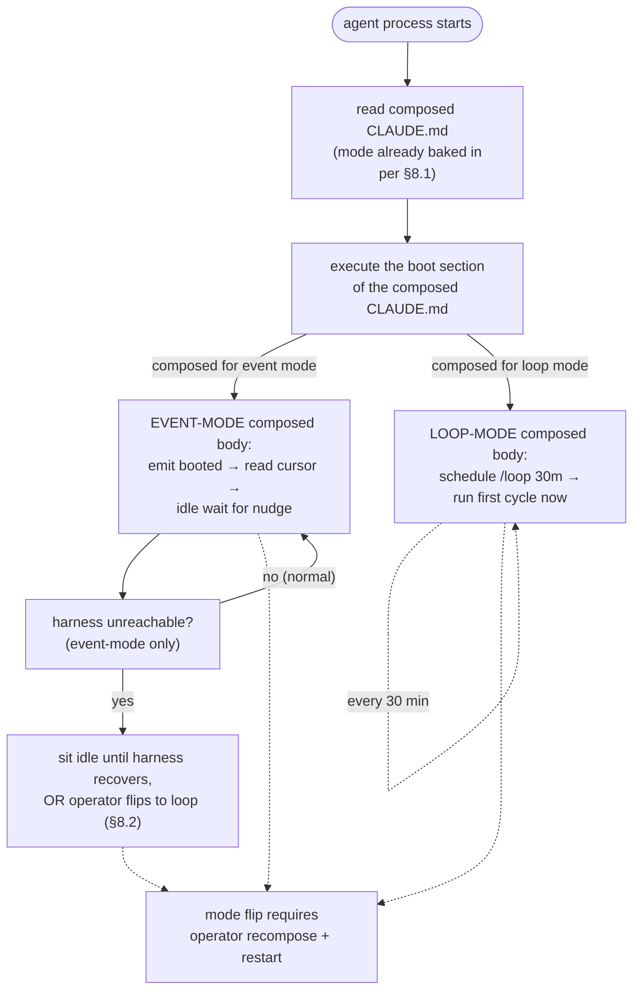

Mode is decided once at compose time and locked into the composed CLAUDE.md. The agent does not re-detect mode at boot or mid-session. The operator is the only mode-flipping authority; recompose + restart is the only path between modes (§8.2).

### 8.4 When the harness is unreachable

In **event mode**, if the harness is down at or during boot the agent simply sits idle — there are no events to consume and no `/loop` to fire. The composed CLAUDE.md contains only event-mode procedural content, so the agent has nothing else to do; it waits. When the harness comes back up the next nudge resumes normal flow without operator action.

If event mode is failing for reasons that won't resolve on their own (harness regression, wedged event-bus, persistent routing loops, etc.) the operator, user, or a doctor-agent can manually flip the install back to loop mode via the §8.2 recompose-and-restart procedure with `event-driven: no`. There is no automatic runtime fall-back; falling back is an explicit operator action.

In **loop mode**, the harness's reachability is not a boot gate at all — loop-mode agents run `/loop` and write/read tracker state directly through `gh`; the harness is irrelevant to their cycle. Loop mode is the safe-mode target for the manual fall-back above.

### 8.5 Migration from loop → event mode (v2 closure plan)

The v2 build ships as 5 grouped PRs. The **letters** (A–F) are logical-grouping identifiers — they cluster related work; the **numbers** (1–5) are the dependency-driven implementation order. The two orderings differ on purpose: e.g., Group A is the foundation and ships first, but Group B (cursor wire) is held until after C has landed so its wire-format changes don't conflict with EAD restart-safety.

| # | Group | What it does | Risk |
|---|---|---|---|
| 1 | **A — Lifecycle plumbing** | `boot_agent` spawns thin_launcher + event_poll; health poller watches both; cold start order; wizard writes the global `event-driven:` flag | medium |
| 2 | **C — EAD + restart safety** | Last-seen-id recovery, in-flight cleanup, harness restart catch-up | low |
| 3 | **D — alias-existence validation** | Harness validates `target_alias` against the install's registered aliases (per `.squidsquad/config.md` `## Aliases`); 404 on unknown. No class-from-class permissions. | low |
| 4 | **B — Cursor + delivery wire** | Nudge format = literal `NUDGE\n`; forward-only ack; `HTTP 410 Gone` for cursor-evicted | low |
| 5 | **F — Observability** | TUI polls `/status`, `/agents`, `/events/recent`; lifecycle/git logs stay in iter-NNNN.md | very low |
| 6 | **E — Migration** (3 sub-phases) | E1: stop emitting deprecated types · E2: collapse `Event Reactions` to `assigned-to` only · E3: trim catalog + rewrite event_poll | highest |

After all 6 land: v2 ships under `event-driven: no` default; operators flip per install. Loop mode stays available indefinitely.

**Catalog-trim replacements** (Group E translates retired event types into `assigned-to` with a specific `event_context`):

| Retired type | Replacement | When emitted |
|---|---|---|
| `compose-completed` | `assigned-to(target_alias=pm, event_context="compose-needed", payload={touched_files})` | After a merge touches `references/`. PM runs `compose.py deploy-all`, restarts affected agents. |
| `agent-health` (stalled/down) | `assigned-to(target_alias=pm, event_context="agent-down", payload={role, last_seen})` | Harness health poller detects a watched agent dies or stalls past threshold. PM's pipeline-sentinel handles. |
| `noop` (#9845) | `assigned-to(target_alias=A, event_context="probe", payload={ack_only:true})` | Latency probe / harness liveness check. Agent acks without doing work. `ack_only` is a `payload` extension, not a top-level `assigned-to` field — see §4.2 catalog entry. |

PM's inbox is disambiguated by `event_context`. The full set in use:

- From the `tracker.py` auto-routing table (§7.3): `"planning-needed"`, `"human-needed"` (for `* → pending-human-review|setup` transitions), `"unowned-rejection"` (fallback for rejected items with no `role:*` label), `"unowned-approval"` (fallback for approved items with no `role:*` label).
- From the catalog-trim translators (§8.5): `"compose-needed"` (recompose required), `"agent-down"` (health-poller observed an agent stall).
- From EAD: `"human-comment"` (forge comment by a human author).
- From agents calling `/work/assign` directly: `"process-concern"` for ad-hoc routing of cross-role process issues to PM.

PM agents recognize this set as their care-filter; new values added in future require both an emitter update and an entry in this list.

---

## 9. Open questions

> All §13 questions from `archive/EVENT-ARCHITECTURE.md` were closed in rev 4 (2026-05-23). Listed here so future drift surfaces against a known baseline.

| # | Question | Lock |
|---|---|---|
| Q1 | Booted payload shape | `{role, pid, clone_path, version}` |
| Q2 | `/work/assign` authorization | Alias-existence check only (404 if unknown); no class-from-class permissions. Process discipline lives in L2/L3/L4, not in a harness gate. |
| Q3 | EAD polling cadence | REST + adaptive 10s active / 30s idle, 5s floor / 60s ceiling |
| Q4 | `event_poll` polling cadence | 5s active / 30s idle, adaptive backoff, 2s floor / 60s ceiling |
| Q5 | Cursor on first boot | `null` per CONTEXT-9873-A D7 |
| Q6 | Care filter granularity | Alias-only in v1; `event_context` filter could be a v2 extension if needed (no L2 bus-contract dependency — that mechanism was retired) |
| Q7 | Queue-while-busy | Context-only; no `working-state.md` flag |
| Q8 | `#9845` (noop) fate | Retired; absorbed into `assigned-to(event_context=probe)` |
| Q9 | `compose.py` changes for v2 | Trim catalog, retire emit calls, add `compose-needed` translator |
| Q10 | Migration plan | Feature flag `event-driven: yes/no` in `.squidsquad/config.md` |

> Net-new open questions surfaced during the loop+event merge (this doc): NONE so far. Add below as they surface.

---

## 10. References & terminology

### 10.1 Glossary

- **Cycle wrapper**: the pre/creative/post phase trio that runs around one unit of agent work. Same shape in both modes.
- **Nudge**: a single stdin line written by `event_poll` to wake a Claude session via the Monitor tool.
- **Cursor**: per-alias harness-owned pointer to "events tended through here."
- **EAD**: ExternalActivityDetector — the harness's forge poller that translates forge state changes into `assigned-to` events.
- **Care filter**: the per-role decision of whether to act on an event or skip it.
- **Improvement subloop**: time-throttled self-care work the agent runs when its queue is empty. Applies in both modes — quiet cycles in loop mode (§6.4) and drained-queue detection in event mode (§7.6).

### 10.2 Related docs

- [`ARCHITECTURE.md`](ARCHITECTURE.md) — the 6-layer system stack; process tree, `.claude-pid` semantics, three claude.exe populations.
- [`COMPOSE-ARCHITECTURE.md`](COMPOSE-ARCHITECTURE.md) — the L1-L4 composition model; how `event-driven:` flips compose-time manifest selection.
- [`sub-skill-catalog.md`](sub-skill-catalog.md) — the catalog of sub-skills; `common-events/` runtime-loaded in event mode, polling fragments in loop mode.
- [`sub-skill-guide.md`](sub-skill-guide.md) — how to author and wire sub-skills.

### 10.3 Source material

- `archive/EVENT-ARCHITECTURE.md` (v2 nudge-driven design, rev 5 lock-ready)
- `archive/EVENT-BUS-ARCHITECTURE.md` (v1 PRD)
- `archive/event-bus.md` (v1 narrative)
- Vault: `.squidsquad/vault/galaxy/decision-event-bus-architecture-redesign.md`
- Pre-flip blockers: `#9891` (event_poll nudge-only), `#9892` (agent contract)
- Fallback path: `#9580`, `#9588`

### 10.4 Revision log

- **2026-05-23 (rev 1) — consolidation.** Merged `EVENT-ARCHITECTURE.md` (v2 design), `EVENT-BUS-ARCHITECTURE.md` (v1 PRD), and `event-bus.md` (v1 narrative) into a single runtime architecture doc framed around loop-vs-event triggering. Carried over all key Mermaid diagrams. The three source docs are slated for retirement once this lands.
- **2026-05-23 (rev 2) — first review-loop pass.** Applied 2 Claude-subagent audits (completeness + internal consistency) and one DeepSeek code-review pass. Fixes: 12 DS findings (4 HIGH cross-mode contradictions and wire-format mismatches, 6 MED disambiguations, 2 LOW polish). Notable additions vs rev 1: §8.3 boot decision tree now gates on `event-driven:` config in addition to harness reachability; §6.4 splits respawn paths for harness vs harness-less; §8.1 explicitly separates compose-time manifest selection from runtime fragment loading; §7.0 documents `event_poll` sidecar + `--role` flag + cadence; §4.3 specifies HTTP 410 cursor-evicted body + event-ID hash formula; §7.3 specifies HTTP 403 rejection body + permission table model. Diagrams: EAD now shows REST endpoint (was `gh api / search`); nudge format normalized to literal `NUDGE\n`; subloop throttle relabeled "time-based" (not "token-burn"). Field names normalized to `issue_number` + `target_role` across both catalog and wire diagrams. DS artifact: `.squidsquad/pm/planning/REVIEW-AGENT-RUNTIME-DEEPSEEK.md`.
- **2026-05-23 (rev 3) — review-loop pass 2.** Second DeepSeek pass surfaced 6 new findings (3 MED, 3 LOW) — mostly fallout from incomplete updates in rev 2. Applied: glossary "token-throttled" → "time-throttled" (was inconsistent with §7.6); cursor-model sequence diagram replaced `working-state.md` participant with `.event-state.json` to match the migrated architecture; routing table now has fallbacks for `pending-ship → in-progress` (unowned-rejection) and `planned → approved` (unowned-approval); event_poll cadence specifies `3 consecutive empty polls` (matching EAD); `assigned-to` catalog payload reconciled with wire diagrams (`title` moved under `payload`); subloop trigger reframed as "GET returns empty" (the observable check) instead of "cursor at deque head" (not directly observable). DS artifact: `.squidsquad/pm/planning/REVIEW-AGENT-RUNTIME-DEEPSEEK-2.md`.
- **2026-05-23 (rev 4) — review-loop pass 3.** Third DeepSeek pass surfaced 2 new findings (1 MED, 1 LOW). MED fix: EAD and event_poll cadence blocks now describe a two-tier backoff (10s → 30s → 60s and 5s → 30s → 60s) — the prior single-step backoff couldn't actually reach the documented 60s ceiling. LOW fix: `ack_only=true` for the probe `event_context` is now correctly notated as a `payload` extension, not a top-level `assigned-to` field. DS artifact: `.squidsquad/pm/planning/REVIEW-AGENT-RUNTIME-DEEPSEEK-3.md`.
- **2026-05-23 (rev 5) — review-loop pass 4.** Fourth DeepSeek pass returned 1 LOW finding only and explicitly assessed the doc as "converged well; no HIGH or MED issues remain." Applied: §8.5 PM-inbox `event_context` disambiguation rewritten from an incomplete-and-partially-fictional list (`route-handoff` wasn't defined anywhere) to an exhaustive enumeration sourced from the routing table, catalog-trim translators, EAD, and direct `/work/assign` callers. DS artifact: `.squidsquad/pm/planning/REVIEW-AGENT-RUNTIME-DEEPSEEK-4.md`.
- **2026-05-23 (rev 6) — terminology unification + global-only mode flag.** Two related cleanups.
  - **Terminology**: removed all current-repo concrete-instance references (no `skill`, no `dev`, no "concrete-install snapshot" framing). The doc uses only the four L2 categorical role names: `pm`, `verifier`, `worker`, `dm` — sourced from the L2 capability layer (`agent-boundaries`), which is the canonical name source. *(Per later revisions: L2 is **Role** in the L1-L4 compose model and `agent-boundaries` was retired — see PR #10359. This entry preserves the then-current framing as historical context.)* Terminology table simplified to 4 rows with no concrete-instance column; role-filtering diagram drops the per-install qualifier and uses categorical names directly; stack-specific specialization is noted as `worker`/`verifier` variants rather than as alternative role names.
  - **Mode flag**: dropped per-role event-driven config (`event-driven-pm: yes` etc.). `event-driven:` is now a single global flag for the install — the whole squad runs in loop mode together or event-driven mode together. §8.1 rewritten; §8.2 mode-flip steps now install-wide; §8.3 boot decision tree simplified to one ConfigGate before the harness probe. Rationale: keeps the harness contract uniform (load-bearing for everyone, or observational for everyone), avoids the cross-role coordination puzzle of mixed modes.
- **2026-05-23 (rev 7) — post-rev-6 DS verification + §7.6 diagram fix.** DS round-7 verification found 2 actionable findings (1 MED, 1 LOW); both applied: §8.1 clarified that mixed modes are not *configurable* but degraded fallback can produce a transient mixed-mode state per-agent (the previous wording falsely implied install-wide uniformity even under fallback); §8.4 reworded to distinguish the configured `event-driven: no` path (loop mode by design) from the `event-driven: yes` + probe-fail fallback path (the prior "regardless of config" wording collapsed the two). Also: §7.6 subloop diagram nodes now use quoted-label form ({"…"}, ["…"]) so unquoted parentheses can't break Mermaid rendering. The "sub-skill" terminology is retained as the canonical compose-fragment term and is distinct from the "skill" agent-role term that was removed in rev 6 (DS flagged as info, accepted as intentional). DS artifact: `.squidsquad/pm/planning/REVIEW-AGENT-RUNTIME-DEEPSEEK-7.md`.
- **2026-05-23 (rev 8) — final convergence + cadence-math fixes.** DS round-8 confirmed all R7 fixes correct and returned 2 LOW math errors: EAD cadence "≈3 minutes" → "≈2 minutes" (correct: 6 polls × 10/20/30/60/90/120s = 120s = 2 min); event_poll cadence "≈2.5 minutes idle" → "≈1.75 minutes idle" (correct: 6 polls × 5/10/15/45/75/105s = 105s ≈ 1.75 min). Both fixed. The doc is now mathematically and architecturally converged. DS artifact: `.squidsquad/pm/planning/REVIEW-AGENT-RUNTIME-DEEPSEEK-8.md`.
- **2026-05-25 (rev 9) — post-#6274 `qa` → `verifier` rename + loop/event mutual-exclusivity on event-bus axis + vault invocation polish.** Three coordinated edits:
  - **Role rename**: post-#6274 (shipped 2026-05-23) the canonical role is `verifier`, not `qa`. Swept all instance-level references in this doc (Terminology table, §2.1 latency-floor example, §3.1 + §3.2 mermaid subgraph and tree labels, §4.3 role-filtering diagram, §7.3 verification-needed sequence diagram + routing table, §7.5 EAD safety-net sequence diagram, §7.6 subloop role list). Wire-format strings updated too: `target_role:qa` → `target_alias:verifier`, `role:qa` → `role:verifier`, `event_context:"qa-rejected"` → `event_context:"verifier-rejected"`, `GET /events/for/qa` → `GET /events/for/verifier`. Note: live code (`references/scripts/triage.py`, `cycle_pre.py:614`) still emits `qa-rejected` — doc now describes architectural target; code task to skill.
  - **Loop/event mutual exclusivity** (§2 + §4.5 + §4.6 + §6.1 + §6.3 + §7 lead): loop mode is now documented as emit-only on the event bus (no consume, no cursor); event mode is the exclusive home for bus consumption + cursor logic. Loop-mode mechanical reactions derive from tracker state changes since last cycle (timestamp dedup in working-state.md), not from event-bus reads. Rationale: keeps the harness contract uniform — loop is observational-only, event is load-bearing.
  - **Vault invocation** (§6.1 diagram + §6.6 new sub-section): named the four Phase 2 vault touchpoints + boot-time BRIEFING read + the inline-vs-subagent execution lane principle (heavy sub-skills `vault-remember` and `vault-synthesis` run on the `sonnet` tier via background subagent; light ones `vault-protocol` and `vault-optimize` stay inline). Cross-references VAULT-ARCH §7 for the lane principle's full rationale.
  - **Vault flag retirement** (§6.1 diagram): dropped the `· read vault-remember + vault-optimize flags` line from Phase 1 and the `· advance event cursor` line from Phase 3 (both per the above changes). The vault-remember/vault-optimize `Enabled` flags in `config.md` are being retired; both sub-skills are always-on and self-gate via their per-cycle conditions. Code task to skill.
- **2026-05-25 (rev 10) — class vs alias as routing primitive + responsibility.md / permission-table retirement.** Architectural simplification arc:
  - **Class vs alias** (Terminology refactor + wire-format swap): role classes (pm/dm/worker/verifier) are categorical and have uniform L2/L3 + bus contract per class; aliases are per-agent unique names from `config.md` `## Aliases`. An install may have 1..N agents per class — e.g., 2 frontend + 2 backend worker-class agents named `frontend-1`, `frontend-2`, `backend-1`, `backend-2` (four worker-class agents, four distinct aliases). Specialty/skill (FE/BE/iOS/etc.) lives in SOUL.md + L4, not in a separate class. Wire-format field `target_role` renamed to `target_alias` across all 16 catalog + sequence-diagram + routing-table references; care filter is now `target_alias == my_alias`; EAD emits one assigned-to per (forge change, target_alias) pair.
  - **`responsibility.md` retired**: the file's prose responsibility narrative was ~90% redundant with L2/L3 (which compose into each agent's CLAUDE.md anyway); the only load-bearing content was the `## Bus contract` section. Permission tables are being retired entirely (next bullet), so `responsibility.md` has no remaining purpose. Marked for code-task deletion.
  - **Permission table retired**: the harness no longer maintains a class-from-class `accepts assigned-to from:` permission table. Rationale: it duplicated discipline that already lives in each agent's L2/L3/L4 + SOUL.md; it conflicted with §4.1's "harness is a transport bus, not an orchestrator" principle; and the human-team analogy (mis-routed tickets get pushed back, no security guard at the assignment desk) applies. Replaced with two minimal harness checks: (1) target-alias existence (404 if unknown) and (2) self-assign invariant (rejected by structure, not by permission). Mis-route recovery happens at the agent layer: receiving agent recognizes out-of-domain work and re-assigns via the same `/work/assign` call to the correct alias; if recipient is unknown, routes to `pm` with `event_context="route-help"`.
  - §7.3 `/work/assign permission model` subsection replaced with `/work/assign validation + mis-route recovery`. §7.4 care filter section drops the L2-derived permission-table mention. §8.5 Group D row repurposed from "L2-derived permissions" to "alias-existence validation". §9 Q2 and Q6 updated to match.
  - Code task to skill (deferred per plan-first rule): drop `responsibility.md` files + compose pipeline reads, drop the harness permission-table build at boot, replace with the simpler alias-existence check, replace `target_role` field with `target_alias` in all wire-format emitters, rename `tracker.py work-assign --target` flag to `--target-alias`.
