# Agent Runtime Architecture (draft)

_How a SquidSquad agent's operating model is defined — what triggers it to act, and what one act looks like._

> **Status**: DRAFT, consolidating prior docs now under `docs/archive/`: `EVENT-ARCHITECTURE.md` (v2 nudge-driven design), `EVENT-BUS-ARCHITECTURE.md` (v1 PRD), and `event-bus.md` (v1 narrative). Those three are kept for traceability; this doc is the canonical reference going forward.
>
> **Companion docs**: [`COMPOSE-ARCHITECTURE.md`](COMPOSE-ARCHITECTURE.md) — **the agent compiler**; owns the format of the composed `CLAUDE.md` that every agent runs on (L1-L4 layering, slot order, frontmatter). The most load-bearing piece of the system: every runtime concern in this doc depends on what compose produced at build time. [`HARNESS-ARCH.md`](HARNESS-ARCH.md) — harness internals (process model, HTTP API, state files, restart safety). [`VAULT-ARCH.md`](VAULT-ARCH.md) — vault layer. [`ARCHITECTURE.md`](ARCHITECTURE.md) — system overview.

---

## Terminology — role classes vs aliases

SquidSquad has a small fixed set of **role classes** and a per-install set of **agent aliases**. Routing targets aliases, not classes.

**Role classes** (4 categorical, post-#6274 rename — `dev` → `worker`, `qa` → `verifier`):

| Class | What this class of agent does (one line) |
|---|---|
| **`pm`** | Coordinates the team and the human; manages workflow and process |
| **`verifier`** | Verifies the product being delivered; does not do technical implementation |
| **`worker`** | Implements technical work to acceptance criteria |
| **`dm`** | Delivers (CHANGELOG, version bumps, releases) |

**Agent aliases** (1..N per class, install-defined in `.squidsquad/config.md` `## Aliases`):

- Every running agent has a unique alias. The alias IS the agent's name in all routing.
- A single-instance install can use the class name as its alias (default: a `worker`-class agent is named `worker`).
- A multi-instance install MUST give each agent of the same class a distinct alias. Example: an install with 2 frontend + 2 backend worker-class agents might use aliases `frontend-1`, `frontend-2`, `backend-1`, `backend-2` — four worker-class agents, four distinct aliases.
- **Instances of the same role-class share one L4 file.** All workers in an install (FE, BE, iOS, etc.) compose against the same `.squidsquad/project/worker.md` L4 file regardless of their L3 specialization; same for verifiers (one `verifier.md`), pm (one `pm.md`), dm (one `dm.md`). **L4 is per L2 role-class only — it does not differentiate by L3 domain.** Rationale: L4 is project-specific overlay; the project's expectations of "what a worker does" don't change based on whether a particular worker is FE-flavored vs BE-flavored. Maximum 4 L4 files per install (`pm.md`, `worker.md`, `verifier.md`, `dm.md`); fewer if those role-classes aren't in the team preset.
- Specialty/skill (FE vs BE vs iOS, etc.) lives in **L3 (the domain layer)** and is shared across all agents of the same (role-class, domain) pair. Two FE-flavored worker agents share L1 + L2 (worker class) + L3 (FE domain) + L4 (worker.md). Two BE-flavored worker agents share L1 + L2 (worker class) + L3 (BE domain) + L4 (worker.md — same file). The L3 domain drives which L3 source files are inlined at compose time; L4 selection is solely by role-class. Per-agent identity (personality, situational tone) lives in `SOUL.md`.
- Each agent knows the other aliases on the team and their declared specialties (visible from each agent's composed CLAUDE.md and from the install's `.squidsquad/config.md` `## Aliases` registry); mis-routed work is re-assigned via `/work/assign` to the correct alias (see §7.3 mis-route recovery).

**Routing rule**: `/work/assign` always names a **target alias**. The harness validates the alias is registered (returns 404 if unknown) but does NOT enforce class-from-class permissions — process discipline lives in each agent's L2/L3/L4, not in a harness gate (see §7.3).

The architecture below uses class names when describing a class of behavior, and alias placeholders when describing instance-level routing.

---

## 1. Goal & scope

This doc covers **how an agent decides when to act, and what one act looks like**:

- Which triggering modes are available (loop vs event-driven), how the agent runs under each, and how an install picks
- The shared infrastructure both modes depend on (process tree, event bus, state files)
- The migration path between them

Out of scope:

- *What* an agent does step-by-step (see [`sub-skill-catalog.md`](sub-skill-catalog.md))
- *How* instructions compose into a CLAUDE.md (see [`COMPOSE-ARCHITECTURE.md`](COMPOSE-ARCHITECTURE.md))
- *What* an agent is in the broader system stack (see [`ARCHITECTURE.md`](ARCHITECTURE.md))

---

## 2. Two triggering modes

Event mode is the unconditional architecture. The wake mechanism is selected **at boot only** by probing the harness — there is no `event-driven:` config field in `.squidsquad/config.md`, no compose-time manifest gate, and no operator-flipped mode flag.

| Wake mode | What wakes the agent | Selected when | Event-bus relationship |
|---|---|---|---|
| **Event-driven (nudge)** | A nudge from the harness, delivered via the Claude Monitor tool's stdin | Boot-time harness probe succeeds (HTTP `GET /status` returns 200 within 5s) | **Emit + consume** — agents subscribe with a cursor; nudges + per-event reactions originate from the bus. |
| **Loop (polling) fallback** | Cron timer (e.g. `/loop 30m execute one Ralph Loop cycle` — interval per-install, see §6.2) | Boot-time harness probe fails (port file missing, port unreachable, timeout, or non-200 response) | **Best-effort emit; tracker-derived reactions** — agents try the bus and silently no-op on connection error; reactions fall through to tracker state diffs. No cursor maintained while in fallback. |

The cycle wrapper (pre → creative → post) is the same regardless. Only *what initiates the wrapper* differs (`/loop` cron vs. nudge), plus *where reactions come from* when the bus is unreachable (tracker-state diff instead of bus reads). In event mode the wrapper fires once **per cared event** as the §7.1 eager loop drains events past the cursor; a single nudge can produce multiple cycle wrappers (one per cared event the loop tends before reaching empty) or zero (if every event past the cursor is filtered out by the care filter). See §7.1 for the per-event sequence.

**Mode selection is per-session.** Once a boot probe resolves, the agent stays in the selected mode for its entire session — no per-cycle re-detection, no mid-session flip. On the next session restart (operator restart, harness restart, exit-42 respawn), the probe re-runs and the new session picks again.

**Bus-fallback granularity at runtime.** Even within a successful event-mode session, an individual `GET /events/for/<alias>` that fails (transient harness blip) silently degrades that cycle's reactions to tracker reads. The cursor is not advanced past a failed read; the next successful poll resumes from the unchanged cursor. The harness staying unreachable past one cycle is not a mode flip — the agent stays event-mode and keeps probing.

### 2.1 Why both exist

Loop mode has three persistent problems v2's event-driven mode fixes:

1. **Latency floor** — an agent can be idle up to 30 min after work arrives. Worst case end-to-end ship: verifier completes at min 0, dm doesn't notice until min 30, ships at min 32. Polling gaps dominate shipping latency.
2. **Tokens burned on idle cycles** — every cycle costs context window even when nothing is happening.
3. **Cycle/work coupling** — the cycle wrapper fires on the timer, not on the work. State churn happens regardless.

Event-driven mode replaces the cron with on-demand wakeups. Claude's Monitor tool sees a stdin line and wakes the session immediately. Agents stay asleep when there's nothing to do; cycles fire because work arrived.

The trade-off: the harness becomes load-bearing infrastructure for event mode. If it's down **at boot**, the agent automatically falls back to loop mode for that session (§8.4). If it goes down **mid-session**, the agent stays in event mode and per-call bus failures degrade to tracker reads for that cycle (§2 above). The historical `#9580` / `#9588` "no automatic runtime fall-back" decision applied specifically to *mid-session* mode-flipping; boot-time fall-back is automatic and canonical.

### 2.2 Before vs after at a glance

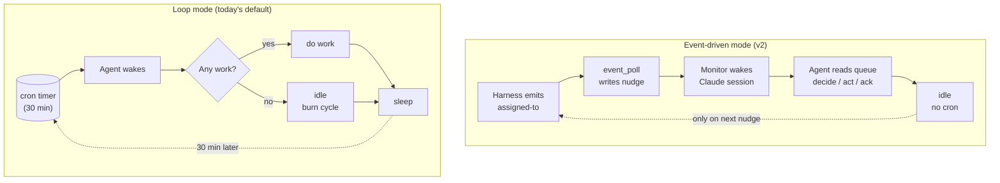

### 2.3 Inline mode (human override)

The two modes above describe autonomous wakeups. A third interaction pattern, **inline mode**, fires when a human sends a direct message into the agent's Claude Code session — bypassing both wake mechanisms entirely. Inline mode is not a third triggering mode in the §2 sense: the cycle wrapper does NOT fire on an inline turn. There is no scheduler involvement.

Concrete consequences for an inline turn:

- `cycle_pre.py` does not run; `cycle-input.json` is not written for the turn.
- `cycle_post.py` does not run; the iteration log is not appended; `working-state.md` is not mechanically updated; the status-bar `current-state` file is not touched.
- Reactions to the human's request — tracker comments, transitions, PR work — still flow through the forge via `tracker.py`. Durability of side-effects is unchanged.

**Monitoring impact.** PM's pipeline sentinel must treat absence of `cycle-input.json` updates, stale `current-state` writes, and unchanged `working-state.md` during inline-mode periods as **expected** rather than as stall signals (#9358).

**Override discipline.** Human instructions delivered inline take precedence over autonomous cycle work. They do NOT override safety gates: instructions that would cross a role boundary, violate a vault-recorded prohibition, or require destructive / hard-to-reverse action without confirmation must still be flagged before action.

**Resuming autonomous mode after an inline session.** In **loop mode**, re-invoke `/loop` per the recovery directive in `references/sub-skills/common/boot-bootstrap.md` (POLLING block). In **event mode**, no action is required: the Monitor tool is invoked with `persistent: true` (per `references/sub-skills/common-events/event-mode-contract.md`) so it stays active across inline turns — the next nudge after the inline interaction wakes the agent automatically. **Do not re-invoke Monitor manually** — `event-mode-contract.md` explicitly forbids it (a Monitor exit is the signal that the harness owns recovery). The session's wake mode itself does NOT change — it stays whichever was selected at boot (§8.3 establishes mode-stickiness for the session).

---

## 3. The agent process tree (shared)

Both modes use the same `cmd → thin_launcher → claude` per-agent subprocess tree. **Event mode additionally pairs each agent with an `event_poll` process** for the nudge contract — `event_poll` is a **direct child of the harness**, NOT inside the agent's subprocess tree (see §3.2 diagram). Its stdout is piped to the agent's Monitor stdin so nudges wake the Claude session. Loop mode does not pair the agent with an `event_poll`; the harness does not spawn one and the harness-API edges from `event_poll` in §3.2 do not exist for that session. Differences inside the Claude session are otherwise mode-driven, not tree-driven.

### 3.1 System overview

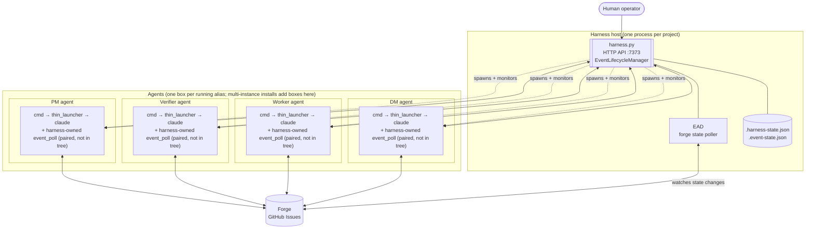

### 3.2 Per-agent subprocess tree (zoomed)

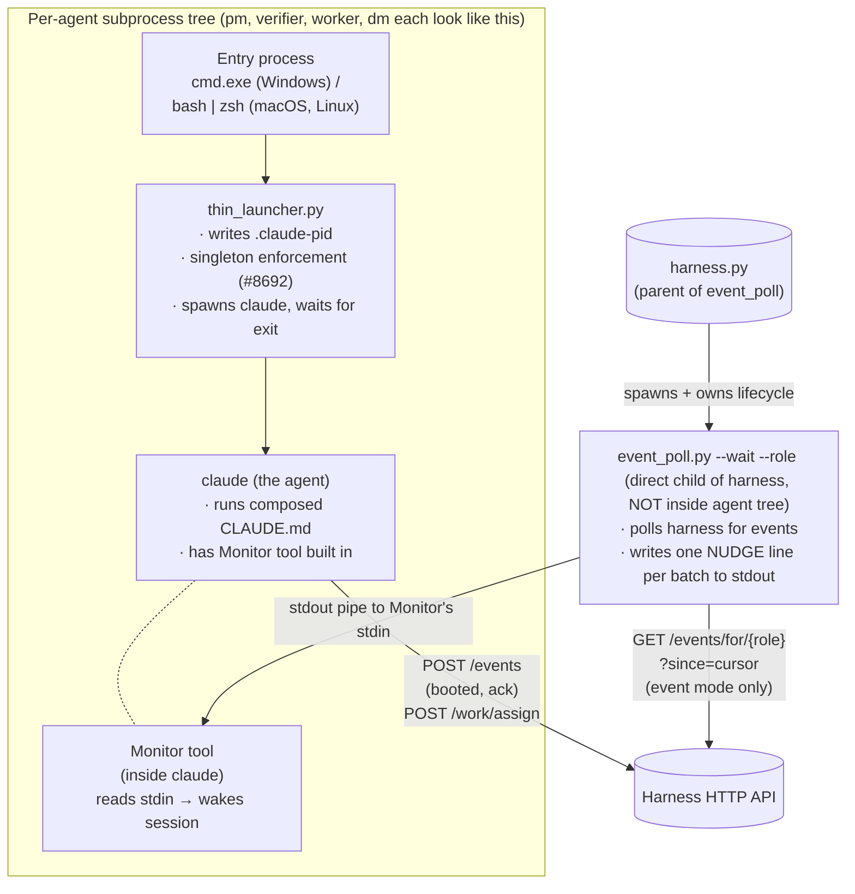

**OS variants** (tree shape is identical across platforms; only the entry-process differs):

| Platform | Entry process | Claude binary | Terminal window |
|---|---|---|---|
| Windows | `cmd.exe` | `claude.exe` | new `cmd.exe` window (visible) |
| macOS | login shell (`bash` / `zsh`) | `claude` | new Terminal.app / iTerm tab via AppleScript (see `boot_remote.py`) |
| Linux | login shell (`bash` / `zsh`) | `claude` | new terminal-emulator window (gnome-terminal / xterm / wezterm, per install) |

`thin_launcher` (Python) and `event_poll.py` (Python) are cross-platform — they run identically on all three OSes. Singleton enforcement via `.claude-pid` and the Monitor stdin contract behave the same regardless of host OS.

> **Future-state note**: the process tree described in this section is current. [`HARNESS-ARCH.md §14`](HARNESS-ARCH.md) documents a proposed simplification that deletes `thin_launcher.py` entirely and has `wt.exe` invoke `claude.exe` directly. That section is **proposal**, not implemented; if it ever lands, this §3.2 ships an updated tree in the same change.

**The composed `CLAUDE.md`** that `claude` reads at boot is the agent's full instruction artifact — produced by `compose.py` from L1 (base) + L2 (role class) + L3 (domain) + L4 (install overrides) + per-agent `SOUL.md`, selected per the agent's alias from `.squidsquad/config.md`. AGENT-RUNTIME is intentionally silent on the format itself — see [`COMPOSE-ARCHITECTURE.md`](COMPOSE-ARCHITECTURE.md) for the layering model, slot order, frontmatter spec, and how the L1-L4 + SOUL.md inputs become one composed file. **Compose is the agent compiler**; every runtime behavior described in this doc is downstream of what compose produced.

`thin_launcher` and `event_poll` are intentionally separate processes (decided 2026-05-22):

- Monitor needs a long-lived stdin source — `event_poll`'s exact job.
- `thin_launcher` exits when Claude exits — wrong shape for Monitor's contract.
- Failure isolation: an `event_poll` crash doesn't take Claude down.
- Restart semantics: harness can restart `thin_launcher` to respawn Claude without losing polling state. This applies to the `cmd → thin_launcher → claude` chain — `event_poll` is a separate harness-owned child (per §7.0) and is NOT auto-respawned independently; if `event_poll` dies, agent restart is the recovery path.

Conceptually they form "the agent's launcher subprocess tree." Implementation-wise they're two processes.

### 3.3 The `.claude-pid` convention

`thin_launcher` writes its own `cmd.exe` PID (not `claude.exe`'s PID) into `.squidsquad/<alias>/.claude-pid` at boot. This is the singleton handle the harness watches. See [`ARCHITECTURE.md`](ARCHITECTURE.md) for the "three claude.exe populations" and orphan-reaping rules.

In loop mode, `event_poll` is not spawned — only `cmd → thin_launcher → claude` runs.

---

## 4. The event bus (shared infrastructure)

The event bus is the harness HTTP API at port `7373` (default). Both modes use it:

- **In an event-mode session** (harness was reachable at boot): load-bearing. The bus is how the harness wakes the agent. Mid-session bus failures degrade individual cycles to tracker reads (§4.5) without flipping the wake mechanism. If the harness goes down for an extended period, the agent stays in event-mode wake (no nudges arrive; idle indefinitely) — recovery is automatic when the next nudge arrives, no operator action needed.
- **In a loop-mode-fallback session** (harness was unreachable at boot): emit-only observability layer. The agent may publish transient events for diagnostics, but it does NOT consume from the bus and does NOT maintain a cursor for the session. Pre-cycle mechanical reactions (e.g., PR merge → status transition) derive from tracker state changes since last cycle (§6.3). When the harness later comes back up, the *current* session stays in loop-mode wake; the next session restart picks event mode automatically.

### 4.1 Architectural commitments (locked principles)

From `decision-event-bus-architecture-redesign` vault note (locked cycles 1541–1542); Principles 1 and 4 refined by #11328 D1/D4 as noted inline:

1. **Harness is a transport bus, not an orchestrator.** It moves signals between producers and consumers. It does NOT track *forge-level* work state — status labels, ticket state, workflow status all live on the forge. (Per #11328 D1, the harness DOES own the per-alias **event-tending cursor** in `.event-state.json` — the cursor is the work-completed indicator at event-delivery granularity, not forge-level workflow tracking. See §4.3.)
2. **Forge (GitHub Issues) is the source of truth for work state.** Status labels, comments, PR merges = the project's institutional state. Harness has no opinion on whether work is done.
3. **Agent owns work completion.** The agent acts on signals; what it does with them is between the agent and the forge.
4. **Ack-cursor is event-tending confirmation; ack-stop is lifecycle confirmation.** Per #11328 D4, these are operationally separate state machines (see §4.2). `ack-cursor` fires after the agent has finished processing an event (cared or skipped) — i.e., it carries *event-completion* semantics; the cursor advance IS the completion signal. `ack-stop` is lifecycle progress on a stop intent (delivery of the stop accepted + checkpoint result). The pre-D1 framing of "ack = receipt confirmation, NOT completion confirmation" still applies to the lifecycle ack; for `ack-cursor` specifically, D1 supersedes — finishing the event IS the cursor commit.
5. **No `POST /events/{id}/complete` endpoint.** Reject any design that adds endpoints for completion state. The bus uses events, not RPC, for state transitions.

### 4.2 Signal catalog

In v2 the catalog collapses to **3 signal concepts / 4 catalog entries**:

| Signal | Direction | When | Payload |
|---|---|---|---|
| **`booted`** | agent → harness | First action after the agent's Claude session boots | `{role, pid, clone_path, version}` |
| **`assigned-to`** | harness → agent (queue entry) | Harness detects work exists for the named agent | `{issue_number, target_alias, event_context, payload}` (EAD populates `payload.title` from the forge issue; `/work/assign` callers may pass it through the `payload` object) |
| **`ack-cursor`** | agent → harness | Agent has finished processing this event (cared or skipped); cursor advances | `{event_id, role}` |
| **`ack-stop`** | agent → harness | Agent has accepted a stop intent and is checkpointing | `{event_id, result}` where `result` is one of `'checkpointed'` (working-state.md flushed; safe to SIGTERM), `'aborted'` (graceful stop failed; harness should escalate), `'drained'` (no in-flight work; exiting clean) |

`ack-cursor` and `ack-stop` are **operationally separate state machines** — delivery vs lifecycle — that share the `ack-` naming. `ack-cursor` advances the delivery cursor per event; `ack-stop` signals lifecycle progress on a stop intent. They were shipped together in `#9873-A` but should be reasoned about as distinct concerns. Three signal concepts, four catalog entries.

> **Naming note**: The `role` field in `booted` / `ack-cursor` payloads is the agent's **alias** value, preserved under the field-name `role` for code-compat with the wire format. Same pattern as `{role}` in HTTP path parameters (see §4.3). Field rename to `alias` is in the same family as #10358. `ack-stop.result` enum values are tracked as §9 Q11.

#### Signal-flow at a glance

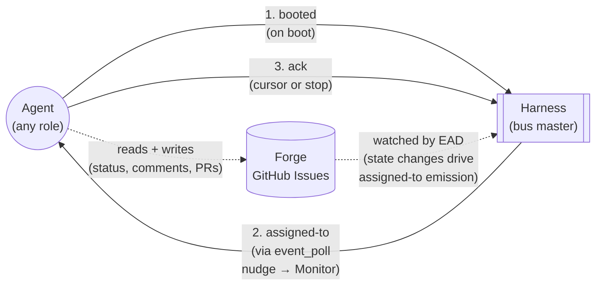

#### What is OUT of the v2 catalog

Removed under v2 (collectively 20 catalog entries):

- **Lifecycle ticks**: `cycle-start`, `cycle-end` — local to the agent, no other agent cares.
- **Git activity**: `git-pull`, `git-push`, `git-commit`, `branch-checkout` — local side effects, recorded in git itself.
- **PR activity**: `pr-create`, `pr-merge`, `pr-merged` — recorded in forge; if relevant to another alias, harness translates to `assigned-to`.
- **Tracker activity**: `status-transition`, `tracker-comment` — recorded in forge as source of truth; if relevant to another alias, harness translates to `assigned-to`.
- **Harness internal**: `compose-completed`, `agent-health` — harness sees these in its own state; if action needed, harness emits `assigned-to`.
- **Speculative RECOGNIZED entries**: `verification-passed`, `verification-failed`, `phase-change`, `request-merge`, `stop-requested`, `shipped`, `version-bump` — never emitted under v1, dead weight.

> **Loop-mode reality check**: today's loop-mode codebase still emits and reacts to most of the above. The catalog trim is part of the v2 migration (see §8); under loop mode they remain available as observability events.

### 4.3 Harness internals

> **Note**: full harness architecture (process model, HTTP API surface, state files, restart safety, failure modes) is now in [`HARNESS-ARCH.md`](HARNESS-ARCH.md). This subsection covers what an agent author needs to know about the harness's bus + lifecycle interfaces. For internals, follow the cross-references inline.

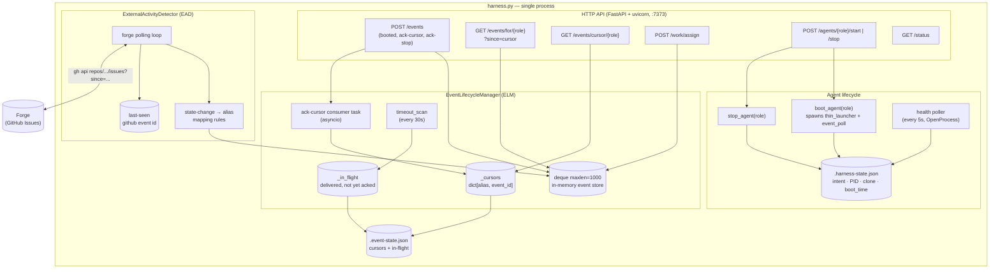

#### Vocabulary note — `{role}` in HTTP paths is actually `{alias}`

The endpoints throughout this section use `{role}` in path parameters (e.g., `GET /events/for/{role}`, `GET /events/cursor/{role}`, `GET /agents/{role}`). **The value passed is always the agent's alias** (e.g., `skill`, `verifier`, `human`, `frontend-1`), not the L2 categorical class (`pm`/`verifier`/`worker`/`dm`). The path-parameter *name* (`{role}`) is the legacy form preserved for code-compat — see #10358 for the rename to `{alias}`. Throughout this doc we write `{alias}` to surface the actual semantics; the code on `main` still uses `{role}` as the URL token. The path-parameter name `{role}` predates the alias concept and is misleading; see [HARNESS-ARCH.md §9](HARNESS-ARCH.md#9-vocabulary-notes) for the canonical statement. A rename to `{alias}` is in the same family as #10358 (`role` → `alias` identifier rename) but is out of scope on that task to limit blast radius. Implementers should treat `{role}` as a synonym for `{alias}` until the rename lands.

#### Event store (deque)

- `collections.deque(maxlen=1000)` — in-memory, capped at 1000 events.
- Harness restart drops history. At-least-once across restarts requires persistence (separate work, out of scope for v2).
- Eviction: when a new event pushes past 1000, the oldest is dropped. Agents whose cursor was at that evicted event get a `HTTP 410 Gone` response from `GET /events/for/{role}?since=<old_cursor>` with body `{"cursor_evicted": true, "current_head": "<event_id>"}`. Recovery: agent reads forge for current state, emits `ack-cursor(current_head)`, re-enters idle.

#### Cursor model

The cursor IS the canonical work-completed indicator. Single source of truth for "events this alias has tended." It advances only after the agent has finished processing an event — whether the event was acted on (cared) or skipped via the care filter (§7.4). Either way, finishing the event IS the cursor commit; there is no separate "I received this" signal. The §4.2 catalog row for `ack-cursor` reflects this directly: the ack fires *after* processing, not on delivery.

**Mechanics**:

- Per-alias, owned by harness. Persisted in `.squidsquad/.event-state.json`. Agents observe the cursor only through the harness API; they never write it directly.
- `null` at first boot → agent reads from the head of the deque.
- Advances via `ack-cursor` consumed by the ack consumer task — one ack per tended event (see §7.1 for the canonical agent loop).
- Cursor-regression attempts rejected (CONTEXT-9873-A D15).
- `GET /events/cursor/{role}` returns `{cursor: <event_id> | null, role}`, HTTP 200 always.

**Event IDs**: `sha256(timestamp + alias + event_type + payload + nonce)[:16]` — 16-char hex (64-bit, per #9415). Content hash with per-emit nonce; same event emitted twice produces distinct IDs.

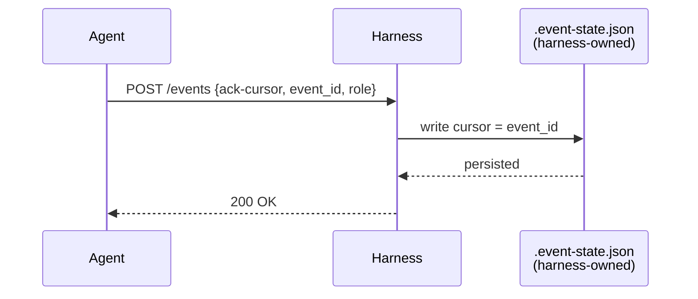

The diagram shows the cursor-advance mechanism only — see §7.1 for how the agent's loop calls it (AC1.2 of #11328 rewrites §7.1 to the canonical per-event eager-loop form). `working-state.md` carries the agent's current-work checkpoint only (see §5); it does not store event-delivery state.

At-least-once delivery: cursor advances only after a successful ack. Crashed agents re-process the same events on restart — the cursor sits at the last successfully-acked event, so any events past it (including the in-flight event at crash time) re-deliver on the next §7.1 loop iteration's GET.

#### Role-based filtering

Under v2 the filter collapses to a single rule: **every role-class reacts only to `assigned-to`**. Specificity moves to `event_context` and the alias-match care filter (§7.4). There is no per-role-class event-type allowlist in the v2 catalog because the v2 catalog itself collapses to 3 signal concepts (§4.2) — multi-type filtering is moot once the catalog has one routing signal.

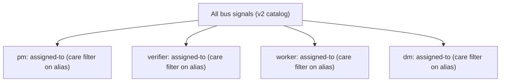

> **v1 loop-mode legacy**. Today's loop-mode codebase still has a per-role-class event-type allowlist (client-side filter in `cycle_pre.py` via `_ROLE_EVENT_TYPES` dict; role-classes not in the dict receive all events). That filter exists because loop mode still emits the broader v1 catalog (lifecycle ticks, git/PR/tracker activity, etc. — see §4.2 "What is OUT of the v2 catalog"). The filter is retired as the v2 catalog migration completes (see §8); the diagram above is the v2 target.

### 4.4 ExternalActivityDetector (EAD)

EAD is the bridge from forge → bus. It runs inside the harness on a polling loop:

1. Polls GitHub via REST API (`gh api repos/<owner>/<repo>/issues?since=<last_seen_iso>&state=all&per_page=100`).
2. Diffs against last-seen timestamp on disk.
3. For each changed issue, maps to a target alias + `event_context` per a rule table:

   | Forge change | Target alias | `event_context` |
   |---|---|---|
   | `status:*` label change | alias derived from new state per §7.3 routing table | matches §7.3 routing-table value for the transition |
   | New comment authored by a human (not an agent) | `pm` | `"human-comment"` |
   | PR state change (opened / merged / closed) | matches §7.3 routing-table value for the new linked-issue state | matches §7.3 |

   **Out of scope**: EAD does NOT auto-route brand-new issues created with no `status:*` label and no `role:*` label (e.g., a human filing an issue directly via the GitHub UI without applying SquidSquad labels). These issues sit in the forge untouched until a human acts on them — commenting fires the `human-comment` → PM rule, or applying a status label fires the status-change rule. PM is then responsible for labeling and initial transition. Design choice: agents don't speculate on un-labeled issues; humans hand off explicitly.
4. Emits one `assigned-to` per (forge change, target_alias) pair into the deque (with the harness's `role:*` label write per §7.3).
5. Records the new last-seen timestamp so it doesn't re-emit on restart.

EAD is the only emitter of `assigned-to` from forge state. Agents trigger `assigned-to` indirectly via `POST /work/assign` (typically called by `tracker.py`; see §7.3).

**Why REST, not Search API** (locked):
- Search API has a 5–30s indexing lag built in; EAD-driven latency would inherit that floor on every event.
- REST API is real-time (event appears in the response as soon as forge processes the write).
- REST quota is 5000 req/hr; Search is 30 req/min. REST gives more headroom for adaptive polling.

**Polling cadence — adaptive backoff** (locked):

```
default state: active (10s between polls)

  last_poll_found_activity? → stay at 10s
  3 consecutive empty polls at 10s? → step up to 30s
  3 more consecutive empty polls at 30s? → step up to 60s (ceiling)
  activity returns after any backoff? → reset to 10s
  hard floor: 5s   (rate-limit safety; never poll faster)
  hard ceiling: 60s (safety-net usefulness degrades beyond this)
```

Two-tier backoff: 10s → 30s → 60s. A quiet period stabilizes at 60s after ≥6 consecutive empty polls (≈2 minutes of inactivity).

**Latency floors:**

| Path | Worst case | Typical |
|---|---|---|
| `tracker.py` happy path (primary) | sub-second | sub-second |
| EAD safety net, quiet period | 60s | 30s |
| EAD safety net, active period | 10s | 5–10s |

**Forge API budget** (under the cadence rule above; quota = 5000 req/hr):

| State | Polls/hr | Calls/hr (incl. 1–3 follow-ups per change) | % of quota |
|---|---|---|---|
| Steady-state quiet (60s ceiling) | ~60 | ~60 | 1% |
| Steady-state active | ~360 | ~360–720 | 7–14% |
| Worst-case burst (10 changes/poll, sustained) | ~360 | ~3600 | 72% |

Per-install cadence overrides via `.squidsquad/config.md` (`EAD Cadence Active`, `EAD Cadence Quiet`) are NOT v1 scope — defaults are hardcoded. Add as config fields only if a real install hits a quota issue.

**Recovery & restart semantics:**

- **Lost last-seen-id**: on missing/corrupt last-seen file, EAD defaults to `now - 5 minutes`. Bounded dup-emit window; agents dedup via care-filter on `(issue_number, target_alias, event_context)` tuple.
- **Harness restart catch-up**: on harness boot, EAD does a 30-minute scan against forge and re-emits `assigned-to` for anything missed during downtime. Beyond 30 min, agents recover from forge on first read (cursor-evicted path above).
- **Orphan in-flight cleanup**: `timeout_scan` (every 30s, per #9873-E) sweeps in-flight entries whose `event_id` is past deque eviction. Passive; no agent involvement.

**Persistence**: `event_lifecycle.load()` / `save_state()` calls are wrapped in `asyncio.to_thread` (CONTEXT-9873-A D4 / H6 mitigation) — disk I/O never blocks the event loop.

### 4.5 Mechanical reactions vs creative decisions

Some state-change patterns are predictable enough to handle deterministically in pre-cycle, without consuming the agent's creative time. **The data source differs by mode** (per §2 mutual-exclusivity):

- **Event mode** — reactions are derived from `recent_events` consumed from the event bus.
- **Loop mode** — reactions are derived from tracker state changes since last cycle (deduplicated by timestamp, not by event cursor). Loop mode does not consume from the bus.

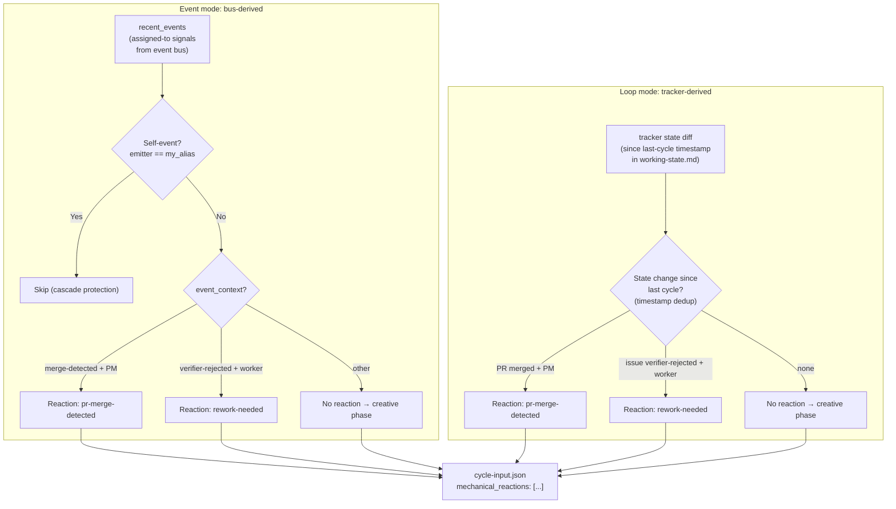

> **v2 catalog alignment**. Event mode branches on `event_context` within `assigned-to` (per §4.2's collapsed catalog) — never on event type, because v1 types like `pr-merged` and `verification-failed` no longer exist as top-level signals. Loop mode still polls forge state directly (no bus consumption per §2 mutual-exclusivity); its branches are state-transition shapes, not v1 event types.

Today only two patterns qualify in either mode:

1. **PR merge detected** (PM) — surfaces merge context.
2. **Rework needed** (worker) — surfaces the verifier's rejection reason.

Everything else lands in `recent_events` (event mode) or is left for the creative phase to detect via tracker reads (loop mode).

### 4.6 Cascade protection

Two mechanisms prevent infinite reaction loops. Mechanism 2 differs by mode (per §2):

1. **Self-event filter** (both modes): `if event.get("role") == role: continue`. An agent's own emissions never trigger its own mechanical reactions. In loop mode the equivalent is a tracker-state filter — an agent doesn't react to its own most-recent transition on an issue.
2. **Dedup mechanism**:
   - **Event mode**: cursor deduplication. Events before the cursor are never re-read.
   - **Loop mode**: timestamp deduplication. Tracker state changes since last cycle's timestamp are considered; older changes are skipped. No cursor.

Chains terminate by construction: A emits/transitions → B reacts → B emits/transitions → A sees next cycle (but won't re-fire because either the cursor has moved or the original state change is now older than last cycle's timestamp).

### 4.7 Port discovery (clone isolation)

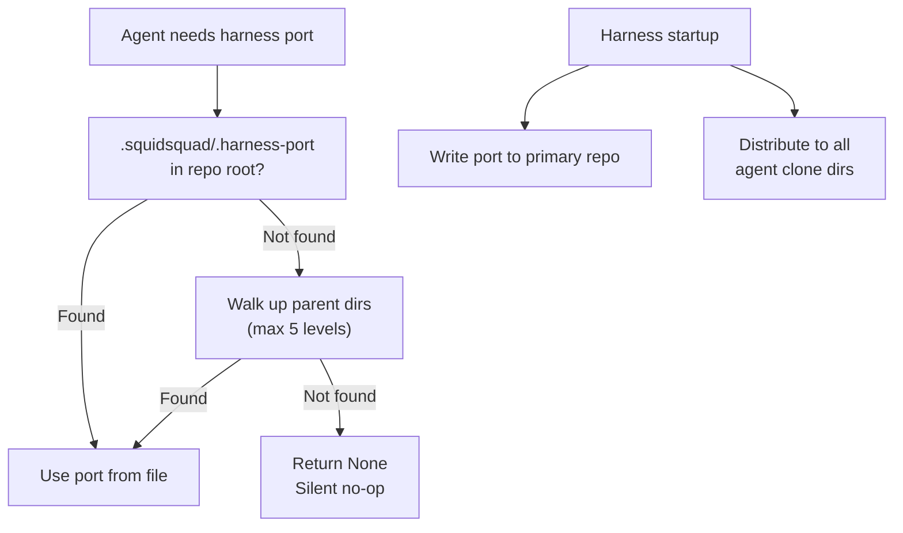

Each agent typically runs in its own git clone. The harness writes its port to `.squidsquad/.harness-port` at startup; agents discover it by checking the file and walking up to 5 parent directories. When the file is missing (harness not running), all event operations silently no-op.

### 4.8 Design properties summary

| Property | Implementation |
|---|---|
| **Non-blocking** | 500ms timeout on all HTTP calls; exceptions silently swallowed |
| **Observational (loop) / load-bearing (event)** | Same wire; different agent dependency on it |
| **No persistence** (deque) | In-memory; harness restart clears history |
| **Self-isolation** | Agents don't react to their own events |
| **At-least-once** | Cursor advances only after successful ack |
| **Role authority** | Bus has no permissions knowledge; `tracker.py` enforces transitions; harness enforces `/work/assign` via L2 bus contract (§7.3) |
| **Graceful degradation** | Harness unreachable in loop mode = empty events, zero behavior change to git-coordination layer. Harness unreachable in event mode = agent idles until recovery; loop mode is the manual operator fall-back (§8.2 / §8.4) |

---

## 5. State persistence map

| What | Where | Owner | Why |
|---|---|---|---|
| Per-alias cursor | `.squidsquad/.event-state.json` | harness | Harness owns delivery state |
| In-flight events | `.squidsquad/.event-state.json` | harness | Re-delivery on timeout (#9873-E) |
| Agent intent + PID | `.squidsquad/.harness-state.json` | harness | Harness owns agent lifecycle |
| Agent singleton PID | `.squidsquad/<alias>/.claude-pid` | agent (thin_launcher) | Singleton enforcement (#8692) + harness health-poller's process-liveness check (see §3.3) |
| Agent current-work state | `.squidsquad/<alias>/working-state.md` | agent | Resume-from-crash checkpoint for the agent's OWN current work. Does NOT carry an event queue (harness deque + cursor own that) AND does NOT carry a nudge flag (per §7.5 — nudge memory lives only in conversation context). It DOES carry an agent-private `last_cycle_timestamp` field used for tracker-state deduplication within the agent's own logic (see §6.3). This is cycle-tracking metadata, not event-delivery state — the harness does not read this file; the agent writes and reads it itself. The cursor-vs-timestamp distinction: cursor is harness-owned for event-delivery dedup; timestamp is agent-owned for tracker-state-change dedup. |
| Improvement subloop throttle | `.squidsquad/<alias>/.subloop-last-run` | agent | Last-fire timestamp; gates next eligibility (§7.6) |
| Last-seen forge event | EAD-internal persistence | harness | Don't re-emit assigned-to on restart |
| Work state | GitHub Issues (forge) | forge | Source of truth for status, comments, PRs |
| Decisions / institutional memory | `.squidsquad/vault/` | shared | Long-lived rationale — see [`VAULT-ARCH.md`](VAULT-ARCH.md) for architecture (PARAG model, sub-skills, scripts, cycle integration) |

**Invariant**: agents do not write to harness-owned files. Harness does not write to agent-owned files.

---

## 6. Loop mode in detail

### 6.1 The Ralph Loop cycle

A cycle has three phases (vault touchpoints inlined; see §6.6 + VAULT-ARCH §7 for execution-lane detail):

```
Boot (session start, once):
  · read .squidsquad/vault/BRIEFING.md   [vault-protocol, inline]
                       ↓
┌─── Phase 1: Pre-cycle (mechanical) ──────────────┐
│ cycle_pre.py <role>                              │
│ · git pull (with stash/pop)                      │
│ · read working-state.md                          │
│ · query work queue (tracker)                     │
│ · derive mechanical reactions from tracker       │
│   state changes since last cycle (§6.3)          │
│ · build .squidsquad/<alias>/cycle-input.json     │
└──────────────────────────────────────────────────┘
                       ↓
┌─── Phase 2: Creative work (agent) ───────────────┐
│ Read cycle-input.json                            │
│ Investigate / decide / act                       │
│   ↳ vault-protocol reads inline as needed        │
│   ↳ vault-protocol writes inline (vault-create / │
│       vault-update + vault-check Level 1)        │
│ End-of-Phase-2 reflection (if not a quiet cycle):│
│   ↳ vault-remember → subagent (`sonnet`)         │
│       returns write decisions → applied inline   │
│ Quiet-cycle additions:                           │
│   ↳ vault-optimize inline (gated: 20+ notes)     │
│   ↳ every 5th quiet (PM): vault-synthesis        │
│       → subagent (`sonnet`) returns ≤1 posture   │
│ Write cycle-output.json                          │
│ (free use of git, bash, subagents for the work)  │
└──────────────────────────────────────────────────┘
                       ↓
┌─── Phase 3: Post-cycle (mechanical) ─────────────┐
│ cycle_post.py <role>                             │
│ · apply status transitions                       │
│ · post tracker comments                          │
│ · write iteration log                            │
│ · git commit + push (incl. vault note writes)    │
│ · update working-state.md (incl. last-cycle      │
│   timestamp for tracker-state dedup)             │
│ · status-bar cleanup                             │
│ · context-pressure check → exit 42 if exceeded   │
└──────────────────────────────────────────────────┘
```

The agent only writes the creative phase. Mechanical phases are deterministic scripts. Vault sub-skills split between inline execution (`vault-protocol`, `vault-optimize`) and background-subagent execution (`vault-remember`, `vault-synthesis`) — see §6.6.

### 6.2 What wakes the agent in loop mode

`thin_launcher` runs `claude` with `/loop 30m execute one Ralph Loop cycle` as the initial command. The `/loop` slash command schedules a recurring cron entry; when it fires, the agent runs one cycle and waits for the next fire.

The 30-minute interval is read from `.squidsquad/config.md`'s `Iteration Interval > Minutes` field at compose time and inlined into the composed CLAUDE.md's boot section (alongside the loop-mode procedural fragment — see §8.1). Recovery from an interrupted `/loop` re-invokes the same literal command.

### 6.3 Loop-mode mechanical reactions

The pre-cycle script applies the high-confidence reactions from §4.5 before the agent's creative phase runs. Reactions land as `mechanical_reactions` in `cycle-input.json` so the agent can see what was done.

In loop mode, reactions are **derived from tracker state**, not from the event bus (per §2 mutual exclusivity). Dedup is by the last-cycle timestamp persisted in `.squidsquad/<alias>/working-state.md`; state changes older than that are ignored.

**`last_cycle_timestamp` format**: ISO 8601 UTC with seconds precision (e.g. `2026-05-30T17:42:00Z`). Written at the end of `cycle_post.py` (after all post-cycle commits land) into `working-state.md`'s YAML frontmatter as `last_cycle_timestamp: <ISO-8601-UTC>`. The next cycle's `cycle_pre.py` reads this value and uses it as the lower bound for tracker-state dedup; transitions with an `updated_at` timestamp strictly older than `last_cycle_timestamp` are skipped.

Today's reactions:
- `pr-merge-detected` (PM): `gh pr list` finds PRs that newly transitioned to merged since last cycle's timestamp; for each, look up the linked issue and verify its status.
- `rework-needed` (worker): `gh issue list` finds tasks newly transitioned to `status:in-progress` by the verifier (rework signal) since last cycle's timestamp; for each, prioritize the named issue.

Both are idempotent against already-handled issues (e.g., transitioning a closed issue is a no-op). Loop mode does NOT issue `GET /events/for/<role>` and does NOT maintain an event cursor — those are exclusively event-mode mechanisms (see §7).

### 6.4 Improvement subloop (loop mode)

In loop mode, when a cycle finds no work in the queue (no pending-test, no pending-ship, no nudges to process, no human input), the cycle is **quiet**. Quiet cycles run an improvement scan as their creative phase — the same activity event mode triggers via §7.6's drained-queue path. The trigger is "the cycle wrapper fired and found nothing else to do," not a separate timer; throttling, ownership per role-class, and output routing all match §7.6.

See §7.6 for the substantive scan rules; this section's purpose is to anchor that those rules are not event-mode-exclusive.

### 6.5 Context-pressure exit-42 and respawn

When the cycle's context usage exceeds the configured threshold (default 70%), the agent checkpoints `.squidsquad/<alias>/working-state.md`, commits and pushes, and `cycle_post.py` exits with code 42. What respawns the agent depends on whether the harness is up:

- **With harness running** (#4966): the harness watches the agent's `.claude-pid`, sees the non-zero exit, and re-runs the boot flow (which in loop mode immediately re-schedules `/loop`).
- **Harness-less loop mode**: `thin_launcher` is the parent process and exits when `claude.exe` exits — there is no automatic respawn. The agent stops after exit-42 until an operator restarts it. Context pressure is therefore a soft terminal state in harness-less mode; operators are expected to use a process supervisor (systemd, launchd, NSSM) or to restart agents periodically.

This is loop mode's primary form of session lifecycle — agents don't shut down cleanly between cycles; they respawn (with harness) or stop (without) on context pressure.

### 6.6 Vault touchpoints within Phase 2

Vault sub-skills participate in the creative phase at four touchpoints. They split into two execution lanes by weight — anything that requires meaningful reasoning over vault content runs out of process to keep the consuming agent's context lean:

| Touchpoint | Sub-skill | Lane | When |
|---|---|---|---|
| Continuous reads/writes during work | `vault-protocol` | **inline** | Throughout Phase 2; the agent IS doing the read/write the protocol governs |
| End-of-Phase-2 reflection | `vault-remember` | **background subagent** (`sonnet`) *— target lane; see §6.6 Implementation gap* | Step 4b, gated by the non-quiet-cycle check only (always-on; no feature toggle). Default write budget 2/cycle (configurable via `.squidsquad/config.md` `Vault Remember > Writes Per Cycle`; surplus deferred by priority decisions > learnings > patterns — see [VAULT-ARCH §7.2](VAULT-ARCH.md#72-vault-remember) for full reflection rules). Returns `{action, path, type, body, reason}` per candidate; consuming agent applies the write list deterministically |
| Quiet-cycle housekeeping | `vault-optimize` | **inline** | Quiet cycle, after improvement-scan check (skips if the scan would fire this cycle); gated by 20+ note count. Wrapper around `vault_optimize.py run` — no reasoning to offload |
| Every-5-quiet cross-agent synthesis | `vault-synthesis` | **background subagent** (`sonnet`) *— target lane; see §6.6 Implementation gap* | PM only; fires after 5 consecutive quiet cycles **and** vault has 10+ galaxy notes. Counter resets on real work or completed synthesis. Returns ≤1 posture descriptor; consuming agent writes it via `vault-create` + files the pending-review task |

A fifth touchpoint sits **outside** the per-cycle phases: at boot (session start, once per session), every agent reads `.squidsquad/vault/BRIEFING.md` for active context. That's part of `vault-protocol` and is always inline. The **BRIEFING.md staleness check** runs *every* cycle including quiet cycles (always-on; not subject to the quiet-cycle gate; doesn't consume the write budget) — see [VAULT-ARCH §5](VAULT-ARCH.md#5-briefingmd) + §7.2 for the staleness rules.

The model pin for subagent-lane sub-skills is the **`sonnet`** tier — see [`VAULT-ARCH.md`](VAULT-ARCH.md) §7 Execution model and `[[decision-vault-subagent-model-sonnet]]` for rationale. The pin is by tier, not by dated version.

**Implementation gap** (today): the subagent lane is the architectural target, not the current behavior. Both `vault-remember` and `vault-synthesis` currently compose into the consuming agent's CLAUDE.md inline; closing the gap requires splitting each sub-skill source into a stub (composed into agent) plus a prompt (loaded by the subagent). Tracked as VAULT-ARCH §11.5 + #10180.

For the full vault architecture (storage model, frontmatter spec, scripts, cycle integration detail beyond what this sub-section captures), see [`VAULT-ARCH.md`](VAULT-ARCH.md) — §7 for sub-skills, §9 for cycle integration, §11 for known gaps.

### 6.7 Subagent invocation rules

Agents may delegate work to subagents via the Agent tool. This subsection describes the **runtime rules** for spawning, model selection, prompt hygiene, and result handling. The L1-L3 source authoring of these rules (which slot, which ordinal) is documented in [`COMPOSE-ARCHITECTURE.md`](COMPOSE-ARCHITECTURE.md) §3.2 — the rules compose into each agent's CLAUDE.md via the regular `(slot, ordinal)` mechanism.

**Default model selection** (L1 baseline, applies to all roles):

- Use the lightest model that can do the job. Sonnet 4.6 is the default for mechanical or scoped subtasks (file searches, summarization, lint passes, narrow research).
- Reserve Opus 4.7 for complex reasoning, multi-step planning, architectural review, or work that requires holding many constraints simultaneously.
- The parent agent's own model is independent of subagent model choice.

**Per-role-class overrides** (L3 content authored alongside the role-class's other L3 sub-skills; takes effect by appearing later in compose's `(slot, ordinal)` order than the L1 default):

- `worker` (and variants like `skill`): subagent spawns default to Sonnet — the heavy thinking is in the parent. (Authority: memory rule `feedback_skill_sonnet_subagents`.)
- `dm`: subagent spawns default to Sonnet — `dm`'s work is mostly mechanical packaging. (Authority: memory rule `feedback_dm_sonnet_subagents`.)
- `pm`, `verifier`: use the L1 default — pick per task.

**When to spawn vs inline**:

- **Spawn** when the work is genuinely parallelizable (multiple independent investigations) OR when the output volume would blow the parent's context window (large grep/scan results).
- **Inline** for small lookups (known file path, single grep), narrow questions, anything the parent already has context for.

**Prompt hygiene**:

- Subagent prompts must be self-contained. The subagent doesn't see the parent's conversation; brief it like a smart colleague who just walked in.
- Include exact file paths, line numbers, and what specifically to change/check. Don't write "based on your findings, fix the bug" — that delegates the synthesis the parent should already have done.
- Ask for a length cap when one is appropriate ("report in under 200 words") — keeps the subagent's response from re-bloating the parent's context.

**Trust but verify**:

- A subagent's summary describes what it *intended* to do, not necessarily what it did.
- When a subagent writes or edits code, the parent verifies the actual diff before reporting the work as done.

**Parallelism**:

- Independent subagent calls go in a single tool-use batch (one message, multiple Agent calls) so they run concurrently.
- Sequential dependencies are sequential — don't parallelize when output of A feeds B.

---

## 7. Event-driven mode in detail

**This chapter describes the wake-nudge mechanism, not a communication channel.** The single inter-agent communication channel in SquidSquad is the **forge** — the tracker (GitHub Issues/PRs and their comments). Every cross-agent message is written to forge: append-only, durable, role-tagged via `tracker.py`, queryable across cycles. Agents read forge state at the start of each cycle and act on what they observe. The forge-as-channel principle is canonical and lives at [`COMPOSE-ARCHITECTURE.md`](COMPOSE-ARCHITECTURE.md) §5.1.1 (with the full send-pattern sequence diagram); this chapter does not duplicate it.

Events carry **no semantic payload**. An event is a nudge that tells a target "something changed for you on the forge; consider waking now instead of at your next polling tick." If the target is mid-cycle, the nudge is ignored (no preemption); the target picks up the forge change on its next natural cycle. If the target is idle, the nudge wakes it early via its Monitor subscription. A lost or missed nudge is harmless — the next polling cycle still picks up the forge change.

Concretely, sending another agent a message follows the three-step pattern (canonical sequence in COMPOSE §5.1.1):

1. **Write to forge** — append a tracker comment via the `discussion` sub-skill.
2. **Route to target** — update issue state (assignee, labels) so the message lands in the target's normal pipeline queries.
3. **Nudge** — fire a nudge event with `target_alias=<alias>` so an idle target wakes early.

Event mode is the **exclusive home** for event-bus consumption and cursor logic (per §2 mutual exclusivity). Everything in this section — `event_poll` sidecar, nudge contract, per-event cycle wrapping, cursor advancement, cascade protection via cursor dedup — applies only when the install is in event mode. Loop mode does not touch any of this. Both modes use forge as the comm channel; they differ only in *how* the target finds out a forge change is pending for it (nudge vs. polling tick).

### 7.0 The `event_poll` sidecar

A harness-spawned `event_poll.py --wait --role <role>` process polls the harness on the agent's behalf and writes a literal `NUDGE\n` line to its stdout whenever new events arrive past the agent's cursor. That stdout is wired to the Monitor tool's stdin, waking the Claude session.

**`event_poll` is a direct child of the harness process**, not a sibling of `claude` under the agent's subprocess tree (see §3.3). The harness owns its full lifecycle — spawn at agent boot, kill on agent stop. There is no automatic respawn if `event_poll` itself dies mid-session; the agent restart is the recovery path. **There is no recovery path when the harness itself dies**: existing event_poll processes are orphaned (silently no-op once their HTTP target is gone), and full team reboot is required to restore event-mode operation (operator stops + restarts harness; then restarts each agent so its boot probe rebinds to event-mode wake).

The `--role` flag accepts the **alias** value (e.g., `--role frontend-1` not `--role worker`). The flag name is `--role` for code-compat with the wire format described in §4.3; rename to `--alias` ships with #10358. (The earlier `--target stdout` flag is retired — `event_poll` always writes to its own stdout; nothing else was ever supported.)

**Polling cadence** (locked, same adaptive pattern as EAD §4.4 but for the harness HTTP API, not the forge):

```
default state: active (5s between polls)

  last_poll_found_events? → stay at 5s
  3 consecutive empty polls at 5s? → step up to 30s
  3 more consecutive empty polls at 30s? → step up to 60s (ceiling)
  events return after any backoff? → reset to 5s
  hard floor: 2s   (avoid harness churn — safe at this rate because event_poll polls the LOCAL harness HTTP API, not an external service; contrast EAD's 5s floor which is GitHub REST rate-limit safety in §4.4)
  hard ceiling: 60s
```

Two-tier backoff: 5s → 30s → 60s. A drained queue stabilizes at 60s after ≥6 consecutive empty polls (≈1.75 minutes idle).

Nudge format is literal `NUDGE\n` with no payload — the agent always does `GET /events/for/{role}?since=cursor` to find out what's new. False positives (a `NUDGE` arriving when no relevant events exist) are harmless because the GET returns `[]`.

`event_poll`'s lifecycle is harness-owned: spawned at first `boot_agent(alias)` (paired with the agent via `--role <alias>`), terminated by the harness on agent stop. **`event_poll` lives across `claude` respawns** — when the harness respawns the agent's `claude` process (context-pressure exit-42 or intent=restarting; see HARNESS-ARCH §7.4), the paired `event_poll` is NOT killed and re-spawned; it keeps running and feeds the new `claude` via the same stdout pipe to Monitor. **There is no automatic respawn for `event_poll` itself** — if `event_poll` dies mid-session, the health poller logs the death but does NOT restart it; the recovery path is operator-triggered agent stop+start (which spawns a fresh `event_poll`). If the harness itself dies, `event_poll` is left orphaned (silently no-ops once the HTTP target is gone); full team reboot is required to restore event-mode operation. `event_poll` discovers the harness port via the same mechanism documented for agents in §4.7 — reads `.squidsquad/.harness-port` from its CWD, walking up to 5 parent directories if needed. The harness does not pass a `--port` argument; the discovery file is sufficient and the harness flushes the port file to disk before spawning `event_poll` (HARNESS-ARCH §7.2 step 4).

`event_poll`'s spawn ordering relative to the rest of the boot sequence is canonical in [HARNESS-ARCH.md §7.2](HARNESS-ARCH.md). In summary: `event_poll` is spawned by `harness.py` as a **direct child of the harness process** (NOT under the agent's `thin_launcher → claude` subprocess tree — see §3.2), begins polling immediately on spawn, and is unaffected by the `booted` handshake (which gates routed-work delivery, not `event_poll` activity).

**Initial-queue ordering invariant** (resolves the race between `event_poll` polls and the agent's boot sequence):

1. The harness returns **empty** `GET /events/for/{alias}` responses to `event_poll`'s polls **while `status=booting`** — regardless of whether events are queued for that alias. No nudges fire during this window.
2. Once the agent emits `booted` and the harness transitions `status: booting → ready`, the agent enters the §7.1 eager main loop per §7.2 step 4. The loop's first iteration GET (`GET /events/for/{alias}?since=null`) runs **inline in the agent's main thread** and the loop drains queued events synchronously, processing them per-event with per-event acks before reaching the empty-queue branch and idling.
3. From the moment step 4 returns, `event_poll`'s normal poll cycle (5s active / 30s idle, §7.0 cadence) handles all subsequent wake-ups. Any nudge `event_poll` writes between step 4's completion and the agent's `return-to-idle` is delivered via Monitor's stdin reader and queued behind the agent's current action — Monitor never preempts a mid-action read.

There is no race where queued events are lost; there is no double-processing because the harness only releases queued events to `event_poll` after `status=ready`, and step 4's drain runs *before* the agent returns control to Monitor's wake-on-nudge loop. The boot-step initial drain is the canonical mechanism for catching boot-time-arrival events; `event_poll` is the mechanism for ongoing wake-ups thereafter.

### 7.1 The nudge contract

Per `#9892`, refined by #11328 D2 to the eager per-event loop below:

```
loop forever:
    event = next event past cursor   # GET /events/for/{role}?since=cursor → first item
    if event:
        if event passes my role's care filter:
            run_pre_cycle()                                # mechanical: git pull, working-state read, etc.
            do_work(event)                                 # the agent's creative work
            run_post_cycle()                               # mechanical: commit, push, working-state write
        # if skipped, no cycle wrapper fires
        POST /events  ack-cursor {event_id: event.id, role}  # per-event ack — cursor advances NOW
        continue                                           # re-check for the next event immediately (drain to empty)

    # No events past cursor — queue is drained.
    if improvement_cooldown_elapsed():
        run_one_improvement_subloop_task()                 # see §7.6 for throttle + role-class detail
        continue

    idle_wait_for_next_nudge()                             # Monitor blocks here until event_poll writes another NUDGE
```

Three things to notice compared to the pre-D2 batched walk:

- **Per-event `ack-cursor`** — the ack fires inside the loop, immediately after processing each event (cared or skipped). No batching at the end of a walk.
- **Drain-to-empty outer loop** — after each ack the loop re-checks for the next event past the cursor before idling. Any events that arrived during processing get picked up in the same wake-up without waiting for a second nudge.
- **Improvement subloop is a branch of the main loop** — when the queue is drained AND the time-throttle is elapsed, one bounded improvement task fires before returning to idle. See §7.6 for the throttle mechanism, role-class subloop catalog, and `.subloop-last-run` discipline.

The pre/post-cycle wrappers still apply per cared event individually. Skipped events advance the cursor with no wrapper fire (the `ack-cursor` POST still happens — finishing the event by deciding not to act on it IS the cursor commit, per D1). The per-event ack signals "I've tended this event" individually; the cursor is the canonical record of which events have been processed (see §4.3).

```mermaid
sequenceDiagram
    autonumber
    participant EP as event_poll
    participant M as Monitor (inside claude)
    participant A as Agent (claude session)
    participant H as Harness
    participant F as Forge

    EP->>M: nudge line on stdout<br/>literal "NUDGE\n" (no payload)
    M->>A: wake session

    loop forever (eager main loop)
        A->>H: GET /events/for/{role}?since=cursor
        alt event past cursor
            H-->>A: event e
            A->>A: care filter (target_alias == my_alias?)
            alt cared
                A->>A: run pre-cycle (git pull, state read)
                A->>F: do work (status transitions, comments,<br/>commits, PRs as needed)
                A->>A: run post-cycle (commit, push, state write)
            else skipped
                Note over A: no cycle wrapper fires
            end
            A->>H: POST /events {type:ack-cursor,<br/>event_id:e.id, role}
            H->>H: advance cursor to e.id
            H-->>A: 200 OK
            Note over A: loop continues — re-check for next event
        else queue drained
            H-->>A: []
            alt improvement cooldown elapsed
                Note over A: §7.6 — run one bounded<br/>improvement subloop task
                Note over A: loop continues — re-check (other agents may have<br/>assigned work during subloop; subloop forge writes<br/>can trigger EAD-emitted assigned-to for this alias)
            else cooldown not elapsed
                Note over A: idle wait<br/>(Monitor blocks until next NUDGE)
                EP->>M: next NUDGE
                M->>A: wake — loop continues
            end
        end
    end
```

### 7.2 Boot sequence

For the full process spawn ordering across harness, launcher, claude, and event_poll, see [HARNESS-ARCH.md §7.2](HARNESS-ARCH.md). This section focuses on the **agent-side boot** — what the `claude` process does once it's running.

The harness tracks each agent with two distinct fields in `.squidsquad/.harness-state.json`:
- **`intent`** = what the operator wants (`running` | `stopping` | `stopped`)
- **`status`** = what the agent is actually doing (`booting` | `ready` | `stopping` | `stopped` | `crashed`)

These move independently. The operator sets `intent`; the harness updates `status` as it observes lifecycle transitions.

**Agent-side boot steps** (what the `claude` process does after it starts):

1. Read the composed `CLAUDE.md` (already on disk in the agent's clone dir at boot — written by the compose pipeline).
2. Read `.squidsquad/<alias>/working-state.md` for crash-recovery context (active task, key decisions).
3. Emit `booted` event (`POST /events {type: booted, role, pid, clone_path, version}`) — this is the cursor-clean handshake. The harness transitions `status: booting → ready` on receipt.
4. Enter §7.1 eager main loop. Its first iteration's `GET /events/for/{role}?since=cursor` performs the initial drain: if events are queued they're processed per-event with their acks; if the queue is empty the loop falls through to the improvement-subloop check and then to idle-wait. No separate boot-time GET or branch is needed — §7.1 handles both cases natively.

#### Agent state machine

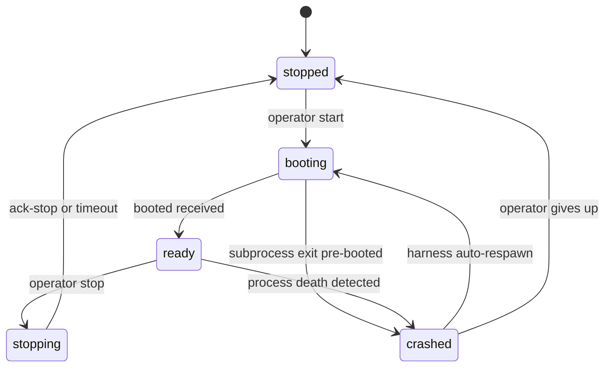

State semantics:
- **`booting`** — `intent=running`, subprocess spawned, `booted` event NOT yet received. Health poller does NOT count agent as alive yet (boot-grace window applies). Any `assigned-to` events for the alias queue but are NOT delivered until status flips to `ready`.
- **`ready`** — `intent=running`, `booted` received, agent listening for nudges. Steady-state "alive". Both idle and actively-working agents are `ready`.
- **`stopping`** — `intent=stopping`; harness emits `assigned-to(role, event_context="stop-intent")` so the agent finishes current work and emits `ack-stop`. Timeout: 30s grace → SIGTERM → 10s → SIGKILL.
- **`stopped`** — process is dead AND `intent=stopped`. Terminal until operator restarts.
- **`crashed`** — process death detected by health poller but `intent=running`. Harness auto-respawns; status flips back to `booting`.

Two fields, not one, so recovery semantics are explicit. After a host reboot, the harness reads `.squidsquad/.harness-state.json`, sees `intent=running` but no live PID → respawn. If collapsed, the harness couldn't distinguish "operator stopped this" from "this crashed."

### 7.3 Work handoff: explicit `/work/assign`

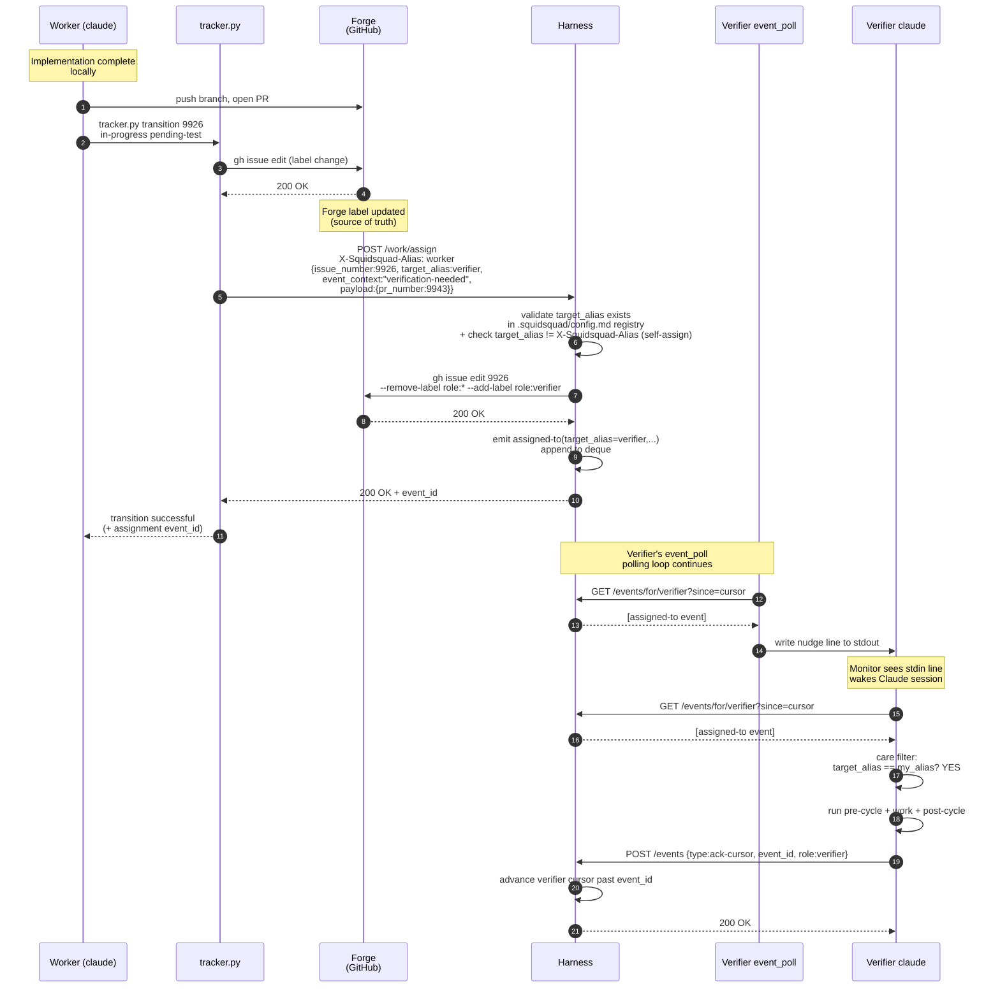

In practice agents never call `/work/assign` directly for transition-driven handoffs — `tracker.py transition` does it automatically.

#### `tracker.py` auto-routing table (locked)

| Transition (from → to) | Implied `target_alias` | event_context |
|---|---|---|
| `in-progress → pending-test` | alias from issue's `role:*` label (a verifier-class alias); if none, route to `pm` with `event_context="unowned-verification"` | `"verification-needed"` |
| `pending-test → pending-ship` | alias from issue's `role:*` label (a dm-class alias); if none, `dm` (single-instance default) | `"delivery-needed"` |
| `pending-test → in-progress` | alias from issue's `role:*` label; if none, route to `pm` with `event_context="unowned-rejection"` | `"verifier-rejected"` |
| `pending-ship → in-progress` | alias from issue's `role:*` label; if none, route to `pm` with `event_context="unowned-rejection"` | `"merge-conflict"` |
| `pending → planning` | `pm` | `"planning-needed"` |
| `planning → planned` | (no assign — self-routing) | — |
| `planned → approved` | alias from issue's `role:*` label; if none, route to `pm` with `event_context="unowned-approval"` | `"ready-for-pickup"` |
| `approved → in-progress` | (no assign — self-pickup) | — |
| `pending-ship → shipped` | (no assign — terminal) | — |
| `* → pending-human-review` | `pm` | `"human-needed"` |
| `* → pending-human-setup` | `pm` | `"human-needed"` |

The issue's `role:*` label IS the target alias (aliases and label values use the same namespace). The label *key* is `role:` for legacy code-compat reasons, but the label *value* is always alias-typed — in a single-instance install, alias = class name; in a multi-instance install, the label is the specific agent's alias (e.g., `role:frontend-1`, not `role:worker`). A rename of the label key from `role:` to `alias:` is in the same family as #10358 (`role` → `alias` identifier rename) but is currently out of scope on that task to limit blast radius — every existing issue label would need editing in lockstep with `tracker.py`, every care-filter caller, and every composed agent file that mentions `role:<name>`. Revisit once #10358 has phased through code-side first.

**Label lifecycle**:

- **Initial set** (issue creation through `planned → approved`): PM owns label management. During planning, PM sets the initial `role:<alias>` label on the issue at the `planned → approved` transition, naming the alias that should pick the work up. This is the only point in the pipeline where a non-harness writer touches `role:*`.
- **All subsequent rewrites**: the harness writes `role:<target_alias>` as part of processing every `POST /work/assign` call (and every EAD-emitted `assigned-to`) — see the self-assign bullet under "Harness validation" below. Agents and `tracker.py transition` never write `role:*` directly after the initial PM set; they call `/work/assign` and the harness handles the label.
- **Recovery for missing labels**: an issue arriving at a transition without a `role:*` label falls into the routing-table fallback (e.g., `unowned-rejection`, `unowned-approval`) which routes to PM for triage — PM then sets the label and re-runs the transition.

Mitigates an entire class of pickup-fidelity bugs (#9946) — agents can't forget to call `/work/assign` because `tracker.py` does it. Replaces the deprecated `status-transition` emit.

#### Routing — sender-side selection + harness alias-existence check + mis-route recovery

**Sender-side selection** (the user-team analogy): before emitting `assigned-to`, the sender consults the install's `## Aliases` registry (visible to every agent via the composed CLAUDE.md's team-awareness block). The sender picks a target alias by:

1. Class match — the work belongs to which role-class (verifier, worker, dm)?
2. Specialty match — within that class, which L3 domain (FE, BE, etc.) does the work map to?
3. Instance selection — if multiple aliases of the matched role-class exist, the sender picks one. Selection logic is sender-defined; the simplest signals available without new endpoints: round-robin (no harness call), or cursor freshness via the existing `GET /events/cursor/{alias}` (§4.3) — comparing cursors across interchangeable aliases against the deque head shows which agent is the most responsive (highest cursor relative to head = most recently caught-up). Agents within the same role-class are interchangeable by construction (instances compose from byte-identical L1–L4 + one shared L4 file per role-class — see Terminology), so any of them can handle the work; load balancing is an optional optimization, not a correctness concern.

The sender comments on the issue with a one-line routing rationale when the lane isn't obvious from the status transition alone.

**Harness validation**. The harness performs **one** validation on `/work/assign`: does `target_alias` resolve to a registered agent in this install (per `.squidsquad/config.md` `## Aliases`)?

- **Unknown alias** → `HTTP 404 Not Found` with body `{"error": "unknown alias", "target_alias": "<value>", "known_aliases": [...]}`. Prevents typos and misconfigurations from reaching the deque.
- **Self-assign** → forbidden by built-in invariant (the harness rejects any `assigned-to` where `target_alias == emitter_alias`). Structural anti-loop, not a permission table. The emitter alias is identified by the `X-Squidsquad-Alias` HTTP request header on every `POST /work/assign` call: `tracker.py transition` and any direct caller MUST set the header to the calling agent's alias. EAD-emitted `assigned-to` events bypass the HTTP path (they're produced inside the harness from forge state changes) and use the sentinel `emitter_alias = "__ead__"` which is exempt from the self-assign check.
- **`role:*` label rewrite** → after validation passes, the harness writes `role:<target_alias>` to the forge issue (`gh issue edit --remove-label role:* --add-label role:<target_alias>`) BEFORE emitting the `assigned-to` event into the deque. This guarantees the routing table's reads are always against an up-to-date label — the label reflects the new owner at every transition without `tracker.py transition` having to know the next-owner mapping itself. The harness is the only writer of `role:*` labels; callers of `/work/assign` provide `target_alias` and the harness handles the label. EAD-emitted `assigned-to` writes the label the same way. (This is the one forge-write the harness performs; otherwise it remains a read-only forge consumer per HARNESS-ARCH §2.)
- **No class-from-class permissions**: any alias may assign-to any other alias. Process discipline lives in each agent's L2/L3/L4 — not in a harness gate. This aligns with §4.1's "harness is a transport bus, not an orchestrator" principle (adding a permission table would make the harness gate-keep work assignment, which it explicitly doesn't do).

  > **Status**: the alias-existence-only validation rule above is the **target architecture** (decision locked 2026-05-25, per `decision-class-vs-alias-routing-model`). Current code still reads `responsibility.md` and enforces class-from-class permission checks; removal is tracked in #10182. See [HARNESS-ARCH.md §13.5](HARNESS-ARCH.md#135-alias-routing-migration) for migration status.

**Mis-route recovery** (the human-team analogy): when an agent receives `assigned-to` work that doesn't match its declared specialty:

1. Agent reads the event in Phase 2.
2. Agent recognizes the work is outside its domain (per L2/L3/L4 + SOUL.md).
3. Agent re-assigns via `/work/assign` to the correct alias. No special wire-format, no `re-assign` event type — same `/work/assign` call any normal routing uses, with the corrected `target_alias`.
4. Agent emits its own cycle's `ack-cursor` and continues.
5. If the agent doesn't know who the correct alias is, it routes to `pm` with `event_context="route-help"` so PM can triage.

This is the **only** recovery mechanism. There is no harness-side "is this a good match?" check — agents are trusted to recognize and correct mis-assignments the same way a human team-member redirects a misfiled ticket.

For non-transition routing (e.g., process concerns surfaced to PM without a state change), agents call `/work/assign` directly:

```bash
python references/scripts/tracker.py work-assign --target-alias pm \
    --event-context process-concern --payload '{"concern": "..."}'
```

#### EAD safety net

If forge state changes through any path OTHER than `tracker.py transition` (human edit in the GitHub UI, third-party automation, or `tracker.py`'s `/work/assign` POST failed), EAD catches it on its next poll:

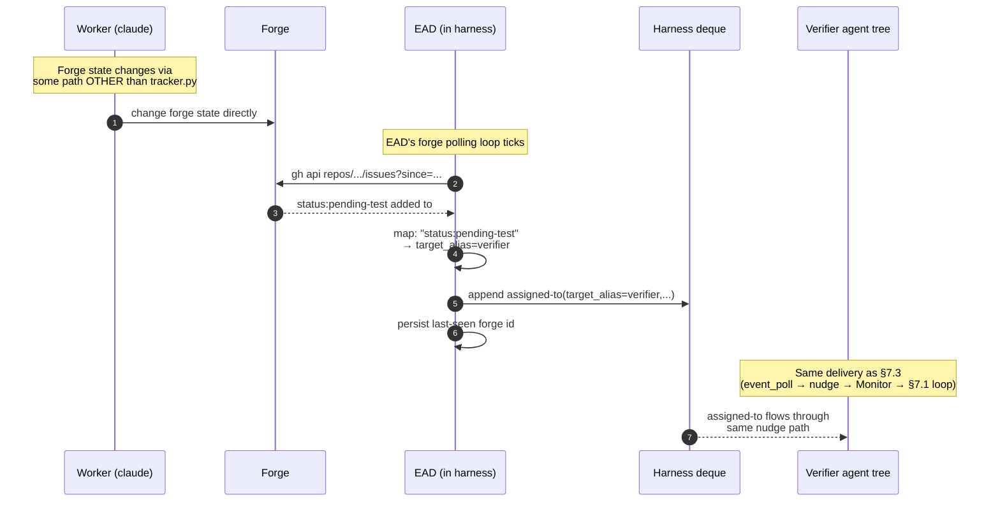

Tracker.py path is sub-second; EAD path is 5–60s polling-cadence-bounded.

### 7.4 Care filter

Each agent's care filter is "events with `target_alias == my_alias`." Future refinement could allow finer-grained filtering on `event_context` or `payload`, but v2 ships with alias-only filtering. There is no permission gate to traverse — the harness has already validated the alias exists; everything past the care filter is the agent's own routing decision.

### 7.5 Nudge handling while busy (context-only, no state mutation)

If a nudge arrives while the agent is mid-cycle: **note it in conversation context only. No file write, no queue, no flag. Take no other action.** The §7.1 eager main loop's next iteration picks up new events naturally — every per-event ack is followed by another `GET /events/for/{role}?since=cursor`, so any events that arrived during the in-progress work are delivered on the next loop iteration without needing an explicit "I noticed the nudge" state.

This is grounded in §9 Q7's lock: *"Queue-while-busy = context-only; no `working-state.md` flag."* D3 of #11328 formalizes the same conclusion in the §7.1 eager-loop terms.

**Why no flag is needed:**

- The §7.1 eager loop ends every event with a fresh GET, so a noticed nudge has no decision to make — the loop already re-checks before idling.
- `event_poll` is self-healing — even if conversation context is lost (session crash, mid-window compaction), `event_poll`'s next poll within 5–60s (active/idle adaptive) sees events past cursor and re-emits a nudge.
- Monotonic-forward cursor prevents double-processing.

**Crash-safety:**

| Crash point | Recovery |
|---|---|
| Mid-current-event (before per-event ack-cursor) | Restart reads `.squidsquad/<alias>/working-state.md` (§7.2 step 2), resumes the work; the cursor sits at the *previous* event's id, so when the agent enters §7.1 via §7.2 step 4 the initial-drain GET re-delivers the unacked in-progress event and processes it again (consumers are idempotent). |
| Crash after ack-cursor emitted, before next iteration's GET fires | Cursor sits at the just-acked `event_id`; on restart the agent re-enters §7.1 via §7.2 step 4. The initial-drain GET returns any events past the acked id, including events that arrived during the crash window. No state loss. |
| Multiple nudges arrived; agent crashed before responding to any | On restart the agent enters the §7.1 eager loop via §7.2 step 4; the initial-drain iteration's GET returns every queued event past the cursor and the loop's drain-to-empty behavior processes them in cursor order. No nudge is required for the initial drain — any nudges that arrive *after* it completes wake the agent from idle as usual. |

Honors the locked principle: forge owns work state, harness owns delivery state (cursor), agent owns ONLY its current work.

### 7.6 Improvement subloop (cursor-at-head)

In loop mode, agents run improvement scans on quiet cycles. In event mode there are no cycles — agents wake only on nudges. If we did nothing else, an agent that handles all its events would never run improvement work.

The improvement subloop fires when the agent's queue is observably drained — `GET /events/for/{role}?since=cursor` returns `[]` (no events past cursor). There is no harness endpoint for "am I at deque head?"; the agent infers drained-state from an empty GET response.

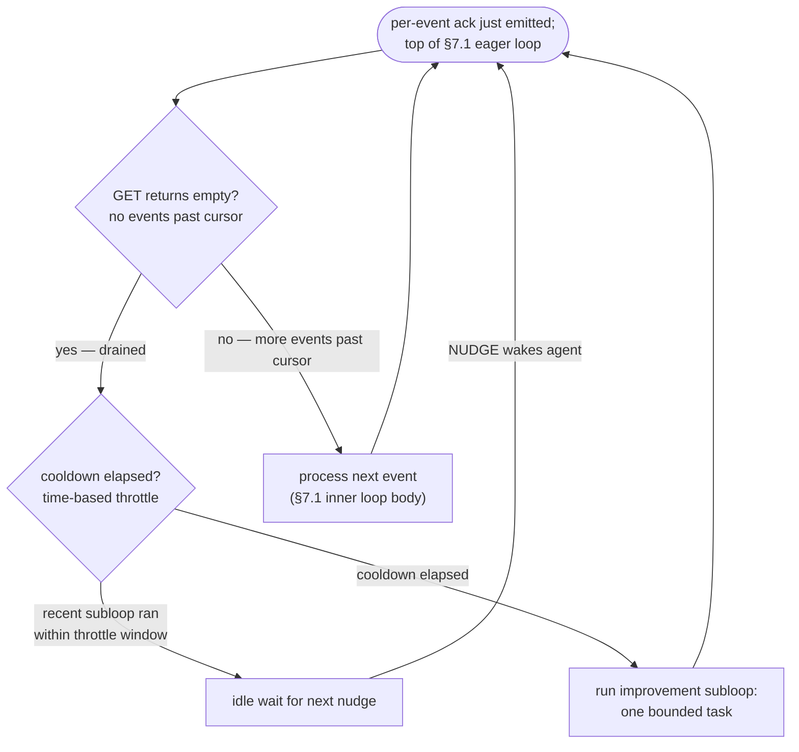

**Throttle** (time-based, NOT token-counting): at most one subloop per agent per N minutes (default 30, matching the old `/loop` cadence — so observable improvement-scan frequency stays the same as loop mode). `.squidsquad/<alias>/.subloop-last-run` records the last-fire timestamp; the agent checks this file's age before triggering.

**What the subloop does** (role-class-specific, one bounded task per fire):
- **pm**: pipeline sentinel + improvement scan (process gaps, stalled items, doc drift)
- **verifier**: TEST-PLAN backlog catch-up
- **worker**: doc-scan or test-coverage scan on owned modules
- **dm**: doc realignment + CHANGELOG hygiene + version-bump readiness

Subloop output may emit a new `assigned-to` (e.g., pm-subloop files a bug and routes it). That nudges the owning alias into work — via the same `/work/assign` path everything else uses.

---

## 8. Wake-mode selection & migration

### 8.1 No global config; compose is mode-agnostic

There is **no `event-driven:` field** in `.squidsquad/config.md`, no per-role-class override, and no compose-time mode gate. The composed CLAUDE.md is the same regardless of which wake mode the agent will end up in — `compose.py` always emits the event-shaped body for every role-class. There is one manifest per role-class (`references/roles/<role>/includes.yml`); the historical loop-only `includes.yml` vs `includes-events.yml` split is retired (the loop-only procedural fragments are folded into the unified manifest as fallback paths the cycle body invokes when the bus is unreachable).

The composed CLAUDE.md's boot section probes the harness once and binds the wake mechanism for the session (§8.3). The cycle body uses bus reads when available and falls through to tracker reads on bus failure (§4.5).

### 8.2 No mode-flip procedure

A separate operator step to "flip modes" does not exist — mode is not a flag the operator sets. To force loop mode for an install, stop the harness before restarting the squad; the agents' boot probes will fail and bind to loop mode for those sessions. To return to event mode, start the harness and restart the agents.

There is no `recompose + restart` ceremony tied to mode change; mode is decided per agent process at its own boot, not at the install level. Mixed-mode installs (one agent event, another loop) are possible — and harmless — during the brief window between starting the harness and an agent's next restart.

### 8.3 Boot decision tree

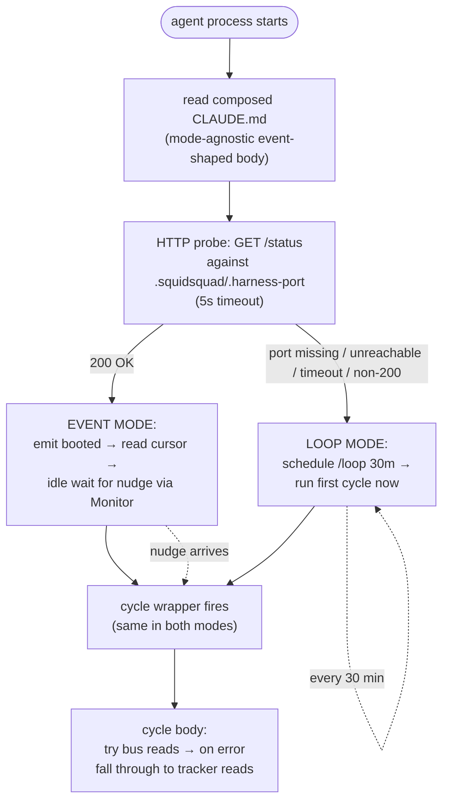

The probe runs **once per session** at boot, not per cycle. Once the wake mechanism binds, it stays for the lifetime of the session. Mid-session bus failures degrade individual cycles (§2 above), they do not flip the wake mechanism.

### 8.4 When the harness is unreachable

**At boot**: the probe fails and the agent binds to loop-mode wake. `/loop` is scheduled; the cycle body runs against tracker state for reactions. The agent will continue in loop mode for this entire session even if the harness comes back up; the next session restart picks up event mode automatically.

**Mid-session, intermittent bus failures**: individual `GET /events/for/<alias>` calls return errors. The cycle body falls through to tracker reads for that cycle. The cursor is not advanced. The next successful poll resumes from the unchanged cursor. The wake mechanism (Monitor + nudge) is unaffected — nudges that the harness queued during downtime arrive when reachability returns, and `event_poll` picks them up.

**Mid-session, harness gone for an extended period**: the agent stays in event-mode wake (no `/loop` is scheduled); cycle wrappers fire only when a nudge arrives. With no nudges, the agent goes idle indefinitely. The paired `event_poll` is orphaned the moment the harness dies — it keeps polling but every request fails until either (a) the same port is reused by a replacement harness (it then resumes silently) or (b) the orphan persists and `event_poll` keeps no-opping. **Full event-mode recovery requires a team reboot** (operator stops + restarts the harness; then restarts each agent so its boot probe rebinds to event-mode wake and a fresh `event_poll` is paired). There is no automatic event-mode recovery without restarting agents — the existing `event_poll` is paired with a dead harness lifecycle and is not auto-respawned (§7.0). Operators who suspect the harness will be down for a long time can force loop-mode for the next session by stopping the agent and restarting after confirming the harness is unreachable.

### 8.5 Migration from loop → event mode (v2 closure plan)

The v2 build ships as 6 grouped PRs. The **letters** (A–F) are logical-grouping identifiers — they cluster related work; the **numbers** (1–6) are the dependency-driven implementation order. The two orderings differ on purpose: e.g., Group A is the foundation and ships first, but Group B (cursor wire) is held until after C has landed so its wire-format changes don't conflict with EAD restart-safety.

| # | Group | What it does | Risk |
|---|---|---|---|
| 1 | **A — Lifecycle plumbing** | `boot_agent` spawns thin_launcher + event_poll; health poller watches both; cold start order. The boot-time harness probe + wake-mode bind (§8.3) runs **inside the claude (agent) process** as part of its own boot sequence — after reading composed `CLAUDE.md` and before the first cycle — NOT inside `thin_launcher`. | medium |
| 2 | **C — EAD + restart safety** | Last-seen-id recovery, in-flight cleanup, harness restart catch-up | low |
| 3 | **D — alias-existence validation** | Harness validates `target_alias` against the install's registered aliases (per `.squidsquad/config.md` `## Aliases`); 404 on unknown. No class-from-class permissions. | low |
| 4 | **B — Cursor + delivery wire** | Nudge format = literal `NUDGE\n`; forward-only ack; `HTTP 410 Gone` for cursor-evicted | low |
| 5 | **F — Observability** | TUI polls `/status`, `/agents`, `/events/recent`; lifecycle/git logs stay in iter-NNNN.md | very low |
| 6 | **E — Migration** (3 sub-phases) | E1: stop emitting deprecated types · E2: collapse `Event Reactions` to `assigned-to` only · E3: trim catalog + rewrite event_poll | highest |

After all 6 land: v2 ships with event-mode as the unconditional wake-mode architecture; loop mode is the boot-time fall-back when the harness is unreachable (§8.4). No operator configuration step is required for either mode.

**Catalog-trim replacements** (Group E translates retired event types into `assigned-to` with a specific `event_context`):

| Retired type | Replacement | When emitted |
|---|---|---|
| `compose-completed` | `assigned-to(target_alias=pm, event_context="compose-needed", payload={touched_files})` | After a merge touches `references/`. PM runs `compose.py deploy-all`, restarts affected agents. |
| `agent-health` (stalled/down) | `assigned-to(target_alias=pm, event_context="agent-down", payload={role, last_seen})` | Harness health poller detects a watched agent dies or stalls past threshold. PM's pipeline-sentinel handles. |
| `noop` (#9845) | `assigned-to(target_alias=A, event_context="probe", payload={ack_only:true})` | Latency probe / harness liveness check. Agent acks without doing work. `ack_only` is a `payload` extension, not a top-level `assigned-to` field — see §4.2 catalog entry. |

PM's inbox is disambiguated by `event_context`. The full set in use:

- From the `tracker.py` auto-routing table (§7.3): `"planning-needed"`, `"human-needed"` (for `* → pending-human-review|setup` transitions), `"unowned-rejection"` (fallback for rejected items with no `role:*` label), `"unowned-approval"` (fallback for approved items with no `role:*` label).
- From the catalog-trim translators (§8.5): `"compose-needed"` (PM is asked to run `compose.py deploy-all` + restart agents — used for paths the harness file-watch does not cover, e.g. mid-session merges to `references/`), `"agent-down"` (health-poller observed an agent stall).
- From the harness directly (COMPOSE-ARCHITECTURE §8.2): `"restart-required"` is emitted to affected *agents* (not PM) after the harness has already re-run compose for an L4 write — distinguish from `compose-needed`: `restart-required` says "compose is done, please restart"; `compose-needed` says "PM, please run compose and orchestrate restart". The two are NOT interchangeable.
- From EAD: `"human-comment"` (forge comment by a human author).
- From agents calling `/work/assign` directly: `"process-concern"` for ad-hoc routing of cross-role-class process issues to PM; `"route-help"` for mis-route recovery (an agent received work it doesn't own and re-routed to PM for triage — see §7.3).

PM agents recognize this set as their care-filter; new values added in future require both an emitter update and an entry in this list.

---

## 9. Open questions

> All §13 questions from `archive/EVENT-ARCHITECTURE.md` were closed in rev 4 (2026-05-23). Listed here so future drift surfaces against a known baseline.

| # | Question | Lock |
|---|---|---|
| Q1 | Booted payload shape | `{role, pid, clone_path, version}` |
| Q2 | `/work/assign` authorization | Alias-existence check only (404 if unknown); no class-from-class permissions. Process discipline lives in L2/L3/L4, not in a harness gate. |
| Q3 | EAD polling cadence | REST + adaptive 10s active / 30s idle, 5s floor / 60s ceiling |
| Q4 | `event_poll` polling cadence | 5s active / 30s idle, adaptive backoff, 2s floor / 60s ceiling |
| Q5 | Cursor on first boot | `null` per CONTEXT-9873-A D7 |
| Q6 | Care filter granularity | Alias-only in v1; `event_context` filter could be a v2 extension if needed (no L2 bus-contract dependency — that mechanism was retired) |
| Q7 | Queue-while-busy | Context-only; no `working-state.md` flag |
| Q8 | `#9845` (noop) fate | Retired; absorbed into `assigned-to(event_context=probe)` |
| Q9 | `compose.py` changes for v2 | Trim catalog, retire emit calls, add `compose-needed` translator |
| Q10 | Migration plan | No feature flag. Event mode is unconditional; loop is automatic boot-time fall-back when the harness is unreachable (§8.3/§8.4). Earlier rev-log entries referencing `event-driven: yes/no` are historical — superseded 2026-05-30. |

> Net-new open questions surfaced during the loop+event merge (this doc): listed below.

| # | Question | Status |
|---|---|---|
| Q11 | `ack-stop.result` enum values | **Closed (2026-05-30)** — `'checkpointed'` (working-state.md flushed; safe to SIGTERM), `'aborted'` (graceful stop failed; harness should escalate), `'drained'` (no in-flight work; exiting clean). Documented in §4.2 catalog row. |
| Q12 | `role:*` label rewrite timing | **Closed (2026-05-30)** — the harness writes `role:<target_alias>` to the forge issue as part of processing every `POST /work/assign` (and equivalently when EAD emits `assigned-to`). The label rewrite happens AFTER validation passes and BEFORE the `assigned-to` event is appended to the deque. Callers of `/work/assign` provide `target_alias`; the harness handles the label edit. This is the one forge-write the harness performs (HARNESS-ARCH §2 relaxed accordingly). See §7.3 sequence diagram + harness validation bullet for the wire-level shape. |
| Q13 | `emitter_alias` derivation for self-assign invariant | **Closed (2026-05-30)** — `X-Squidsquad-Alias` HTTP request header. `tracker.py transition` and any direct caller MUST set the header on `POST /work/assign`; the harness reads it and rejects when `target_alias == header_value`. EAD-emitted `assigned-to` events bypass the HTTP path entirely (produced inside the harness) and use the sentinel `emitter_alias = "__ead__"` exempt from the check. Implementation lives with group D (§8.5). |


---

## 10. References & terminology

### 10.1 Glossary

- **Cycle wrapper**: the pre/creative/post phase trio that runs around one unit of agent work. Same shape in both modes.
- **Nudge**: a single stdin line written by `event_poll` to wake a Claude session via the Monitor tool.
- **Cursor**: per-alias harness-owned pointer to "events tended through here."
- **EAD**: ExternalActivityDetector — the harness's forge poller that translates forge state changes into `assigned-to` events.
- **Care filter**: the per-alias decision of whether to act on an event or skip it. In v2 the filter is `target_alias == my_alias`; see §7.4.
- **Improvement subloop**: time-throttled self-care work the agent runs when its queue is empty. Applies in both modes — quiet cycles in loop mode (§6.4) and drained-queue detection in event mode (§7.6).

### 10.2 Related docs

- [`ARCHITECTURE.md`](ARCHITECTURE.md) — the 6-layer system stack; process tree, `.claude-pid` semantics, three claude.exe populations.
- [`COMPOSE-ARCHITECTURE.md`](COMPOSE-ARCHITECTURE.md) — the L1-L4 composition model. Compose is mode-agnostic; the procedural fragments produced are event-shaped with bus-failure fallback baked in.
- [`sub-skill-catalog.md`](sub-skill-catalog.md) — the catalog of sub-skills; `common-events/` runtime-loaded in event mode, polling fragments in loop mode.
- [`sub-skill-guide.md`](sub-skill-guide.md) — how to author and wire sub-skills.

### 10.3 Source material

- `archive/EVENT-ARCHITECTURE.md` (v2 nudge-driven design, rev 5 lock-ready)
- `archive/EVENT-BUS-ARCHITECTURE.md` (v1 PRD)
- `archive/event-bus.md` (v1 narrative)
- Vault: `.squidsquad/vault/galaxy/decision-event-bus-architecture-redesign.md`
- Pre-flip blockers: `#9891` (event_poll nudge-only), `#9892` (agent contract)
- Fallback path: `#9580`, `#9588`

### 10.4 Revision log

- **2026-05-23 (rev 1) — consolidation.** Merged `EVENT-ARCHITECTURE.md` (v2 design), `EVENT-BUS-ARCHITECTURE.md` (v1 PRD), and `event-bus.md` (v1 narrative) into a single runtime architecture doc framed around loop-vs-event triggering. Carried over all key Mermaid diagrams. The three source docs are slated for retirement once this lands.
- **2026-05-23 (rev 2) — first review-loop pass.** Applied 2 Claude-subagent audits (completeness + internal consistency) and one DeepSeek code-review pass. Fixes: 12 DS findings (4 HIGH cross-mode contradictions and wire-format mismatches, 6 MED disambiguations, 2 LOW polish). Notable additions vs rev 1: §8.3 boot decision tree now gates on `event-driven:` config in addition to harness reachability; §6.4 splits respawn paths for harness vs harness-less; §8.1 explicitly separates compose-time manifest selection from runtime fragment loading; §7.0 documents `event_poll` sidecar + `--role` flag + cadence; §4.3 specifies HTTP 410 cursor-evicted body + event-ID hash formula; §7.3 specifies HTTP 403 rejection body + permission table model. Diagrams: EAD now shows REST endpoint (was `gh api / search`); nudge format normalized to literal `NUDGE\n`; subloop throttle relabeled "time-based" (not "token-burn"). Field names normalized to `issue_number` + `target_role` across both catalog and wire diagrams. DS artifact: `.squidsquad/pm/planning/REVIEW-AGENT-RUNTIME-DEEPSEEK.md`.
- **2026-05-23 (rev 3) — review-loop pass 2.** Second DeepSeek pass surfaced 6 new findings (3 MED, 3 LOW) — mostly fallout from incomplete updates in rev 2. Applied: glossary "token-throttled" → "time-throttled" (was inconsistent with §7.6); cursor-model sequence diagram replaced `working-state.md` participant with `.event-state.json` to match the migrated architecture; routing table now has fallbacks for `pending-ship → in-progress` (unowned-rejection) and `planned → approved` (unowned-approval); event_poll cadence specifies `3 consecutive empty polls` (matching EAD); `assigned-to` catalog payload reconciled with wire diagrams (`title` moved under `payload`); subloop trigger reframed as "GET returns empty" (the observable check) instead of "cursor at deque head" (not directly observable). DS artifact: `.squidsquad/pm/planning/REVIEW-AGENT-RUNTIME-DEEPSEEK-2.md`.
- **2026-05-23 (rev 4) — review-loop pass 3.** Third DeepSeek pass surfaced 2 new findings (1 MED, 1 LOW). MED fix: EAD and event_poll cadence blocks now describe a two-tier backoff (10s → 30s → 60s and 5s → 30s → 60s) — the prior single-step backoff couldn't actually reach the documented 60s ceiling. LOW fix: `ack_only=true` for the probe `event_context` is now correctly notated as a `payload` extension, not a top-level `assigned-to` field. DS artifact: `.squidsquad/pm/planning/REVIEW-AGENT-RUNTIME-DEEPSEEK-3.md`.
- **2026-05-23 (rev 5) — review-loop pass 4.** Fourth DeepSeek pass returned 1 LOW finding only and explicitly assessed the doc as "converged well; no HIGH or MED issues remain." Applied: §8.5 PM-inbox `event_context` disambiguation rewritten from an incomplete-and-partially-fictional list (`route-handoff` wasn't defined anywhere) to an exhaustive enumeration sourced from the routing table, catalog-trim translators, EAD, and direct `/work/assign` callers. DS artifact: `.squidsquad/pm/planning/REVIEW-AGENT-RUNTIME-DEEPSEEK-4.md`.
- **2026-05-23 (rev 6) — terminology unification + global-only mode flag.** Two related cleanups.
  - **Terminology**: removed all current-repo concrete-instance references (no `skill`, no `dev`, no "concrete-install snapshot" framing). The doc uses only the four L2 categorical role names: `pm`, `verifier`, `worker`, `dm` — sourced from the L2 capability layer (`agent-boundaries`), which is the canonical name source. *(Per later revisions: L2 is **Role** in the L1-L4 compose model and `agent-boundaries` was retired — see PR #10359. This entry preserves the then-current framing as historical context.)* Terminology table simplified to 4 rows with no concrete-instance column; role-filtering diagram drops the per-install qualifier and uses categorical names directly; stack-specific specialization is noted as `worker`/`verifier` variants rather than as alternative role names.
  - **Mode flag**: dropped per-role event-driven config (`event-driven-pm: yes` etc.). `event-driven:` is now a single global flag for the install — the whole squad runs in loop mode together or event-driven mode together. §8.1 rewritten; §8.2 mode-flip steps now install-wide; §8.3 boot decision tree simplified to one ConfigGate before the harness probe. Rationale: keeps the harness contract uniform (load-bearing for everyone, or observational for everyone), avoids the cross-role coordination puzzle of mixed modes.
- **2026-05-23 (rev 7) — post-rev-6 DS verification + §7.6 diagram fix.** DS round-7 verification found 2 actionable findings (1 MED, 1 LOW); both applied: §8.1 clarified that mixed modes are not *configurable* but degraded fallback can produce a transient mixed-mode state per-agent (the previous wording falsely implied install-wide uniformity even under fallback); §8.4 reworded to distinguish the configured `event-driven: no` path (loop mode by design) from the `event-driven: yes` + probe-fail fallback path (the prior "regardless of config" wording collapsed the two). Also: §7.6 subloop diagram nodes now use quoted-label form ({"…"}, ["…"]) so unquoted parentheses can't break Mermaid rendering. The "sub-skill" terminology is retained as the canonical compose-fragment term and is distinct from the "skill" agent-role term that was removed in rev 6 (DS flagged as info, accepted as intentional). DS artifact: `.squidsquad/pm/planning/REVIEW-AGENT-RUNTIME-DEEPSEEK-7.md`.
- **2026-05-23 (rev 8) — final convergence + cadence-math fixes.** DS round-8 confirmed all R7 fixes correct and returned 2 LOW math errors: EAD cadence "≈3 minutes" → "≈2 minutes" (correct: 3 polls at 10s + 3 polls at 30s = 120s = 2 min to reach the 60s ceiling); event_poll cadence "≈2.5 minutes idle" → "≈1.75 minutes idle" (correct: 3 polls at 5s + 3 polls at 30s = 105s ≈ 1.75 min). Both fixed. The doc is now mathematically and architecturally converged. DS artifact: `.squidsquad/pm/planning/REVIEW-AGENT-RUNTIME-DEEPSEEK-8.md`.
- **2026-05-25 (rev 9) — post-#6274 `qa` → `verifier` rename + loop/event mutual-exclusivity on event-bus axis + vault invocation polish.** Three coordinated edits:
  - **Role rename**: post-#6274 (shipped 2026-05-23) the canonical role is `verifier`, not `qa`. Swept all instance-level references in this doc (Terminology table, §2.1 latency-floor example, §3.1 + §3.2 mermaid subgraph and tree labels, §4.3 role-filtering diagram, §7.3 verification-needed sequence diagram + routing table, §7.5 EAD safety-net sequence diagram, §7.6 subloop role list). Wire-format strings updated too: `target_role:qa` → `target_alias:verifier`, `role:qa` → `role:verifier`, `event_context:"qa-rejected"` → `event_context:"verifier-rejected"`, `GET /events/for/qa` → `GET /events/for/verifier`. Note: live code (`references/scripts/triage.py`, `cycle_pre.py:614`) still emits `qa-rejected` — doc now describes architectural target; code task to skill.
  - **Loop/event mutual exclusivity** (§2 + §4.5 + §4.6 + §6.1 + §6.3 + §7 lead): loop mode is now documented as emit-only on the event bus (no consume, no cursor); event mode is the exclusive home for bus consumption + cursor logic. Loop-mode mechanical reactions derive from tracker state changes since last cycle (timestamp dedup in working-state.md), not from event-bus reads. Rationale: keeps the harness contract uniform — loop is observational-only, event is load-bearing.
  - **Vault invocation** (§6.1 diagram + §6.6 new sub-section): named the four Phase 2 vault touchpoints + boot-time BRIEFING read + the inline-vs-subagent execution lane principle (heavy sub-skills `vault-remember` and `vault-synthesis` run on the `sonnet` tier via background subagent; light ones `vault-protocol` and `vault-optimize` stay inline). Cross-references VAULT-ARCH §7 for the lane principle's full rationale.
  - **Vault flag retirement** (§6.1 diagram): dropped the `· read vault-remember + vault-optimize flags` line from Phase 1 and the `· advance event cursor` line from Phase 3 (both per the above changes). The vault-remember/vault-optimize `Enabled` flags in `config.md` are being retired; both sub-skills are always-on and self-gate via their per-cycle conditions. Code task to skill.
- **2026-05-25 (rev 10) — class vs alias as routing primitive + responsibility.md / permission-table retirement.** Architectural simplification arc:
  - **Class vs alias** (Terminology refactor + wire-format swap): role classes (pm/dm/worker/verifier) are categorical and have uniform L2/L3 + bus contract per class; aliases are per-agent unique names from `config.md` `## Aliases`. An install may have 1..N agents per class — e.g., 2 frontend + 2 backend worker-class agents named `frontend-1`, `frontend-2`, `backend-1`, `backend-2` (four worker-class agents, four distinct aliases). Specialty/skill (FE/BE/iOS/etc.) lives in SOUL.md + L4, not in a separate class. *(Note: §1 Terminology now locates specialty in **L3 (the domain layer)** instead — see `feedback-l3-specialty-layering`. This rev-10 entry preserves the as-of-rev-10 framing; current canonical statement is §1.)* Wire-format field `target_role` renamed to `target_alias` across all 16 catalog + sequence-diagram + routing-table references; care filter is now `target_alias == my_alias`; EAD emits one assigned-to per (forge change, target_alias) pair.
  - **`responsibility.md` retired**: the file's prose responsibility narrative was ~90% redundant with L2/L3 (which compose into each agent's CLAUDE.md anyway); the only load-bearing content was the `## Bus contract` section. Permission tables are being retired entirely (next bullet), so `responsibility.md` has no remaining purpose. Marked for code-task deletion.
  - **Permission table retired**: the harness no longer maintains a class-from-class `accepts assigned-to from:` permission table. Rationale: it duplicated discipline that already lives in each agent's L2/L3/L4 + SOUL.md; it conflicted with §4.1's "harness is a transport bus, not an orchestrator" principle; and the human-team analogy (mis-routed tickets get pushed back, no security guard at the assignment desk) applies. Replaced with two minimal harness checks: (1) target-alias existence (404 if unknown) and (2) self-assign invariant (rejected by structure, not by permission). Mis-route recovery happens at the agent layer: receiving agent recognizes out-of-domain work and re-assigns via the same `/work/assign` call to the correct alias; if recipient is unknown, routes to `pm` with `event_context="route-help"`.
  - §7.3 `/work/assign permission model` subsection replaced with `/work/assign validation + mis-route recovery`. §7.4 care filter section drops the L2-derived permission-table mention. §8.5 Group D row repurposed from "L2-derived permissions" to "alias-existence validation". §9 Q2 and Q6 updated to match.
  - Code task to skill (deferred per plan-first rule): drop `responsibility.md` files + compose pipeline reads, drop the harness permission-table build at boot, replace with the simpler alias-existence check, replace `target_role` field with `target_alias` in all wire-format emitters, rename `tracker.py work-assign --target` flag to `--target-alias`.
- **2026-05-30 (rev 11) — `event-driven:` config flag retired; event mode unconditional + boot-time fall-back.** Architectural simplification: there is no `event-driven:` field in `.squidsquad/config.md`, no compose-time manifest gate, no operator mode-flip ceremony. Event mode is the unconditional design; loop mode is the automatic fall-back when the boot-time harness probe fails (§8.3). Mid-session bus failures degrade individual cycles to tracker reads (§2 / §8.4) but do not flip the wake mechanism. Per-session binding: once a probe resolves, the agent stays in that wake mode for the session; the next restart re-probes. **Doc impact**: §2 rewritten around boot-probe selection; §8.1 retitled "No global config; compose is mode-agnostic"; §8.2 retitled "No mode-flip procedure" (operator-flip ceremony removed); §8.3 boot decision tree simplified to one probe + bind; §8.4 split into boot-time/mid-session/extended-outage paths; §8.5 Group A description clarified — the probe + wake-mode bind runs inside the claude process (per §8.3), NOT inside `thin_launcher` (a rev-11 phrasing error corrected in a later round 3 audit); §9 Q10 lock supersedes the historical feature-flag answer. **Historical-but-superseded entries**: rev 6 ("global-only mode flag"), rev 7 ("install-wide uniformity even under fallback"), and the `#9580` / `#9588` "no automatic runtime fall-back" framing — all describe a *config-flag-driven* model that no longer applies; boot-time fall-back is automatic. The `#9580` / `#9588` rejection applies specifically to *mid-session* mode-flipping, which is still rejected. **Companion doc updates**: COMPOSE-ARCH §6.5 / §10 (drop the two-manifest split), INSTALLER-ARCH §3.2 / §4.8 (drop `event-driven:` from config.md outputs), sub-skill-catalog (drop polling-vs-event manifest gate).
- **2026-05-30 (rev 12) — Q13 closed: `X-Squidsquad-Alias` header is the emitter identity for self-assign invariant.** The §7.3 self-assign rejection (`target_alias == emitter_alias` is forbidden) is now grounded by a concrete wire-format mechanism: every `POST /work/assign` call carries an `X-Squidsquad-Alias` HTTP request header naming the caller's alias. `tracker.py transition` and any direct caller MUST set it. EAD-emitted `assigned-to` events bypass the HTTP path (they're produced inside the harness from forge state changes) and use the sentinel `emitter_alias = "__ead__"` exempt from the check. §7.3 sequence diagram now shows the header; §7.3 self-assign bullet pins the mechanism. Q13 moves from Open → Closed in §9.
- **2026-05-30 (rev 13) — Q12 closed: harness writes `role:*` label after `/work/assign`.** The §7.3 routing table's dependency on the `role:*` label reflecting the new owner is now satisfied by harness-side label writes. After validation passes on every `POST /work/assign` (and equivalently inside EAD when emitting `assigned-to`), the harness performs `gh issue edit --remove-label role:* --add-label role:<target_alias>` BEFORE appending the event to the deque. Callers of `/work/assign` provide `target_alias`; they do NOT need to know the next-owner mapping or maintain a state-machine table — the harness handles the label. This is the one forge-write the harness performs; HARNESS-ARCH §2 is updated accordingly ("reads + one specific write: `role:*` label on `/work/assign` calls"). §7.3 self-assign bullet expanded with the label-rewrite rule; §7.3 sequence diagram now shows the `gh issue edit` step between validation and `assigned-to` emission. Q12 moves from Open → Closed in §9.
- **2026-05-30 (rev 15) — pre-existing-gap closure: event_poll placement, respawn semantics, `--target` retired, ordering rules locked.** Three architectural locks plus six mechanical disambiguations:
  - **event_poll placement (Option B)**: `event_poll` is a **direct child of `harness.py`**, NOT a sibling of `claude` under the agent's subprocess tree. The harness owns its full lifecycle and pairs each `event_poll` to one agent via `--role <alias>`. §3 lead + §3.2 diagram + §3.1 system-overview tree labels + §7.0 prose updated. Aligns AGENT-RUNTIME with HARNESS-ARCH §7.2 step 4 + §14.1 (the previously documented placement; AGENT-RUNTIME's "sibling of claude" framing was wrong).
  - **event_poll respawn semantics**: no automatic recovery. `event_poll` is single-spawn per agent process. If it dies mid-session, the recovery path is restarting the agent (which respawns the paired `event_poll`). If the harness itself dies, all `event_poll`s become orphaned (silent no-ops once the HTTP target is gone) and a full team reboot is required to restore event-mode operation — operator stops + restarts harness; then restarts each agent so its boot probe rebinds to event-mode wake.
  - **`--target stdout` flag retired**: dead code; `event_poll` always writes to its own stdout. Removed from §3.2 diagram + §7.0 prose. (`--target` was never used with any other value and the flag had no future-extensibility use case.)
  - **event_poll port discovery ordering**: harness writes `.squidsquad/.harness-port` and flushes to disk BEFORE spawning `event_poll`. HARNESS-ARCH §7.2 step 4 expanded with the ordering guarantee.
  - **event_poll vs EAD floor rationale**: `event_poll`'s 2s floor is safe because it polls the LOCAL harness HTTP API, not an external service; EAD's 5s floor is GitHub REST rate-limit safety. §7.0 cadence block annotated.
  - **§7.0 initial-queue ordering invariant** (rev 14 finalized) — already added; this rev confirms the placement decision matches it.
  - **Linked-body write timing (COMPOSE §4.6)**: linked composite held in memory through assemble; `CLAUDE.linked.md` written to disk only on assemble success as part of the atomic triple. Assemble pass is unconditional — no `Assemble: no` opt-out exists.
  - **config.md path phrasing (COMPOSE §3.0)**: replaced "sibling of `.squidsquad/project/`" with "directly inside `.squidsquad/` alongside `project/` and `<alias>/`" — clearer.
  - **INSTALLER migration walk version-read clarification**: the `squidsquad_version:` field read at Phase 0b step 2 was written by **the prior** installer run's Phase 5 — `.squidsquad/config.md` is on disk before the current re-run starts. Fresh-install case skips the walk entirely (`.squidsquad/` doesn't exist). §10 step 2 expanded.
- **2026-05-30 (rev 14) — gap-closure sweep: Q11 + L4 granularity + ## Aliases schema + initial role:* + event_poll/booted race + last_cycle_timestamp format.** Six related closures:
  - **Q11 closed** — `ack-stop.result` enum locked to `'checkpointed' | 'aborted' | 'drained'` with semantics: checkpointed (working-state.md flushed; safe to SIGTERM), aborted (graceful stop failed; harness should escalate), drained (no in-flight work; exiting clean). §4.2 catalog row expanded; §9 Q11 moved Open → Closed.
  - **L4 granularity locked** — exactly one L4 file per L2 role-class (`pm.md` / `worker.md` / `verifier.md` / `dm.md`), maximum 4 per install. L3 specialization does NOT differentiate L4 files. Rationale: L4 is project-overlay policy; the project's expectations of a worker don't change across L3 domains. §1 Terminology rewritten; COMPOSE §3.3 + §7.3 rewritten with the 4-file ceiling and `pm + 2 fe-workers + 1 be-worker` example producing 4 L4 files (not 5); sub-skill-catalog L4-seeds table updated; INSTALLER §5 callout rewritten. Retires the multi-named-role-class framing (e.g., `fe-worker.md` and `be-worker.md` as separate L4 files).
  - **`## Aliases` schema locked** — three-column markdown table (`alias` / `role-class` / `L3 domain`) in `.squidsquad/config.md`. `role-class` column drives L4 file selection (L2 categorical only); `L3 domain` column drives L3 source-file selection. Authored at install time per INSTALLER §4.8 step 3; required for `compose.py deploy <alias>` resolution. COMPOSE §3.0 carries the canonical schema example.
  - **Initial `role:*` label** — PM owns initial label management; sets `role:<alias>` at the `planned → approved` transition. All subsequent rewrites are harness-side via `/work/assign` (per rev 13). §7.3 expanded with explicit label-lifecycle bullets.
  - **`event_poll` vs `booted` race resolved** — boot step 4 (the agent's `GET /events/for/<alias>?since=null` immediately after emitting `booted`) is the canonical initial-queue drain; the harness returns empty to `event_poll`'s polls while `status=booting` so no nudges fire prematurely; from `status=ready` onward `event_poll` handles wake-ups normally. §7.0 expanded to call this out.
  - **`last_cycle_timestamp` format locked** — ISO 8601 UTC with seconds precision (e.g. `2026-05-30T17:42:00Z`), written at the end of `cycle_post.py` into `working-state.md`'s YAML frontmatter as `last_cycle_timestamp:`. §6.3 expanded with format spec.

