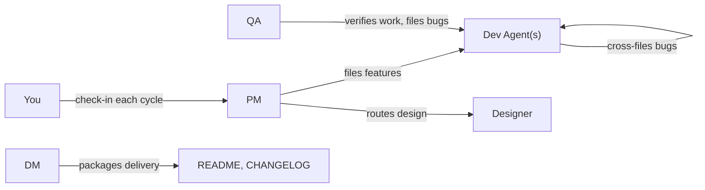
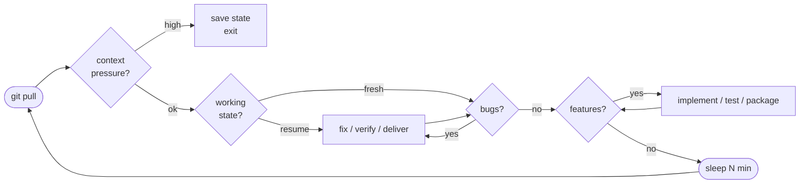
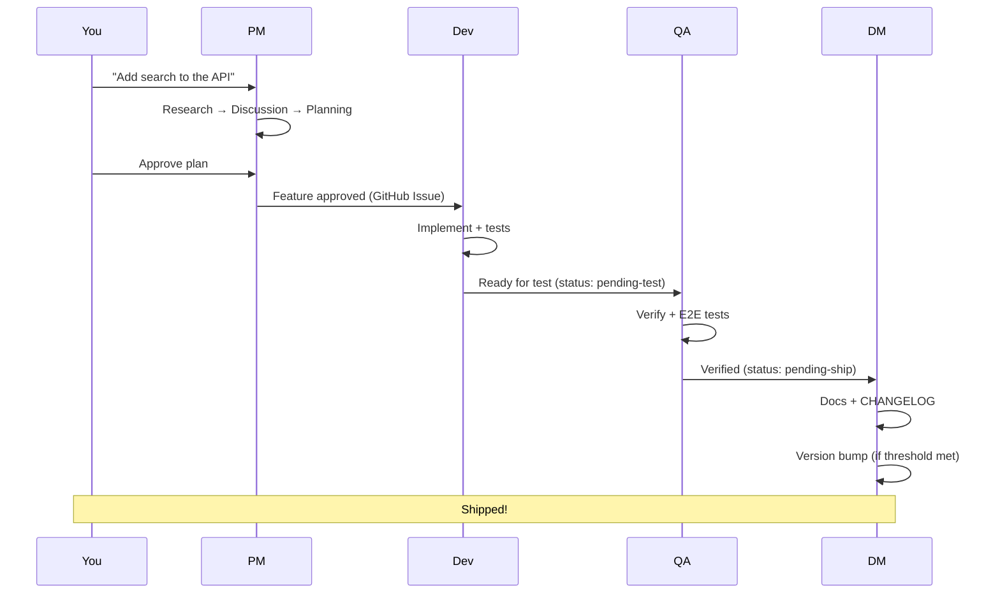

# SquidSquad Architecture

This document explains how SquidSquad works under the hood: how agents coordinate, how the Ralph Loop drives autonomous work, and how the pieces fit together.

---

## The Big Picture

SquidSquad turns a single git repository into a multi-agent development environment. Each agent is a separate Claude Code CLI instance that loops autonomously, reading and writing to a shared `.squidsquad/` folder. Git is the only communication channel.

```
┌─────────────────────────────────────────────────────────┐
│                     Git Repository                       │
│                                                         │
│  ┌─────────────────────────────────────────────────┐    │
│  │              .squidsquad/                        │    │
│  │                                                  │    │
│  │  config.md          ← versions, agents, settings │    │
│  │  templates/         ← full agent instructions    │    │
│  │  [role]/            ← per-agent working state    │    │
│  │  vault/             ← shared memory layer        │    │
│  │  statusline.sh      ← powers the status bar      │    │
│  │  start-[role].*     ← boot scripts               │    │
│  └─────────────────────────────────────────────────┘    │
│                                                         │
│  Your code, README, CHANGELOG, etc.                     │
│                                                         │
└─────────────────────────────────────────────────────────┘
        │           │           │           │
    ┌───┴───┐   ┌───┴───┐   ┌───┴───┐   ┌───┴───┐
    │  Dev  │   │  QA   │   │  DM   │   │  PM   │
    │ Agent │   │ Agent │   │ Agent │   │ Agent │
    └───────┘   └───────┘   └───────┘   └───────┘
    autonomous  autonomous  autonomous  interactive
```

No message queues. No orchestration servers. No databases. Agents pull to read the latest state and push after each work unit.

---

## Agent Roles



| Agent | Purpose | Mode |
|-------|---------|------|
| **Dev Lead** (one per role) | Fix bugs, implement features, run tests | Autonomous |
| **PM** | Human check-in, feature intake, backlog management | Interactive |
| **QA** | E2E tests, bug verification, feature testing | Autonomous |
| **DM** | Delivery packaging, docs, CHANGELOG, version bumps | Autonomous |
| **Designer** (optional) | Design specs, design tokens, interactive design sessions | Autonomous + interactive |

### Agent Personality (SOUL.md)

Each agent has a `SOUL.md` file at `.squidsquad/[role]/SOUL.md` that defines its professional identity, quality bar, decision-making style, communication style, and boundaries. SOUL.md is loaded at session start via the `{{runtime:}}` directive in sub-skill composition — it's copied to the agent's directory during `compose.py deploy`, not compiled into the template.

This means you can edit an agent's personality directly without redeploying templates. Changes take effect on the next agent boot.

---

## The Ralph Loop

Every agent follows the same loop pattern. Each iteration is one pass through these steps:



**What each agent does in its loop:**

- **Dev**: pull → triage bugs → implement features → run tests → commit → push
- **PM**: pull → check in with you → feature intake → backlog management → push
- **QA**: pull → run E2E tests → verify bug fixes → test features → push
- **DM**: pull → triage doc bugs → deliver pending-ship items → version bump check → push
- **Designer**: pull → check design requests → interactive design sessions → produce specs → push

Every step prints a `[🦑 HH:MM:SS]` timestamped marker so activity is easy to scan in terminal scrollback.

---

## Feature Lifecycle

Features flow through a structured pipeline with human approval gates:

```
Pending → Planning → Planned → Approved → In Progress → Pending Test → Pending Ship → Shipped
   │         │          │          │           │              │              │            │
   │     PM runs     Human      Human       Dev builds    QA verifies    DM delivers   Done
   │     research    reviews    approves       it           it            docs+changelog
   │     + planning   plan     execution
   │
  You or PM
  files it
```

Status transitions are tracked as GitHub Issue label changes. Discussion happens as Issue comments.

---

## Sub-Skill Architecture

Agent instructions are composed from modular sub-skills at build time:

```
references/sub-skills/
├── manifest.md              ← which sub-skills each role includes
├── roles/
│   ├── dev-agent.md         ← dev-specific: bug triage, feature implementation
│   ├── pm-agent.md          ← PM-specific: check-in, feature intake, backlog
│   ├── qa-agent.md          ← QA-specific: E2E tests, verification
│   ├── dm-agent.md          ← DM-specific: delivery, version bumps
│   └── designer.md          ← designer-specific: design sessions, specs
└── common/
    ├── tracker-protocol.md  ← GitHub Issues CRUD (all agents)
    ├── vault-protocol.md    ← shared memory vault (all agents)
    ├── git-commit.md        ← commit conventions (all agents)
    ├── bug-filing.md        ← cross-team bug filing (all agents)
    └── ...
```

`compose.py deploy <role>` assembles role + common sub-skills into a single template file per agent. Agents never see the sub-skill boundaries at runtime.

---

## Vault Memory Layer

The vault is a git-tracked, Obsidian-compatible knowledge base that all agents share:

```
.squidsquad/vault/
├── BRIEFING.md          ← active context summary (auto-maintained)
├── projects/            ← project goals, constraints, architecture
├── areas/               ← ongoing concerns: preferences, conventions, values
│   ├── human-profile.md ← your preferences, captured over time
│   └── code-conventions.md
├── resources/           ← reference material, external docs
├── archives/            ← shipped features, closed decisions
└── galaxy/              ← atomic knowledge notes (Zettelkasten)
    ├── decision-*.md    ← architecture and design decisions
    ├── pattern-*.md     ← recurring approaches
    ├── learning-*.md    ← lessons learned
    └── style-*.md       ← visual/code style preferences
```

**How knowledge flows:**

1. Agents observe your preferences, decisions, and patterns during work
2. At the end of each productive cycle, agents reflect and write vault notes
3. On the next cycle, all agents read the vault and adapt their behavior
4. Over time, the squad becomes closer to how you think and work

Notes use YAML frontmatter for metadata, wikilinks for relationships, and append-only changelogs for history. The vault is browsable in the Obsidian app.

---

## GitHub Issues as Tracker

All bugs and features are GitHub Issues with structured labels:

| Label type | Examples | Purpose |
|-----------|----------|---------|
| Type | `type:bug`, `type:feature` | What kind of item |
| Status | `status:open`, `status:approved`, `status:in-progress`, ... | Where in the pipeline |
| Role | `role:skill`, `role:dm`, `role:pm` | Which agent owns it |
| Priority | `priority:high`, `priority:medium`, `priority:low` | How urgent |

Agents use `gh` CLI through `tracker.py` for all operations. Status transitions are label changes. Discussion entries are Issue comments. External contributors can file Issues directly — PM triages them into the workflow.

---

## Coordination Model



All coordination is asynchronous. Agents don't wait for each other — they check for work on each cycle and pick up whatever is ready. Git pull/push is the synchronization mechanism.

---

## Health Detection

PM monitors agent health by reading `current-state` files across clones:

- 🦑 **Healthy** — file updated within 2x the loop interval
- 👻 **Stalled** — file exists but hasn't been updated recently
- ❓ **Unknown** — no data available

No background processes, no API calls, no heartbeat branches. Just file modification timestamps.

---

## Boot Flow

```
start-[role].sh / .ps1
    │
    ├── Read alias from config
    ├── Print squid logo + version
    ├── Inject permissions into settings.json
    ├── Write role for statusline
    ├── Initialize current-state file
    └── Launch: claude --dangerously-skip-permissions
              --name <alias>
              --append-system-prompt "SQUIDSQUAD_ROLE=<role>"
              "start the loop"
```

The `SQUIDSQUAD_ROLE` in the system prompt triggers auto-boot: the agent reads `.squidsquad/<role>/CLAUDE.md`, which points to the full template, and begins the Ralph Loop immediately.

---

## Self-Diagnostics

Agents include an anomaly detection system that logs errors from tracker operations, git operations, and composition:

- **Local logging**: Errors are written to `.squidsquad/diagnostics.jsonl` (JSON Lines format, 1MB rotation)
- **`/squidsquad-bug` command**: Users can report bugs to the upstream SquidSquad repo with sanitized config and diagnostic context attached automatically
- **Public repos** have diagnostics enabled by default; private repos are opt-in via `config.md`
