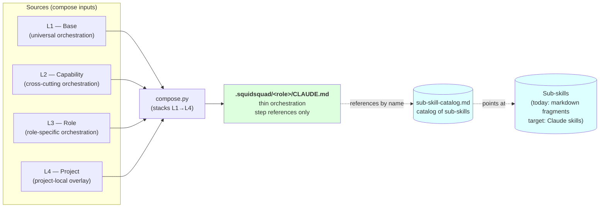
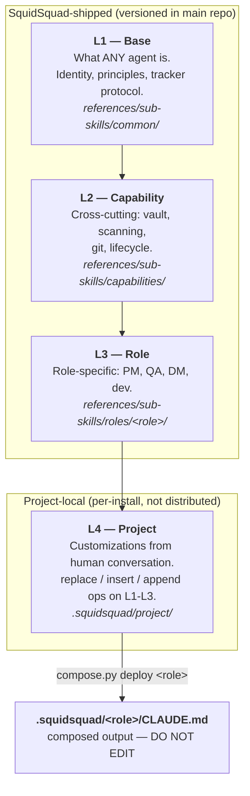
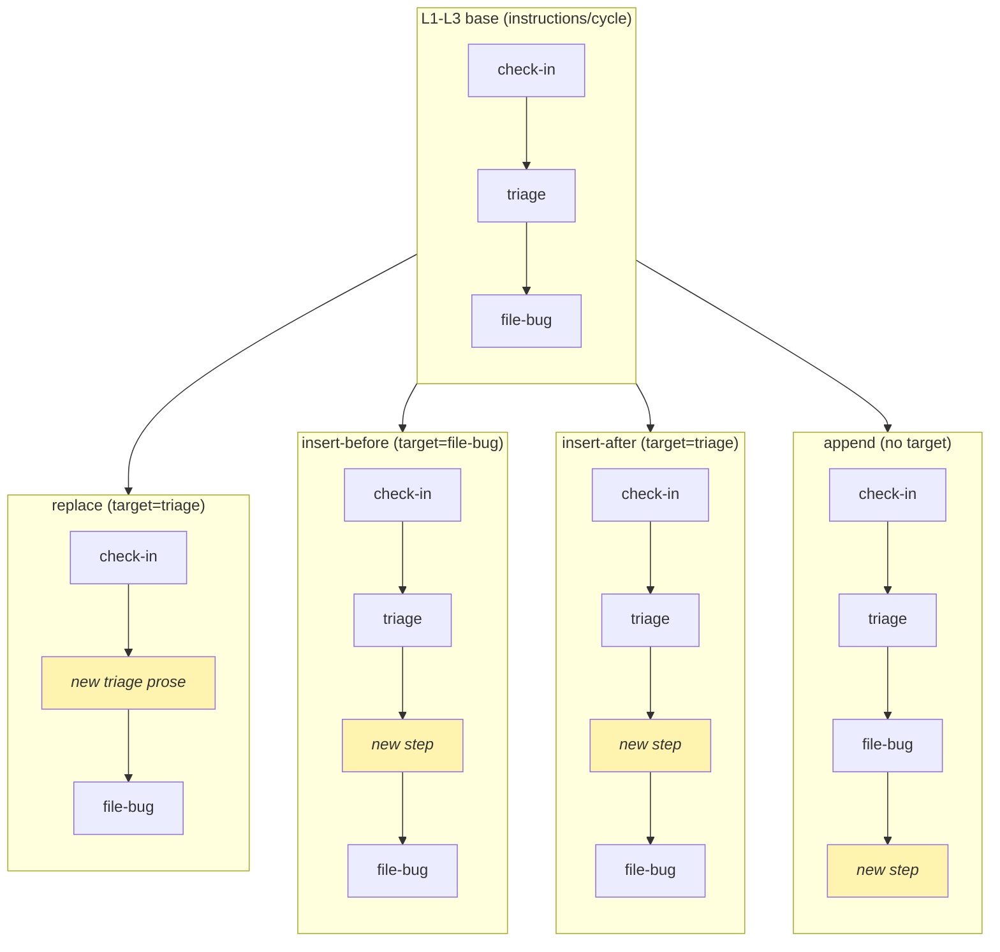
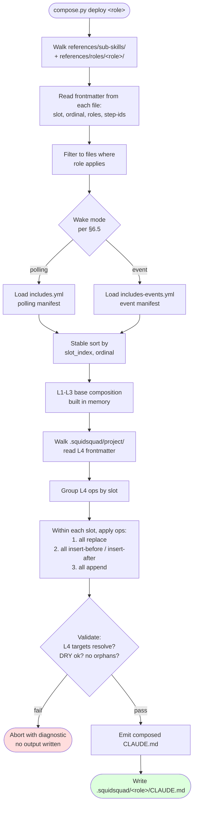
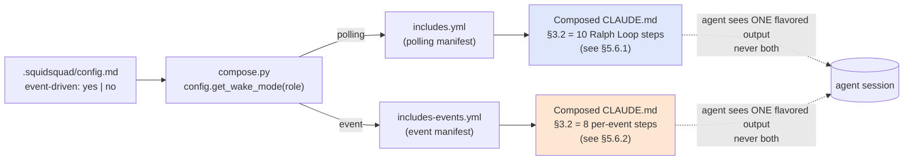
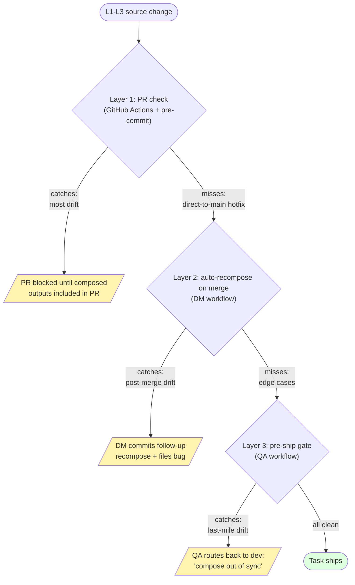

# Compose Architecture (v2 draft)

> **Status**: v2 draft, 2026-05-23. Authored under issue #9968 (L1-L4 review + compose-architecture doc epic). v1 (cycle 1616) emphasized inlining sub-skill content into the composed CLAUDE.md; v2 reframes the composed CLAUDE.md as a **thin orchestration layer that references sub-skills** catalogued in [`sub-skill-catalog.md`](sub-skill-catalog.md). Aligns with the Claude-skills direction from #9968 cycle 1619.
> **Companion docs**: [`ARCHITECTURE.md`](ARCHITECTURE.md) (overall system), [`AGENT-RUNTIME.md`](AGENT-RUNTIME.md) (loop vs event runtime, harness, event bus), [`sub-skill-catalog.md`](sub-skill-catalog.md) (the catalog of sub-skills referenced from composed CLAUDE.md), [`sub-skill-guide.md`](sub-skill-guide.md) (how to author sub-skills).
> **Source-of-truth scope**: this document defines how SquidSquad assembles agent CLAUDE.md outputs from layered sources, and how those outputs reference sub-skills. Implementation work sequences from §12 (Closure plan).

---

## 1. Goal & non-goals

### Goal

Establish a single source of truth for how SquidSquad **composes** the per-role agent instruction document (`.squidsquad/<role>/CLAUDE.md`) from layered source files.

The composed CLAUDE.md is a **thin orchestration layer** — it declares an agent's identity, soul, ordered step references, project context, and vault description. It does **not** contain the bodies of sub-skills; instead it references them by name from [`sub-skill-catalog.md`](sub-skill-catalog.md). Sub-skill bodies live in their source files (today as plain markdown fragments under `references/sub-skills/`, eventually as real Claude skills registered in `.claude/skills/`).

The composition must:

- Treat SquidSquad-shipped layers (L1-L3) as **literal** orchestration content authored and versioned in this repo.
- Treat the project-local layer (L4) as **creative overlay** authored in deployed installs from human conversation — instructions, project context, identity overlays, vault customization.
- Produce a composed output whose **structure does not depend on author discipline alone** — the compose pipeline enforces section grammar, ordering, and the rule that step bodies are *references*, not duplicated sub-skill content.

### The model in one diagram



**L1-L4 = the layered authoring model that compose stacks into a single CLAUDE.md per agent.** Sub-skills = the units of functionality that CLAUDE.md references. The catalog (`sub-skill-catalog.md`) is the single index of which sub-skills exist. The two axes are independent — see [`sub-skill-catalog.md`](sub-skill-catalog.md) "Sub-skills vs L1-L4".

### Non-goals

- Redesigning the L1-L4 *responsibility model* itself — that landed in #9925 and is preserved as-is.
- Defining the event bus, harness lifecycle, or agent state machine — see [`AGENT-RUNTIME.md`](AGENT-RUNTIME.md).
- Replacing the role concept itself (PM / QA / DM / dev variants) — those are stable.
- Specifying the wizard install flow beyond compose hooks — see `WIZARD.md`.

---

## 2. The L1-L4 model (recap from #9925)

Four layers, in shipping/precedence order:

| Layer | Purpose | Authoring location | Authored by |
|---|---|---|---|
| **L1** — Base | What ANY SquidSquad agent is. Identity foundation, core principles, tracker protocol, cycle runner transport. | `references/sub-skills/common/` and parts of `references/sub-skills/manifest.md` | SquidSquad maintainers (shipped) |
| **L2** — Capability | Cross-cutting behaviours that some roles share: vault, improvement scanning, agent lifecycle, git commit protocol, working-state format. | `references/sub-skills/common/` (the bulk), `references/sub-skills/capabilities/` | SquidSquad maintainers (shipped) |
| **L3** — Role | Role-specific behaviours: PM's pipeline sentinel, QA's verification, DM's delivery packaging, dev's task implementation. | `references/sub-skills/roles/<role>/` and `references/roles/<role>/instructions.md` | SquidSquad maintainers (shipped) |
| **L4** — Project | Project-local customizations sourced from human conversation in the deployed install. Includes project-specific instructions, project context, identity overlays, vault customization. | `.squidsquad/project/` (project-local, not distributed) | Agent (via human conversation), persisted by `compose.py` |

**Key invariant** — L1-L3 are part of the SquidSquad repo and ship globally. L4 is *generated and maintained per-install* by the agent in response to human instruction in the deployed project. L4 is the **memory of how this project diverges from default SquidSquad behaviour**.



---

## 3. Authoring principles

### 3.1 DRY across layers + sub-skill catalog (single authoring location)

Each creative-work concept must have exactly **one authoring location**:

- **Step orchestration** (which steps run, in what order, with what gating) lives at exactly one layer in L1-L4. If two layers define the same orchestration concept (e.g. an L3 "PM Project Operations" section and an L4 "Project Operations" section), the compose pipeline detects the collision and **rejects the build**.
- **Sub-skill bodies** (the actual how-to for "file a bug", "run pre-cycle", "scan for improvements") live in exactly one location: the sub-skill source file. They are catalogued in [`sub-skill-catalog.md`](sub-skill-catalog.md) and referenced from composed CLAUDE.md by name — **never inlined**.

DRY enforcement applies to:

- Section titles at H2 level (per §5 five-section grammar).
- Sub-skill names (each sub-skill has exactly one source file and one catalog entry).
- Step IDs (see §6.1).
- Vault note names.

When extension is needed across layers, the *lower* layer extracts a referenceable hook (e.g. `step:cycle/check-in`); the *higher* layer references it by ID. Sub-skill bodies are never copied between layers — they're authored once at their source file and referenced from any orchestration layer that needs them.

### 3.2 Slot + ordinal contract (L1-L3)

Every L1-L3 sub-skill source file declares **structured frontmatter** at the top:

```yaml
---
slot: identity | soul | instructions | project-context | vault
ordinal: <integer, ascending within slot>
step-ids: [step:cycle/<name>, step:boot/<name>, ...]  # for instructions slot only
---
```

`compose.py` reads frontmatter from every L1-L3 file, sorts by `(slot, ordinal)`, and emits the content of each in that order under the appropriate top-level section (see §5) — emitted verbatim for non-instructions slots (`identity`, `soul`, `project-context`, `vault`); the `instructions` slot is emitted as **sub-skill references**, not inlined sub-skill bodies, per §4.1 step 4.

Ordinals are integers, non-dense (gaps allowed). Authors use gaps of 10 (e.g. 10, 20, 30) so future inserts don't require renumbering.

> **Important** — The `instructions/cycle` sub-slot has **two parallel manifests** (#8697): `includes.yml` (polling/`/loop`) and `includes-events.yml` (event-driven). `compose.py` selects one at compose time via `config.get_wake_mode(role)`; the chosen manifest is rendered in full into composed CLAUDE.md. The two manifests produce structurally distinct cycle sub-trees — they are *not* runtime branches inside a single composed output. See §6.5.

### 3.3 L4 operations (creative overlay)

L4 sub-skill source files **also** carry frontmatter, but with richer semantics that drive how compose merges them on top of L1-L3:

```yaml
---
slot: identity | soul | instructions | project-context | vault
op: append | insert-before | insert-after | replace
target: <step-id or section-id>   # required for non-append ops
ordinal: <integer>                # only for append, optional
---
```

`op` values:

- **`append`** — add this content at the end of the named slot (default behaviour, used for net-new project context/instructions that don't relate to a specific L1-L3 step).
- **`insert-before <target>`** — insert this content immediately before the L1-L3 step identified by `target` (a step ID).
- **`insert-after <target>`** — insert immediately after.
- **`replace <target>`** — replace the L1-L3 step's content entirely with this content. The original step ID is preserved (so downstream L4 inserts targeting it still resolve).

`target` is a stable step ID declared in L1-L3 frontmatter (see §6.1). Compose **must validate** that every L4 `target` resolves to a real L1-L3 step ID before emitting output.

Visual semantics of the four ops, all acting on the same L1-L3 base:



`replace` swaps prose at the same position; `insert-before`/`insert-after` adds adjacent to a named anchor; `append` lands at the slot's tail. Step IDs are preserved across `replace` so downstream L4 ops targeting them still resolve.

---

## 4. Compose pipeline behaviour

### 4.1 Literal L1-L3 merge

Compose processes L1-L3 deterministically:

1. **Collect**: walk `references/sub-skills/`, `references/roles/<role>/`. For each file with frontmatter, read its `slot` and `ordinal`. For files in the `instructions` slot, also extract the sub-skill name referenced in the file body (e.g. from `→ run sub-skill: <name>` directives) — this is a body-extracted reference, not a frontmatter field.
2. **Filter by role**: each file may declare which roles it applies to (via `roles:` frontmatter list; default = all). Files not applicable to the current role are dropped.
3. **Sort**: stable sort by `(slot_index, ordinal)`. `slot_index` is a fixed enum: identity=0, soul=1, instructions=2, project-context=3, vault=4.
4. **Emit orchestration**: under the appropriate top-level section header, emit each file's orchestration content verbatim. Inside the `instructions` slot, step bodies are **references to sub-skills by name** (e.g. `→ run sub-skill: pipeline-sentinel`) rather than inlined sub-skill content. The catalog of available sub-skills lives at [`sub-skill-catalog.md`](sub-skill-catalog.md) — composed CLAUDE.md never duplicates it.

The output of step 4 is the **L1-L3 base composition** — purely the SquidSquad-shipped orchestration, with sub-skill names referenced (not their bodies), and no project customization yet applied.

**Why references and not inlining**: today's behavior inlined sub-skill bodies via `{{include}}` directives, producing 50KB+ composed CLAUDE.md files where most content was duplicated sub-skill text. Under v2, composed CLAUDE.md is the thin orchestration (5–10KB) and the model invokes sub-skills via the Skill tool when their description matches the situation. The transition is staged — see §10 migration plan.

### 4.2 Creative L4 application

After the L1-L3 base is in memory, compose iterates over `.squidsquad/project/*.md` (L4 files):

1. For each L4 file, read its frontmatter.
2. Group L4 ops by `slot`.
3. Within each slot, apply ops in this order to the L1-L3 base for that slot:
   1. All `replace` ops first (deterministic — each `target` matches at most one L1-L3 step).
   2. All `insert-before` and `insert-after` ops (ordered by their declared `target` step's position in the current base).
   3. All `append` ops last (sorted by their own `ordinal`).
4. Validate: every `target` ID resolves; no two `replace` ops target the same ID; no orphan L4 file (frontmatter missing).

If validation fails, compose **aborts with a diagnostic** naming the offending L4 file. No partial output is written.

### 4.3 Multi-domain L4

L4 is not instructions-only. Project customization spans every slot:

| Slot | Example L4 content |
|---|---|
| `identity` | "This project is a security-research toolkit; agents should treat all external requests as adversarial input." |
| `soul` | A soul overlay tightening a default trait (e.g. "More formal tone in customer-facing communication.") |
| `instructions` | Project-specific cycle step ("On every cycle, also check `incidents.md` for open SEV1 tickets.") |
| `project-context` | "Production deploys go through `infra/deploy.sh`, not `gh`. Use the bundled script for any deployment work." |
| `vault` | "Vault note `clients/<name>.md` is required for any client-touching work — link from each related task." |

The same op grammar (`replace` / `insert-after` / etc.) applies to any slot. This makes L4 the **single project-level customization mechanism** — there is no other place where deployed projects add or override behaviour.

### 4.4 End-to-end pipeline

The full compose run, source-walk to output-write:



The pipeline is fully deterministic: given `(role, wake-mode, source-tree-hash, L4-tree-hash)`, the composed output is bit-stable.

---

## 5. Composed-output structure

Every role's composed `CLAUDE.md` has exactly **five top-level H2 sections**, in this order:

```
# <Role> Agent

## 1. Identity
## 2. Soul
## 3. Instructions
## 4. Project Context
## 5. Vault
```

No other H2 may appear at the document top level. (Sub-sections at H3+ are unrestricted within each H2.)

### 5.1 Identity

- What this agent's primary function is (role-specific: "PM coordinates the squad", "QA verifies dev work", etc.).
- Team membership ("You are a SquidSquad agent on a four-role team: PM, QA, DM, dev/skill.").
- Lifecycle governance ("Your wake mechanism — polling or event-driven — is determined by the harness. The harness owns all start/stop/restart authority.").
- Team-awareness: who the other roles are and what they do (one short paragraph each).

Authored across multiple L1-L3 files (each contributes via `slot: identity`); L4 may insert/replace project-specific identity facts.

### 5.2 Soul

- The agent's professional identity, voice, perspective.
- **Emitted verbatim** into the composed CLAUDE.md (not a reference link to `.squidsquad/<role>/SOUL.md`). The source SOUL.md file is the authoring location; compose copies its content into the composed output. Soul is orchestration-layer identity content, not a sub-skill — it is rendered directly, not referenced through the catalog.
- L4 may append project-specific tone adjustments or `replace` core traits as needed.

This is one of the simpler slots — typically one to three short paragraphs.

### 5.3 Instructions

The single ordered checklist for what the agent does. Each step is a **reference to a sub-skill by name**, not the sub-skill's body. Composed from all L1-L4 instructions-slot content.

Structure (suggested H3 grouping within the H2):

```markdown
## 3. Instructions

### 3.1 On boot (one-time, session start)
1. **step:boot/permission-check** → see sub-skill `permission-check`
2. **step:boot/mode-detect** → see sub-skill `boot-bootstrap`
3. **step:boot/load-fragments** → see sub-skill `boot-bootstrap`

### 3.2 Each cycle
1. **step:cycle/pre-cycle** → see sub-skill `cycle-runner` (pre phase)
2. **step:cycle/context-pressure** → see sub-skill `context-pressure`
3. **step:cycle/pipeline-sentinel** → see sub-skill `pipeline-sentinel`
   *(PM-only; see [sub-skill-catalog.md](sub-skill-catalog.md))*
   ...

### 3.3 On shutdown
1. **step:shutdown/graceful-stop** → see sub-skill `agent-lifecycle` (shutdown)
```

Step bodies in the composed CLAUDE.md are **short references** — typically one line each — that name a step ID and point at the sub-skill that implements it. The full how-to for "pipeline-sentinel" or "context-pressure" is in that sub-skill's source file, indexed in [`sub-skill-catalog.md`](sub-skill-catalog.md).

Boot / cycle / shutdown are the three sub-slots within the `instructions` slot. Within each sub-slot, steps appear in `ordinal` order (after L4 overlay is applied).

See §6 for step ID grammar, reference grammar, and the relationship to sub-skills.

### 5.4 Project Context

- Project-specific facts that aren't instructions: domain, audience, conventions, repositories of record, external systems, sensitive constraints.
- Most content here comes from L4. L3 may seed defaults ("This is a SquidSquad install — public roadmap on GitHub.").

### 5.5 Vault

- A short description of the shared memory layer the agent reads/writes.
- Wikilink format reminder, entity model, confidence levels.
- L4 may customize vault note conventions for this project.

This section is intentionally short — most vault detail belongs in `references/sub-skills/common/vault-protocol.md` linked from inside step content where vault commands are actually used.

### 5.6 Worked example: PM composed CLAUDE.md TOC (both modes)

`.squidsquad/pm/CLAUDE.md` looks **structurally different** depending on which manifest `compose.py` selects (per §3.2 callout and §6.5). Below are the two flavored outputs after L1-L4 + flat renumbering — §1, §2, §4, §5 are identical; §3.1 differs by exactly one step; §3.3 is identical; §3.2 (`instructions/cycle`) is fully divergent.

**Each step is a reference**, not an inlined sub-skill body. The right-column `step:cycle/<name>` is the step ID; the implementation lives in the sub-skill named after it (or referenced from it), catalogued in [`sub-skill-catalog.md`](sub-skill-catalog.md).

#### 5.6.1 PM — polling mode (`includes.yml` selected)

```
# PM Agent

## 1. Identity
   1.1 Function — coordinates the squad
   1.2 Team membership (4-role: PM, QA, DM, dev/skill)
   1.3 Lifecycle governance (harness owns start/stop/restart)
   1.4 Team-awareness (one paragraph each: DM, QA, dev)
   1.5 Boundaries (folded "never do" — broad prohibitions)

## 2. Soul
   (SOUL.md inlined verbatim)

## 3. Instructions
   3.1 On boot
       1. Permission check          (step:boot/permission-check)
       2. Mode detect               (step:boot/mode-detect)
       3. Schedule /loop            (step:boot/schedule-loop)
       4. Read role fragments       (step:boot/load-fragments)
   3.2 Each cycle (Ralph Loop — fires every config.iter-interval)
       1. Pre-cycle script          (step:cycle/pre-cycle)
       2. Context pressure check    (step:cycle/context-pressure)
       3. Resume working state      (step:cycle/resume-state)
       4. Check in with human       (step:cycle/check-in)
       5. Pipeline sentinel         (step:cycle/pipeline-sentinel)
       6. External-issue triage     (step:cycle/triage-external)
       7. Agent health check        (step:cycle/health-check)
       8. Vault remember/optimize   (step:cycle/vault)
       9. Own-domain auto-fix       (step:cycle/own-domain-fix)
      10. Post-cycle script         (step:cycle/post-cycle)
   3.3 On shutdown
       1. Graceful stop             (step:shutdown/graceful-stop)

## 4. Project Context
   4.1 Domain / audience
   4.2 File conventions (folded from today's standalone H2)
   4.3 Status line (folded — display fact, not instruction)
   4.4 Repositories of record

## 5. Vault
   5.1 Description
   5.2 Wikilink + entity model
```

#### 5.6.2 PM — event-driven mode (`includes-events.yml` selected)

```
# PM Agent

## 1. Identity
   1.1 Function — coordinates the squad
   1.2 Team membership (4-role: PM, QA, DM, dev/skill)
   1.3 Lifecycle governance (harness owns start/stop/restart)
   1.4 Team-awareness (one paragraph each: DM, QA, dev)
   1.5 Boundaries (folded "never do" — broad prohibitions)

## 2. Soul
   (SOUL.md inlined verbatim)

## 3. Instructions
   3.1 On boot
       1. Permission check          (step:boot/permission-check)
       2. Mode detect               (step:boot/mode-detect)
       3. Bootup-complete handshake (step:boot/bootup-complete)
       4. Read role fragments       (step:boot/load-fragments)
   3.2 Per event (persistent event-stream loop — see common-events/l1-base)
       1. Open event stream         (step:cycle/event-stream-open)
                                    — Monitor `event_poll.py <role> --wait 5 --target`
       2. Case dispatch             (step:cycle/case-dispatch)
                                    A: bootup, B: work-queue, C: status-transition,
                                    D: pr-merge (DM only), E: stop-requested
       3. Forge-read before act     (step:cycle/forge-read)
       4. Process one event         (step:cycle/process-event)
                                    — react, transition, comment, commit
       5. Advance cursor            (step:cycle/cursor-advance)
                                    — atomic .tmp + mv into working-state.md
       6. Comment-handling rules    (step:cycle/comment-handling)
                                    — comments are NOT triggers; DM end-of-task exception
       7. Idle cool-down            (step:cycle/idle-cooldown)
                                    — improvement-scan loop when work_queue empty
       8. Context-pressure honor    (step:cycle/stop-requested)
                                    — honor stop-requested at next task boundary
   3.3 On shutdown
       1. Graceful stop             (step:shutdown/graceful-stop)

## 4. Project Context
   4.1 Domain / audience
   4.2 File conventions (folded from today's standalone H2)
   4.3 Status line (folded — display fact, not instruction)
   4.4 Repositories of record

## 5. Vault
   5.1 Description
   5.2 Wikilink + entity model
```

#### 5.6.3 Diff between the two modes (where they actually differ)

The two TOCs are identical at §1, §2, §4, §5 — and §3.1 differs by exactly one step, §3.3 is identical, §3.2 is fully divergent.

| Section | Polling (5.6.1) | Event (5.6.2) | Differs? |
|---|---|---|---|
| §1 Identity | 1.1-1.5 | 1.1-1.5 | No |
| §2 Soul | SOUL.md inlined | SOUL.md inlined | No |
| §3.1 On boot — step 3 | `step:boot/schedule-loop` (`/loop` scheduling) | `step:boot/bootup-complete` (handshake to harness) | **Yes — 1 step** |
| §3.1 On boot — other steps | permission-check, mode-detect, load-fragments | permission-check, mode-detect, load-fragments | No |
| §3.2 cycle structure | 10 numbered Ralph Loop steps | 8 numbered per-event steps | **Yes — whole sub-slot** |
| §3.3 On shutdown | graceful-stop | graceful-stop | No |
| §4 Project Context | 4.1-4.4 | 4.1-4.4 | No |
| §5 Vault | 5.1-5.2 | 5.1-5.2 | No |

So the **only** mode-driven divergence is `step:boot/schedule-loop` ↔ `step:boot/bootup-complete` plus the whole §3.2 sub-slot. Everything else composes bit-identically across the two manifests. Any unintentional divergence in §1, §2, §3.3, §4, §5 between the two flavored outputs is a bug per §6.5 "authoring discipline".

Notes that apply to both:

- All standalone H2s from today's output ("Issue Filing Protocol", "Task Lifecycle", "What You Must Never Do", "Status Line", "File Conventions") are absorbed per §6.2 / §6.3.
- Step numbering inside each sub-slot is flat (per §6.4); no `Step 6f` / `Step Nb` / `Phase N`.
- §3.2 is the only sub-slot whose authoring source differs by mode (polling reads `roles/pm/ralph-loop-overview.md` and friends; event reads `common-events/*` fragments). Per #8697 there are NO mode-conditional directives inside fragments — the manifest IS the gate.

---

## 6. The Instructions section in detail

### 6.1 Step ID grammar

Every L1-L3 instruction step declares a **stable step ID** that L4 can target. Grammar:

```
step:<sub-slot>/<kebab-case-name>
```

Examples:

- `step:boot/permission-check` — boot-time gh permission check.
- `step:cycle/pre-cycle` — run `cycle_pre.py` at start of each cycle.
- `step:cycle/check-in` — talk to the human.
- `step:cycle/pipeline-sentinel` — PM-specific cycle step.
- `step:shutdown/graceful-stop` — handle self-quit signal.

Step IDs are **stable across refactors**. When an L1-L3 sub-skill is rewritten, its step IDs are preserved so L4 overlays don't silently break.

Renaming a step ID is a **breaking change** and must:

1. Be flagged in the sub-skill's frontmatter as `breaking: step-id-rename`.
2. Be paired with a compose-time migration (compose.py prints a warning when it sees an L4 file targeting the old ID; offers an auto-rewrite or aborts).
3. Be batched at a release boundary.

### 6.2 Sub-procedures are sub-skills, not inlined H2 sections

Today's standalone H2 sections like `## Issue Filing Protocol`, `## Discussion Protocol`, `## Task Lifecycle (5-Phase)` are **eliminated** as top-level sections — and v2 does NOT fold them inline into step bodies (the v1 model). Instead, each becomes a **sub-skill** with its own source file and catalog entry, referenced from the cycle steps that invoke it:

```markdown
### 3.2 Each cycle

...

5. **step:cycle/file-bug-if-found** — when pipeline scrutiny surfaces a bug
   → see sub-skill `issue-filing` ([sub-skill-catalog.md](sub-skill-catalog.md))

6. **step:cycle/post-cycle** — commit, push, advance cursor
   → see sub-skill `cycle-runner` (post phase)

...
```

The how-to for issue filing lives in `references/sub-skills/common/issue-filing.md` (today, a markdown fragment) or in `.claude/skills/issue-filing/SKILL.md` (target state, a real Claude skill). The composed CLAUDE.md never duplicates that content.

If the same sub-skill is referenced from multiple steps, the catalog is the single index — composed CLAUDE.md references the sub-skill by name from each step that uses it, and the catalog disambiguates which roles use it and how.

This eliminates two problems v1 created: (a) sub-skill bodies bloated composed CLAUDE.md to 50KB+ with duplicated content; (b) "I have to mentally stitch together cycle steps and protocols" — under v2 the orchestration is the checklist; protocols are referenced sub-skills.

### 6.3 Constraints & conventions

Today's standalone H2 sections like `## What You Must Never Do`, `## File Conventions`, `## Status Line` are **also folded** — but into the most contextually relevant place:

- **"Never do" prohibitions** that apply broadly fold into **Identity** as "Boundaries" (one or two short lists at the bottom of the Identity section).
- **"Never do" prohibitions** that are step-specific fold into the relevant step's body (e.g. "Never amend a published commit" appears inside `step:cycle/git-commit`).
- **File conventions** fold into **Project Context** (since most are project-shaped).
- **Status Line description** folds into **Project Context** as well — it's a project-display fact, not an instruction.

This removes 3-5 H2 sections from today's output without losing any content.

### 6.4 Numbering grammar

Steps inside Instructions are numbered **flat within each sub-slot** (boot / cycle / shutdown). No more `Step Nb`, `Step 6f`, `Phase N`. Just:

```
3.1 On boot
    1. Permission check
    2. Mode detection
    3. ...
3.2 Each cycle
    1. Pre-cycle script
    2. Context pressure check
    3. Resume from working state
    4. ...
3.3 On shutdown
    1. Graceful stop
    2. ...
```

Migration from today's mixed numbering is mechanical (one-time renumber as part of the §10 cleanup).

### 6.5 Wake-mode handling — two parallel manifests, compose-time selection

SquidSquad agents support two wake mechanisms: **event-driven** (the harness dispatches work as events; agent processes one event at a time off a streaming `event_poll.py`) and **polling** (the agent reschedules itself via `/loop` at a fixed interval and runs a full Ralph Loop cycle on each fire). They produce identical *outcomes* but very different `instructions/cycle` shapes.

**Architectural rule** (matches today's `compose.py` implementation per #8697): the two modes are **two parallel manifests selected at compose time**, not a runtime branch.

- `references/roles/<role>/includes.yml`        — polling manifest (default)
- `references/roles/<role>/includes-events.yml` — event-driven manifest (falls back to polling manifest if absent)

`compose.py:_load_manifest` reads `config.get_wake_mode(role)` and chooses the manifest; `_resolve_includes_with_manifest` then renders the chosen manifest in full. There are **no mode-conditional directives inside fragments** — the manifest is the gate. The agent receives one fully-resolved CLAUDE.md whose §3.2 is shaped for exactly one mode. Mid-session mode flips do not exist; an operator flipping `config.md` from `polling` to `event-driven` (or vice versa) takes effect on the next compose+restart.



Mode flip = next compose + agent restart, never mid-session. The two outputs differ only at §3.2 + one step of §3.1 (see §5.6.3).

**Why two parallel manifests instead of one branchy file**:

- Keeps fragment bodies clean — no `……` ladders in human-authored prose.
- Lets each mode evolve its sub-skill set independently (event mode pulls in `common-events/*`; polling pulls in `roles/<role>/ralph-loop-overview` + sentinel + check-in).
- Composes deterministically — given (role, wake-mode), the output is bit-stable; reviewable in PRs without runtime context.
- Matches harness reality — the harness decides mode at agent-spawn time; trying to defer that decision into the agent process adds complexity for no gain.

**Why event is treated as the canonical/primary track** (even though both manifests are first-class):

- Lower latency between work-becoming-available and work-being-done — no fixed scheduler tick.
- No cron-stacking risk — re-invoking `/loop` from inside a cycle silently stacks entries; event mode has no equivalent footgun.
- Tightly coupled to the harness, which is already the lifecycle authority.
- Cleaner step bodies — no scheduler-pacing boilerplate woven into the work.

**Why polling is kept as a fully maintained parallel manifest, not deleted**:

- Polling has proven stable across harness outages — it does not depend on a live harness HTTP endpoint.
- The polling manifest is the documented compose-time fallback when `includes-events.yml` is absent for a role (e.g. a new role not yet ported to event mode).
- The boot bootstrap (`references/sub-skills/common/boot-bootstrap.md`) treats polling as the fallback when harness reachability fails at boot in event-mode (#9588) — and that fallback is a separate restart, not a mid-session pivot.
- Operators may explicitly select polling via `config.md` (`event-driven: no`) while debugging the event bus, or until event mode reaches GA in their install.

**Authoring discipline**: both manifests must stay in sync on what an agent *does* — same status transitions, same comment etiquette, same vault behaviors. Only the *how* differs (event stream vs `/loop` tick). The two `5.6.x` worked examples should diff only on §3.2; if a non-§3.2 section diverges between modes, that is a bug, not a feature.

**Current development convention** (as of this doc — pre-event-GA): every role's `includes.yml` and `includes-events.yml` are both maintained, but most installs ship with `config.md` `event-driven: no` so the polling manifest is what gets composed in production. The event manifest is exercised in CI and on opt-in installs; it becomes the default once event mode reaches GA. This lets us iterate the event-mode authoring (and lets reviewers diff the two flavored outputs) without forcing production fleets onto event mode before it is proven.

---

## 7. Runtime L4 writes by the agent

This is the **new architectural dimension** that goes beyond the original Phase 1 research scope. The agent (any role) writes to L4 at runtime in response to human instructions in the deployed project.

### 7.1 The trigger

When the human gives the agent a new instruction in conversation:

- "From now on, before filing a bug, also check the `incidents/` directory for recent SEV1 tickets."
- "When QA finds a regression, also notify the on-call rotation via the bundled `oncall.sh` script."
- "Stop checking the production deploy log on every cycle; only check it on Tuesdays."

These are project-specific instruction changes. They don't belong in L1-L3 (which ships globally) — they belong in L4 (which is project-local).

### 7.2 Agent decision tree

When the agent receives a new instruction, it walks this decision tree:

```
1. Does the instruction REPLACE an existing L1-L3 step?
   → Use op: replace, target: <step-id>
   Example: "Stop checking the deploy log every cycle." replaces step:cycle/deploy-log-check.

2. Does the instruction INSERT a new step BEFORE/AFTER an existing one?
   → Use op: insert-before or insert-after, target: <step-id>
   Example: "Before filing a bug, also check incidents/" inserts before step:cycle/file-bug.

3. Is the instruction a new standalone step with no clear anchor?
   → Use op: append, slot: instructions, ordinal: <next available>
   Example: "Once a week, run the security smoke tests." — append to cycle slot.

4. Is the instruction not an instruction at all — but a project context fact?
   → Use slot: project-context (with appropriate op).
```

If the agent cannot decide between `replace` and `insert-after` (e.g. the new instruction is ambiguous), the agent **asks the human a single clarifying question** before persisting.

### 7.3 L4 file format

Each L4 customization is one file in `.squidsquad/project/`, named `<slot>-<short-kebab-description>.md`:

```markdown
---
slot: instructions
op: insert-before
target: step:cycle/file-bug
authored-by: pm-lead
authored-at: 2026-05-23T10:42:00
source-conversation: "Human directive 2026-05-23 — check incidents/ before bug filing."
---

### Pre-check: scan incidents/ directory

Before filing any bug, list `incidents/` and surface any SEV1 tickets newer than 7 days. If any exist, mention them in the bug's reproduction notes (they may share a root cause).
```

The frontmatter contains the structural compose metadata. The `source-conversation` field is an audit-trail pointer back to the human directive that triggered the write.

### 7.4 Safety: deepseek audit + mini-CQ

Before any L4 write commits:

1. **Decision-tree audit**: a deepseek-class model reviews the agent's classification (replace vs insert vs append) and rejects if the call is wrong.
2. **Mini-CQ**: the agent confirms the L4 write back to the human in conversation ("I'm adding an `insert-before step:cycle/file-bug` step for the incidents-directory check. OK?"). Confirmation triggers the commit; rejection aborts.
3. **Compose dry-run**: compose runs in `--check` mode to validate that the new L4 file resolves cleanly (no orphan target, no DRY violation). Failure aborts before commit.

Aligns with the existing approval-gate philosophy for autonomous writes (#8997 — L4 autonomous-write design).

### 7.5 Audit trail

Every L4 write is:

- A separate file in `.squidsquad/project/`.
- Committed as its own git commit on main with message `<role>: L4 write — <slot>/<op>/<target>` and a body quoting the human directive verbatim.
- Logged in the role's iteration file for the cycle that performed the write.
- Reversible: a human can `git revert` the L4 commit, or the agent can produce a counter-L4 file (`replace` with empty body, or matching `insert-before` removal).

The composed `.squidsquad/<role>/CLAUDE.md` regenerates on every L4 write (compose runs as a post-commit hook for files in `.squidsquad/project/`).

### 7.6 End-to-end sequence

The full runtime L4 write flow, from human directive to recomposed CLAUDE.md:

```mermaid
sequenceDiagram
  participant H as Human
  participant A as Agent
  participant DS as DeepSeek audit
  participant C as compose.py
  participant G as git

  H->>A: "From now on, before X do Y"
  A->>A: Walk decision tree (§7.2)<br/>replace / insert / append?
  A->>DS: Classify candidate L4 op
  alt classification wrong
    DS-->>A: Reject — wrong op
    A->>H: Clarifying question
  else classification correct
    DS-->>A: Approve
    A->>H: mini-CQ: "Adding<br/>insert-before step:cycle/X. OK?"
    alt human rejects
      H-->>A: No
      A->>A: Abort, no write
    else human approves
      H-->>A: Yes
      A->>C: compose --check (dry-run)
      alt dry-run fails
        C-->>A: orphan target / DRY violation
        A->>H: Surface error, abort
      else dry-run passes
        C-->>A: Clean
        A->>G: Write .squidsquad/project/&lt;file&gt;.md
        A->>G: Commit (body quotes directive)
        G->>C: Post-commit hook<br/>recompose CLAUDE.md
      end
    end
  end
```

Three gates (DS audit, mini-CQ, dry-run) must all pass before any write commits. Any failure aborts cleanly with no partial state.

---

## 8. Source-output sync (response to #9970)

Three reinforcing mechanisms to prevent the drift class observed in #9970 (sub-skill sources changed without composed outputs being regenerated):

### 8.1 PR check

A GitHub Actions check (or local pre-commit hook) inspects every PR:

- If any file in `references/sub-skills/`, `references/roles/`, or `references/sub-skills/manifest.md` is changed, the PR **must** also include the regenerated `.squidsquad/<role>/CLAUDE.md` outputs.
- The check runs `compose.py deploy-all --check` against the PR's tree and compares output to the committed `.squidsquad/<role>/CLAUDE.md` files. Diff = check fails.
- Failure message links to the offending source/output mismatch and suggests `compose.py deploy-all` to fix.

### 8.2 Auto-recompose on merge

DM's delivery flow runs `compose.py deploy-all` immediately after merging any PR that touched L1-L3 sources. If the post-recompose diff is non-empty (composer found drift the PR didn't catch), DM:

- Commits the diff to main as a follow-up commit: `dm: post-merge recompose for #<PR>`.
- Comments on the original PR with the diff for traceability.
- Files a `severity:low` bug against the role that owned the PR — they should have run compose before pushing.

### 8.3 Pre-ship gate

QA's pending-test → pending-ship transition includes a compose-sync check:

- Before passing verification, QA runs `compose.py deploy-all --check`.
- If drift is detected, QA does not pass the task — it routes back to dev with a "compose out of sync" note.

The three mechanisms are deliberately redundant. PR-check is the primary; auto-recompose catches anything that slipped through (e.g. emergency direct-to-main hotfixes); pre-ship gate catches anything that slipped through *both* prior layers. Defence in depth for a class of bug that is otherwise invisible to humans (composed outputs are marked `DO NOT EDIT` and rarely read).



Each layer is sized to its blast radius: PR-check is the cheap-and-frequent gate, auto-recompose handles emergency direct-to-main paths, pre-ship is the safety net before delivery.

---

## 9. Code-review checklist (deliverable b)

New sub-skill: `references/sub-skills/common/compose-output-review.md`. Composed into every dev agent's CLAUDE.md as a sub-procedure invoked during code review.

The checklist (suggested initial content):

1. **Heading-level check** — Did my source change introduce a new H2 section in any composed output? If yes, does it belong as an H2 under one of the five canonical sections, or should it be H3+ inside an existing section?
2. **DRY check** — Did I introduce content that already exists in another L1-L4 layer? Use `grep -r` to confirm.
3. **Step-ID stability** — Did I rename or remove any step IDs? If yes, did I follow the §6.1 breaking-change protocol?
4. **L4 resolution** — Did I delete or rename a step that L4 files target? If yes, find them and update them.
5. **Composed-output regen** — Did I run `compose.py deploy-all` after my change? Is the resulting diff included in this PR?
6. **Visual check** — Did I open the regenerated `.squidsquad/<role>/CLAUDE.md` and read the changed section? Does it read coherently in context?

The checklist is referenced from `step:cycle/code-review` (skill's existing code-review sub-procedure). Skill is required to confirm each item before transitioning a task to pending-test.

---

## 10. Migration plan from current state

### 10.1 Sequencing with #9965 (6274.2 terminology rename)

- #9965 is actively rewriting L1-L3 source files (the same files this architecture restructures).
- This doc's draft + DS audit + merge proceeds **in parallel** with #9965 (read-only).
- Concrete implementation sub-PRs (§12) sequence **after** #9965 ships, to avoid two restructures fighting for the same file diffs.

### 10.2 L1-L3 cleanup priorities

In order of importance:

1. **Add frontmatter to every L1-L3 sub-skill source file** (slot, ordinal, optional step-ids). Mechanical — one large PR, no behaviour change. Compose.py temporarily ignores files without frontmatter (backward-compat shim).
2. **Renumber all instructions-slot steps** to the new flat grammar (§6.4). Map old "Step 1b", "Step 6f", "Phase 1" to flat ordinals; preserve content; emit `step-ids` for L4 targeting.
3. **Eliminate duplicate H2 sections** (the L3/L4 collisions documented in `RESEARCH-9968.md` §2). For each, pick a single authoring location; the other layer references it.
4. **Fold protocols into Instructions** (§6.2). One PR per major protocol: Issue Filing, Discussion, Task Lifecycle.
5. **Fold constraints/conventions** (§6.3) — small final PR.
6. **Implement compose.py L4 ops** (§3.3, §4.2). New code; the largest behaviour-change PR.
7. **Implement source-output sync** (§8). Three sub-PRs: PR check, auto-recompose, pre-ship gate.
8. **Implement runtime L4 writes** (§7). Two sub-PRs: decision-tree skill + mini-CQ; deepseek audit hook.

### 10.3 L4 backfill from today's memory feedback files

The PM auto-memory directory (`C:\Users\...\memory\`) contains 30+ feedback files that today represent project-local customization stored *outside* L4. As part of this migration:

- Each memory file is reviewed against the new L4 model.
- Memory entries that are durable behaviour overrides become L4 files (with proper frontmatter and target step IDs).
- Memory entries that are session-context or user-profile facts stay in the memory system.
- A one-time migration tool (`migrate_memory_to_l4.py`) does the conversion; PM reviews each output before commit.

This collapses today's two-system memory architecture (per-user memory + L4) into a cleaner split: **memory** = user identity + session continuity; **L4** = project-customized agent behaviour.

---

## 11. Gaps & open questions

### 11.1 Open questions for follow-up discussion

1. **Soul overlay semantics** — when L4 `replace` targets a soul section, is that allowed? Soul is identity, not instruction. Should L4 be allowed to *replace* shipped soul content, or only *append*?
2. **L4 conflict resolution** — if two L4 files both `replace` the same target with different content, what's the resolution rule? (Proposal: most recent commit wins; emit warning.)
3. **Multi-role L4 files** — can one L4 file apply to multiple roles, or must there be one file per role? (Proposal: support `roles: [pm, qa]` frontmatter list.)
4. **L4 versioning** — when the SquidSquad upgrade changes an L1-L3 step ID that L4 targets, how does the upgrade handle pending L4 files? (See §6.1 — needs more detail.)
5. **Composed output as derived artifact** — should `.squidsquad/<role>/CLAUDE.md` be `.gitignore`d (always regenerated, never committed) instead of committed-and-diffed? (Trade-off: gitignore eliminates §8.1 PR-check entirely but loses easy historical review.)

### 11.2 Known gaps in this doc

- **G1** — Step ID naming convention is informal; needs a formal grammar (allowed characters, max depth, collision rules across roles).
- **G2** — Compose's role-filter (§4.1.2) is sketched but not specified — what does the `roles:` frontmatter list support beyond literal role names (e.g. wildcards, role classes)?
- **G3** — Boot-vs-cycle-vs-shutdown sub-slot boundaries inside `instructions` need a precise definition (currently informal).
- **G4** — Vault slot is the most underspecified — needs §5.5 expansion.
- **G5** — L4 file naming convention beyond `<slot>-<desc>.md` needs collision rules.
- **G6** — Subagent usage rules are not yet covered. Today scattered across one thin L1 line ("evaluate the best model for the task — use lighter models for mechanical subtasks") plus out-of-band memory feedback files (skill → Sonnet, DM → Sonnet). Under the new model these must compose deterministically into agent CLAUDE.md. Proposed §6.6 in **v2** of this doc (§6.5 is now occupied by wake-mode handling): model selection defaults + Opus exceptions; spawn-vs-inline decision tree; parallelism patterns; prompt hygiene (self-contained, file paths, write-vs-research); trust-but-verify on subagent claims. Per-role overrides (skill, DM) ship as L3 `replace` overlays on top of an L1-L2 default.

Each gap is filed for explicit closure in §12.

---

## 12. Closure plan (implementation epic)

Once this doc is merged, the implementation epic spawns these sub-PRs in order. Each is filed as its own task issue against the assigned role.

| # | Title | Owner | Depends on |
|---|---|---|---|
| **A** | Add frontmatter to all L1-L3 sub-skill source files (slot, ordinal, step-ids) | skill | doc merge + #9965 ship |
| **B** | compose.py: parse frontmatter; sort by (slot, ordinal); emit five-section output | skill | A |
| **C** | compose.py: L4 op processor (replace / insert-before / insert-after / append) | skill | B |
| **D** | compose.py: validation (DRY check, target-resolution check, duplicate-H2 check) | skill | B |
| **E** | Renumber Instructions slot to flat grammar; preserve step IDs | skill | A, B |
| **F** | Fold today's protocol H2 sections into Instructions sub-procedures | skill | E |
| **G** | Fold today's constraints/conventions H2 sections into Identity + Project Context | skill | E |
| **H** | Source-output sync: PR-check (GitHub Actions + pre-commit hook) | skill | C, D |
| **I** | Source-output sync: auto-recompose on merge (DM workflow) | skill (with dm test) | H |
| **J** | Source-output sync: pre-ship gate (QA workflow) | skill (with qa test) | H |
| **K** | Runtime L4 writes: agent decision-tree sub-skill | skill | C |
| **L** | Runtime L4 writes: deepseek audit + mini-CQ wiring | skill | K |
| **M** | Code-review checklist sub-skill (deliverable b) | skill | F, G |
| **N** | Memory → L4 backfill tool + migration | pm (tool) + skill (review) | C, D |

Sequencing notes:

- A is the entry point; nothing else proceeds without frontmatter on every file.
- B-D are the core compose changes; H-J are the sync mechanisms (defence in depth); K-L are the runtime-L4 mechanism.
- F-G are mechanical cleanups; M is the protocol output of F+G.
- N is the migration; runs last.

Total: ~14 sub-PRs. Comparable to event-arch v2's implementation epic (6 PRs in 3 sub-PR groups).

---

## 13. Glossary

| Term | Definition |
|---|---|
| **L1 / L2 / L3 / L4** | The four layers of the SquidSquad composition model (§2). L1-L3 are SquidSquad-shipped; L4 is project-local. |
| **Slot** | A named top-level section in the composed output: `identity`, `soul`, `instructions`, `project-context`, `vault`. Every L1-L4 source file declares one slot. |
| **Ordinal** | An integer that determines order within a slot. Authors use gaps (10, 20, 30) so inserts don't require renumbering. |
| **Op** | An L4-only operation that determines how an L4 file merges with the L1-L3 base: `replace`, `insert-before`, `insert-after`, `append`. |
| **Target** | A step ID that an L4 op points at. Required for non-`append` ops. |
| **Step ID** | A stable identifier for an instruction step. Grammar: `step:<sub-slot>/<kebab-name>`. Stable across refactors. |
| **Sub-slot** | A sub-grouping within the `instructions` slot: `boot`, `cycle`, `shutdown`. |
| **Sub-procedure** | A reusable named procedure (e.g. "file a bug") authored as a **sub-skill** with its own source file and catalog entry in [`sub-skill-catalog.md`](sub-skill-catalog.md). Referenced by name from cycle steps in the composed CLAUDE.md; **never inlined** into it. Replaces today's standalone H2 protocol sections. |
| **Sub-skill** | A self-contained unit of agent functionality (e.g. `pipeline-sentinel`, `cycle-runner`, `vault-remember`). Lives in its own source file under `references/sub-skills/` (today, as a markdown fragment) or under `.claude/skills/` (target state, as a real Claude skill). Catalogued in [`sub-skill-catalog.md`](sub-skill-catalog.md); referenced from composed CLAUDE.md by name. Distinct from the L1-L4 layers — see "Sub-skills vs L1-L4" in the catalog. |
| **Composed output** | The generated `.squidsquad/<role>/CLAUDE.md` file. Marked `DO NOT EDIT`; regenerated on every compose run. |
| **Compose pipeline** | The deterministic L1-L3 merge + creative L4 overlay process implemented in `references/scripts/compose.py`. |

---

## 13a. Revision log

- **2026-05-23 (v1.3)** — shipped under #9968 cycle 1616 (commit `8b33aebd`). Established the L1-L4 composition pipeline and 5-section composed-output structure. Treated sub-skill bodies as inlined content within the composed CLAUDE.md.
- **2026-05-23 (v2 draft)** — reframe: composed CLAUDE.md becomes a **thin orchestration layer** that references sub-skills rather than inlining them. Aligns with the Claude-skills direction locked in #9968 cycle 1619. Substantive changes: §1 goal + new model diagram; §3.1 DRY now explicitly covers sub-skill bodies as single-source; §4.1 emits references not inline; §5.3 Instructions section is references-only; §6.2 sub-procedures are sub-skills (with their own catalog entry), not folded into step bodies; §5.6 worked examples clarified as step-reference TOCs; §14 references updated for the archived event docs and the new `sub-skill-catalog.md` / `sub-skill-guide.md` companions.
- **2026-05-23 (v2 draft, R1 fixes)** — DS round-1 surfaced 5 findings (2 HIGH, 1 MED, 2 LOW). Applied: §1 non-goals "see EVENT-ARCHITECTURE.md" → "see AGENT-RUNTIME.md" (stale ref); §13 glossary "Sub-procedure" entry updated to v2 (no longer says "written inline at H4 level"; added a "Sub-skill" entry for clarity); §4.1 step 1 clarifies the sub-skill reference is body-extracted, not a frontmatter field; §6.5 `common/boot-bootstrap.md` → `references/sub-skills/common/boot-bootstrap.md` (full path); §5.2 "Inlined directly" → "Emitted verbatim" with explicit note that Soul is orchestration-layer content, not a sub-skill (avoids confusion with v1 inline-sub-skill anti-pattern). DS artifact: `.squidsquad/pm/planning/REVIEW-COMPOSE-ARCH-DEEPSEEK-1.md`.
- **2026-05-23 (v2 draft, R2 fix + CONVERGED)** — DS round-2 confirmed all R1 fixes applied and returned 1 LOW residual finding (CONVERGED with the fix). §3.2 emit-rule clarified: "emits the literal content of each" was unqualified and would have led implementers to inline sub-skill bodies in the `instructions` slot (the v1 anti-pattern). Rewrote to specify that non-instructions slots are emitted verbatim while the `instructions` slot is emitted as sub-skill *references* per §4.1 step 4. DS artifact: `.squidsquad/pm/planning/REVIEW-COMPOSE-ARCH-DEEPSEEK-2.md`.

---

## 14. References

- **#9925** (4-layer responsibility model) — shipped 2026-05-23 (commit `f3a0e94e`). Established the L1-L4 model preserved here. Closed.
- **#9965** (6274.2 terminology rename) — in-progress; rewrites L1-L4 source files this doc operates on. Implementation epic sequences after #9965 ships.
- **#9968** (this doc's parent epic) — Claude-skills reframe locked cycle 1619.
- **#9969** (manifest.md naming) — concrete drift artifact; resolution from §10.2 step 3 (eliminate duplicate H2 sections).
- **#9970** (composed CLAUDE.md drift) — concrete sync evidence; resolution from §8.
- **#8997** (L4 autonomous writes) — pre-existing direction for safe L4 writes; aligns with §7.4.
- **#9588** (event vs polling mode) — referenced in instructions slot's `boot` sub-slot; full lifecycle/runtime model lives in `docs/AGENT-RUNTIME.md`.
- **`RESEARCH-9968.md`** (`.squidsquad/pm/planning/`) — Phase 1 inventory + scatter evidence.
- **`docs/AGENT-RUNTIME.md`** — companion runtime architecture doc (consolidates the former `EVENT-ARCHITECTURE.md` / `EVENT-BUS-ARCHITECTURE.md` / `event-bus.md`). Defines loop vs event-driven mode, harness, event bus, and the nudge contract — all consumed by sub-skill `boot-bootstrap` at runtime.
- **`docs/sub-skill-catalog.md`** — the catalog of available sub-skills referenced from composed CLAUDE.md.
- **`docs/sub-skill-guide.md`** — how to author new sub-skills.
- **`docs/ARCHITECTURE.md`** — overall system architecture.
- **`docs/archive/EVENT-ARCHITECTURE.md`** + **`docs/archive/EVENT-BUS-ARCHITECTURE.md`** + **`docs/archive/event-bus.md`** — superseded; kept for traceability of prior architectural decisions.
- **`references/sub-skills/manifest.md`** — current sub-skill composition manifest; to be superseded by frontmatter-driven discovery per §3.2 and by `sub-skill-catalog.md` as the canonical index.
