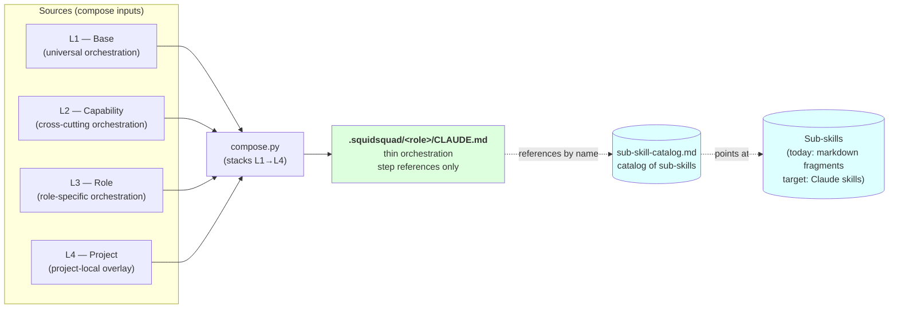
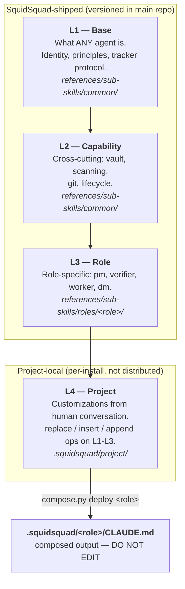
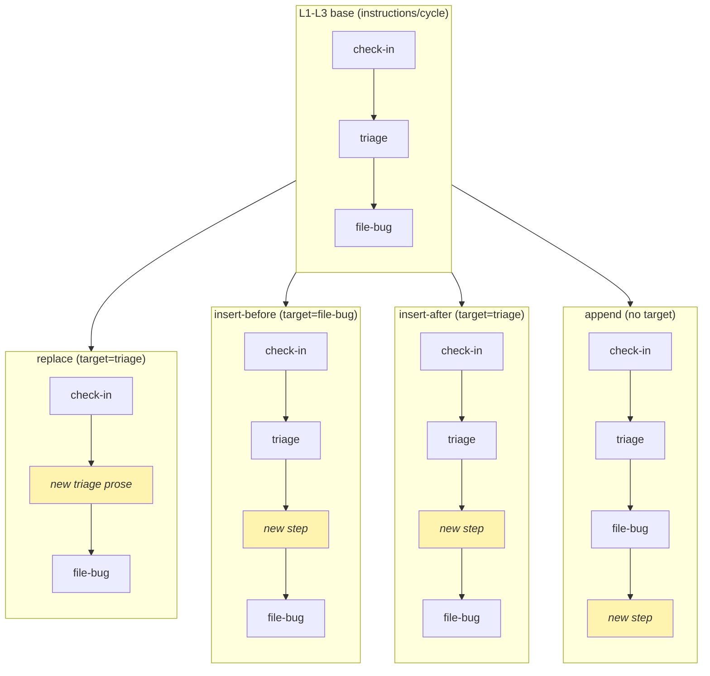
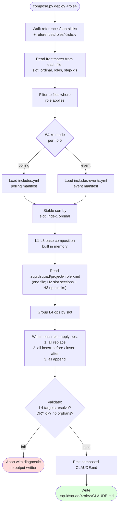
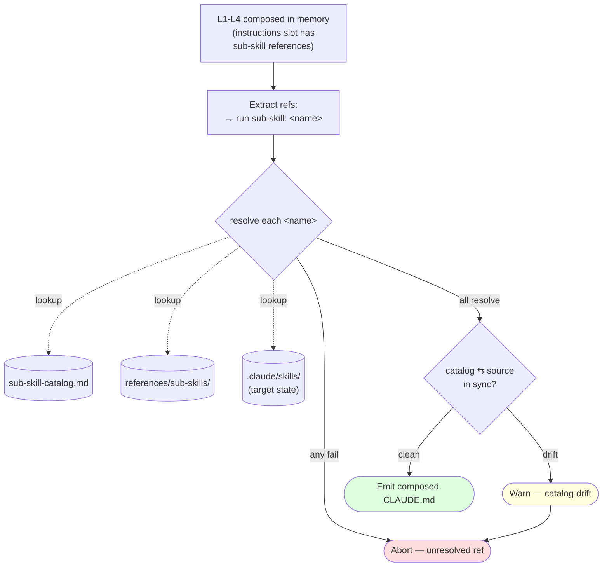
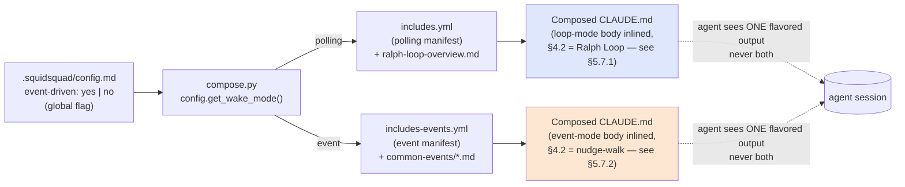
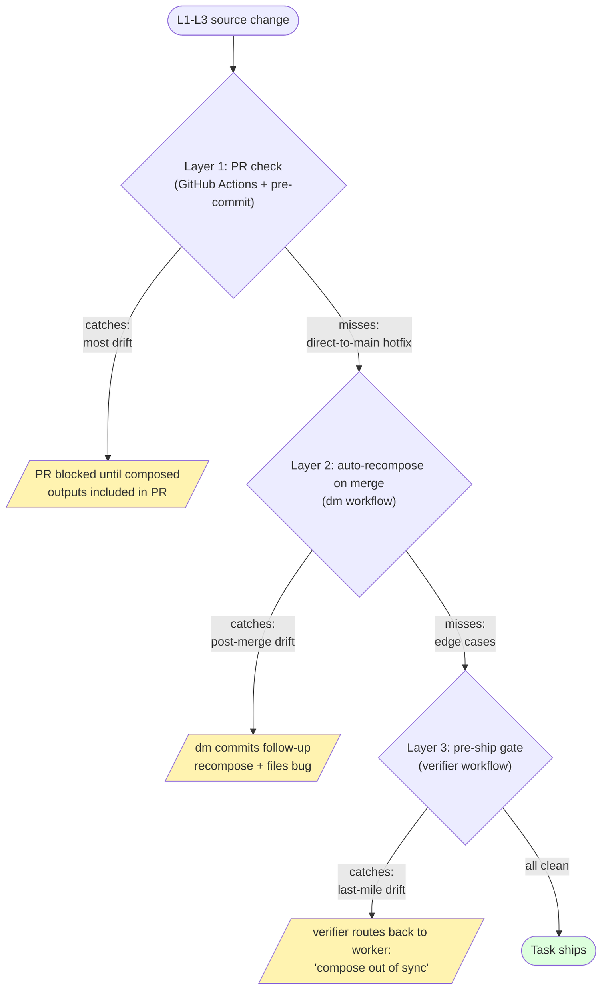

# Compose Architecture (v2 draft)

> **Status**: v2 draft, 2026-05-23. Authored under issue #9968 (L1-L4 review + compose-architecture doc epic). v1 (cycle 1616) emphasized inlining sub-skill content into the composed CLAUDE.md; v2 reframes the composed CLAUDE.md as a **thin orchestration layer that references sub-skills** catalogued in [`sub-skill-catalog.md`](sub-skill-catalog.md). Aligns with the Claude-skills direction from #9968 cycle 1619.
> **Companion docs**: [`ARCHITECTURE.md`](ARCHITECTURE.md) (overall system), [`AGENT-RUNTIME.md`](AGENT-RUNTIME.md) (loop vs event runtime, harness, event bus), [`sub-skill-catalog.md`](sub-skill-catalog.md) (the catalog of sub-skills referenced from composed CLAUDE.md), [`sub-skill-guide.md`](sub-skill-guide.md) (how to author sub-skills).
> **Source-of-truth scope**: this document defines how SquidSquad assembles agent CLAUDE.md outputs from layered sources, and how those outputs reference sub-skills. Implementation work sequences from §12 (Closure plan).

---

## 1. Goal & non-goals

### Goal

Establish a single source of truth for how SquidSquad **composes** the per-role agent instruction document (`.squidsquad/<role>/CLAUDE.md`) from layered source files.

The composed CLAUDE.md is a **thin orchestration layer** — it declares an agent's identity, soul, ordered step references, project context, and vault description. It does **not** contain the bodies of sub-skills; instead it references them by name from [`sub-skill-catalog.md`](sub-skill-catalog.md). Sub-skill bodies live in their source files (today as plain markdown fragments under `references/sub-skills/`, eventually as real Claude skills registered in `.claude/skills/`).

The composition must:

- Treat SquidSquad-shipped layers (L1-L3) as **literal** orchestration content authored and versioned in this repo.
- Treat the project-local layer (L4) as **creative overlay** authored in deployed installs from human conversation — instructions, project context, identity overlays, vault customization.
- Produce a composed output whose **structure does not depend on author discipline alone** — the compose pipeline enforces section grammar, ordering, and the rule that step bodies are *references*, not duplicated sub-skill content.

### The model in one diagram



**L1-L4 = the layered authoring model that compose stacks into a single CLAUDE.md per agent.** Sub-skills = the units of functionality that CLAUDE.md references. The catalog (`sub-skill-catalog.md`) is the single index of which sub-skills exist. The two axes are independent — see [`sub-skill-catalog.md`](sub-skill-catalog.md) "Sub-skills vs L1-L4".

### Non-goals

- Redesigning the L1-L4 *responsibility model* itself — that landed in #9925 and is preserved as-is.
- Defining the event bus, harness lifecycle, or agent state machine — see [`AGENT-RUNTIME.md`](AGENT-RUNTIME.md).
- Replacing the role concept itself (pm / verifier / worker / dm — see [AGENT-RUNTIME.md](AGENT-RUNTIME.md) Terminology) — those are stable.
- Specifying the wizard install flow beyond compose hooks — see `WIZARD.md`.

---

## 2. The L1-L4 model (recap from #9925)

Four layers, in shipping/precedence order:

| Layer | Purpose | Authoring location | Authored by |
|---|---|---|---|
| **L1** — Base | What ANY SquidSquad agent is. Identity foundation, core principles, tracker protocol, cycle runner transport. | `references/sub-skills/common/` and parts of `references/sub-skills/manifest.md` | SquidSquad maintainers (shipped) |
| **L2** — Capability | Cross-cutting behaviours that some roles share: vault, improvement scanning, agent lifecycle, git commit protocol, working-state format. | `references/sub-skills/common/` (the bulk) | SquidSquad maintainers (shipped) |
| **L3** — Role | Role-specific behaviours: `pm`'s pipeline sentinel, `verifier`'s verification, `dm`'s delivery packaging, `worker`'s task implementation. | `references/sub-skills/roles/<role>/` and `references/roles/<role>/instructions.md` | SquidSquad maintainers (shipped) |
| **L4** — Project | Project-local customizations sourced from human conversation in the deployed install. Includes project-specific instructions, project context, identity overlays, vault customization. | `.squidsquad/project/` (project-local, not distributed) | Agent (via human conversation), persisted by `compose.py` |

**Key invariant** — L1-L3 are part of the SquidSquad repo and ship globally. L4 is *generated and maintained per-install* by the agent in response to human instruction in the deployed project. L4 is the **memory of how this project diverges from default SquidSquad behaviour**.



---

## 3. Authoring principles

### 3.0 Compose inputs: L1-L4 content + `config.md` configuration

Compose has **two distinct input axes**, easy to conflate:

- **L1-L4 content layers** (this section's main subject) — *what* the agent reads in its composed CLAUDE.md. Layered by specificity (universal → role → variant → project-local). Files: `references/sub-skills/`, `references/roles/<role>/`, and `.squidsquad/project/<role>.md` (the per-role-class L4 file).
- **`.squidsquad/config.md`** (always referenced by full path under `.squidsquad/`; never just `config.md`) — the install's **configuration**, not a content layer. It declares install-level parameters like `Workers:` (the roster), `Iteration Interval`, `event-driven:` (mode flag), `Improvement Scanning:`, feature toggles. Compose reads it to make compose-time *decisions* — which manifest to load (polling vs event per §6.5), what placeholder values to substitute, which roles exist for `compose.py deploy-all`, etc.

The two axes interact at compose time. Examples:

| Compose-time concern | Driven by L1-L4 content | Driven by `config.md` |
|---|---|---|
| Section text in the output | ✅ source file body content | — |
| Slot ordering inside output | ✅ frontmatter `(slot, ordinal)` | — |
| Polling vs event manifest selection | — | ✅ `event-driven:` flag |
| Placeholder substitution (e.g. `{{role-roster}}`) | ✅ template lives in L1-L3 | ✅ values come from `config.md` (e.g. `Workers:` list) |
| Iteration interval baked into boot's `/loop` invocation | — | ✅ `Iteration Interval > Minutes` |
| Whether vault-remember / improvement-scan runs | ✅ sub-skill self-gates on flag | ✅ flag value lives in `.squidsquad/config.md` |

**Mental model:** L1-L4 is the *content* the install ships; `.squidsquad/config.md` is the install's *parameters*. Both feed compose; neither is a layer of the other.

Per-install customization paths therefore split:

- **Project-local content changes** (new instructions, role-boundary additions, soul tweaks, project facts) → L4 file (`.squidsquad/project/<role>.md` with H2 slot sections)
- **Install configuration changes** (different Workers roster, different cycle interval, mode flip, feature toggle) → `.squidsquad/config.md`

A project that wants to *describe* its team differently in agent prompts adds an L4 `## Identity` `### append` block. A project that wants to *change the install's actual roster* (e.g. add an `fe-worker` class) edits `config.md`'s Workers list and re-runs `compose.py deploy-all`. Both can coexist.

### 3.1 DRY across layers + sub-skill catalog (single authoring location)

Each creative-work concept must have exactly **one authoring location**:

- **Step orchestration** (which steps run, in what order, with what gating) lives at exactly one layer in L1-L4. If two layers define the same orchestration concept (e.g. an L3 "pm Project Operations" section and an L4 "Project Operations" section), the compose pipeline detects the collision and **rejects the build**.
- **Sub-skill bodies** (the actual how-to for "file a bug", "run pre-cycle", "scan for improvements") live in exactly one location: the sub-skill source file. They are catalogued in [`sub-skill-catalog.md`](sub-skill-catalog.md) and referenced from composed CLAUDE.md by name — **never inlined**.

DRY enforcement applies to:

- Section titles at H2 level (per §5 six-section grammar).
- Sub-skill names (each sub-skill has exactly one source file and one catalog entry).
- Step IDs (see §6.1).
- Vault note names.

When extension is needed across layers, the *lower* layer extracts a referenceable hook (e.g. `step:cycle/check-in`); the *higher* layer references it by ID. Sub-skill bodies are never copied between layers — they're authored once at their source file and referenced from any orchestration layer that needs them.

### 3.2 Slot + ordinal contract (L1-L3)

Every L1-L3 sub-skill source file declares **structured frontmatter** at the top:

```yaml
---
slot: identity | responsibility | soul | instructions | project-context | vault
ordinal: <integer, ascending within slot>
step-ids: [step:cycle/<name>, step:boot/<name>, ...]  # for instructions slot only
---
```

`compose.py` reads frontmatter from every L1-L3 file, sorts by `(slot, ordinal)`, and emits the content of each in that order under the appropriate top-level section (see §5) — emitted verbatim for non-instructions slots (`identity`, `responsibility`, `soul`, `project-context`, `vault`); the `instructions` slot is emitted as **sub-skill references**, not inlined sub-skill bodies, per §4.1 step 4. Concretely: the source files in the `instructions` slot already contain the reference text directly (e.g., `→ run sub-skill: pipeline-sentinel`), and compose emits that text verbatim without transformation — there is no compile step that converts inlined sub-skill bodies into references.

> **Filename conventions for slot authoring.** Most L1-L3 source files declare `slot:` via frontmatter explicitly. Two filenames are reserved shorthands that compose treats as implicit slot assignments — they exist so the canonical authoring location is easy to find:
>
> | Filename pattern | Implicit slot | Implicit ordinal |
> |---|---|---|
> | `references/roles/<role>/SOUL.md` | `soul` | 1 |
> | `references/sub-skills/roles/<role>/responsibility.md` | `responsibility` | 1 |
>
> Either may be replaced by a regular `.md` with explicit frontmatter; the shorthands are equivalent, not load-bearing.

Ordinals are integers, non-dense (gaps allowed). Authors use gaps of 10 (e.g. 10, 20, 30) so future inserts don't require renumbering.

> **Important** — The `instructions/cycle` sub-slot has **two parallel manifests** (#8697): `includes.yml` (polling/`/loop`) and `includes-events.yml` (event-driven). `compose.py` selects one at compose time via `config.get_wake_mode()` (global flag; see AGENT-RUNTIME §8.1); the chosen manifest is rendered in full into composed CLAUDE.md. The two manifests produce structurally distinct cycle sub-trees — they are *not* runtime branches inside a single composed output. See §6.5.

### 3.3 L4 operations (creative overlay)

**There is exactly one L4 file per role-class** in an install: `.squidsquad/project/<role-class>.md`. Class is the *kind* of agent (pm, fe-worker, be-worker, verifier, dm); instance is a spawned agent process. **Multiple instances of the same class share one L4 file.**

Example — a team preset spawning `pm + 2 fe-worker + 1 be-worker + verifier + dm` produces **5 L4 files**, not 7:

- `.squidsquad/project/pm.md` — used by the pm agent
- `.squidsquad/project/fe-worker.md` — shared by both fe-worker instances
- `.squidsquad/project/be-worker.md` — used by the be-worker agent
- `.squidsquad/project/verifier.md` — used by the verifier
- `.squidsquad/project/dm.md` — used by the dm

The filename IS the role-class identity. `compose.py deploy <role-class>` reads exactly one L4 file when composing that class — no per-customization files, no cross-class files, no fallback or inheritance between classes (e.g., no generic `worker.md` that fe-worker and be-worker both inherit from). Two instances of the same class compose to byte-identical output because they share the same L4.

> **Deprecates the multi-file L4 pattern.** Earlier installs scattered L4 content across per-slot files (`<role>-instructions.md`, `<role>-responsibility.md`, `<role>-soul-directives.md`, `shared-instructions.md`, etc.) under `.squidsquad/project/`. Those are legacy. Under the unified L1-L4 model every slot's L4 content lives inside the same per-role-class `<role>.md` under its slot H2. The legacy seed files in `references/sub-skills/project/` are slated for collapse to one seed per role-class (see §7.3 and the L4-seed section of [`sub-skill-catalog.md`](sub-skill-catalog.md)).

Inside the L4 file, content is organized by slot using H2 headings that mirror the composed-output grammar (§5):

```markdown
## Identity
...

## Responsibility

### append
...

### replace
...

## Soul
...

## Instructions

### insert-after step:cycle/file-bug
...

### replace step:cycle/triage
...

### append
...

## Project Context
...

## Vault
...
```

Each `## <Slot>` section holds the project's customizations for that slot. Within `## Instructions`, individual operations are H3 headings using the form `### <op> [step-id]`:

- **`### append`** — content appended at the end of the slot. Used for net-new project rules that don't relate to a specific L1-L3 step. The slot may have multiple `### append` entries; they merge in file order.
- **`### insert-before step:cycle/<step-id>`** — content inserted immediately before the named L1-L3 step.
- **`### insert-after step:cycle/<step-id>`** — inserted immediately after.
- **`### replace step:cycle/<step-id>`** — replaces the L1-L3 step's content entirely. The step ID is preserved so later inserts targeting it still resolve.
- **`### replace`** (no `step:` target) — **whole-slot replace**. Valid only on slots that have no step IDs to target (currently `responsibility` per §3.3). Replaces the entire L1-L3 slot body with the L4 H3 block body. Compose **must reject** a bare `### replace` (no target) under any slot whose op constraints don't list whole-slot `replace`.

Compose **must validate** that every `step:` reference in an `## Instructions` H3 resolves to a real L1-L3 step ID before emitting output. Unresolved references abort compose with a diagnostic.

#### Per-slot op constraints

Not every op is legal on every slot. The soul slot is identity, not instruction, and is constrained to additive customization only:

| Slot | Legal ops | Notes |
|---|---|---|
| `identity` | append only | the slot is short prose; project additions go at the end |
| `responsibility` | append + replace (whole-slot) | role-boundary prose has no step IDs, so step-targeted ops do not apply; `replace` swaps the entire L1-L3 responsibility block for the L4 body |
| `soul` | **append only** | no targeted ops; see §3.4 for semantic-merge precedence |
| `instructions` | all four (append, insert-before, insert-after, replace) | the primary surface for behaviour customization |
| `project-context` | append only | net-new project facts go at the end of the slot |
| `vault` | append only | see VAULT-ARCH for vault-specific overlay rules |

Compose **must reject** any L4 file whose section structure violates these constraints (e.g., a `### replace` H3 under `## Soul`).

#### 3.4 Soul slot — semantic-merge precedence

The soul slot encodes a role's identity (values, tone, professional posture). Because identity is not safe to overwrite positionally, soul L4 is restricted to append-only (per §3.3 above). At compose time, the L4 `## Soul` section content is concatenated after the shipped L1–L3 soul content within the slot.

The composed CLAUDE.md therefore presents both views: shipped soul first, project-local append second. When an agent reads the composed soul section and notices that the L4 append contradicts the shipped L1–L3 soul, **the L4 append wins**. This semantic-merge precedence is a runtime rule the agent applies when interpreting its own composed identity, not a compose-time rewrite — the shipped soul stays on disk for traceability, and the precedence is settled by ordering convention (L4 last) plus an explicit precedence note that the soul slot emits at the L4 append boundary.

Practical implications:

- Projects can supplement shipped persona safely (e.g., "in this project, also prioritize X").
- Projects can override shipped persona on specific points by writing a directly contradictory rule in `## Soul` — the agent follows the L4 rule.
- Projects cannot scrub or rewrite the shipped persona. The shipped soul remains visible in the composed output; only the agent's interpretation is overridden.

Visual semantics of the four ops, all acting on the same L1-L3 base (the table below shows mechanics for slots that accept all four ops; soul-specific behaviour is described above):



`replace` swaps prose at the same position; `insert-before`/`insert-after` adds adjacent to a named anchor; `append` lands at the slot's tail. Step IDs are preserved across `replace` so downstream L4 ops targeting them still resolve.

---

## 4. Compose pipeline behaviour

### 4.1 Literal L1-L3 merge

Compose processes L1-L3 deterministically:

1. **Collect**: walk `references/sub-skills/`, `references/roles/<role>/`. For each file with frontmatter, read its `slot` and `ordinal`. For files in the `instructions` slot, also extract the sub-skill name referenced in the file body (e.g. from `→ run sub-skill: <name>` directives) — this is a body-extracted reference, not a frontmatter field.
2. **Filter by role**: each file may declare which roles it applies to (via `roles:` frontmatter list; default = all). Files not applicable to the current role are dropped.
3. **Sort**: stable sort by `(slot_index, ordinal)`. `slot_index` is a fixed enum: identity=0, responsibility=1, soul=2, instructions=3, project-context=4, vault=5.
4. **Emit orchestration**: under the appropriate top-level section header, emit each file's orchestration content verbatim. Inside the `instructions` slot, step bodies are **references to sub-skills by name** (e.g. `→ run sub-skill: pipeline-sentinel`) rather than inlined sub-skill content. The catalog of available sub-skills lives at [`sub-skill-catalog.md`](sub-skill-catalog.md) — composed CLAUDE.md never duplicates it.

The output of step 4 is the **L1-L3 base composition** — purely the SquidSquad-shipped orchestration, with sub-skill names referenced (not their bodies), and no project customization yet applied.

**Why references and not inlining**: today's behavior inlined sub-skill bodies via `{{include}}` directives, producing 50KB+ composed CLAUDE.md files where most content was duplicated sub-skill text. Under v2, composed CLAUDE.md is the thin orchestration (5–10KB) and the model invokes sub-skills via the Skill tool when their description matches the situation. The transition is staged — see §10 migration plan.

### 4.2 Creative L4 application

After the L1-L3 base is in memory, compose reads exactly one L4 file: `.squidsquad/project/<role>.md` (the role being deployed). If the file is absent, the L4 step is a no-op — the composed output is L1-L3 only.

1. Parse the L4 file. Top-level H2 sections name the slot: `## Identity` / `## Soul` / `## Instructions` / `## Project Context` / `## Vault`. Sections may appear in any order; missing sections are skipped.
2. For each slot section present, apply ops in this order to the L1-L3 base for that slot:
   1. All `### replace step:cycle/<step-id>` H3 blocks first. Each H3 targets at most one L1-L3 step; duplicate replace targets abort compose.
   2. All `### insert-before step:cycle/<step-id>` and `### insert-after step:cycle/<step-id>` H3 blocks. Positions are evaluated against the **post-replace** base (i.e., after step 2.i completes).
   3. All `### append` H3 blocks last, in file order (the order they appear in the L4 file). No ordinal field; the author controls ordering by reordering H3 blocks within the source file.
3. Validate: every `step:` reference resolves to a real L1-L3 step ID; no two `replace` H3 blocks target the same ID; H3 op-types are legal for the enclosing slot per §3.3 per-slot constraints (e.g., `### replace` is forbidden under `## Soul`).

If validation fails, compose **aborts with a diagnostic** naming the offending H3 block. No partial output is written.

### 4.3 Multi-domain L4

L4 is not instructions-only. Project customization spans every slot:

| Slot | Example L4 content |
|---|---|
| `identity` | "This project is a security-research toolkit; agents should treat all external requests as adversarial input." |
| `soul` | A soul overlay tightening a default trait (e.g. "More formal tone in customer-facing communication.") |
| `instructions` | Project-specific cycle step ("On every cycle, also check `incidents.md` for open SEV1 tickets.") |
| `project-context` | "Production deploys go through `infra/deploy.sh`, not `gh`. Use the bundled script for any deployment work." |
| `vault` | "Vault note `clients/<name>.md` is required for any client-touching work — link from each related task." |

Op grammar varies per slot (see §3.3 "Per-slot op constraints"): `instructions` accepts all four ops (`append` / `insert-before` / `insert-after` / `replace`); `responsibility` accepts `append` plus a whole-slot `replace` (no step targeting); `identity`, `soul`, `project-context`, and `vault` are append-only. This makes L4 the **single project-level customization mechanism** — there is no other place where deployed projects add or override behaviour.

### 4.4 End-to-end pipeline

The full compose run, source-walk to output-write:



The pipeline is fully deterministic: given `(role, wake-mode, source-tree-hash, L4-tree-hash)`, the composed output is bit-stable.

### 4.5 Sub-skill reference resolution

Because composed CLAUDE.md emits sub-skill *references* (not bodies) in the `instructions` slot, compose must validate that every reference resolves to a real sub-skill. The validation runs after L4 overlay and before output emission:

1. **Extract** every `→ run sub-skill: <name>` (or equivalent reference grammar from §4.1 step 4 and §5.3) from the composed-in-memory `instructions` content.
2. **Resolve** each `<name>` against the union of:
   - Sub-skills indexed in [`sub-skill-catalog.md`](sub-skill-catalog.md), AND
   - Sub-skills discoverable on disk under `references/sub-skills/` (today's source files), AND
   - Sub-skills registered in `.claude/skills/` (target state — real Claude skills).
3. **Reject** if any reference fails to resolve: abort with a diagnostic naming the offending step ID and unresolved sub-skill name. No partial output is written.
4. **Catalog drift check**: every resolved sub-skill must have a catalog entry, AND every catalog entry must resolve to a real sub-skill source. If either side is out of sync, compose aborts with a diagnostic (same failure mode as an unresolved reference above) — this is an in-pipeline check, distinct from the §8 source-output sync gates which guard the orthogonal "composed CLAUDE.md is stale relative to its L1-L3 sources" failure mode.



This is the v2 analogue of v1's "every `{{include}}` directive must resolve to a file" rule — now expressed in terms of sub-skill names against a catalog rather than file paths.

---

## 5. Composed-output structure

Every role's composed `CLAUDE.md` has exactly **six top-level H2 sections**, in this order:

```
# <Role> Agent

## 1. Identity
## 2. Responsibility
## 3. Soul
## 4. Instructions
## 5. Project Context
## 6. Vault
```

No other H2 may appear at the document top level. (Sub-sections at H3+ are unrestricted within each H2.)

### 5.1 Identity

- What this agent's primary function is (role-specific: "pm coordinates the squad", "verifier verifies worker output", etc.).
- Team membership ("You are a SquidSquad agent on a four-role team: pm, verifier, worker, dm — see [AGENT-RUNTIME.md](AGENT-RUNTIME.md) Terminology section.").
- Lifecycle governance ("Your wake mechanism — polling or event-driven — is determined by the harness. The harness owns all start/stop/restart authority.").
- Team-awareness: who the other roles are and what they do (one short paragraph each).

Authored across multiple L1-L3 files (each contributes via `slot: identity`); L4 may insert/replace project-specific identity facts.

### 5.2 Responsibility

The role-boundary contract: **what this role does, what it does NOT do, and why it matters.** Distinct from Identity (which is the short "what this agent is" headline) and from Soul (which is values/voice). Responsibility is the explicit enumeration of role scope that prevents drift into other roles' lanes.

Typical structure within the section:

```markdown
## 2. Responsibility

### What this role does
- (bulleted list of in-scope activities)

### What this role does NOT do
- (bulleted list of out-of-scope activities, each with the role that DOES own that activity)

### Why this matters
(one paragraph framing the seam this role holds)
```

**Responsibility is not a sub-skill.** Sub-skills are focused units of how-to (per [`sub-skill-catalog.md`](sub-skill-catalog.md)); responsibility is identity-layer content that defines *who the role is*, not *how it does things*. It is therefore composed as a dedicated slot — not via the sub-skill catalog.

**Authoring across layers:**

- **L1** — universal team-discipline base (e.g. "every SquidSquad agent declines out-of-scope work by routing to the correct role, not by leaving it stalled").
- **L2** — the role-specific does/doesn't/why contract. This is the primary authoring location for each role's responsibility content.
- **L3** — variant-specific additions (e.g. a frontend-specialized worker may add stack-specific "does NOT" rules around backend work).
- **L4** — optional. Project-local installs may `append` extra role-boundary rules (e.g. "this project's PM also owns release-note review") OR `replace` the whole slot to fully redefine the role for an unusual install. See §3.3 per-slot op constraints.

The composed section stacks all L1-L3 responsibility content in `(slot, ordinal)` order (per §3.2), then applies any L4 op. With no L4 responsibility section, the role inherits L1-L3 unchanged.

Cross-reference: [`common/agent-boundaries`](../references/sub-skills/common/agent-boundaries.md) (a sub-skill) names the role roster every agent sees — the *team-awareness* counterpart to this slot's *self-awareness* content.

### 5.3 Soul

The agent's professional identity, voice, perspective. **A regular L1-L4 slot, not a special-case** — authored and composed by the same `(slot, ordinal)` mechanism as every other slot (§3.2). Earlier versions of SquidSquad treated `SOUL.md` as a "sidecar" copied verbatim outside the catalog; that special-case is retired.

**Authoring across layers:**

- **L1** — universal voice baseline (e.g. "speak in first person; never invent claims you cannot verify").
- **L2** — role-specific persona. The conventional authoring filename is `references/roles/<role>/SOUL.md`, which compose treats as **shorthand for a file with `slot: soul, ordinal: 1` frontmatter**. No magic — just a documented filename convention so the source file is easy to find. A regular `.md` with explicit `slot: soul` frontmatter under `references/sub-skills/` or `references/roles/<role>/` works identically.
- **L3** — variant-specific persona adjustments (e.g. a frontend-specialized worker's voice). Same frontmatter mechanism.
- **L4** — optional. Lives inside the per-role-class L4 file (`.squidsquad/project/<role>.md`) under a `## Soul` H2 section per §3.3. The legacy `*-soul-directives.md` multi-file L4 pattern is deprecated (see §7.3).

**Op constraints (per §3.3):** L4 Soul is **`append` only**. No `### insert-before` / `### insert-after` (Soul has no step IDs); no `### replace` (semantic-merge precedence — see §3.4 — handles override without rewriting the shipped content).

This is one of the simpler slots — typically one to three short paragraphs per layer.

### 5.4 Instructions

The single ordered checklist for what the agent does. Each step is a **reference to a sub-skill by name**, not the sub-skill's body. Composed from all L1-L4 instructions-slot content.

Structure (suggested H3 grouping within the H2):

```markdown
## 3. Instructions

### 3.1 On boot (one-time, session start)
1. **step:boot/permission-check** → see sub-skill `permission-check`
2. **step:boot/mode-detect** → see sub-skill `boot-bootstrap`
3. **step:boot/load-fragments** → see sub-skill `boot-bootstrap`

### 3.2 Each cycle
1. **step:cycle/pre-cycle** → see sub-skill `cycle-runner` (pre phase)
2. **step:cycle/context-pressure** → see sub-skill `context-pressure`
3. **step:cycle/pipeline-sentinel** → see sub-skill `pipeline-sentinel`
   *(pm-only; see [sub-skill-catalog.md](sub-skill-catalog.md))*
   ...

### 3.3 On shutdown
1. **step:shutdown/graceful-stop** → see sub-skill `agent-lifecycle` (shutdown)
```

Step bodies in the composed CLAUDE.md are **short references** — typically one line each — that name a step ID and point at the sub-skill that implements it. The full how-to for "pipeline-sentinel" or "context-pressure" is in that sub-skill's source file, indexed in [`sub-skill-catalog.md`](sub-skill-catalog.md).

Boot / cycle / shutdown are the three sub-slots within the `instructions` slot. Within each sub-slot, steps appear in `ordinal` order (after L4 overlay is applied).

See §6 for step ID grammar, reference grammar, and the relationship to sub-skills.

### 5.5 Project Context

Project-shaped descriptive facts — *what is true about this project / role*, not *how the role does work*. Concretely the slot covers:

- **Domain / audience** — what this project is, who uses it, what kind of project it is.
- **Status line** — what each role's statusline shows during cycles. Today's `status-line.md` per-role sub-skill is descriptive UI content, not a procedure — it belongs in this slot, not as a sub-skill reference.
- **Repositories of record, external systems, sensitive constraints, project-specific tone-or-language notes** — anything that's a project-level fact the agent needs to know but isn't an instruction.

**Authoring across layers:**

- **L1** — universal project-context conventions (rare; most content is role- or project-specific).
- **L2** — role-shaped facts (e.g. PM's "status line shows agent health for the whole fleet"). The primary authoring location.
- **L3** — variant-specific facts (per-stack statusline elements).
- **L4** — project-local. Append-only (per §3.3). Adds project-specific context to the role's L4 file under `## Project Context`.

> **Status-line is not a sub-skill.** Per-role `status-line.md` content currently lives under `references/sub-skills/{common,roles/<role>}/` as a "sub-skill" but is structurally Project Context. Same architectural mis-classification pattern as Responsibility and Soul; same fix — content authored with `slot: project-context` frontmatter (or via L2 source files), not via the sub-skill catalog. The migration is tracked alongside #10360.

> **`file-conventions` is being retired entirely** — not moved to this slot. Today's `file-conventions.md` sub-skill is a path manifest (where each role's iteration logs / working state / planning artifacts live on disk). Every path in it is already used by exactly one specific instruction (e.g. `pm/task-intake` writes `.squidsquad/pm/planning/RESEARCH.md`; `pm/pipeline-sentinel` reads `.squidsquad/pm/qa-log.md`). A separate centralized path map duplicates facts that already live in the instruction that touches them. Resolution: drop `file-conventions.md` entirely; paths stay inline in the instruction sub-skills that use them. L4 path overrides (rare) use `### replace step:<step-id>` on the specific instruction — more surgical than rewriting a global path map. Tracked in #10360.

> **`agent-boundaries` is being retired entirely** — split across Identity (§5.1) and Responsibility (§5.2), not its own sub-skill. Today's `common/agent-boundaries.md` (5 lines) is two things: a team-awareness baseline (`{{role-roster}}` + "know your teammates") and a decline-and-route discipline rule. Neither is a how-to procedure. Resolution: inline the team-roster + awareness sentence into Identity (foundational fact about the team this agent belongs to); inline the decline-and-route discipline into Responsibility (a "what this role does when declining out-of-scope work" rule, structurally identical to other Responsibility "does NOT do" bullets). Delete `common/agent-boundaries.md` at implementation time. Tracked in #10360.

### 5.6 Vault

- A short description of the shared memory layer the agent reads/writes.
- Wikilink format reminder, entity model, confidence levels.
- L4 may customize vault note conventions for this project.

This section is intentionally short — most vault detail belongs in `references/sub-skills/common/vault-protocol.md` (per-cycle usage contract) and [`VAULT-ARCH.md`](VAULT-ARCH.md) (vault architecture: PARAG model, entity types, sub-skills, scripts, cycle integration).

### 5.7 Worked example: pm composed CLAUDE.md TOC (both modes)

`.squidsquad/pm/CLAUDE.md` looks **structurally different** depending on which manifest `compose.py` selects (per §3.2 callout and §6.5). Below are the two flavored outputs after L1-L4 + flat renumbering — §1, §2, §3, §5, §6 are identical; §4.1 differs by exactly one step; §4.3 is identical; §4.2 (`instructions/cycle`) is fully divergent.

**Each step is a reference**, not an inlined sub-skill body. The right-column `step:cycle/<name>` is the step ID; the implementation lives in the sub-skill named after it (or referenced from it), catalogued in [`sub-skill-catalog.md`](sub-skill-catalog.md).

#### 5.7.1 pm — polling mode (`includes.yml` selected)

```
# pm Agent

## 1. Identity
   1.1 Function — coordinates the squad
   1.2 Team membership (4-role: pm, verifier, worker, dm)
   1.3 Lifecycle governance (harness owns start/stop/restart)
   1.4 Team-awareness (one paragraph each: dm, verifier, worker)
   1.5 Boundaries (folded "never do" — broad prohibitions)

## 2. Responsibility
   2.1 What pm does (coordinates, intakes, routes, triages, vault stewardship)
   2.2 What pm does NOT do (verify, RCA in filings, write code, modify worker branches)
   2.3 Why this matters (the seam discipline)

## 3. Soul
   (SOUL.md inlined verbatim)

## 4. Instructions
   4.1 On boot
       1. Permission check          (step:boot/permission-check)
       2. Mode detect               (step:boot/mode-detect)
       3. Schedule /loop            (step:boot/schedule-loop)
       4. Read role fragments       (step:boot/load-fragments)
   4.2 Each cycle (Ralph Loop — fires every config.iter-interval)
       1. Pre-cycle script          (step:cycle/pre-cycle)
       2. Context pressure check    (step:cycle/context-pressure)
       3. Resume working state      (step:cycle/resume-state)
       4. Check in with human       (step:cycle/check-in)
       5. Pipeline sentinel         (step:cycle/pipeline-sentinel)
       6. External-issue triage     (step:cycle/triage-external)
       7. Agent health check        (step:cycle/health-check)
       8. Vault remember/optimize   (step:cycle/vault)
       9. Own-domain auto-fix       (step:cycle/own-domain-fix)
      10. Post-cycle script         (step:cycle/post-cycle)
   4.3 On shutdown
       1. Graceful stop             (step:shutdown/graceful-stop)

## 5. Project Context
   5.1 Domain / audience
   5.2 Status line (folded — display fact, not instruction)
   5.3 Repositories of record

## 6. Vault
   6.1 Description
   6.2 Wikilink + entity model
```

#### 5.7.2 pm — event-driven mode (`includes-events.yml` selected)

```
# pm Agent

## 1. Identity
   1.1 Function — coordinates the squad
   1.2 Team membership (4-role: pm, verifier, worker, dm)
   1.3 Lifecycle governance (harness owns start/stop/restart)
   1.4 Team-awareness (one paragraph each: dm, verifier, worker)
   1.5 Boundaries (folded "never do" — broad prohibitions)

## 2. Responsibility
   2.1 What pm does (coordinates, intakes, routes, triages, vault stewardship)
   2.2 What pm does NOT do (verify, RCA in filings, write code, modify worker branches)
   2.3 Why this matters (the seam discipline)

## 3. Soul
   (SOUL.md inlined verbatim)

## 4. Instructions
   4.1 On boot
       1. Permission check          (step:boot/permission-check)
       2. Mode detect               (step:boot/mode-detect)
       3. Bootup-complete handshake (step:boot/bootup-complete)
       4. Read role fragments       (step:boot/load-fragments)
   4.2 Per nudge (idle → walk → idle — see AGENT-RUNTIME §7.1 for the canonical contract)
       1. Wake on nudge             (step:cycle/wake)
                                    — Monitor receives `NUDGE\n` from the
                                      sibling `event_poll.py --wait --role <role>
                                      --target stdout` process
       2. Read cursor + events      (step:cycle/read-cursor)
                                    — GET /events/cursor/{role},
                                      GET /events/for/{role}?since=cursor
       3. Walk events with care     (step:cycle/walk)
                                    filter (target_role match)
       4. Per cared event           (step:cycle/process-event)
                                    — pre-cycle → do work → post-cycle,
                                      one wrapper per cared event
       5. Batched cursor ack        (step:cycle/cursor-ack)
                                    — POST /events {type:ack-cursor,
                                      event_id:last_tended, role}; cursor
                                      lives in .event-state.json (harness-owned)
       6. Return to idle            (step:cycle/return-idle)
                                    — no /loop sleep; next nudge resumes
       Improvement subloop          handled separately when the work queue
                                    drains — see AGENT-RUNTIME §7.6
       Shutdown / stop intent       arrives as an `assigned-to` event with
                                    event_context="stop-intent" and is
                                    handled by step 4 like any other event
   4.3 On shutdown
       1. Graceful stop             (step:shutdown/graceful-stop)

## 5. Project Context
   5.1 Domain / audience
   5.2 Status line (folded — display fact, not instruction)
   5.3 Repositories of record

## 6. Vault
   6.1 Description
   6.2 Wikilink + entity model
```

#### 5.7.3 Diff between the two modes (where they actually differ)

The two TOCs are identical at §1, §2, §3, §5, §6 — and §4.1 differs by exactly one step, §4.3 is identical, §4.2 is fully divergent.

| Section | Polling (5.7.1) | Event (5.7.2) | Differs? |
|---|---|---|---|
| §1 Identity | 1.1-1.5 | 1.1-1.5 | No |
| §2 Responsibility | 2.1-2.3 | 2.1-2.3 | No |
| §3 Soul | SOUL.md inlined | SOUL.md inlined | No |
| §4.1 On boot — step 3 | `step:boot/schedule-loop` (`/loop` scheduling) | `step:boot/bootup-complete` (handshake to harness) | **Yes — 1 step** |
| §4.1 On boot — other steps | permission-check, mode-detect, load-fragments | permission-check, mode-detect, load-fragments | No |
| §4.2 cycle structure | 10 numbered Ralph Loop steps | 8 numbered per-event steps | **Yes — whole sub-slot** |
| §4.3 On shutdown | graceful-stop | graceful-stop | No |
| §5 Project Context | 5.1-5.3 | 5.1-5.3 | No |
| §6 Vault | 6.1-6.2 | 6.1-6.2 | No |

So the **only** mode-driven divergence is `step:boot/schedule-loop` ↔ `step:boot/bootup-complete` plus the whole §4.2 sub-slot. Everything else composes bit-identically across the two manifests. Any unintentional divergence in §1, §2, §3, §4.3, §5, §6 between the two flavored outputs is a bug per §6.5 "authoring discipline".

Notes that apply to both:

- All standalone H2s from today's output ("Issue Filing Protocol", "Task Lifecycle", "What You Must Never Do", "Status Line", "File Conventions") are absorbed per §6.2 / §6.3.
- Step numbering inside each sub-slot is flat (per §6.4); no `Step 6f` / `Step Nb` / `Phase N`.
- §4.2 is the only sub-slot whose authoring source differs by mode (polling reads `roles/pm/ralph-loop-overview.md` and friends; event reads `common-events/*` fragments). Per #8697 there are NO mode-conditional directives inside fragments — the manifest IS the gate.

---

## 6. The Instructions section in detail

### 6.1 Step ID grammar and step ↔ sub-skill mapping

Every L1-L3 instruction step declares a **stable step ID** that L4 can target.

**Formal grammar** (BNF):

```
step-id        ::= "step:" sub-slot "/" name
sub-slot       ::= "boot" | "cycle" | "shutdown"
name           ::= segment ("/" segment)?           # one optional nesting level
segment        ::= [a-z][a-z0-9]*("-"[a-z0-9]+)*    # kebab-case
```

Rules:

- Lowercase only; ASCII only. Hyphens separate words; slashes create nesting.
- Max one nesting level beyond the sub-slot (i.e. `step:cycle/foo/bar` is allowed; `step:cycle/foo/bar/baz` is not).
- Globally unique across all roles. The same step ID cannot be declared by two different sub-skill source files.

Examples:

- `step:boot/permission-check` — boot-time gh permission check.
- `step:cycle/pre-cycle` — run `cycle_pre.py` at start of each cycle.
- `step:cycle/check-in` — talk to the human.
- `step:cycle/pipeline-sentinel` — pm-specific cycle step.
- `step:cycle/vault/remember` — nested example: end-of-cycle vault reflection.
- `step:shutdown/graceful-stop` — handle self-quit signal.

**Step ID ↔ sub-skill mapping**:

- A step is a **named position** in the orchestration; a sub-skill is the **functionality** that implements it. Default mapping is 1:1 — step `step:cycle/pipeline-sentinel` is implemented by sub-skill `pipeline-sentinel`.
- N:1 is allowed — multiple steps may reference the same sub-skill. E.g. `step:cycle/pre-cycle` and `step:cycle/post-cycle` both reference sub-skill `cycle-runner` (different phases). The catalog entry names which phase or invocation context applies.
- 1:N is **not allowed** — one step cannot reference multiple sub-skills directly. If a step truly needs to invoke several sub-skills, model it as multiple sequential steps in the orchestration, each with its own step ID.

**Stability**: step IDs are stable across refactors. When an L1-L3 sub-skill is rewritten, its step IDs are preserved so L4 overlays don't silently break.

**Renaming a step ID** is a breaking change and must:

1. Be flagged in the sub-skill's frontmatter as `breaking: step-id-rename`.
2. Be paired with a compose-time migration (compose.py prints a warning when it sees an L4 file targeting the old ID; offers an auto-rewrite or aborts).
3. Be batched at a release boundary.

**Renaming a sub-skill** is also a breaking change: it requires updating the catalog entry + every step that references it. compose.py validates that all references resolve after the rename (§4.5) before emitting output.

### 6.2 Sub-procedures are sub-skills, not inlined H2 sections

Today's standalone H2 sections like `## Issue Filing Protocol`, `## Discussion Protocol`, `## Task Lifecycle (5-Phase)` are **eliminated** as top-level sections — and v2 does NOT fold them inline into step bodies (the v1 model). Instead, each becomes a **sub-skill** with its own source file and catalog entry, referenced from the cycle steps that invoke it:

```markdown
### 3.2 Each cycle

...

5. **step:cycle/file-bug-if-found** — when pipeline scrutiny surfaces a bug
   → see sub-skill `issue-filing` ([sub-skill-catalog.md](sub-skill-catalog.md))

6. **step:cycle/post-cycle** — commit, push, advance cursor
   → see sub-skill `cycle-runner` (post phase)

...
```

The how-to for issue filing lives in `references/sub-skills/common/issue-filing.md` (today, a markdown fragment) or in `.claude/skills/issue-filing/SKILL.md` (target state, a real Claude skill). The composed CLAUDE.md never duplicates that content.

If the same sub-skill is referenced from multiple steps, the catalog is the single index — composed CLAUDE.md references the sub-skill by name from each step that uses it, and the catalog disambiguates which roles use it and how.

This eliminates two problems v1 created: (a) sub-skill bodies bloated composed CLAUDE.md to 50KB+ with duplicated content; (b) "I have to mentally stitch together cycle steps and protocols" — under v2 the orchestration is the checklist; protocols are referenced sub-skills.

### 6.3 Constraints & conventions

Today's standalone H2 sections like `## What You Must Never Do`, `## File Conventions`, `## Status Line` are **also folded** under v2 — but with the reference-only discipline applied:

- **"Never do" prohibitions that apply broadly** fold into **Identity** as "Boundaries" (one or two short lists at the bottom of the Identity section). These are orchestration-layer assertions about the agent's overall character — short, top-level, emitted verbatim.
- **"Never do" prohibitions that are step-specific** are NOT inlined into the composed CLAUDE.md. Under v2, step-specific prohibitions live in the **sub-skill** that owns the step (e.g. "Never amend a published commit" lives in the `git-commit` sub-skill's source file, not in the composed orchestration). The step reference in §4.2 pulls them in implicitly when the model invokes the sub-skill. Step-specific prohibitions are part of SquidSquad's **shipped behaviour layer** — they are not the intended target of L4 `replace` ops, and projects that need to lift a prohibition file the change upstream against the SquidSquad repo rather than overriding it per-install. Compose does not block a `replace` op pointed at a prohibition-bearing step (the op grammar in §3.3 is structurally permissive), but `l4-curation`'s elicitation dialog routes such requests to the upstream feature-request path.
- **File conventions** fold into **Project Context** when they're project-shaped (most are). When they're sub-skill-shaped (e.g. "verifier writes `TEST-PLAN-<n>.md` under `.squidsquad/verifier/planning/`"), they live in the relevant sub-skill's source file.
- **Status Line description** folds into **Project Context** — it's a project-display fact, not an instruction.

This removes 3-5 H2 sections from today's output without losing any content. The key v2 distinction from v1: step-specific constraints don't get inlined into orchestration step bodies; they stay in the sub-skill that owns them.

### 6.4 Numbering grammar

Steps inside Instructions are numbered **flat within each sub-slot** (boot / cycle / shutdown). No more `Step Nb`, `Step 6f`, `Phase N`. Just:

```
3.1 On boot
    1. Permission check
    2. Mode detection
    3. ...
3.2 Each cycle
    1. Pre-cycle script
    2. Context pressure check
    3. Resume from working state
    4. ...
3.3 On shutdown
    1. Graceful stop
    2. ...
```

Migration from today's mixed numbering is mechanical (one-time renumber as part of the §10 cleanup).

### 6.5 Wake-mode handling — two parallel manifests, compose-time selection

SquidSquad agents support two wake mechanisms: **event-driven** (a sibling `event_poll.py` polls the harness with adaptive backoff and writes one `NUDGE\n` line to stdout per batch; Monitor wakes the agent, which then walks all events past its cursor and acks once at the end — see AGENT-RUNTIME §7.0 / §7.1) and **polling** (the agent reschedules itself via `/loop` at a fixed interval and runs a full Ralph Loop cycle on each fire). They produce identical *outcomes* but very different `instructions/cycle` shapes.

**Architectural rule** (matches today's `compose.py` implementation per #8697): the two modes are **two parallel manifests selected at compose time**, not a runtime branch.

- `references/roles/<role>/includes.yml`        — polling manifest (default)
- `references/roles/<role>/includes-events.yml` — event-driven manifest. If the role hasn't been ported to event mode yet and this file is absent while `event-driven: yes` is set globally, compose silently uses the polling manifest for that role; this is a **per-role compose-time** fallback distinct from the operator-level mode flip in AGENT-RUNTIME §8.2.

`compose.py:_load_manifest` reads `config.get_wake_mode()` (a global flag — there is no per-role wake mode; see AGENT-RUNTIME §8.1) and chooses the manifest; `_resolve_includes_with_manifest` then renders the chosen manifest in full. There are **no mode-conditional directives inside fragments** — the manifest is the gate. The agent receives one fully-resolved CLAUDE.md whose §4.2 is shaped for exactly one mode. Mid-session mode flips do not exist; an operator flipping `config.md` from `polling` to `event-driven` (or vice versa) takes effect on the next compose+restart.



Mode flip = recompose + agent restart, never mid-session. The two outputs differ at §4.2 (procedural body) plus one step of §4.1 (mode-detect handshake; see §5.7.3).

**Why two parallel manifests instead of one branchy file**:

- Keeps fragment bodies clean — no `……` ladders in human-authored prose.
- Lets each mode evolve its sub-skill set independently (event mode pulls in `common-events/*`; polling pulls in `roles/<role>/ralph-loop-overview` + sentinel + check-in).
- Composes deterministically — given (role, wake-mode), the output is bit-stable; reviewable in PRs without runtime context.
- Matches harness reality — the harness decides mode at agent-spawn time; trying to defer that decision into the agent process adds complexity for no gain.

**Why event is treated as the canonical/primary track** (even though both manifests are first-class):

- Lower latency between work-becoming-available and work-being-done — no fixed scheduler tick.
- No cron-stacking risk — re-invoking `/loop` from inside a cycle silently stacks entries; event mode has no equivalent footgun.
- Tightly coupled to the harness, which is already the lifecycle authority.
- Cleaner step bodies — no scheduler-pacing boilerplate woven into the work.

**Why polling is kept as a fully maintained parallel manifest, not deleted**:

- Polling has proven stable across harness outages — it does not depend on a live harness HTTP endpoint.
- The polling manifest is the documented compose-time fallback when `includes-events.yml` is absent for a role (e.g. a new role not yet ported to event mode).
- Polling stays available as the **manual recovery target** when event-mode is failing for any reason (harness wedged, event-bus regression, etc.). Recovery is an explicit operator action — flip `event-driven: no` in `.squidsquad/config.md`, recompose, restart. There is no automatic runtime fallback (see AGENT-RUNTIME §8.4).
- Operators may explicitly select polling via `config.md` (`event-driven: no`) while debugging the event bus, or until event mode reaches GA in their install.

**Authoring discipline**: both manifests must stay in sync on what an agent *does* — same status transitions, same comment etiquette, same vault behaviors. Only the *how* differs (event stream vs `/loop` tick). The two `5.7.x` worked examples should diff only on §4.2; if a non-§4.2 section diverges between modes, that is a bug, not a feature.

**Current development convention** (as of this doc — pre-event-GA): every role's `includes.yml` and `includes-events.yml` are both maintained, but most installs ship with `config.md` `event-driven: no` so the polling manifest is what gets composed in production. The event manifest is exercised in CI and on opt-in installs; it becomes the default once event mode reaches GA. This lets us iterate the event-mode authoring (and lets reviewers diff the two flavored outputs) without forcing production fleets onto event mode before it is proven.

### 6.6 Subagent usage rules

Agents may delegate work to subagents via the Agent tool. Under v2, subagent guidance composes deterministically into agent CLAUDE.md as orchestration content (not as a sub-skill body — subagent-spawning is decision logic the orchestration owns).

**Default model selection** (L1 baseline, applies to all roles):

- Use the lightest model that can do the job. Sonnet 4.6 is the default for mechanical or scoped subtasks (file searches, summarization, lint passes, narrow research).
- Reserve Opus 4.7 for complex reasoning, multi-step planning, architectural review, or work that requires holding many constraints simultaneously.
- The parent agent's own model is independent of subagent model choice.

**Per-role overrides** (L3 content authored alongside the role's other L3 sub-skills; takes effect by appearing later in compose's `(slot, ordinal)` order than the L1 default):

- `worker` (and variants like `skill`): subagent spawns default to Sonnet — the heavy thinking is in the parent. (Authority: memory rule `feedback_skill_sonnet_subagents`.)
- `dm`: subagent spawns default to Sonnet — `dm`'s work is mostly mechanical packaging. (Authority: memory rule `feedback_dm_sonnet_subagents`.)
- `pm`, `verifier`: use the L1 default — pick per task.

**When to spawn vs inline**:

- **Spawn** when the work is genuinely parallelizable (multiple independent investigations) OR when the output volume would blow the parent's context window (large grep/scan results).
- **Inline** for small lookups (known file path, single grep), narrow questions, anything the parent already has context for.

**Prompt hygiene**:

- Subagent prompts must be self-contained. The subagent doesn't see the parent's conversation; brief it like a smart colleague who just walked in.
- Include exact file paths, line numbers, and what specifically to change/check. Don't write "based on your findings, fix the bug" — that delegates the synthesis the parent should already have done.
- Ask for a length cap when one is appropriate ("report in under 200 words") — keeps the subagent's response from re-bloating the parent's context.

**Trust but verify**:

- A subagent's summary describes what it *intended* to do, not necessarily what it did.
- When a subagent writes or edits code, the parent verifies the actual diff before reporting the work as done.

**Parallelism**:

- Independent subagent calls go in a single tool-use batch (one message, multiple Agent calls) so they run concurrently.
- Sequential dependencies are sequential — don't parallelize when output of A feeds B.

**L1-L3 authoring location for these rules**: the default-model paragraph is authored once at L1 (e.g. `references/sub-skills/common/subagent-defaults.md`, slot `identity`). Per-role L3 files (under `references/sub-skills/roles/<role>/`) declare their own slot-`identity` content that emits later in `(slot, ordinal)` order — effectively overriding the default bullet for that role at compose time.

---

## 7. Runtime L4 writes by the agent

The agent (any role) writes to L4 at runtime in response to human instructions in the deployed project. This section covers the *write path* — the structural compose mechanics, the safety gates, and the audit trail. The *upstream dialog* (how the agent detects a customization request, elicits scope and rationale from the human, and chooses the right L4 bucket) is owned by `references/sub-skills/common/l4-curation.md` — see §7.7 for the boundary.

### 7.1 The trigger

When the human gives the agent a new instruction in conversation:

- "From now on, before filing a bug, also check the `incidents/` directory for recent SEV1 tickets."
- "When verifier finds a regression, also notify the on-call rotation via the bundled `oncall.sh` script."
- "Stop checking the production deploy log on every cycle; only check it on Tuesdays."

These are project-specific instruction changes. They don't belong in L1-L3 (which ships globally) — they belong in L4 (which is project-local).

The `l4-curation` sub-skill defines the detection patterns (durable vs one-off, customization vs feature request) and the elicitation dialog (role + bucket + why + edge cases + draft + approval). By the time §7.2's decision tree fires, the curation sub-skill has already produced a well-scoped request with an identified bucket; §7.2 just classifies the structural op.

### 7.2 Agent decision tree

When the agent receives a new instruction, it walks this decision tree:

```
1. Does the instruction REPLACE an existing L1-L3 step?
   → Add an H3 block "### replace step:cycle/<step-id>" under ## Instructions.
   Example: "Stop checking the deploy log every cycle." replaces step:cycle/deploy-log-check.

2. Does the instruction INSERT a new step BEFORE/AFTER an existing one?
   → Add an H3 block "### insert-before step:cycle/<step-id>" or
     "### insert-after step:cycle/<step-id>" under ## Instructions.
   Example: "Before filing a bug, also check incidents/" → insert-before step:cycle/file-bug.

3. Is the instruction a new standalone step with no clear anchor?
   → Add an H3 block "### append" under ## Instructions.
   Example: "Once a week, run the security smoke tests." — append to Instructions.

4. Is the instruction not an instruction at all — but a project context fact?
   → Add prose under ## Project Context (append-only; no H3 op grammar).
```

If the agent cannot decide between `replace` and `insert-after` (e.g. the new instruction is ambiguous), the agent **asks the human a single clarifying question** before persisting.

### 7.3 L4 file format

There is exactly **one L4 file per role-class** in an install — see §3.3 for the class-vs-instance distinction. The base team preset has four classes:

- `.squidsquad/project/pm.md`
- `.squidsquad/project/verifier.md`
- `.squidsquad/project/worker.md`
- `.squidsquad/project/dm.md`

Team presets with specialized worker or verifier classes get one L4 file per class. For example, a preset that spawns `pm + 2 fe-worker + 1 be-worker + verifier + dm` produces **5 L4 files** (not 7) — the two fe-worker instances share `fe-worker.md`:

- `.squidsquad/project/pm.md`
- `.squidsquad/project/fe-worker.md` *(shared by both fe-worker instances)*
- `.squidsquad/project/be-worker.md`
- `.squidsquad/project/verifier.md`
- `.squidsquad/project/dm.md`

Each class is independent — no fallback or inheritance from a generic `worker.md`. The filename IS the role-class. `compose.py deploy <role-class>` reads exactly one L4 file when composing that class. The file is created on the first project customization for that class and grows over time as more customizations are added.

Internal structure mirrors the composed-output grammar (§5): top-level H2 sections name the slot; under `## Instructions`, H3 blocks name the op + target:

```markdown
# Project L4 — PM

## Identity
...project-specific identity overlay (append-only)...

## Soul
...project-specific persona append (see §3.4 for merge semantics)...

## Instructions

### insert-before step:cycle/file-bug

**Pre-check: scan incidents/ directory**

Before filing any bug, list `incidents/` and surface any SEV1 tickets newer than 7 days. If any exist, mention them in the bug's reproduction notes (they may share a root cause).

<!--
authored-by: pm-lead
authored-at: 2026-05-23T10:42:00
source-conversation: "Human directive 2026-05-23 — check incidents/ before bug filing."
-->

### append

**Weekly security smoke**

Once a week, run the security smoke tests as part of the cycle.

## Project Context
...project-specific facts...

## Vault
...project-specific vault customization...
```

Each H3 op-block carries an optional HTML-comment metadata trailer (`authored-by`, `authored-at`, `source-conversation`) for the audit trail. The trailer is invisible to compose's parser but preserved in the file for human review and `git blame` traceability. Compose does not require or validate the metadata; only the section structure (H2 slot, H3 op + target) is load-bearing.

### 7.4 Safety: deepseek audit + mini-CQ

Before any L4 write commits:

1. **Decision-tree audit**: a deepseek-class model reviews the agent's classification (replace vs insert vs append) and rejects if the call is wrong.
2. **Mini-CQ**: the agent confirms the L4 write back to the human in conversation ("I'm adding an `insert-before step:cycle/file-bug` step for the incidents-directory check. OK?"). Confirmation triggers the commit; rejection aborts.
3. **Compose dry-run**: compose runs in `--check` mode to validate that the new L4 file resolves cleanly (no orphan target, no DRY violation). Failure aborts before commit.

Aligns with the existing approval-gate philosophy for autonomous writes (#8997 — L4 autonomous-write design).

### 7.5 Audit trail

Every L4 write is:

- A separate file in `.squidsquad/project/`.
- Committed as its own git commit on main with message `<role>: L4 write — <slot>/<op>/<target>` and a body quoting the human directive verbatim.
- Logged in the role's iteration file for the cycle that performed the write.
- Reversible: a human can `git revert` the L4 commit, or the agent can produce a counter-L4 file (`replace` with empty body, or matching `insert-before` removal).

The composed `.squidsquad/<role>/CLAUDE.md` regenerates on every L4 write (compose runs as a post-commit hook for files in `.squidsquad/project/`).

### 7.6 End-to-end sequence

The full runtime L4 write flow, from human directive to recomposed CLAUDE.md:

```mermaid
sequenceDiagram
  participant H as Human
  participant A as Agent
  participant DS as DeepSeek audit
  participant C as compose.py
  participant G as git

  H->>A: "From now on, before X do Y"
  A->>A: Walk decision tree (§7.2)<br/>replace / insert / append?
  A->>DS: Classify candidate L4 op
  alt classification wrong
    DS-->>A: Reject — wrong op
    A->>H: Clarifying question
  else classification correct
    DS-->>A: Approve
    A->>H: mini-CQ: "Adding<br/>insert-before step:cycle/X. OK?"
    alt human rejects
      H-->>A: No
      A->>A: Abort, no write
    else human approves
      H-->>A: Yes
      A->>C: compose --check (dry-run)
      alt dry-run fails
        C-->>A: orphan target / DRY violation
        A->>H: Surface error, abort
      else dry-run passes
        C-->>A: Clean
        A->>G: Write .squidsquad/project/&lt;file&gt;.md
        A->>G: Commit (body quotes directive)
        G->>C: Post-commit hook<br/>recompose CLAUDE.md
      end
    end
  end
```

Three gates (DS audit, mini-CQ, dry-run) must all pass before any write commits. Any failure aborts cleanly with no partial state.

### 7.7 Curation is one-shot + durable

L4 entries are captured once via the elicitation dialog (see `l4-curation` sub-skill) and persist across cycles without further intervention. There is no recurring scan, no drift detector, and no auto-conflict-resolver running over `.squidsquad/project/*.md`. Each entry is written once, lives until the human asks to change it, and is removed only through the same dialog path that produced it.

If a customization needs to change later, the human surfaces a new request and the dialog re-runs — the agent writes either a counter-entry (per §7.5) or, with the human's explicit confirmation, replaces the prior entry. All such changes go through the §7.4 gates (DS audit + mini-CQ + dry-run) like any fresh write.

Drift between L4 and L1–L3 (e.g., upstream renamed an anchor an L4 entry pointed at) is caught at recompose time by §7.4's dry-run gate, not by a separate curation pass. A failing dry-run surfaces the conflict to the agent, which raises it to the human in plain terms via the same sub-skill dialog.

---

## 8. Source-output sync (response to #9970)

Three reinforcing mechanisms to prevent the drift class observed in #9970 (sub-skill sources changed without composed outputs being regenerated):

### 8.1 PR check

A GitHub Actions check (or local pre-commit hook) inspects every PR:

- If any file in `references/sub-skills/`, `references/roles/`, or `references/sub-skills/manifest.md` is changed, the PR **must** also include the regenerated `.squidsquad/<role>/CLAUDE.md` outputs.
- The check runs `compose.py deploy-all --check` against the PR's tree and compares output to the committed `.squidsquad/<role>/CLAUDE.md` files. Diff = check fails.
- Failure message links to the offending source/output mismatch and suggests `compose.py deploy-all` to fix.

### 8.2 Auto-recompose on merge

`dm`'s delivery flow runs `compose.py deploy-all` immediately after merging any PR that touched L1-L3 sources. If the post-recompose diff is non-empty (composer found drift the PR didn't catch), `dm`:

- Commits the diff to main as a follow-up commit: `dm: post-merge recompose for #<PR>`.
- Comments on the original PR with the diff for traceability.
- Files a `severity:low` bug against the role that owned the PR — they should have run compose before pushing.

### 8.3 Pre-ship gate

`verifier`'s pending-test → pending-ship transition includes a compose-sync check:

- Before passing verification, `verifier` runs `compose.py deploy-all --check`.
- If drift is detected, `verifier` does not pass the task — it routes back to `worker` with a "compose out of sync" note.

The three mechanisms are deliberately redundant. PR-check is the primary; auto-recompose catches anything that slipped through (e.g. emergency direct-to-main hotfixes); pre-ship gate catches anything that slipped through *both* prior layers. Defence in depth for a class of bug that is otherwise invisible to humans (composed outputs are marked `DO NOT EDIT` and rarely read).



Each layer is sized to its blast radius: PR-check is the cheap-and-frequent gate, auto-recompose handles emergency direct-to-main paths, pre-ship is the safety net before delivery.

---

## 9. Code-review checklist (deliverable b)

New sub-skill: `references/sub-skills/common/compose-output-review.md`. Composed into every `worker` agent's CLAUDE.md as a sub-procedure invoked during code review.

The checklist (suggested initial content):

1. **Heading-level check** — Did my source change introduce a new H2 section in any composed output? If yes, does it belong as an H2 under one of the five canonical sections, or should it be H3+ inside an existing section?
2. **DRY check** — Did I introduce content that already exists in another L1-L4 layer? Use `grep -r` to confirm.
3. **Step-ID stability** — Did I rename or remove any step IDs? If yes, did I follow the §6.1 breaking-change protocol?
4. **L4 resolution** — Did I delete or rename a step that L4 H3 blocks target? If yes, find them (grep `.squidsquad/project/*.md` for the step ID) and update them.
5. **Composed-output regen** — Did I run `compose.py deploy-all` after my change? Is the resulting diff included in this PR?
6. **Visual check** — Did I open the regenerated `.squidsquad/<role>/CLAUDE.md` and read the changed section? Does it read coherently in context?

The checklist is referenced from `step:cycle/code-review` (skill's existing code-review sub-procedure). Skill is required to confirm each item before transitioning a task to pending-test.

---

## 10. Migration plan from current state

### 10.1 Sequencing with #9965 (6274.2 terminology rename)

- #9965 is actively rewriting L1-L3 source files (the same files this architecture restructures).
- This doc's draft + DS audit + merge proceeds **in parallel** with #9965 (read-only).
- Concrete implementation sub-PRs (§12) sequence **after** #9965 ships, to avoid two restructures fighting for the same file diffs.

### 10.2 L1-L3 cleanup priorities

In order of importance:

1. **Add frontmatter to every L1-L3 sub-skill source file** (slot, ordinal, optional step-ids). Mechanical — one large PR, no behaviour change. Compose.py temporarily ignores files without frontmatter (backward-compat shim).
2. **Renumber all instructions-slot steps** to the new flat grammar (§6.4). Map old "Step 1b", "Step 6f", "Phase 1" to flat ordinals; preserve content; emit `step-ids` for L4 targeting.
3. **Eliminate duplicate H2 sections** (the L3/L4 collisions documented in `RESEARCH-9968.md` §2). For each, pick a single authoring location; the other layer references it.
4. **Fold protocols into Instructions** (§6.2). One PR per major protocol: Issue Filing, Discussion, Task Lifecycle.
5. **Fold constraints/conventions** (§6.3) — small final PR.
6. **Implement compose.py L4 ops** (§3.3, §4.2). New code; the largest behaviour-change PR.
7. **Implement source-output sync** (§8). Three sub-PRs: PR check, auto-recompose, pre-ship gate.
8. **Implement runtime L4 writes** (§7). Two sub-PRs: decision-tree skill + mini-CQ; deepseek audit hook.

### 10.3 Sub-skill catalog maintenance

[`sub-skill-catalog.md`](sub-skill-catalog.md) is the canonical index of sub-skills referenced from composed CLAUDE.md (per §4.5). Authoring rules:

- **Hand-authored, not generated.** The catalog is a curated developer-facing doc with one-line descriptions per sub-skill, organized by source directory. Compose validates *references* against it (§4.5); it does not generate it.
- **Single source of truth for sub-skill names.** When a new sub-skill is added under `references/sub-skills/`, the same PR must add a row to the catalog. The §4.5 catalog-drift check refuses to ship composed outputs when the catalog and source tree disagree.
- **Rename = breaking change.** Renaming a sub-skill requires updating the catalog row, every step that references it, and any L4 file that names it. Compose catches missed updates via §4.5 validation.
- **Deletion = breaking change.** Removing a sub-skill requires removing its catalog row AND removing every step that references it (or replacing those references with another sub-skill). Compose-time validation fails the build otherwise.

A future automation could check catalog/source drift in CI (per §8.1's PR-check pattern). For v2 this is a manual discipline backed by compose-time validation.

### 10.4 L4 backfill from today's memory feedback files

The `pm` auto-memory directory (`C:\Users\...\memory\`) contains 30+ feedback files that today represent project-local customization stored *outside* L4. As part of this migration:

- Each memory file is reviewed against the new L4 model.
- Memory entries that are durable behaviour overrides become L4 H3 blocks in the relevant `.squidsquad/project/<role>.md` file (under the appropriate `## Slot` H2, with op + target step ID as needed).
- Memory entries that are session-context or user-profile facts stay in the memory system.
- A one-time migration tool (`migrate_memory_to_l4.py`) does the conversion; `pm` reviews each output before commit.

This collapses today's two-system memory architecture (per-user memory + L4) into a cleaner split: **memory** = user identity + session continuity; **L4** = project-customized agent behaviour.

---

## 11. Gaps & open questions

### 11.1 Open questions for follow-up discussion

1. ~~**Soul overlay semantics**~~ **CLOSED** — see §3.3 per-slot op constraints + §3.4. Soul L4 is append-only (no targeted ops). The composed CLAUDE.md presents shipped soul + L4 append in order; on semantic conflict between them, L4 wins at the agent's interpretation layer. The shipped soul stays on disk for traceability; only the agent's runtime interpretation is overridden.
2. ~~**L4 conflict resolution**~~ **CLOSED** — see §3.3 + §7.3. Each agent class has exactly one L4 file; within that file, two `### replace step:cycle/<step-id>` H3 blocks targeting the same step is a validation error and aborts compose. The author resolves the conflict by editing the file.
3. ~~**Multi-role L4 files**~~ **CLOSED** — see §3.3 + §7.3. L4 is **one file per agent class** (`.squidsquad/project/<role>.md`); role-scoping is the filename. There is no multi-role L4; cross-role customizations expand to one per-role file.
4. ~~**L4 versioning**~~ **CLOSED** — see §6.1 "Renaming a step ID". Compose-time migration emits a warning when it sees an L4 H3 block targeting an old (renamed) step ID, and offers an auto-rewrite or aborts pending operator confirmation.
5. **Composed output as derived artifact** — should `.squidsquad/<role>/CLAUDE.md` be `.gitignore`d (always regenerated, never committed) instead of committed-and-diffed? (Trade-off: gitignore eliminates §8.1 PR-check entirely but loses easy historical review.)

### 11.2 Known gaps in this doc

- **G1** — ✅ CLOSED (v2). Step ID grammar formalized in §6.1 (BNF + character set + nesting depth + global uniqueness rule).
- **G2** — Compose's role-filter (§4.1 step 2) is sketched but not fully specified: what does the `roles:` frontmatter list support beyond literal role names? (e.g. wildcards like `*`, role classes like `worker:*`.) For v2, only literal role names are supported; wildcards/classes are deferred.
- **G3** — Boot/cycle/shutdown sub-slot boundaries inside `instructions` are still informal. v2 working definition: `boot` = one-time session-start work; `cycle` = repeated work (per `/loop` tick in polling mode, per nudge in event mode — see [AGENT-RUNTIME.md](AGENT-RUNTIME.md)); `shutdown` = clean-stop work. Formal acceptance tests for sub-slot membership are a follow-up.
- **G4** — ✅ PARTIALLY CLOSED (2026-05-24). [`VAULT-ARCH.md`](VAULT-ARCH.md) now covers entity types (§4), wikilink grammar (§4.5), confidence levels (§4.4), and the relationship to `vault-protocol.md` (§7). What remains open here: defining the *slot contract* (what content fragments are valid under `slot: vault` in L1-L4 sources, beyond the short descriptor pattern in §5.5).
- ~~**G5** — L4 file naming collision rules~~ **CLOSED** — see §7.3. There is exactly one L4 file per agent class, named `<role>.md` (e.g. `pm.md`, `worker-frontend.md`, `worker-backend.md`). The filename IS the role identity — collision is structurally impossible since each agent class has exactly one expected filename.
- **G6** — ✅ CLOSED (v2). Subagent usage rules now in §6.6 (default-model + per-role overrides + spawn-vs-inline + prompt hygiene + parallelism + trust-but-verify). L3 `replace` overlays on the L1 default cover the per-role Sonnet defaults for `worker`/`dm`.
- **G7** — Sub-skill reference resolution semantics for L4. Open: can L4 *insert* a new step that references a sub-skill not yet referenced anywhere in L1-L3? Yes per §4.5 (catalog is the source of truth, not the L1-L3 reference set), but the L4-write decision tree in §7.2 should explicitly cover the "introduce a new sub-skill reference" case.

Each open gap is filed for explicit closure in §12.

---

## 12. Closure plan (implementation epic)

Once this doc is merged, the implementation epic spawns these sub-PRs in order. Each is filed as its own task issue against the assigned role.

| # | Title | Owner | Depends on |
|---|---|---|---|
| **A** | Add frontmatter to all L1-L3 sub-skill source files (slot, ordinal, step-ids) | skill | doc merge + #9965 ship |
| **B** | compose.py: parse frontmatter; sort by (slot, ordinal); emit six-section output (incl. responsibility slot) | skill | A |
| **C** | compose.py: L4 op processor (replace / insert-before / insert-after / append) | skill | B |
| **D** | compose.py: validation (DRY check, target-resolution check, duplicate-H2 check) | skill | B |
| **E** | Renumber Instructions slot to flat grammar; preserve step IDs | skill | A, B |
| **F** | Fold today's protocol H2 sections into Instructions sub-procedures | skill | E |
| **G** | Fold today's constraints/conventions H2 sections into Identity + Project Context | skill | E |
| **H** | Source-output sync: PR-check (GitHub Actions + pre-commit hook) | skill | C, D |
| **I** | Source-output sync: auto-recompose on merge (`dm` workflow) | worker (with `dm` test) | H |
| **J** | Source-output sync: pre-ship gate (`verifier` workflow) | worker (with `verifier` test) | H |
| **K** | Runtime L4 writes: agent decision-tree sub-skill | skill | C |
| **L** | Runtime L4 writes: deepseek audit + mini-CQ wiring | skill | K |
| **M** | Code-review checklist sub-skill (deliverable b) | skill | F, G |
| **N** | Memory → L4 backfill tool + migration | pm (tool) + skill (review) | C, D |

Sequencing notes:

- A is the entry point; nothing else proceeds without frontmatter on every file.
- B-D are the core compose changes; H-J are the sync mechanisms (defence in depth); K-L are the runtime-L4 mechanism.
- F-G are mechanical cleanups; M is the protocol output of F+G.
- N is the migration; runs last.

Total: ~14 sub-PRs. Comparable to event-arch v2's implementation epic (6 PRs in 3 sub-PR groups).

---

## 13. Glossary

| Term | Definition |
|---|---|
| **L1 / L2 / L3 / L4** | The four layers of the SquidSquad composition model (§2). L1-L3 are SquidSquad-shipped; L4 is project-local. |
| **Slot** | A named top-level section in the composed output: `identity`, `responsibility`, `soul`, `instructions`, `project-context`, `vault`. Every L1-L4 source file declares one slot. |
| **Ordinal** | An integer that determines order within a slot. Authors use gaps (10, 20, 30) so inserts don't require renumbering. |
| **Op** | An L4-only operation that determines how an L4 file merges with the L1-L3 base: `replace`, `insert-before`, `insert-after`, `append`. |
| **Target** | A step ID that an L4 op points at. Required for non-`append` ops. |
| **Step ID** | A stable identifier for an instruction step. Grammar: `step:<sub-slot>/<kebab-name>`. Stable across refactors. |
| **Sub-slot** | A sub-grouping within the `instructions` slot: `boot`, `cycle`, `shutdown`. |
| **Sub-procedure** | A reusable named procedure (e.g. "file a bug") authored as a **sub-skill** with its own source file and catalog entry in [`sub-skill-catalog.md`](sub-skill-catalog.md). Referenced by name from cycle steps in the composed CLAUDE.md; **never inlined** into it. Replaces today's standalone H2 protocol sections. |
| **Sub-skill** | A self-contained unit of agent functionality (e.g. `pipeline-sentinel`, `cycle-runner`, `vault-remember`). Lives in its own source file under `references/sub-skills/` (today, as a markdown fragment) or under `.claude/skills/` (target state, as a real Claude skill). Catalogued in [`sub-skill-catalog.md`](sub-skill-catalog.md); referenced from composed CLAUDE.md by name. Distinct from the L1-L4 layers — see "Sub-skills vs L1-L4" in the catalog. |
| **Composed output** | The generated `.squidsquad/<role>/CLAUDE.md` file. Marked `DO NOT EDIT`; regenerated on every compose run. |
| **Compose pipeline** | The deterministic L1-L3 merge + creative L4 overlay process implemented in `references/scripts/compose.py`. |

---

## 13a. Revision log

- **2026-05-23 (v1.3)** — shipped under #9968 cycle 1616 (commit `8b33aebd`). Established the L1-L4 composition pipeline and 5-section composed-output structure. Treated sub-skill bodies as inlined content within the composed CLAUDE.md.
- **2026-05-23 (v2 draft)** — reframe: composed CLAUDE.md becomes a **thin orchestration layer** that references sub-skills rather than inlining them. Aligns with the Claude-skills direction locked in #9968 cycle 1619. Substantive changes: §1 goal + new model diagram; §3.1 DRY now explicitly covers sub-skill bodies as single-source; §4.1 emits references not inline; §5.3 Instructions section is references-only; §6.2 sub-procedures are sub-skills (with their own catalog entry), not folded into step bodies; §5.6 worked examples clarified as step-reference TOCs; §14 references updated for the archived event docs and the new `sub-skill-catalog.md` / `sub-skill-guide.md` companions.
- **2026-05-23 (v2 draft, R1 fixes)** — DS round-1 surfaced 5 findings (2 HIGH, 1 MED, 2 LOW). Applied: §1 non-goals "see EVENT-ARCHITECTURE.md" → "see AGENT-RUNTIME.md" (stale ref); §13 glossary "Sub-procedure" entry updated to v2 (no longer says "written inline at H4 level"; added a "Sub-skill" entry for clarity); §4.1 step 1 clarifies the sub-skill reference is body-extracted, not a frontmatter field; §6.5 `common/boot-bootstrap.md` → `references/sub-skills/common/boot-bootstrap.md` (full path); §5.2 "Inlined directly" → "Emitted verbatim" with explicit note that Soul is orchestration-layer content, not a sub-skill (avoids confusion with v1 inline-sub-skill anti-pattern). DS artifact: `.squidsquad/pm/planning/REVIEW-COMPOSE-ARCH-DEEPSEEK-1.md`.
- **2026-05-23 (v2 draft, R2 fix + CONVERGED)** — DS round-2 confirmed all R1 fixes applied and returned 1 LOW residual finding (CONVERGED with the fix). §3.2 emit-rule clarified: "emits the literal content of each" was unqualified and would have led implementers to inline sub-skill bodies in the `instructions` slot (the v1 anti-pattern). Rewrote to specify that non-instructions slots are emitted verbatim while the `instructions` slot is emitted as sub-skill *references* per §4.1 step 4. DS artifact: `.squidsquad/pm/planning/REVIEW-COMPOSE-ARCH-DEEPSEEK-2.md`.
- **2026-05-23 (v2 draft, fill-out pass)** — Filled in under-specified areas and closed two of the §11.2 gaps. Substantive additions: NEW §4.5 specifies sub-skill reference resolution (compose validates every `→ run sub-skill: <name>` ref against catalog + source + skill-registry; aborts on unresolved or catalog drift); §6.1 step ID grammar formalized with BNF + character set + nesting depth + global-uniqueness rule, and the step↔sub-skill mapping (1:1 default, N:1 allowed, 1:N forbidden) made explicit (closes G1); §6.3 constraints reframed for v2 (step-specific prohibitions live in the owning sub-skill, not inlined into composed orchestration); NEW §6.6 subagent usage rules — default Sonnet for `worker`/`dm`, parent-context for `pm`/`verifier`, spawn-vs-inline, prompt hygiene, trust-but-verify (closes G6); NEW §10.3 sub-skill catalog maintenance (hand-authored, single source of truth, compose validates drift); §5.1 swapped concrete-instance leak to L2 categorical names (`pm`/`verifier`/`worker`/`dm`) per the AGENT-RUNTIME rev-6 terminology lock; §11.2 marks G1+G6 closed, adds G7 (L4 introducing new sub-skill refs).
- **2026-05-23 (v2 draft, R3 fixes)** — DS round 3 surfaced 5 findings on the fill-out pass (1 HIGH BNF contradiction, 4 MED). All applied: §6.1 BNF `(/segment)*` "max depth 3" → `(/segment)?` matching the prose "one nesting level"; §4.5 step 1 cross-ref to step grammar fixed (was §6.1 which is step ID grammar; correct ref is §4.1 step 4 + §5.3 for reference grammar); §6.6 L3 "replace overlays" rewritten — `replace` is L4-only, L3 overrides happen via natural `(slot, ordinal)` ordering; §4.5 step 4 catalog-drift cross-ref clarified — that's an in-pipeline compose check, distinct from §8 source-output sync gates. Also: doc-wide naming pass to match AGENT-RUNTIME rev 6 — all remaining concrete-instance references in prose, diagrams, and §5.6 worked-example TOCs use the L2 categorical names `pm`/`verifier`/`worker`/`dm`. DS artifact: `.squidsquad/pm/planning/REVIEW-COMPOSE-ARCH-DEEPSEEK-3.md`.
- **2026-05-23 (v2 draft, capability removal)** — §2 L2 row dropped the `references/sub-skills/capabilities/` reference; the L2 diagram node updated to point at `references/sub-skills/common/` only. Rationale: SquidSquad no longer has a "capability" framework — tool/MCP/CLI configuration is per-agent post-install via the §7 runtime L4 write flow. See [INSTALLER-ARCH.md §8](INSTALLER-ARCH.md) for the replacement model. The existing `references/sub-skills/capabilities/` directory and `common/capability-check.md` are slated for removal as architectural deadwood.

---

## 14. References

- **#9925** (4-layer responsibility model) — shipped 2026-05-23 (commit `f3a0e94e`). Established the L1-L4 model preserved here. Closed.
- **#9965** (6274.2 terminology rename) — in-progress; rewrites L1-L4 source files this doc operates on. Implementation epic sequences after #9965 ships.
- **#9968** (this doc's parent epic) — Claude-skills reframe locked cycle 1619.
- **#9969** (manifest.md naming) — concrete drift artifact; resolution from §10.2 step 3 (eliminate duplicate H2 sections).
- **#9970** (composed CLAUDE.md drift) — concrete sync evidence; resolution from §8.
- **#8997** (L4 autonomous writes) — pre-existing direction for safe L4 writes; aligns with §7.4.
- **#9588** (event vs polling mode) — referenced in instructions slot's `boot` sub-slot; full lifecycle/runtime model lives in `docs/AGENT-RUNTIME.md`.
- **`RESEARCH-9968.md`** (`.squidsquad/pm/planning/`) — Phase 1 inventory + scatter evidence.
- **`docs/AGENT-RUNTIME.md`** — companion runtime architecture doc (consolidates the former `EVENT-ARCHITECTURE.md` / `EVENT-BUS-ARCHITECTURE.md` / `event-bus.md`). Defines loop vs event-driven mode, harness, event bus, and the nudge contract — all consumed by sub-skill `boot-bootstrap` at runtime.
- **`docs/sub-skill-catalog.md`** — the catalog of available sub-skills referenced from composed CLAUDE.md.
- **`docs/sub-skill-guide.md`** — how to author new sub-skills.
- **`docs/ARCHITECTURE.md`** — overall system architecture.
- **`docs/archive/EVENT-ARCHITECTURE.md`** + **`docs/archive/EVENT-BUS-ARCHITECTURE.md`** + **`docs/archive/event-bus.md`** — superseded; kept for traceability of prior architectural decisions.
- **`references/sub-skills/manifest.md`** — current sub-skill composition manifest; to be superseded by frontmatter-driven discovery per §3.2 and by `sub-skill-catalog.md` as the canonical index.
