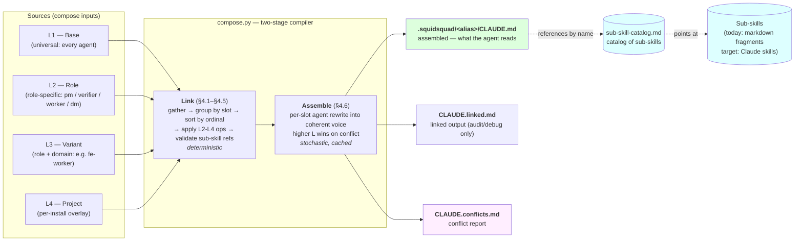
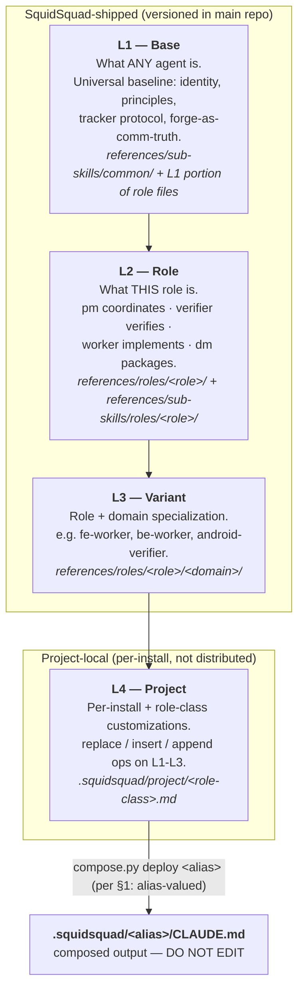
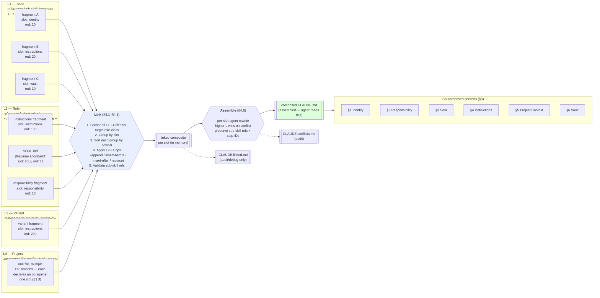
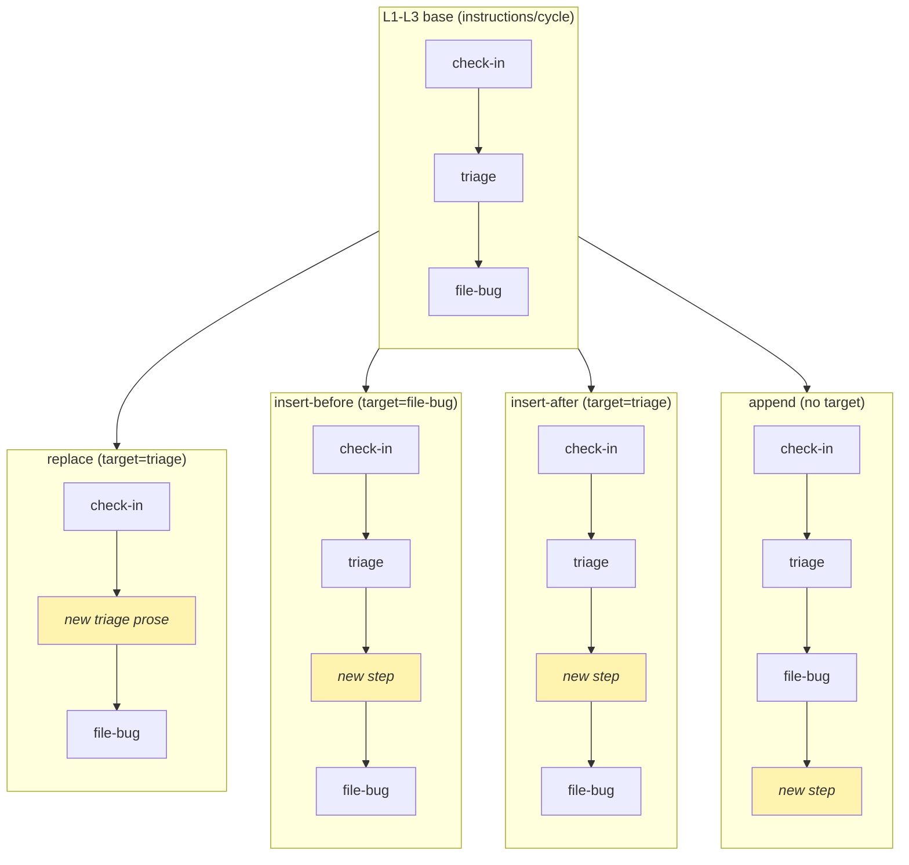
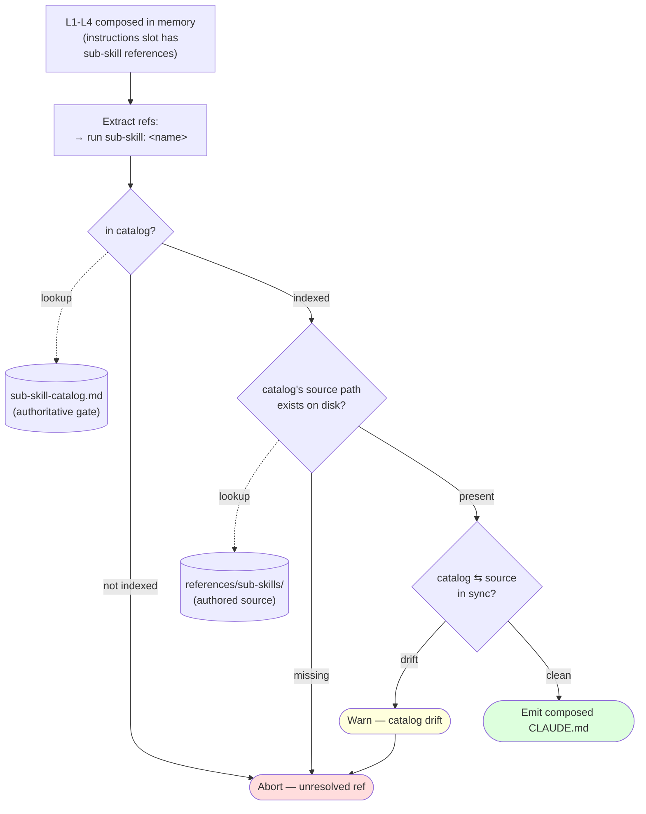
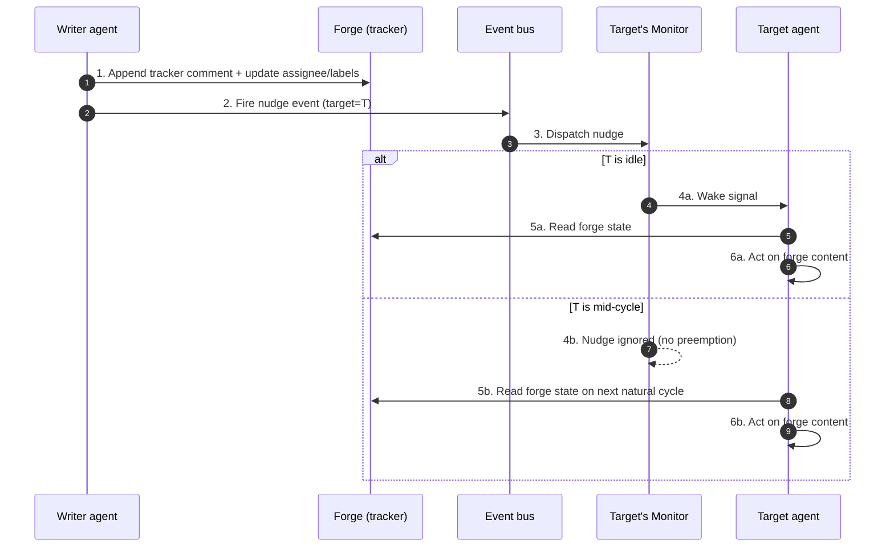
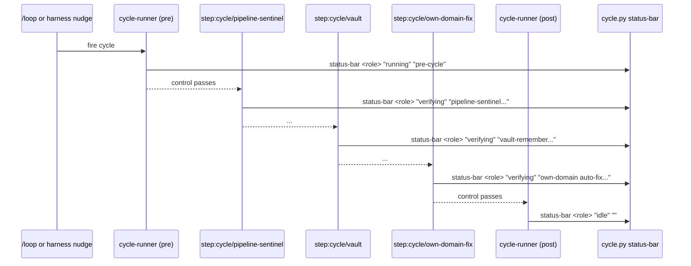
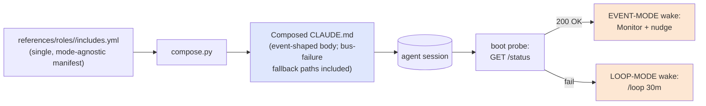
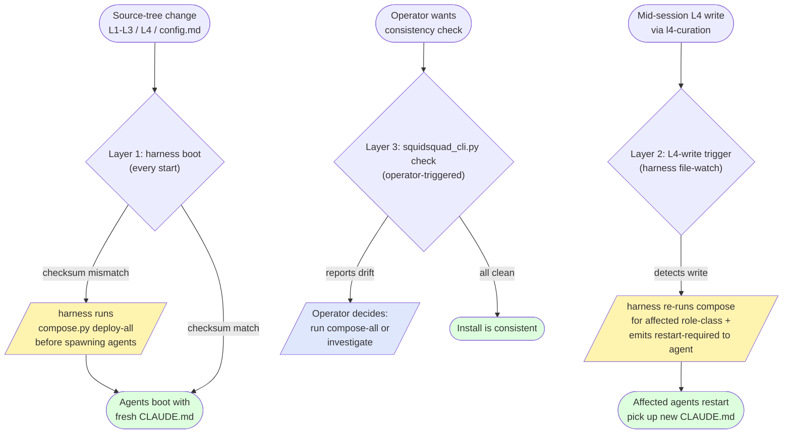

# Compose Architecture (v2 draft)

> **Status**: v2 draft, 2026-05-23. Authored under issue #9968 (L1-L4 review + compose-architecture doc epic). v1 (cycle 1616) emphasized inlining sub-skill content into the composed CLAUDE.md; v2 reframes the composed CLAUDE.md as a **thin orchestration layer that references sub-skills** catalogued in [`sub-skill-catalog.md`](sub-skill-catalog.md). Aligns with the Claude-skills direction from #9968 cycle 1619.
> **Companion docs**: [`ARCHITECTURE.md`](ARCHITECTURE.md) (overall system), [`AGENT-RUNTIME.md`](AGENT-RUNTIME.md) (loop vs event runtime, harness, event bus), [`sub-skill-catalog.md`](sub-skill-catalog.md) (the catalog of sub-skills referenced from composed CLAUDE.md), [`sub-skill-guide.md`](sub-skill-guide.md) (how to author sub-skills).
> **Source-of-truth scope**: this document defines how SquidSquad assembles agent CLAUDE.md outputs from layered sources, and how those outputs reference sub-skills. Implementation work sequences from §12 (Closure plan).

---

## 1. Goal & non-goals

### Goal

Establish a single source of truth for how SquidSquad **composes** the per-agent instruction document (`.squidsquad/<alias>/CLAUDE.md`) from layered source files.

> **Path-keying terminology** — this doc uses three distinct path patterns. Conflating them is a common reader trap:
>
> | Path pattern | Keyed by | Meaning |
> |---|---|---|
> | `.squidsquad/<alias>/CLAUDE.md` | **alias** (install-time agent instance name) | The composed output — one per running agent. Two `worker`-class instances named `frontend-1` and `backend-1` produce two distinct CLAUDE.md files at two distinct paths. |
> | `.squidsquad/project/<role-class>.md` | **L2 role-class** (categorical only: `pm` / `worker` / `verifier` / `dm`) | The L4 source — one per L2 role-class. L3 specialization does NOT differentiate L4 files: all worker-class instances share `worker.md` regardless of whether they're fe-flavored, be-flavored, iOS-flavored, etc. Maximum 4 L4 files per install. |
> | `references/roles/<role>/...` and `references/sub-skills/roles/<role>/...` | **role-class** | The L1-L3 authoring source paths. The literal `<role>` segment in these paths is role-class-typed; the directory name predates the class/alias distinction. |
>
> CLI flag names in this codebase (`--role`, `SQUIDSQUAD_ROLE`, `cycle.py status-bar <role>`, `compose.py deploy <role>`) accept **alias** values, not role-class names — the `<role>` parameter name predates the alias/role-class distinction and is preserved for code-compat. Callers (including the installer's Phase 6 invocation, see INSTALLER-ARCH §4.9) pass the install-time alias (e.g. `pm`, `frontend-1`, `verifier`) as the argument. Compose internally resolves the alias → role-class via `.squidsquad/config.md`'s `## Aliases` registry to find the right L4 file. See [AGENT-RUNTIME §5.3 Vocabulary note](AGENT-RUNTIME.md) and [HARNESS-ARCH §10](HARNESS-ARCH.md).

The composed CLAUDE.md is a **thin orchestration layer** — it declares an agent's identity, soul, ordered step references, project context, and vault slot content. It does **not** contain the bodies of sub-skills; instead it references them by name from [`sub-skill-catalog.md`](sub-skill-catalog.md). Sub-skill bodies live in their authored sources under `references/sub-skills/` (plain markdown fragments). A **project-scoped Claude-skills installer** that materializes each sub-skill into the project's local `.claude/skills/<name>/SKILL.md` is target-state but not yet shipped — see §4.5.1 Gap.

The composition must:

- Treat SquidSquad-shipped layers (L1-L3) as **literal** orchestration content authored and versioned in this repo.
- Treat the project-local layer (L4) as **creative overlay** authored in deployed installs from human conversation — instructions, project context, identity overlays. (The `vault` slot is excluded — L1-exclusive per §3.3.)
- Produce a composed output whose **structure does not depend on author discipline alone** — the compose pipeline enforces section grammar, ordering, and the rule that step bodies are *references*, not duplicated sub-skill content.

### The model in one diagram



**L1-L4 = the layered authoring model that compose stacks into a single CLAUDE.md per agent.** Sub-skills = the units of functionality that CLAUDE.md references. The catalog (`sub-skill-catalog.md`) is the single index of which sub-skills exist. The two axes are independent — see [`sub-skill-catalog.md`](sub-skill-catalog.md) "Sub-skills vs L1-L4".

### Non-goals

- Redesigning the L1-L4 *responsibility model* itself — that landed in #9925 and is preserved as-is.
- Defining the event bus, harness lifecycle, or agent state machine — see [`AGENT-RUNTIME.md`](AGENT-RUNTIME.md).
- Replacing the role-class concept itself (pm / verifier / worker / dm — see [AGENT-RUNTIME.md](AGENT-RUNTIME.md) Terminology) — those are stable.
- Specifying the wizard install flow beyond compose hooks — see `WIZARD.md`.

---

## 2. The L1-L4 model (recap from #9925)

Four layers, in shipping/precedence order:

| Layer | Purpose | Authoring location | Authored by |
|---|---|---|---|
| **L1** — Base | What ANY SquidSquad agent is. Universal baseline: identity foundation, core principles, tracker protocol, cycle runner transport, inter-agent communication via forge (§5.1.1). Every role-class on every install starts from here. | `references/sub-skills/common/` (sub-skills L1 references) and the L1 portion of role source files | SquidSquad maintainers (shipped) |
| **L2** — Role | Role-class-specific behaviours: `pm` coordinates, `verifier` verifies, `dm` packages, `worker` implements. The role-class-defining contract (responsibility, role-class-specific instructions, role-class-specific tone). | `references/roles/<role>/instructions.md` + `references/roles/<role>/SOUL.md` + `references/sub-skills/roles/<role>/` | SquidSquad maintainers (shipped) |
| **L3** — Variant (role-class + domain) | Per-stack or per-domain specialization of a role-class: a `worker` for the android stack, a `verifier` for the web stack, etc. Same role-class contract narrowed to a domain. | `references/roles/<role>/<domain>/` (e.g. `roles/worker/android/`, `roles/verifier/web/`) | SquidSquad maintainers (shipped) |
| **L4** — Project (per-install + role-class) | **Long-living** project-local customizations of one role-class for this install. Permanent or load-bearing facts about THIS project that diverge from default SquidSquad behaviour — not short-term cycle state. Sourced from human conversation in the deployed project. Includes project-specific instructions, project context (durable facts), identity overlays. (Does NOT include the `vault` slot — vault slot is L1-exclusive per §3.3.) | `.squidsquad/project/<role-class>.md` (project-local, not distributed) | Agent (via human conversation), persisted by `compose.py` |

**Each layer is *more specific* than the previous**: L1 = every agent → L2 = this role-class → L3 = this role-class + this domain → L4 = this role-class + this domain + this install. Cross-cutting sub-skills like `vault-protocol`, `improvement-scan`, `git-commit`, `agent-lifecycle` live in `references/sub-skills/common/` and are **referenced from** the appropriate layer (usually L1) — they aren't a layer themselves; they're shared procedures that layered instructions invoke.

**Key invariant** — L1-L3 are part of the SquidSquad repo and ship globally. L4 is *generated and maintained per-install* by the agent in response to human instruction in the deployed project. L4 is the **long-living memory of how this project diverges from default SquidSquad behaviour** — permanent project traits, standing human preferences, and load-bearing facts. Short-term state (current phase, in-flight PRs, today's blockers, cycle counters) is **NOT** L4 — it belongs in `.squidsquad/vault/BRIEFING.md` (the working short-term summary) or the tracker itself.

**L4 vs BRIEFING.md vs tracker — what goes where:**

| Lifetime | Example | Where it belongs |
|---|---|---|
| Permanent (multi-month / project-lifetime) | "PM is documentation-only on this team"; "self-hosted: framework builds itself"; "prose-heavy work product, drift is the primary risk"; tech stack; repo URL; architecture decisions that won't change | **L4** (`.squidsquad/project/<role-class>.md`) |
| Medium-term (weeks / project-phase) | active priorities list, recent decisions, current blockers, "we're mid-TRD-polish, not yet PRDs" | **BRIEFING.md** (`.squidsquad/vault/BRIEFING.md`) — staleness-checked every cycle |
| Session (crash-to-crash) | the agent's own current-work checkpoint — current task, partial progress, key decisions made this session | **working-state.md** (`.squidsquad/<alias>/working-state.md`) — agent-owned crash-recovery file (see AGENT-RUNTIME §6) |
| Short-term (cycle / task) | current cycle number, in-flight PR numbers, today's work-queue, last activity per agent | **tracker** (GitHub Issues, `.harness-state.json`) |

A symptom that content is in the wrong layer: if you'd want to delete or rewrite it within a few cycles, it doesn't belong in L4.



---

## 3. Authoring principles

### 3.0 Compose inputs: L1-L4 content + `config.md` configuration

Compose has **two distinct input axes**, easy to conflate:

- **L1-L4 content layers** (this section's main subject) — *what* the agent reads in its composed CLAUDE.md. Layered by specificity (universal → role-class → variant → project-local). Files: `references/sub-skills/`, `references/roles/<role>/`, and `.squidsquad/project/<role-class>.md` (the per-role-class L4 file).
- **`.squidsquad/config.md`** — the install's **configuration**, not a content layer. Lives at `<project-root>/.squidsquad/config.md` (the **install root** = the project root directory that contains the `.squidsquad/` directory) — directly inside `.squidsquad/` alongside the `project/` and `<alias>/` subdirectories, NOT under `project/` (so it is not an L4 file). **Format**: markdown body with structured fields as `- **Field**: value` bullets at the top (parsed by `config.py`), followed by the required `## Aliases` H2 section in the exact schema below. It declares install-level parameters: `Workers:` (the roster), `Iteration Interval`, `Improvement Scanning:`, other feature toggles, and the `squidsquad_version:` install-time stamp (read at upgrade time per INSTALLER-ARCH §10 step 2). **The §4.6 assemble pass is unconditional.** Every non-forced-verbatim slot is rewritten by the assemble subagent on every compose run. This is feasible because the orchestrator-content rule (§4.6) keeps slots small and goal-shaped — the per-slot subagent task is bounded prose reconciliation against the precedence rule, not full-content authorship. The length-floor and forced-verbatim slot set are compose-time constants; the assemble model and per-slot model overrides are configurable via `assemble-slots:` (see §4.6). Compose reads `config.md` to make compose-time *decisions* — what placeholder values to substitute, which aliases exist for `compose.py deploy-all`, etc. **Wake mode is NOT a config.md field**: compose is mode-agnostic; event mode is the unconditional composed-output shape; the boot-time harness probe selects the wake mechanism at runtime (see [AGENT-RUNTIME §9.3](AGENT-RUNTIME.md)).

  **`## Aliases` schema** (canonical):

  ```markdown
  ## Aliases

  | alias | role-class | L3 domain |
  |---|---|---|
  | pm | pm | — |
  | frontend-1 | worker | fe |
  | backend-1 | worker | be |
  | verifier | verifier | — |
  | dm | dm | — |
  ```

  Three columns, all required. `alias` is the install-time agent instance name. `role-class` is one of the four L2 categorical classes (`pm` / `worker` / `verifier` / `dm`) and drives L4 file selection (per §3.3). `L3 domain` is the technical specialization (e.g., `fe`, `be`, `ios`, `android`, `web`) and drives L3 source-file selection (per §4); use `—` for role-classes without L3 specialization. Multiple aliases may share a role-class (with different or same L3 domains); they share the L4 file. Each row's alias must be unique within an install. Missing alias from the registry causes `compose.py deploy <alias>` to abort with a diagnostic; the harness rejects `/work/assign` with `target_alias` not in the registry as 404 (per AGENT-RUNTIME §8.3).

The two axes interact at compose time. Examples:

| Compose-time concern | Driven by L1-L4 content | Driven by `.squidsquad/config.md` |
|---|---|---|
| Section text in the output | ✅ source file body content | — |
| Slot ordering inside output | ✅ frontmatter `(slot, ordinal)` | — |
| Wake-mode selection | — | — *(decided at agent boot via harness probe; not a compose-time concern; see AGENT-RUNTIME §9.3)* |
| Placeholder substitution (e.g. `{{role-roster}}`) | ✅ template lives in L1-L3 | ✅ values come from `.squidsquad/config.md` (e.g. `Workers:` list) |
| Iteration interval baked into boot's `/loop` invocation | — | ✅ `Iteration Interval > Minutes` |
| Whether vault-remember / improvement-scan runs | ✅ sub-skill self-gates on flag | ✅ flag value lives in `.squidsquad/config.md` |

**Mental model:** L1-L4 is the *content* the install ships; `.squidsquad/config.md` is the install's *parameters*. Both feed compose; neither is a layer of the other.

Per-install customization paths therefore split:

- **Project-local content changes** (new instructions, role-boundary additions, soul tweaks, project facts) → L4 file (`.squidsquad/project/<role-class>.md` with H2 slot sections)
- **Install configuration changes** (different Workers roster, different cycle interval, feature toggle) → `.squidsquad/config.md`

A project that wants to *describe* its team differently in agent prompts adds an L4 `## Identity` `### append` block. A project that wants to *change the install's actual roster* (e.g. add an `fe-worker` instance — a worker-class agent with FE L3 specialization) edits `.squidsquad/config.md`'s `## Aliases` registry and re-runs `compose.py deploy-all`. Both can coexist.

### 3.1 DRY across layers + sub-skill catalog (single authoring location)

Each creative-work concept must have exactly **one authoring location**:

- **Step orchestration** (which steps run, in what order, with what gating) lives at exactly one layer in L1-L4. If two layers define the same orchestration concept (e.g. an L3 "pm Project Operations" section and an L4 "Project Operations" section), the compose pipeline detects the collision and **rejects the build**.
- **Sub-skill bodies** (the actual how-to for "file a bug", "run pre-cycle", "scan for improvements") live in exactly one location: the sub-skill source file. They are catalogued in [`sub-skill-catalog.md`](sub-skill-catalog.md) and referenced from composed CLAUDE.md by name — **never inlined**.

DRY enforcement applies to:

- Section titles at H2 level (per §5 six-section grammar).
- Sub-skill names (each sub-skill has exactly one source file and one catalog entry).
- Step IDs (see §6.1).
- Vault note names.

When extension is needed across layers, the *lower* layer extracts a referenceable hook (e.g. `step:cycle/check-in`); the *higher* layer references it by ID. Sub-skill bodies are never copied between layers — they're authored once at their source file and referenced from any orchestration layer that needs them.

### 3.2 Slot + ordinal contract (L1-L3)

**Mental model first.** A layer is *not* a single file — it's a **collection of source files spread across multiple slots**. A slot is a section of the composed output (the six sections in §5). Each source file declares one slot via frontmatter (`slot:`) and a position within it (`ordinal:`). For a target role, `compose.py` gathers every L1-L4 file that applies, groups by slot, sorts each group by ordinal, applies layer ops (L2-L3 inline ops first, then L4 file ops — same grammar throughout, per §3.3), and emits the result into the composed `CLAUDE.md`'s six H2 sections.



**Read this diagram from left to right**: each layer holds *many* files; each file declares one slot via frontmatter; compose gathers + groups + sorts, applies L2-L4 ops, and the result lands in one of six composed sections. The same composed section is fed by files from multiple layers — Identity in the composed output is the concatenation of every `slot: identity` file from L1 + L2 + L3 (in ordinal order), then any L2-L4 ops applied on top (L2-L3 inline ops first, then L4 file ops; same grammar — see §3.3).

**Why this model** — sub-skills, role-class-specific fragments, and cross-cutting content can each live in their own source file with their own frontmatter, but still land in the right composed section. L4 ops target slots + step IDs (not source filenames), so reorganizing L1-L3 files doesn't break L4 customizations.

---

Every L1-L3 sub-skill source file declares **structured frontmatter** at the top:

```yaml
---
slot: identity | responsibility | soul | instructions | project-context | vault
ordinal: <integer, ascending within slot>
step-ids: [step:cycle/<name>, step:boot/<name>, ...]  # for instructions slot only
---
```

`compose.py` reads frontmatter from every L1-L3 file, sorts by `(slot, ordinal)`, and emits the content of each in that order under the appropriate top-level section (see §5) — emitted verbatim for non-instructions slots (`identity`, `responsibility`, `soul`, `project-context`, `vault`); the `instructions` slot is emitted as **sub-skill references**, not inlined sub-skill bodies, per §4.1 step 4. Concretely: the source files in the `instructions` slot already contain the reference text directly (e.g., `→ run sub-skill: pipeline-sentinel`), and compose emits that text verbatim without transformation — there is no compile step that converts inlined sub-skill bodies into references.

> **Filename convention for slot authoring.** Most L1-L3 source files declare `slot:` via frontmatter explicitly. One filename is a reserved shorthand that compose treats as an implicit slot assignment — it exists so the canonical authoring location is easy to find:
>
> | Filename pattern | Implicit slot | Implicit ordinal |
> |---|---|---|
> | `references/roles/<role>/SOUL.md` | `soul` | 1 |
>
> May be replaced by a regular `.md` with explicit frontmatter; the shorthand is equivalent, not load-bearing.
>
> (Responsibility-slot content used to have a parallel shorthand at `references/sub-skills/roles/<role>/responsibility.md`. That file is retired per §5.2; responsibility content now lives in the role-class's L2 source via explicit `slot: responsibility` frontmatter, not via filename convention. The shorthand is gone.)

Ordinals are integers, non-dense (gaps allowed). Authors use gaps of 10 (e.g. 10, 20, 30) so future inserts don't require renumbering.

> **Important** — The `instructions/cycle` sub-slot uses **one mode-agnostic manifest** per role-class (`references/roles/<role>/includes.yml`). Compose is wake-mode-blind; the composed cycle sub-tree is event-shaped and carries bus-failure fallback paths the cycle body invokes at runtime. The boot-time harness probe binds the wake mechanism per session; see §6.5 + AGENT-RUNTIME §9.3.

### 3.3 Layer operations (L2-L4 creative overlay)

> **#11227 — uniform op grammar across L2-L4.** The op grammar described in this section was originally L4-only. As of #11227 (2026-06), L2 and L3 source files (`references/roles/<role-class>/instructions.md`, `references/roles/<role-class>/<domain>/instructions.md`, etc.) may author the same op directives inline in their body — the link stage extracts them and applies them through the same processor (`l4_op_processor.apply_l4_ops`) that handles L4 file ops. Application order is source-layer order: L1-L3 inline ops first (sorted by ordinal/path), then L4 file ops. L1 sources continue to contribute pure base content — they don't author ops by convention (though the grammar would permit it). Below, "L4 op" / "L4 file" terminology is preserved for clarity around the original L4-only use case; the same syntax and semantics apply at L2-L3.

#### 3.3.1 L4 file (the original use case)

**There is exactly one L4 file per L2 role-class** in an install: `.squidsquad/project/<role-class>.md` where `<role-class>` is one of the four categorical L2 classes (`pm`, `worker`, `verifier`, `dm`). **L3 specialization does NOT differentiate L4 files** — all worker-class instances (FE-flavored, BE-flavored, iOS-flavored, etc.) share `worker.md`; same for verifier. Maximum 4 L4 files per install. Rationale: L4 is project-specific overlay, and the project's policies about "what a worker does" don't change based on which technical domain a given worker is in. Per-domain content lives in L3 source files, not L4.

Example — a team preset spawning `pm + 2 FE-flavored workers + 1 BE-flavored worker + verifier + dm` (5 agent instances, but only 3 distinct role-classes appear among the workers) produces **4 L4 files**:

- `.squidsquad/project/pm.md` — used by the pm agent
- `.squidsquad/project/worker.md` — shared by all three worker instances (FE-flavored and BE-flavored alike)
- `.squidsquad/project/verifier.md` — used by the verifier
- `.squidsquad/project/dm.md` — used by the dm

`compose.py deploy <alias>` resolves the alias → role-class via `.squidsquad/config.md`'s `## Aliases` registry, then reads `.squidsquad/project/<role-class>.md` to find the L4 file. Two instances of the same role-class compose to byte-identical L4 input. L3 specialization (FE vs BE etc.) is applied separately during compose by selecting the right L3 source files from `references/roles/<role>/<domain>/` — see §4 for the pipeline.

> **Deprecates the multi-file L4 pattern.** Earlier installs scattered L4 content across per-slot files (`<role>-instructions.md`, `<role>-responsibility.md`, `<role>-soul-directives.md`, `shared-instructions.md`, etc.) under `.squidsquad/project/`. Those are legacy. Under the unified L1-L4 model every slot's L4 content lives inside the same per-role-class `<role>.md` under its slot H2. The legacy seed files in `references/sub-skills/project/` are slated for collapse to one seed per role-class (see §7.3 and the L4-seed section of [`sub-skill-catalog.md`](sub-skill-catalog.md)).

Inside the L4 file, content is organized by slot using H2 headings that mirror the composed-output grammar (§5):

```markdown
## Identity
...

## Responsibility

### append
...

### replace
...

## Soul
...

## Instructions

### insert-after step:cycle/file-bug
...

### replace step:cycle/triage
...

### append
...

## Project Context
...

# (## Vault is L1-exclusive — L4 files MUST NOT contain a `## Vault` H2; per the rule below and the per-slot constraint table)
```

Each `## <Slot>` section holds the project's customizations for that slot. Within `## Instructions`, individual operations are H3 headings using the form `### <op> [step-id]`:

- **`### append`** — content appended at the end of the slot. Used for net-new project rules that don't relate to a specific L1-L3 step. The slot may have multiple `### append` entries; they merge in file order.
- **`### insert-before step:cycle/<step-id>`** — content inserted immediately before the named L1-L3 step.
- **`### insert-after step:cycle/<step-id>`** — inserted immediately after.
- **`### replace step:cycle/<step-id>`** — replaces the L1-L3 step's content entirely. The step ID is preserved so later inserts targeting it still resolve.
- **`### replace`** (no `step:` target) — **whole-slot replace**. Replaces the entire L1-L3 slot body with the L4 H3 block body. Valid only under `## Responsibility` (the only slot whose op constraints list whole-slot `replace`). A bare `### replace` (no target) under `## Identity`, `## Soul`, `## Instructions`, `## Project Context`, or `## Vault` is a validation error.

Compose **must validate** that every `step:` reference in an `## Instructions` H3 resolves to a real L1-L3 step ID before emitting output. Unresolved references abort compose with a diagnostic.

#### Per-slot op constraints

Not every op is legal on every slot. The soul slot is identity, not instruction, and is constrained to additive customization only:

| Slot | Legal ops | Notes |
|---|---|---|
| `identity` | append only (with Boundaries-sub-section exemption — see column at right) | the slot is short prose; project additions go at the end. The append-only rule is consistent with the Boundaries-immutability rule: L4 can ONLY add new content after the existing Identity body, and **the Boundaries sub-section is L1-only and immutable from L4** (its content — universal prohibitions shipped with the framework — cannot be removed, reordered, or replaced by L4 ops). L4 may `append` new universal prohibitions ("in this project, no agent ever X") which append content *after* the Boundaries sub-section; L4 cannot insert between Identity prose and the Boundaries list. See `l4-curation` for the curation dialog. |
| `responsibility` | append OR replace (whole-slot) — mutually exclusive in a single L4 file | role-boundary prose has no step IDs, so step-targeted ops do not apply. **Whole-slot `replace` is terminal**: if `### replace` appears under `## Responsibility`, no other ops are permitted in that slot for the same L4 file. Multiple `### replace` blocks or mixing `### append` with a whole-slot `### replace` is a validation error (see §4.2 step 2.i). `append`-only is the default; `replace` swaps the entire L1-L3 responsibility block for the L4 body. |
| `soul` | **append only** | no targeted ops; see §3.4 for semantic-merge precedence |
| `instructions` | append + insert-before + insert-after + replace (step-targeted only) | the primary surface for behaviour customization; whole-slot `replace` is forbidden (the slot has step IDs and must target one). **`append` constraint**: every L4 `### append` block under `## Instructions` MUST contain at least one `→ run sub-skill: <name>` reference resolvable against the catalog (§4.5). Arbitrary prose without a sub-skill reference is a validation error (preserves the thin-orchestration invariant; see §4.2 step 2.iv). |
| `project-context` | append only | **L4-only slot** — L1-L3 cannot author this slot (no cross-install layer can know about a specific project — see §5.5). Compose rejects any L1-L3 source file with `slot: project-context` frontmatter. L4 entries seeded by installer Phase 1 + accumulated at runtime by `l4-curation`. |
| `vault` | N/A (L1-exclusive — L4 cannot contain a `## Vault` section at all) | **Scope of "L1-exclusive"**: refers to *the composed `## Vault` section text in CLAUDE.md* — the short framework-shipped slot describing the vault contract (PARAG model, entity types, wikilink grammar, confidence levels). It does NOT refer to the on-disk vault knowledge store at `.squidsquad/vault/`, which is read/written at runtime by agents via vault sub-skills (see `references/sub-skills/common/vault-protocol.md` and VAULT-ARCH). The "Legal ops" column reflects what L4 H3 blocks may target; for vault specifically, this differs from other "no legal ops" rows — vault sections in L4 are *structurally forbidden*, not just op-restricted. Compose rejects any L2/L3/L4 source file with `slot: vault` frontmatter. (L1 fragments still compose via the normal `(slot, ordinal)` ordering — that's fragment combination, not an op.) Guardrail (2026-05-29): per-role / per-domain / per-project customization is currently disallowed to keep the vault contract stable; revisit if a concrete customization pattern emerges. See G4. |

Compose **must reject** any source file or L4 file whose structure violates these constraints. The vault and project-context slots have two distinct validation rules because L1-L3 sources use frontmatter to declare their slot while L4 files use H2 section headings:

1. **Structural rule (H2 sections in L4 files)** — L4 files MUST NOT contain a `## Vault` H2 section (vault slot is L1-exclusive — see §5.6 + G4). L4 files MAY contain a `## Project Context` H2 (Project Context is L4-exclusive — see §5.5).
2. **Frontmatter rule (L1-L3 source files)** — Compose rejects any L1-L3 source file that declares `slot: project-context` (L4-only). Compose rejects any **L2 or L3** source file that declares `slot: vault` (L1-only). **L1 source files with `slot: vault` frontmatter ARE permitted** — that's how the vault slot gets authored.

Other examples that violate the per-slot constraints (and trigger rejection regardless of layer): a `### replace` (any form) H3 under `## Soul`; a bare `### replace` (no target) under any slot except `## Responsibility`; a step-targeted `### replace step:cycle/<step-id>` under `## Responsibility` (no step IDs to target there).

> **Vault differs from other "no legal ops" rows.** For most slots, "no legal ops" means L4 may not perform any H3 op on that slot's content. Vault is stricter: a `## Vault` H2 section in an L4 file is *structurally forbidden* — compose rejects the entire L4 source file if it contains one. The N/A in the table is not "the slot exists but L4 has no ops to perform on it"; it means the slot must not appear in L4 at all.

#### 3.4 Soul slot — semantic-merge precedence

The soul slot encodes a role-class's identity (values, tone, professional posture). Because identity is not safe to overwrite positionally, soul L4 is restricted to append-only (per §3.3 above). At compose time, the L4 `## Soul` section content is concatenated after the shipped L1–L3 soul content within the slot.

The composed CLAUDE.md therefore presents both views: shipped soul first, project-local append second. When an agent reads the composed soul section and notices that the L4 append contradicts the shipped L1–L3 soul, **the L4 append wins**. This semantic-merge precedence is a runtime rule the agent applies when interpreting its own composed identity, not a compose-time rewrite — the shipped soul stays on disk for traceability, and the precedence is settled by ordering convention (L4 last) plus an explicit precedence note that the soul slot emits at the L4 append boundary.

Practical implications:

- Projects can supplement shipped persona safely (e.g., "in this project, also prioritize X").
- Projects can override shipped persona on specific points by writing a directly contradictory rule in `## Soul` — the agent follows the L4 rule.
- Projects cannot scrub or rewrite the shipped persona. The shipped soul remains visible in the composed output; only the agent's interpretation is overridden.

Visual semantics of the four ops, all acting on the same L1-L3 base (the table below shows mechanics for slots that accept all four ops; soul-specific behaviour is described above):



`replace` swaps prose at the same position; `insert-before`/`insert-after` adds adjacent to a named anchor; `append` lands at the slot's tail. Step IDs are preserved across `replace` so downstream L4 ops targeting them still resolve.

---

## 4. Compose pipeline behaviour

Compose is a **two-stage compiler**: **link** then **assemble**.

| Stage | What it does | Determinism |
|---|---|---|
| **Link** (§4.1–§4.5) | Gather L1-L4 sources by slot, filter by role-class, sort by `(slot_index, ordinal)`, apply L4 ops (replace / insert-before / insert-after / append), validate sub-skill references. Produces the raw **linked** composite per slot. | Deterministic — given `(role-class, source-tree-hash, L4-tree-hash)`, the linked output is bit-stable. Compose is wake-mode-blind (per §3.0 and §6.5), so wake-mode is not a determinism input. |
| **Assemble** (§4.6) | Each linked slot body is rewritten by an agent into a single coherent voice — eliminates contradictions, conditional negations, awkward insertions left over from op layering. Produces the final agent-consumable **assembled** prose. | Stochastic on first run; cached by `(linked-body, slot-purpose, model-id)` hash, so deterministic from the caller's POV across re-deploys with unchanged inputs. |

Runtime agents read the **assembled** output (`.squidsquad/<alias>/CLAUDE.md`). The **linked** output is preserved as a sibling artifact (`.squidsquad/<alias>/CLAUDE.linked.md`) for audit and debugging only — runtime agents never read it, and per-slot subagent failures do not fall back to the linked file at runtime. Per-slot fallback semantics are defined in §4.6 (failure modes table); the runtime always reads the assembled `CLAUDE.md`. Both files are git-tracked.

**Why two stages**: the slot+ops model is expressive at authoring time but composes a body that can carry contradictions, conditional negations of prior content, and inserts in awkward positions. A runtime agent reading the linked output would have to mentally reconcile all of that on every cycle — wasting context and creating ambiguity. The assemble pass collapses the layered linked output into a single coherent voice once at deploy time, so the runtime cost is zero.

### 4.1 Link: Literal L1-L3 merge

Compose processes L1-L3 deterministically:

1. **Collect**: walk `references/sub-skills/`, `references/roles/<role>/`. For each file with frontmatter, read its `slot` and `ordinal`. For files in the `instructions` slot, also extract the sub-skill name referenced in the file body (e.g. from `→ run sub-skill: <name>` directives) — this is a body-extracted reference, not a frontmatter field. Files whose frontmatter declares an L4-exclusive slot (`slot: project-context`) or a higher-layer-only slot (e.g., `slot: vault` from L2-L4) are **rejected with a diagnostic — compose aborts** with a clear error pointing at the offending file. This is a validation rule, not a silent skip — invalid frontmatter blocks composition entirely so the operator can fix the source.
2. **Filter by role-class**: each file may declare which role-classes it applies to (via `roles:` frontmatter list; default = all). Files not applicable to the current role-class are dropped.
3. **Sort**: stable sort by `(slot_index, ordinal)`. `slot_index` is a fixed enum: identity=0, responsibility=1, soul=2, instructions=3, project-context=4, vault=5.
4. **Emit orchestration**: under the appropriate top-level section header, emit each file's orchestration content verbatim. Inside the `instructions` slot, step bodies are **references to sub-skills by name** (e.g. `→ run sub-skill: pipeline-sentinel`) rather than inlined sub-skill content. The catalog of available sub-skills lives at [`sub-skill-catalog.md`](sub-skill-catalog.md) — composed CLAUDE.md never duplicates it.

The output of step 4 is the **L1-L3 base composition** — purely the SquidSquad-shipped orchestration, with sub-skill names referenced (not their bodies), and no project customization yet applied.

**Why references and not inlining**: today's behavior inlined sub-skill bodies via `{{include}}` directives, producing 50KB+ composed CLAUDE.md files where most content was duplicated sub-skill text. Under v2, composed CLAUDE.md is the thin orchestration (5–10KB) and the model invokes sub-skills via the Skill tool when their description matches the situation. The transition is staged — see §10 migration plan.

### 4.2 Link: Creative L4 application

After the L1-L3 base is in memory, compose reads exactly one L4 file: `.squidsquad/project/<role-class>.md` (the role-class being deployed). If the file is absent, the L4 step is a no-op — the composed output is L1-L3 only.

1. Parse the L4 file. Top-level H2 sections name the slot: `## Identity` / `## Responsibility` / `## Soul` / `## Instructions` / `## Project Context` / `## Vault`. Sections may appear in any order; missing sections are skipped.
2. For each slot section present, apply ops in this order to the L1-L3 base for that slot:
   1. **Whole-slot replace (responsibility only).** If the slot is `responsibility` and the section contains a bare `### replace` (no `step:` target), apply it first — the L4 H3 block body replaces the entire L1-L3 responsibility base. Whole-slot replace is **terminal**: no other ops are applied to that slot in this L4 file (multiple `### replace` blocks under `## Responsibility` is a validation error; mixing whole-slot replace with `### append` under the same `## Responsibility` is a validation error). If the slot has no bare `### replace`, skip this sub-step and proceed.
   2. All `### replace step:cycle/<step-id>` H3 blocks. Each H3 targets at most one L1-L3 step; duplicate replace targets abort compose. **Semantics**: `replace` swaps the *body* of the targeted step; the **step ID and its ordinal position are preserved** as ordering anchors in the linked sequence. Subsequent `insert-before` / `insert-after` ops can still target the replaced step ID and will resolve correctly. A `### replace step:cycle/<id>` with an empty body produces a no-op anchor — the step ID remains in the sequence (and can still be targeted by later inserts) but contributes no content to the linked output.
   3. All `### insert-before step:cycle/<step-id>` and `### insert-after step:cycle/<step-id>` H3 blocks. Positions are evaluated against the **post-replace** ordering — the step IDs from step 2.ii are still present (only their bodies changed), so inserts targeting replaced steps resolve normally. New steps introduced by `insert-before` / `insert-after` are assigned ordinals between the anchor step's ordinal and its neighbor's (using fractional ordinals internally; never exposed to the L4 author).
   4. All `### append` H3 blocks last, in file order (the order they appear in the L4 file). `append` blocks are placed at the **end of the slot's content**, after the L1-L3 base AND after all step 2.ii / 2.iii ops have been applied. Multiple `### append` blocks land in their L4-file order. There is no mechanism to place `append` content before other L4 ops; if the author needs that, they should use `insert-before` targeting the first step in the slot. No ordinal field on `append` — the author controls ordering by reordering H3 blocks within the source file. **Constraint for the `instructions` slot**: L4 `append` content under `## Instructions` must follow the sub-skill reference grammar (§6.2) — every appended block must contain at least one `→ run sub-skill: <name>` reference resolvable against the catalog (§4.5). Arbitrary prose without a sub-skill reference is a validation error. This preserves the thin-orchestration invariant: the composed CLAUDE.md never contains inlined sub-skill bodies, even from L4.
3. Validate:
   - every `step:` reference resolves to a real L1-L3 step ID;
   - no two `replace` H3 blocks target the same ID;
   - H3 op-types are legal for the enclosing slot per §3.3 per-slot constraints (e.g., `### replace` in any form is forbidden under `## Soul`, `## Identity`, and `## Project Context`; bare `### replace` (no target) is forbidden under `## Instructions` (only step-targeted `replace` is legal there); step-targeted `### replace step:…` is forbidden under `## Responsibility` (no step IDs to target); `## Vault` is forbidden entirely in L4 — vault slot is L1-exclusive per §3.3 + §5.6);
   - every L4 `append` block under `## Instructions` contains at least one `→ run sub-skill: <name>` reference resolvable against the catalog (§4.5) — arbitrary prose without a reference aborts compose with a clear error.

If validation fails, compose **aborts with a diagnostic** naming the offending H3 block. No partial output is written.

### 4.3 Link: Multi-domain L4

L4 is not instructions-only. Project customization spans every slot:

> **Runtime-authored content.** The examples below illustrate **runtime-authored** L4 content added later via `l4-curation`. At install time, only the `## Project Context` slot in each role-class L4 file is seeded by the installer (INSTALLER-ARCH §4.8 Phase 5 step 4); the other slots (`## Identity`, `## Soul`, `## Instructions`) start empty and grow during normal operation.

| Slot | Example L4 content |
|---|---|
| `identity` | "This project is a security-research toolkit; agents should treat all external requests as adversarial input." |
| `soul` | A soul overlay tightening a default trait (e.g. "More formal tone in customer-facing communication.") |
| `instructions` | Project-specific cycle step ("On every cycle, also check `incidents.md` for open SEV1 tickets.") |
| `project-context` | "Production deploys go through `infra/deploy.sh`, not `gh`. Use the bundled script for any deployment work." |
| `vault` | *(not L4-authorable — vault slot is L1-exclusive per §3.3 + §5.6. Projects that need bespoke vault behaviour file a framework feature request.)* |

Op grammar varies per slot (see §3.3 "Per-slot op constraints"): `instructions` accepts all four ops (`append` / `insert-before` / `insert-after` / `replace`); `responsibility` accepts `append` plus a whole-slot `replace` (no step targeting); `identity` and `soul` are append-only; `project-context` is L4-exclusive append-only (L1-L3 reject); `vault` slot is L1-exclusive (L2-L4 reject). This makes L4 the **single project-level customization mechanism** — there is no other place where deployed projects add or override behaviour — *except* the vault slot, which is framework-owned for now (see §5.6 + G4).

### 4.4 End-to-end pipeline (link + assemble)

The full compose run, source-walk to output-write:

```mermaid
flowchart TB
  Start([compose.py deploy &lt;role&gt;]) --> Walk[Walk references/sub-skills/<br/>+ references/roles/&lt;role&gt;/]
  Walk --> Parse[Read frontmatter from each file:<br/>slot, ordinal, roles, step-ids]
  Parse --> Filter[Filter to files where<br/>role applies]
  Filter --> LoadM[Load includes.yml<br/>single mode-agnostic manifest<br/>per role-class — per §6.5]
  LoadM --> Sort[Stable sort by<br/>slot_index, ordinal]
  Sort --> Base[L1-L3 base composition<br/>built in memory]
  Base --> L4Walk["Read .squidsquad/project/&lt;role-class&gt;.md<br/>(one file per role-class — per §3.3;<br/>H2 slot sections + H3 op blocks)"]
  L4Walk --> L4Group[Group L4 ops by slot]
  L4Group --> L4Apply[Within each slot, apply ops:<br/>1. all replace<br/>2. all insert-before / insert-after<br/>3. all append]
  L4Apply --> Validate{Validate:<br/>L4 targets resolve?<br/>DRY ok? no orphans?}
  Validate -->|fail| Abort([Abort with diagnostic<br/>no output written])
  Validate -->|pass| EmitLinked["Emit linked composite<br/>(per-slot bodies in memory only)"]
  EmitLinked --> Assemble{{"§4.6 — Assemble pass<br/>(per slot, unconditional<br/>for non-forced-verbatim slots)"}}
  Assemble --> Cache{Cache hit on<br/>hash(linked, slot, model)?}
  Cache -->|hit| FromCache[Reuse cached<br/>assembled body]
  Cache -->|miss| LLM["Agent-tool spawn<br/>(subagent_type: assemble)<br/>rewrites linked body<br/>into coherent voice"]
  LLM -->|"per-slot soft failure<br/>(timeout / refusal /<br/>JSON parse / AC6 after retry /<br/>per-slot preservation drop)"| Verbatim["Fall back to verbatim<br/>for this slot;<br/>log fallback reason in<br/>CLAUDE.conflicts.md"]
  LLM -->|success| AsmValidate{Structural preservation:<br/>sub-skill ref set ≡ linked?<br/>step ID set ≡ linked?<br/>length ≥ floor?<br/>code-block parity?}
  AsmValidate -->|"structural<br/>violation"| AbortAsm([Abort whole compose<br/>with diagnostic<br/>no triple written])
  AsmValidate -->|pass| StoreCache[Store in cache]
  FromCache --> WriteAtomic
  StoreCache --> WriteAtomic
  Verbatim --> WriteAtomic
  WriteAtomic{{"Atomic write:<br/>CLAUDE.md + CLAUDE.linked.md +<br/>CLAUDE.conflicts.md<br/>(triple lands together or<br/>not at all — partial-assemble<br/>runs still emit atomically)"}}
  WriteAtomic --> Done([Done — agents read CLAUDE.md])
  style Abort fill:#fdd
  style AbortAsm fill:#fdd
  style Verbatim fill:#fef
  style Done fill:#dfd
```

**Linked-body write timing**: the linked composite is held in memory throughout the assemble pass; `CLAUDE.linked.md` is only written to disk as part of the final atomic write after assemble succeeds (alongside `CLAUDE.md` and `CLAUDE.conflicts.md`). There is no scenario where `CLAUDE.linked.md` exists without a corresponding successful `CLAUDE.md`, and there is no scenario where a partial or pre-assemble linked file appears on disk. On assemble failure or any earlier-stage abort, none of the three files are written; the prior successful triple (if any) remains untouched.

**Link stage determinism**: through `EmitLinked`, the pipeline is fully deterministic — given `(role-class, source-tree-hash, L4-tree-hash)`, the linked composite is bit-stable. Wake-mode is NOT a determinism input — compose is wake-mode-blind (§3.0, §6.5). **Assemble stage determinism**: the first uncached run is stochastic (LLM rewrite), but the result is cached by `hash(linked-body, slot-purpose, model-id)`; subsequent re-deploys with unchanged inputs reuse the cached assembled body and produce bit-stable output. First-run drift between equivalent rewrites is the irreducible trade-off for collapsing the layered linked output into coherent prose; it is accepted by design — compose runs because inputs changed, so the new prose is the new contract.

### 4.5 Link: Sub-skill reference resolution

Because composed CLAUDE.md emits sub-skill *references* (not bodies) in the `instructions` slot, compose must validate that every reference resolves to a real sub-skill. The validation runs after L4 overlay and before output emission:

1. **Extract** every `→ run sub-skill: <name>` reference from the composed-in-memory `instructions` content (grammar defined in §6.2).
2. **Resolve** each `<name>` against [`sub-skill-catalog.md`](sub-skill-catalog.md). The catalog is the **authoritative gate**:
   - Every reference must have a matching catalog entry. Sub-skills not indexed in the catalog are *not* valid references, even if a same-named file exists on disk.
   - The catalog's recorded **source path** for that entry must point at an existing file. Today that path is `references/sub-skills/<...>/<name>.md` (plain markdown fragments). Once the project-scoped Claude-skills installer ships (see §4.5.1 Gap callout below), the installer is responsible for materializing each catalog entry as a real Claude skill under the project's local `.claude/skills/` — at that point the catalog's source path stays the same (the `references/` source is authored once, then installed per-project).
3. **Reject** if any reference fails either check above (no catalog entry OR catalog entry's source path missing on disk): abort with a diagnostic naming the offending step ID and unresolved sub-skill name. No partial output is written.
4. **Catalog drift check**: every catalog entry must resolve to a real source file on disk, AND every sub-skill source file under `references/sub-skills/` must have a catalog entry. If either side is out of sync, compose emits a warning listing the drifted entries (catalog rows without a source file and/or source files without a catalog row), then aborts with a diagnostic. The warning before abort is intentional — it gives the operator a complete drift report rather than just the first unresolved name. This is an in-pipeline check, distinct from the §8 source-output sync gates which guard the orthogonal "composed CLAUDE.md is stale relative to its L1-L3 sources" failure mode.



This is the v2 analogue of v1's "every `{{include}}` directive must resolve to a file" rule — now expressed in terms of sub-skill names against a catalog rather than file paths. The catalog-gated structure (catalog first, then source-path existence) is enforced sequentially: no "union of sources" — a sub-skill is only resolvable if its catalog entry exists *and* its catalog-recorded source file exists.

#### 4.5.1 Gap — Project-scoped Claude-skills installer (not yet shipped)

The composed CLAUDE.md emits `→ run sub-skill: <name>` references in the `instructions` slot, but **today there is no installer step that converts each `references/sub-skills/<name>.md` source into a real Claude skill the agent can invoke via the Skill tool**. Until this installer ships:

- Catalog rows point at `references/sub-skills/<...>/<name>.md` (markdown sources).
- An agent encountering `→ run sub-skill: pipeline-sentinel` resolves it by **reading the catalog-recorded source file** and executing its instructions in-context — *not* by invoking the Skill tool.
- The §4.5 diagram's `references/sub-skills/` lookup is the only on-disk check; there is no `.claude/skills/` lookup today.

**Target state** (deferred follow-up):

- A new installer step (under `INSTALLER-ARCH.md`) materializes each sub-skill listed in the catalog as a project-local Claude skill at `<project-root>/.claude/skills/<name>/SKILL.md` with appropriate frontmatter. **Project-scope only** — never installed at user-scope (`~/.claude/skills/`); each SquidSquad install owns its own sub-skill set, and skills from one project must not leak into another.
- Agents would then invoke sub-skills via the Skill tool (`Skill({skill: "<name>"})`) rather than reading source files. The `→ run sub-skill: <name>` reference grammar in composed CLAUDE.md stays the same; only the resolution mechanism changes.
- Catalog source paths remain rooted at `references/sub-skills/` (the *authored* source). The installer reads from there and writes to the project-local `.claude/skills/`. Catalog entries do not point at `.claude/skills/` — that's an install artifact, not the canonical authoring location.
- Re-install / version-bump semantics, frontmatter generation, and skill-tool argument grammar all need to be specified in INSTALLER-ARCH before implementation.

Tracker reference: [#10362](https://github.com/WallyDoodlez/SquidSquad/issues/10362) — installer spec follow-up filed against this PR (depends on #10359 merge).

### 4.6 Assemble: coherence rewrite

After the link stage produces a per-slot linked composite, each non-skipped slot's linked body passes through the **assemble pass** — an agent-driven rewrite that collapses the layered linked output into a single coherent voice the runtime agent can consume without on-the-fly reconciliation.

**Motivation.** The slot+ops model in §4.2 is expressive: an L4 author can `replace` a step, `insert-before` to add a precondition, `insert-after` to add a follow-up, and `append` to extend the slot. After all ops land, the linked composite for a slot can look like: original step → "but first check Y (insert-before)" → original body → "and afterward Z (insert-after)" → "but only when W (append)". A runtime agent reading this has to mentally resolve "what does this slot actually tell me to do?" on every cycle. The assemble pass does that reconciliation **once at deploy time** and writes the resolved prose to disk.

**Orchestrator-content rule.** The assemble pass is only tractable — and only "unconditional" per §3.0 — because the L1-L4 source layers stay small and goal-shaped. The rule, applied uniformly to every step entry in every layer file:

1. **Step header** (e.g., `### step:cycle/<name>`).
2. **Zero, one, or more `→ run sub-skill: <name>` markers**, each one declaring a procedure being invoked at this step. Multiple markers per step are fine; a step with no markers (a goal-only step) is also fine.
3. **A brief goal statement** — the *state* the agent must reach by the end of this step. NO mechanical action. NO "how." Goals only.

**Marker-first ordering.** Within a step the marker(s) come **before** the goal statement. The agent encounters "there is a procedure I may need to load" before "here is the state I am trying to reach from it" — an efficient reading flow that lets the agent preload or check its own context before evaluating the goal. Inverting this (goal first, marker last) would force the agent to re-read once it learns a sub-skill is involved.

**Authoring discipline.** If you find yourself writing procedure in a layer file — step-by-step mechanics, command invocations, branching logic — the content belongs in a sub-skill, not in the orchestrator. Layer files declare intent; sub-skills carry mechanics. This separation is the load-bearing constraint that keeps composed slots in the per-slot subagent's bounded-reconciliation regime (the assemble pass rewrites *prose at the goal layer*; it does not author procedures). When the rule is violated — when a layer file inlines mechanics — slots bloat, the assemble subagent's per-slot work shifts from "reconcile goal statements" to "reconcile mixed goals + procedures," and the §3.0 unconditional-assemble premise no longer holds.

**Sub-skill criterion.** A piece of content becomes a sub-skill (invoked via the marker) if and only if, at the moment it fires, the agent already knows the marker convention. If the content fires *before* the agent has learned the convention, it is not a sub-skill — it stays inline at L1 (or moves upstream into harness-level setup before the agent prompt is even loaded).

Applied to the current codebase, only one piece of content meets the must-be-inline criterion: **`boot-bootstrap`**. It fires at session start, before any tool use, before the agent has read anything that would tell it "the arrow marker means: load the named sub-skill." Boot-bootstrap's own body teaches the convention as part of bootstrapping; everything after it can rely on that knowledge and use the marker pattern.

Every other "mandatory inline" candidate from Path A's #11049 migration — `cycle-runner`, `context-pressure`, `resume-working-state`, `task-pickup`, `working-state`, `git-commit`, `agent-lifecycle`, `improvement-scan-slim`, `status-line` — fires *after* boot-bootstrap. By the time those steps run, the agent has already booted and knows how to follow markers. Path A inlined them because the runtime-resolver story was incomplete at the time; under this criterion they are misplaced. A follow-up task reverses that over-inlining (Task B, gated on this TRD update landing) and restores marker-pattern references for the 9 misplaced sub-skills.

**When it runs.** Compose-time only, after all ops are applied and after sub-skill reference resolution (§4.5) validates the linked composite. The assemble pass never runs at agent runtime — the runtime artifact (`CLAUDE.md`) is the assembled output.

**Substrate.** The assemble pass is implemented as a **Claude Code Agent-tool spawn** from inside `references/scripts/atomic_emit.assemble_and_emit()` — the same dispatch site that hosted the retired PRD-B substrate. One Agent spawn per non-forced-verbatim slot, called inline during the per-slot rewrite step:

```python
result = Agent({
    "description": f"assemble-{slot}",
    "subagent_type": "assemble",
    "prompt": _build_prompt(slot, linked_slot_body, repo_root),
    "model": _model_for_slot(slot),  # default sonnet; per-slot override per §3.0
})
```

The substrate uses a **custom `assemble` subagent type** registered at `.claude/agents/assemble.md` with frontmatter declaring `tools: Read` (the subagent's output IS the result; Write / Edit / Bash are never needed). The Read-only tool constraint mechanically enforces the "no new content, no new references, no new step IDs, no new file paths" contract from this section's Hard preservation guarantees: a subagent that lacks the tool surface to fetch external context cannot accidentally introduce it, even under a prompt-misinterpretation failure. Using the general-purpose subagent type instead would leave the contract enforced only by prompt discipline, which historically fails under retry or model-drift conditions.

**Forced-verbatim slots — enforced in code.** Two slots are `_FORCED_VERBATIM_SLOTS` regardless of operator configuration: `project-context` (operator-authored L4 content where LLM rewrite would defeat the override contract) and `vault` (~29 lines of boilerplate-shaped composed-state pointer, identical across roles, nothing to reconcile). The forced-verbatim list is a constant in `atomic_emit`, not a config flag — operator's `assemble-slots:` config entry naming `project-context` or `vault` is a compose-time error before any Agent spawn occurs.

The full implementation breakdown — call-site internals, prompt template structure, JSON output schema, per-slot prompt budget, retry semantics — is maintained in `.squidsquad/pm/planning/V2-AGENT-ASSEMBLE-DESIGN.md` §§1 and 4 as a living planning artifact. This TRD subsection is the contract; the planning artifact is the implementation breakdown.

**Per-slot scope.**

| Slot | Substrate | Why |
|---|---|---|
| `identity` | agent-tool spawn | L4 appends can layer onto Boundaries; rewriting unifies tone |
| `responsibility` | agent-tool spawn | L4 may replace whole-slot or append; rewrite reconciles |
| `soul` | agent-tool spawn | L1 + L2 + L3 + L4 appends produce stacked dispositions; rewrite collapses to coherent voice |
| `instructions` | agent-tool spawn | Op stack here is the highest-volume; rewrite is most impactful |
| `project-context` | **forced verbatim** (`_FORCED_VERBATIM_SLOTS`) | Append-only chronological facts; rewriting would lose timeline + supersession semantics (per §5.5 monotonic append). Forced in code — operator cannot opt this slot in via `assemble-slots:` |
| `vault` | **forced verbatim** (`_FORCED_VERBATIM_SLOTS`) | L1-only short prose describing the vault contract; nothing layered to reconcile. Forced in code — operator cannot opt this slot in via `assemble-slots:` |

**Forced-verbatim behaviour.** For a slot in `_FORCED_VERBATIM_SLOTS`, the assembled output contains the linked body **verbatim** — `atomic_emit` emits the linked content for that slot unchanged into the final `CLAUDE.md`. No Agent-tool spawn, no preservation check, no conflict detection for that slot. This preserves the monotonic-append semantics of Project Context (chronological order + supersession) and the L1-only stability of Vault. Forced-verbatim slots do not contribute entries to `CLAUDE.conflicts.md`. The forcing is **enforced in code** — an `assemble-slots:` config entry naming `project-context` or `vault` raises a compose-time validation error before any spawn occurs.

**Hard preservation guarantees.** The assemble pass MUST preserve, verbatim, in the assembled output:

- Every `→ run sub-skill: <name>` reference from the linked input (catalog-bound — see §4.5; dropping one would break runtime sub-skill resolution)
- Every `step:cycle/<step-id>` reference (step IDs are stable contracts across layers per §6.1)
- All literal code blocks, command invocations, and file paths (these are not paraphraseable)

The pass MUST NOT:

- Inline sub-skill bodies (would re-introduce v1's bloat; the catalog gate in §4.5 makes sub-skill bodies live elsewhere)
- Add new sub-skill references not present in the linked input (would bypass catalog validation)
- Add or rewrite step IDs (would break L4 ops in subsequent deploys)
- Drop content silently (governed by length floor below)

**Conflict resolution — higher L wins.** When the assemble pass encounters two pieces of linked prose that materially contradict each other (e.g., L2 says "verify pending-test items each cycle" and L4 appends "verifier handles all verification — PM does not"), the **higher layer's prose prevails** in the assembled output. Layer precedence (highest to lowest): **L4 > L3 > L2 > L1**. This matches the natural reading of the layered model: later/more-specific layers refine earlier/more-general ones, and L4 is the project's standing override. The link stage already places higher-layer content later in the linked body via `(slot_index, ordinal)` sort; the assemble pass collapses the resulting "do X / actually don't do X" into a single coherent statement aligned with the higher-layer position. The lower-layer prose is not silently erased — see the conflict report below.

**Precedence-rule citation (AC6).** Every conflict the subagent resolves carries a `justification_citation` field in its JSON output (schema in the planning artifact, §4). That citation MUST quote this section's precedence rule — "Layer precedence (highest to lowest): L4 > L3 > L2 > L1" — verbatim. The constraint is mechanical, not stylistic: it forces the subagent to ground every override decision against the rule rather than improvising a one-off justification per conflict, which historically produced precedence-inversion failures under model drift.

**Enforcement.** `atomic_emit._parse_assemble_response` rejects any conflict whose `justification_citation` does not contain the verbatim precedence-rule clause. On rejection the subagent gets **exactly one retry** — the retry prompt names the violating conflict IDs and asks the subagent to fix the citation field only, keeping the `assembled_body` and other conflict fields identical. The retry budget is hard-capped at one: a second AC6 violation triggers fallback to verbatim for the affected slot, logged as `ac6-violation-after-retry` under §6 failure modes. The failure is **per-slot, not whole-compose** — other slots in the same compose run continue normally.

**Conflict report logging.** Every conflict that survives the AC6 check appears in `CLAUDE.conflicts.md` (format below) with the citation preserved verbatim from the subagent's output. The conflict report is the operator's audit surface for both the override decision AND the precedence-rule grounding; reading the report should let the operator independently verify that each override is consistent with the rule.

```mermaid
flowchart TB
    Start([Per-slot linked body]) --> Scan[Assembler scans for<br/>materially contradicting prose<br/>between layers]
    Scan --> Found{Conflict<br/>detected?}
    Found -->|No| Coherent[Rewrite into<br/>coherent voice]
    Found -->|Yes| Compare["Compare layer of conflicting prose<br/>(L1 / L2 / L3 / L4)"]
    Compare --> PrecRule{"Higher L wins<br/>(L4 &gt; L3 &gt; L2 &gt; L1)"}
    PrecRule --> AlignHi["Align assembled output with<br/>higher-L prose (lower-L dropped)"]
    AlignHi --> Record["Record in CLAUDE.conflicts.md:<br/>slot, layers, both quotes, why, resolution"]
    Record --> Coherent
    Coherent --> Validate{Preservation<br/>checks pass?<br/>(sub-skill refs, step IDs,<br/>length floor, code-blocks)}
    Validate -->|No| AbortPath([Abort with diagnostic<br/>no artifacts written])
    Validate -->|Yes| Emit([Atomic emit:<br/>CLAUDE.md + CLAUDE.linked.md +<br/>CLAUDE.conflicts.md])
    style AbortPath fill:#fdd
    style Emit fill:#dfd
    style Record fill:#fef
```

**Conflict report.** After the assemble pass completes for a role-class, compose emits a conflict report at `.squidsquad/<alias>/CLAUDE.conflicts.md` enumerating every conflict the assembler resolved. The report is the operator's audit surface for verifying that higher-L overrides did what the project intended.

Conflict report format (markdown):

```markdown
# Compose Conflict Report — <role-class>
Generated: <ISO-8601 timestamp>
Compose run: <commit SHA of the source tree>
Assemble model: <model-id>
Total conflicts resolved: <N>
Total unresolvable fragments: <M>

## CONFLICT-001 — slot: <slot> — precedence: L<winner> > L<loser>
- **L<loser> source**: `<path>` (ordinal <N>)
  > <verbatim quote from L<loser>, max 200 chars + ellipsis>
- **L<winner> source**: `<path>` (ordinal <N>[ + op: <op-type>])
  > <verbatim quote from L<winner>, max 200 chars + ellipsis>
- **Why this is a conflict**: <one-sentence assembler explanation>
- **Resolution in assembled output**: <one-sentence description of what the assembled prose says>
- **Justification citation**: <justification_citation — verbatim from subagent's JSON output; MUST contain the precedence-rule clause "Layer precedence (highest to lowest): L4 > L3 > L2 > L1" per AC6>

## CONFLICT-002 — slot: ...
...

## UNRESOLVABLE-U001 — slot: <slot>
- **Fragment A**: > <fragment A verbatim>
- **Fragment B**: > <fragment B verbatim>
- **Why unresolvable**: <one-sentence explanation>
- **Resolution in assembled output**: both fragments preserved verbatim in the slot body
```

If zero conflicts were detected during the run, the report file is still emitted with `Total conflicts resolved: 0` and no CONFLICT sections — its presence confirms the assembler ran cleanly. The report is git-tracked alongside `CLAUDE.md` and `CLAUDE.linked.md`; PR review against an L4 change inspects this file to confirm overrides land as intended.

**L4-curation should pre-empt conflicts at authoring time.** The `l4-curation` sub-skill (§7.1, §7.7) authors L4 entries from human conversation. Before writing a new L4 op, it MUST read the linked composite for the target slot and check whether the new entry would conflict with existing L1-L3 prose. If a conflict is detected:

- **Reframe** the L4 entry to refine rather than contradict (preferred) — e.g., instead of "PM does not verify pending-test items" appended at L4, the curation step recognizes this contradicts L2's "verify pending-test items" and either rewords as `### replace step:cycle/pickup` swapping the body cleanly, OR escalates to the human for explicit confirmation that an override is intended.
- **Convert to `### replace`** if the human confirms the override is intentional — replace is more honest than `append` for "we don't do this anymore" semantics, and the link stage handles it deterministically (no LLM interpretation needed at runtime).
- **Surface to the human** if the curation step cannot determine whether the contradiction is intentional.

In other words: the assembler's conflict-resolution rule is the **compose-time enforcement**; `l4-curation` is the **authoring-time discipline**. They share the same precedence rule (higher L wins) so authoring intent matches compose-time resolution. A conflict report with many entries on a compose run is a signal that L4 curation is letting too many ambiguous overrides through and should be tightened — curation's job is to make conflicts rare, not to rely on the assembler to clean them up.

**Post-pass validation.** Before accepting the assembled output, the pipeline checks:

1. **Sub-skill ref set equality** — extract all `→ run sub-skill: <name>` references from both linked and assembled bodies; the multisets must be identical.
2. **Step ID set equality** — same check for `step:cycle/<id>` references.
3. **Length floor** — `len(assembled) >= 0.8 * len(linked)` (compose-time constant; 0.8). Catches silent content drop.
4. **Code-block parity** — count of fenced code blocks and inline backticks should match within ±10% (catches accidental stripping of literal blocks).

If any check fails, **compose aborts with a diagnostic**. There is no fallback to the linked body for runtime: shipping inconsistent prose to the agent on every cycle would be worse than failing the deploy. The operator fixes the source of the failure (e.g., re-tries the LLM call, removes a malformed L4 op, adjusts the length floor) and re-runs compose. The previously-written `CLAUDE.md` (from the prior successful compose run, if any) is left untouched, so any running agents continue with the last good output until compose succeeds again.

**Caching.**

- Cache key: `SHA256(linked_body || slot_name || slot_purpose || model_id || prompt_version)`.
- Cache store: `.squidsquad/<alias>/.assemble-cache/` (git-tracked alongside the assembled output, so re-deploys on the same commit are free).
- Cache invalidation is automatic via the hash — any change to the linked body, the slot's purpose statement (from this spec), the model, or the prompt produces a new key.

**Model.** `sonnet` default (cost/quality balance for goal-bounded prose reconciliation). The default is a compose-time constant. **Per-slot override** is available via the install's `assemble-slots:` config entry using the flat `<slot>-model: <tier>` key form — e.g., an install whose `soul` slot consistently produces low-quality reconciliations may set `soul-model: opus`; an install with an unusually short `identity` slot may set `identity-model: haiku`. Temperature ≤ 0.3 to reduce first-run drift. The default is shipped behaviour; per-slot overrides are operator-configurable; `_FORCED_VERBATIM_SLOTS` (`project-context`, `vault`) accept no `<slot>-model:` entry — naming one is a compose-time error.

**Audit artifacts.** Compose emits three outputs to `.squidsquad/<alias>/`:

- `CLAUDE.md` — the **assembled** output. This is what the runtime agent reads. Always present.
- `CLAUDE.linked.md` — the **linked** output. **Audit / debug only — NOT a runtime fallback.** Runtime always reads `CLAUDE.md`. Always present on a successful compose run (assemble pass is unconditional).
- `CLAUDE.conflicts.md` — the **conflict report** from the assemble pass (see format above). Always present, even when zero conflicts (proof the pass ran). PR review against an L4 change inspects this file to confirm overrides resolved as intended.

PR review compares the two when an L4 op lands; if the assembled output drops or distorts an op's intent, the reviewer catches it before merge. The assemble pass is not a black box.

**Failure mode summary.** Failures split into two categories under the Agent-tool substrate. **Per-slot subagent failures** (timeout, refusal, JSON parse failure, AC6 violation after retry, preservation-token drop, over-budget unresolvables) **fall back to verbatim for the affected slot** — `atomic_emit` emits the slot's linked body unchanged in the assembled output, logs the fallback under the slot's section in `CLAUDE.conflicts.md`, and continues with the remaining slots. The compose run succeeds; the operator inspects `CLAUDE.conflicts.md` to see which slots fell back. **Structural contract violations** (preservation-set inequality, length-floor breach, forced-verbatim opt-in, precedence-rule violation, link-stage failure) abort the whole compose run — these indicate the source tree or config is in a state the assemble contract cannot honour, so producing any output would be a contract failure worse than emitting nothing.

| Failure | Detection | Result | Compose succeeds? |
|---|---|---|---|
| Agent-tool timeout (>120s) | Agent tool returns timeout | Fall back to verbatim for this slot; log timeout in conflicts.md | **Yes** (slot fell back, not whole compose) |
| Agent-tool refusal / empty response | Empty / refusal in tool result | Same as timeout | **Yes** (slot fell back) |
| JSON parse failure on subagent response | `json.loads` raises | One retry; if retry fails, fall back to verbatim for this slot | **Yes** (slot fell back) |
| AC6 violation (no §4.6 citation) | `_parse_assemble_response` rejects conflict missing valid `justification_citation` | One retry; if retry fails, fall back to verbatim for this slot | **Yes** (slot fell back) |
| Preservation token dropped | Post-parse multiset equality check fails | Fall back to verbatim for this slot; log preservation diff in conflicts.md | **Yes** (slot fell back) |
| `unresolvable_fragments` over-budget (>3 per slot) | Post-parse count check | Fall back to verbatim entire slot — too many unresolvables means subagent didn't internalize the precedence rule | **Yes** (slot fell back) |
| Sub-skill ref set inequality (assembled ≠ linked) | Post-parse preservation check | Abort whole compose — structural contract violation | **No** |
| Step ID set inequality (assembled ≠ linked) | Post-parse preservation check | Abort whole compose | **No** |
| Length below floor | Post-parse preservation check | Abort whole compose | **No** |
| Code-block parity fails | Post-parse preservation check | Abort whole compose | **No** |
| Forced-verbatim slot opted in via `assemble-slots:` | Compose-time config validation | Compose-time error before any spawn | **No** |
| Conflict resolution violates precedence (assembler picks lower L despite passing AC6) | Post-parse precedence check | Abort whole compose — hard contract bug | **No** |
| Cache corruption | Cache read raises or mismatches schema | Re-run Agent spawn once for the affected slot; if retry fails, fall back to verbatim for that slot | **Yes** (slot fell back) |
| Conflict report write fails (disk full, permission) | I/O error during emit | Abort whole compose — atomic-emit guarantee depends on the triple landing together | **No** |
| Link stage (§4.1–§4.5) fails | §4.1–§4.5 abort | No assemble pass attempted; abort whole compose | **No** |

When compose aborts on a structural contract violation, the previously-written `CLAUDE.md` (from the prior successful compose run, if any) is **left untouched** on disk — the operator's running agents continue reading the last good output until compose succeeds. The current compose run produces no partial artifacts: no half-written `CLAUDE.md`, no orphan `CLAUDE.linked.md`, no `CLAUDE.conflicts.md` from the aborted run. The audit-artifact triple (`CLAUDE.md` + `CLAUDE.linked.md` + `CLAUDE.conflicts.md`) is emitted **atomically** on success or not at all.

When a compose run completes with **per-slot fallbacks**, the run succeeds and the triple lands atomically; the emitted `CLAUDE.md` contains the assembled prose for slots whose Agent spawn returned cleanly and the linked-verbatim prose for slots that fell back. `CLAUDE.conflicts.md` enumerates which slots fell back and why, so the operator can decide whether to re-deploy after a transient failure or live with the verbatim slot until a model/prompt fix lands. Per-slot fallback is the design's **soft-degrade** path; only structural contract violations are hard-stops.

The link stage and the assemble stage are both load-bearing under this contract; **the assemble pass is unconditional** (no `config.md` opt-out at the slot level — see §3.0). `CLAUDE.linked.md` is an audit/debug artifact, NOT a runtime fallback — runtime always reads the assembled `CLAUDE.md`.

**LLM dependency is not a new constraint.** The assemble pass calls the LLM gateway. SquidSquad's agents are themselves LLM sessions; if the gateway is unreachable, the agents cannot run, so adding assemble's gateway dependency at compose time does not introduce a new failure surface — installs that cannot reach the gateway were already non-functional.

**First-run determinism note.** The first uncached assemble run for a given linked-body hash is stochastic — two operators composing the same source tree from scratch may get prose that differs in wording. After the first run, the cache (§above) is committed to git and subsequent deploys reuse it; the system is deterministic from that point forward for those inputs. This is the irreducible trade-off for collapsing layered linked output into a single coherent voice. It is accepted by design: compose runs because inputs changed, so the new prose is the new contract; bit-stability across same-input re-deploys is provided by the cache, not by skipping assemble.

**Implementation substrate breakdown.** The per-substep specs — call-site internals, prompt template structure, JSON output schema, per-slot prompt budget, retry semantics, conflict-report integration, failure-mode handling — are maintained in `.squidsquad/pm/planning/V2-AGENT-ASSEMBLE-DESIGN.md` (PM-owned planning artifact). **This TRD section is the contract; the planning artifact is the implementation breakdown.** When the two disagree, the resolution path is to update this section first and propagate to the planning artifact, never the reverse. Phase 2 implementation work on #11053 refines the planning artifact's substep specs against the contract here — it does not re-open the contract.

---

## 5. Composed-output structure

Every role-class's composed `CLAUDE.md` has exactly **six top-level H2 sections**, in this order:

```
# <Role> Agent

## 1. Identity
## 2. Responsibility
## 3. Soul
## 4. Instructions
## 5. Project Context
## 6. Vault
```

No other H2 may appear at the document top level. (Sub-sections at H3+ are unrestricted within each H2.)

### 5.1 Identity

- What this agent's primary function is (role-class-specific: "pm coordinates the squad", "verifier verifies worker output", etc.).
- Team membership ("You are a SquidSquad agent on a four-role team: pm, verifier, worker, dm — see [AGENT-RUNTIME.md](AGENT-RUNTIME.md) Terminology section.").
- Lifecycle governance ("Your wake mechanism is event-driven when the harness is reachable at boot, and falls back to `/loop` polling when it isn't — bound per session. The harness owns all start/stop/restart authority.").
- Team-awareness: who the other roles are and what they do (one short paragraph each).
- **Inter-agent communication** (L1 universal): "All communication between agents flows through the **forge** (the tracker — Issues/PRs and their comments). Forge is the source of truth; events are nudges, not a channel. To message another agent: write a tracker comment via the `discussion` sub-skill, assign/route to the target, then fire a nudge event so the target wakes if idle. See §5.1.1 for the full sequence and [AGENT-RUNTIME.md](AGENT-RUNTIME.md) §8 for the event bus mechanics."

Authored across multiple L1-L3 files (each contributes via `slot: identity`); L4 may insert/replace project-specific identity facts.

#### 5.1.1 Inter-agent communication: forge as truth, events as wake

The **forge** (the tracker — GitHub Issues/PRs and their comments) is the *only* communication channel between agents. Every message one agent needs another agent to see is written there: append-only, durable, role-tagged via `tracker.py`, queryable across cycles. Agents read forge state at the start of each cycle and act on what they observe.

Events are **not** a communication channel — they carry no semantic payload. An event is a nudge that tells a target "something changed for you on the forge; consider waking now instead of at your next polling tick." If the target is mid-cycle, the nudge is ignored (no preemption); the target picks up the forge change on its next natural cycle. If the target is idle, the nudge wakes it early via its Monitor subscription.

**To send another agent a message:**

1. **Write to forge** — append a tracker comment via the `discussion` sub-skill (durable, role-tagged, visible to humans and future agents).
2. **Route to target** — call `POST /work/assign` with the target alias and update non-routing issue state (assignee, status labels) so the message lands in the target's normal pipeline queries. The agent does NOT write the `role:*` label directly — the harness rewrites `role:<target_alias>` as part of processing `/work/assign` (see [AGENT-RUNTIME §8.3](AGENT-RUNTIME.md)).
3. **Nudge** — fire a nudge event with `target_alias=<alias>` so an idle target wakes early. Lost or missed nudges are harmless: the next natural polling cycle still picks up the forge change.



**Why forge-as-truth, not events-as-channel:**

- **Durability** — forge messages survive cycle ends, context resets, harness restarts. Event payloads do not.
- **Auditability** — every cross-agent message is a tracker comment, visible to humans and future agents reading the thread.
- **Idempotence** — a lost or missed nudge just delays a wake; the next polling cycle still sees the forge change. An events-as-channel model would silently lose the message.
- **No synchronous waits** — an agent never blocks waiting for a reply; it writes to forge, optionally nudges, and continues its own cycle.

### 5.2 Responsibility

The role-class boundary contract: **what this role-class does, what it does NOT do, and why it matters.** Distinct from Identity (which is the short "what this agent is" headline) and from Soul (which is values/voice). Responsibility is the explicit enumeration of role-class scope that prevents drift into other role-classes' lanes.

Typical structure within the section:

```markdown
## 2. Responsibility

### What this role does
- (bulleted list of in-scope activities)

### What this role does NOT do
- (bulleted list of out-of-scope activities, each with the role that DOES own that activity)

### Why this matters
(one paragraph framing the seam this role holds)
```

**Responsibility is not a sub-skill.** Sub-skills are focused units of how-to (per [`sub-skill-catalog.md`](sub-skill-catalog.md)); responsibility is identity-layer content that defines *who the role-class is*, not *how it does things*. It is therefore composed as a dedicated slot — not via the sub-skill catalog.

**Authoring across layers:**

- **L1** — universal team-discipline base (e.g. "every SquidSquad agent declines out-of-scope work by routing to the correct alias, not by leaving it stalled").
- **L2** — the role-class-specific does/doesn't/why contract. This is the primary authoring location for each role-class's responsibility content.
- **L3** — variant-specific additions (e.g. a frontend-specialized worker may add stack-specific "does NOT" rules around backend work).
- **L4** — optional. Project-local installs may `append` extra role-class boundary rules (e.g. "this project's PM also owns release-note review") OR `replace` the whole slot to fully redefine the role-class for an unusual install. See §3.3 per-slot op constraints.

The composed section stacks all L1-L3 responsibility content in `(slot, ordinal)` order (per §3.2), then applies any L4 op. With no L4 responsibility section, the role-class inherits L1-L3 unchanged.

> **Whole-slot `replace` on responsibility is an escape hatch, not a default tool.** Unlike `soul` (which is append-only with §3.4 semantic-merge precedence so shipped persona stays on disk), an L4 `### replace` on `## Responsibility` **silently discards the entire L1-L3 responsibility block** for that role-class — including L1's universal team-discipline base ("decline by routing to the correct alias") and L2's role-class-specific does/does-NOT/why contract. The `l4-curation` elicitation dialog must surface this consequence to the human before persisting any whole-slot replace on responsibility, and route most "I want to change PM's boundaries" requests toward `append` instead. Whole-slot replace is intended for genuinely unusual installs where the shipped role-class contract doesn't apply (e.g. a single-human project that has no DM at all), not for incremental tweaks.

The team-awareness baseline (role roster — who else is on the team) lives in §5.1 Identity, *not* in this slot. Responsibility is the *self*-awareness content (what THIS role-class does and does NOT do); Identity carries the *team*-awareness content (who other role-classes are). The decline-and-route discipline that formerly lived in the retired `agent-boundaries` sub-skill is folded into this slot's "does NOT do" sub-section as the rule "decline out-of-scope work by routing to the alias that owns it, never by leaving it stalled."

### 5.3 Soul

The agent's professional identity, voice, perspective. **A regular L1-L4 slot, not a special-case** — authored and composed by the same `(slot, ordinal)` mechanism as every other slot (§3.2). Earlier versions of SquidSquad treated `SOUL.md` as a "sidecar" copied verbatim outside the catalog; that special-case is retired.

**Authoring across layers:**

- **L1** — universal voice baseline (e.g. "speak in first person; never invent claims you cannot verify").
- **L2** — role-class-specific persona. The conventional authoring filename is `references/roles/<role>/SOUL.md`, which compose treats as **shorthand for a file with `slot: soul, ordinal: 1` frontmatter**. No magic — just a documented filename convention so the source file is easy to find. A regular `.md` with explicit `slot: soul` frontmatter under `references/sub-skills/` or `references/roles/<role>/` works identically.
- **L3** — variant-specific persona adjustments (e.g. a frontend-specialized worker's voice). Same frontmatter mechanism.
- **L4** — optional. Lives inside the per-role-class L4 file (`.squidsquad/project/<role-class>.md`) under a `## Soul` H2 section per §3.3. The legacy `*-soul-directives.md` multi-file L4 pattern is deprecated (see §7.3).

**Op constraints (per §3.3):** L4 Soul is **`append` only**. No `### insert-before` / `### insert-after` (Soul has no step IDs); no `### replace` (semantic-merge precedence — see §3.4 — handles override without rewriting the shipped content).

This is one of the simpler slots — typically one to three short paragraphs per layer.

### 5.4 Instructions

The single ordered checklist for what the agent does. Each step is a **reference to a sub-skill by name**, not the sub-skill's body. Composed from all L1-L4 instructions-slot content.

Structure (suggested H3 grouping within the H2):

```markdown
## 4. Instructions

### 4.1 On boot (one-time, session start)
1. **step:boot/permission-check** → run sub-skill: permission-check
2. **step:boot/mode-detect** → run sub-skill: boot-bootstrap
3. **step:boot/load-fragments** → run sub-skill: boot-bootstrap

### 4.2 Each cycle
1. **step:cycle/pre-cycle** → run sub-skill: cycle-runner
2. **step:cycle/context-pressure** → run sub-skill: context-pressure
3. **step:cycle/pipeline-sentinel** → run sub-skill: pipeline-sentinel
   *(pm-only; see [sub-skill-catalog.md](sub-skill-catalog.md))*
   ...

### 4.3 On shutdown
1. **step:shutdown/graceful-stop** → run sub-skill: agent-lifecycle
```

Step bodies in the composed CLAUDE.md are **short references** — typically one line each — that name a step ID and point at the sub-skill that implements it. The full how-to for "pipeline-sentinel" or "context-pressure" is in that sub-skill's source file, indexed in [`sub-skill-catalog.md`](sub-skill-catalog.md).

Boot / cycle / shutdown are the three sub-slots within the `instructions` slot. Within each sub-slot, steps appear in `ordinal` order (after L4 overlay is applied).

See §6 for step ID grammar, reference grammar, and the relationship to sub-skills.

#### 5.4.1 Cycle statusline-write pattern

There is no `status-line` sub-skill. Statusline updates are inlined into the cycle. The pattern:



Two write sites:

- **Cycle-runner bookend writes** (mechanical): `cycle_pre.py` / `cycle_post.py` write `"running"` at pre-cycle entry and `"idle"` at post-cycle exit. The agent's `cycle-runner` sub-skill references these scripts; no per-step authoring needed.
- **Mid-cycle progress writes** (per step, optional): any sub-skill that wants to surface its state to the human invokes `python references/scripts/cycle.py status-bar <role> <state> <message>` as a one-line tool call inside its own body. Examples in this repo: `pipeline-sentinel` writes `"verifying"` + sweep description; `task-intake` writes `"researching"` / `"discussing"` / `"planning"` across the 5 phases.

Why no sub-skill: statusline writes are too granular (a single `cycle.py status-bar` invocation) and too contextual (each step knows its own state) to centralize into a shared procedure. Same architectural pattern as `file-conventions` (paths live inline in the step that uses them).

### 5.5 Project Context

Project-shaped descriptive facts — *what is true about this project / role-class*, not *how the role-class does work*. Concretely the slot covers:

- **Domain / audience** — what this project is, who uses it, what kind of project it is.
- **Repositories of record, external systems, sensitive constraints, project-specific tone-or-language notes** — anything that's a project-level fact the agent needs to know but isn't an instruction.

**Long-living, not short-term memory.** Project Context (and L4 as a whole) is for **permanent or load-bearing facts** about this project — facts whose lifetime is measured in months or the project lifetime, not days or cycles. Short-term state (current phase, in-flight PR numbers, today's blockers, cycle counters, last-shipped-version) is **not L4**: it belongs in `.squidsquad/vault/BRIEFING.md` (the working short-term summary) or the tracker. See [§2](#2-the-l1-l4-model-recap-from-9925) for the lifetime-to-storage mapping. A simple test: if you'd want to rewrite or delete an L4 line within a few cycles, it doesn't belong in L4.

**Authoring — L4-exclusive.** Project Context is the only slot that L1-L3 do NOT author. The reason is structural: L1 ships universal-across-all-installs, L2 ships role-across-all-installs, L3 ships variant-across-all-installs — none of those layers knows about any specific project, so none of them can author "what is true about *this* project." Anything that *seems* like cross-install project-context content (e.g., "PMs typically work in markdown") is actually role-identity content (Identity slot) or role-contract content (Responsibility) or tooling guidance (Instructions via a sub-skill) — not Project Context.

A compose-pipeline validation rule (per [§3.3](#33-l4-operations-creative-overlay) per-slot constraints) rejects any L1-L3 source file that declares `slot: project-context` in its frontmatter. The slot identifier remains valid; it just has no authoring location above L4.

**Where Project Context comes from** — two complementary sources, both at L4:

1. **Installer-seeded at install time** — the installer's Phase 1 project-intake conversation collects domain, audience, primary language/stack, repositories of record, external systems, project-specific tone notes (per [INSTALLER-ARCH §4.4 Phase 1](INSTALLER-ARCH.md)). At Phase 5 the installer writes those answers into the `## Project Context` block of each role-class L4 file (`.squidsquad/project/<role-class>.md`) as the slot's first `### append` H3 block — the seed write follows the same append-only grammar that subsequent runtime curation uses, so there is no special-case exemption from the append-only constraint. Every fresh install starts with a non-empty Project Context derived from the human's intake answers; that initial content is structurally the slot's append-entry #1, and `l4-curation` appends entry #2, #3, etc. over the install's lifetime.
2. **Agent-curated at runtime** — during cycles, the `l4-curation` sub-skill (§7) detects when the human says something project-context-shaped ("we deploy through Buildkite, not GH Actions"), elicits scope + rationale, and appends to the appropriate role-class L4 file's `## Project Context` block. This is the durable accumulation path for facts that surface organically after install.

L4 op grammar for this slot is **`append`-only** per §3.3 — no targeted ops, no whole-slot replace. Project Context grows monotonically: every new fact is appended in chronological order. The slot has no built-in supersede mechanism — older facts remain in the composed output. If a project fact changes (e.g., the team migrates from GH Actions to Buildkite), the agent appends the new fact; the older entry stays as historical context. At runtime, the agent reads the slot top-to-bottom and treats later-appearing facts as more current — recency in the composed file order is the only ordering signal. If a project needs to retract a fact entirely (rare), that is a curation request the human files against the source `## Project Context` block directly, not via `l4-curation`.

> **`status-line` is being retired entirely (corrected twice)** — First draft moved it to Project Context (wrong: it's not descriptive). Second draft kept it as a common/ sub-skill (wrong: it's not a single procedure the agent invokes). Final classification: **statusline updates are inlined into the cycle itself**, same pattern as `file-conventions`. The bookend writes (pre-cycle "idle", post-cycle "idle") live in the `cycle-runner` sub-skill. Mid-cycle progress updates ("verifying", "scanning", "discussing FEAT-PM-XXX...") are inlined in each step that wants to surface state via `python references/scripts/cycle.py status-bar <role> <state> <message>`. No standalone `status-line` sub-skill is needed; the `cycle.py status-bar` invocation is a one-line tool call wherever it's used. Resolution: delete all 4 `status-line.md` files (`common/` + per-role `pm/`/`verifier/`/`dm/`); cycle-runner handles bookend writes; other sub-skills inline status-bar calls at their own discretion. Tracked in #10360.

> **`file-conventions` is being retired entirely** — not moved to this slot. Today's `file-conventions.md` sub-skill is a path manifest (where each role's iteration logs / working state / planning artifacts live on disk). Every path in it is already used by exactly one specific instruction (e.g. `pm/task-intake` writes `.squidsquad/pm/planning/RESEARCH.md`; `pm/pipeline-sentinel` reads `.squidsquad/pm/qa-log.md`). A separate centralized path map duplicates facts that already live in the instruction that touches them. Resolution: drop `file-conventions.md` entirely; paths stay inline in the instruction sub-skills that use them. L4 path overrides (rare) use `### replace step:<step-id>` on the specific instruction — more surgical than rewriting a global path map. Tracked in #10360.

> **`agent-boundaries` is being retired entirely** — split across Identity (§5.1) and Responsibility (§5.2), not its own sub-skill. Today's `common/agent-boundaries.md` (5 lines) is two things: a team-awareness baseline (`{{role-roster}}` + "know your teammates") and a decline-and-route discipline rule. Neither is a how-to procedure. Resolution: inline the team-roster + awareness sentence into Identity (foundational fact about the team this agent belongs to); inline the decline-and-route discipline into Responsibility (a "what this role does when declining out-of-scope work" rule, structurally identical to other Responsibility "does NOT do" bullets). Delete `common/agent-boundaries.md` at implementation time. Tracked in #10360.

> **`prohibitions` is being retired entirely** — split across Identity §5.1 (universal "never do" rules) and Responsibility §5.2 ("does NOT do" bullets, per role). Today there are 4 prohibitions files (`common/prohibitions.md` + per-role overrides in `pm/`, `verifier/`, `dm/`) totaling ~63 lines. Content splits cleanly: universal rules ("never push without pulling", "never edit another agent's comments", "never edit composed CLAUDE.md directly", "never construct gh issue edit label commands manually") belong in **L1 Identity's Boundaries sub-section** (designated as the home for broad prohibitions per §3.3's per-slot op constraints — the identity row marks the Boundaries sub-section as L1-only and immutable from L4). Role-specific rules ("PM never verifies", "QA never ships with failed tests", "DM never writes features") are already substantially captured in **Responsibility's "What this role does NOT do"** section — the prohibitions files mostly duplicate that content. Resolution: fold universal prohibitions into L1 Identity Boundaries; fold role-specific prohibitions into L2 Responsibility "does NOT do" (de-duplicating with what's already there); delete the 4 prohibitions.md files. Tracked in #10360.

> **`discussion` and `issue-filing` stay as `common/` sub-skills; per-role overrides collapse** — these two ARE legitimate sub-skills (they're focused how-to procedures: `discussion` = "how to write a tracker comment correctly" — the inter-agent communication channel named in §5.1 Identity; `issue-filing` = "how to file a bug to the right tracker"). The per-role overrides in `pm/`, `verifier/`, `dm/` exist only to bake the role name into the bash example instead of using the `[ROLE]` placeholder — pure DRY violations with no functional difference. Resolution: keep `common/discussion.md` and `common/issue-filing.md` as the single authoring location, ensure they use the `[ROLE]` placeholder per the manifest's Placeholder Substitution rules; delete the 6 per-role override files. **Rename**: the existing `discussion-protocol.md` filename simplifies to `discussion.md` (the "protocol" suffix added no information and the L1 Identity reference uses the short name). Tracked in #10360.

### 5.6 Vault

> **Vault terminology** — this doc and VAULT-ARCH use three distinct terms; conflating them is the source of long-running audit confusion:
>
> | Term | What it is | Authored by | Read by |
> |---|---|---|---|
> | **vault slot** | The `## Vault` H2 section in composed CLAUDE.md — short framework-shipped prose describing the vault contract | L1 only (this slot is L1-exclusive per §3.3) | Runtime agents at boot |
> | **vault store** | The on-disk knowledge store at `.squidsquad/vault/` (markdown notes organized via PARAG) | All agents at runtime via vault sub-skills (vault-remember, etc.) | All agents at runtime |
> | **vault contract** | The framework-owned design spec — PARAG taxonomy, entity types, wikilink grammar, confidence levels | SquidSquad framework (`references/sub-skills/common/vault-protocol.md` + VAULT-ARCH) | Vault sub-skills + agents that read the slot |
>
> When this doc says "vault" without a qualifier, assume the most specific applicable term from context. When the meaning is structurally significant (e.g., "L1-exclusive"), the qualifier is mandatory.

- A short description of the shared memory layer the agent reads/writes.
- Wikilink format reminder, entity model, confidence levels.

**Vault slot is L1-exclusive.** L2 / L3 / L4 do NOT author this slot — compose rejects any `slot: vault` fragment from those layers (per §3.3). The rationale: the vault contract is a SquidSquad framework feature with a precise spec (PARAG model, entity types, wikilink grammar, confidence levels — see [`VAULT-ARCH.md`](VAULT-ARCH.md)). Per-role, per-domain, or per-project customization of the vault slot body would fragment that contract before we have a clear customization pattern to standardize on. Projects that need bespoke vault behaviour file a framework feature request — see G4. Guardrail dated 2026-05-29; revisit when a real customization need surfaces.

This section is intentionally short — most vault detail belongs in `references/sub-skills/common/vault-protocol.md` (per-cycle usage contract) and [`VAULT-ARCH.md`](VAULT-ARCH.md) (vault store architecture: PARAG model, entity types, sub-skills, scripts, cycle integration).

### 5.7 Worked example: pm composed CLAUDE.md TOC

`.squidsquad/pm/CLAUDE.md` looks the same regardless of how the agent eventually wakes (event-mode nudge vs `/loop` fallback) — compose is mode-agnostic (§6.5). The composed output below is event-shaped; the cycle body's bus-failure fallback paths (try bus, fall through to tracker) are part of the same instruction set, not a separate compose variant.

**Each step is a reference**, not an inlined sub-skill body. The right-column `step:cycle/<name>` is the step ID; the implementation lives in the sub-skill named after it (or referenced from it), catalogued in [`sub-skill-catalog.md`](sub-skill-catalog.md).

#### 5.7.1 pm — composed CLAUDE.md TOC

```
# pm Agent

## 1. Identity
   1.1 Function — coordinates the squad
   1.2 Team membership (4-role: pm, verifier, worker, dm)
   1.3 Lifecycle governance (harness owns start/stop/restart;
       wake bound at boot per AGENT-RUNTIME §9.3)
   1.4 Team-awareness (one paragraph each: dm, verifier, worker)
   1.5 Boundaries (folded "never do" — broad prohibitions)

## 2. Responsibility
   2.1 What pm does (coordinates, intakes, routes, triages, vault stewardship)
   2.2 What pm does NOT do (verify, RCA in filings, write code, modify worker branches)
   2.3 Why this matters (the seam discipline)

## 3. Soul
   3.1 L1 voice baseline           (slot: soul, ord: 10)
   3.2 L2 role-class persona       (slot: soul, ord: 20 — sourced from SOUL.md shorthand per §5.3)
   3.3 L4 append (optional)        (composed only when L4's ## Soul has ### append blocks)

## 4. Instructions
   4.1 On boot
       1. Permission check          (step:boot/permission-check)
       2. Harness probe + wake bind (step:boot/wake-bind)
                                    — GET /status: 200 → event-mode wake;
                                      fail → /loop fallback; bound for session
       3. Bootup-complete handshake (step:boot/bootup-complete; event-mode only)
       4. Read role fragments       (step:boot/load-fragments)
   4.2 Per cycle (event-mode: per nudge — see AGENT-RUNTIME §8.1; loop-mode: per /loop tick)
       1. Wake                       (step:cycle/wake)
                                    — event-mode: Monitor receives `NUDGE\n`
                                      from `event_poll.py` sidecar; loop-mode:
                                      `/loop` cron fires
       2. Read cursor + events       (step:cycle/read-cursor)
                                    — event-mode: GET /events/for/{alias}?since=cursor;
                                      on bus error (or loop-mode wake) fall through to
                                      tracker-state diff per AGENT-RUNTIME §5.5
       3. Walk events with care      (step:cycle/walk)
                                    filter (target_alias match)
       4. Per cared event            (step:cycle/process-event)
                                    — pre-cycle → do work → post-cycle,
                                      one wrapper per cared event
       5. Batched cursor ack         (step:cycle/cursor-ack; event-mode only)
                                    — POST /events {type:ack-cursor, event_id:last_tended, role}
       6. Return to idle             (step:cycle/return-idle)
                                    — event-mode: no /loop sleep; next nudge resumes
                                    — loop-mode: /loop sleeps until next tick
       Improvement subloop           handled separately when the work queue drains —
                                    see AGENT-RUNTIME §8.6
       Shutdown / stop intent        arrives as an `assigned-to` event and is
                                    handled by step 4 like any other event
   4.3 On shutdown
       1. Graceful stop              (step:shutdown/graceful-stop)

## 5. Project Context
   5.1 Domain / audience
   5.2 Repositories of record

## 6. Vault
   6.1 Description
   6.2 Wikilink + entity model
```

#### 5.7.2 Runtime fallback within one composed body

The composed output above is event-shaped — the steps describe the event-driven flow as the primary path. Two runtime concerns invoke the fallback paths described in the step bodies, **without changing the composed CLAUDE.md**:

| Trigger | Session mode | Fallback path used | Effect |
|---|---|---|---|
| Boot probe fails (harness unreachable at agent boot) | session binds to **loop mode** for its lifetime | `step:boot/wake-bind` binds to loop-mode wake; cycle body skips bus reads entirely and uses tracker-state diff for reactions throughout the session | `/loop 30m` is scheduled; `step:boot/bootup-complete` and `step:cycle/cursor-ack` no-op for the session; `step:cycle/read-cursor` reads tracker state, never the bus |
| Mid-session bus call fails (`GET /events/for/{alias}` non-200) | **event-mode session** stays in event mode | `step:cycle/read-cursor` falls through to tracker-state diff for THIS cycle only | Cycle uses tracker reads for reactions this cycle; cursor not advanced; next successful poll resumes event-mode bus reads |

Key distinction: **loop-mode-fallback sessions never attempt bus reads** (per AGENT-RUNTIME §2 mutual-exclusivity — loop mode is emit-only on the event bus). The mid-cycle bus-read fallback above only fires inside an event-mode session that hit a transient bus failure. Both behaviors are described inside the same step bodies the event-mode flow uses; there is no second manifest, no compose-time mode gate, and no operator-flippable config.

Notes:

- All standalone H2s from today's output ("Issue Filing Protocol", "Task Lifecycle", "What You Must Never Do", "Status Line", "File Conventions") are absorbed per §6.2 / §6.3.
- Step numbering inside each sub-slot is flat (per §6.4); no `Step 6f` / `Step Nb` / `Phase N`.
- §4.2's authoring source is the unified `references/roles/<role>/includes.yml` manifest. Tracker-state-derived reaction logic (used when the cycle body's bus read fails or in loop-mode-fallback sessions) is folded into `step:cycle/read-cursor`'s fallback path.

---

## 6. The Instructions section in detail

### 6.1 Step ID grammar and step ↔ sub-skill mapping

Every L1-L3 instruction step declares a **stable step ID** that L4 can target.

**Formal grammar** (BNF):

```
step-id        ::= "step:" sub-slot "/" name
sub-slot       ::= "boot" | "cycle" | "shutdown"
name           ::= segment ("/" segment)?           # one optional nesting level
segment        ::= [a-z][a-z0-9]*("-"[a-z0-9]+)*    # kebab-case
```

Rules:

- Lowercase only; ASCII only. Hyphens separate words; slashes create nesting.
- Max one nesting level beyond the sub-slot (i.e. `step:cycle/foo/bar` is allowed; `step:cycle/foo/bar/baz` is not).
- Globally unique across all roles. The same step ID cannot be declared by two different sub-skill source files.

Examples:

- `step:boot/permission-check` — boot-time gh permission check.
- `step:cycle/pre-cycle` — run `cycle_pre.py` at start of each cycle.
- `step:cycle/check-in` — talk to the human.
- `step:cycle/pipeline-sentinel` — pm-specific cycle step.
- `step:cycle/vault/remember` — nested example: end-of-cycle vault reflection.
- `step:shutdown/graceful-stop` — handle self-quit signal.

**Step ID ↔ sub-skill mapping**:

- A step is a **named position** in the orchestration; a sub-skill is the **functionality** that implements it. Default mapping is 1:1 — step `step:cycle/pipeline-sentinel` is implemented by sub-skill `pipeline-sentinel`.
- N:1 is allowed — multiple steps may reference the same sub-skill. E.g. `step:cycle/pre-cycle` and `step:cycle/post-cycle` both reference sub-skill `cycle-runner` (different phases). The catalog entry names which phase or invocation context applies.
- 1:N is **not allowed** — one step cannot reference multiple sub-skills directly. If a step truly needs to invoke several sub-skills, model it as multiple sequential steps in the orchestration, each with its own step ID.

**Stability**: step IDs are stable across refactors. When an L1-L3 sub-skill is rewritten, its step IDs are preserved so L4 overlays don't silently break.

**Renaming a step ID** is a breaking change and must:

1. Be flagged in the sub-skill's frontmatter as `breaking: step-id-rename`.
2. Be paired with a compose-time migration (compose.py prints a warning when it sees an L4 file targeting the old ID; offers an auto-rewrite or aborts).
3. Be batched at a release boundary.

**Renaming a sub-skill** is also a breaking change: it requires updating the catalog entry + every step that references it. compose.py validates that all references resolve after the rename (§4.5) before emitting output.

### 6.2 Sub-skill reference grammar

The composed CLAUDE.md references each sub-skill by name. The **canonical reference grammar** is a single line at the end of (or replacing) a step body:

```
→ run sub-skill: <name>
```

Where `<name>` is a sub-skill identifier matching the catalog (e.g. `pipeline-sentinel`, `issue-filing`, `vault-remember`). Compose's reference-extraction regex (§4.5 step 1) matches exactly this form.

A step may carry both a step-ID label and a sub-skill reference; the step-ID label is display-only and is not part of the extracted reference:

```markdown
1. **step:cycle/file-bug-if-found** — when pipeline scrutiny surfaces a bug
   → run sub-skill: issue-filing
```

Earlier draft examples in this doc used `→ see sub-skill <name>` (no colon, prose-style) as an informal-rendering variant. **Going forward only `→ run sub-skill: <name>` is canonical**; the prose-style variant is retired. Compose extracts only the canonical form, so a `→ see sub-skill` directive that escaped a copy-paste will not be found by validation and the composed CLAUDE.md will silently lack that reference. (Catalog-drift validation in §4.5 catches the resulting orphan reference at the catalog side, but the better fix is authoring discipline: always emit the canonical form.)

### 6.2.1 Sub-procedures are sub-skills, not inlined H2 sections

Today's standalone H2 sections like `## Issue Filing Protocol`, `## Discussion Protocol`, `## Task Lifecycle (5-Phase)` are **eliminated** as top-level sections — and v2 does NOT fold them inline into step bodies (the v1 model). Instead, each becomes a **sub-skill** with its own source file and catalog entry, referenced from the cycle steps that invoke it:

```markdown
### 4.2 Each cycle

...

5. **step:cycle/file-bug-if-found** — when pipeline scrutiny surfaces a bug
   → run sub-skill: issue-filing

6. **step:cycle/post-cycle** — commit, push, advance cursor
   → run sub-skill: cycle-runner

...
```

The how-to for issue filing lives in `references/sub-skills/common/issue-filing.md` (the authored source — a markdown fragment). Once the project-scoped Claude-skills installer ships (§4.5.1), the same source will also be materialized as `<project-root>/.claude/skills/issue-filing/SKILL.md` for invocation via the Skill tool. The composed CLAUDE.md never duplicates that content.

If the same sub-skill is referenced from multiple steps, the catalog is the single index — composed CLAUDE.md references the sub-skill by name from each step that uses it, and the catalog disambiguates which roles use it and how.

This eliminates two problems v1 created: (a) sub-skill bodies bloated composed CLAUDE.md to 50KB+ with duplicated content; (b) "I have to mentally stitch together cycle steps and protocols" — under v2 the orchestration is the checklist; protocols are referenced sub-skills.

### 6.3 Constraints & conventions

Today's standalone H2 sections like `## What You Must Never Do`, `## File Conventions`, `## Status Line` are **also folded** under v2 — but with the reference-only discipline applied:

- **"Never do" prohibitions that apply broadly** fold into **Identity** as "Boundaries" — a terminal anchor sub-section of the L1 Identity content (the last L1-L3 fragment in the identity slot). These are orchestration-layer assertions about the agent's overall character — short, top-level, emitted verbatim. L4 `### append` blocks on `## Identity` land **after** the Boundaries anchor per §3.3 (Boundaries itself stays L1-immutable; L4 prohibitions are added below it).
- **"Never do" prohibitions that are step-specific** are NOT inlined into the composed CLAUDE.md. Under v2, step-specific prohibitions live in the **sub-skill** that owns the step (e.g. "Never amend a published commit" lives in the `git-commit` sub-skill's source file, not in the composed orchestration). The step reference in §4.2 pulls them in implicitly when the model invokes the sub-skill. Step-specific prohibitions are part of SquidSquad's **shipped behaviour layer** — they are not the intended target of L4 `replace` ops, and projects that need to lift a prohibition file the change upstream against the SquidSquad repo rather than overriding it per-install. Compose does not block a `replace` op pointed at a prohibition-bearing step (the op grammar in §3.3 is structurally permissive), but `l4-curation`'s elicitation dialog routes such requests to the upstream feature-request path.
- **File conventions** fold into **Project Context** when they're project-shaped (most are). When they're sub-skill-shaped (e.g. "verifier writes `TEST-PLAN-<n>.md` under `.squidsquad/verifier/planning/`"), they live in the relevant sub-skill's source file.
- **Status Line description** folds into **Project Context** — it's a project-display fact, not an instruction.

This removes 3-5 H2 sections from today's output without losing any content. The key v2 distinction from v1: step-specific constraints don't get inlined into orchestration step bodies; they stay in the sub-skill that owns them.

### 6.4 Numbering grammar

Steps inside Instructions are numbered **flat within each sub-slot** (boot / cycle / shutdown). No more `Step Nb`, `Step 6f`, `Phase N`. Just:

```
3.1 On boot
    1. Permission check
    2. Mode detection
    3. ...
3.2 Each cycle
    1. Pre-cycle script
    2. Context pressure check
    3. Resume from working state
    4. ...
3.3 On shutdown
    1. Graceful stop
    2. ...
```

Migration from today's mixed numbering is mechanical (one-time renumber as part of the §10 cleanup).

### 6.5 Wake-mode handling — one manifest; boot-time selection at runtime

SquidSquad agents support two wake mechanisms: **event-driven** (a harness-managed `event_poll.py` sidecar polls the harness with adaptive backoff and writes a literal `NUDGE\n` line to stdout whenever new events arrive past the agent's cursor; Monitor wakes the agent, which then walks all events past its cursor and acks once at the end — see AGENT-RUNTIME §8.0 / §8.1) and **polling** (the agent reschedules itself via `/loop` at a fixed interval and runs a full Ralph Loop cycle on each fire). They produce identical *outcomes*; only the trigger differs.

**Architectural rule**: compose is **mode-agnostic**. Every role-class has exactly one manifest (`references/roles/<role>/includes.yml`) that produces one event-shaped composed CLAUDE.md. There is no `includes.yml` vs `includes-events.yml` split (the historical polling-only manifest is retired; loop-only procedural content is folded into the unified manifest as bus-failure fallback paths the cycle body invokes). The composed body is **the same regardless of whether the agent eventually wakes via nudge or via `/loop`** — wake-mode selection is a runtime concern handled by the boot probe, not a compose-time concern.

The agent's boot section probes the harness once (`GET /status`, 5s timeout) and binds the wake mechanism for the session — Monitor + nudge if the probe succeeds, `/loop` if it fails. See [AGENT-RUNTIME §9.3](AGENT-RUNTIME.md) for the boot decision tree.

> **Compose-time reference vs runtime Read — two-tier mechanism for `common-events/`.** The manifest's sub-skills (`boot-bootstrap`, the cycle-runner, etc.) appear as `→ run sub-skill: <name>` **references** in the composed CLAUDE.md at compose time — bodies are NEVER inlined (per §4.1 step 4 + §6.2.1; the catalog is the resolution gate). `boot-bootstrap` contains Read-tool instructions that pull the `common-events/*` fragments (`event-mode-contract`, `event-driven-workflow`, `cursor-management`, `forge-read-pattern`, `idle-cooldown-loop`, `comment-handling`) into the agent's context **at agent session start**, not at compose time. The thin-orchestration invariant holds: composed CLAUDE.md is references-only.



The cycle body uses bus reads when available and falls through to tracker reads on bus failure (per AGENT-RUNTIME §5.5). The same composed CLAUDE.md drives both behaviors; the divergence is in the cycle's runtime decisions, not in the composed source.

**Why one mode-agnostic manifest instead of two**:

- The boot probe is a more reliable selector than an operator-edited config flag — no "I forgot to flip the flag and recompose" failure mode.
- Mixed-mode installs (one agent event, another loop, during a brief harness-outage window) become harmless instead of forbidden.
- Compose stays simpler — no manifest-selection branch, no `config.get_wake_mode()` call, no parallel-output diffing in PRs.
- Authoring discipline is automatic — there is only one body to keep correct; loop-mode is a runtime degradation of the same instruction set.

**Why event is the unconditional composed shape**:

- Lower latency between work-becoming-available and work-being-done when the harness is reachable — no fixed scheduler tick.
- No cron-stacking risk — re-invoking `/loop` from inside a cycle silently stacks entries; event mode has no equivalent footgun.
- Tightly coupled to the harness, which is the lifecycle authority.
- Cleaner step bodies — no scheduler-pacing boilerplate woven into the work.

**Why loop is a fallback path inside the unified manifest**:

- Loop-mode wake (`/loop`) has proven stable across harness outages — it does not depend on a live harness HTTP endpoint.
- A boot probe that fails is the natural signal to bind to loop — operator intervention is not required.
- Mid-cycle bus failures are degraded gracefully (cycle body reads tracker instead of bus) without re-binding the wake mechanism.

### 6.6 Subagent invocation rules — moved to AGENT-RUNTIME §7.7

Subagent usage rules (default model selection, per-role-class overrides, spawn-vs-inline, prompt hygiene, trust-but-verify, parallelism) are runtime behavior — they describe how an agent uses the Agent tool while it's running, not compose-time mechanics. The rules now live in [AGENT-RUNTIME.md §7.7](AGENT-RUNTIME.md#67-subagent-invocation-rules).

The L1-L3 authoring location for these rules remains compose-side: the default-model paragraph is authored once at L1 (e.g. `references/sub-skills/common/subagent-defaults.md` with `slot: identity`). Per-role-class L3 files (under `references/sub-skills/roles/<role>/`) declare their own slot-`identity` content that emits later in `(slot, ordinal)` order — effectively overriding the default for that role-class at compose time. The composition mechanism is no different from any other L1-L3 source; see §3.2 for the general slot+ordinal contract.

---

## 7. Runtime L4 writes by the agent

The agent (of any role-class) writes to L4 at runtime in response to human instructions in the deployed project. This section covers the *write path* — the structural compose mechanics, the safety gates, and the audit trail. The *upstream dialog* (how the agent detects a customization request, elicits scope and rationale from the human, and chooses the right L4 bucket) is owned by `references/sub-skills/common/l4-curation.md` — see §7.7 for the boundary.

### 7.1 The trigger

When the human gives the agent a new instruction in conversation:

- "From now on, before filing a bug, also check the `incidents/` directory for recent SEV1 tickets."
- "When verifier finds a regression, also notify the on-call rotation via the bundled `oncall.sh` script."
- "Stop checking the production deploy log on every cycle; only check it on Tuesdays."

These are project-specific instruction changes. They don't belong in L1-L3 (which ships globally) — they belong in L4 (which is project-local).

> **Shared write effect.** L4 is per L2 role-class (§3.3), so an L4 write triggered by conversation with one agent applies to **all instances of that role-class** in the install. A conversation with `frontend-1` that adds an instruction to `worker.md` also takes effect for `backend-1` and any other worker-class agent. This is intentional — L4 captures project policy that's uniform across the role-class; per-instance behavior differences live in L3 (domain) or `SOUL.md` (personality), not L4. The `l4-curation` elicitation makes this explicit by surfacing the role-class scope to the human during approval.

The `l4-curation` sub-skill defines the detection patterns (durable vs one-off, customization vs feature request) and the elicitation dialog (role-class + bucket + why + edge cases + draft + approval). By the time §7.2's decision tree fires, the curation sub-skill has already produced a well-scoped request with an identified bucket; §7.2 just classifies the structural op.

**Conflict pre-emption (paired with §4.6 assemble-pass conflict resolution).** Before drafting any new L4 op, `l4-curation` MUST read the linked composite for the target slot and check whether the new entry would materially contradict existing L1-L3 prose. The assemble pass (§4.6) WILL detect such conflicts at compose time and prefer the higher layer, but a clean L4 author avoids creating them in the first place. When `l4-curation` detects a likely conflict, it must:

- **Prefer reframing** as `### replace step:cycle/<id>` (or whole-slot `### replace` for Responsibility) — replace is the honest op for "we don't do this anymore" semantics; the link stage resolves it deterministically with no LLM interpretation needed at runtime.
- **Reword to refine, not contradict**, when the human's intent is genuinely additive ("we deploy through Buildkite, not GH Actions" → frame as project-context fact rather than instructions-slot negation).
- **Surface the conflict to the human** when intent is ambiguous, with the linked prose quoted on both sides and the proposed reframings as choices.

A conflict report (`.squidsquad/<alias>/CLAUDE.conflicts.md`) with many entries on the next compose run is a signal that `l4-curation` is letting too many ambiguous overrides through and should be tightened. The two systems are paired: curation pre-empts at write time; assemble resolves at compose time. Both name the same precedence rule (higher L wins) so the agent's authoring-time decision matches the assembler's runtime resolution.

### 7.2 Agent decision tree

When the agent receives a new instruction, it walks this decision tree:

```
1. Does the instruction REPLACE an existing L1-L3 step?
   → Add an H3 block "### replace step:cycle/<step-id>" under ## Instructions.
   Example: "Stop checking the deploy log every cycle." replaces step:cycle/deploy-log-check.

2. Does the instruction INSERT a new step BEFORE/AFTER an existing one?
   → Add an H3 block "### insert-before step:cycle/<step-id>" or
     "### insert-after step:cycle/<step-id>" under ## Instructions.
   Example: "Before filing a bug, also check incidents/" → insert-before step:cycle/file-bug.

3. Is the instruction a new standalone step with no clear anchor?
   → Add an H3 block "### append" under ## Instructions.
   Example: "Once a week, run the security smoke tests." — append to Instructions.

4. Is the instruction not an instruction at all — but a project context fact?
   → Add prose under ## Project Context (append-only; no H3 op grammar).

5. Does the instruction require functionality that maps to a **sub-skill
   not already catalogued in sub-skill-catalog.md**?
   → Stop. **Authoring a new sub-skill** is shipped-content work, not L4
   customization. Distinguish from "introducing a new REFERENCE to a
   sub-skill that IS catalogued but isn't currently referenced anywhere
   in L1-L3" — that case IS L4-legal (per §11.2 G7) and resolves cleanly
   through §4.5 catalog gate. The forbidden case is referencing a
   sub-skill name with no catalog entry.
     a. Check the catalog (sub-skill-catalog.md) for an existing entry.
        If the sub-skill IS catalogued, an L4 op referencing it is legal
        (the catalog is the gate, not the L1-L3 reference set) — proceed
        with the appropriate insert-before / insert-after / append.
     b. If the sub-skill is NOT in the catalog and disk
        (references/sub-skills/) doesn't have a fitting source either,
        the agent surfaces this to the human as a "feature request
        against the SquidSquad repo" — new sub-skills (catalog entry +
        source file) are part of shipped L1-L3 behaviour and must be
        authored upstream, then released, then composed in.
     c. Do NOT write an L4 op that references a sub-skill name with no
        catalog entry — §4.5 catalog-resolution validation will reject
        it, and the failure mode is confusing (compose error, not a clear
        "you can't add new sub-skills here"). (This is the same gate as
        §4.5 — the catalog is consulted at compose time; sub-skill name
        resolution failures abort the compose with a clear error pointing
        at the offending L4 op.)
```

If the agent cannot decide between `replace` and `insert-after` (e.g. the new instruction is ambiguous), the agent **asks the human a single clarifying question** before persisting.

### 7.3 L4 file format

There is exactly **one L4 file per L2 role-class** in an install — see §3.3 for the class-vs-instance distinction. The four possible L4 files are:

- `.squidsquad/project/pm.md`
- `.squidsquad/project/worker.md`
- `.squidsquad/project/verifier.md`
- `.squidsquad/project/dm.md`

Maximum 4 files per install; fewer if some role-classes aren't in the team preset. **L3 specialization does not differentiate L4** — an install with FE-flavored and BE-flavored workers has ONE `worker.md` file shared across both, not two. The technical-domain content lives in L3 source files; L4 is project-overlay policy that applies uniformly to all instances of a role-class.

`compose.py deploy <alias>` resolves alias → role-class via `.squidsquad/config.md`'s `## Aliases` registry (§3.0), then reads `.squidsquad/project/<role-class>.md` to find the L4 file. The file is **created at install time by the installer** (see [§5.5](#55-project-context) and INSTALLER-ARCH §4.8 Phase 5 step 4 — the installer seeds the `## Project Context` block from Phase 1 intake answers; other slots start empty). The file then **grows over time** as more customizations are added via the runtime L4 write flow (`l4-curation`, §7).

Internal structure mirrors the composed-output grammar (§5): top-level H2 sections name the slot; under `## Instructions`, H3 blocks name the op + target:

```markdown
# Project L4 — PM

## Identity
...project-specific identity overlay (append-only)...

## Soul
...project-specific persona append (see §3.4 for merge semantics)...

## Instructions

### insert-before step:cycle/file-bug

**Pre-check: scan incidents/ directory**

Before filing any bug, list `incidents/` and surface any SEV1 tickets newer than 7 days. If any exist, mention them in the bug's reproduction notes (they may share a root cause).

<!--
authored-by: pm-lead
authored-at: 2026-05-23T10:42:00
source-conversation: "Human directive 2026-05-23 — check incidents/ before bug filing."
-->

### append

**Weekly security smoke**

Once a week, run the security smoke tests as part of the cycle.

## Project Context
...project-specific facts...
```

> **No `## Vault` section in L4** — the example deliberately omits one. `## Vault` is L1-exclusive per §3.3 / §5.6; a `## Vault` H2 in any L4 source file is a compose-time validation error. The example shows the four slots that L4 *may* author: Identity, Soul, Instructions, Project Context.

Each H3 op-block carries an optional HTML-comment metadata trailer (`authored-by`, `authored-at`, `source-conversation`) for the audit trail. The trailer is invisible to compose's parser but preserved in the file for human review and `git blame` traceability. Compose does not require or validate the metadata; only the section structure (H2 slot, H3 op + target) is load-bearing.

### 7.4 Safety: deepseek audit + mini-CQ

Before any L4 write commits:

1. **Decision-tree audit**: a deepseek-class model reviews the agent's classification (replace vs insert vs append) and rejects if the call is wrong.
2. **Mini-CQ**: the agent confirms the L4 write back to the human in conversation ("I'm adding an `insert-before step:cycle/file-bug` step for the incidents-directory check. OK?"). Confirmation triggers the commit; rejection aborts.
3. **Compose dry-run**: compose runs in `--check` mode to validate that the new L4 file resolves cleanly (no orphan target, no DRY violation). Failure aborts before commit. The dry-run validates against the **to-be-committed** tree (staged L4 file + current L1-L3 on `HEAD`), so the post-commit recompose in §7.5 sees the same inputs the dry-run saw — assuming L1-L3 sources don't change between dry-run and commit. **Failure recovery for that narrow race**: if the post-commit recompose fails (e.g., another agent merged a concurrent PR that renamed a target step ID), the writing agent reverts the L4 commit with `git revert`, alerts the human via tracker comment with the compose diagnostic, and aborts the cycle. The agent never leaves a broken composed CLAUDE.md on `main`.

Aligns with the existing approval-gate philosophy for autonomous writes (#8997 — L4 autonomous-write design).

### 7.5 Audit trail

Every L4 write is:

- An H3 block appended (or replacing an existing H3 block under the same slot's H2) inside the existing `.squidsquad/project/<role-class>.md` file. One file per role-class per §3.3; new ops accumulate as H3 sub-sections, they do not create new files.
- Committed as its own git commit on main with message `<role>: L4 write — <slot>/<op>/<target>` and a body quoting the human directive verbatim.
- Logged in the alias's iteration file for the cycle that performed the write.
- Reversible: a human can `git revert` the L4 commit, or the agent can produce a counter-L4 block (`replace` with empty body, or matching `insert-before` removal) committed the same way.

The composed `.squidsquad/<alias>/CLAUDE.md` for **every alias** of the affected role-class regenerates on each L4 write (compose runs as a post-commit hook for files in `.squidsquad/project/`). Two `worker`-class instances sharing one L4 file produce two regenerated CLAUDE.md files at their respective alias paths.

### 7.6 End-to-end sequence

The full runtime L4 write flow, from human directive to recomposed CLAUDE.md:

```mermaid
sequenceDiagram
  participant H as Human
  participant A as Agent
  participant DS as DeepSeek audit
  participant C as compose.py
  participant G as git

  H->>A: "From now on, before X do Y"
  A->>A: Walk decision tree (§7.2)<br/>replace / insert / append?
  A->>DS: Classify candidate L4 op
  alt classification wrong
    DS-->>A: Reject — wrong op
    A->>H: Clarifying question
  else classification correct
    DS-->>A: Approve
    A->>H: mini-CQ: "Adding<br/>insert-before step:cycle/X. OK?"
    alt human rejects
      H-->>A: No
      A->>A: Abort, no write
    else human approves
      H-->>A: Yes
      A->>C: compose --check (dry-run)
      alt dry-run fails
        C-->>A: orphan target / DRY violation
        A->>H: Surface error, abort
      else dry-run passes
        C-->>A: Clean
        A->>G: Write .squidsquad/project/&lt;file&gt;.md
        A->>G: Commit (body quotes directive)
        G->>C: Post-commit hook<br/>recompose CLAUDE.md
      end
    end
  end
```

Three gates (DS audit, mini-CQ, dry-run) must all pass before any write commits. Any failure aborts cleanly with no partial state.

### 7.7 Curation is one-shot + durable

L4 entries are captured once via the elicitation dialog (see `l4-curation` sub-skill) and persist across cycles without further intervention. There is no recurring scan, no drift detector, and no auto-conflict-resolver running over `.squidsquad/project/*.md`. Each entry is written once, lives until the human asks to change it, and is removed only through the same dialog path that produced it.

If a customization needs to change later, the human surfaces a new request and the dialog re-runs — the agent writes either a counter-entry (per §7.5) or, with the human's explicit confirmation, replaces the prior entry. All such changes go through the §7.4 gates (DS audit + mini-CQ + dry-run) like any fresh write.

Drift between L4 and L1–L3 (e.g., upstream renamed an anchor an L4 entry pointed at) is caught at recompose time by §7.4's dry-run gate, not by a separate curation pass. A failing dry-run surfaces the conflict to the agent, which raises it to the human in plain terms via the same sub-skill dialog.

---

## 8. Source-output sync — harness-owned freshness (response to #9970)

Three reinforcing mechanisms to prevent the drift class observed in #9970 (sub-skill sources changed without composed outputs being regenerated). All three layers are **owned by the harness or operator**; SquidSquad deployment does NOT add CI infrastructure (GitHub Actions, pre-commit hooks, or similar) to the target repo.

### 8.1 Boot-time check + auto-compose (primary)

On every harness boot — before spawning any agent — the harness verifies composed-output freshness:

1. Checksum the source tree: `.squidsquad/config.md` + `.squidsquad/project/*.md` (L4) + `references/sub-skills/` + `references/roles/` + `references/sub-skills/manifest.md`.
2. Compare the checksum against the one stored at last successful compose (kept in `.squidsquad/.harness-state.json` under `last_compose_checksum`).
3. If drift is detected (or the checksum is missing — first boot, post-pull, etc.), the harness runs `compose.py deploy-all` BEFORE spawning agents. The new checksum is stored on success.
4. Spawn agents per the normal [HARNESS-ARCH §7.2](HARNESS-ARCH.md) spawn sequence — agents always boot with up-to-date `CLAUDE.md`.

Agents are not allowed to discover stale CLAUDE.md mid-session because the harness has already gated their boot on freshness.

### 8.2 L4-write trigger (mid-session)

When `l4-curation` writes to L4 mid-session (the runtime customization flow per §7), the harness detects the write (file-watch on `.squidsquad/project/` or post-write hook the sub-skill invokes) and re-runs `compose.py deploy` for every alias whose role-class L4 changed. The affected agents then receive `assigned-to(target_alias=<that-alias>, event_context="restart-required", payload={reason:"l4-recompose"})` so they pick up the regenerated CLAUDE.md on their next cycle. This is a distinct context from PM's `compose-needed` (AGENT-RUNTIME §9.5): in `restart-required` the harness has *already* run compose and the agent only needs to restart; in `compose-needed` PM is being asked to run compose and orchestrate restart for legacy paths the file-watch does not cover (e.g., a mid-session merge to `references/` that lands without harness restart).

This is the only mid-session compose trigger; nothing else mutates the source tree under a running install.

### 8.3 Operator check (optional)

`squidsquad_cli.py check` is the operator-driven equivalent of the boot-time check. Runs the same checksum + dry-run path the harness uses internally. Useful for:

- "Is this install consistent?" without spawning agents
- Pre-flight before declaring an install ready to ship
- Diagnostic when an operator suspects drift

No automatic enforcement; output is informational unless the operator chooses to act.

The three mechanisms are deliberately redundant. Layer 1 is the primary gate (catches drift from any source change — local edits, `git pull`, installer migration walk). Layer 2 catches mid-session L4 writes specifically. Layer 3 is the operator-visible diagnostic. Defence in depth for a class of bug that is otherwise invisible to humans (composed outputs are marked `DO NOT EDIT` and rarely read).



**No target-repo CI dependency**: SquidSquad's adoption into a project does not require adding GitHub Actions, pre-commit hooks, or any other CI infrastructure to the target repo. The harness — which already owns lifecycle — owns compose freshness as a natural extension. Single trust boundary; fewer moving parts.

---

## 9. Code-review checklist (deliverable b)

New sub-skill: `references/sub-skills/common/compose-output-review.md`. Composed into every `worker` agent's CLAUDE.md as a sub-procedure invoked during code review.

The checklist (suggested initial content):

1. **Heading-level check** — Did my source change introduce a new H2 section in any composed output? If yes, does it belong as an H2 under one of the six canonical sections (Identity / Responsibility / Soul / Instructions / Project Context / Vault per §5), or should it be H3+ inside an existing section?
2. **DRY check** — Did I introduce content that already exists in another L1-L4 layer? Use `grep -r` to confirm.
3. **Step-ID stability** — Did I rename or remove any step IDs? If yes, did I follow the §6.1 breaking-change protocol?
4. **L4 resolution** — Did I delete or rename a step that L4 H3 blocks target? If yes, find them (grep `.squidsquad/project/*.md` for the step ID) and update them.
5. **Composed-output regen** — Did I run `compose.py deploy-all` after my change? Is the resulting diff included in this PR?
6. **Visual check** — Did I open the regenerated `.squidsquad/<alias>/CLAUDE.md` (at least one alias per affected role-class) and read the changed section? Does it read coherently in context?

The checklist is referenced from `step:cycle/code-review` (skill's existing code-review sub-procedure). Skill is required to confirm each item before transitioning a task to pending-test.

---

## 10. Migration plan from current state

### 10.1 Sequencing with #9965 (6274.2 terminology rename)

- #9965 is actively rewriting L1-L3 source files (the same files this architecture restructures).
- This doc's draft + DS audit + merge proceeds **in parallel** with #9965 (read-only).
- Concrete implementation sub-PRs (§12) sequence **after** #9965 ships, to avoid two restructures fighting for the same file diffs.

### 10.2 L1-L3 cleanup priorities

In order of importance:

1. **Add frontmatter to every L1-L3 sub-skill source file** (slot, ordinal, optional step-ids). Mechanical — one large PR, no behaviour change. Compose.py temporarily ignores files without frontmatter (backward-compat shim).
2. **Renumber all instructions-slot steps** to the new flat grammar (§6.4). Map old "Step 1b", "Step 6f", "Phase 1" to flat ordinals; preserve content; emit `step-ids` for L4 targeting.
3. **Eliminate duplicate H2 sections** (the L3/L4 collisions documented in `RESEARCH-9968.md` §2). For each, pick a single authoring location; the other layer references it.
4. **Fold protocols into Instructions** (§6.2). One PR per major protocol: Issue Filing, Discussion, Task Lifecycle.
5. **Fold constraints/conventions** (§6.3) — small final PR.
6. **Implement compose.py L4 ops** (§3.3, §4.2). New code; the largest behaviour-change PR.
7. **Implement source-output sync** (§8). Three sub-PRs: PR check, auto-recompose, pre-ship gate.
8. **Implement runtime L4 writes** (§7). Two sub-PRs: decision-tree skill + mini-CQ; deepseek audit hook.

### 10.3 Sub-skill catalog maintenance

[`sub-skill-catalog.md`](sub-skill-catalog.md) is the canonical index of sub-skills referenced from composed CLAUDE.md (per §4.5). Authoring rules:

- **Hand-authored, not generated.** The catalog is a curated developer-facing doc with one-line descriptions per sub-skill, organized by source directory. Compose validates *references* against it (§4.5); it does not generate it.
- **Single source of truth for sub-skill names.** When a new sub-skill is added under `references/sub-skills/`, the same PR must add a row to the catalog. The §4.5 catalog-drift check refuses to ship composed outputs when the catalog and source tree disagree.
- **Rename = breaking change.** Renaming a sub-skill requires updating the catalog row, every step that references it, and any L4 file that names it. Compose catches missed updates via §4.5 validation.
- **Deletion = breaking change.** Removing a sub-skill requires removing its catalog row AND removing every step that references it (or replacing those references with another sub-skill). Compose-time validation fails the build otherwise.

A future automation could check catalog/source drift in CI (per §8.1's PR-check pattern). For v2 this is a manual discipline backed by compose-time validation.

### 10.4 L4 backfill from today's memory feedback files

The `pm` auto-memory directory (`C:\Users\...\memory\`) contains 30+ feedback files that today represent project-local customization stored *outside* L4. As part of this migration:

- Each memory file is reviewed against the new L4 model.
- Memory entries that are durable behaviour overrides become L4 H3 blocks in the relevant `.squidsquad/project/<role-class>.md` file (under the appropriate `## Slot` H2, with op + target step ID as needed).
- Memory entries that are session-context or user-profile facts stay in the memory system.
- A one-time migration tool (`migrate_memory_to_l4.py`) does the conversion; `pm` reviews each output before commit.

This collapses today's two-system memory architecture (per-user memory + L4) into a cleaner split: **memory** = user identity + session continuity; **L4** = project-customized agent behaviour.

---

## 11. Gaps & open questions

### 11.1 Open questions for follow-up discussion

1. ~~**Soul overlay semantics**~~ **CLOSED** — see §3.3 per-slot op constraints + §3.4. Soul L4 is append-only (no targeted ops). The composed CLAUDE.md presents shipped soul + L4 append in order; on semantic conflict between them, L4 wins at the agent's interpretation layer. The shipped soul stays on disk for traceability; only the agent's runtime interpretation is overridden.
2. ~~**L4 conflict resolution**~~ **CLOSED** — see §3.3 + §7.3. Each agent class has exactly one L4 file; within that file, two `### replace step:cycle/<step-id>` H3 blocks targeting the same step is a validation error and aborts compose. The author resolves the conflict by editing the file.
3. ~~**Multi-role-class L4 files**~~ **CLOSED** — see §3.3 + §7.3. L4 is **one file per agent class** (`.squidsquad/project/<role>.md`); role-class-scoping is the filename. There is no multi-role-class L4; cross-role-class customizations expand to one per-role-class file.
4. ~~**L4 versioning**~~ **CLOSED** — see §6.1 "Renaming a step ID". Compose-time migration emits a warning when it sees an L4 H3 block targeting an old (renamed) step ID, and offers an auto-rewrite or aborts pending operator confirmation.
5. **Composed output as derived artifact** — should `.squidsquad/<alias>/CLAUDE.md` be `.gitignore`d (always regenerated, never committed) instead of committed-and-diffed? (Trade-off: gitignore eliminates §8.1 PR-check entirely but loses easy historical review.)

### 11.2 Known gaps in this doc

- **G1** — ✅ CLOSED (v2). Step ID grammar formalized in §6.1 (BNF + character set + nesting depth + global uniqueness rule).
- **G2** — Compose's role-class filter (§4.1 step 2) is sketched but not fully specified: what does the `roles:` frontmatter list support beyond literal role-class names? (e.g. wildcards like `*`, role classes like `worker:*`.) For v2, only literal role-class names are supported; wildcards/classes are deferred.
- **G3** — Boot/cycle/shutdown sub-slot boundaries inside `instructions` are still informal. v2 working definition: `boot` = one-time session-start work; `cycle` = repeated work (per `/loop` tick in polling mode, per nudge in event mode — see [AGENT-RUNTIME.md](AGENT-RUNTIME.md)); `shutdown` = clean-stop work. Formal acceptance tests for sub-slot membership are a follow-up.
- **G4** — ✅ CLOSED (2026-05-29). [`VAULT-ARCH.md`](VAULT-ARCH.md) covers entity types (§4), wikilink grammar (§4.5), confidence levels (§4.4), and the relationship to `vault-protocol.md` (§7). The remaining "slot contract" gap is closed by making the slot **L1-exclusive** (§3.3 + §5.6) — only the L1 short-descriptor pattern is valid; L2-L4 cannot author this slot. Guardrail rationale: the vault contract is a framework feature that should not fragment across roles/domains/installs without a concrete customization pattern. Revisit when a real customization need surfaces; the framing then is "introduce L2 vault customization with constraints X/Y/Z" rather than "open up arbitrary append".
- ~~**G5** — L4 file naming collision rules~~ **CLOSED** — see §7.3. There is exactly one L4 file per L2 role-class. The four possible filenames are `pm.md`, `worker.md`, `verifier.md`, `dm.md`. L3 specialization does not differentiate L4 files; collision is structurally impossible since each role-class has exactly one expected filename.
- **G6** — ✅ CLOSED (v2). Subagent usage rules now in [AGENT-RUNTIME §7.7](AGENT-RUNTIME.md#67-subagent-invocation-rules) (default-model + per-role-class overrides + spawn-vs-inline + prompt hygiene + parallelism + trust-but-verify). L3 `replace` overlays on the L1 default cover the per-role-class Sonnet defaults for `worker`/`dm`. Rules originally added to COMPOSE §6.6 then relocated to AGENT-RUNTIME because they describe runtime behavior, not compose mechanics.
- **G7** — Sub-skill reference resolution semantics for L4. **CLOSED**: L4 can introduce a new reference to a *catalogued* sub-skill (e.g., one never before referenced from L1-L3); §4.5 catalog gate handles this cleanly. L4 cannot introduce a reference to an *uncatalogued* sub-skill name (compose rejects at §4.5 validation). §7.2 step 5 now disambiguates these two cases explicitly.

Each open gap is filed for explicit closure in §12.

---

## 12. Closure plan (implementation epic)

Once this doc is merged, the implementation epic spawns these sub-PRs in order. Each is filed as its own task issue against the assigned alias.

| # | Title | Owner | Depends on |
|---|---|---|---|
| **A** | Add frontmatter to all L1-L3 sub-skill source files (slot, ordinal, step-ids) | skill | doc merge + #9965 ship |
| **B** | compose.py: parse frontmatter; sort by (slot, ordinal); emit six-section output (incl. responsibility slot) | skill | A |
| **C** | compose.py: L4 op processor (replace / insert-before / insert-after / append) | skill | B |
| **D** | compose.py: validation (DRY check, target-resolution check, duplicate-H2 check) | skill | B |
| **E** | Renumber Instructions slot to flat grammar; preserve step IDs | skill | A, B |
| **F** | Fold today's protocol H2 sections into Instructions sub-procedures | skill | E |
| **G** | Fold today's constraints/conventions H2 sections into Identity + Project Context | skill | E |
| **H** | Source-output sync: harness boot-time checksum + auto `compose.py deploy-all` before agent spawn (§8.1) | skill (harness) | C, D |
| **I** | Source-output sync: L4-write trigger — harness file-watch on `.squidsquad/project/` re-runs compose for affected role-class + emits `restart-required` direct to affected agent (§8.2) | skill (harness) | H |
| **J** | Source-output sync: `squidsquad_cli.py check` operator-driven diagnostic (§8.3) | skill | H |
| **K** | Runtime L4 writes: agent decision-tree sub-skill | skill | C |
| **L** | Runtime L4 writes: deepseek audit + mini-CQ wiring | skill | K |
| **M** | Code-review checklist sub-skill (deliverable b) | skill | F, G |
| **N** | Memory → L4 backfill tool + migration | pm (tool) + skill (review) | C, D |

Sequencing notes:

- A is the entry point; nothing else proceeds without frontmatter on every file.
- B-D are the core compose changes; H-J are the harness-owned freshness layers (defence in depth, per §8); K-L are the runtime-L4 mechanism.
- F-G are mechanical cleanups; M is the protocol output of F+G.
- N is the migration; runs last.

Total: ~14 sub-PRs. Comparable to event-arch v2's implementation epic (6 PRs in 3 sub-PR groups).

---

## 13. Glossary

| Term | Definition |
|---|---|
| **L1 / L2 / L3 / L4** | The four layers of the SquidSquad composition model (§2). L1-L3 are SquidSquad-shipped; L4 is project-local. |
| **Slot** | A named top-level section in the composed output: `identity`, `responsibility`, `soul`, `instructions`, `project-context`, `vault`. Every L1-L4 source file declares one slot. |
| **Ordinal** | An integer that determines order within a slot. Authors use gaps (10, 20, 30) so inserts don't require renumbering. |
| **Op** | An L4-only operation that determines how an L4 file merges with the L1-L3 base: `replace`, `insert-before`, `insert-after`, `append`. |
| **Target** | A step ID that an L4 op points at. Required for non-`append` ops. |
| **Step ID** | A stable identifier for an instruction step. Grammar: `step:<sub-slot>/<kebab-name>`. Stable across refactors. |
| **Sub-slot** | A sub-grouping within the `instructions` slot: `boot`, `cycle`, `shutdown`. |
| **Sub-procedure** | A reusable named procedure (e.g. "file a bug") authored as a **sub-skill** with its own source file and catalog entry in [`sub-skill-catalog.md`](sub-skill-catalog.md). Referenced by name from cycle steps in the composed CLAUDE.md; **never inlined** into it. Replaces today's standalone H2 protocol sections. |
| **Sub-skill** | A self-contained unit of agent functionality (e.g. `pipeline-sentinel`, `cycle-runner`, `vault-remember`). Authored source lives under `references/sub-skills/` as a markdown fragment. Once the project-scoped Claude-skills installer ships (§4.5.1), the same source is also materialized per-install at `<project-root>/.claude/skills/<name>/SKILL.md` for Skill-tool invocation. Catalogued in [`sub-skill-catalog.md`](sub-skill-catalog.md); referenced from composed CLAUDE.md by name. Distinct from the L1-L4 layers — see "Sub-skills vs L1-L4" in the catalog. |
| **Composed output** | The generated `.squidsquad/<alias>/CLAUDE.md` file — one per running agent instance (alias-keyed, not role-class-keyed; see §1 path-keying terminology). Marked `DO NOT EDIT`; regenerated on every compose run. |
| **Compose pipeline** | The deterministic L1-L3 merge + creative L4 overlay process implemented in `references/scripts/compose.py`. |

---

## 13a. Revision log

- **2026-05-23 (v1.3)** — shipped under #9968 cycle 1616 (commit `8b33aebd`). Established the L1-L4 composition pipeline and 5-section composed-output structure. Treated sub-skill bodies as inlined content within the composed CLAUDE.md.
- **2026-05-23 (v2 draft)** — reframe: composed CLAUDE.md becomes a **thin orchestration layer** that references sub-skills rather than inlining them. Aligns with the Claude-skills direction locked in #9968 cycle 1619. Substantive changes: §1 goal + new model diagram; §3.1 DRY now explicitly covers sub-skill bodies as single-source; §4.1 emits references not inline; §5.4 Instructions section is references-only (renumbered from §5.3 in later passes); §6.2 sub-procedures are sub-skills (with their own catalog entry), not folded into step bodies; §5.7 worked examples clarified as step-reference TOCs (renumbered from §5.6); §14 references updated for the archived event docs and the new `sub-skill-catalog.md` / `sub-skill-guide.md` companions.
- **2026-05-23 (v2 draft, R1 fixes)** — DS round-1 surfaced 5 findings (2 HIGH, 1 MED, 2 LOW). Applied: §1 non-goals "see EVENT-ARCHITECTURE.md" → "see AGENT-RUNTIME.md" (stale ref); §13 glossary "Sub-procedure" entry updated to v2 (no longer says "written inline at H4 level"; added a "Sub-skill" entry for clarity); §4.1 step 1 clarifies the sub-skill reference is body-extracted, not a frontmatter field; §6.5 `common/boot-bootstrap.md` → `references/sub-skills/common/boot-bootstrap.md` (full path); §5.2 "Inlined directly" → "Emitted verbatim" with explicit note that Soul is orchestration-layer content, not a sub-skill (avoids confusion with v1 inline-sub-skill anti-pattern). DS artifact: `.squidsquad/pm/planning/REVIEW-COMPOSE-ARCH-DEEPSEEK-1.md`.
- **2026-05-23 (v2 draft, R2 fix + CONVERGED)** — DS round-2 confirmed all R1 fixes applied and returned 1 LOW residual finding (CONVERGED with the fix). §3.2 emit-rule clarified: "emits the literal content of each" was unqualified and would have led implementers to inline sub-skill bodies in the `instructions` slot (the v1 anti-pattern). Rewrote to specify that non-instructions slots are emitted verbatim while the `instructions` slot is emitted as sub-skill *references* per §4.1 step 4. DS artifact: `.squidsquad/pm/planning/REVIEW-COMPOSE-ARCH-DEEPSEEK-2.md`.
- **2026-05-23 (v2 draft, fill-out pass)** — Filled in under-specified areas and closed two of the §11.2 gaps. Substantive additions: NEW §4.5 specifies sub-skill reference resolution (compose validates every `→ run sub-skill: <name>` ref against catalog + source + skill-registry; aborts on unresolved or catalog drift); §6.1 step ID grammar formalized with BNF + character set + nesting depth + global-uniqueness rule, and the step↔sub-skill mapping (1:1 default, N:1 allowed, 1:N forbidden) made explicit (closes G1); §6.3 constraints reframed for v2 (step-specific prohibitions live in the owning sub-skill, not inlined into composed orchestration); NEW §6.6 subagent usage rules — default Sonnet for `worker`/`dm`, parent-context for `pm`/`verifier`, spawn-vs-inline, prompt hygiene, trust-but-verify (closes G6); NEW §10.3 sub-skill catalog maintenance (hand-authored, single source of truth, compose validates drift); §5.1 swapped concrete-instance leak to L2 categorical names (`pm`/`verifier`/`worker`/`dm`) per the AGENT-RUNTIME rev-6 terminology lock; §11.2 marks G1+G6 closed, adds G7 (L4 introducing new sub-skill refs).
- **2026-05-23 (v2 draft, R3 fixes)** — DS round 3 surfaced 5 findings on the fill-out pass (1 HIGH BNF contradiction, 4 MED). All applied: §6.1 BNF `(/segment)*` "max depth 3" → `(/segment)?` matching the prose "one nesting level"; §4.5 step 1 cross-ref to step grammar fixed (was §6.1 which is step ID grammar; correct ref is §4.1 step 4 + §5.3 for reference grammar); §6.6 L3 "replace overlays" rewritten — `replace` is L4-only, L3 overrides happen via natural `(slot, ordinal)` ordering; §4.5 step 4 catalog-drift cross-ref clarified — that's an in-pipeline compose check, distinct from §8 source-output sync gates. Also: doc-wide naming pass to match AGENT-RUNTIME rev 6 — all remaining concrete-instance references in prose, diagrams, and §6.7 worked-example TOCs use the L2 categorical names `pm`/`verifier`/`worker`/`dm`. DS artifact: `.squidsquad/pm/planning/REVIEW-COMPOSE-ARCH-DEEPSEEK-3.md`.
- **2026-05-23 (v2 draft, capability removal)** — §2 L2 row dropped the `references/sub-skills/capabilities/` reference; the L2 diagram node updated to point at `references/sub-skills/common/` only. Rationale: SquidSquad no longer has a "capability" framework — tool/MCP/CLI configuration is per-agent post-install via the §7 runtime L4 write flow. See [INSTALLER-ARCH.md §8](INSTALLER-ARCH.md) for the replacement model. The existing `references/sub-skills/capabilities/` directory and `common/capability-check.md` are slated for removal as architectural deadwood.

---

## 14. References

- **#9925** (4-layer responsibility model) — shipped 2026-05-23 (commit `f3a0e94e`). Established the L1-L4 model preserved here. Closed.
- **#9965** (6274.2 terminology rename) — in-progress; rewrites L1-L4 source files this doc operates on. Implementation epic sequences after #9965 ships.
- **#9968** (this doc's parent epic) — Claude-skills reframe locked cycle 1619.
- **#9969** (manifest.md naming) — concrete drift artifact; resolution from §10.2 step 3 (eliminate duplicate H2 sections).
- **#9970** (composed CLAUDE.md drift) — concrete sync evidence; resolution from §8.
- **#8997** (L4 autonomous writes) — pre-existing direction for safe L4 writes; aligns with §7.4.
- **#9588** (event vs polling mode) — referenced in instructions slot's `boot` sub-slot; full lifecycle/runtime model lives in `docs/AGENT-RUNTIME.md`.
- **`RESEARCH-9968.md`** (`.squidsquad/pm/planning/`) — Phase 1 inventory + scatter evidence.
- **`docs/AGENT-RUNTIME.md`** — companion runtime architecture doc (consolidates the former `EVENT-ARCHITECTURE.md` / `EVENT-BUS-ARCHITECTURE.md` / `event-bus.md`). Defines loop vs event-driven mode, harness, event bus, and the nudge contract — all consumed by sub-skill `boot-bootstrap` at runtime.
- **`docs/sub-skill-catalog.md`** — the catalog of available sub-skills referenced from composed CLAUDE.md.
- **`docs/sub-skill-guide.md`** — how to author new sub-skills.
- **`docs/ARCHITECTURE.md`** — overall system architecture.
- **`docs/archive/EVENT-ARCHITECTURE.md`** + **`docs/archive/EVENT-BUS-ARCHITECTURE.md`** + **`docs/archive/event-bus.md`** — superseded; kept for traceability of prior architectural decisions.
- **`references/sub-skills/manifest.md`** — current sub-skill composition manifest; to be superseded by frontmatter-driven discovery per §3.2 and by `sub-skill-catalog.md` as the canonical index.
