# Event Architecture (v2 — nudge-driven)

_Working document. Authored by PM (Wallace) and co-designed with human collaborator. This supersedes the `/loop`-polled coordination model that has been in place since the project's first cycles._

> **Status**: DRAFT. The model below is being refined; details may change. Existing docs `docs/EVENT-BUS-ARCHITECTURE.md` and `docs/event-bus.md` describe the earlier additive observability bus and will be retired or rewritten once v2 lands.

## Terminology (L2 categorical role names)

This document uses the L2 categorical role names from `responsibility.md`, not concrete-install instance names. The mapping for the current install:

| L2 categorical name | Concrete instance (this repo) | Responsibility (one line) |
|---|---|---|
| **`pm`** | `pm` | Coordinates the team and the human; manages workflow and process |
| **`verifier`** | `qa` | Verifies the product being delivered; does not do technical implementation |
| **`worker`** | `dev` base, `skill` variant | Implements technical work to acceptance criteria |
| **`dm`** | `dm` | Delivers (CHANGELOG, version bumps, releases) |

Future installs may have additional `worker` variants (e.g., `ios`, `android`, `web`) or specialized verifiers. The architecture below works at the categorical level so it doesn't need to be rewritten per install. When the doc says "the worker hands off to the verifier," substitute your install's concrete instances (here: `skill` → `qa`). Tracker `#6274` covers the broader `dev` → `worker` terminology generalization across the project.

---

## 1. Why v2 exists

The current system runs every agent on a `/loop 30m` cron. Each cycle the agent wakes, reads forge state, decides if work exists, acts, commits, sleeps. This works but has three persistent problems:

1. **Latency floor** — an agent can be idle for up to 30 minutes after work arrives. Worst case: verifier completes at minute 0, dm doesn't notice until minute 30, ships at minute 32. End-to-end shipping latency is dominated by these polling gaps.
2. **Tokens burned on idle cycles** — every agent spends a meaningful slice of its context window per cycle even when there's nothing to do. Quiet cycles still cost real money.
3. **Cycle/work coupling** — the cycle wrapper (pre-cycle git pull, post-cycle commit/push) fires whether or not work was done. State churn happens on the timer, not on the work.

v2 replaces the cron with **on-demand wakeups driven by signals from the harness**. Claude's Monitor tool sees one line on its stdin and wakes the agent session immediately. Agents stay asleep when there's nothing to do; cycles fire because work arrived, not because a clock ticked.

The trade-off: the harness becomes load-bearing infrastructure. If it's down, agents can't be nudged. There's a fallback path to `/loop` polling (#9580/#9588) for that case.

### 1.1 Before vs. after — at a glance

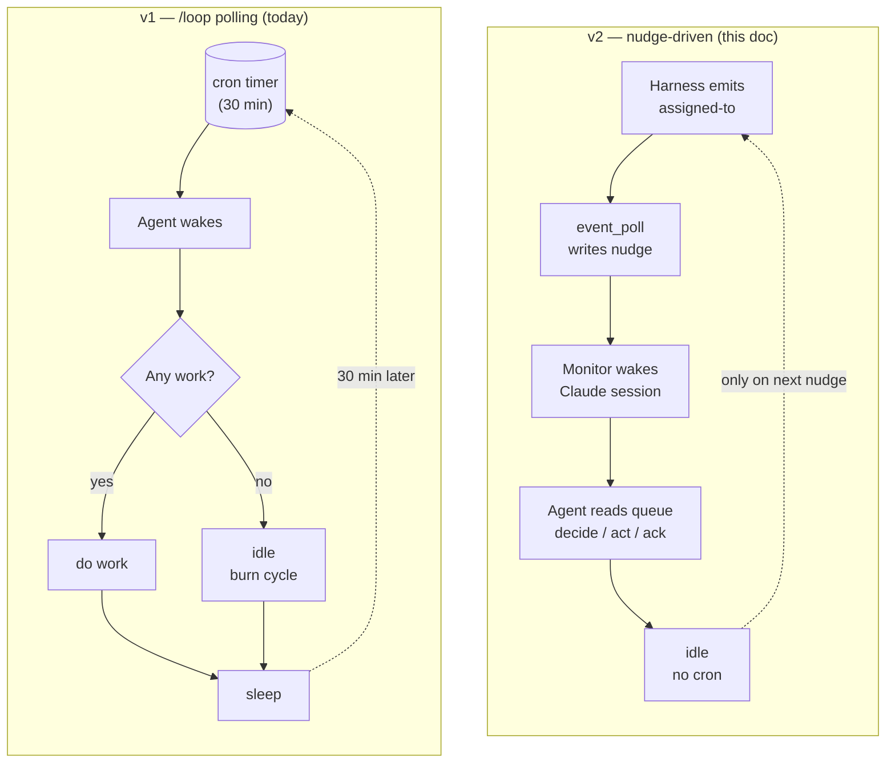

Same cycle wrapper (pre/post) but it fires on signal, not on timer.

---

## 2. Architectural commitments (locked principles)

From `decision-event-bus-architecture-redesign` vault note (locked cycles 1541–1542):

1. **Harness is a transport bus, not an orchestrator.** It moves signals between producers and consumers. It does NOT track work completion, ticket state, or workflow status.
2. **Forge (GitHub Issues) is the source of truth for work state.** Status labels, comments, PR merges = the project's institutional state. Harness has no opinion on whether work is done.
3. **Agent owns work completion.** The agent acts on signals; what it does with them is between the agent and the forge.
4. **Ack = receipt confirmation, NOT completion confirmation.** "Ack" means "the signal was delivered to the agent's session." It does NOT mean "the agent finished processing."
5. **No `POST /events/{id}/complete` endpoint.** Reject any design that adds endpoints for completion state. The bus pattern uses events, not RPC, for state transitions.

These principles drive every design choice below. When in doubt, fall back to them.

---

## 3. Three signal types — total

The catalog collapses to three concepts. Everything else is either local-side-effect, forge-recorded, or harness-internal — none of those are on the bus.

| Signal | Direction | When | Payload |
|---|---|---|---|
| **`booted`** | agent → harness | First action after the agent's Claude session boots | `{role}` |
| **`assigned-to`** | harness → agent (queue entry) | Harness detects work exists for the role | `{issue_number, title, target_role, event_context, payload}` |
| **`ack`** | agent → harness | Agent has received a delivered signal and the harness cursor can advance past it | Two sub-types: `ack-cursor` `{event_id, role}` advances cursor; `ack-stop` `{event_id, result}` confirms a stop intent |

Why ack has two sub-types: shipped in `#9873-A` (commit `4796af26`). The split disambiguates "agent acknowledges event delivery so cursor can advance" from "agent confirms it has accepted a stop intent and is checkpointing." Both are receipt confirmations — same concept, different consequences for harness state. Mental model: 3 signal concepts; one of them has two emit helpers.

### 3.0 Signal-flow at a glance

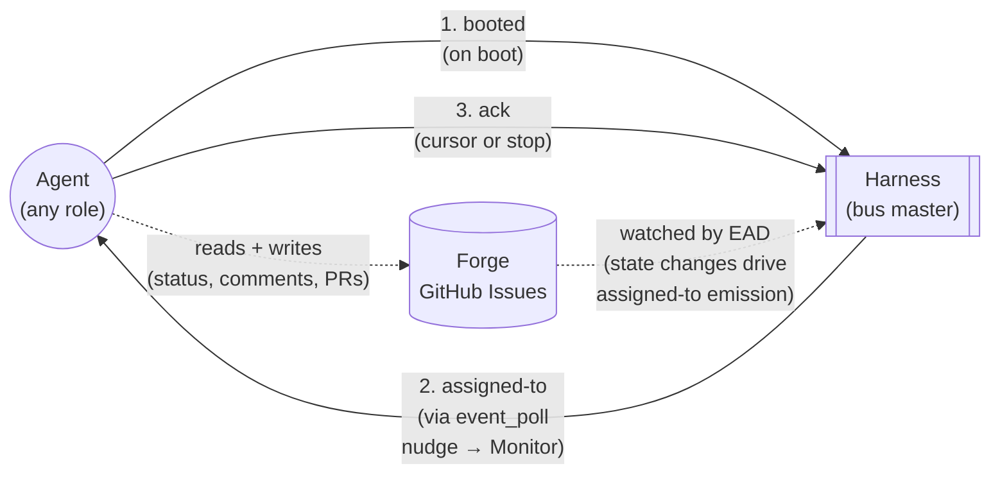

Three signals; that's the entire protocol surface for the agent ↔ harness loop. Everything else is local-side-effect (cycle wrappers, git activity) or forge-recorded (status, comments, PRs) — not on the bus.

### 3.1 What is OUT of the catalog

Everything currently in `event_catalog.py` other than the three above is removed:

- Lifecycle ticks: `cycle-start`, `cycle-end` — local to the agent, no other agent cares.
- Git activity: `git-pull`, `git-push`, `git-commit`, `branch-checkout` — local side effects, recorded in git itself.
- PR activity: `pr-create`, `pr-merge` (already DEPRECATED), `pr-merged` — recorded in forge; if relevant to another role, harness translates to `assigned-to`.
- Tracker activity: `status-transition`, `tracker-comment` — recorded in forge as the source of truth; if relevant to another role, harness translates to `assigned-to`.
- Harness internal: `compose-completed`, `agent-health` — harness sees these in its own state; if action needed, harness emits `assigned-to`.
- Speculative RECOGNIZED entries: `verification-passed`, `verification-failed`, `phase-change`, `request-merge`, `stop-requested`, `shipped`, `version-bump` — never emitted, dead weight in the catalog.

20 catalog entries removed. Down to 3.

---

## 4. The process tree

### 4.1 System overview


The §4.2 zoomed view below shows what's inside each agent's subprocess tree.

### 4.2 Per-agent subprocess tree (zoomed)

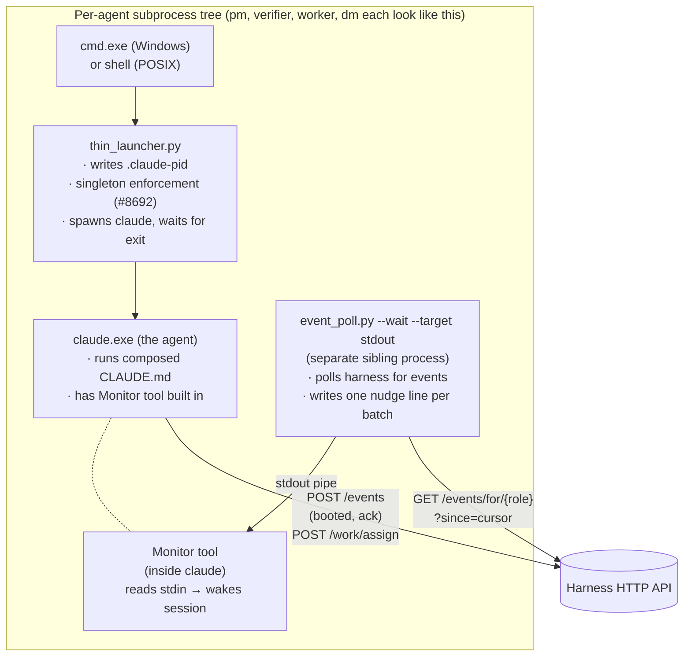

`thin_launcher` and `event_poll` are intentionally separate processes (decided 2026-05-22):

- Monitor needs a long-lived stdin source. `event_poll`'s exact job.
- `thin_launcher` exits when Claude exits. Wrong shape for Monitor's contract.
- Failure isolation: an `event_poll` crash doesn't take Claude down.
- Restart semantics: harness can restart `thin_launcher` to respawn Claude without losing polling state.

Conceptually they form "the agent's launcher subprocess tree." Implementation-wise they're two processes.

---

## 5. Harness architecture (internals)

The harness is the bus master. It runs as a single Python process per project, owns an HTTP server on port 7373 (default), and holds the event stream + cursor state + agent lifecycle intent in memory + on disk.

### 5.0 Component overview

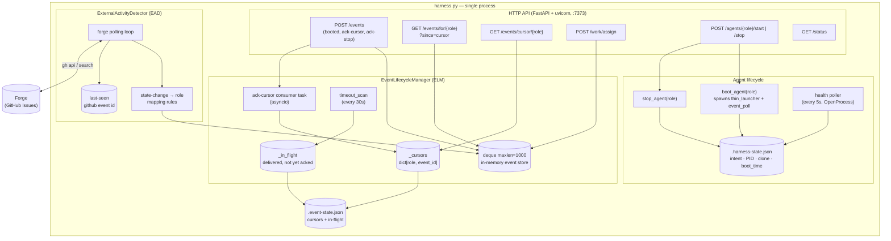

### 5.1 Components

```
harness.py (single process)
│
├── HTTP API (FastAPI + uvicorn, port 7373)
│    ├── POST /events                         <- emit (booted, ack-cursor, ack-stop, assigned-to)
│    ├── GET  /events/for/{role}?since=cursor <- agent reads its event queue
│    ├── GET  /events/cursor/{role}           <- agent reads its cursor (#9873-A)
│    ├── POST /work/assign                    <- agent requests harness assign work to next role
│    ├── POST /agents/{role}/start, /stop     <- lifecycle control
│    ├── GET  /status                         <- liveness probe
│    └── (other endpoints: see harness.py)
│
├── EventLifecycleManager (ELM)
│    ├── deque(maxlen=1000)                   <- in-memory event store
│    ├── _cursors: dict[role, event_id]        <- per-role consumer position
│    ├── _in_flight: dict[event_id, ...]      <- delivered but not yet acked
│    ├── ack-cursor consumer task             <- watches deque for ack-cursor events
│    └── timeout_scan (every 30s)             <- detects stalled cursors, re-nudges (#9873-E)
│
├── ExternalActivityDetector (EAD)
│    ├── watches forge for state changes      <- PR merges, status transitions, new comments
│    ├── translates into assigned-to events    <- the ONLY producer of assigned-to
│    └── persists last-seen GitHub event id   <- so it doesn't double-process on restart
│
├── Agent Lifecycle State
│    ├── .squidsquad/.harness-state.json      <- per-agent intent, PID, clone path, boot time
│    ├── health poller (every 5s)             <- liveness check via OS process query
│    │                                          (uses sys.platform + OpenProcess on Windows; see e7a47737)
│    ├── boot_agent()                         <- spawns thin_launcher + event_poll subprocesses
│    └── stop_agent()                         <- writes intent, sends stop signal
│
└── Event Persistence
     ├── .squidsquad/.event-state.json        <- cursors + in-flight tracking
     ├── event_lifecycle.load() / save_state()
     └── persistence wrapped in asyncio.to_thread (per CONTEXT-9873-A D4 — H6 mitigation)
```

### 5.2 The event store (deque)

- `collections.deque(maxlen=1000)` — in-memory, capped at 1000 events.
- Harness restart drops history. At-least-once across restarts requires persistence (separate work, not v2 scope).
- Eviction: when a new event pushes past 1000, the oldest is dropped. Agents whose cursor was at that evicted event get a synthetic "cursor-evicted" handling on their next read.

### 5.3 The cursor

- Per-role, owned by harness (was per-agent in `working-state.md` pre-`#9873-A`; migrated to harness).
- `null` at first boot → agent reads from the head of the deque.
- Advances via `ack-cursor` event consumed by the ack consumer task.
- Cursor-regression attempts rejected (per CONTEXT-9873-A D15).
- Endpoint: `GET /events/cursor/{role}` returns `{cursor: <event_id> | null, role}`, HTTP 200 always.

### 5.4 The ExternalActivityDetector (EAD)

EAD is the bridge from forge to bus. It runs inside the harness on a polling loop and:

1. Polls GitHub via REST API (`gh api repos/<owner>/<repo>/issues?since=<last_seen_iso>&state=all&per_page=100`).
2. Diffs against last-seen timestamp stored on disk.
3. For each changed issue, fetches full label state if needed, then maps to a target role per a rule table (status label changes, comments, PR state changes).
4. Emits one `assigned-to` event per (forge change, target_role) pair into the deque.
5. Records the new last-seen timestamp so it doesn't re-emit on restart.

EAD is the only producer of `assigned-to` from forge state. Agents trigger `assigned-to` indirectly via `POST /work/assign` (typically called by `tracker.py` per §7.2).

**Why REST, not Search API** (locked):
- Search API has a 5–30s indexing lag built in; EAD-driven latency would inherit that floor on every event.
- REST API is real-time (event appears in the response as soon as forge processes the write).
- REST quota is 5000 req/hr; Search is 30 req/min. REST gives more headroom for adaptive polling.

**Polling cadence — adaptive backoff** (locked, closes §13 Q3):

```
default state: active (10s between polls)

  last_poll_found_activity? → stay at 10s
  3 consecutive empty polls?  → step up to 30s
  activity returns after backoff? → reset to 10s
  hard floor: 5s  (rate-limit safety; never poll faster)
  hard ceiling: 60s  (safety-net usefulness degrades beyond this)
```

**Forge API budget under this rule:**

| State | Polls/hr | Calls/hr (with ~1–3 follow-ups per changed issue, bursts) | % of 5000/hr quota |
|---|---|---|---|
| Steady-state quiet | ~120 | ~120 | 2% |
| Steady-state active | ~360 | ~360–720 | 7–14% |
| Worst-case burst (10 changes/poll, sustained active) | ~360 | ~3600 | 72% |

Per-install overrides via `config.md` fields (`EAD Cadence Active`, `EAD Cadence Quiet`) are NOT v1 scope — defaults are hardcoded in EAD. Add as config fields only if a real install hits a quota issue.

**Latency floors per path** (recap from §7.0 + §7.1):

| Path | Worst case | Typical |
|---|---|---|
| `tracker.py` happy path (primary) | sub-second | sub-second |
| EAD safety net, quiet period | 60s | 30s |
| EAD safety net, active period | 10s | 5–10s |

### 5.5 The `POST /work/assign` endpoint

When an agent finishes work and the next step belongs to another role, it calls this endpoint:

```
POST /work/assign
{
  "issue_number": 9926,
  "next_role": "verifier",
  "event_context": "PR ready for verification",
  "payload": { "pr_number": 9943 }
}
```

Harness:
1. Validates the calling role is allowed to assign to `next_role` (per a static permission table — worker can hand off to verifier, verifier can bounce back to worker, etc.).
2. Records the assignment in its in-flight state.
3. Emits `assigned-to(target_role=verifier, issue_number=9926, ...)` into the deque.
4. Returns the event_id of the emitted assigned-to so the calling agent can log the handoff.

This is the explicit alternative to "EAD detects the PR existed" — it lets agents directly signal handoffs that EAD might not infer correctly.

---

## 6. Boot sequence (detailed)

### 6.0 Boot sequence diagram

The harness tracks each agent with two distinct fields in `.harness-state.json`:
- **`intent`** = what the operator wants (`running` | `stopping` | `stopped`)
- **`status`** = what the agent is actually doing (`booting` | `ready` | `stopping` | `stopped` | `crashed`)

These move independently. The operator sets `intent`; the harness updates `status` as it observes lifecycle transitions. They're equal in steady state and differ only during transitions (booting up, shutting down, or after a crash).

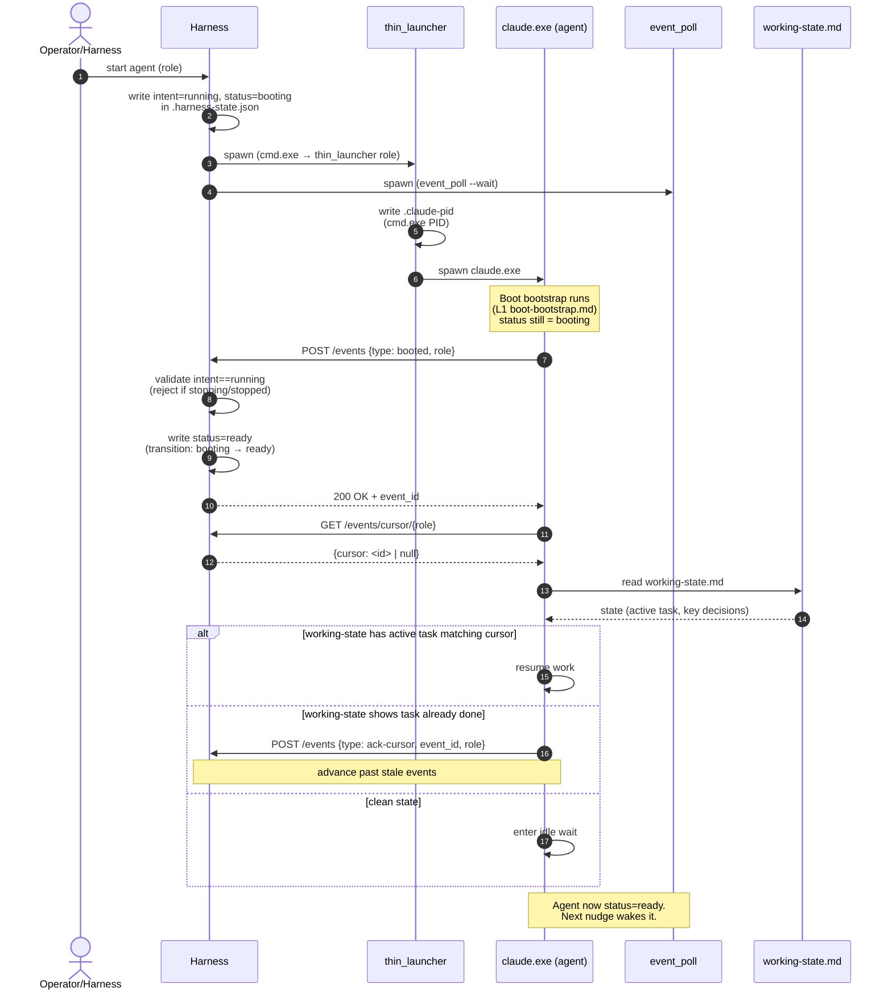

### 6.1 Agent state machine

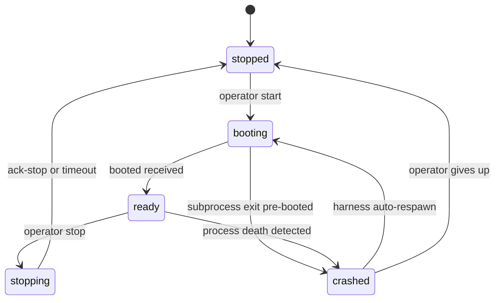

> **Label legend** (kept outside the diagram because stateDiagram-v2 doesn't accept multiline labels with `{}`, `;`, or `<br/>` reliably):
> - `operator start` = `POST /agents/<role>/start` → harness writes `intent=running, status=booting`
> - `booted received` = agent's `POST /events {type: booted}` validated → harness writes `status=ready`
> - `subprocess exit pre-booted` = `claude.exe` died before emitting `booted`; harness records `status=crashed`
> - `operator stop` = `POST /agents/<role>/stop` → harness writes `intent=stopping, status=stopping` AND emits `assigned-to(role, event_context="stop-intent")` on the bus
> - `ack-stop or timeout` = agent emits `ack-stop` cleanly OR harness escalates SIGTERM→SIGKILL after 30s+10s grace; either way: status=stopped, both subprocesses reaped
> - `process death detected` = health poller sees missing PID; harness writes `status=crashed`
> - `harness auto-respawn` = `intent=running` still set → harness re-runs the boot flow
> - `operator gives up` = operator explicitly writes `intent=stopped` from outside the auto-respawn loop

State semantics:
- **`booting`** — `intent=running`, subprocess spawned, `booted` event NOT yet received. Health poller does NOT count agent as alive yet (boot-grace window applies). Any `assigned-to` events for the role queue but are NOT delivered until status flips to `ready`.
- **`ready`** — `intent=running`, `booted` received, agent listening for nudges. This is the steady-state "alive" status. Both idle-waiting and actively-working agents are `ready` (no separate `working` status — work is per-event, not per-state).
- **`stopping`** — `intent=stopping` written by operator/harness; harness emits `assigned-to(role, event_context="stop-intent")` so the agent finishes current work and emits `ack-stop`. Timeout: 30s grace → SIGTERM → 10s → SIGKILL.
- **`stopped`** — process is dead AND `intent=stopped`. Terminal until operator restarts.
- **`crashed`** — process death detected by health poller (PID gone) but `intent=running`. Harness auto-respawns; status flips back to `booting`.

Why two fields, not one: distinguishing `intent` from `status` makes recovery semantics explicit. After a host reboot, the harness reads `.harness-state.json`, sees `intent=running` but no live PID → it knows it owes the operator a respawn (status flips to `booting` again). If the fields were collapsed, the harness couldn't distinguish "operator stopped this" from "this crashed" on disk.

This state machine also resolves part of G3 (booted-event race): the booted POST is validated against `intent`, not just `status`. If an agent emits `booted` while `intent=stopped` (race: stop fired during boot), harness rejects the POST and lets the agent's process exit naturally.

When the harness spawns an agent (or the agent restarts after a crash):

1. **Harness writes intent** = `running` for the role into `.harness-state.json`.
2. **Harness calls `boot_agent(role)`**, which:
   a. Spawns `cmd.exe → thin_launcher.py <role>` in the agent's clone directory.
   b. `thin_launcher` writes `.claude-pid` (containing the cmd.exe PID, not the claude.exe PID — see ARCHITECTURE.md).
   c. `thin_launcher` spawns `claude.exe` with the appropriate flags and waits.
   d. Separately, harness ensures `event_poll.py --wait --target <stdout-fd>` is running as the Claude session's Monitor stdin source.
3. **Claude session boots**, reads its composed `.squidsquad/<role>/CLAUDE.md` (output of `compose.py deploy <role>`), runs the L1 boot bootstrap (`references/sub-skills/common/boot-bootstrap.md`).
4. **Agent emits `booted`** via `POST /events` with payload `{role}`. Harness:
   a. Records "agent ready" in `.harness-state.json`.
   b. Begins dispatching any queued `assigned-to` events for this role (events that arrived while the agent was down get delivered now).
5. **Agent reads its cursor** via `GET /events/cursor/{role}`.
6. **Agent reads `working-state.md`** (its local checkpoint).
7. **Resume decision**:
   - If `working-state.md` shows an active task whose event_id matches/precedes the cursor → resume that work.
   - If `working-state.md` shows that task already completed → emit `ack-cursor` to advance past it. Then check for next event past new cursor.
   - If `working-state.md` is clean → enter idle wait state.
8. **Agent waits for next nudge.** The Claude session is idle; Monitor is listening on stdin; `event_poll` is polling harness.

### 6.1 First boot (fresh install)

Same as above, except:
- `working-state.md` is empty.
- Cursor is `null`.
- Step 7 collapses to "enter idle wait."

### 6.2 Boot after crash mid-work

Same as the normal boot, except `working-state.md` records an in-flight task whose event_id is `<= cursor`. The agent resumes from the checkpoint. If the checkpoint is stale (the work was actually completed before the crash but `working-state.md` didn't get updated), the agent's first action on resume is to re-check forge — forge is the source of truth — and either continue or ack and exit.

---

## 7. Work handoff (detailed)

### 7.0 Handoff sequence — explicit `/work/assign` path

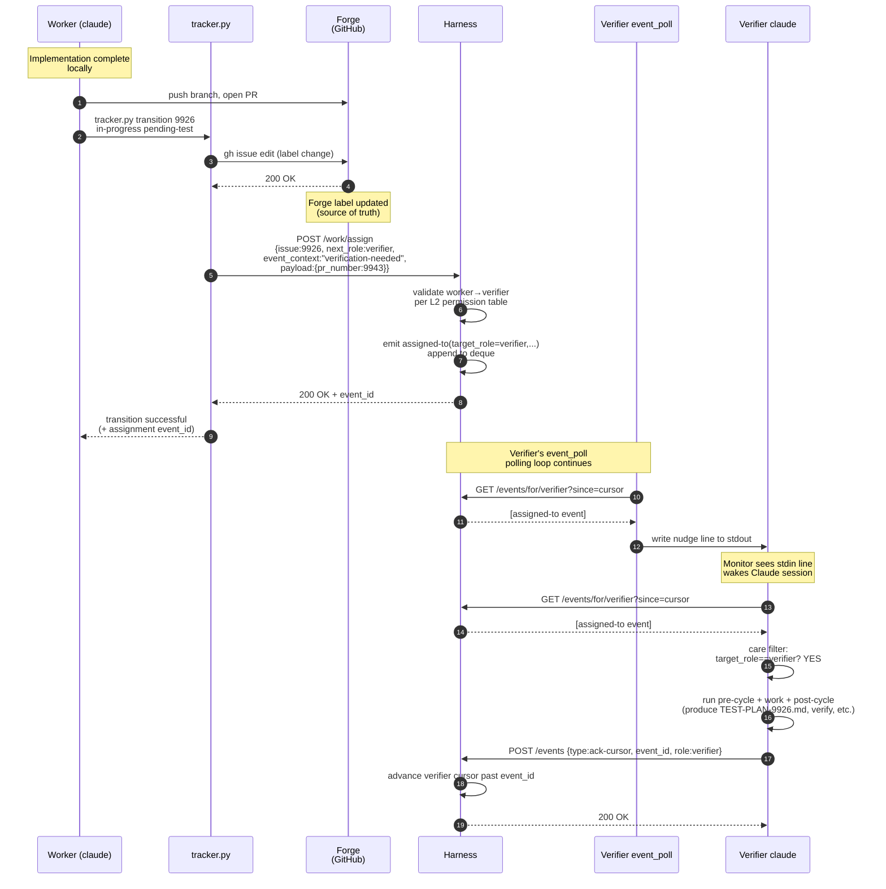

Walkthrough: worker ships a fix, hands off to verifier.

1. **Worker** finishes its implementation work for issue `#9926`. Pushes the branch, opens PR `#9943`.
2. **Worker** invokes `tracker.py transition 9926 in-progress pending-test --role pm-lead`. From the worker's perspective this is a single command — no separate `/work/assign` call needed. Behind the scenes `tracker.py` does:
   - **2a.** `gh issue edit` — flips the status label on forge (the durable record).
   - **2b.** `POST /work/assign` to harness with `{issue:9926, next_role: verifier, event_context: "verification-needed", payload: {pr_number: 9943, branch: "squidsquad/task/9926"}}`. The `(from, to)` transition is looked up in `tracker.py`'s built-in routing table (§7.2) to derive `next_role` and `event_context`.
3. **Harness** validates worker → verifier is a legal assignment (per the L2-derived permission table from `responsibility.md`), then emits `assigned-to(target_role=verifier, ...)` into the deque. Returns the event_id to `tracker.py`, which returns success to the worker.
4. **`event_poll` for the verifier** is polling harness on its loop. On its next poll it sees one new event past the verifier's cursor → writes one nudge line to stdout: `"NUDGE 1 new event"` (exact format TBD).
5. **Monitor (inside the verifier's Claude session)** sees the new stdin line → wakes the Claude session.
6. **The verifier runs its post-nudge contract** (per #9892):
   a. Read events past cursor: `GET /events/for/verifier?since=<cursor>` → returns the assigned-to event.
   b. Decide: care or skip? Filter rule: the verifier cares about `assigned-to` with `event_context` matching verification triggers.
   c. If the verifier is busy with current work, it notes the nudge in conversation context and continues current work uninterrupted (no file write). The event itself stays in the harness deque past the verifier's cursor — `working-state.md` does NOT carry an event queue or a nudge flag; that's the harness's job. See §8.2.
   d. If the verifier is idle, it acts on it: writes TEST-PLAN-9926, runs verification, etc.
   e. After tending (or queuing) the event, the verifier emits `ack-cursor(event_id)` to advance.
7. **Loop continues**: the verifier eventually verifies, transitions to pending-ship via `tracker.py` (which routes to dm via the same mechanism), and so on through the rest of the pipeline.

### 7.1 EAD path (when tracker.py wasn't the trigger)

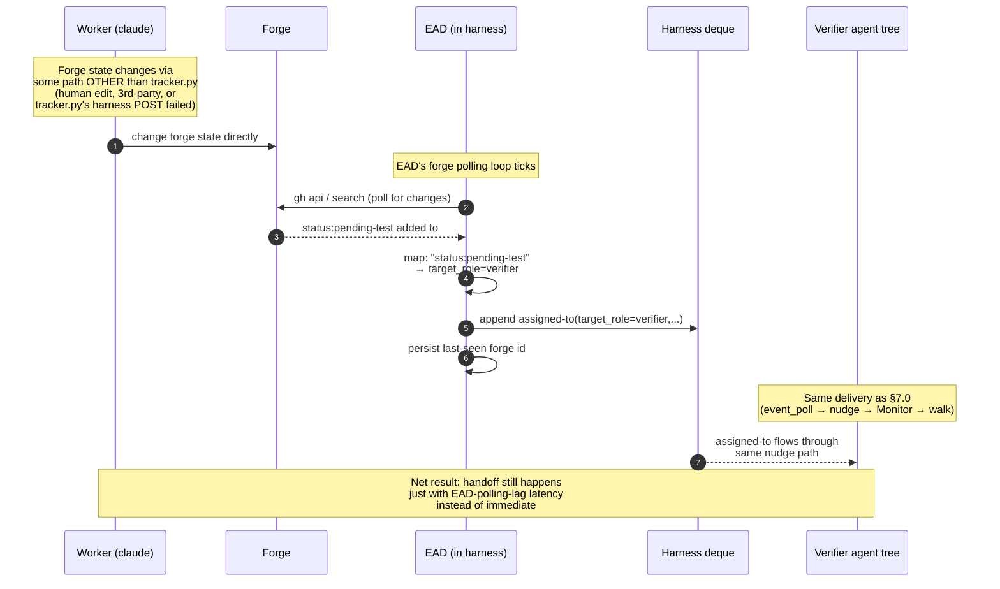

If the forge state changes through some path OTHER than `tracker.py transition` — e.g., a human edits a label directly in the GitHub UI, a third-party automation flips a status, or `tracker.py` itself ran but the `/work/assign` POST failed because the harness was momentarily down — the ExternalActivityDetector catches it:
- EAD polls forge, sees the new status:pending-test label on `#9926`.
- EAD maps "status:pending-test on a tracker item" → assigned-to(target_role=verifier).
- EAD emits `assigned-to` to the verifier's queue.
- The verifier wakes via nudge, same as steps 4–7 above.

This is the safety net for any forge change that didn't originate from `tracker.py`, plus the recovery path when `tracker.py`'s `/work/assign` call fails due to a transient harness outage.

### 7.2 tracker.py auto-routes transitions (preferred path)

In practice, agents never call `/work/assign` directly for transition-driven handoffs. `tracker.py transition` does it automatically. The §7.0 diagram shows the underlying mechanics; the agent-facing API is just one command:

```bash
python references/scripts/tracker.py transition 9926 in-progress pending-test --role pm-lead
```

Behind the scenes, tracker.py does three things:
1. `gh issue edit` — the forge label change (source-of-truth update).
2. Lookup the `(from, to)` transition in an internal mapping table to find the implied `next_role`.
3. If `next_role` is defined: `POST /work/assign {issue, next_role, event_context: "transition:<from>→<to>"}` to the harness.

**Built-in transition → routing table** (locked):

| Transition (from → to) | Implied `next_role` | event_context |
|---|---|---|
| `in-progress → pending-test` | `verifier` | `"verification-needed"` |
| `pending-test → pending-ship` | `dm` | `"delivery-needed"` |
| `pending-test → in-progress` | assigned role from `role:*` label | `"qa-rejected"` |
| `pending-ship → in-progress` | assigned role | `"merge-conflict"` |
| `pending → planning` | `pm` | `"planning-needed"` |
| `planning → planned` | (no assign — self-routing) | — |
| `planned → approved` | assigned role | `"ready-for-pickup"` |
| `approved → in-progress` | (no assign — self-pickup) | — |
| `pending-ship → shipped` | (no assign — terminal) | — |
| `* → pending-human-review` | `pm` | `"human-needed"` |
| `* → pending-human-setup` | `pm` | `"human-needed"` |

**Why this layering helps:**

- **Mitigates pickup-fidelity bugs** (`#9946`): agents can't forget the `/work/assign` step because tracker.py does it. One whole class of "skill claimed handoff but only did the transition" disappears.
- **Replaces the deprecated `status-transition` emit** (tracker.py:1062). Under v2's catalog trim, that emit path goes away; this is its successor.
- **Direct `/work/assign` remains** for non-transition routing — e.g., when an agent surfaces a process concern to pm without changing any tracker state:
  ```bash
  python references/scripts/tracker.py work-assign --target pm \
      --event-context process-concern --payload '{"concern": "..."}'
  ```
- **EAD becomes a safety net, not the primary path.** Most handoffs go through tracker.py (sub-second); EAD only catches forge changes that didn't originate from tracker.py (human edits in the GitHub UI, third-party tooling, etc.).

**Failure mode:** if the harness is unreachable when tracker.py tries to POST `/work/assign`, the forge label change already succeeded — EAD picks it up on its next poll (within the 10-30s indexing window). The transition is durable; only the immediate-nudge latency degrades.

The two paths (explicit `/work/assign` and implicit EAD detection) are both valid. Explicit is preferred for clarity; EAD is the safety net.

---

## 8. Agent contract on nudge (read / decide / act / ack)

### 8.0 Nudge-walk sequence

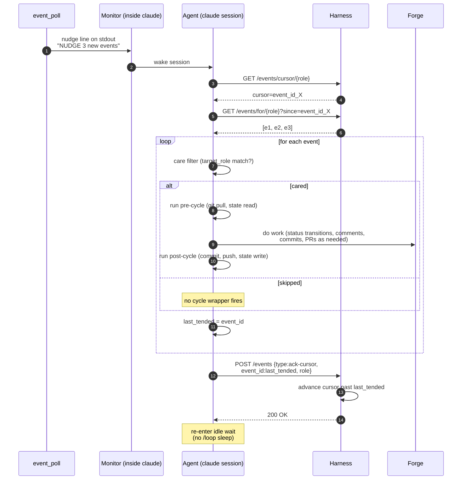

Per `#9892` (CONTEXT to be finalized in v2's master task):

```
on each nudge:
    cursor = GET /events/cursor/{role}
    events = GET /events/for/{role}?since=cursor

    last_tended = cursor
    for event in events:
        if event passes my role's care filter:
            run_pre_cycle()       # mechanical: git pull, working-state read, etc.
            do_work(event)         # the agent's creative work
            run_post_cycle()       # mechanical: commit, push, working-state write
        # if skipped, no cycle wrapper fires
        last_tended = event.id

    POST /events  ack-cursor {event_id: last_tended, role}
```

Pre/post-cycle wraps EACH cared event individually. Skipped events do not trigger cycle wrappers. The batched ack at the end signals "I've handled or skipped everything up to last_tended; advance my cursor."

### 8.1 Care filter

Each role has a simple care filter — typically just "events with `target_role == my_role`." Future refinement could allow finer-grained filtering based on `event_context` or `payload`, but v2 ships with role-only filtering.

### 8.2 Nudge handling while busy (context-only, no state mutation)

If an agent receives a nudge while it's mid-cycle on prior work (event A), the agent does NOT interrupt and does NOT write anything to `working-state.md`. **The agent simply remembers in conversation context that a nudge occurred** — and trusts two existing mechanisms to recover even if that context is lost.

The sequence, between completing event A's work and starting event B's work:

1. **Nudge arrives** for event B (and possibly C, D, …) while the agent is still working on A.
2. **Agent notes the nudge in conversation context.** No file write. No queue. No flag.
3. **Agent continues processing event A uninterrupted** — finishes its pre-cycle/work/post-cycle wrap. Emits `ack-cursor(A.id)` per §8.0; harness advances cursor past A.
4. **Post-A, agent enters the §8.0 walk:** `GET /events/for/{role}?since=cursor` — harness returns events B onwards in cursor order. Agent processes per the normal walk.

**Why no flag is needed:**

- **The harness cursor is canonical.** Post-cycle the agent always GETs the queue regardless of whether a nudge was noted. Cursor = "what's tended-up-to"; events past cursor = "what's pending." A flag duplicates information the cursor already encodes.
- **`event_poll` is self-healing.** Even if conversation context is lost (session crash, mid-window compaction), event_poll's next poll within 10–60s (per §5.4 cadence) will see events past cursor and re-emit a nudge. The agent re-wakes naturally on the next poll tick.
- **Monotonic-forward cursor prevents double-processing.** Agent processes B only after acking A; cursor advances forward only via successful acks. There's no way to "lose B" because acking A doesn't change B's position in the deque.

**Crash-safety walkthrough:**

| Crash point | Recovery |
|---|---|
| Agent crashes mid-A | Restart reads `working-state.md` (sees current = A), resumes A. Eventually completes, acks. Post-A walk finds B onwards. Same as no-crash flow. |
| Agent crashes between A's ack and the post-A walk | Restart reads `working-state.md` (no current work — A is done), enters idle. The original mid-A nudge for B is "lost" from context, but `event_poll`'s next poll (within 10–60s) re-detects B past cursor and re-nudges. |
| Multiple nudges arrived mid-A; agent crashes pre-walk | Only one fresh nudge is needed post-crash because the cursor is now past A; any single nudge triggers the walk that processes B–F in order. |

**Trade-off considered (and rejected):**

An earlier draft of §8.2 proposed a `pending_nudge: bool` flag in `working-state.md` as crash-safety insurance. Audit found it redundant — `event_poll`'s continued polling and the cursor's monotonic-forward property already guarantee events are not lost. The flag would have added one concurrent-write surface (G13) for no net benefit.

Residual risk window: a NARROW interval where the agent crashes between A's ack and post-A walk AND `event_poll` also crashes before its next poll. With G2 closed (event_poll restart governance), this window is bounded by the health-poller's detection time (~5s).

**Honors the locked principle** (`decision-event-bus-architecture-redesign` §2): forge owns work state, harness owns delivery state (cursor), agent owns ONLY its current work. A nudge flag would have crept agent state into duplicating delivery state — explicitly avoided here.

---

### 8.3 Improvement subloop (what an agent does when the queue is empty)

In v1, agents ran improvement scans on quiet `/loop` cycles (memory: `feedback_scan_every_quiet`). In v2 there are no cycles — agents only wake on nudges. If we did nothing else, an agent that handles all its events would go idle forever and never run improvement work. Two problems:

1. **Improvement scans stop happening.** Workflow gaps go undetected; doc-scan drift accumulates; vault never gets optimized.
2. **Tokens still burn while idle.** Even an idle Claude session has a context cost per cycle. Doing literally nothing means we pay for nothing.

The **improvement subloop** is the answer. Filed as `#9893` (`#9873-D`): *"improvement subloop trigger + token-burn throttle when cursor at end of queue."*

#### When it triggers

After the agent completes its read/decide/act/ack walk in §8.0, it checks: *is my cursor at the head of the deque?* If yes, the agent's queue is fully drained.

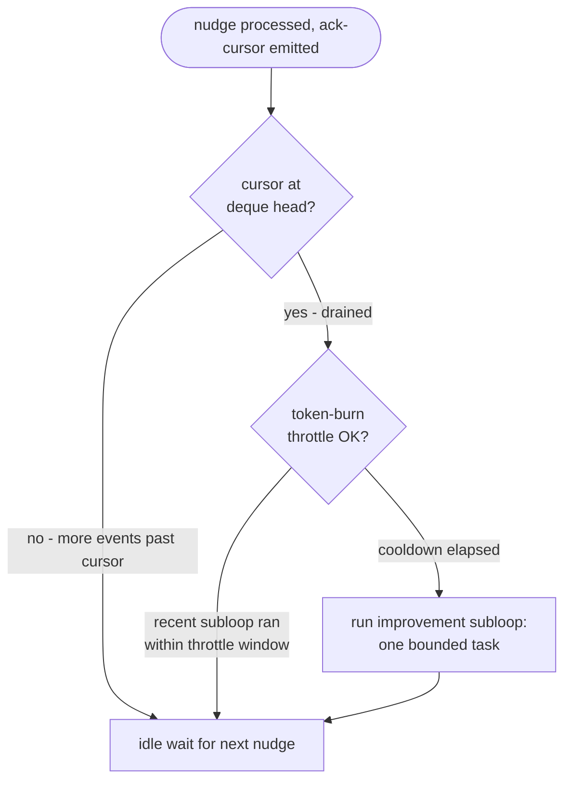

#### Token-burn throttle

Without throttling, an agent at cursor-end would run improvement work every time a nudge arrives that turns out to be uninteresting (skip-filter). That's worst-case: every irrelevant nudge triggers improvement work.

Throttle rule (locked): **at most one improvement subloop per agent per N minutes**, where N defaults to 30 (matches the old `/loop` cadence — same observable improvement-scan frequency as v1, without the per-cycle cost when work IS arriving).

`.squidsquad/<role>/.subloop-last-run` records the last subloop timestamp. Agent checks this file before triggering. Atomic write per the §9 protocol.

#### What the subloop does

Single bounded task per fire — not a full cycle. Examples (role-specific, per existing per-role improvement-scan sub-skills):
- **pm**: pipeline sentinel + improvement scan (process gaps, stalled items, doc drift)
- **verifier**: TEST-PLAN backlog catch-up (write plans for items at pending-test that lack one)
- **worker**: doc-scan or test-coverage scan on owned modules
- **dm**: doc realignment + CHANGELOG hygiene + version-bump readiness check

Output of the subloop may itself be a new `assigned-to` (e.g., pm-subloop finds a process gap, files a bug and routes to the owning role). That nudges the owning role into work — but only via the same `/work/assign` path everything else uses; no special bus channel for subloop output.

#### Interaction with nudges arriving mid-subloop

If a new nudge arrives WHILE the subloop is running:
- The subloop completes its current bounded task (does NOT interrupt mid-edit).
- After completion, agent re-enters the read/decide/act/ack walk from §8.0 with the new events.
- This is conservative — could be optimized later to allow nudge preemption if a high-priority `event_context` arrives. Out of scope for v1.

#### State machine integration

The improvement subloop runs while the agent's `status=ready`. It does NOT flip status to "working" or anything else; from harness's perspective the agent is still idle (just doing background self-care). Health poller continues to see the agent as alive via process-liveness checks.

---

## 9. State persistence map

| What | Where | Why |
|---|---|---|
| Per-role cursor | `.squidsquad/.event-state.json` (harness-owned) | Harness owns delivery state |
| In-flight events | `.squidsquad/.event-state.json` | Re-delivery on timeout (#9873-E) |
| Agent intent + PID | `.squidsquad/.harness-state.json` (harness-owned) | Harness owns agent lifecycle |
| Agent current-work state | `.squidsquad/<role>/working-state.md` (agent-owned) | Resume-from-crash checkpoint for the agent's OWN current work. Does NOT contain an event queue (the harness deque + cursor own that) AND does NOT contain a nudge flag (per §8.2 — nudge memory lives only in conversation context; event_poll's re-poll covers any loss). |
| Improvement subloop throttle | `.squidsquad/<role>/.subloop-last-run` (agent-owned) | Timestamp of last subloop fire; gates next eligibility (§8.3) |
| Last-seen forge event | EAD-internal persistence | Don't re-emit assigned-to on restart |
| Work state | GitHub Issues (forge) | Source of truth for status, comments, PRs |
| Decisions / institutional memory | `.squidsquad/vault/` | Long-lived rationale |

Agents do not write to harness-owned files. Harness does not write to agent-owned files.

---

## 10. Polling-mode fallback (degraded operation)

When the harness is unreachable at boot (probe fails per `common/boot-bootstrap` Step 2), the agent falls back to the legacy `/loop 30m` polling model. This is the safety net documented in `#9580` and `#9588`. Agents work, just with the old 30-min cadence and no nudges.

Once the harness recovers, an operator restarts the agent to re-enter event mode. Mid-session mode-flipping is explicitly NOT supported (per the "loaded mode is sticky" rule in `common/boot-bootstrap`).

### 10.1 Boot decision tree

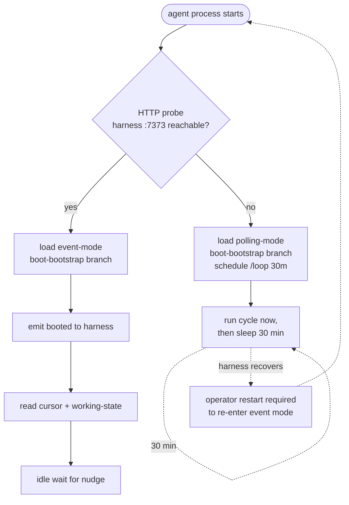

Mode is locked at boot — no mid-session switch — to keep the agent's contract predictable. The operator is the only mode-flipping authority.

---

## 11. What gets removed

To land v2 cleanly, the following are retired or rewritten:

| Component | Action |
|---|---|
| `/loop 30m execute one Ralph Loop cycle` in `thin_launcher` | Removed. Agent boots into idle-wait instead of cron. |
| `/loop` invocation in `common/boot-bootstrap` Step 4 | Removed. Step 4 becomes "enter idle, await nudge." |
| 20 catalog entries (cycle-*, git-*, pr-*, tracker-*, etc.) | Removed from `event_catalog.py`. |
| `Event Reactions` block in `config.md` | Collapses to: every role reacts-to `assigned-to` only. |
| `event_poll.py` per-event JSON-on-stdout emission | Replaced with single nudge line per polling batch (#9891 scope). |
| Agent contract pre-`#9892` | Rewritten to read/decide/act/ack walk. |
| Existing `docs/EVENT-BUS-ARCHITECTURE.md` and `docs/event-bus.md` | Marked superseded; either rewritten or deleted. |

---

## 12. Tasks already filed that this absorbs or supersedes

| Issue | Status | Disposition under v2 |
|---|---|---|
| `#9873` umbrella | shipped (foundation -A) | Foundation work already in main; v2 builds on it |
| `#9873-A` (cursor migration + ack split) | shipped | Permanent — sub-types of v2's `ack` concept |
| `#9873-B` / `#9891` (event_poll nudge-only) | pending | Absorbed into v2 umbrella |
| `#9873-C` / `#9892` (agent read/decide/act/ack contract) | pending | Absorbed into v2 umbrella |
| `#9873-D` / `#9893` (improvement subloop trigger) | pending | Absorbed (per §8.3: cursor-at-head trigger + token-burn throttle) |
| `#9873-E` / `#9894` (timeout_scan re-nudge) | pending | Absorbed |
| `#9873-F` / `#9895` (TUI ack visualization) | pending | Out of scope, POST-V1 |
| `#9580` (event-mode degraded fallback = polling) | pending | Confirms v2's fallback path |
| `#9845` (noop event type) | planned | Retired — probe becomes `assigned-to(event_context='probe', ack_only=true)` |
| `#9588` (lazy-load mode-specific instructions) | shipped | Permanent — supports v2's idle-wait boot path |

---

## 13. Open questions to refine

**All 10 questions now locked.** Original questions retained below for traceability; full lock table is in §15.7.

1. ~~**Booted-payload shape**~~ **CLOSED (2026-05-23, §15.1)**: `{role, pid, clone_path, version}` — full diagnostic from day 1.
2. ~~**POST /work/assign authorization**~~ **CLOSED (2026-05-23, §15.4)**: L2-derived from each role's `responsibility.md` `## Bus contract` section; not hardcoded in harness.
3. ~~**EAD polling cadence**~~ **CLOSED (2026-05-22, §5.4)**: REST API (not Search), adaptive cadence 10s active → 30s quiet, hard bounds 5s floor / 60s ceiling. Config-knob override deferred to post-v1.
4. ~~**`event_poll` polling cadence**~~ **CLOSED (2026-05-23, §15.1)**: 5s active / 30s idle, adaptive backoff, hard bounds 2s floor / 60s ceiling. Same pattern as §5.4 EAD.
5. ~~**Cursor on first boot**~~ **CLOSED (2026-05-23, §6.0)**: `null` per CONTEXT-9873-A D7 — agent starts from deque head.
6. ~~**Care filter granularity**~~ **CLOSED (2026-05-23, §8.0 + §15.4)**: role-only in v1; `event_context` filter as a v2 extension via the L2 `## Bus contract` section.
7. ~~**Queue-while-busy behavior**~~ **CLOSED (2026-05-22, §8.2)**: agent notes the nudge in conversation context only — no `working-state.md` write, no flag, no queue. Continues current work uninterrupted; post-cycle always GETs the queue regardless. event_poll's re-poll within 10–60s covers crash-loss of context.
8. ~~**What about #9845 (noop)?**~~ **CLOSED (2026-05-23, §15.5)**: retire #9845; absorb probe semantics into `assigned-to(target_role=R, event_context="probe", ack_only=true)`.
9. ~~**`compose.py` deploy after merging this v2**~~ **CLOSED (2026-05-23, §11 + §15.5)**: per §11 (trim catalog, retire emit calls) plus add `compose-needed` translator (harness emits `assigned-to(pm, event_context=compose-needed)` when a merge touches `references/`). Existing L4 + manifest pipeline carries everything; no new compose mechanism.
10. ~~**Migration plan**~~ **CLOSED (2026-05-23, §15.5 + §10)**: feature flag `event-driven: yes/no` in `config.md`. Default `no` for the first release; operator flips per install when ready. Rollback = flip the flag + restart agents. `/loop` fallback stays available indefinitely until a future cleanup decision.

---

## 14. Gaps surfaced via diagramming

Drawing the sequence + arch diagrams above exposed concrete gaps in the model. These are NOT the same as the §13 design questions — those were open by design. These are things the prose left implicit and the diagrams forced into visibility. Each is something we should resolve before the umbrella implementation task is filed.

### 14.1 Process-tree / lifecycle gaps

- **G1 — Who spawns `event_poll`?** *(Closed by §15.1.)* `boot_agent()` makes two `subprocess.Popen` calls — one for `thin_launcher`, one for `event_poll`. Both PIDs recorded in `.harness-state.json`. Harness owns both.
- **G2 — Who restarts `event_poll` if it crashes?** *(Closed by §15.1.)* Health poller watches both PIDs (claude AND event_poll). On death while `intent=running` and `status=ready`, harness respawns. Same machinery as today's claude restart, no new code path.
- **G3 — Booted-event delivery race.** *(Partially closed by §6.0 + §6.1 state machine.)* `boot_agent()` writes `intent=running, status=booting` synchronously BEFORE spawning subprocesses, so when the agent emits `booted` the harness record always exists. Remaining residual race: agent could emit `booted` while `intent=stopped` (operator fires stop during a boot in progress). §6.0 step 6 handles this — harness validates `intent==running` on the booted POST and rejects otherwise; the agent's process exits naturally on the rejection.
- **G4 — Stop intent flow is undocumented.** *(Closed by §6.1 state machine.)* Stop path: operator/harness writes `intent=stopping, status=stopping` → harness emits `assigned-to(role, event_context="stop-intent")` via the existing bus path → agent's care-filter recognizes `stop-intent` → finishes current work → emits `ack-stop` → harness writes `status=stopped` and reaps both `event_poll` and `thin_launcher` subprocesses. Timeout: 30s grace after `assigned-to` → SIGTERM → 10s → SIGKILL. One control path, no parallel mechanisms.

### 14.2 Event-delivery gaps

- **G5 — Multi-event nudge formatting.** *(Closed by §15.2.)* Nudge line is literal `NUDGE\n` text — no payload. Agent always does the GET to find what's new. False positives harmless.
- **G6 — Out-of-order ack semantics.** *(Closed by §15.2.)* Forward-only, monotonic. Care-skipped events that tend-failed stay past cursor; agent ack-cursors only up to last-successfully-tended. `event_poll` re-nudges within 10–60s; `timeout_scan` provides backup redelivery.
- **G7 — Cursor when deque has been compacted.** *(Closed by §15.2.)* `GET /events/for/{role}?since=<old_cursor>` returns `HTTP 410 Gone` with body `{cursor_evicted: true, current_head: <event_id>}`. Agent recovers from forge, emits `ack-cursor(current_head)`, re-enters idle.
- **G8 — EAD double-emit on restart with lost last-seen.** *(Closed by §15.3.)* On missing/corrupt last-seen file, EAD defaults to `now - 5 minutes`. Bounded dup-emit window; agents dedup via care-filter on `(issue_number, target_role, event_context)`.
- **G9 — Forge → EAD lag floor.** *(Closed by §5.4 REST-API choice.)* The original concern assumed Search API (5-30s indexing lag); switching to REST removes that floor — REST is real-time. Latency floors documented in §5.4 are now driven purely by polling cadence, not API indexing. Sub-second `tracker.py` path, 5-30s typical / 60s worst-case for EAD safety net.

### 14.3 Work-handoff gaps

- **G10 — Assignment to an offline agent.** *(Closed by §15.4.)* Events queue past target's cursor; processed on next boot via §6.0 read path. Care-filter on `(issue, role, context)` dedups if `/work/assign` and EAD both fire.
- **G11 — `/work/assign` permission table.** *(Closed by §15.4 — L2-derived.)* Each role's `responsibility.md` `## Bus contract` section declares `accepts assigned-to from: [list]` or `any`. Harness reads at boot, builds in-memory permission table. For current 4 roles: all accept from any role. Self-assign is built-in invariant (not declarable). `403 Forbidden` with explicit error body on rejection.
- **G12 — Assigning to pm.** *(Closed by §15.4.)* pm is callable from any agent — falls out of the uniform "accepts from: any role" L2 declaration. pm's inbox is disambiguated by `event_context`: EAD emits `"human-comment"` for human activity and `"agent-down"`/`"agent-stalled"` for harness health detections; other agents emit `"process-concern"` or `"route-handoff"` for explicit routing.

### 14.4 State / persistence gaps

- **G13 — `working-state.md` write race.** *(Closed by §8.2.)* The nudge path now writes nothing to `working-state.md` (context-only memory). The remaining write surface on `working-state.md` is the agent's current-work checkpointing during normal cycle pre/post — single-writer per agent, already serialized by the cycle wrapper. Atomic `.tmp + rename` from L1 base remains standard. No nudge-related concurrent-write surface to manage.
- **G14 — `.event-state.json` size unbounded.** *(Closed by §15.3.)* `timeout_scan` (already running every 30s per `#9873-E`) also sweeps in-flight entries whose `event_id` is past deque eviction. Passive cleanup; no agent involvement.
- **G15 — Harness restart loses deque.** *(Closed by §15.3.)* On harness boot, EAD does a 30-minute catch-up scan against forge; re-emits assigned-to for anything missed during downtime. Beyond 30 min, agents recover from forge on first read (cursor-evicted path per §15.2).

### 14.5 Boot / runtime ordering gaps

- **G16 — First boot of the very first agent.** *(Closed by §15.1.)* Cold start order: harness loads state → starts HTTP server → starts EAD → `boot_agent(pm)` → `boot_agent(verifier)` → `boot_agent(dm)` → `boot_agent(worker)` (+ variants). EAD starts before any agent so it can begin emitting assigned-to into the deque immediately.
- **G17 — `compose-completed` removed but compose still happens.** *(Closed by §15.5.)* Harness emits `assigned-to(target_role=pm, event_context="compose-needed", payload={touched_files})` when a merge touches `references/`. PM runs `compose.py deploy-all`, restarts affected agents via `/agents/{role}/stop + /start`. No new event type.
- **G18 — Wizard at install time.** *(Closed by §15.1.)* Wizard creates `.squidsquad/`, writes `config.md` (including `event-driven: yes/no` per Q10), runs `compose.py deploy-all`, starts harness, calls `/agents/{role}/start`. Only mode-flipping authority at install time.

### 14.6 Observability / TUI gaps

- **G19 — Where does TUI fit?** *(Closed by §15.6.)* TUI polls harness HTTP via `/status`, `/agents`, `/events/recent` (last 100 events of any type, harness-tracked for visualization). NOT a bus subscriber. TUI failures don't affect agents.
- **G20 — Harness logs vs. event stream.** *(Closed by §15.6.)* Lifecycle/git logs stay in `.squidsquad/<role>/iterations/iter-NNNN.md` per existing cycle_post behavior. Already happens; doc just calls it out as the v2 home for what was previously bus events.

### 14.7 Migration gaps

- **G21 — Trim sequencing.** *(Closed by §15.5.)* 3-phase: (A) stop emitting deprecated types from cycle_pre/post/git_ops/tracker; (B) rewrite `Event Reactions` so every role's `reacts-to: assigned-to` only; (C) delete catalog entries + rewrite event_poll for nudge-only. Each phase reversible at its boundary; split into 3 sub-PRs.
- **G22 — `Event Reactions` block collapse.** *(Closed by §15.5.)* Harness health poller becomes a producer. When a watched agent dies/stalls past threshold, emits `assigned-to(target_role=pm, event_context="agent-down", payload={role, last_seen})`. PM's existing pipeline-sentinel logic re-routes to handle this signal. One event path, one consumer.

---

## 15. Closure plan (locked decisions for v2 implementation)

This section consolidates the locked decisions from the gap-walkthrough session (2026-05-22 → 2026-05-23). All 10 §13 questions answered; all 22 §14 gaps closed or partially closed. Each Group A–F below is a coherent design closing related gaps; the §15.7 question lock table maps each §13 question to where it's enforced; the §15.8 implementation sequence orders the 6 implementation PRs.

### 15.1 Group A — Lifecycle plumbing (closes G1, G2, G16, G18)

- `boot_agent(role)` is synchronous: writes `intent=running, status=booting` to `.harness-state.json` FIRST, then makes two `subprocess.Popen` calls — one for `thin_launcher`, one for `event_poll`. Both PIDs recorded in `.harness-state.json`.
- Health poller watches both PIDs. If either dies while `intent=running` and `status=ready`, harness respawns it. Same machinery as today's claude restart.
- **Cold start order**: load state → start HTTP server → start EAD → `boot_agent(pm)` → `boot_agent(verifier)` → `boot_agent(dm)` → `boot_agent(worker)` (and variants). PM first because everything else can route to PM.
- **Wizard at install**: creates `.squidsquad/`, writes `config.md` (including `event-driven: yes/no` per Q10), runs `compose.py deploy-all`, starts harness, calls `/agents/{role}/start` for each. Wizard is the only mode-flipping authority at install time.

**PR size:** medium. Touches `harness.py boot_agent` + `stop_agent`, `wizard.py`, `health_check.py`.

### 15.2 Group B — Cursor + delivery semantics (closes G5, G6, G7)

- **Nudge format**: literal `NUDGE\n` text. No payload. Agent always does `GET /events/for/{role}?since=cursor` to find what's new. False positives on nudge are harmless (GET returns `[]`).
- **Ack semantics**: forward-only monotonic. If a care-skipped event tend-fails (transient forge error), agent ack-cursors only up to the last *successfully tended* event. Skipped event stays past cursor; `event_poll` re-nudges within 10–60s; `timeout_scan` provides backup redelivery per `#9873-E`.
- **Cursor-evicted wire format**: `GET /events/for/{role}?since=<old_cursor>` returns `HTTP 410 Gone` with body `{"cursor_evicted": true, "current_head": "<event_id>"}`. Agent recovery: read forge for state, emit `ack-cursor(current_head)`, re-enter idle.

**PR size:** low. Wire-shape changes to harness HTTP endpoints + agent contract update for 410-Gone handling.

### 15.3 Group C — EAD & restart safety (closes G8, G14, G15)

- **Lost last-seen-id recovery**: on missing/corrupt last-seen file, EAD defaults to `now - 5 minutes`. Bounded dup-emit window; agents dedup via care-filter on `(issue_number, target_role, event_context)`.
- **Orphan in-flight cleanup**: `timeout_scan` (already runs every 30s per `#9873-E`) also sweeps in-flight entries whose `event_id` is past deque eviction. Passive; no agent involvement.
- **Harness restart catch-up**: on harness boot, EAD does a 30-minute catch-up scan against forge. Re-emits assigned-to for anything missed during downtime. Beyond 30 min, agents recover from forge state on first read (cursor-evicted path per §15.2).

**PR size:** low. Additive logic to EAD + timeout_scan.

### 15.4 Group D — L2-derived handoff permissions (closes G10, G11, G12, §13 Q2)

- Each role's `responsibility.md` (per `#9925`) gets a `## Bus contract` section declaring `accepts assigned-to from: [list]` (or `any`). Self-assign forbidden by built-in invariant (not declarable).
- Harness reads composed `responsibility.md` files at boot, parses `## Bus contract` sections, builds in-memory permission table.
- `POST /work/assign` validates: caller role ∈ target's `accepts-from`. If not → `HTTP 403 Forbidden` with `{error, target_accepts_from}` body.
- Permission table reloads when `compose.py deploy <role>` runs (via the `compose-needed` PM trigger from §15.5).
- For all 4 current roles, `accepts assigned-to from: any role` per the principle "process integrity is everyone's job."
- **Offline target**: events queue past cursor; processed on next boot via §6.0 read path. Care-filter on `(issue, role, context)` dedups if `/work/assign` and EAD both fire.

**PR size:** low. New parser + permission-table builder in harness; small response-body extension on `/work/assign`.

### 15.5 Group E — Migration sequencing (closes G17, G21, G22, §13 Q8, Q9, Q10)

**3-phase migration, each reversible at its boundary:**

- **Phase A — Stop emitting deprecated types.** Remove emit calls from `cycle_pre.py`, `cycle_post.py`, `git_ops.py`, `tracker.py` for the 20 deprecated event types. Catalog entries stay; no consumer breakage. Silent change to bus volume.
- **Phase B — Stop reacting.** Rewrite `Event Reactions` block in `config.md` so every role's `reacts-to` collapses to `assigned-to` only. Verify no agent code still references removed types in care-filters.
- **Phase C — Delete catalog.** Trim `event_catalog.py` to 4 entries (`booted`, `assigned-to`, `ack-cursor`, `ack-stop`). Rewrite `event_poll.py` to nudge-only per §15.2.

**`compose-completed` replacement (G17):** harness emits `assigned-to(target_role=pm, event_context="compose-needed", payload={touched_files})` when a merge touches `references/`. PM runs `compose.py deploy-all`, restarts affected agents via `/agents/{role}/stop + /start`. No new event type.

**`agent-health` replacement (G22):** harness health poller becomes a producer. When a watched agent dies/stalls past threshold, emits `assigned-to(target_role=pm, event_context="agent-down", payload={role, last_seen})`. PM's existing pipeline-sentinel handles.

**`#9845` (noop) retirement (Q8):** close `#9845` with redirect. Probe semantics absorbed into `assigned-to(target_role=R, event_context="probe", ack_only=true)`. Agent acks without doing work; latency measured as emit → ack delta.

**Feature flag (Q10):** v2 ships under `event-driven: yes/no` in `config.md`. Default `no` for the first release; operator flips to `yes` per install when ready. Rollback = flip the flag + restart agents. Matches existing `#9580`/`#9588` dual-mode pattern. `/loop` fallback stays available indefinitely until a future cleanup decision.

**PR size:** highest of the six. Split into 3 sub-PRs (one per phase). Phase A blast radius small (silent); Phase B is observable behavior change; Phase C is irreversible catalog trim.

### 15.6 Group F — Observability (closes G19, G20)

- **TUI**: polls harness HTTP via `/status`, `/agents`, `/events/recent` (last 100 events of any type, harness-tracked for visualization). NOT a bus subscriber. TUI failures don't affect agents.
- **Lifecycle/git logs**: each agent writes `.squidsquad/<role>/iterations/iter-NNNN.md` per existing cycle_post behavior. Already happens. This doc just calls it out as the v2 home for what was previously bus events.

**PR size:** very low. Mostly documentation + a `/events/recent` endpoint addition.

### 15.7 §13 question lock table

| # | Question | Lock | Enforced in |
|---|---|---|---|
| Q1 | Booted payload shape | `{role, pid, clone_path, version}` — full diagnostic from day 1 | §3 catalog entry + §15.1 spawn flow |
| Q2 | `/work/assign` authorization | L2-derived from `responsibility.md` `## Bus contract` | §15.4 |
| Q3 | EAD polling cadence | REST + adaptive 10s active / 30s idle, 5s floor / 60s ceiling | §5.4 |
| Q4 | `event_poll` polling cadence | 5s active / 30s idle, adaptive backoff, 2s floor / 60s ceiling | §15.1 (same pattern as §5.4) |
| Q5 | Cursor on first boot | `null` per CONTEXT-9873-A D7 | §6.0 |
| Q6 | Care filter granularity | Role-only in v1; `event_context` filter as v2 extension via L2 bus contract | §8.0 + §15.4 |
| Q7 | Queue-while-busy | Context-only; no `working-state.md` flag; no shadow queue | §8.2 |
| Q8 | `#9845` (noop) fate | Retire; absorb probe semantics into `assigned-to(event_context=probe)` | §15.5 |
| Q9 | `compose.py` changes for v2 | Per §11 + §15.5: trim catalog, retire emit calls, add compose-needed translator | §11 + §15.5 |
| Q10 | Migration plan | Feature flag `event-driven: yes/no` in `config.md` | §15.5 + §10 |

### 15.8 Implementation sequence (recommended)

| # | Group | Risk | Why this order |
|---|---|---|---|
| 1 | **A** — Lifecycle plumbing | medium | Foundation: rest depends on stable harness lifecycle |
| 2 | **C** — EAD + restart safety | low | Catches bugs in A's restart paths early |
| 3 | **D** — L2-derived permissions | low | Foundation for `/work/assign` validation; needs to land before E starts removing the old emit paths |
| 4 | **B** — Cursor + delivery | low | Refines wire shapes once A+C+D are stable |
| 5 | **F** — Observability | very low | Additive; can land any time after D |
| 6 | **E** — Migration | highest | Last, in 3 sub-PRs (Phase A → Phase B → Phase C). Removes old paths once new paths are proven |

After all 6 land: v2 is on `event-driven: no` by default. Operator flips per-install when ready. Old `/loop` path stays available indefinitely until a future cleanup decision (separate task, post-v2).

---

## 16. References

- Vault: `.squidsquad/vault/galaxy/decision-event-bus-architecture-redesign.md` — locked architectural principles.
- `references/scripts/event_catalog.py` — current catalog (to be trimmed to 3 entries).
- `references/scripts/thin_launcher.py` — current launcher (to lose the `/loop` invocation).
- `references/scripts/event_poll.py` — current polling subprocess (to become nudge-only).
- `references/scripts/harness.py` — bus master (EAD + EventLifecycleManager to be extended).
- `references/sub-skills/common/boot-bootstrap.md` — boot bootstrap (Step 4 to lose `/loop`).
- `references/sub-skills/common-events/` — existing event-mode contract fragments (to be rewritten under v2).
- `docs/ARCHITECTURE.md` — broader project architecture (process tree, .claude-pid semantics).
- `docs/EVENT-BUS-ARCHITECTURE.md` + `docs/event-bus.md` — earlier additive bus design (to be superseded).
- Shipped foundation: `4796af26` (#9873-A — cursor migration + ack split + cursor endpoint).
- Pre-flip blockers in queue: `#9891` (event_poll nudge-only), `#9892` (agent contract).
- Fallback path: `#9580`, `#9588`.

---

## 17. Revision log

- **2026-05-22 (rev 1) — initial draft** by pm-lead (Wallace). Captures the architectural alignment from this session's discussion: 3 signals, harness as bus master, EAD as forge→bus translator, thin_launcher + event_poll separation, polling fallback. Co-designed with human collaborator; refinement to follow on this PR.
- **2026-05-22 (rev 2) — diagrams + gaps pass.** Added 8 Mermaid diagrams: §1.1 before/after, §3.0 signal-flow, §4.1 system overview, §4.2 per-agent process tree, §5.0 harness component map, §6.0 boot sequence, §7.0 explicit-handoff sequence, §7.1 EAD-handoff sequence, §8.0 nudge-walk sequence, §10.1 boot decision tree. New §14 "Gaps surfaced via diagramming" with 22 concrete gaps (G1–G22) in 7 categories: process-tree/lifecycle, event-delivery, work-handoff, state/persistence, boot/runtime ordering, observability/TUI, migration. These are additive to the §13 open design questions — they're things the prose left implicit that the diagrams forced into visibility. Each is something to resolve before the umbrella implementation task is filed.
- **2026-05-23 (rev 3) — refinement session: terminology + state machine + tracker.py routing + improvement subloop + §8.2 context-only.** Multiple commits: §4.1 Mermaid parse fix (subgraph IDs as edge endpoints don't render on GitHub), terminology pass (dev→worker, qa→verifier per L2 categorical naming + #6274 expanded scope), §6.0+§6.1 explicit agent state machine (intent vs status; 5 states), §6.1 stateDiagram-v2 parse fix, §7.2 tracker.py auto-routes /work/assign on transitions (11-row mapping table), §7.0+§7.1 reflect tracker.py auto-routing + dedupe duplicate §7.1, §8.1 → §8.3 improvement subloop (cursor-at-head trigger + token-burn throttle, closes #9893 absorption), §8.2 nudge-while-busy rewritten twice — first to a `pending_nudge` flag, then narrowed further to context-only (no working-state write), §5.4 EAD locked to REST+adaptive (closes Q3 + G9). Running closure tally: §13 Q3 + Q7 closed, §14 G3 partial + G4 + G9 + G13 closed.
- **2026-05-23 (rev 4) — gap-walkthrough + closure plan locked.** Walked all remaining §13 questions (10) and §14 gaps (22) with human in a structured AskUserQuestion pass. All 10 §13 questions answered; all 22 §14 gaps closed or partially closed. New §15 "Closure plan" added consolidating 6 grouped designs (A–F) covering 14 gaps + 4 questions, plus §15.7 question lock table (all 10) and §15.8 implementation sequence (6 PRs in dependency order). §13 + §14 entries marked CLOSED with cross-refs into §15. References renumbered §15 → §16; Revision log renumbered §16 → §17. Doc is now lock-ready: ready to spawn the implementation epic after `#6274` (terminology rename) ships.
