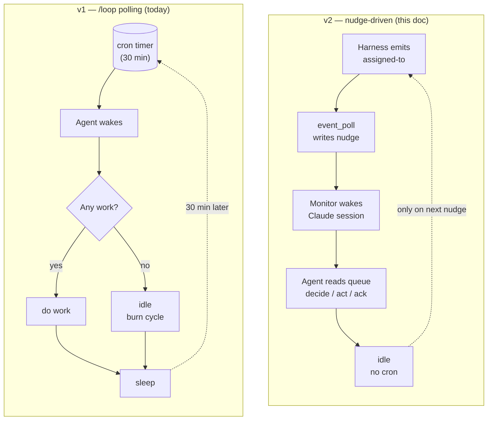
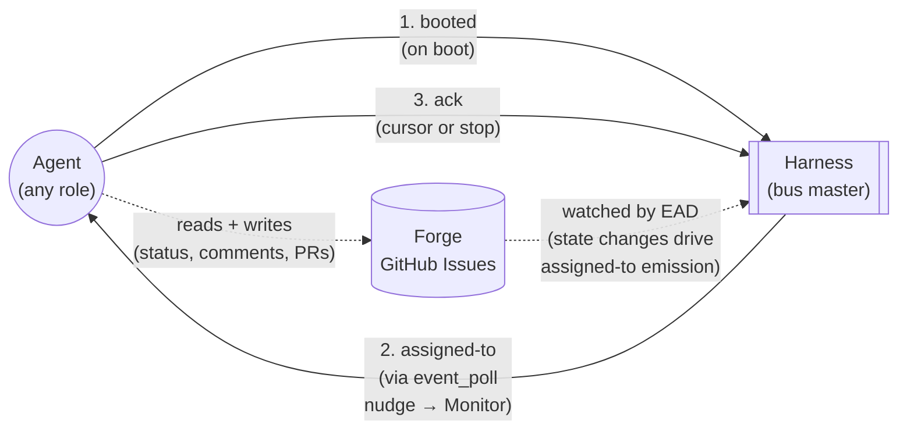
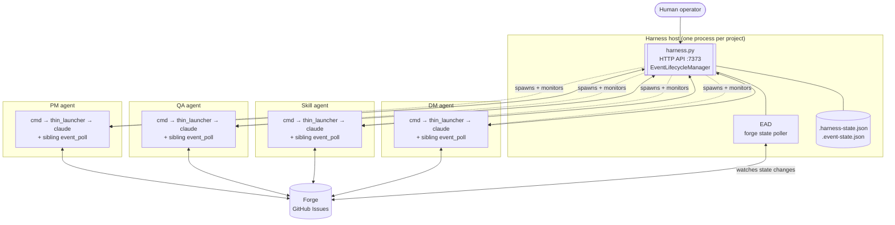
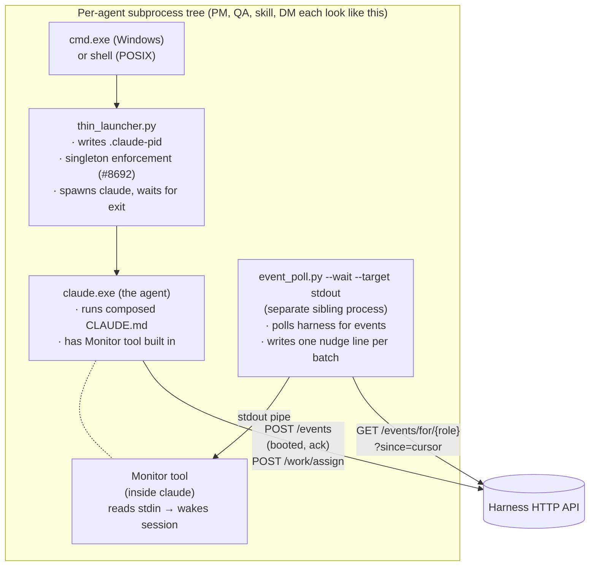
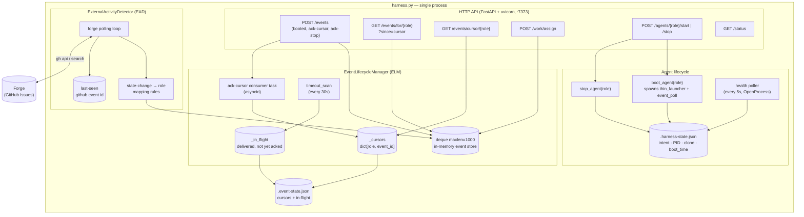
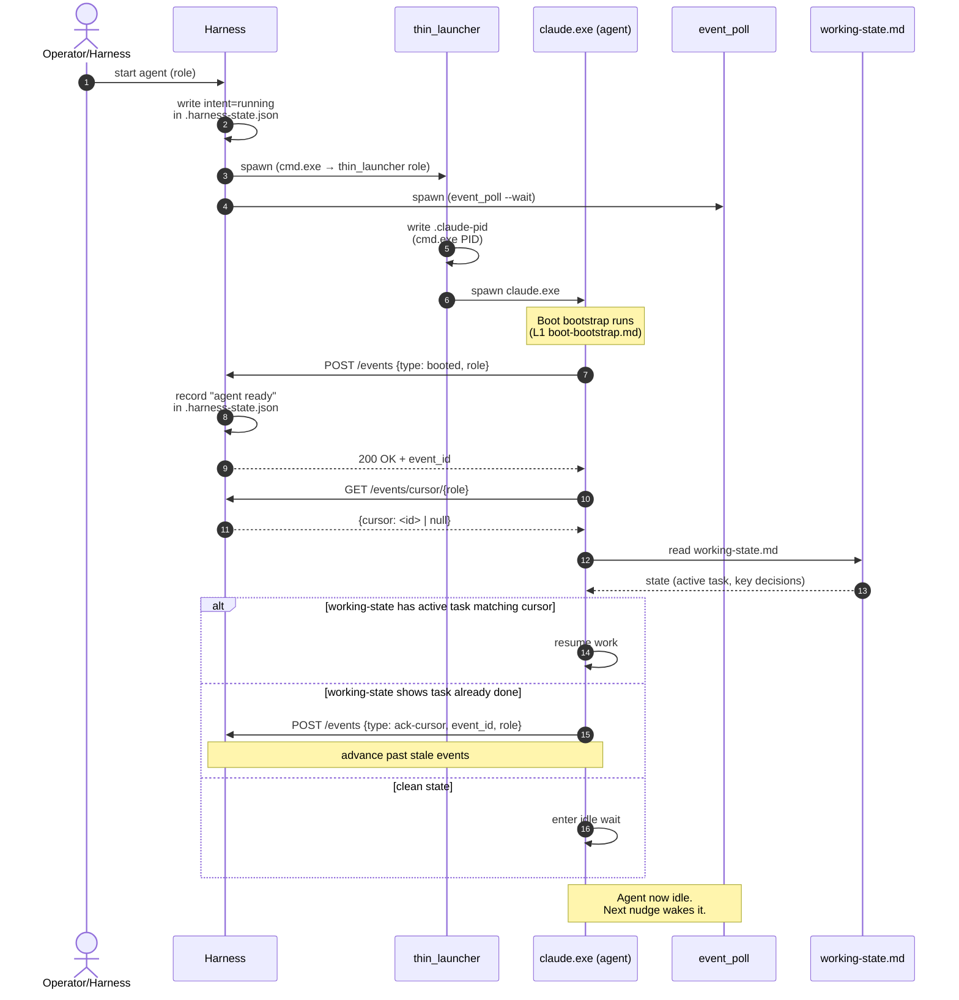
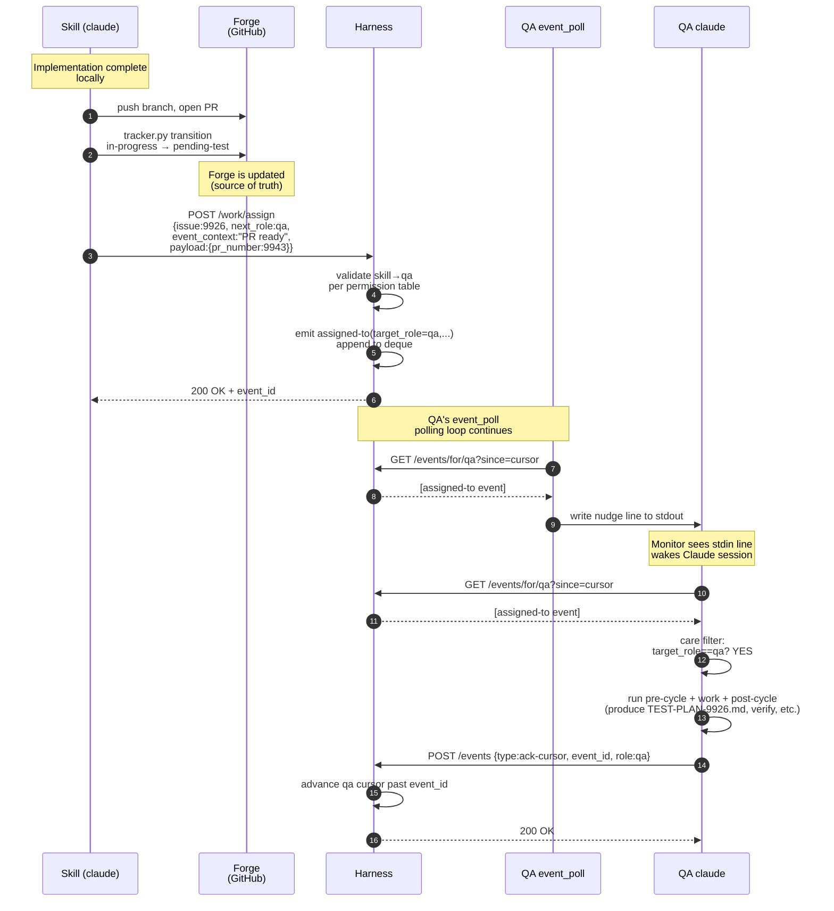
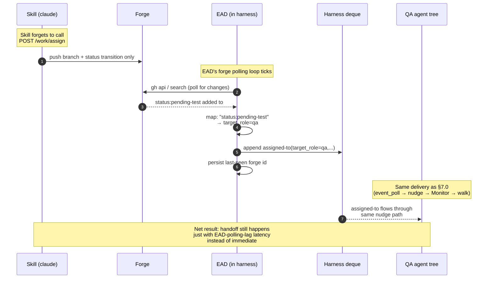
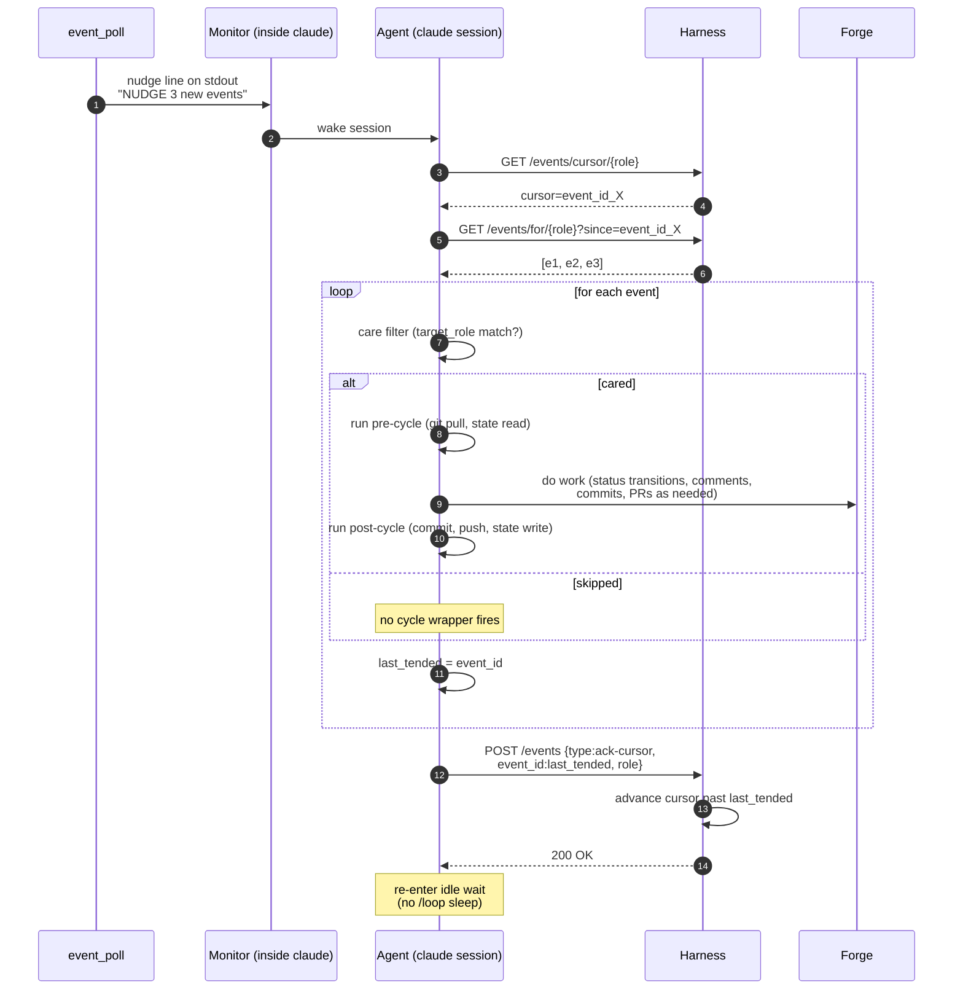

# Event Architecture (v2 — nudge-driven)

_Working document. Authored by PM (Wallace) and co-designed with human collaborator. This supersedes the `/loop`-polled coordination model that has been in place since the project's first cycles._

> **Status**: DRAFT. The model below is being refined; details may change. Existing docs `docs/EVENT-BUS-ARCHITECTURE.md` and `docs/event-bus.md` describe the earlier additive observability bus and will be retired or rewritten once v2 lands.

---

## 1. Why v2 exists

The current system runs every agent on a `/loop 30m` cron. Each cycle the agent wakes, reads forge state, decides if work exists, acts, commits, sleeps. This works but has three persistent problems:

1. **Latency floor** — an agent can be idle for up to 30 minutes after work arrives. Worst case: QA verifies at minute 0, DM doesn't notice until minute 30, ships at minute 32. End-to-end shipping latency is dominated by these polling gaps.
2. **Tokens burned on idle cycles** — every agent spends a meaningful slice of its context window per cycle even when there's nothing to do. Quiet cycles still cost real money.
3. **Cycle/work coupling** — the cycle wrapper (pre-cycle git pull, post-cycle commit/push) fires whether or not work was done. State churn happens on the timer, not on the work.

v2 replaces the cron with **on-demand wakeups driven by signals from the harness**. Claude's Monitor tool sees one line on its stdin and wakes the agent session immediately. Agents stay asleep when there's nothing to do; cycles fire because work arrived, not because a clock ticked.

The trade-off: the harness becomes load-bearing infrastructure. If it's down, agents can't be nudged. There's a fallback path to `/loop` polling (#9580/#9588) for that case.

### 1.1 Before vs. after — at a glance



Same cycle wrapper (pre/post) but it fires on signal, not on timer.

---

## 2. Architectural commitments (locked principles)

From `decision-event-bus-architecture-redesign` vault note (locked cycles 1541–1542):

1. **Harness is a transport bus, not an orchestrator.** It moves signals between producers and consumers. It does NOT track work completion, ticket state, or workflow status.
2. **Forge (GitHub Issues) is the source of truth for work state.** Status labels, comments, PR merges = the project's institutional state. Harness has no opinion on whether work is done.
3. **Agent owns work completion.** The agent acts on signals; what it does with them is between the agent and the forge.
4. **Ack = receipt confirmation, NOT completion confirmation.** "Ack" means "the signal was delivered to the agent's session." It does NOT mean "the agent finished processing."
5. **No `POST /events/{id}/complete` endpoint.** Reject any design that adds endpoints for completion state. The bus pattern uses events, not RPC, for state transitions.

These principles drive every design choice below. When in doubt, fall back to them.

---

## 3. Three signal types — total

The catalog collapses to three concepts. Everything else is either local-side-effect, forge-recorded, or harness-internal — none of those are on the bus.

| Signal | Direction | When | Payload |
|---|---|---|---|
| **`booted`** | agent → harness | First action after the agent's Claude session boots | `{role}` |
| **`assigned-to`** | harness → agent (queue entry) | Harness detects work exists for the role | `{issue_number, title, target_role, event_context, payload}` |
| **`ack`** | agent → harness | Agent has received a delivered signal and the harness cursor can advance past it | Two sub-types: `ack-cursor` `{event_id, role}` advances cursor; `ack-stop` `{event_id, result}` confirms a stop intent |

Why ack has two sub-types: shipped in `#9873-A` (commit `4796af26`). The split disambiguates "agent acknowledges event delivery so cursor can advance" from "agent confirms it has accepted a stop intent and is checkpointing." Both are receipt confirmations — same concept, different consequences for harness state. Mental model: 3 signal concepts; one of them has two emit helpers.

### 3.0 Signal-flow at a glance



Three signals; that's the entire protocol surface for the agent ↔ harness loop. Everything else is local-side-effect (cycle wrappers, git activity) or forge-recorded (status, comments, PRs) — not on the bus.

### 3.1 What is OUT of the catalog

Everything currently in `event_catalog.py` other than the three above is removed:

- Lifecycle ticks: `cycle-start`, `cycle-end` — local to the agent, no other agent cares.
- Git activity: `git-pull`, `git-push`, `git-commit`, `branch-checkout` — local side effects, recorded in git itself.
- PR activity: `pr-create`, `pr-merge` (already DEPRECATED), `pr-merged` — recorded in forge; if relevant to another role, harness translates to `assigned-to`.
- Tracker activity: `status-transition`, `tracker-comment` — recorded in forge as the source of truth; if relevant to another role, harness translates to `assigned-to`.
- Harness internal: `compose-completed`, `agent-health` — harness sees these in its own state; if action needed, harness emits `assigned-to`.
- Speculative RECOGNIZED entries: `verification-passed`, `verification-failed`, `phase-change`, `request-merge`, `stop-requested`, `shipped`, `version-bump` — never emitted, dead weight in the catalog.

20 catalog entries removed. Down to 3.

---

## 4. The process tree

### 4.1 System overview



The §4.2 zoomed view below shows what's inside each agent's subprocess tree.

### 4.2 Per-agent subprocess tree (zoomed)



`thin_launcher` and `event_poll` are intentionally separate processes (decided 2026-05-22):

- Monitor needs a long-lived stdin source. `event_poll`'s exact job.
- `thin_launcher` exits when Claude exits. Wrong shape for Monitor's contract.
- Failure isolation: an `event_poll` crash doesn't take Claude down.
- Restart semantics: harness can restart `thin_launcher` to respawn Claude without losing polling state.

Conceptually they form "the agent's launcher subprocess tree." Implementation-wise they're two processes.

---

## 5. Harness architecture (internals)

The harness is the bus master. It runs as a single Python process per project, owns an HTTP server on port 7373 (default), and holds the event stream + cursor state + agent lifecycle intent in memory + on disk.

### 5.0 Component overview



### 5.1 Components

```
harness.py (single process)
│
├── HTTP API (FastAPI + uvicorn, port 7373)
│    ├── POST /events                         <- emit (booted, ack-cursor, ack-stop, assigned-to)
│    ├── GET  /events/for/{role}?since=cursor <- agent reads its event queue
│    ├── GET  /events/cursor/{role}           <- agent reads its cursor (#9873-A)
│    ├── POST /work/assign                    <- agent requests harness assign work to next role
│    ├── POST /agents/{role}/start, /stop     <- lifecycle control
│    ├── GET  /status                         <- liveness probe
│    └── (other endpoints: see harness.py)
│
├── EventLifecycleManager (ELM)
│    ├── deque(maxlen=1000)                   <- in-memory event store
│    ├── _cursors: dict[role, event_id]        <- per-role consumer position
│    ├── _in_flight: dict[event_id, ...]      <- delivered but not yet acked
│    ├── ack-cursor consumer task             <- watches deque for ack-cursor events
│    └── timeout_scan (every 30s)             <- detects stalled cursors, re-nudges (#9873-E)
│
├── ExternalActivityDetector (EAD)
│    ├── watches forge for state changes      <- PR merges, status transitions, new comments
│    ├── translates into assigned-to events    <- the ONLY producer of assigned-to
│    └── persists last-seen GitHub event id   <- so it doesn't double-process on restart
│
├── Agent Lifecycle State
│    ├── .squidsquad/.harness-state.json      <- per-agent intent, PID, clone path, boot time
│    ├── health poller (every 5s)             <- liveness check via OS process query
│    │                                          (uses sys.platform + OpenProcess on Windows; see e7a47737)
│    ├── boot_agent()                         <- spawns thin_launcher + event_poll subprocesses
│    └── stop_agent()                         <- writes intent, sends stop signal
│
└── Event Persistence
     ├── .squidsquad/.event-state.json        <- cursors + in-flight tracking
     ├── event_lifecycle.load() / save_state()
     └── persistence wrapped in asyncio.to_thread (per CONTEXT-9873-A D4 — H6 mitigation)
```

### 5.2 The event store (deque)

- `collections.deque(maxlen=1000)` — in-memory, capped at 1000 events.
- Harness restart drops history. At-least-once across restarts requires persistence (separate work, not v2 scope).
- Eviction: when a new event pushes past 1000, the oldest is dropped. Agents whose cursor was at that evicted event get a synthetic "cursor-evicted" handling on their next read.

### 5.3 The cursor

- Per-role, owned by harness (was per-agent in `working-state.md` pre-`#9873-A`; migrated to harness).
- `null` at first boot → agent reads from the head of the deque.
- Advances via `ack-cursor` event consumed by the ack consumer task.
- Cursor-regression attempts rejected (per CONTEXT-9873-A D15).
- Endpoint: `GET /events/cursor/{role}` returns `{cursor: <event_id> | null, role}`, HTTP 200 always.

### 5.4 The ExternalActivityDetector (EAD)

EAD is the bridge from forge to bus. It runs inside the harness on a fast polling loop (the only polling in the system) and:

1. Subscribes to GitHub via `gh api` or the search API.
2. Diffs against last-seen event id stored on disk.
3. For each new forge event (issue created, status label added, PR merged, comment posted), maps to a target role per a rule table.
4. Emits one `assigned-to` event per (event, target_role) pair into the deque.
5. Records the new last-seen id so it doesn't re-emit on restart.

EAD is the only producer of `assigned-to`. Agents do not emit `assigned-to` directly; they call `POST /work/assign` which the harness translates.

### 5.5 The `POST /work/assign` endpoint

When an agent finishes work and the next step belongs to another role, it calls this endpoint:

```
POST /work/assign
{
  "issue_number": 9926,
  "next_role": "qa",
  "event_context": "PR ready for QA verification",
  "payload": { "pr_number": 9943 }
}
```

Harness:
1. Validates the calling role is allowed to assign to `next_role` (per a static permission table — dev can hand off to QA, QA can bounce back to dev, etc.).
2. Records the assignment in its in-flight state.
3. Emits `assigned-to(target_role=qa, issue_number=9926, ...)` into the deque.
4. Returns the event_id of the emitted assigned-to so the calling agent can log the handoff.

This is the explicit alternative to "EAD detects the PR existed" — it lets agents directly signal handoffs that EAD might not infer correctly.

---

## 6. Boot sequence (detailed)

### 6.0 Boot sequence diagram



When the harness spawns an agent (or the agent restarts after a crash):

1. **Harness writes intent** = `running` for the role into `.harness-state.json`.
2. **Harness calls `boot_agent(role)`**, which:
   a. Spawns `cmd.exe → thin_launcher.py <role>` in the agent's clone directory.
   b. `thin_launcher` writes `.claude-pid` (containing the cmd.exe PID, not the claude.exe PID — see ARCHITECTURE.md).
   c. `thin_launcher` spawns `claude.exe` with the appropriate flags and waits.
   d. Separately, harness ensures `event_poll.py --wait --target <stdout-fd>` is running as the Claude session's Monitor stdin source.
3. **Claude session boots**, reads its composed `.squidsquad/<role>/CLAUDE.md` (output of `compose.py deploy <role>`), runs the L1 boot bootstrap (`references/sub-skills/common/boot-bootstrap.md`).
4. **Agent emits `booted`** via `POST /events` with payload `{role}`. Harness:
   a. Records "agent ready" in `.harness-state.json`.
   b. Begins dispatching any queued `assigned-to` events for this role (events that arrived while the agent was down get delivered now).
5. **Agent reads its cursor** via `GET /events/cursor/{role}`.
6. **Agent reads `working-state.md`** (its local checkpoint).
7. **Resume decision**:
   - If `working-state.md` shows an active task whose event_id matches/precedes the cursor → resume that work.
   - If `working-state.md` shows that task already completed → emit `ack-cursor` to advance past it. Then check for next event past new cursor.
   - If `working-state.md` is clean → enter idle wait state.
8. **Agent waits for next nudge.** The Claude session is idle; Monitor is listening on stdin; `event_poll` is polling harness.

### 6.1 First boot (fresh install)

Same as above, except:
- `working-state.md` is empty.
- Cursor is `null`.
- Step 7 collapses to "enter idle wait."

### 6.2 Boot after crash mid-work

Same as the normal boot, except `working-state.md` records an in-flight task whose event_id is `<= cursor`. The agent resumes from the checkpoint. If the checkpoint is stale (the work was actually completed before the crash but `working-state.md` didn't get updated), the agent's first action on resume is to re-check forge — forge is the source of truth — and either continue or ack and exit.

---

## 7. Work handoff (detailed)

### 7.0 Handoff sequence — explicit `/work/assign` path



### 7.1 Handoff sequence — EAD safety-net path



Walkthrough: skill ships a fix, hands off to QA.

1. **Skill** finishes its implementation work for issue `#9926`. Pushes the branch, opens PR `#9943`.
2. **Skill** transitions the tracker via `tracker.py transition 9926 in-progress pending-test --role pm-lead`. (Forge is updated; this is the durable record.)
3. **Skill** calls `POST /work/assign` on harness:
   ```json
   {"issue_number": 9926, "next_role": "qa", "event_context": "PR ready for verification",
    "payload": {"pr_number": 9943, "branch": "squidsquad/task/9926"}}
   ```
4. **Harness** validates skill → qa is a legal assignment, then emits `assigned-to(target_role=qa, ...)` into the deque, returns the event_id.
5. **`event_poll` for QA** is polling harness on its loop. On its next poll it sees one new event past QA's cursor → writes one nudge line to stdout: `"NUDGE 1 new event"` (exact format TBD).
6. **Monitor (inside QA's Claude session)** sees the new stdin line → wakes the Claude session.
7. **QA's agent runs its post-nudge contract** (per #9892):
   a. Read events past cursor: `GET /events/for/qa?since=<cursor>` → returns the assigned-to event.
   b. Decide: care or skip? Filter rule: QA cares about `assigned-to` with `event_context` matching verification triggers.
   c. If QA is busy with current work, this assigned-to enters a queue in `working-state.md` ("next: #9926"); QA does NOT interrupt current work.
   d. If QA is idle, QA acts on it: writes TEST-PLAN-9926, runs verification, etc.
   e. After tending (or queuing) the event, QA emits `ack-cursor(event_id)` to advance.
8. **Loop continues**: QA eventually verifies, transitions to pending-ship, calls `POST /work/assign` for DM, etc.

### 7.1 EAD path (when no explicit assign happens)

If skill forgets to call `/work/assign`, the ExternalActivityDetector catches it:
- EAD polls forge, sees the new status:pending-test label on `#9926`.
- EAD maps "status:pending-test on a tracker item" → assigned-to(target_role=qa).
- EAD emits `assigned-to` to QA's queue.
- QA wakes via nudge, same as 5–8 above.

The two paths (explicit `/work/assign` and implicit EAD detection) are both valid. Explicit is preferred for clarity; EAD is the safety net.

---

## 8. Agent contract on nudge (read / decide / act / ack)

### 8.0 Nudge-walk sequence



Per `#9892` (CONTEXT to be finalized in v2's master task):

```
on each nudge:
    cursor = GET /events/cursor/{role}
    events = GET /events/for/{role}?since=cursor

    last_tended = cursor
    for event in events:
        if event passes my role's care filter:
            run_pre_cycle()       # mechanical: git pull, working-state read, etc.
            do_work(event)         # the agent's creative work
            run_post_cycle()       # mechanical: commit, push, working-state write
        # if skipped, no cycle wrapper fires
        last_tended = event.id

    POST /events  ack-cursor {event_id: last_tended, role}
```

Pre/post-cycle wraps EACH cared event individually. Skipped events do not trigger cycle wrappers. The batched ack at the end signals "I've handled or skipped everything up to last_tended; advance my cursor."

### 8.1 Care filter

Each role has a simple care filter — typically just "events with `target_role == my_role`." Future refinement could allow finer-grained filtering based on `event_context` or `payload`, but v2 ships with role-only filtering.

### 8.2 Queue behavior when busy

If an agent receives a nudge while it's mid-cycle on prior work:
- Option A: ignore the nudge (event sits in queue past cursor). Will be re-discovered on next idle.
- Option B: read the queue, decide care/skip, queue the cared events in `working-state.md`, ack to advance cursor.

Recommended: **Option B**. Acking doesn't mean "I'm done with the work" — it just means "I've received this event and have a plan for it." This avoids the queue piling up and forces explicit triage.

---

## 9. State persistence map

| What | Where | Why |
|---|---|---|
| Per-role cursor | `.squidsquad/.event-state.json` (harness-owned) | Harness owns delivery state |
| In-flight events | `.squidsquad/.event-state.json` | Re-delivery on timeout (#9873-E) |
| Agent intent + PID | `.squidsquad/.harness-state.json` (harness-owned) | Harness owns agent lifecycle |
| Agent working state | `.squidsquad/<role>/working-state.md` (agent-owned) | Resume-from-crash checkpoint |
| Last-seen forge event | EAD-internal persistence | Don't re-emit assigned-to on restart |
| Work state | GitHub Issues (forge) | Source of truth for status, comments, PRs |
| Decisions / institutional memory | `.squidsquad/vault/` | Long-lived rationale |

Agents do not write to harness-owned files. Harness does not write to agent-owned files.

---

## 10. Polling-mode fallback (degraded operation)

When the harness is unreachable at boot (probe fails per `common/boot-bootstrap` Step 2), the agent falls back to the legacy `/loop 30m` polling model. This is the safety net documented in `#9580` and `#9588`. Agents work, just with the old 30-min cadence and no nudges.

Once the harness recovers, an operator restarts the agent to re-enter event mode. Mid-session mode-flipping is explicitly NOT supported (per the "loaded mode is sticky" rule in `common/boot-bootstrap`).

### 10.1 Boot decision tree


Mode is locked at boot — no mid-session switch — to keep the agent's contract predictable. The operator is the only mode-flipping authority.

---

## 11. What gets removed

To land v2 cleanly, the following are retired or rewritten:

| Component | Action |
|---|---|
| `/loop 30m execute one Ralph Loop cycle` in `thin_launcher` | Removed. Agent boots into idle-wait instead of cron. |
| `/loop` invocation in `common/boot-bootstrap` Step 4 | Removed. Step 4 becomes "enter idle, await nudge." |
| 20 catalog entries (cycle-*, git-*, pr-*, tracker-*, etc.) | Removed from `event_catalog.py`. |
| `Event Reactions` block in `config.md` | Collapses to: every role reacts-to `assigned-to` only. |
| `event_poll.py` per-event JSON-on-stdout emission | Replaced with single nudge line per polling batch (#9891 scope). |
| Agent contract pre-`#9892` | Rewritten to read/decide/act/ack walk. |
| Existing `docs/EVENT-BUS-ARCHITECTURE.md` and `docs/event-bus.md` | Marked superseded; either rewritten or deleted. |

---

## 12. Tasks already filed that this absorbs or supersedes

| Issue | Status | Disposition under v2 |
|---|---|---|
| `#9873` umbrella | shipped (foundation -A) | Foundation work already in main; v2 builds on it |
| `#9873-A` (cursor migration + ack split) | shipped | Permanent — sub-types of v2's `ack` concept |
| `#9873-B` / `#9891` (event_poll nudge-only) | pending | Absorbed into v2 umbrella |
| `#9873-C` / `#9892` (agent read/decide/act/ack contract) | pending | Absorbed into v2 umbrella |
| `#9873-D` / `#9893` (improvement subloop trigger) | pending | Possibly absorbed; possibly deferred |
| `#9873-E` / `#9894` (timeout_scan re-nudge) | pending | Absorbed |
| `#9873-F` / `#9895` (TUI ack visualization) | pending | Out of scope, POST-V1 |
| `#9580` (event-mode degraded fallback = polling) | pending | Confirms v2's fallback path |
| `#9845` (noop event type) | planned | Retired — probe becomes `assigned-to(event_context='probe', ack_only=true)` |
| `#9588` (lazy-load mode-specific instructions) | shipped | Permanent — supports v2's idle-wait boot path |

---

## 13. Open questions to refine

These are deliberate gaps in this draft. Each needs a human-locked decision before the umbrella task is filed.

1. **Booted-payload shape**: just `{role}`, or also include `pid`, `clone_path`, `version`?
2. **POST /work/assign authorization**: hard-coded permission table per role pair, or open (any agent can assign to any role)? Recommended: hard-coded with explicit table.
3. **EAD polling cadence**: 5s? 15s? Tradeoff is forge API quota vs. assignment latency.
4. **`event_poll` polling cadence**: how often does it ask the harness for events? Recommended: 5s active when there's an in-flight assignment, 30s when fully idle (with adaptive backoff).
5. **Cursor on first boot**: `null` (start from head of deque) or "skip everything emitted before my booted time" (start from now). Recommended: `null` per CONTEXT-9873-A D7.
6. **Care filter granularity**: role-only in v1, or richer matching by `event_context` from day 1?
7. **Queue-while-busy behavior**: ignore-on-nudge or read-decide-queue-ack? Recommended: read-decide-queue-ack (see §8.2).
8. **What about #9845 (noop)?**: retire and absorb into `assigned-to` payload, OR keep as a dedicated 4th event type for probe semantics?
9. **`compose.py` deploy after merging this v2**: any compose-pipeline changes needed for the trimmed `event_catalog` or the new boot path?
10. **Migration plan**: do we ship v2 with a feature flag (`event-driven: yes` vs `no`), or hard cutover with rollback only via revert?

---

## 14. Gaps surfaced via diagramming

Drawing the sequence + arch diagrams above exposed concrete gaps in the model. These are NOT the same as the §13 design questions — those were open by design. These are things the prose left implicit and the diagrams forced into visibility. Each is something we should resolve before the umbrella implementation task is filed.

### 14.1 Process-tree / lifecycle gaps

- **G1 — Who spawns `event_poll`?** The §4.2 diagram shows `thin_launcher` spawning `claude` and `event_poll` running as a sibling. But who launches `event_poll`? Is it the harness (separately from thin_launcher), or thin_launcher itself in a "spawn-and-fork" pattern, or Monitor's invocation contract that names the script? The doc says "harness calls boot_agent which spawns thin_launcher + event_poll separately" — but the exact mechanism is hand-wavy. Per §6.0 step 4-5, both are spawned by harness; need to make that concrete (probably two `subprocess.Popen` calls in `boot_agent`).
- **G2 — Who restarts `event_poll` if it crashes?** Today nothing watches it. In the new model, an event_poll crash silently severs the agent's nudge path; agent appears alive but receives no work. Need either: (a) harness health-polls `event_poll` like it polls claude, (b) thin_launcher monitors event_poll as a child, or (c) Monitor itself detects stdin source EOF and signals.
- **G3 — Booted-event delivery race.** If the agent emits `booted` *before* the harness's `boot_agent()` finishes recording intent, the POST hits an unprepared harness. Need either: (a) `boot_agent()` records intent BEFORE returning (sync, not deferred), so when the agent emits booted the record exists; or (b) harness `/events` accepts booted from any role regardless of intent state and reconciles later.
- **G4 — Stop intent flow is undocumented.** §3 mentions `ack-stop` but no diagram shows the full stop sequence: harness wants to stop agent → emits stop-request? sets intent? → agent detects it how? → drains work → emits `ack-stop` → exits cleanly. The current contract has gaps in WHO initiates, HOW the agent learns, and the deadline before forced kill.

### 14.2 Event-delivery gaps

- **G5 — Multi-event nudge formatting.** §8 walk shows the agent reading `[e1, e2, e3]` after one nudge. But `event_poll` writes only one nudge line per polling cycle regardless of count. What does the nudge line contain — a count? An event_id range? Nothing? Affects whether the agent can skip the GET if it already knows the event ids.
- **G6 — Out-of-order ack semantics.** §8.0 batches the ack to the last tended event_id. If the agent decides care/skip in order but for some reason cannot tend an earlier event (transient error reading from forge, say), can it still ack past it? Or must it block on the failed event? #9873-A has cursor-regression protection but doesn't cover forward-skip semantics.
- **G7 — Cursor when deque has been compacted.** If agent's cursor points to an evicted event_id (harness deque rolled past it during agent downtime), GET `/events/for/{role}?since=cursor` needs to return "your cursor is too old, you've missed events" — not just empty. The doc says "synthetic cursor-evicted handling" but doesn't specify the wire format.
- **G8 — EAD double-emit on restart with lost last-seen.** §5.4 says EAD persists last-seen forge id "so it doesn't double-process on restart." If that file is corrupt or missing, EAD starts from zero and could emit thousands of historical assigned-to events, flooding queues. Need a bounded recovery: e.g., on missing/corrupt last-seen, default to "now - 10 minutes" not "epoch."
- **G9 — Forge → EAD lag floor.** GitHub Search API has 5-30s indexing lag. Even with EAD polling every 1s, assigned-to latency has an indexing-lag floor that the doc currently understates. Mention this so v2 isn't sold as "sub-second" when it's really "10-30s for EAD-driven handoffs, sub-second for `/work/assign`-driven."

### 14.3 Work-handoff gaps

- **G10 — Assignment to an offline agent.** §7.0 step 4 emits `assigned-to(target_role=qa)` directly into the deque. What if QA isn't booted (down for maintenance, crashed, etc.)? The event sits past QA's cursor; when QA boots, it'll see the event past its cursor. OK. But what if EAD ALSO detects the forge change and emits a second assigned-to? Need dedup logic OR explicit "operator-acknowledged duplicates fine because care-filter handles it."
- **G11 — `/work/assign` permission table.** §13 Q2 asked the question; §7.0 step 2 just says "validate." Need an actual matrix:
  ```
  caller ↓  | assign-to →  pm   qa   skill   dm
  pm                       –   ✓    ✓       ✓
  qa                       ✓   –    ✓       ✓
  skill                    ✓   ✓    –       ✓
  dm                       ✓   ✓    ✓       –
  (dev variants inherit dev row; — = self-assign forbidden)
  ```
  This is the kind of table the locked decisions section should contain.
- **G12 — Assigning to PM.** PM is the human-facing role. Most workflows shouldn't generate assigned-to events for PM because PM acts on human input + sentinel scans, not on other agents handing off work. But §7.1 shows "DM done → assign to PM"? Actually PM doesn't appear in any handoff loop in our current workflow. Possibly the table should be: `assigned-to(target_role=pm)` is emitted ONLY by EAD on "human commented on issue" events, never by `/work/assign` from another agent.

### 14.4 State / persistence gaps

- **G13 — `working-state.md` write race.** Agent might be writing `working-state.md` (post-cycle wrap) when event_poll fires a nudge. Today's compose pipeline serializes things via the cycle wrapper, but in v2 the nudge is async. Need atomic write protocol (write to `.tmp`, rename) — actually already standard per §2 of L1 base, but worth restating.
- **G14 — `.event-state.json` size unbounded.** Cursors are bounded (one per role). In-flight is bounded by deque maxlen. But if events get evicted while in-flight, those entries become orphans in `_in_flight`. Need a `timeout_scan`-driven cleanup that removes in-flight entries whose event_id is no longer in the deque.
- **G15 — Harness restart loses deque.** Stated in §5.2 but not flagged as a gap. On harness restart, all in-flight events are gone, all cursors are still pointing at event_ids that may have been in the deque. Agents reading `/events/for/{role}?since=cursor` after harness restart see an empty result — looks like no work — but the work may still exist in forge. EAD on restart should re-detect from forge and re-emit. Need to specify that contract.

### 14.5 Boot / runtime ordering gaps

- **G16 — First boot of the very first agent.** §6 assumes harness is up before any agent. But the harness itself has to be started by something (wizard, `start.sh`, operator command). Need a §6.x for "system cold start" covering: operator launches harness → harness loads state → harness `boot_agent(pm)` → ... in what order? Especially: does EAD start before or after the first agent boots?
- **G17 — `compose-completed` removed but compose still happens.** §11 removes `compose-completed` from the catalog. But `compose.py` still runs (e.g., after `references/` changes merge). Today other agents react to `compose-completed` by reloading their CLAUDE.md (sort of). In v2, when does an agent get a refreshed CLAUDE.md? Probably: agent restart only. Need to state that explicitly — compose changes require an operator restart of affected agents.
- **G18 — Wizard at install time.** Nowhere mentioned. New installs run the wizard to set up `.squidsquad/`. Wizard needs to know whether the install will use event-mode or polling-mode (sets `config.md`). The doc should mention the wizard's role in choosing the boot mode.

### 14.6 Observability / TUI gaps

- **G19 — Where does TUI fit?** Existing `event-bus.md` mentioned TUI/observability as a consumer of the bus. In v2 with 3 signals, TUI would only see booted + ack + assigned-to — not enough for a useful agent activity stream. Possibly TUI subscribes to a separate "diagnostic" tap (not a bus event) that lets harness expose the lifecycle/git/tracker activity it ignores for routing. Or TUI just reads forge directly. Either way, doc is silent.
- **G20 — Harness logs vs. event stream.** Locally meaningful events (cycle-start, git-commit) still happen. Where do they go? Stderr of each agent process? A central log file? Today they're emitted to the bus AND logged. In v2 they leave the bus — where they go instead needs to be stated.

### 14.7 Migration gaps

- **G21 — Trim sequencing.** §11 lists "20 catalog entries removed." But other code (event_poll, harness consumers, agent code that reads events) currently uses some of those types. Need a sequencing plan: (a) stop emitting first, then (b) stop reading, then (c) delete from catalog. Or accept some staleness.
- **G22 — `Event Reactions` block collapse.** §11 says every role's `reacts-to` becomes just `assigned-to`. But the existing `pm` reacts-to list includes `agent-health` (PM is supposed to act on dead agents) — under v2, who emits the assigned-to event that triggers PM's agent-recovery action? EAD doesn't watch agent processes. Possibly harness's health poller becomes a producer that emits `assigned-to(target_role=pm, event_context='agent-down', payload={role:skill})` when a watched agent dies.

---

## 15. References

- Vault: `.squidsquad/vault/galaxy/decision-event-bus-architecture-redesign.md` — locked architectural principles.
- `references/scripts/event_catalog.py` — current catalog (to be trimmed to 3 entries).
- `references/scripts/thin_launcher.py` — current launcher (to lose the `/loop` invocation).
- `references/scripts/event_poll.py` — current polling subprocess (to become nudge-only).
- `references/scripts/harness.py` — bus master (EAD + EventLifecycleManager to be extended).
- `references/sub-skills/common/boot-bootstrap.md` — boot bootstrap (Step 4 to lose `/loop`).
- `references/sub-skills/common-events/` — existing event-mode contract fragments (to be rewritten under v2).
- `docs/ARCHITECTURE.md` — broader project architecture (process tree, .claude-pid semantics).
- `docs/EVENT-BUS-ARCHITECTURE.md` + `docs/event-bus.md` — earlier additive bus design (to be superseded).
- Shipped foundation: `4796af26` (#9873-A — cursor migration + ack split + cursor endpoint).
- Pre-flip blockers in queue: `#9891` (event_poll nudge-only), `#9892` (agent contract).
- Fallback path: `#9580`, `#9588`.

---

## 16. Revision log

- **2026-05-22 (rev 1) — initial draft** by pm-lead (Wallace). Captures the architectural alignment from this session's discussion: 3 signals, harness as bus master, EAD as forge→bus translator, thin_launcher + event_poll separation, polling fallback. Co-designed with human collaborator; refinement to follow on this PR.
- **2026-05-22 (rev 2) — diagrams + gaps pass.** Added 8 Mermaid diagrams: §1.1 before/after, §3.0 signal-flow, §4.1 system overview, §4.2 per-agent process tree, §5.0 harness component map, §6.0 boot sequence, §7.0 explicit-handoff sequence, §7.1 EAD-handoff sequence, §8.0 nudge-walk sequence, §10.1 boot decision tree. New §14 "Gaps surfaced via diagramming" with 22 concrete gaps (G1–G22) in 7 categories: process-tree/lifecycle, event-delivery, work-handoff, state/persistence, boot/runtime ordering, observability/TUI, migration. These are additive to the §13 open design questions — they're things the prose left implicit that the diagrams forced into visibility. Each is something to resolve before the umbrella implementation task is filed.
