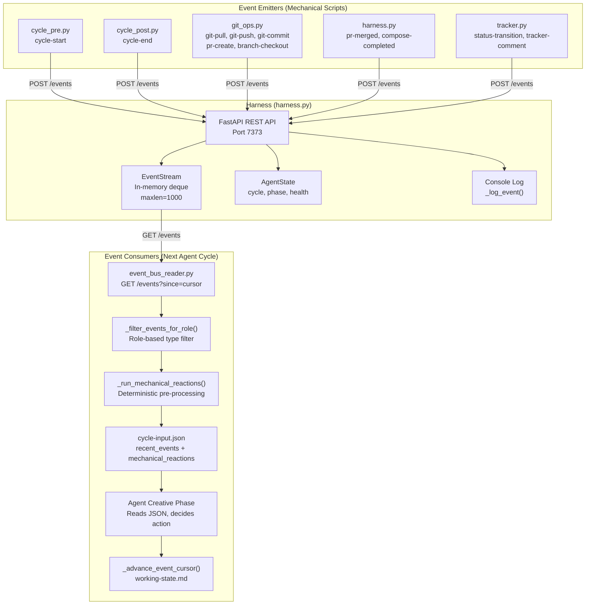
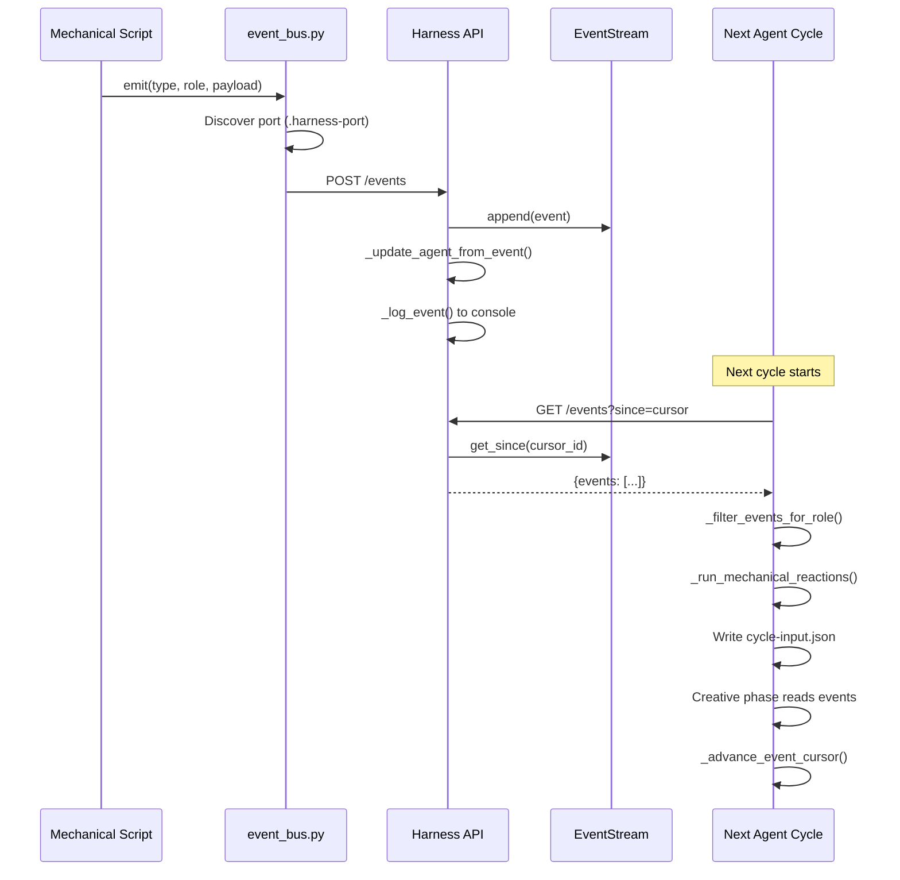
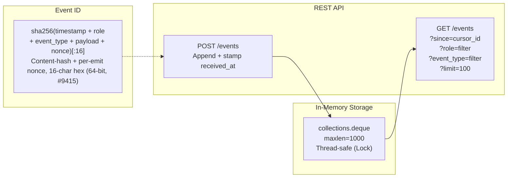
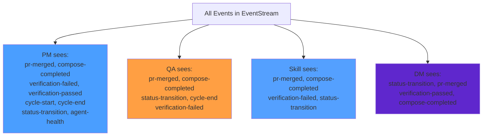
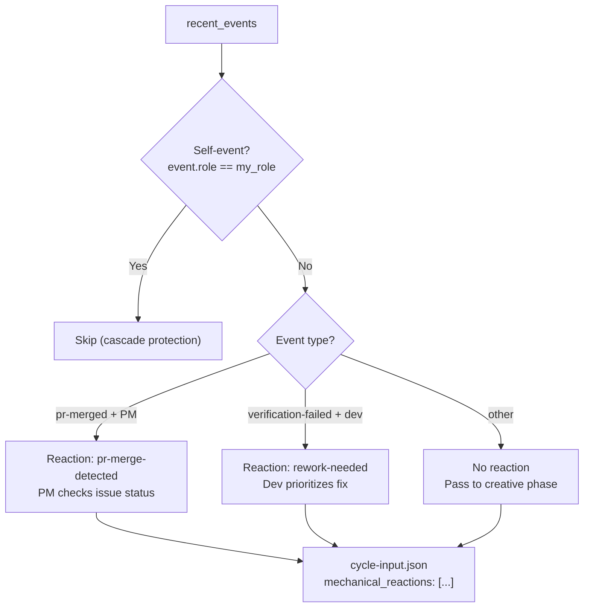
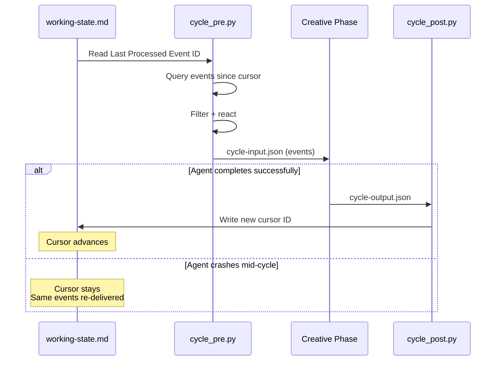
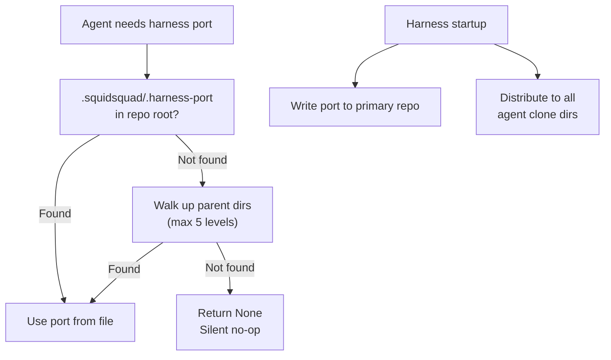

# Event Bus Architecture

_PRD — System design document for the SquidSquad event bus._

## Overview

The event bus is a lightweight, fire-and-forget observability layer that enables agents to react to coordination signals without polling GitHub Issues. It is **purely additive** — agents function identically when the harness is unreachable. All emission calls are non-blocking (500ms timeout) with silent failure.

## System Diagram

## Event Lifecycle

## Event Type Catalogue

### Infrastructure Events (emitted by scripts)

| Event Type | Emitter | Payload | When |
|------------|---------|---------|------|
| `cycle-start` | cycle_pre.py | `{}` | Beginning of agent cycle |
| `cycle-end` | cycle_post.py | `{cycle_type, summary}` | End of agent cycle |
| `git-pull` | git_ops.py | `{result}` | After git pull |
| `git-push` | git_ops.py | `{branch}` | After git push |
| `git-commit` | git_ops.py | `{message, branch, files_changed, commit_type}` | After commit |
| `pr-create` | git_ops.py | `{pr_number, title, branch}` | After PR created |
| `pr-merged` | harness.py | `{pr_number, branch, issue_number, files_changed, success, error}` | After PR merged by harness |
| `compose-completed` | harness.py | `{roles_affected, trigger}` | After harness recomposes agent templates post-merge |
| `branch-checkout` | git_ops.py | `{branch, task_number}` | After branch switch |
| `status-transition` | tracker.py | `{issue_number, from, to}` | After status change |
| `tracker-comment` | tracker.py | `{issue_number, commenter_role, comment_preview, mentioned_roles}` | After comment posted |

### Planned Events (not yet emitted)

| Event Type | Planned Emitter | Purpose |
|------------|----------------|---------|
| `phase-change` | harness.py | Agent phase change signal |
| `agent-health` | harness.py | Agent health observation |
| `verification-failed` | QA creative phase | QA rejection signal |
| `verification-passed` | QA/PM creative phase | QA approval signal |

## EventStream Architecture

**Properties:**
- **Bounded**: oldest events evicted at 1000 capacity
- **No persistence**: harness restart clears all events
- **Thread-safe**: Lock on every read/write
- **Port discovery**: `.squidsquad/.harness-port` file, walked up 5 parent dirs for clone isolation

## Role-Based Filtering

Each role only sees events relevant to its responsibilities:

Filtering is **client-side** in `cycle_pre.py` via `_ROLE_EVENT_TYPES` dict. Roles not in the dict receive all events (no filtering).

## Mechanical Reactions

Pre-processed deterministic responses to specific events:

## Cursor Model and Delivery Guarantees

**Delivery semantics**: At-least-once. Cursor only advances after successful cycle completion. Crashed agents re-process the same events on restart.

## Cascade Protection

Two safeguards prevent infinite event loops:

1. **Self-event filter**: `if event.get("role") == role: continue` in `_run_mechanical_reactions()`. An agent's own emissions never trigger its own mechanical reactions.

2. **Cursor deduplication**: Events before the cursor are never re-read. A mechanical reaction that triggers a tracker transition (which emits a new `status-transition` event) will only be seen by *other* agents on their next cycle, not by the emitting agent.

## Port Discovery (Clone Isolation)

## Design Properties

| Property | Implementation |
|----------|---------------|
| **Non-blocking** | 500ms timeout on all HTTP calls, exceptions silently swallowed |
| **Observational** | Events are advisory signals, not commands. Creative phase decides action |
| **No persistence** | In-memory deque. Harness restart clears history |
| **Self-isolation** | Agents only react to other agents' events |
| **At-least-once** | Cursor advances only after successful cycle |
| **Role authority** | Event bus has no knowledge of permissions — tracker.py enforces |
| **Graceful degradation** | Harness unreachable = empty events = zero behavior change |
