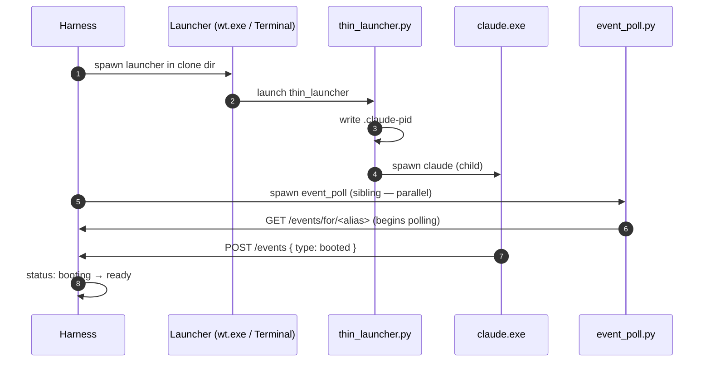

# Harness Architecture

> **Status**: §§1–13 are a descriptive snapshot of the harness as it exists in code today (`references/scripts/harness.py` ~2900 lines). §14 is a **proposed simplification** of the per-agent spawn chain — not implemented; validated end-to-end by the experiment scripts under `references/experiments/`.
>
> **Companion docs**: [`AGENT-RUNTIME.md`](AGENT-RUNTIME.md) (cycle integration, event-bus contract from the agent's side), [`ARCHITECTURE.md`](ARCHITECTURE.md) (overall system; harness appears in the system overview), [`INSTALLER-ARCH.md`](INSTALLER-ARCH.md) (how harness gets installed and started).

---

## 1. Goal & scope

This doc describes the **harness** — the single supervisor process that owns agent lifecycle and the event bus for one SquidSquad install.

In scope:

- What the harness is, how it runs, what it owns
- HTTP API surface (every endpoint, what it does)
- EventLifecycleManager (ELM) — the in-process event bus
- ExternalActivityDetector (EAD) — the forge → bus bridge
- Agent lifecycle: spawn, monitor, intent state machine, stop, restart
- Port discovery and clone-isolation
- State persistence (`.squidsquad/.harness-state.json`, `.squidsquad/.event-state.json`, `.squidsquad/.harness-port`)
- Restart safety
- Failure modes

Out of scope:

- How agents react to bus events (see [`AGENT-RUNTIME.md`](AGENT-RUNTIME.md) §4–§7)
- The cycle wrapper (pre → creative → post) — agent-side mechanism, see AGENT-RUNTIME §6
- Compose pipeline — see [`COMPOSE-ARCHITECTURE.md`](COMPOSE-ARCHITECTURE.md)
- How agents are installed onto disk — see [`INSTALLER-ARCH.md`](INSTALLER-ARCH.md)

---

## 2. What the harness is

The harness is **one process per SquidSquad install**, started by the operator via `start.sh` at the repo root (a thin shell wrapper that invokes `squidsquad_cli.py start` with the appropriate environment). `start_team.py` is a deprecated alias retained for compatibility. The installer's upgrade flow (INSTALLER-ARCH §10) invokes `start.sh` when the harness is unreachable (port file missing or HTTP probe fails); running-and-reachable upgrades use the harness's per-agent lifecycle endpoints directly (see INSTALLER-ARCH §10 step 5). The harness runs in the foreground in a terminal window — there is no daemonization. Operator owns the lifetime; closing the terminal stops the harness.

**Lifecycle authority** sits with the harness's HTTP API: any localhost caller (operator CLIs, the installer during upgrade, automation) issues lifecycle changes by calling the harness API. The constraint is that *nothing else* spawns agents directly — start/stop/restart are exclusively the harness's domain via its API surface. The harness owns the implementation; the API is the only public surface.

Three properties define it:

1. **Singleton per install** — only one harness process per project directory. Verified via the `.squidsquad/.harness-port` file (see §6) and process listing.
2. **Stateful but recoverable** — persists to `.squidsquad/.harness-state.json` and `.squidsquad/.event-state.json`. On restart, reads both files, verifies live agent PIDs, and resumes monitoring without dropping intent.
3. **Localhost-only** — HTTP API binds to `127.0.0.1`; no authentication; no network exposure. Multi-host installs are not supported.

The harness is **distinct from**:

- **Agent processes** — agents are separate processes (`claude` + `event_poll.py`) spawned by the harness; they communicate with it over HTTP and live in their own clone directories.
- **EAD** — EAD is a component *inside* the harness (an asyncio task), not a sibling process.
- **The forge (GitHub)** — the harness reads from GitHub via EAD. It performs **one specific forge write**: rewriting the `role:<target_alias>` label on the issue named in every `POST /work/assign` call (and on EAD-emitted `assigned-to` events). This is the routing-source-of-truth update; see [AGENT-RUNTIME §7.3](AGENT-RUNTIME.md). All other tracker writes (status transitions, comments, label changes other than `role:*`) go through agents calling `gh` directly via `tracker.py`.

---

## 3. Process model

- **Runtime**: Python 3.12+, FastAPI + uvicorn for HTTP server, asyncio for event handling.
- **Threading**: predominantly single asyncio event loop. A small number of background tasks (`ack-cursor consumer`, `timeout_scan`, `health_poll`, `EAD poller`) run as asyncio coroutines on the same loop; no thread pool.
- **HTTP server**: uvicorn binds `127.0.0.1:<port>` (default `7373`; alternate port if occupied — see §6). FastAPI routes are coroutine handlers.
- **Subprocess spawning**: `boot_agent(role)` shells out to platform-appropriate launcher (cmd.exe on Windows, AppleScript on macOS, terminal-emulator on Linux) which in turn spawns `thin_launcher.py` + `event_poll.py` per agent. See `boot_remote.py` for platform details. *(The signature `boot_agent(role)` accepts an alias value — legacy parameter name; rename tracked in #10358 along with the wire-format change.)*
- **Shutdown**: Ctrl+C triggers graceful shutdown — sets all agent intents to `stopping`, waits up to 60s for cooperative exits, then exits. `POST /shutdown` accepts an HTTP shutdown request with same semantics.

---

## 4. HTTP API surface

All endpoints serve from `http://127.0.0.1:<port>`. Localhost-only; no authentication; clients are agents on the same host. JSON request/response throughout.

### 4.1 Lifecycle & status endpoints

| Method | Path | Purpose | Returns |
|---|---|---|---|
| GET | `/status` | Harness liveness + code version + intent summary | `{version, code_version, agents: [...], harness_state}` — `version` is the harness wire-protocol version (integer); `code_version` is the harness build identifier (git short-SHA or package version string) |
| GET | `/` | Root — alias for `/status` (legacy convenience) | Same as `/status` |
| GET | `/agents` | List all known agents + their current state | `[{role, alias, intent, status, pid, clone_path, boot_time, ...}]` |
| GET | `/agents/{role}` | Single agent state | `{role, alias, intent, status, pid, clone_path, boot_time, last_seen}` |
| GET | `/agents/{role}/health` | PID-based liveness probe for one agent | `{role, alias, alive, intent, status, pid, last_seen}` |
| GET | `/agents/{role}/config` | Per-agent install config (clone path, etc.) | `{clone_path, ...}` |
| POST | `/agents/{role}/start` | Set intent=running, spawn if not alive | `{ok, role, alias, action}` |
| POST | `/agents/{role}/stop` | Set intent=stopping; cooperative shutdown | `{ok, role, alias}` |
| POST | `/agents/{role}/restart` | Set intent=restarting; respawn after death | `{ok, role, alias}` |
| POST | `/agents/all/start` | Start all configured agents | `{ok, started: [...]}` |
| POST | `/agents/all/stop` | Stop all running agents | `{ok, stopped: [...]}` |
| POST | `/shutdown` | Graceful harness shutdown — returns `202 Accepted` immediately, then performs graceful shutdown (sets all agent intents to `stopping`, waits up to 60s for cooperative exits, then exits) | Body: `{ok: true, action: "shutdown-initiated"}` returned synchronously with the 202; harness process exits asynchronously after the response is sent |

> **Response-shape status:** the response shapes above are **aspirational** — they document the target shape that lands with **#10358** (the `role` → `alias` code rename). **Today's actual return shape**: `AgentState.to_dict()` returns a `role` field (whose value is the alias; no separate `alias` field), plus `claude_pid` and `terminal_pid` as separate fields (no shorthand `pid` field). Existing clients should treat the alias as the value of `role` and read `claude_pid` + `terminal_pid` separately until #10358 ships. The "target shape" framing also applies to §9 (Vocabulary note) — both sections describe the post-rename state. The shorthand `pid` field in the post-#10358 response is a **derived view** over the two-field state record in §7.5 — the state file always carries both `claude_pid` and `terminal_pid` separately (see §7.5 for the canonical shape and rationale). **Derivation rule:** `pid = claude_pid` (the agent process). `terminal_pid` remains available in `.harness-state.json` for diagnostics but is not exposed via the HTTP API.
>
> **Path-parameter vocabulary on lifecycle endpoints:** `{role}` on `POST /agents/{role}/start|stop|restart` and `GET /agents/{role}/*` accepts the **alias** value (same convention as event-bus endpoints §4.2). The naming predates the alias concept; the rename to `{alias}` is in #10358. There is no class-level lifecycle endpoint — every lifecycle call targets one specific alias.

### 4.2 Event bus endpoints

| Method | Path | Purpose | Returns |
|---|---|---|---|
| POST | `/events` | Emit an event (booted, ack-cursor, assigned-to, etc.) — see [AGENT-RUNTIME.md §4.2](AGENT-RUNTIME.md) for payload shapes per event type | `{ok, event_id}` or 4xx |
| GET | `/events` | List recent events (**debug-only**; not part of agent-facing contract) | `[event, ...]` |
| GET | `/events/for/{alias}` | Read events past the alias's cursor | `[event, ...]` or HTTP 410 Gone if cursor evicted |
| GET | `/events/cursor/{alias}` | Current cursor position for an alias | `{cursor, role}` (cursor may be `null` on first boot); **HTTP 200 always** (no 404 if cursor null) |
| GET | `/events/in-flight/{alias}` | List events delivered to alias but not yet acked (**debug-only**; agents do not consume this in normal operation) | `[event, ...]` |
| GET | `/events/lifecycle` | Recent lifecycle events for TUI display | `[event, ...]` |

> **Path-parameter vocabulary** (per §9): the `{alias}` path parameter on `/events/for/{alias}`, `/events/cursor/{alias}`, `/events/in-flight/{alias}` accepts the alias value (e.g. `skill`, `verifier`), not the L2 categorical role. Code currently uses `{role}` as the path parameter name for historical reasons; the value is always an alias. The rename to `{alias}` ships with [#10358](https://github.com/WallyDoodlez/SquidSquad/issues/10358). This doc uses `{alias}` to match the actual semantics.
>
> **No completion endpoint** (locked, per AGENT-RUNTIME §4.1 principle #4): there is no `POST /events/{event_id}/complete`. The bus uses events, not RPC, for state transitions. Receipt confirmation flows through `ack-cursor` (cursor advance) and `ack-stop` (graceful-shutdown acknowledgement) only — both emitted via `POST /events`. Any design that proposes a completion endpoint is rejected at architecture review.

### 4.3 Work-assignment endpoint

| Method | Path | Purpose | Returns |
|---|---|---|---|
| POST | `/work/assign` | Route work to a target agent | `{ok}` on 200, 404 if alias unknown, 400 on malformed payload |

Request body: `{issue_number: int, target_alias: str, event_context: str}`. The harness validates `target_alias` resolves to a registered agent (alias-existence check only, no role-class permission filtering — see §13.5). Forwards the assignment as an `assigned-to` event on the bus. Returns 200 on accepted, 404 if alias unknown, 400 on malformed payload.

### 4.4 Work-queue endpoint

| Method | Path | Purpose | Returns |
|---|---|---|---|
| GET | `/queue/{alias}` | Lists issues currently flagged as actionable for the given alias (forge query, priority-then-age sort) | `{count, items: [{number, title, summary, priority, ...}]}` |

The endpoint wraps the deterministic work-queue logic in `tracker.py work-queue` so TUIs / web UIs can poll over HTTP without spawning a subprocess per refresh. `{alias}` is the install-time agent name; for the human, the alias is `human` (filter is `status:pending-human-*`); for other aliases, the filter is the same one `tracker.py work-queue` produces (priority-sorted approved + in-progress items for that alias).

> **Scope:** `/queue/{alias}` is a **UI-facing convenience endpoint** for TUIs / web UIs / human dashboards — it is NOT part of the agent runtime contract. Agents receive work via the event bus (`assigned-to` events emitted by EAD per [AGENT-RUNTIME.md §6.1](AGENT-RUNTIME.md) and `POST /work/assign` per [AGENT-RUNTIME.md §7.3](AGENT-RUNTIME.md)), not by polling this endpoint. AGENT-RUNTIME deliberately omits this endpoint because agents do not consume it.
>
> **Current implementation gap:** the harness today exposes only `/human/queue` (special-cased to human). The generic `/queue/{alias}` shape above is the principled form; the migration is tracked in §13.6.

---

## 5. EventLifecycleManager (ELM)

ELM owns the event bus. Located at `references/scripts/harness.py` (`class EventLifecycleManager`, ~line 641). Three pieces of state:

| Piece | Type | Persisted | Purpose |
|---|---|---|---|
| `_deque` | `collections.deque(maxlen=1000)` | No (in-memory only) | Event store, FIFO with bounded retention |
| `_cursors` | `dict[alias, event_id]` | Yes (`.squidsquad/.event-state.json`) | Per-alias progress through the deque |
| `_in_flight` | `dict[event_id, {alias, delivered_at}]` | Yes (`.squidsquad/.event-state.json`) | Events delivered but not yet acked |

### 5.1 Event store (deque)

- `collections.deque(maxlen=1000)` — in-memory, capped at 1000 events.
- Eviction is automatic when a new event pushes past 1000: oldest dropped.
- **Restart drops history**: the deque is in-memory only. On harness restart, the deque is empty. Cursors persist (see §5.2), but events older than the new harness session are not recoverable from disk.
- **Cursor-evicted recovery**: an agent whose cursor was at an evicted event gets `HTTP 410 Gone` on `GET /events/for/{role}?since=<old_cursor>` with body `{"cursor_evicted": true, "current_head": "<event_id>"}`. Recovery protocol: agent reads forge for current state, emits `ack-cursor(current_head)`, re-enters idle.

### 5.2 Cursor model

- Per-alias, owned by harness (was per-agent in `.squidsquad/<alias>/working-state.md` pre-#9873-A; migrated to harness).
- `null` on first boot → agent reads from the head of the deque.
- Advances via `ack-cursor` consumed by the ack consumer task (asyncio).
- Cursor-regression attempts are rejected (CONTEXT-9873-A D15).
- `GET /events/cursor/{role}` returns `{cursor: <event_id> | null, role}`, HTTP 200 always.
- Persisted to `.squidsquad/.event-state.json`; harness reads on boot to resume.

### 5.3 Event IDs

```
event_id = sha256(timestamp + alias + event_type + payload + nonce)[:16]
```

16-character hex (64-bit, per #9415). Content hash with per-emit nonce; same event emitted twice produces distinct IDs.

### 5.4 At-least-once delivery

- Cursor advances only after a successful `ack-cursor`.
- Agent crashes mid-cycle → cursor stays → same events re-delivered next cycle.
- The deque is the only source of truth for retention; if eviction happens before ack, the event is lost (covered by §5.1 recovery).

### 5.5 Background tasks (asyncio)

| Task | Cadence | Purpose |
|---|---|---|
| `ack-cursor consumer` | on-demand (drains asyncio.Queue) | Awaits on an `asyncio.Queue` that receives cursor-advance notifications extracted from `ack-cursor` events submitted via `POST /events` — the handler decodes the event, pushes the advance, and returns; the consumer drains the queue independently. Drains the ack-cursor queue, advances cursors, persists cursor positions to `.squidsquad/.event-state.json` (the deque itself remains in-memory only, per §5.1) |
| `timeout_scan` | every 30s | Re-delivers in-flight events that have been pending past their TTL |
| `health_poll` | every 5s | Checks per-agent `claude` PID and the paired `event_poll` PID. **`claude` death + `intent=running` → respawn** (re-runs `boot_agent` per §7.2). **`event_poll` death is logged but NOT auto-respawned**; recovery path is operator-triggered agent restart, which spawns a fresh `event_poll` as part of the new agent's boot sequence (see [AGENT-RUNTIME.md §7.0](AGENT-RUNTIME.md)). Liveness probed via `OpenProcess` on Windows, `kill -0` on POSIX. |
| `EAD poller` | adaptive (10s active / 30s idle, 60s ceiling) | Polls forge for state changes; see §6 |

---

## 6. ExternalActivityDetector (EAD)

EAD is the bridge from forge state → event bus. It runs as an asyncio task inside the harness (not a separate process).

### 6.1 What it does

1. Polls GitHub via REST API: `gh api repos/<owner>/<repo>/issues?since=<last_seen_iso>&state=all&per_page=100`.
2. Diffs against last-seen timestamp on disk (`.squidsquad/.event-state.json` `ead_last_seen` field).
3. Translates eligible state changes into `assigned-to` events (per the routing map in AGENT-RUNTIME §7.3).
4. Emits one `assigned-to` per (forge change, target_alias) pair into the deque.
5. Persists the new last-seen timestamp.

### 6.2 Polling cadence (adaptive backoff)

```
default state: active (10s between polls)

  last_poll_found_changes? → stay at 10s
  3 consecutive empty polls at 10s? → step up to 30s
  3 more consecutive empty polls at 30s? → step up to 60s (ceiling)
  changes return after any backoff? → reset to 10s
  hard ceiling: 60s
```

The cadence floor is 10s — the documented backoff never reduces below the default active interval. A hard 5s floor is reserved at the implementation level as a rate-limit safety guard for any future burst-on-event refinement, but no rule today drives the cadence below 10s.

Three-stage cadence: 10s → 30s → 60s (two backoff transitions). A drained queue stabilizes at 60s after ≥6 consecutive empty polls (~2 minutes idle).

### 6.3 Restart safety

- **Lost last-seen-id**: on missing/corrupt last-seen file, EAD defaults to `now - 5 minutes`. Bounded dup-emit window; agents dedup via care-filter on `(issue_number, target_alias, event_context)` tuple.
- **EAD crash**: harness logs the exception and restarts the asyncio task. While EAD is down, forge state changes do not reach the bus; agents continue consuming whatever's already in the deque. **Mechanism:** the EAD poller runs inside a `try/except` loop that catches all exceptions, logs them, and re-enters the polling loop after a 5-second backoff. No separate supervisor coroutine is used.

---

## 7. Agent lifecycle management

The harness owns agent lifecycle. Agents do not start, stop, or restart themselves (except via the cooperative exit-42 protocol — see §7.4).

### 7.1 Intent state machine

Per-agent, persisted in `.squidsquad/.harness-state.json`:

| Intent | Meaning | Auto-respawn on death? |
|---|---|---|
| `running` | agent should be alive | yes |
| `stopping` | graceful stop requested; cycle ends → exit | no |
| `restarting` | graceful restart requested; cycle ends → exit → respawn | yes (one cycle) |
| `stopped` | agent died as requested | no |

Transitions are HTTP-API-driven (`POST /agents/{role}/start|stop|restart`). The harness writes the new intent immediately and the health poller observes process state to drive auto-respawn vs no-respawn decisions.

### 7.1.1 Status state machine

`status` reflects what the agent is actually doing, driven by health-poller observations and lifecycle events. Valid values:

| Status | Meaning |
|---|---|
| `booting` | Spawn initiated; harness awaiting `booted` event from agent |
| `ready` | Agent running and has emitted `booted`; health poller confirms PID alive |
| `stopping` | Stop in progress; harness waiting for cooperative exit or force-kill window |
| `stopped` | Agent exited as intended (intent was `stopping`) |
| `crashed` | Agent died unexpectedly (intent was `running` or `booting`) |

Normal lifecycle: `booting → ready → stopping → stopped`

Crash transitions: `booting → crashed` (boot failure — `booted` event never arrives within timeout), `ready → crashed` (runtime failure — PID dies with intent still `running`)

> Full transition treatment (including recovery paths and re-spawn triggers) lives in [AGENT-RUNTIME.md §7.2](AGENT-RUNTIME.md). This section is the harness-side view.

### 7.2 Spawn (`boot_agent`)

This is the **canonical step-by-step ordering** for the agent boot sequence. All other docs defer here for process-spawn ordering.

1. Resolve clone path for the alias from in-memory `AgentState` (loaded from `.squidsquad/.harness-state.json` at harness start; on first boot, populated from `.squidsquad/.local-config` per §7.2 "First-boot discovery" below).
2. Spawn the platform-appropriate launcher (`wt.exe` / Terminal / x-terminal-emulator) → `thin_launcher.py` in the agent's clone dir.
3. `thin_launcher.py` writes its PID to `.squidsquad/<alias>/.claude-pid` (sentinel: "harness has spawned this alias"), then spawns `claude` (Anthropic CLI) as its child.
4. **Concurrently with steps 2–3** (no causal ordering between them — `event_poll` does not depend on `claude` existing, and `claude` does not depend on `event_poll` existing): the harness spawns `event_poll.py --wait --role <alias>` as a **direct child of the `harness.py` process** (via `subprocess.Popen`), not under the agent's launcher chain. In code this is a `subprocess.Popen` call right after the launcher invocation; both processes are racing for spawn-time, neither blocks on the other. If the sequence diagram below shows step 4 after step 3, that's diagram-rendering order, not causal dependency. `event_poll` begins polling the harness HTTP API immediately on spawn (status-gated empty responses while `status=booting` per AGENT-RUNTIME §7.0). **Note on placement**: `event_poll` lives outside the agent's `wt → cmd → thin_launcher → claude` subprocess tree entirely; its parent is `harness.py`. The harness pairs it with a specific agent via the `--role <alias>` argument and terminates it on agent stop. Before flushing the port file and spawning `event_poll`, the harness ensures `.squidsquad/.harness-port` has been written and flushed to disk so `event_poll`'s discovery read succeeds on its first poll. No automatic respawn if `event_poll` dies mid-session — agent restart is the recovery path. On harness death, `event_poll` is orphaned (silent no-ops once the HTTP target is gone) and full team reboot is required.
5. The harness awaits the `booted` event from the agent (cursor-clean handshake). Until `booted` arrives, the agent is in `status=booting`; any `assigned-to` events queued for this alias remain in the harness deque and are delivered only after `status=ready`.
6. On `booted` receipt, agent transitions `status=booting → ready`. Routed work (`POST /work/assign`) is now deliverable. The harness then updates `.squidsquad/.harness-state.json` with the new PID + boot time.



#### First-boot discovery

**First-boot discovery**: when `.squidsquad/.harness-state.json` does not exist (harness has never run on this install, or the file was deleted), the harness reads `.squidsquad/.local-config` to discover the alias list and per-alias clone paths. This populates the initial in-memory `AgentState`, which is persisted to `.harness-state.json` on the first state save. `.local-config` is installer-scaffolded (INSTALLER-ARCH §3.2) and is the install-time source-of-truth for clone-path mappings; once `.harness-state.json` exists, it becomes the operational source-of-truth and the harness consults it directly thereafter.

### 7.3 Health poll

Every 5 seconds, for each agent with intent=`running`:

1. Read `claude_pid` (and `terminal_pid` for diagnostics) from in-memory `AgentState` — loaded at boot from `.harness-state.json`'s per-alias record (§7.5). The on-disk `.squidsquad/<alias>/.claude-pid` file is the singleton handle written by `thin_launcher` (contents = `cmd.exe` / shell PID, per §9); it is NOT what health-poll reads.
2. Check process liveness of `claude_pid` (`OpenProcess` on Windows, `kill -0` on POSIX). The §5.5 "per-agent `claude` PID" check refers to this in-memory `claude_pid` value, not the `.claude-pid` file.
3. If dead AND intent=`running`: re-spawn (auto-respawn).
4. If dead AND intent=`stopping` or `restarting`: handle per intent.

> **PID-source disambiguation** (recap): four distinct PID locations exist today — (a) `.squidsquad/<alias>/.claude-pid` on disk = `cmd.exe`/shell wrapper PID, written by `thin_launcher`, used by `thin_launcher`'s own singleton check; (b) `.harness-state.json` → per-alias `claude_pid` = the `claude.exe` PID resolved via descendant walk; (c) `.harness-state.json` → per-alias `terminal_pid` = wrapper PID, kept for diagnostics; (d) `.harness-state.json` → per-alias `event_poll_pid` = harness-spawned `event_poll.py` PID (the harness has the `subprocess.Popen` handle directly). Health-poll checks (b) for `claude` liveness and (d) for `event_poll` liveness — `claude` death triggers respawn; `event_poll` death is logged only (no auto-respawn; recovery is operator-triggered agent restart per §7.0). Under the §14 proposal, (a) goes away — `thin_launcher` is deleted and the harness owns `claude_pid` resolution directly.

### 7.4 Cooperative exit (exit-42)

When `cycle_post.py` detects context-pressure exceeded OR harness intent has flipped to `stopping`/`restarting`, the agent commits/pushes and exits with code 42. The harness observes the death, checks intent:

- intent=`running` + exit 42: respawn (context pressure cleared by fresh session).
- intent=`stopping` + exit 42: mark stopped; no respawn.
- intent=`restarting` + exit 42: respawn.

A **60-second force-kill safety net** fires if the agent doesn't exit within the cooperative window (intent set time + 60s).

**`event_poll` lifetime across claude respawn**: when the harness respawns a `claude` process (intent=running + exit 42, or intent=restarting + exit 42), the paired `event_poll.py` is **NOT** killed and re-spawned — it keeps running across the agent respawn. `event_poll` lives for the lifetime of the alias's registration with the harness (spawned at first `boot_agent`, killed only on agent stop or harness exit). The new `claude` process inherits the existing `event_poll`'s stdout pipe via Monitor; the cursor state is harness-side and unaffected by claude respawn; the new claude's boot step 4 drain (AGENT-RUNTIME §7.0 / §7.2) catches up to the cursor. This avoids unnecessary process churn during high-frequency context-pressure respawns.

### 7.5 State file: `.harness-state.json`

One file per install (at the install root). Persisted across harness restarts. Shape:

```json
{
  "harness_pid": 12345,
  "start_time": 1748371200.0,
  "port": 7373,
  "agents": {
    "<alias>": {
      "intent": "running",
      "intent_set_at": "2026-05-25T18:30:00Z",
      "status": "ready",
      "boot_time": "2026-05-25T18:00:00Z",
      "clone_path": "D:/Dev/Dev/SquidSquad-2",
      "claude_pid": 23456,
      "terminal_pid": 34567,
      "event_poll_pid": 45678,
      "bootup_complete": true
    }
  }
}
```

**Two distinct fields per agent** (per [AGENT-RUNTIME.md §7.2](AGENT-RUNTIME.md)):

- **`intent`** — what the operator wants. Values: `running` | `stopping` | `restarting` | `stopped`. Transitions are HTTP-API-driven (per §7.1); the harness writes the new intent immediately on `POST /agents/{role}/{start|stop|restart}`.
- **`status`** — what the agent is actually doing. Values: `booting` | `ready` | `stopping` | `stopped` | `crashed`. Driven by the health poller's observations of process state and by lifecycle events emitted from the agent (`booted`, `ack-stop`). Moves independently of intent. Transitions enumerated in §7.1.1.

Two fields, not one, so recovery semantics are explicit: after a host reboot the harness reads this file, sees `intent=running` but no live PID → respawn. If `intent` and `status` were collapsed, the harness couldn't distinguish "operator stopped this" from "this crashed". Full state machine documented in [AGENT-RUNTIME.md §7.2](AGENT-RUNTIME.md).

**PID fields**: the state file carries three per-alias PID fields — `claude_pid`, `terminal_pid`, and `event_poll_pid`. `claude_pid` is the agent process and is what `health_poll` uses for liveness checks (respawn on death). `terminal_pid` is the wrapper process, kept for diagnostics only. `event_poll_pid` is the harness-spawned `event_poll.py` paired with this agent (§7.2 step 4) — `health_poll` checks its liveness too, but death is logged only (no auto-respawn; recovery is operator-triggered agent restart per §7.0). The API response's post-#10358 single `pid` field (see §4.1) is a derived view: `pid = claude_pid`; `terminal_pid` and `event_poll_pid` remain in the state file for diagnostics and lifecycle management but are not exposed via HTTP.

Atomic writes (`.tmp` + `mv`). On harness restart, the file is read; each agent is checked for liveness (PIDs still alive?); intents are preserved. Note: the outer agent key is the **alias** (e.g. `skill`, `verifier`); each agent's *categorical* role-class is not currently persisted in this file — it's derived from `.squidsquad/config.md` at boot. Source of truth: `HarnessState.save_state()` in `references/scripts/harness.py`.

---

## 8. Port discovery (clone isolation)

Each agent typically runs in its own git clone of the repo (clone-isolation architecture). The harness writes its port to `.squidsquad/.harness-port` (one per repo root) at startup, and distributes the file to all configured agent clone dirs.

Agent-side resolution (from `cycle_pre.py` `_discover_harness_port`):

1. Read `.squidsquad/.harness-port` in the current repo root.
2. If absent, walk up parent dirs (max 5 levels) and check each.
3. If still absent OR unreadable OR empty OR not an integer: default to `7373` (the harness default).
4. HTTP-probe the resolved port (`curl -sf --max-time 5 http://127.0.0.1:<port>/status`).
5. If probe fails: harness is unreachable; agents silently no-op event-bus operations and fall through to loop-mode behavior per AGENT-RUNTIME §6 + §8.4.

Port-file content: a single integer line, no decoration.

When the port file is missing, the harness is treated as not running. Event-bus operations no-op silently; cycle wrapper continues (loop-mode fallback).

---

## 9. State files (summary)

Per-agent directories under `.squidsquad/` are keyed by **alias**, not by the L2 categorical role-class (which can have multiple aliases per install — e.g. the `worker` role-class aliased as `skill` here, `frontend`/`backend` elsewhere). The alias is the install-time name the operator assigned to an agent instance, and is what shows up as a directory on disk. The harness-owned files in the top-level `.squidsquad/` directory hold per-alias state internally (e.g. `.squidsquad/.harness-state.json` keys agents by alias).

| File | Owner | Persisted | Purpose |
|---|---|---|---|
| `.squidsquad/.harness-port` | harness | yes | Port number for clone-isolated agents to discover |
| `.squidsquad/.harness-state.json` | harness | yes | Per-alias intent, PID, clone path, boot time |
| `.squidsquad/.event-state.json` | harness | yes | Cursors per alias + in-flight events (NOT the event deque — deque is in-memory only per §5.1) |
| `.squidsquad/<alias>/.claude-pid` | agent (thin_launcher) | yes (sentinel) | Agent's `cmd.exe`/shell PID (singleton handle). *(Ownership moves to the harness under the §14 simplification — currently proposal-only.)* |
| `.squidsquad/<alias>/cycle-input.json` | `cycle_pre.py` | per cycle | Mechanical-phase output → agent input |
| `.squidsquad/<alias>/cycle-output.json` | agent | per cycle | Agent output → `cycle_post.py` input |
| `.squidsquad/<alias>/working-state.md` | agent | yes | Per-cycle crash-recovery checkpoint |
| `.squidsquad/<alias>/iterations/iter-N.md` | `cycle_post.py` | yes | Per-cycle activity log |

All harness-owned files are atomic-write (`.tmp` + `mv`) and persisted across restarts. The deque is the one piece of harness state that is NOT persisted.

> **Reserved alias — `human`:** the alias `human` is a virtual queue target — it never corresponds to a spawned agent process. Only `GET /queue/human` (and the human work-queue filter in §4.4) reference it; the harness does not run lifecycle, health-poll, or PID tracking for it.

> **Vocabulary note — `role` vs `alias`:** the codebase (FastAPI routes, `AgentState.role`, event-poll `--role` flag, `SQUIDSQUAD_ROLE` env var) uses the identifier `role` everywhere; the §4 HTTP API path-parameter `{role}` reflects that. **In every one of those places, the value is actually the alias** (e.g. `skill`, `verifier`, `human`) — not the L2 categorical role (`pm`/`qa`/`worker`/`dm`). The naming predates the alias concept and is misleading. The doc keeps the literal `{role}` token in §4 only where it faithfully tracks the code; everywhere else (on-disk paths, state-file shapes, cursor maps) it uses `<alias>` because that's the only thing actually keyed in those structures. A code-level rename `role` → `alias` would close the mismatch; it's filed as #10358 (sibling to the bundled #10182 architectural-decisions task) and is on hold pending PR #10357 merging and #10182 progressing.

---

## 10. Restart safety

When the harness restarts (operator-driven or after a crash):

1. **Read `.squidsquad/.harness-state.json`** — recover per-agent intent + PID + clone path.
2. **Verify live PIDs** — for each agent with intent=`running`, check if the recorded PID is still alive.
   - Alive: resume monitoring.
   - Dead: respawn (since intent=`running`).
   Today, per-spawn singleton checks live inside `thin_launcher.py` and consult the on-disk `.claude-pid` + descendant walk (§9, §14.2 "Today" column). Under the §14 proposal those checks move into the harness and consult the loaded in-memory `AgentState` directly — see §14.2.
3. **Read `.squidsquad/.event-state.json`** — recover cursors and in-flight events.
4. **Rebuild empty deque** — past events are lost; new events accumulate from the restart point forward.
5. **Resume EAD** — read `ead_last_seen`; forge poll resumes from that timestamp (5-minute fallback if file missing/corrupt).
6. **Honor intent** — agents marked `stopping` or `stopped` are NOT respawned; agents marked `restarting` are respawned per state-machine.

Cursors that point to evicted (now-empty-deque) events resolve via the §5.1 cursor-evicted protocol.

---

## 11. Failure modes

| Failure | Behavior today |
|---|---|
| **Harness unreachable** (port-file missing or HTTP probe fails) | Agents silently no-op event-bus operations; fall through to loop-mode behavior per AGENT-RUNTIME §6 + §8.4. No cascade failure. |
| **EAD task crashes** | Harness logs the exception and restarts the task. While EAD is down, forge changes don't reach the bus; agents continue consuming the in-memory deque. |
| **Deque overflow** | Oldest events evicted; agents at evicted cursors get HTTP 410 Gone and follow the §5.1 recovery protocol. |
| **`.squidsquad/.harness-state.json` corrupt** | Harness logs the error, treats the file as missing, starts fresh state. Operator may need to re-issue `start` commands. |
| **`.squidsquad/.event-state.json` corrupt** | Cursors reset to `null`; agents re-consume from deque head on next read. No crash. |
| **`.squidsquad/.harness-port` file missing** | Operator's start command writes a new file; if not run, agents treat harness as unreachable (silent no-op). |
| **Agent PID dies unexpectedly** | Health poller catches it within 5s; auto-respawn if intent=`running`. |
| **Port collision at startup** | Harness logs warning, picks next free port (probes upward from 7373). Updates `.squidsquad/.harness-port`. |
| **uvicorn / FastAPI exception** | Logged; the affected endpoint returns 500; other endpoints continue to serve. |

---

## 12. Cross-references

- [`AGENT-RUNTIME.md`](AGENT-RUNTIME.md) §4 (event bus from the agent's side), §3 (agent process tree), §7 (event-mode cycle wrapping)
- [`ARCHITECTURE.md`](ARCHITECTURE.md) (system overview; harness appears as the supervisor process)
- [`INSTALLER-ARCH.md`](INSTALLER-ARCH.md) (how the harness is installed, configured, and started)
- `references/scripts/harness.py` — canonical source
- `references/scripts/event_bus.py` — event-bus client helpers (used by `cycle_pre.py` / `event_poll.py`)
- `references/scripts/event_bus_reader.py` — cursor-aware bus reader used by `cycle_pre.py`
- `references/scripts/event_poll.py` — per-agent sidecar that polls `/events/for/{role}` and writes nudges to stdout
- `references/scripts/squidsquad_cli.py` — operator CLI: `start`, `stop`, `restart`, `shutdown`
- `references/scripts/boot_remote.py` — per-OS launcher details (cmd.exe / AppleScript / Linux terminal)
- Vault: `.squidsquad/vault/galaxy/decision-event-bus-architecture-redesign.md` — locked principles cited in AGENT-RUNTIME §4.1

---

## 13. Known gaps

### 13.1 No persistence for the deque (event store)

`collections.deque(maxlen=1000)` is in-memory only. Harness restart drops history. At-least-once across restarts requires persistence; this is currently not implemented and out of scope for the present architecture. Agents recover via the §5.1 cursor-evicted protocol (read forge for current state, ack to head, re-enter idle) — which works but is a degraded path compared to true durable delivery.

### 13.2 No authentication on the HTTP API

The harness binds to `127.0.0.1` and trusts every localhost caller. Multi-tenant or shared-host installs would need an auth model (API token, mTLS, or unix socket binding). Not implemented; not on the immediate roadmap.

### 13.3 No multi-host support

Harness is one-process-per-install on one host. Agents in different clones on the same host are supported; agents on different hosts are not. The architecture would need a wire protocol for cross-host cursor sync and event distribution to lift this.

### 13.4 EAD polling is forge-specific

EAD's polling loop hard-codes the GitHub `gh api` shape. Non-GitHub backends (Forgejo, Gitea, etc.) would need an adapter layer in `forge_adapter.py` and EAD refactoring. Tracker abstraction (`tracker.py`) exists; EAD does not yet use it.

### 13.5 Permission table reads `responsibility.md` (legacy code being removed)

**Target architecture** (locked 2026-05-25 per [`decision-class-vs-alias-routing-model`](../.squidsquad/vault/galaxy/decision-class-vs-alias-routing-model.md), and reflected in [AGENT-RUNTIME.md §7.3](AGENT-RUNTIME.md)): the harness performs **one** validation on `/work/assign` — does `target_alias` resolve to a registered agent? Class-from-class permissions are not enforced at the bus layer; process discipline lives in each agent's L2/L3/L4, not in a harness gate.

**Current code** (legacy, removal in progress): still reads `responsibility.md` `## Bus contract` sections at boot and builds a class-from-class permission table that `POST /work/assign` consults. This duplicated discipline that already lives in each agent's composed CLAUDE.md and conflicted with §4.1's "harness is a transport bus, not an orchestrator" principle. The `responsibility.md` files themselves are also being retired (the file's prose narrative was ~90% redundant with L2/L3, and PR #10359 promoted Responsibility to a dedicated compose slot — not a sub-skill).

**Removal task**: #10182 (bundled, on hold pending PR #10004 merge). When that lands the harness's boot sequence drops the permission-table build entirely; `/work/assign` falls back to the alias-existence-only check that this doc already documents as the target.

### 13.6 Work-queue endpoint is special-cased to human only

§4.3 documents the principled `/queue/{alias}` shape. Current code only implements `/human/queue` (`harness.py:2046`, ticket #8704). The work-queue logic itself (priority sort, status filter) already lives in `tracker.py work-queue` and is alias-parameterized; the harness route just needs to be renamed and the status-label filter generalized so it derives from the alias's responsibility set rather than hard-coding `status:pending-human-*`. Land-time work: rename the route, parameterize the filter, update any TUI clients polling the old path. Migration plan keeps the legacy `/human/queue` path as a **301 redirect** to `/queue/human` for one release cycle so TUI clients can update without coordinated downtime.

---

## 14. Proposed simplification: `wt → claude` direct spawn

> **Scope reminder:** §§1–13 describe the harness as it exists in code today. §14 is a **proposed simplification — not implemented**. The current process tree (with `thin_launcher.py` as a load-bearing intermediate) is documented in [AGENT-RUNTIME.md §3.2](AGENT-RUNTIME.md) and remains authoritative for the current runtime. AGENT-RUNTIME describes the current state; this section describes a target. If §14 lands, AGENT-RUNTIME §3.2 ships an updated process tree in the same change.
>
> **Platform scope:** the simplification described in this section is Windows-specific (`wt.exe`/`cmd.exe`/`thin_launcher.py` chain). POSIX (macOS/Linux) boots agents via the system terminal emulator + direct `claude` invocation today — the equivalent simplification on POSIX is a no-op or a much smaller delta; we treat POSIX-side cleanup as a separate follow-up if §14 lands.

The current per-agent spawn chain on Windows is `wt.exe → bash → thin_launcher.py → cmd.exe → claude.exe` (five processes). Most of the layering exists for historical reasons; the only structurally load-bearing piece is `wt.exe` itself, which provides the TTY that keeps claude on the interactive Claude subscription billing model. Piping stdin/stdout to `claude.exe` auto-demotes it to the Agent SDK billing pool, which is separately metered — so any "harness owns claude's I/O over pipes" redesign is closed under the current Anthropic billing model.

What remains achievable: **delete `thin_launcher.py` entirely** and have `wt.exe` invoke `claude.exe` directly.

### 14.1 The tree, before and after

```
Before (current):                 After (proposed):
wt.exe                            wt.exe
 └ bash.exe                        └ claude.exe
   └ python.exe (thin_launcher)
     └ cmd.exe (npm claude.CMD shim)
       └ claude.exe

(separate sibling, spawned by harness directly:)
harness
 └ python.exe (event_poll.py)
```

> **Scope note:** this is the full launcher-and-runtime chain on Windows. The per-agent runtime subtree (zoomed: `cmd → thin_launcher → claude` plus sibling `event_poll`) is documented in [AGENT-RUNTIME.md §3.2](AGENT-RUNTIME.md). Both views describe the same current code from different zoom levels.
>
> **`event_poll.py` does not live inside the `wt.exe` chain.** It is a **separate sibling subtree** spawned by `boot_agent` directly (see §7.2 step 3): `harness → python.exe (event_poll.py)`. The `wt.exe` ancestry shown is the launcher-and-claude chain only; `event_poll` runs in parallel under the harness process, not under `wt.exe`.

Two processes per agent in the launcher chain (`wt.exe` + `claude.exe`), down from five (`wt → bash → python(thin_launcher) → cmd → claude`). The sibling `event_poll.py` subtree under the harness exists in both pictures and is excluded from this count. TTY still provided by `wt.exe`, so subscription billing is preserved.

### 14.2 What `thin_launcher.py` does today, and where each piece moves

| Today: `thin_launcher.py` | Direct path: where it lives |
|---|---|
| Singleton check (`.claude-pid` + descendant walk) | **Harness** — already maintains `.squidsquad/.harness-state.json` with per-alias PIDs. **Algorithm**: pre-spawn, look up the alias's recorded `claude_pid` in in-memory state; verify the process is still alive via `OpenProcess` (Windows) / `kill -0` (POSIX). Spawn proceeds only if no alive PID exists for that alias. Stale PIDs (recorded but dead — e.g. harness crashed and restarted with a still-loaded state file) are treated as "no live agent" and the alias is eligible for spawn. No descendant walk needed: the harness owns its own state file as the truth source. **Restart ordering**: on harness restart, the state file is loaded into in-memory `AgentState` via `HarnessState.load_state()` *before* any spawn attempt — see §10 step 1. The singleton check then reads from this loaded state, never from an empty dict. |
| Env var `SQUIDSQUAD_ROLE=<alias>` | **Harness** — `Popen(env=...)` propagates through `wt.exe → WindowsTerminal.exe` to the tab child (validated, see §14.4). (Env var name is `SQUIDSQUAD_ROLE` for code-compat; value is the alias.) |
| Claude arg-list construction (`--append-system-prompt`, `--name`, `--effort`, bootstrap `/loop` prompt) | **Harness / `boot_remote`** — same arg list, emitted as `wt new-tab … claude.exe <flags>` |
| Write `.claude-pid` after resolving descendant | **Harness** — post-spawn, snapshot processes once, filter `name='claude.exe' AND parent_pid==WindowsTerminal.exe_pid AND pid NOT IN pre_spawn_set`. Shallow tree, no toolhelp32 ctypes machinery needed. |
| Wait for claude exit, return code 42 to surface context pressure | **Nothing needed.** Harness's auto-reboot fires on `dead-process-with-intent-running` regardless of who relays the exit code. `cycle_post.py` already POSTs `/agents/{alias}/restart` to set the intent before claude exits, so the signal reaches the harness directly. `thin_launcher` was a relay, not the source of truth. |

### 14.3 Net impact

**Deleted:**
- Entirety of `thin_launcher.py` (~700 lines)
- `_resolve_claude_exe_pid` + `_win32_list_descendants` + `_posix_list_descendants` (~250 of those 700)
- `tests/test_thin_launcher_10101.py`
- Singleton race class (#8692)
- Stale-wrapper-PID failure mode (#10101)

**Added to `harness.py` / `boot_remote.py`:**
- ~20 lines: pre-spawn singleton check using existing harness state
- ~30 lines: arg-list construction (recovered from the deletion)
- ~30 lines: portable install resolver for the real `claude.exe` path (parses the npm `.cmd` / `.bat` / `.ps1` / POSIX shim — required because `shutil.which("claude")` returns the cmd shim, not the actual binary)
- ~30 lines: post-spawn PID resolution (one process snapshot, three-line filter)

**Net: ~600 lines deleted.**

### 14.4 Validation

Two non-API smoke tests (cost $0 — uses `--version`) under `references/experiments/wt_direct_spawn_test.py`:

**Env-var propagation through `wt new-tab`** — parent set `WT_DIRECT_SPAWN_TEST_TOKEN=PROPAGATED-<ts>`, spawned `wt new-tab cmd /c "echo %TOKEN% > file"`, file contained the literal sentinel value. Env vars set on `wt.exe`'s parent DO reach the tab child. (`wt.exe` is technically a client that talks to a running `WindowsTerminal.exe` daemon; the env nevertheless flows through.)

**Direct claude.exe spawn under wt** — spawned `wt new-tab <resolved claude.exe> --version`, polled `toolhelp32` for new claude.exe PIDs. Result:

```
claude.exe (240324)
 └ WindowsTerminal.exe (2772032)
    └ svchost.exe → services.exe → wininit.exe
```

Zero `cmd.exe` anywhere in the ancestry. The harness's post-spawn PID lookup is therefore a three-line filter — no descendant-walker needed.

Supporting prototypes under `references/experiments/`:
- `resolve_claude.py` (~190 lines) — portable shim resolver. Parses `.cmd` / `.bat` / `.ps1` / POSIX bash shims, raises `BrokenShimChain` on missing targets (rather than silently falling back to the shim, which would re-introduce the cmd-wrapper PID problem).
- `spawn_tree_test.py` — proves `Popen(claude.cmd)` gives `Popen.pid == cmd.exe`, while `Popen(<resolved claude.exe>)` gives `Popen.pid == claude.exe` directly.
- `wt_direct_spawn_test.py` — the two smoke tests cited above.

### 14.5 Land-time risks

1. **`wt new-tab` arg quoting for multi-word bootstrap prompts.** Simple flags (`--version`) pass cleanly through `wt`'s argv parser. The Ralph-Loop bootstrap prompt has internal spaces (`"execute one Ralph Loop cycle"`). The well-trodden `Popen([wt, "new-tab", str(claude_exe), "-p", "prompt with spaces", "--flag", ...])` shape should work without surprise, but should be smoke-tested at land time before committing to the full deletion of `thin_launcher.py`.
2. **`resolve_claude.py` shim variants not end-to-end-tested.** The prototype handles the multi-line `%dp0%` Windows shim (verified on the dev machine), the older one-line `%~dp0` form, `.bat`, `.ps1`, and POSIX bash shims. Only the multi-line form was validated against a real install. Integration tests against the other variants need to land alongside.
3. **Operator ergonomics gap.** A lingering Windows Terminal tab (owned by `WindowsTerminal.exe`, not the short-lived `wt.exe` CLI client) after its child claude process exits. The tab persists in the daemon until the user closes it. This is the operator-confusion source that triggered this investigation. Solve this either by (a) making the spawned command a wrapper that closes the tab on child exit, or (b) configuring `wt`'s profile to non-persistent mode. Trivial change, but needs to land alongside #14 or the operator confusion stays.

### 14.6 Implementation outline

In landing order:

1. Productize `references/experiments/resolve_claude.py` into `references/scripts/resolve_claude.py`. Add tests for each shim variant (real or fixture).
2. Add helper to `boot_remote.py` (Windows) that constructs the `wt new-tab … claude.exe …` argv. POSIX equivalents follow.
3. Move the singleton check into `harness.py:start_agent` (uses existing `AgentState`).
4. Move post-spawn PID resolution into `boot_remote.boot_agent` (process snapshot + filter). The parameter rename `role` → `alias` per the §3 caveat / #10358 lands in the same change.
5. Cut the spawn path over to direct-claude. Validate live on `skill` agent first.
6. Once stable: delete `thin_launcher.py`, `tests/test_thin_launcher_10101.py`, and dead references in `boot_remote.py`.

---

## 15. Revision log

- **2026-05-30 (v5)** — Root-cause fix #3: boot sequence cross-doc fragmentation. §7.2 designated canonical authoritative source for agent boot sequence; expanded from 5 to 6 prose steps with explicit parallel-spawn language; added Mermaid sequence diagram (first and only process-spawn diagram in the docs). AGENT-RUNTIME §7.0 spawn-ordering sentence removed and replaced with cross-reference. AGENT-RUNTIME §7.2 full sequence diagram removed; replaced with agent-side-only 5-step list + cross-reference to this section.
- **2026-05-30 (v4)** — PR #10378 round-5 audit pass. H1: moved `event_poll.py` INTO the §14.1 "Before" tree as an explicit sibling subtree under harness (was blockquote-only). H2: added "First-boot discovery" subsection in §7.2 documenting `.local-config` as the bootstrap source when `.harness-state.json` does not exist. M1: tightened §2 start.sh trigger wording to "unreachable (port file missing or HTTP probe fails)" — removes ambiguous "not running OR". M2: updated §9 `.event-state.json` Purpose column to explicitly exclude the deque (deque is in-memory only per §5.1).
- **2026-05-30 (v3)** — PR #10378 round-4 audit pass. H1: annotated `event_poll.py` as a separate sibling subtree in §14.1 (was absent from the "Before" tree). Cross/INSTALLER M1: tightened §2 start.sh trigger wording to distinguish "not running OR unreachable" from "running-and-reachable" upgrade path. M1: added one-time `boot_agent(role)` alias-value clarification on first occurrence in §3 (rename tracked in #10358). H2 (§9 `.event-state.json` row): pre-existing on this branch — no change needed.
- **2026-05-27 (v2)** — Added §14 proposed-simplification block. End-to-end validated by experiment scripts under `references/experiments/`. Status banner updated to reflect that the doc now contains both descriptive (§§1–13) and proposal (§14) content.
- **2026-05-25 (v1 draft, descriptive snapshot)** — Initial draft. Consolidates harness internals that previously lived scattered across AGENT-RUNTIME.md §4.3, §4.4, §4.7, §6.4. Created alongside the class-vs-alias / permission-table-retirement architectural pass in PR #10004 to give the harness its own dedicated architecture treatment, parallel to VAULT-ARCH.md for the vault layer.
