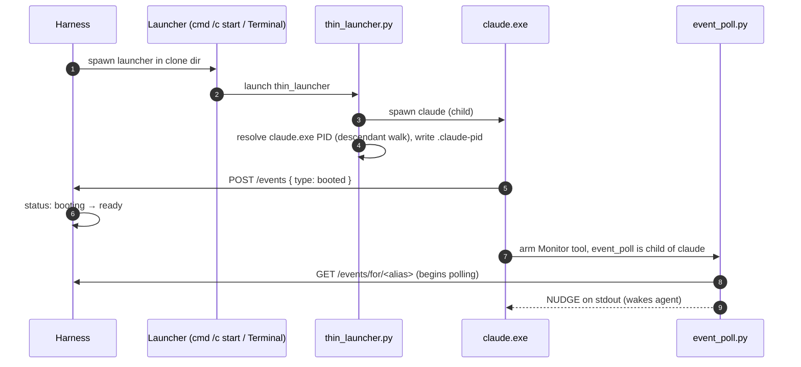
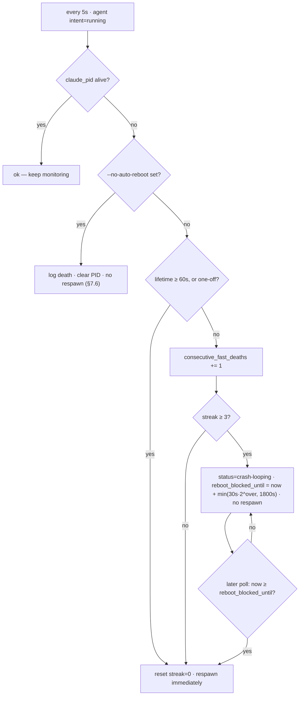
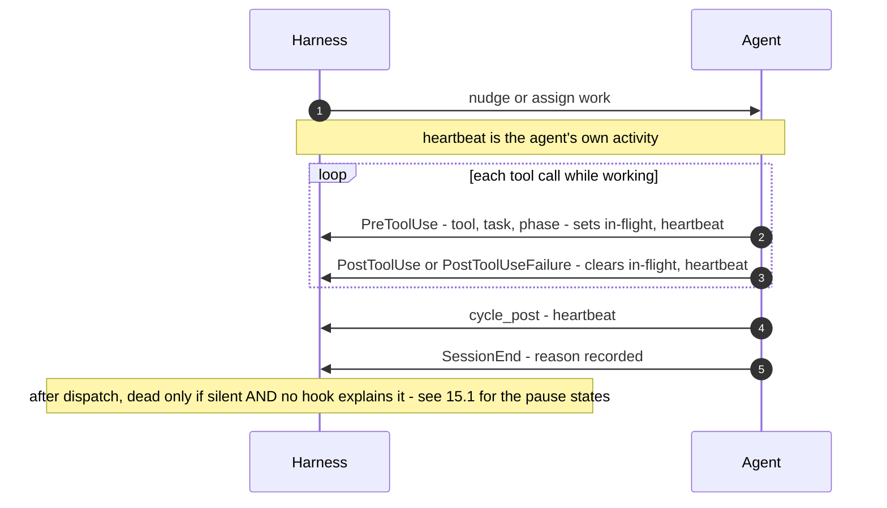

# Harness Architecture

> **Status**: §§1–14 describe the harness as it exists in code today (`references/scripts/harness.py`). §15 (agent liveness) and §16 (observability via hooks) are **partially shipped**: the three hook ingestion endpoints — `POST /hooks/session-end` (#12418), `POST /hooks/activity` (#12443), `POST /hooks/pause` (#12458) — are live and functional; `AgentState` persists their fields; `progress_liveness()` is implemented in shadow/observational mode (harness.py:407). What remains under **#12271** is promoting `progress_liveness()` to drive reboot decisions and operator display via **#12410**. The §14 `thin_launcher` cleanup is tracked by #12416.
>
> **Companion docs**: [`AGENT-RUNTIME.md`](AGENT-RUNTIME.md) (cycle integration, event-bus contract from the agent's side), [`ARCHITECTURE.md`](ARCHITECTURE.md) (overall system; harness appears in the system overview), [`INSTALLER-ARCH.md`](INSTALLER-ARCH.md) (how harness gets installed and started).

---

## 1. Goal & scope

This doc describes the **harness** — the single supervisor process that owns agent lifecycle and the event bus for one SquidSquad install.

In scope:

- What the harness is, how it runs, what it owns
- HTTP API surface (every endpoint, what it does)
- EventLifecycleManager (ELM) — the in-process event bus
- ExternalActivityDetector (EAD) — the forge → bus bridge
- Agent lifecycle: spawn, monitor, intent state machine, stop, restart
- Port discovery and clone-isolation
- State persistence (`.squidsquad/.harness-state.json`, `.squidsquad/.event-state.json`, `.squidsquad/.harness-port`)
- Restart safety
- Failure modes

Out of scope:

- How agents react to bus events (see [`AGENT-RUNTIME.md`](AGENT-RUNTIME.md) §5–§8)
- The cycle wrapper (pre → creative → post) — agent-side mechanism, see AGENT-RUNTIME §7 (loop mode) and §8 (event mode)
- Compose pipeline — see [`COMPOSE-ARCHITECTURE.md`](COMPOSE-ARCHITECTURE.md)
- How agents are installed onto disk — see [`INSTALLER-ARCH.md`](INSTALLER-ARCH.md)

---

## 2. What the harness is

The harness is **one process per SquidSquad install**, started by the operator via `start.sh` at the repo root (a thin shell wrapper that invokes `squidsquad_cli.py start` with the appropriate environment). `start_team.py` is a deprecated alias retained for compatibility. The installer's post-migration restart path ([INSTALLER-ARCH §10.3](INSTALLER-ARCH.md)) invokes `start.sh` when the harness is unreachable (port file missing or HTTP probe fails); running-and-reachable upgrades use the harness's per-agent lifecycle endpoints directly (see [INSTALLER-ARCH §10.3](INSTALLER-ARCH.md)). The harness runs in the foreground in a terminal window — there is no daemonization. Operator owns the lifetime; closing the terminal stops the harness.

**Lifecycle authority** sits with the harness's HTTP API: any localhost caller (operator CLIs, the installer during upgrade, automation) issues lifecycle changes by calling the harness API. The constraint is that *nothing else* spawns agents directly — start/stop/restart are exclusively the harness's domain via its API surface. The harness owns the implementation; the API is the only public surface.

Three properties define it:

1. **Singleton per install** — only one harness process per project directory. Verified via the `.squidsquad/.harness-port` file (see §6) and process listing.
2. **Stateful but recoverable** — persists to `.squidsquad/.harness-state.json` and `.squidsquad/.event-state.json`. On restart, reads both files, verifies live agent PIDs, and resumes monitoring without dropping intent.
3. **Localhost-only** — HTTP API binds to `127.0.0.1`; no authentication; no network exposure. Multi-host installs are not supported.

The harness is **distinct from**:

- **Agent processes** — the harness spawns the agent launcher chain (`thin_launcher.py → claude`); agents communicate over HTTP and live in their own clone directories. `event_poll.py` is **not** harness-spawned — the agent arms it via the Monitor tool, so it runs inside the agent's own process tree (see §7.2 step 6).
- **EAD** — EAD is a component *inside* the harness (an asyncio task), not a sibling process.
- **The forge (GitHub)** — the harness is a **read-only forge consumer**: it reads issue state via EAD and performs **no forge writes**. (The earlier §8.3 design had the harness rewriting the `role:<target_alias>` label on every `POST /work/assign`; that "universal router" design was never implemented and was superseded by the #12495 narrow primitive, which does no label write. `/work/assign` emits an `assigned-to` event only.) All tracker writes — status transitions, comments, and `role:*` label changes — go through agents (and PM) calling `gh` directly via `tracker.py`. `role:*` is set by PM at `planned → approved` and is otherwise stable; verification/delivery handoffs are routed by EAD off the **status** label (`_STATUS_ROUTING`: `pending-test → verifier`, `pending-ship → dm`), not by any `role:*` rewrite.

---

## 3. Process model

- **Runtime**: Python 3.12+, FastAPI + uvicorn for HTTP server, asyncio for event handling.
- **Threading**: predominantly single asyncio event loop. A small number of background tasks (`ack-cursor consumer`, `timeout_scan`, `health_poll`, `EAD poller`) run as asyncio coroutines on the same loop; no thread pool.
- **HTTP server**: uvicorn binds `127.0.0.1:<port>` (default `7373`; alternate port if occupied — see §6). FastAPI routes are coroutine handlers.
- **Subprocess spawning**: `boot_agent(role)` shells out to a platform-appropriate launcher (`cmd /c start` on Windows, `osascript`/Terminal.app on macOS, `tmux` on Linux) which runs `thin_launcher.py` per agent (see §14). `event_poll.py` is **not** spawned here — the agent arms it via its Monitor tool once running, so it lives inside the agent's own process tree (§7.2 step 6), not as a harness child. See `boot_remote.py` for platform details. *(The signature `boot_agent(role)` accepts an alias value — legacy parameter name; rename tracked in #10358 along with the wire-format change.)*
- **Shutdown**: Ctrl+C triggers graceful shutdown — sets all agent intents to `stopping`, waits up to 60s for cooperative exits, then exits. `POST /shutdown` accepts an HTTP shutdown request with same semantics.

---

## 4. HTTP API surface

All endpoints serve from `http://127.0.0.1:<port>`. Localhost-only; no authentication; clients are agents on the same host. JSON request/response throughout.

### 4.1 Lifecycle & status endpoints

| Method | Path | Purpose | Returns |
|---|---|---|---|
| GET | `/status` | Harness liveness + code version + intent summary | `{version, code_version, agents: [...], harness_state}` — `version` is the harness wire-protocol version (integer); `code_version` is the harness build identifier (git short-SHA or package version string) |
| GET | `/` | Root — alias for `/status` (legacy convenience) | Same as `/status` |
| GET | `/agents` | List all known agents + their current state | `[{role, alias, intent, status, pid, clone_path, boot_time, ...}]` |
| GET | `/agents/{role}` | Single agent state | `{role, alias, intent, status, pid, clone_path, boot_time, last_seen}` |
| GET | `/agents/{role}/health` | PID-based liveness probe for one agent | `{role, alias, alive, intent, status, pid, last_seen}` |
| GET | `/agents/{role}/config` | Per-agent install config (clone path, etc.) | `{clone_path, ...}` |
| POST | `/agents/{role}/start` | Set intent=running, spawn if not alive | `{ok, role, alias, action}` |
| POST | `/agents/{role}/stop` | Set intent=stopping; cooperative shutdown | `{ok, role, alias}` |
| POST | `/agents/{role}/restart` | Set intent=restarting; respawn after death | `{ok, role, alias}` |
| POST | `/agents/all/start` | Start all configured agents | `{ok, started: [...]}` |
| POST | `/agents/all/stop` | Stop all running agents | `{ok, stopped: [...]}` |
| POST | `/shutdown` | Graceful harness shutdown — returns `202 Accepted` immediately, then performs graceful shutdown (sets all agent intents to `stopping`, waits up to 60s for cooperative exits, then exits) | Body: `{ok: true, action: "shutdown-initiated"}` returned synchronously with the 202; harness process exits asynchronously after the response is sent |
| POST | `/restart` | Harness self-restart for supervised relaunch (#12825) — returns `202 Accepted` immediately, then exits with `HARNESS_RESTART_EXIT_CODE=42` (the supervised-relaunch sentinel, distinct from `/shutdown`'s exit 0) so the parent supervisor can relaunch. Refuses with 409 if teardown is already in progress or `--no-auto-reboot` is set. | `{status: "restarting", message: "..."}` |

> **Response-shape status:** the response shapes above are **aspirational** — they document the target shape that lands with **#10358** (the `role` → `alias` code rename). **Today's actual return shape**: `AgentState.to_dict()` returns a `role` field (whose value is the alias; no separate `alias` field), plus `claude_pid` and `terminal_pid` as separate fields (no shorthand `pid` field). Existing clients should treat the alias as the value of `role` and read `claude_pid` + `terminal_pid` separately until #10358 ships. The "target shape" framing also applies to §9 (Vocabulary note) — both sections describe the post-rename state. The shorthand `pid` field in the post-#10358 response is a **derived view** over the two-field state record in §7.5 — the state file always carries both `claude_pid` and `terminal_pid` separately (see §7.5 for the canonical shape and rationale). **Derivation rule:** `pid = claude_pid` (the agent process). `terminal_pid` remains available in `.harness-state.json` for diagnostics but is not exposed via the HTTP API.
>
> **Path-parameter vocabulary on lifecycle endpoints:** `{role}` on `POST /agents/{role}/start|stop|restart` and `GET /agents/{role}/*` accepts the **alias** value (same convention as event-bus endpoints §4.2). The naming predates the alias concept; the rename to `{alias}` is in #10358. There is no class-level lifecycle endpoint — every lifecycle call targets one specific alias.

### 4.2 Event bus endpoints

| Method | Path | Purpose | Returns |
|---|---|---|---|
| POST | `/events` | Emit an event (booted, ack-cursor, assigned-to, etc.) — see [AGENT-RUNTIME.md §5.2](AGENT-RUNTIME.md) for payload shapes per event type | `{ok, event_id}` or 4xx |
| GET | `/events` | List recent events (**debug-only**; not part of agent-facing contract) | `[event, ...]` |
| GET | `/events/for/{role}` | Read events past the role's cursor | `{events, total}`; when the cursor predates the retained window the body additionally carries `evicted: true, oldest_id, evicted_count_hint` (still **HTTP 200**, not 410) — see §5.1 |
| GET | `/events/cursor/{role}` | Current cursor position for a role | `{cursor, role}` (cursor may be `null` on first boot); **HTTP 200 always** (no 404 if cursor null) |
| GET | `/events/lifecycle` | Recent lifecycle events for TUI display | `[event, ...]` |

> **`GET /events/in-flight/{alias}` removed** — this endpoint was removed under the pull-only model (#11165). The `{role}` path parameter in `/events/for/{role}` and `/events/cursor/{role}` accepts the alias value (e.g. `skill`, `verifier`) — the naming predates the alias concept. Stale callers targeting the removed in-flight endpoint receive 404.

> **Path-parameter vocabulary** (per §9): the `{role}` path parameter on `/events/for/{role}` and `/events/cursor/{role}` accepts the **alias** value (e.g. `skill`, `verifier`), not the L2 categorical role. The parameter name `{role}` is historical (predates the alias concept); the value is always an alias. The rename to `{alias}` ships with [#10358](https://github.com/WallyDoodlez/SquidSquad/issues/10358).
>
> **Completion endpoint tombstone** (per AGENT-RUNTIME §5.1 principle #4): `POST /events/{event_id}/complete` was removed under the pull-only model (#11165) and is **retained as a 410 Gone tombstone** (harness.py:3412–3429) so that stale callers fail loudly rather than silently. The architectural principle still holds: the bus uses events, not RPC, for state transitions; cursor advance (`ack-cursor`) is the only completion signal. Any design that proposes a functioning completion endpoint is rejected at architecture review.

### 4.3 Work-assignment endpoint

> **IMPLEMENTED (#12495, 2026-06-21)** as the **manual wake-injection primitive** — NOT the universal router the earlier §8.3 prose described. Operator decision (2026-06-19): build the explicit same-status wake primitive (option a) rather than retire the endpoint. The route emits an `assigned-to` wake to a target alias **without** a status transition and **without** rewriting the `role:*` label. It is the sanctioned BACKUP / babysitting path (PM waking a stuck-but-alive agent; an agent escalating a process concern to PM) for when the primary wake paths — self-wake (#12506), never-stop (#12853), and the ExternalActivityDetector (§6) emitting `assigned-to` off forge-state — don't fire. Transition-driven routing is **not** rewired through this endpoint: it remains EAD-based (see [AGENT-RUNTIME.md §8.3](AGENT-RUNTIME.md)).

| Method | Path | Purpose | Returns |
|---|---|---|---|
| POST | `/work/assign` | Manual same-status wake-injection to a target agent (no transition) | `{status:"ok", event_id}` on 200, 404 if alias unknown, 400 on malformed body / missing `target_alias` / self-assign |

Request body: `{target_alias: str, issue_number?: int, event_context?: str, payload?: object}` (only `target_alias` is required for a bare wake; `event_context` defaults to `"work-assign"`). The caller's alias is supplied via the `X-Squidsquad-Alias` request header for the self-assign invariant. The harness performs exactly two checks: (1) `target_alias` resolves to a registered agent (alias-existence only, no role-class permission filtering — see §13.5; 404 otherwise), and (2) `target_alias != X-Squidsquad-Alias` (structural self-assign anti-loop; 400 otherwise). It then emits an `assigned-to` event on the bus — **no `role:*` label write** (a manual re-nudge targets work the agent already owns). Malformed JSON or a missing `target_alias` returns 400.

### 4.4 Work-queue endpoint

| Method | Path | Purpose | Returns |
|---|---|---|---|
| GET | `/queue/{alias}` | Lists issues currently flagged as actionable for the given alias (forge query, priority-then-age sort) | `{count, items: [{number, title, summary, priority, ...}]}` |

The endpoint wraps the deterministic work-queue logic in `tracker.py work-queue` so TUIs / web UIs can poll over HTTP without spawning a subprocess per refresh. `{alias}` is the install-time agent name; for the human, the alias is `human` (filter is `status:pending-human-*`); for other aliases, the filter is the same one `tracker.py work-queue` produces (priority-sorted approved + in-progress items for that alias).

> **Scope:** `/queue/{alias}` is a **UI-facing convenience endpoint** for TUIs / web UIs / human dashboards — it is NOT part of the agent runtime contract. Agents receive work via the event bus (`assigned-to` events emitted by EAD per [AGENT-RUNTIME.md §5.4](AGENT-RUNTIME.md) and `POST /work/assign` per [AGENT-RUNTIME.md §8.3](AGENT-RUNTIME.md)), not by polling this endpoint. AGENT-RUNTIME deliberately omits this endpoint because agents do not consume it.
>
> **Current implementation gap:** the harness today exposes only `/human/queue` (special-cased to human). The generic `/queue/{alias}` shape above is the principled form; the migration is tracked in §13.6.

### 4.5 PR merge endpoint

| Method | Path | Purpose | Returns |
|---|---|---|---|
| POST | `/merge` | Async PR merge with compose-drift detection and agent reboot (#6126, harness.py:3953) | `202 Accepted` |

Request body: `{pr_number: int, branch: str, role: str}`. The harness merges the PR asynchronously, then runs compose-drift detection and emits `pr-merged` and `compose-completed` events; affected agents are rebooted via `_reboot_affected_agents`.

### 4.6 Hook ingestion endpoints

| Method | Path | harness.py | Purpose |
|---|---|---|---|
| POST | `/hooks/session-end` | 2777 | Receives `SessionEnd` hook payloads from agents; persists `last_session_end` on `AgentState` |
| POST | `/hooks/activity` | 2847 | Receives `PreToolUse`/`PostToolUse` hook payloads; persists `last_activity_at` on `AgentState` |
| POST | `/hooks/pause` | 2944 | Receives pause-guard payloads (e.g. rate-limit, permission wait); persists `in_flight_until` / `waiting_since` / `compacting_since` on `AgentState` |

**Header contract**: every hook POST must include `X-Agent-Role: <alias>` identifying the sending agent. The harness uses this header to route the payload to the correct `AgentState` entry.

**Fail-open**: all three endpoints always return HTTP 200 regardless of parse errors or unknown alias values — a hook failure must never block the agent's tool calls (per §15.5 constraint 1).

**Consumer**: the populated `AgentState` liveness fields feed `progress_liveness()` (harness.py:407), which is currently in shadow/observational mode. See §15 for the full liveness model; §1 status banner for what is shipped vs. what remains under #12271.

---

## 5. EventLifecycleManager (ELM)

ELM owns the event bus. Located at `references/scripts/harness.py` (`class EventLifecycleManager`, ~line 641). Three pieces of state:

| Piece | Type | Persisted | Purpose |
|---|---|---|---|
| `_deque` | `collections.deque(maxlen=1000)` | No (in-memory only) | Event store, FIFO with bounded retention |
| `_cursors` | `dict[alias, event_id]` | Yes (`.squidsquad/.event-state.json`) | Per-alias progress through the deque |

> **`_in_flight` dict removed** — in-flight dispatch tracking was eliminated by #11165 (pull-only model). The `_in_flight` dict no longer exists in `EventLifecycleManager`. Note: `AgentState.in_flight_until` (harness.py:249) is an unrelated concept — it is the **pause-guard** field populated by `POST /hooks/pause` (#12458) to suppress health-poll respawn while an agent is mid-tool-call or rate-limited. These two fields share a name fragment but are entirely distinct; only the ELM `_in_flight` dict was removed.

### 5.1 Event store (deque)

- `collections.deque(maxlen=1000)` — in-memory, capped at 1000 events.
- Eviction is automatic when a new event pushes past 1000: oldest dropped.
- **Restart drops history**: the deque is in-memory only. On harness restart, the deque is empty. Cursors persist (see §5.2), but events older than the new harness session are not recoverable from disk.
- **Cursor-evicted recovery**: an agent whose cursor predates the oldest retained event gets a normal **`HTTP 200`** response on `GET /events/for/{role}?since=<old_cursor>` whose body carries an eviction marker — `{"events": [...], "total": <int>, "evicted": true, "oldest_id": "<event_id>", "evicted_count_hint": <int>}` (`harness.py` `get_since_with_eviction` → `get_events_for_role`). Recovery protocol: agent reads forge for current state, emits `ack-cursor(oldest_id)` to fast-forward past the evicted range, re-enters idle. The marker is set **only when the deque is non-empty**, so `oldest_id` is always a real anchor; the empty-deque + stale-cursor case returns `([], None)` (no marker — #12837) and the agent re-anchors normally with no events lost. (Note: 410 Gone is used elsewhere as a deliberate *tombstone* for the removed `POST /events/{event_id}/complete` endpoint — that is unrelated to eviction recovery.)

### 5.2 Cursor model

- Per-alias, owned by harness (was per-agent in `.squidsquad/<alias>/working-state.md` pre-#9873-A; migrated to harness).
- `null` on first boot → agent reads from the head of the deque.
- Advances via `ack-cursor` consumed by the ack consumer task (asyncio).
- Cursor-regression attempts are rejected (CONTEXT-9873-A D15).
- `GET /events/cursor/{role}` returns `{cursor: <event_id> | null, role}`, HTTP 200 always.
- Persisted to `.squidsquad/.event-state.json`; harness reads on boot to resume.

### 5.3 Event IDs

```
event_id = sha256(timestamp + alias + event_type + payload + nonce)[:16]
```

16-character hex (64-bit, per #9415). Content hash with per-emit nonce; same event emitted twice produces distinct IDs.

### 5.4 At-least-once delivery

- Cursor advances only after a successful `ack-cursor`.
- Agent crashes mid-cycle → cursor stays → same events re-delivered next cycle.
- The deque is the only source of truth for retention; if eviction happens before ack, the event is lost (covered by §5.1 recovery).

### 5.5 Background tasks (asyncio)

| Task | Cadence | Purpose |
|---|---|---|
| `ack-cursor consumer` | on-demand (drains asyncio.Queue) | Awaits on an `asyncio.Queue` that receives cursor-advance notifications extracted from `ack-cursor` events submitted via `POST /events` — the handler decodes the event, pushes the advance, and returns; the consumer drains the queue independently. Drains the ack-cursor queue, advances cursors, persists cursor positions to `.squidsquad/.event-state.json` (the deque itself remains in-memory only, per §5.1) |
| `health_poll` | every 5s | Checks each agent's `claude` PID only (resolution order: in-memory `claude_pid` → `.claude-pid` file → `health_check.py`, per §7.3). **`claude` death + `intent=running` → respawn** (re-runs `boot_agent` per §7.2). The harness does **not** track `event_poll` — it runs inside the agent's process tree (§7.2 step 6), so its death surfaces indirectly: Monitor exits → the agent ends its session → `claude` PID death → respawn. Liveness probed via `OpenProcess` on Windows, `kill -0` on POSIX. |
| `EAD poller` | adaptive (10s active / 30s idle, 60s ceiling) | Polls forge for state changes; see §6 |

> **`timeout_scan` removed** — the background task that re-delivered in-flight events past their TTL was removed by #11165 (pull-only model). In-flight dispatch tracking no longer exists in ELM; there are no in-flight events to time out.

---

## 6. ExternalActivityDetector (EAD)

EAD is the bridge from forge state → event bus. It runs as an asyncio task inside the harness (not a separate process).

### 6.1 What it does

1. Polls GitHub via REST API: `gh api repos/<owner>/<repo>/issues?since=<last_seen_iso>&state=all&per_page=100`.
2. Diffs against last-seen timestamp on disk (`.squidsquad/.event-state.json` `ead_last_seen` field).
3. Translates eligible state changes into `assigned-to` events (per the routing map in AGENT-RUNTIME §8.3).
4. Emits one `assigned-to` per (forge change, target_alias) pair into the deque.
5. Persists the new last-seen timestamp.

### 6.2 Polling cadence (adaptive backoff)

```
default state: active (10s between polls)

  last_poll_found_changes? → stay at 10s
  3 consecutive empty polls at 10s? → step up to 30s
  3 more consecutive empty polls at 30s? → step up to 60s (ceiling)
  changes return after any backoff? → reset to 10s
  hard ceiling: 60s
```

**Two distinct floors** (reconciled with [AGENT-RUNTIME §5.4](AGENT-RUNTIME.md)):

- **Contractual hard floor: 5s** — GitHub REST rate-limit safety guard. EAD MUST NEVER poll faster than 5s regardless of which heuristic is active. This is the absolute floor enforced at the implementation level and is what AGENT-RUNTIME §5.4 + §10 Q3 lock as the rate-limit-safety floor.
- **Active-cadence effective floor: 10s** — the default active interval and the current backoff algorithm's minimum (no heuristic today drives below 10s). A future burst-on-event refinement could legitimately push between 10s and the 5s contractual floor.

The two are different things called "floor": the 5s value is the rate-limit safety guard (a runtime invariant); the 10s value is today's backoff-algorithm minimum (an implementation detail of the current heuristic).

Three-stage cadence: 10s → 30s → 60s (two backoff transitions). A drained queue stabilizes at 60s after ≥6 consecutive empty polls (~2 minutes idle).

### 6.3 Restart safety

- **Lost last-seen-id**: on missing/corrupt last-seen file, EAD defaults to `now - 5 minutes`. Bounded dup-emit window; agents dedup via care-filter on `(issue_number, target_alias, event_context)` tuple.
- **EAD crash**: harness logs the exception and restarts the asyncio task. While EAD is down, forge state changes do not reach the bus; agents continue consuming whatever's already in the deque. **Mechanism:** the EAD poller runs inside a `try/except` loop that catches all exceptions, logs them, and re-enters the polling loop after a 5-second backoff. No separate supervisor coroutine is used.

---

## 7. Agent lifecycle management

The harness owns agent lifecycle. Agents do not start, stop, or restart themselves: they may *halt* cooperatively (signalling context-pressure via exit-42, or honoring a `stopping`/`restarting`/deploy intent), but the harness performs the actual process termination — an LLM agent cannot self-`/quit` (#13077). See §7.4.

### 7.1 Intent state machine

Per-agent, persisted in `.squidsquad/.harness-state.json`:

| Intent | Meaning | Auto-respawn on death? |
|---|---|---|
| `running` | agent should be alive | yes |
| `stopping` | graceful stop requested; cycle ends → exit | no |
| `restarting` | graceful restart requested; cycle ends → exit → respawn | yes (one cycle) |
| `stopped` | agent died as requested | no |
| `deploying` | deploy-in-progress: harness is running ensure-main → pull → recompose → commit → push for this agent's clone before respawning | yes (after deploy completes) |

Transitions are HTTP-API-driven (`POST /agents/{role}/start|stop|restart`). The harness writes the new intent immediately and the health poller observes process state to drive auto-respawn vs no-respawn decisions.

**Deploy flow** (entered when the harness receives a `deploy-halted` ack-stop from an agent): the harness sets `intent=deploying` before the agent halts (so that PID death is not misread as a crash). Once the agent halts (it emits `ack-stop(deploy-halted)` and ceases output — it cannot self-`/quit`, §7.4 / #13077), the harness runs the deploy sequence for that clone: ensure-main → `git pull origin main` → `compose.py deploy [alias]` → `git commit` → `git push` → **advance the agent's cursor past the deploy-signal event** → **force-kill the halted process (confirming death)** → respawn the agent. The cursor-advance is essential: the agent halts *without* acking the deploy-signal (AGENT-RUNTIME §8.1), so the harness — which owns the cursor (§5.1) — acks it here on the agent's behalf; otherwise the respawned agent's initial drain would re-fetch the same deploy-signal and re-halt in an infinite deploy loop. `reboot_blocked_until` (§7.3) is set at `deploy-halted` receipt and cleared on respawn, suppressing health-poll-triggered premature respawn during the git/compose operations. See §7.3 for the `reboot_blocked_until` detail and §11 for harness-git failure modes.

> The "Auto-respawn on death?" column describes **default** operation. The `--no-auto-reboot` escape hatch (§7.6) suppresses respawn — and the restart-driven teardown paths — entirely; when it is set, no row in this table auto-respawns. Deploy-flow respawn (intent=`deploying`) is also suppressed under `--no-auto-reboot`.

### 7.1.1 Status state machine

`status` reflects what the agent is actually doing, driven by health-poller observations and lifecycle events. Valid values:

| Status | Meaning |
|---|---|
| `booting` | Spawn initiated; harness awaiting `booted` event from agent |
| `ready` | Agent running and has emitted `booted`; health poller confirms PID alive |
| `stopping` | Stop in progress; harness waiting for cooperative exit or force-kill window |
| `stopped` | Agent exited as intended (intent was `stopping`) |
| `crashed` | Agent died unexpectedly (intent was `running` or `booting`) |
| `crash-looping` | ≥3 consecutive fast deaths (each <60s lifetime) detected; respawn is paused under exponential backoff (§7.3, #12293). Not terminal — resumes automatically when the backoff window elapses. |

Normal lifecycle: `booting → ready → stopping → stopped`

Crash transitions: `booting → crashed` (boot failure — `booted` event never arrives within timeout), `ready → crashed` (runtime failure — PID dies with intent still `running`)

> Full transition treatment (including recovery paths and re-spawn triggers) lives in [AGENT-RUNTIME.md §8.2](AGENT-RUNTIME.md). This section is the harness-side view.

### 7.2 Spawn (`boot_agent`)

This is the **canonical step-by-step ordering** for the agent boot sequence. All other docs defer here for process-spawn ordering.

1. Resolve clone path for the alias from in-memory `AgentState` (loaded from `.squidsquad/.harness-state.json` at harness start; on first boot, populated from `.squidsquad/.local-config` per §7.2 "First-boot discovery" below).
2. Spawn the platform-appropriate launcher (`cmd /c start` self-closing console on Windows per #11745 / Terminal.app via `osascript` on macOS / `tmux new-session` on Linux) running `python thin_launcher.py <alias>` in the agent's clone dir (see §14).
3. `thin_launcher.py` spawns `claude` (Anthropic CLI) as a child, then resolves the **actual `claude.exe` PID** — a descendant walk through the npm `cmd` shim on Windows (#10101; no-op on POSIX, where `claude` is a direct child) — and writes that resolved PID to `.squidsquad/<alias>/.claude-pid`. That file is both the singleton handle ("this alias is already running") and the value `health_poll` reads as `claude_pid`. Recording the shim/wrapper PID instead would be wrong — it exits within seconds (thin_launcher.py:570-584).
4. The harness awaits the `booted` event from the agent (cursor-clean handshake). Until `booted` arrives, the agent is in `status=booting`; any `assigned-to` events queued for this alias remain in the harness deque and are delivered only after `status=ready`.
5. On `booted` receipt, agent transitions `status=booting → ready`. Routed work (`POST /work/assign`) is now deliverable. The harness then updates `.squidsquad/.harness-state.json` with the new PID + boot time.
6. **The agent arms its own event listener.** Once running (typically right after the `booted` handshake, as it enters steady state), the **agent itself** arms the Claude Code **Monitor tool** on `python references/scripts/event_poll.py <alias> --wait 5 --target` (per AGENT-RUNTIME §8.0 and the `event-mode-contract` sub-skill). `event_poll` therefore runs **inside the agent's own process tree** — a child of the `claude` session via the Monitor tool — **not** as a harness sibling. It polls the harness HTTP API (`GET /events/for/<alias>`, which returns empty until `status=ready`) and writes a bare `NUDGE` line to stdout whenever events arrive past the agent's cursor; Monitor streams that line back into the session to wake the agent. **The harness neither spawns nor tracks `event_poll`**: there is no `event_poll` `subprocess.Popen` anywhere in `harness.py`, and `AgentState` carries no `event_poll_pid`. Its lifecycle is therefore implicit — `event_poll` lives and dies with the `claude` session, and if the Monitor tool exits for any reason the agent ends its session immediately (the *"Monitor exit ⇒ exit session"* rule, AGENT-RUNTIME §8.0). The harness sees only the resulting `claude` PID death and respawns the agent per §7.3; the fresh agent re-arms its own Monitor. (`event_poll` discovers the harness port via the `.squidsquad/.harness-port` file, which the harness writes/flushes before spawning any agent.)



#### First-boot discovery

**First-boot discovery**: when `.squidsquad/.harness-state.json` does not exist (harness has never run on this install, or the file was deleted), the harness reads `.squidsquad/.local-config` to discover the alias list and per-alias clone paths. This populates the initial in-memory `AgentState`, which is persisted to `.harness-state.json` on the first state save. `.local-config` is installer-scaffolded (INSTALLER-ARCH §3.2) and is the install-time source-of-truth for clone-path mappings; once `.harness-state.json` exists, it becomes the operational source-of-truth and the harness consults it directly thereafter.

### 7.3 Health poll

Every 5 seconds, for each agent with intent=`running`:

1. Read `claude_pid` (and `terminal_pid` for diagnostics) from in-memory `AgentState` — loaded at boot from `.harness-state.json`'s per-alias record (§7.5). This in-memory value is the **primary** liveness source. If it is absent or its process is no longer alive, health-poll **falls back** to the on-disk `.squidsquad/<alias>/.claude-pid` file — the singleton handle written by `thin_launcher` (contents = the resolved `claude.exe` PID, per §9 / §7.2 step 3) — and adopts that PID; a final legacy fallback is `health_check.py`. The resolution order in `update_health` is: in-memory `claude_pid` → `.claude-pid` file → `health_check.py`.
2. Check process liveness of `claude_pid` — `OpenProcess` on Windows, `kill -0` on Linux/macOS (POSIX). The §5.5 "per-agent `claude` PID" check refers to this in-memory `claude_pid` value (primary), with the `.claude-pid` file as the step-1 fallback source.
3. If dead AND intent=`running`: re-spawn (auto-respawn) — **with crash-loop backoff** (§13.8). The harness records `last_spawn_at` per agent. A death whose lifetime was ≥ `FAST_DEATH_WINDOW_SECONDS` (60s), or any one-off death, respawns immediately and resets `consecutive_fast_deaths` to 0. A death with lifetime < 60s increments `consecutive_fast_deaths`; once it reaches `FAST_DEATH_THRESHOLD` (3), respawn is held off for `min(30s · 2^over, 1800s)` (exponential, 30-minute cap; `over = count − 3`), `status` flips to `crash-looping`, and `reboot_blocked_until` records the resume time. A later poll past that time clears the block and respawns; an agent that survives the window resets the streak. (Entire respawn path — including this backoff — is suppressed under the `--no-auto-reboot` hatch, §7.6.)

   **Deploy-halt branch**: when the harness receives an `ack-stop(result=deploy-halted)` from an agent, it sets `reboot_blocked_until` to a time well beyond the expected git/compose window (e.g., `now + 300s`, overridden on completion) and transitions `intent` to `deploying`. This suppresses the normal health-poll auto-respawn during the pull → compose → commit → push sequence. On completion (or on failure with defined recovery — §11), `reboot_blocked_until` is cleared and the agent is respawned under the normal path.
4. If dead AND intent=`stopping` or `restarting`: handle per intent.



> **PID-source disambiguation** (recap): three distinct PID locations exist today — (a) `.squidsquad/<alias>/.claude-pid` on disk = the resolved `claude.exe` PID (thin_launcher's descendant walk #10101), written by `thin_launcher`, used by its own singleton check and as health-poll's fallback `claude_pid` source; (b) `.harness-state.json` → per-alias `claude_pid` = the same resolved `claude.exe` PID (the in-memory primary); (c) `.harness-state.json` → per-alias `terminal_pid` = the launcher/wrapper process PID, kept for diagnostics only. Health-poll checks (b), falling back to (a), for `claude` liveness — death triggers respawn. There is **no** harness-held `event_poll` PID: `event_poll` runs inside the agent's process tree (§7.2 step 6), so the harness never spawns or tracks it; its death surfaces only as `claude` PID death (Monitor exit → session end). If the §14 `thin_launcher` cleanup lands (#12416), (a) goes away — the harness owns `claude_pid` resolution directly.
>
> **On Linux/macOS (bash):** the wrapper-vs-`claude` PID distinction above is Windows-specific — it exists because the npm `claude.CMD` shim spawns `cmd.exe → claude.exe`, so the launched PID (the wrapper) is not the `claude` PID, forcing the descendant-walk resolution (§14). On POSIX, `thin_launcher` (under bash) launches `claude` directly (`shutil.which("claude")` returns the real binary, no shim), so the launched PID **is** the `claude` PID — no wrapper, no descendant walk. There `claude_pid` (b), `terminal_pid` (c), and the on-disk `.claude-pid` (a) all coincide. The liveness check is the same `kill -0` on that one PID. (`event_poll` is agent-armed on both platforms — §7.2 step 6 — so it never appears in this PID set.)

### 7.4 Cooperative exit (exit-42)

When `cycle_post.py` detects context-pressure exceeded OR harness intent has flipped to `stopping`/`restarting`, it commits/pushes and exits with code 42 — the cooperative-termination **signal**. The agent's `claude` session does **not** self-terminate in response: an LLM agent cannot self-`/quit` (#13077), so it only *halts* (ceases output) and the harness performs the actual process kill (the 60s force-kill below). The harness then routes by intent:

- intent=`running` + exit 42: respawn (context pressure cleared by fresh session).
- intent=`stopping` + exit 42: mark stopped; no respawn.
- intent=`restarting` + exit 42: respawn.
- intent=`deploying` + exit 42 (or any death after `deploy-halted` ack-stop): do NOT auto-respawn yet; harness proceeds with the deploy sequence (ensure-main → pull → recompose → commit → push) and respawns the agent only after the deploy completes successfully (or applies the defined recovery if it fails — §11). The `deploy-halted` ack-stop is the signal that triggers this path, distinct from both context-pressure exit-42 and the `stopping`/`restarting` cooperative exits.

**Three distinct cooperative exit variants**:
1. **Context-pressure exit**: `cycle_post.py` detects high context usage; checkpoints and exits 42 (the signal). The `claude` session halts but does not self-exit; the harness's 60s force-kill terminates it, then respawns a fresh session.
2. **Stop/restart exit**: harness intent flipped to `stopping` or `restarting`; the agent drains current work, emits `ack-stop`, and halts. The harness's 60s force-kill terminates the process (the agent cannot self-`/quit`).
3. **Deploy-halt exit**: agent received a `deploy-signal` event (§7.6 / AGENT-RUNTIME §5.2 / §8.1), finished its current atomic unit, emitted `ack-stop(result=deploy-halted)`, and halted (ceased emitting output). The harness runs the deploy sequence, then **actively force-kills the halted process** and confirms its death before respawning. This exit is agent-*cooperative* only in that the agent halts and acks — the actual process termination is **harness-driven** (the agent neither recomposes nor exits itself).

**Force-kill is the actual termination mechanism, not a rare backstop (#13077).** An LLM agent **cannot execute `/quit`** — on any cooperative exit it can only *halt* (stop emitting output); its OS process keeps running until the harness kills it (operator-locked, 2026-06-21: "the agent cannot kill itself … so the harness has to act"). The earlier model that *waited* for a self-`/quit` never completed, because that exit never comes. Two harness-driven kill paths exist:

- **`stopping` / `restarting`** — the **60-second force-kill** (`FORCE_KILL_TIMEOUT_SECONDS = 60`) fires once the cooperative window elapses (intent set time + 60s). Because the agent never self-exits, this net is the de-facto termination path for these intents today — functional, just slower than an immediate kill. (Accelerating it to an active kill like the deploy path is a separate decision, **not** taken in #13077.) Under the `--no-auto-reboot` hatch it is skipped for intent=`restarting` (a kill with no respawn is pure harm) and preserved for intent=`stopping` (see §7.6).
- **`deploying` (deploy-halt)** — the 60s net does **not** cover this path: a deploy-halted agent sits at `status="deploying"`, outside the net's `stopping`/`restarting` trigger. So `_respawn_agent_process` **actively force-kills** the halted process (a tree-kill that reaps the Monitor-spawned `event_poll` sidecar too — #12363) immediately after the deploy commit/push, confirms death, then boots the replacement against the freshly-committed `CLAUDE.md`. `_DEPLOY_RESPAWN_PID_WAIT_S` bounds only the post-kill OS-reap confirm (a force-kill is near-instant); a process still alive after it means the force-kill itself failed (un-killable / permission) → abort honest with `status=error` and surface a deploy-error rather than no-op the respawn and strand the agent on the stale pre-recompose `CLAUDE.md`.

**`event_poll` across claude respawn**: `event_poll` runs inside the `claude` process tree (armed by the agent's Monitor tool, §7.2 step 6), so it does **not** survive a claude respawn — when the `claude` process exits, its `event_poll` child goes with it, and the fresh `claude` arms a **new** Monitor → new `event_poll`. Nothing is lost: cursor state is harness-side and unaffected by claude respawn, and the new claude's boot drain (AGENT-RUNTIME §8.0 / §8.2) catches up to the cursor before re-entering the wake loop. (Caveat: a harness **force-kill** that is not a tree-kill — `taskkill /F` without `/T`, the current path — kills `claude.exe` but leaves its `event_poll` descendant orphaned; that is the #12363 mechanism, fixed independently by adding tree-kill.)

### 7.5 State file: `.harness-state.json`

One file per install (at the install root). Persisted across harness restarts. Shape:

```json
{
  "harness_pid": 12345,
  "start_time": 1748371200.0,
  "port": 7373,
  "last_compose_checksum": "sha256:9f4c…",
  "agents": {
    "<alias>": {
      "intent": "running",
      "intent_set_at": "2026-05-25T18:30:00Z",
      "status": "ready",
      "boot_time": "2026-05-25T18:00:00Z",
      "clone_path": "D:/Dev/Dev/SquidSquad-2",
      "claude_pid": 23456,
      "terminal_pid": 34567,
      "bootup_complete": true,
      "last_spawn_at": 1748371260.0,
      "consecutive_fast_deaths": 0,
      "reboot_blocked_until": null
    }
  }
}
```

**`last_compose_checksum`** (top-level, install-scoped) — sha256 hex of the compose source tree (`.squidsquad/config.md` + `.squidsquad/project/*.md` + `references/sub-skills/` + `references/roles/` + `references/sub-skills/manifest.md`) at the last successful pull-first `compose.py deploy-all` run. On harness boot the freshness check recomputes the current checksum and compares it against this field. If they differ or the field is absent, the harness does **not** recompose locally; instead, it emits a deploy signal to each affected agent so that the pull-first deploy path (§7.6) handles the recompose from current source. See [COMPOSE-ARCHITECTURE §8.1](COMPOSE-ARCHITECTURE.md) for the three-layer harness-owned freshness model. **Invariant**: a committed `CLAUDE.md` on `main` is always the product of a pull-first deploy; the harness never produces a composed output from a potentially-stale local source tree.

**Two distinct fields per agent** (per [AGENT-RUNTIME.md §8.2](AGENT-RUNTIME.md)):

- **`intent`** — what the operator wants. Values: `running` | `stopping` | `restarting` | `stopped`. Transitions are HTTP-API-driven (per §7.1); the harness writes the new intent immediately on `POST /agents/{role}/{start|stop|restart}`.
- **`status`** — what the agent is actually doing. Values: `booting` | `ready` | `stopping` | `stopped` | `crashed` | `crash-looping`. Driven by the health poller's observations of process state and by lifecycle events emitted from the agent (`booted`, `ack-stop`). Moves independently of intent. Transitions enumerated in §7.1.1.

Two fields, not one, so recovery semantics are explicit: after a host reboot the harness reads this file, sees `intent=running` but no live PID → respawn. If `intent` and `status` were collapsed, the harness couldn't distinguish "operator stopped this" from "this crashed". Full state machine documented in [AGENT-RUNTIME.md §8.2](AGENT-RUNTIME.md).

**PID fields**: the state file carries two per-alias PID fields — `claude_pid` and `terminal_pid`. `claude_pid` is the agent process and is what `health_poll` uses for liveness checks (respawn on death). `terminal_pid` is the wrapper process, kept for diagnostics only. There is **no `event_poll_pid`**: `event_poll.py` is armed by the agent's Monitor tool and lives in the agent's process tree (§7.2 step 6), so the harness never holds a handle to it. The API response's post-#10358 single `pid` field (see §4.1) is a derived view: `pid = claude_pid`; `terminal_pid` remains in the state file for diagnostics but is not exposed via HTTP.

Atomic writes (`.tmp` + `mv`). On harness restart, the file is read; each agent is checked for liveness (PIDs still alive?); intents are preserved. Note: the outer agent key is the **alias** (e.g. `skill`, `verifier`); each agent's *categorical* role-class is not currently persisted in this file — it's derived from `.squidsquad/config.md` at boot. Source of truth: `HarnessState.save_state()` in `references/scripts/harness.py`.

### 7.6 Auto-respawn escape hatches

Two operator-facing flags (each with a matching env var) gate the auto-spawn / auto-respawn paths for diagnosis and incident control. Both are **off by default** — normal operation is exactly as §§7.1–7.4 describe.

| Flag / env var | Effect when set |
|---|---|
| `--no-auto-start` / `SQUIDSQUAD_HARNESS_NO_AUTO_START=1` (#9242) | The boot-time "spawn all configured agents" pass is skipped. The harness comes up and serves HTTP but spawns nothing; operators start agents manually via `POST /agents/{alias}/start`. Isolates the auto-start path from HTTP wedges during diagnosis. |
| `--no-auto-reboot` / `SQUIDSQUAD_HARNESS_NO_AUTO_REBOOT=1` (#10538) | The harness **observes** agent death and updates state honestly (PID cleared, `bootup_complete` reset) but does **not** respawn — "no ability at all for the harness to reboot". |

**`--no-auto-reboot` is teardown-complete, not respawn-only.** Suppressing respawn alone would still let a restart *request* tear an agent down (intent=`restarting` → the §7.4 60s force-kill) and then leave it dead — silent death, strictly worse than churn. So under `--no-auto-reboot` the harness suppresses **all four** teardown/respawn paths, so a running agent is never disrupted:

1. **Health-poll respawn (§7.3)** — death is logged, not respawned (the original #10538 behavior).
2. **Restart endpoint** — `POST /agents/{alias}/restart` is **refused** (returns `success:false`, agent left running); operators use explicit `/stop` then `/start` for a real cycle.
3. **Deploy-signal emit** — `_reboot_affected_agents` (the deploy-signal emitter — see below) is **skipped**.
4. **Force-kill safety net (§7.4)** — skipped for intent=`restarting` (a kill with no respawn is pure harm). **Preserved for intent=`stopping`** — an explicit operator stop legitimately wants the process dead even with reboots off.

This is the shipped behavior (ref 162aa29a2). It is an incident/diagnostic control, not steady-state; normal runs leave both hatches off and §§7.1–7.4 apply unmodified.

**`_reboot_affected_agents` is the deploy-signal emitter.** In normal operation (no `--no-auto-reboot`), when the harness detects that compose-source files have changed (via the `last_compose_checksum` drift check at boot — §7.5, or via L4-write trigger from COMPOSE-ARCHITECTURE §8.1), it calls `_reboot_affected_agents`. Under the new architecture, this function does **not** recompose locally and restart directly. Instead it emits a **deploy signal** (`assigned-to` event with `event_context="deploy-signal"` and `event_type="deploy-signal"`) to each affected agent's alias. The agent receives the deploy signal via its normal event bus, finishes its current atomic unit, emits `ack-stop(result=deploy-halted)`, and halts — whereupon the harness runs the full pull-first deploy sequence (§7.1 deploy flow / §7.4 deploy-halt exit). Each affected clone is deployed sequentially (deploy A → pull/compose/commit/push/restart A → then B …) to avoid push races on the shared `main` ref. The `last_compose_checksum` is updated after each successful per-clone push.

---

## 8. Port discovery (clone isolation)

Each agent typically runs in its own git clone of the repo (clone-isolation architecture). The harness writes its port to `.squidsquad/.harness-port` (one per repo root) at startup, and distributes the file to all configured agent clone dirs.

Agent-side resolution (from `cycle_pre.py` `_discover_harness_port`):

1. Read `.squidsquad/.harness-port` in the current repo root.
2. If absent, walk up parent dirs (max 5 levels) and check each.
3. If still absent OR unreadable OR empty OR not an integer: default to `7373` (the harness default).
4. HTTP-probe the resolved port (`curl -sf --max-time 5 http://127.0.0.1:<port>/status`).
5. If probe fails: harness is unreachable; agents silently no-op event-bus operations and fall through to loop-mode behavior per AGENT-RUNTIME §7 + §9.4.

Port-file content: a single integer line, no decoration.

When the port file is missing, the harness is treated as not running. Event-bus operations no-op silently; cycle wrapper continues (loop-mode fallback).

---

## 9. State files (summary)

Per-agent directories under `.squidsquad/` are keyed by **alias**, not by the L2 categorical role-class (which can have multiple aliases per install — e.g. the `worker` role-class aliased as `skill` here, `frontend`/`backend` elsewhere). The alias is the install-time name the operator assigned to an agent instance, and is what shows up as a directory on disk. The harness-owned files in the top-level `.squidsquad/` directory hold per-alias state internally (e.g. `.squidsquad/.harness-state.json` keys agents by alias).

| File | Owner | Persisted | Purpose |
|---|---|---|---|
| `.squidsquad/.harness-port` | harness | yes | Port number for clone-isolated agents to discover |
| `.squidsquad/.harness-state.json` | harness | yes | Per-alias intent, PID, clone path, boot time |
| `.squidsquad/.event-state.json` | harness | yes | Cursors per alias + EAD last-seen timestamp (`ead_last_seen`) (NOT the event deque — deque is in-memory only per §5.1) |
| `.squidsquad/<alias>/.claude-pid` | agent (thin_launcher) | yes (sentinel) | The resolved `claude.exe` PID (descendant walk through the npm shim, #10101) — singleton handle + the value `health_poll` reads as `claude_pid` (§7.2 step 3). *(Ownership moves to the harness if the §14 `thin_launcher` cleanup lands — #12416.)* |
| `.squidsquad/<alias>/cycle-input.json` | `cycle_pre.py` | per cycle | Mechanical-phase output → agent input |
| `.squidsquad/<alias>/cycle-output.json` | agent | per cycle | Agent output → `cycle_post.py` input |
| `.squidsquad/<alias>/working-state.md` | agent | yes | Per-cycle crash-recovery checkpoint |
| `.squidsquad/<alias>/iterations/iter-N.md` | `cycle_post.py` | yes | Per-cycle activity log |

All harness-owned files are atomic-write (`.tmp` + `mv`) and persisted across restarts. The deque is the one piece of harness state that is NOT persisted.

> **Reserved alias — `human`:** the alias `human` is a virtual queue target — it never corresponds to a spawned agent process. Only `GET /queue/human` (and the human work-queue filter in §4.4) reference it; the harness does not run lifecycle, health-poll, or PID tracking for it.

> **Vocabulary note — `role` vs `alias`:** the codebase (FastAPI routes, `AgentState.role`, event-poll `--role` flag, `SQUIDSQUAD_ROLE` env var) uses the identifier `role` everywhere; the §4 HTTP API path-parameter `{role}` reflects that. **In every one of those places, the value is actually the alias** (e.g. `skill`, `verifier`, `human`) — not the L2 categorical role (`pm`/`verifier`/`worker`/`dm`). The naming predates the alias concept and is misleading. The doc keeps the literal `{role}` token in §4 only where it faithfully tracks the code; everywhere else (on-disk paths, state-file shapes, cursor maps) it uses `<alias>` because that's the only thing actually keyed in those structures. A code-level rename `role` → `alias` would close the mismatch; it's filed as #10358 (sibling to the bundled #10182 architectural-decisions task) and is on hold pending PR #10357 merging and #10182 progressing.

---

## 10. Restart safety

When the harness restarts (operator-driven or after a crash):

1. **Read `.squidsquad/.harness-state.json`** — recover per-agent intent + PID + clone path + `last_compose_checksum`.
1b. **Compose drift check (deploy-signal path, NOT local compose)** — recompute the checksum over `.squidsquad/config.md` + `.squidsquad/project/*.md` + `references/sub-skills/` + `references/roles/` + `references/sub-skills/manifest.md`; compare against `last_compose_checksum`. If they differ or the field is absent, the harness does **not** run `compose.py deploy-all` locally. Instead, after agents are spawned (step 2), it emits a **deploy signal** to each affected agent via `_reboot_affected_agents` (§7.6). The pull-first deploy sequence (ensure-main → pull → recompose → commit → push → restart) then runs per-clone as each agent responds with `deploy-halted` (§7.1 deploy flow / §7.4). **Rationale**: local recompose at boot has no guarantee the source tree is current (the repo may be behind `origin/main`), which is the root cause of the stale-source revert bug. The deploy-signal path is pull-first by construction. **Invariant**: a committed `CLAUDE.md` on `main` is always the product of a pull-first deploy; boot never composes locally. First-ever install compose stays with the installer. See [COMPOSE-ARCHITECTURE §8.1](COMPOSE-ARCHITECTURE.md) for the three-layer model.
2. **Verify live PIDs** — for each agent with intent=`running`, check if the recorded PID is still alive.
   - Alive: resume monitoring.
   - Dead: respawn (since intent=`running`) — default; suppressed under the `--no-auto-reboot` hatch (§7.6).
   Today, per-spawn singleton checks live inside `thin_launcher.py` and consult the on-disk `.claude-pid` + descendant walk (§9). If the §14 `thin_launcher` cleanup lands (#12416) those checks move into the harness and consult the loaded in-memory `AgentState` directly.
3. **Read `.squidsquad/.event-state.json`** — recover the per-alias cursors (and `ead_last_seen`, used in step 5). In-flight events are not persisted under the pull-only model (#11165).
4. **Rebuild empty deque** — past events are lost; new events accumulate from the restart point forward.
5. **Resume EAD** — read `ead_last_seen`; forge poll resumes from that timestamp (5-minute fallback if file missing/corrupt).
6. **Honor intent** — agents marked `stopping` or `stopped` are NOT respawned. A stale `intent=restarting` carried across the harness restart is **reset to `running`** (with `intent_set_at` cleared) on load (#12293 P0), so the §7.4 force-kill clock cannot fire against the old process's timer; the agent is then respawned if its PID is dead, per the state machine. (A stale `intent=stopping` is preserved so an operator stop survives a harness restart.)

Cursors that point to evicted (now-empty-deque) events resolve via the §5.1 cursor-evicted protocol.

---

## 11. Failure modes

| Failure | Behavior today |
|---|---|
| **Harness unreachable** (port-file missing or HTTP probe fails) | Agents silently no-op event-bus operations; fall through to loop-mode behavior per AGENT-RUNTIME §7 + §9.4. No cascade failure. |
| **EAD task crashes** | Harness logs the exception and restarts the task. While EAD is down, forge changes don't reach the bus; agents continue consuming the in-memory deque. |
| **Deque overflow** | Oldest events evicted; agents at evicted cursors get an HTTP 200 response carrying the `evicted`/`oldest_id`/`evicted_count_hint` marker and follow the §5.1 recovery protocol (`ack-cursor(oldest_id)`). |
| **`.squidsquad/.harness-state.json` corrupt** | Harness logs the error, treats the file as missing, starts fresh state. Operator may need to re-issue `start` commands. |
| **`.squidsquad/.event-state.json` corrupt** | Cursors reset to `null`; agents re-consume from deque head on next read. No crash. |
| **`.squidsquad/.harness-port` file missing** | Operator's start command writes a new file; if not run, agents treat harness as unreachable (silent no-op). |
| **Agent PID dies unexpectedly** | Health poller catches it within 5s; auto-respawn if intent=`running` (default; suppressed under the `--no-auto-reboot` hatch, §7.6). One-off/slow deaths respawn immediately; ≥3 consecutive fast deaths (<60s each) trigger exponential backoff (30s→30m cap, `status=crash-looping`) per §7.3 / #12293. |
| **Agent process alive but inert (zombie)** | NOT detected today — PID-liveness reports it healthy indefinitely (§13.7, #10855). Recovery is operator-triggered restart. Proposed fix: progress-based liveness (§15). |
| **Port collision at startup** | Harness logs warning, picks next free port (probes upward from 7373). Updates `.squidsquad/.harness-port`. |
| **uvicorn / FastAPI exception** | Logged; the affected endpoint returns 500; other endpoints continue to serve. |
| **Deploy: `git pull` merge conflict (or dirty tree)** | The clone's `git pull --no-rebase --no-edit origin main` (#13158 — merge, never `--ff-only`) hits a genuine merge conflict, or the working tree is dirty and blocks the merge. (Benign divergence — an unpushed local compose commit vs. an advanced `origin/main` with non-overlapping files — now **merges cleanly and the deploy proceeds**; it no longer fatals, #13158.) Recovery on a real conflict: harness logs the error, clears `reboot_blocked_until`, and respawns the agent on its existing (pre-deploy) `CLAUDE.md`. A `deploy-error` event is filed to the `pm` alias so the conflict is investigated and re-triggered. The `last_compose_checksum` is NOT updated (drift remains detectable). |
| **Deploy: `compose.py` error (bad source)** | Compose exits non-zero (template parse error, missing slot, etc.). Recovery: harness logs the error, clears `reboot_blocked_until`, and respawns the agent on its existing committed `CLAUDE.md` (the corrupt output is never committed). Files a `deploy-error` event to `pm`. No state corruption — the committed output on `main` is unchanged. |
| **Deploy: `git push` rejection (non-fast-forward to `main`)** | Another clone pushed while this clone's deploy was in flight, so this clone holds an unpushed local compose commit (diverged). Recovery: the harness does **not** retry in place (no retry loop — the sequential `_deploy_lock`, §7.6, makes genuine concurrent pushes rare). It recovers **immediately** (0 retries): clears `reboot_blocked_until`, respawns the agent on its existing `CLAUDE.md`, and files a `deploy-error` event to `pm`. Because `last_compose_checksum` is NOT advanced, the residual drift re-triggers a fresh `deploy-signal` whose **`--no-rebase` merge-pull (#13158) reconciles the divergence on the next pass** — the re-pull is no longer a futile `--ff-only` that fataled on the local commit. |
| **Deploy: multi-clone consistency window** | Between sequential per-clone pushes, `origin/main` has some agents' updated output and others' stale output. This window is bounded (closes when each clone's deploy sequence completes) and rare. Accepted by design — each clone is internally consistent at its own deploy boundary, and the next pull-first deploy overwrites any residual stale output on `main`. |

---

## 12. Cross-references

- [`AGENT-RUNTIME.md`](AGENT-RUNTIME.md) §5 (event bus from the agent's side), §4 (agent process tree), §8 (event-mode cycle wrapping)
- [`ARCHITECTURE.md`](ARCHITECTURE.md) (system overview; harness appears as the supervisor process)
- [`INSTALLER-ARCH.md`](INSTALLER-ARCH.md) (how the harness is installed, configured, and started)
- `references/scripts/harness.py` — canonical source
- `references/scripts/event_bus.py` — event-bus client helpers (used by `cycle_pre.py` / `event_poll.py`)
- `references/scripts/event_bus_reader.py` — cursor-aware bus reader used by `cycle_pre.py`
- `references/scripts/event_poll.py` — per-agent sidecar that polls `/events/for/{role}` and writes nudges to stdout
- `references/scripts/squidsquad_cli.py` — operator CLI: `start`, `stop`, `restart`, `shutdown`
- `references/scripts/boot_remote.py` — per-OS launcher details (cmd.exe / AppleScript / Linux terminal)
- Vault: `.squidsquad/vault/galaxy/decision-event-bus-architecture-redesign.md` — locked principles cited in AGENT-RUNTIME §5.1

---

## 13. Known gaps

### 13.1 No persistence for the deque (event store)

`collections.deque(maxlen=1000)` is in-memory only. Harness restart drops history. At-least-once across restarts requires persistence; this is currently not implemented and out of scope for the present architecture. Agents recover via the §5.1 cursor-evicted protocol (read forge for current state, `ack-cursor(oldest_id)`, re-enter idle) — which works but is a degraded path compared to true durable delivery.

### 13.2 No authentication on the HTTP API

The harness binds to `127.0.0.1` and trusts every localhost caller. Multi-tenant or shared-host installs would need an auth model (API token, mTLS, or unix socket binding). Not implemented; not on the immediate roadmap.

### 13.3 No multi-host support

Harness is one-process-per-install on one host. Agents in different clones on the same host are supported; agents on different hosts are not. The architecture would need a wire protocol for cross-host cursor sync and event distribution to lift this.

### 13.4 EAD polling is forge-specific

EAD's polling loop hard-codes the GitHub `gh api` shape. Non-GitHub backends (Forgejo, Gitea, etc.) would need an adapter layer in `forge_adapter.py` and EAD refactoring. Tracker abstraction (`tracker.py`) exists; EAD does not yet use it.

### 13.5 Permission table (legacy code removed)

**Target architecture** (locked 2026-05-25 per [`decision-class-vs-alias-routing-model`](../.squidsquad/vault/galaxy/decision-class-vs-alias-routing-model.md), and reflected in [AGENT-RUNTIME.md §8.3](AGENT-RUNTIME.md)): the harness performs **one** validation on `/work/assign` — does `target_alias` resolve to a registered agent? Class-from-class permissions are not enforced at the bus layer; process discipline lives in each agent's L2/L3/L4, not in a harness gate.

**Current code**: the legacy `responsibility.md` boot-read and class-from-class permission-table construction have been removed from harness.py. The `target_role` field was unified to `target_alias` per #11331 (harness.py:3332). `POST /work/assign` is now **implemented** (#12495, 2026-06-21) as the manual wake-injection primitive (§4.3) and enforces exactly the two checks above — alias-existence (404) + the self-assign invariant (400) — with no class-from-class gate. Note it is the *narrow* primitive (emit `assigned-to`, no transition, no label write), not the universal router the original §8.3 prose envisioned.

### 13.6 Work-queue endpoint is special-cased to human only

§4.3 documents the principled `/queue/{alias}` shape. Current code only implements `/human/queue` (`harness.py:2046`, ticket #8704). The work-queue logic itself (priority sort, status filter) already lives in `tracker.py work-queue` and is alias-parameterized; the harness route just needs to be renamed and the status-label filter generalized so it derives from the alias's responsibility set rather than hard-coding `status:pending-human-*`. Land-time work: rename the route, parameterize the filter, update any TUI clients polling the old path. Migration plan keeps the legacy `/human/queue` path as a **301 redirect** to `/queue/human` for one release cycle so TUI clients can update without coordinated downtime.

### 13.7 PID-based liveness cannot detect inert agents (zombies)

Health-poll (§7.3) treats "`claude_pid` alive" as "agent alive". A wedged `claude.exe` — process up, but the agent loop processing no events and completing no cycles — is reported healthy indefinitely. Observed in production 2026-06-14: a verifier agent ran ~22h with `current-state` frozen at `Building work queue…` and no completed cycle while health-poll reported it healthy throughout (live reproduction of #10855). The signal is structurally wrong: PID proves a *process exists*, not that the *agent functions*.

`progress_liveness()` (harness.py:407) is now implemented in shadow/observational mode — it is computed and logged alongside the PID check but does **not yet drive reboot decisions**. Three hook endpoints feed its inputs: `POST /hooks/session-end` (#12418), `POST /hooks/activity` (#12443), `POST /hooks/pause` (#12458). The remaining gap is wiring `progress_liveness()` into `update_health` to replace or augment PID-only liveness, tracked by #12271. Until that lands, inert agents are recovered only by operator-triggered restart.

### 13.8 Auto-reboot backoff / crash-loop breaker — RESOLVED (#12293, 2026-06-14)

Previously the health-poll respawn path re-spawned a dead `intent=running` agent **immediately**, with no backoff and no consecutive-failure breaker — amplifying a persistent death (bad commit, stale lock, spurious restart) into a tight loop. **Resolved** by #12293 (implements #12244): the harness now tracks consecutive fast deaths and applies exponential backoff (30s base → 30-minute cap) with a `crash-looping` status once 3 deaths under 60s stack up — see §7.3 for the algorithm and §7.5 for the persisted fields. This fixes the reboot *amplifier*; the *trigger* of any given loop is separate (see #12282, a test-isolation leak). The cause-agnostic backoff was a deliberate choice (the harness cannot observe *why* claude died without death-reason capture — that capability is the `SessionEnd`-reason slice of the §15 proposal). Entry retained as a pointer since §15.3 and the §16 v7 log reference this section.

---

## 14. Agent spawn chain

The harness (`boot_remote.py`) spawns each agent in a fresh terminal/console that runs **`python thin_launcher.py <alias>`**, which in turn launches `claude`. The launcher differs per platform; the rest of the chain is identical:

| Platform | Launcher | Chain |
|---|---|---|
| Windows | `cmd /c start` — self-closing console (#11745) | console → `python thin_launcher.py` → `cmd.exe` (npm `claude.CMD` shim) → `claude.exe` |
| macOS | `osascript` → Terminal.app (`do script`) | Terminal → `python thin_launcher.py` → `claude` |
| Linux | `tmux new-session -d` (no tmux → prints a manual-boot command) | tmux session → `python thin_launcher.py` → `claude` |

The launcher gives `claude` a real terminal/TTY, which keeps it on the interactive subscription billing model — piping stdin/stdout would demote it to the Agent-SDK pool, so every platform spawns into a real terminal.

The **only platform asymmetry** is the extra `cmd.exe` hop on Windows: `shutil.which("claude")` returns the npm `claude.CMD` shim there (which itself spawns `cmd.exe → claude.exe`), whereas on POSIX it returns the real binary directly. That shim is why Windows needs the descendant-walk `claude.exe` PID resolution (#10101) described in §7.2 step 3.

`event_poll.py` is not part of the launcher chain and is not spawned by the harness: the agent arms it via the Monitor tool once `claude` is up, so it runs inside the agent's own process tree (`claude → Monitor → event_poll.py`). See §7.2 step 6.

`thin_launcher.py` is a load-bearing intermediate (singleton check, `SQUIDSQUAD_ROLE` env, claude arg-list, `.claude-pid` write). Collapsing it — launching `claude` directly from the launcher, with those jobs moving to the harness / `boot_remote` — is a tracked cleanup in **#12416** (low priority; the Windows lingering-tab problem that motivated it is already solved by #11745). It composes with §15: once liveness is not PID-based, the PID resolution is needed only for teardown.

---

## 15. Agent liveness model (progress signals)

> **Status:** target architecture; implementation tracked by **#12271**.

The harness determines whether an agent is alive from the **activity the agent already produces** — its tool calls and cycle reports — plus **awareness of when the agent is legitimately paused** (mid-tool-call, waiting on input, or rate-limited), which the hooks report directly. PID is used only to terminate a process, never to determine liveness.

### 15.1 The model: activity heartbeat + pause-aware guard

Liveness rests on two mechanisms, both **by-products of normal agent operation** — there is no dedicated heartbeat channel:

1. **Activity heartbeat.** Every tool call (`PostToolUse` / `PostToolUseFailure`) and every completed cycle (`cycle_post`) is a heartbeat. A working agent emits them continuously; a **wedged** loop stops making tool calls and completing cycles, so the heartbeat stops and the agent is detected. Because they fire from the agent's real loop, the heartbeat proves the loop is *progressing*, not merely that the process exists. Liveness is evaluated **relative to dispatched work**: when the harness nudges or assigns an agent, it expects heartbeat activity within a window. An idle agent with no dispatched work is not actively monitored; a dead idle agent surfaces the moment work is dispatched and it produces no activity.

2. **Pause-aware guard.** Silence is *only* a death signal when nothing explains it. An agent is legitimately silent in several states — and in every case a **hook tells the harness which state it is in**, so these never lose life:
   - **Mid-tool-call** — `PreToolUse` with no matching `PostToolUse` (a long `Bash`, slow build, or **subagent call**). Treat as working; bounded only by a generous `tool_call_max` (to catch a genuinely hung tool).
   - **Waiting on a human / external input** — `Notification` (`permission_prompt`, `idle_prompt`, MCP elicitation). The agent is blocked on input, not dead; surface it (operators may need to act) but do not kill it.
   - **Rate-limited / API error** — `StopFailure` (`rate_limit`, `overloaded`, `billing_error`, …). The agent is throttled, not faulty: **back off until the limit clears rather than reboot** (a reboot would re-hit the same limit). See §13.8.
   - **Compacting** — `PreCompact` with no `PostCompact` yet. The agent is summarising context in place and continues the same session; not dead.

The whole rule: **after dispatch, no activity AND no hook explaining the silence → dead.** A wedged loop has no explaining hook → caught; a busy / waiting / rate-limited / compacting agent has one → protected.

**Context pressure is the agent's concern, not the harness's.** Claude Code auto-compacts in place when context fills — the session continues, so context pressure never causes a restart. The harness only observes it (`PreCompact` / `PostCompact`). Compaction is tuned per-clone in `settings.json` (`CLAUDE_CODE_AUTO_COMPACT_WINDOW`, `CLAUDE_AUTOCOMPACT_PCT_OVERRIDE`) to compact early with headroom, and a `## Compact Instructions` block in each role's CLAUDE.md preserves the tracker state and current task across a compaction.

### 15.2 Enriched tool-call signal

The `PreToolUse` / `PostToolUse` hook payload carries **what the agent is doing** — the tool name, the task/issue being worked, and the current phase — giving the harness live activity context (e.g. `skill: Bash for #12409 (phase: implement-tasks)`). This one signal serves three jobs at once: the **activity heartbeat** (§15.1), the **in-flight flag** (§15.1), and **display/visibility** context (status line, dashboard — see §16). The full hook stream the harness consumes is catalogued in §16.

### 15.3 Liveness decision



### 15.4 `SessionEnd` reason

The `SessionEnd` hook fires only on a **graceful** exit — a hard crash (OOM, `kill -9`, power loss) can't run a hook — so the load-bearing signal is **presence/absence**, not a rich exit code (verified against the Claude Code hook API, #12418):

- **`SessionEnd` received since `last_spawn_at` → graceful exit.** Its payload carries `stop_reason` (`clear` | `resume` | `logout` | `prompt_input_exit` | `bypass_permissions_disabled` | `other`) — a UI-level reason — plus `session_id` / `transcript_path` / `cwd`. There is **no exit code** in the payload; the harness records `{stop_reason, received_at}`.
- **Dead PID with NO `SessionEnd` since `last_spawn_at` → crash.** Absence is the crash signal.

Reboot decision (refines the §13.8 / #12244 backoff):

- **Graceful death** (a `SessionEnd` recorded since `last_spawn_at`) → respawn, and it does **not** count toward the consecutive-fast-death crash-loop streak (a cooperative exit-42 / compact-respawn or operator stop is not a crash).
- **Crash** (no `SessionEnd`) → counts toward the fast-death streak → backoff (§13.8); do **not** tight-loop.
- **intent=`stopping`** → mark stopped, no respawn (unchanged).

This serves the slice's intent — turning the reboot "guess why it died" into a fact — within what the hook actually provides. Implementation: #12418.

### 15.5 Constraints

1. **Telemetry hooks are observational and fail-open.** Several hooks *can* block the agent (`PreToolUse` etc.); wired for liveness/telemetry they must not — a hook that hangs or errors on a harness blip must never stall or fail the agent's tools. Bounded timeout, backgrounded, always succeed. (Full hook discipline: §16.3.)
2. **`tool_call_max` is the only hard single-call ceiling** — set generously, above the longest legitimate tool call (full test-suite run, slow build, long subagent call).
3. **Hook config is deployed per-clone** via `settings.json` (compose / installer integration).

### 15.6 Migration

The migration from the PID-based health poll (§7.3) to this model — landing order (`SessionEnd`-reason first), the interaction with the §14 spawn simplification, and which PID machinery is retired — is tracked in **#12271**.

### 15.7 Open questions

- The post-dispatch activity-silence window, and the `tool_call_max` value.
- How the harness tracks "work dispatched, awaiting first activity" — it already emits the nudge/`assigned-to` (§5, §8.3), so the dispatch timestamp is the natural anchor.

---

## 16. Agent observability via hooks

> **Status:** target architecture; implementation tracked by **#12271** (the liveness consumer) and **#12410** (display). Hooks are configured in each agent's `settings.json` — deployed per-clone by compose/installer — as native **HTTP hooks that POST the hook payload directly to the harness** (no shell wrapper).

The harness instruments each agent with a curated set of Claude Code hooks, giving it a live, per-agent telemetry stream: current activity, turn boundaries, subagent lifecycle, stalls, API errors, context pressure, and exit reasons. **Liveness (§15) is one consumer** of this stream; the operator display (#12410) is another. Every hook is wired **observational / fail-open** — it reports, it never blocks or fails the agent's work.

### 16.1 Hook catalog

| Hook | Fires | Telemetry → harness use |
|---|---|---|
| `SessionStart` (`source`) | session start / resume / post-compact | boot confirmation; fresh vs resume vs post-compact |
| `UserPromptSubmit` (`prompt`) | a nudge / cycle trigger reaches the agent | "cycle starting" + the trigger |
| `PreToolUse` (`tool_name`, `tool_input`, + injected task/issue/phase) | before each tool call | **activity** ("about to run X for #N") + sets the **in-flight** flag (§15) |
| `PostToolUse` (`tool_name`, `tool_output`) | after a tool succeeds | activity result + **heartbeat** + clears in-flight |
| `PostToolUseFailure` (`tool_name`, error) | after a tool fails | **tool-error visibility** + heartbeat |
| `SubagentStart` / `SubagentStop` (`agent_type`) | subagent spawned / finished | live **subagent tree** + progress |
| `Stop` (`stop_hook_active`) | agent finishes a turn | turn-complete heartbeat |
| `StopFailure` (matcher: `rate_limit`/`overloaded`/`billing_error`/`authentication_failed`/…) | a turn ends on an API error | **names the failure** — usage/rate-limit, billing, auth → cause-aware reboot/backoff |
| `Notification` (`notification_type`: `permission_prompt`/`idle_prompt`/…) | agent needs attention | **stuck-on-permission** + idle detection |
| `PreCompact` / `PostCompact` (`manual`/`auto`) | around context compaction | **compaction telemetry** — agent summarising context in place and continuing (self-managed, not a restart) |
| `SessionEnd` (`stop_reason`; graceful exits only) | session terminates gracefully | presence = graceful exit, absence = crash — keys the reboot decision (§15.4); no exit code in payload |

### 16.2 High-value signals

- **`StopFailure` → cause-aware reboot.** It names the API error (`rate_limit`, `overloaded`, `billing_error`, …), so the reboot decision is cause-aware: `rate_limit` → back off until reset; `server_error` → quick retry (§13.8).
- **`Notification` → stall detection.** An agent blocked waiting on a permission / input decision is directly visible.
- **`PreCompact` / `PostCompact` → compaction telemetry.** The agent is compacting context in place and continuing the same session — observational; context pressure is self-managed, not a restart (§15.1).
- **`PostToolUseFailure` → tool-error stream** for diagnosis and display.

### 16.3 Constraints

- **Observational / fail-open.** Several of these hooks *can* block the agent (exit 2 / `decision`); wired for telemetry they must not — bounded timeout, backgrounded, always succeed.
- **HTTP transport.** Native `type: http` hooks POST the payload to the harness; no shell wrapper. Deployed per-clone via `settings.json`.
- **No "context-% full" field** exists in any hook payload; `PreCompact(auto)` is the proxy for context pressure.

### 16.4 Consumers

- **Liveness (§15)** — heartbeat + in-flight from `Pre`/`PostToolUse` + `cycle_post`; reboot reason from `SessionEnd` / `StopFailure`.
- **Reboot decision (§13.8)** — backoff that is cause-aware from `StopFailure` (names the API error) and graceful-vs-crash (presence/absence) from `SessionEnd`.
- **Display (#12410)** — status line, dashboard, event highlights.

---

## 17. Revision log

- **2026-06-15 (v27)** — **§15.4/§16 `SessionEnd` doc-sync to the real hook API** (skill verified it while implementing #12418). The doc assumed a richer signal than the `SessionEnd` hook provides: (1) `stop_reason` is UI-level (`clear`/`resume`/`logout`/`prompt_input_exit`/`bypass_permissions_disabled`/`other`), NOT exit-42/crash/usage-limit categories; (2) a hard crash can't run a hook, so SessionEnd fires only on graceful exit — the load-bearing signal is **presence/absence** (SessionEnd since `last_spawn_at` = graceful; dead PID + none = crash); (3) no `exit_code` in the payload. Rewrote §15.4 to the presence/absence model + the graceful-doesn't-count-toward-crash-streak / crash-counts reboot refinement; fixed §16.1 catalog row + §16.4 consumer note. (`type:http` hook transport in §16.3 was already correct — confirmed.)
- **2026-06-15 (v26)** — **DS re-audit (step 4) residual sweep** — the verification pass caught that v24/v25 left four spots still carrying the old harness-spawned-event_poll / wrapper-PID model: §3 "Subprocess spawning" bullet (claimed `boot_agent` spawns event_poll), the §7.3 "PID-source disambiguation" note (listed `.claude-pid`=wrapper PID + a `(d) event_poll_pid` + health-poll tracking event_poll), the §7.3 Linux/macOS note (same `event_poll_pid` claim), and §7.4 "event_poll lifetime across respawn" (wrongly said event_poll *survives* a claude respawn). All four corrected: event_poll is agent-Monitor-spawned (dies with claude, fresh claude arms a new one), `.claude-pid` = resolved `claude.exe` PID, no `event_poll_pid`. (Cross-ref audit (step 5) flagged AGENT-RUNTIME §4.2/§4.3/§6/§8.0 carry the same stale model — reconciled in the same PR.)
- **2026-06-15 (v25)** — **`.claude-pid` content corrected** (same draft PR #12417; found while verifying the PID model against the live process tree). The doc said `.claude-pid` holds `thin_launcher`'s own `cmd.exe`/shell PID (§7.2 step 3, §7.3, §9, §14) — including the v23 §7.3 edit. Code + live processes prove otherwise: `thin_launcher` spawns `claude`, then **resolves the actual `claude.exe` PID via a descendant walk through the npm shim** (#10101, thin_launcher.py:576) and writes *that* (verified: skill `.claude-pid`=3704=claude.exe, dm=12292, qa=52188). So `claude_pid` is accurate, not a misnomer. Fixed §7.2 step 3 (spawn-then-resolve-then-write order; was backwards) + its sequence diagram, §7.3 (`contents = resolved claude.exe PID`), §9 (state-file row), §14 (cross-ref → §7.2 step 3). NB: separately confirmed the `_kill_process` teardown does `taskkill /F` *without* `/T`, orphaning the `event_poll` subtree under each killed `claude.exe` — the #12363 mechanism (routed to skill; fix is independent of this doc PR).
- **2026-06-14 (v24)** — **`event_poll` lifecycle corrected to match code** (DS audit BLOCKER #1; draft for review). The doc described `event_poll.py` as a harness-spawned sibling (`subprocess.Popen` child of `harness.py`), health-polled via an `event_poll_pid` state field and "logged-not-respawned" on death. Code says otherwise: `event_poll` is armed by the **agent's Monitor tool** (`event_poll.py <alias> --wait 5 --target`) and runs **inside the agent's process tree**; `harness.py` has no `event_poll` `subprocess.Popen` and `AgentState` has no `event_poll_pid`; `update_health` polls only `claude_pid`. Recovery is the reverse chain — Monitor exit → agent session ends → `claude` PID death → harness respawn. Rewrote §3 (intro bullet), §7.2 (step 4 → renumbered; agent-arms-Monitor is now the final boot step + sequence diagram), §7.5/§10 (dropped `event_poll_pid` from the state-file example and the PID-fields paragraph), §11 (`health_poll` row), §14 (sibling claim). Plausibly the root cause of #12363 (orphaned `event_poll` the harness has no handle to reap).
- **2026-06-14 (v23)** — §7.3 health-poll `.claude-pid` correction (DS doc-vs-code audit): the prior "the on-disk `.claude-pid` file is NOT what health-poll reads" was wrong against `harness.py:update_health`, which uses in-memory `claude_pid` as **primary** but **falls back** to reading the `.claude-pid` file (then `health_check.py`) when the in-memory PID is absent/stale. Step 1 now states the real resolution order (in-memory → `.claude-pid` file → `health_check.py`); step 2's §5.5 note reconciled. (Same audit surfaced a systemic `event_poll`-spawn drift across §3/§7.2/§10/§11/§14 — deferred to a single reconciliation pass pending operator confirmation; NOT fixed here.)
- **2026-06-14 (v22)** — §14 made OS-agnostic and corrected against `boot_remote.py` (operator flagged). It was Windows-only and the chain was wrong (`bash <script>`); the actual default on every platform is `python thin_launcher.py <alias>`, with platform launchers `cmd /c start` (Windows) / `osascript`+Terminal.app (macOS) / `tmux` (Linux) — now a per-platform table, with the Windows `cmd.exe` npm-shim hop called out as the only asymmetry. Also corrected §7.2 step 2 and §3 (Linux launcher is `tmux`, not `x-terminal-emulator`/`terminal-emulator`).
- **2026-06-14 (v21)** — De-"proposed" §14 and cleared the residual `wt.exe` drift (operator flagged). §14 retitled "Windows spawn chain" — a descriptive how-it-works section (cleanup → #12416, not a "proposed" section). Top status banner now reads §§1–14 = current code, §15–16 = target architecture (#12271). Fixed §7.2 step 2 + its diagram (`wt.exe` → `cmd /c start`), and the dangling `§14.2` / "§14 proposal" cross-refs in §7.3 / §9 / §10.
- **2026-06-14 (v20)** — §14 corrected for accuracy (operator flagged): it was written around the `wt.exe` spawn chain, which #11745 (2026-06-13) replaced with `cmd /c start` (self-closing console). Rewrote §14 to the actual chain, removed the stale wt-tree / wt-validation / wt-tab-risk, and re-scoped it as a **low-priority cleanup** (its original driver — lingering wt tabs — is already solved by #11745). Detailed move/validation/risks consolidated in #12416.
- **2026-06-14 (v19)** — Moved §14.6 "Implementation outline" out of the doc into its task ticket **#12416** (build-sequencing belongs in the task, not the arch doc); §14 scope note now points to #12416. Re-fixed the §15.3 Mermaid Note (removed `;` / `/` and the multi-clause note that broke GitHub's parser — the decision logic stays in §15.1 prose; the diagram shows the flow + a one-line pointer).
- **2026-06-14 (v18)** — Context pressure handled by Claude Code **auto-compaction** (operator), not a harness restart: §15.1 adds "compacting" as a pause state and a note that the agent auto-compacts in place (session continues; tuned per-clone via `CLAUDE_CODE_AUTO_COMPACT_WINDOW` / `CLAUDE_AUTOCOMPACT_PCT_OVERRIDE` + a `## Compact Instructions` CLAUDE.md block); §15.4 exit-42 is now intent-flip only; §16 `PreCompact`/`PostCompact` reframed as compaction telemetry. Also fixed the §15.3 Mermaid diagram render (removed parens in the participant alias and the `→`/`·`/`•` glyphs that broke GitHub's renderer).
- **2026-06-14 (v17)** — Scrubbed §15/§16 of back-references and motivational/incident framing (operator): removed "the original incident", "previously lacked", "currently cause-agnostic", "upgrades #12244 / answers #12409", and the "recommended first landing" sequencing. §15/§16 now read purely as the target architecture; delta, migration, and landing order live in #12271.
- **2026-06-14 (v16)** — §15 **pause-aware guard** (operator): generalised the in-flight guard so silence is a death signal *only when no hook explains it*. Three hook-reported pause states never lose life — mid-tool-call (`Pre`/`PostToolUse`, bounded by `tool_call_max`), waiting on input/permission/elicitation (`Notification`), and rate-limited/API-error (`StopFailure` → **back off, do not reboot** — rebooting hits the same limit, the original incident). Rule is now "no activity AND no explaining hook → dead." Intro, §15.1, and diagram updated.
- **2026-06-14 (v15)** — §15 finalised to the **activity-heartbeat** model (operator): liveness = the agent's own activity (`PostToolUse`/`PostToolUseFailure` + `cycle_post`) evaluated *relative to dispatched work* (silence after a nudge, not mid-call → dead; idle agents checked on next dispatch) + the in-flight guard. **Dropped the pong / harness-ping and the L1 ping-priority rule entirely** — the tool-call hook is a deterministic, more-reliable heartbeat than an LLM-answered ping. Diagram + constraints updated. Added **§16 "Agent observability via hooks"** — the curated hook catalog (the telemetry stream the harness consumes; liveness is one consumer, display #12410 another), highlighting `StopFailure` (cause-aware reboot → upgrades #12244, answers #12409), `Notification(permission_prompt)` (stall), `PreCompact(auto)` (context-pressure warning). Revision log renumbered §16→§17.
- **2026-06-14 (v14)** — §15 **simplified to two mechanisms** (redundancy review): liveness = the agent-answered **pong heartbeat** (no pong → dead) + the **in-flight tool-call guard** (don't kill mid-call). Removed as redundant — now that the pong is the L1 agent-answered heartbeat: the multi-signal `last_seen` table (SessionStart / event_poll-ticks / ack-cursor as liveness inputs), the out-of-band pong responder (it would mask a wedged-loop zombie), and the separate `liveness_timeout` (collapsed into the pong deadline). Kept for their own jobs: enriched Pre/PostToolUse hooks (activity context + the in-flight flag), `SessionEnd`-reason (reboot decision), `tool_call_max`. Diagram reduced to 2 participants.
- **2026-06-14 (v13)** — §15 adaptive-liveness refinements (operator). The harness derives an **in-flight tool-call flag** from the `Pre`/`PostToolUse` pair and **never force-kills a mid-tool-call agent** (covers long ops incl. subagent calls) — `liveness_timeout` governs only the idle/between-calls state, with a generous `tool_call_max` as the sole single-call ceiling. The **pong is the heartbeat: highest priority, never dropped — a universal L1 behavioral rule** (agent answers a ping even while waiting on a subagent call), so a mid-call agent that keeps ponging is positively confirmed alive. Diagram note + constraints updated. (L1 pong-priority instruction is a deliverable under #12271.)
- **2026-06-14 (v12)** — §15 reframed from proposal-narrative to **declarative architecture spec** (operator review): removed the PID-problem / improvement / before-after framing (the delta vs the PID model now lives in #12271, not the doc); dropped the long-op announce / timeout-suspend mechanism (`PreToolUse` fires at op-*start*, so a `liveness_timeout` above the longest single op suffices — no suspension needed); added §15.2 **enriched tool-call signal** (the hook carries tool + task/issue + phase, giving the harness activity context, not just a liveness bump). §15.5 reduced to a migration pointer; the ping-only-vs-ping+hooks open question is resolved (model uses both).
- **2026-06-14 (v11)** — Added §15.2 "Liveness signal flow" Mermaid sequence diagram (operator review request before #12271 task breakdown): shows PUSH emitters (SessionStart / Pre+PostToolUse hooks / event_poll ticks), the PULL ping→pong box, SessionEnd-reason, and the `last_seen`/timeout reboot decision — with a reading guide mapping the ping-only vs ping+hooks scope choice to the diagram boxes.
- **2026-06-14 (v10)** — DS-audit reconciliation (work-discovery audit step; DeepSeek internal + cross-ref + workflow passes). Internal fix: §7.5 `status` enum now includes `crash-looping` (was omitted despite §7.1.1/§7.3 using it). Cross-ref fixes vs AGENT-RUNTIME §8.2: force-kill timeout reconciled to code truth (single 60s `FORCE_KILL_TIMEOUT_SECONDS`; AGENT-RUNTIME's stale "30s→SIGTERM→10s→SIGKILL" corrected) and `crash-looping`/`restarting` added to the agent-side state machine. Pre-existing doc-debt surfaced (out of scope here): §§1–13 snapshot-vs-aspirational drift in §4.1/§4.4; §4.3-vs-§13.5 work-assign permission (tracked #10182). Workflow pass re-confirmed known gaps (#12342 routing, #12271 zombie, event_poll death) + flagged crash-looping-block persisting across host reboot.
- **2026-06-14 (v9)** — Operator doc-review pass. §7.3: dropped the inline ticket ref; spelled out `kill -0` on Linux/macOS (POSIX); added a Mermaid flowchart of the health-poll backoff decision; extended the PID-source disambiguation with the POSIX/bash case (no `cmd.exe` shim → launched PID *is* the `claude` PID, no descendant walk). §15.2: added the operator's **harness→agent liveness ping (pull)** as a complement to the push emitters, with analysis of what a pong proves (process-responsive, catches frozen processes — stronger than PID) vs what it doesn't (LLM-wedge zombie, which needs the push signals); §15.6 gains the ping-scope and pong-responder open questions.
- **2026-06-14 (v8)** — Post-merge sync for #12293 (#12244 backoff, now on main). §7.3 health poll documents the crash-loop backoff algorithm (`last_spawn_at`, `FAST_DEATH_WINDOW_SECONDS`=60, `FAST_DEATH_THRESHOLD`=3, exponential `30s·2^over` capped 1800s, `reboot_blocked_until`, streak reset on survival); §7.1.1 adds the `crash-looping` status; §7.5 adds `last_spawn_at` / `consecutive_fast_deaths` / `reboot_blocked_until` to the state shape; §11 PID-death row updated; §13.8 flipped from open gap → RESOLVED. Also §10 step 6 documents the #12293 **P0** stale-`restarting`→`running` reset on harness-restart load (force-kill clock not inherited; stale `stopping` preserved). Default-operation behavior now matches shipped code.
- **2026-06-14 (v7)** — Contradiction polish ahead of the §15 liveness decision. Added **§7.6** (auto-respawn escape hatches: `--no-auto-start` / `--no-auto-reboot`; the latter now teardown-complete per 162aa29a2 — refuses the restart endpoint, skips compose-restart, skips the §7.4 force-kill for intent=`restarting`, no respawn). Qualified the §7.4 force-kill sentence and the §7.1 auto-respawn column with the hatch exception; qualified §10 step 2 and the §11 PID-death row likewise. Added **§13.8** (auto-reboot has no backoff / crash-loop breaker, #12244) to ground §15.3's backoff reference and to separate the reboot *amplifier* from any given *trigger* (#12282). No change to default-operation semantics.
- **2026-06-14 (v6)** — Added §15 "Proposed: progress-based agent liveness (hooks + heartbeat)" (#12271): documents PID-liveness's zombie false-positive (#10855) and the accidental Windows complexity it carries; specifies a progress-based model (`SessionStart`/`Pre`+`PostToolUse`/`Stop`/`SessionEnd` hooks + `event_poll` idle-ticks + acks) with PID demoted to teardown-only, and `SessionEnd`-reason as the first slice (de-risks the #12244 reboot decision). Added §13.7 (zombie known-gap) and the §11 zombie failure-mode row. Revision log renumbered §15→§16. Marked proposal-only, consistent with §14's convention.
- **2026-05-30 (v5)** — Root-cause fix #3: boot sequence cross-doc fragmentation. §7.2 designated canonical authoritative source for agent boot sequence; expanded from 5 to 6 prose steps with explicit parallel-spawn language; added Mermaid sequence diagram (first and only process-spawn diagram in the docs). AGENT-RUNTIME §8.0 spawn-ordering sentence removed and replaced with cross-reference. AGENT-RUNTIME §8.2 full sequence diagram removed; replaced with agent-side-only 5-step list + cross-reference to this section.
- **2026-05-30 (v4)** — PR #10378 round-5 audit pass. H1: moved `event_poll.py` INTO the §14.1 "Before" tree as an explicit sibling subtree under harness (was blockquote-only). H2: added "First-boot discovery" subsection in §7.2 documenting `.local-config` as the bootstrap source when `.harness-state.json` does not exist. M1: tightened §2 start.sh trigger wording to "unreachable (port file missing or HTTP probe fails)" — removes ambiguous "not running OR". M2: updated §9 `.event-state.json` Purpose column to explicitly exclude the deque (deque is in-memory only per §5.1).
- **2026-05-30 (v3)** — PR #10378 round-4 audit pass. H1: annotated `event_poll.py` as a separate sibling subtree in §14.1 (was absent from the "Before" tree). Cross/INSTALLER M1: tightened §2 start.sh trigger wording to distinguish "not running OR unreachable" from "running-and-reachable" upgrade path. M1: added one-time `boot_agent(role)` alias-value clarification on first occurrence in §3 (rename tracked in #10358). H2 (§9 `.event-state.json` row): pre-existing on this branch — no change needed.
- **2026-05-27 (v2)** — Added §14 proposed-simplification block. End-to-end validated by experiment scripts under `references/experiments/`. Status banner updated to reflect that the doc now contains both descriptive (§§1–13) and proposal (§14) content.
- **2026-05-25 (v1 draft, descriptive snapshot)** — Initial draft. Consolidates harness internals that previously lived scattered across AGENT-RUNTIME.md §5.3, §5.4, §5.7, §7.4. Created alongside the class-vs-alias / permission-table-retirement architectural pass in PR #10004 to give the harness its own dedicated architecture treatment, parallel to VAULT-ARCH.md for the vault layer.
