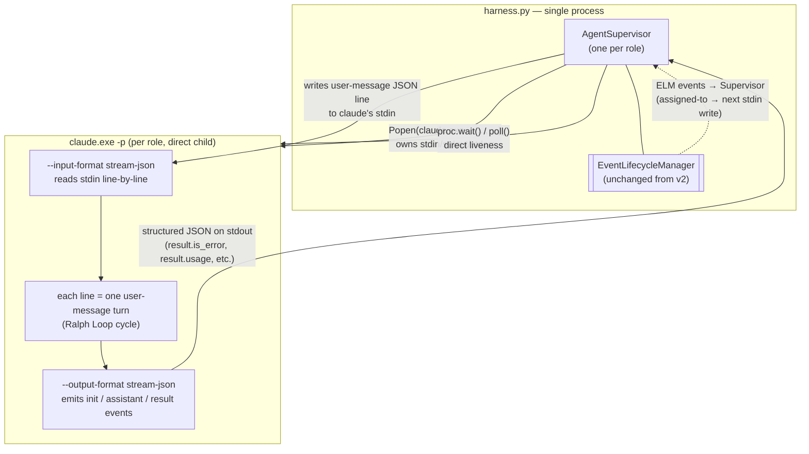

# Harness Direct-Spawn Architecture (draft)

_A proposal to collapse the agent process tree by having the harness spawn `claude` directly and drive cycles through the official `--input-format stream-json` channel on an owned stdin pipe._

> **Status**: DRAFT, proposal — **NOT recommended for implementation as currently sketched**. Technical feasibility confirmed in §10. Billing-model investigation in §11 found that `claude -p` (the mechanism this proposal relies on) bills against a separate Agent SDK credit pool, not the interactive Claude subscription — projected ongoing cost is $200–$450/month on top of the existing Max 20x plan. The four mitigations in §11.4 are the live discussion points; the most promising is **Mitigation #1 (hybrid spawn keeping interactive `claude`)** which needs a stdin-pipe-as-TTY test before it can be confirmed.
>
> Companion to [`HARNESS-ARCH.md`](HARNESS-ARCH.md) (current state) and [`AGENT-RUNTIME.md`](AGENT-RUNTIME.md) (cycle integration / v2 event-driven mode).
>
> **Audience**: anyone evaluating whether to take the migration. The original draft of this doc proposed using the Monitor tool over an ad-hoc JSON pipe; live feasibility testing (see §10) found that Claude Code's official `--input-format stream-json` / `--output-format stream-json` modes already do exactly what the proposal needs — multi-turn over stdin, persistent session, cache-amortized cost. That part is fine. The blocker is billing (§11).

---

## 1. Goal & scope

This doc proposes a redesign of how the harness spawns and supervises agent Claude processes.

In scope:

- The per-agent process tree (what spawns what, who owns whose stdin)
- The signaling channel between harness and agent (replaces today's `event_poll` sibling + Monitor pipe)
- Lifecycle: spawn, cycle, exit, restart, crash recovery
- What's deleted from the current architecture
- A staged migration plan

Out of scope:

- The event bus *contract* (`booted`, `assigned-to`, `ack-cursor`, `ack-stop`) — unchanged; see [`AGENT-RUNTIME.md`](AGENT-RUNTIME.md) §4.2
- The cycle wrapper (pre → creative → post) — unchanged; see [`AGENT-RUNTIME.md`](AGENT-RUNTIME.md) §6
- Compose / installer / forge integration — orthogonal

---

## 2. Context: what the current chain looks like

Per [`HARNESS-ARCH.md`](HARNESS-ARCH.md) and [`AGENT-RUNTIME.md`](AGENT-RUNTIME.md) §3.2, the agent subprocess tree on Windows today is:

```
wt.exe (Windows Terminal tab)
 └ bash.exe
    └ python.exe (thin_launcher.py)
       └ cmd.exe (npm claude.CMD shim)
          └ claude.exe (the agent)
  +  sibling: python.exe (event_poll.py --target stdout → claude's stdin via Monitor)
```

Five processes per agent, plus a sixth (`event_poll`) for the nudge channel under v2 event-driven mode. The harness is **not** the parent of `claude.exe`; it watches a `.claude-pid` file maintained by `thin_launcher` after a descendant-walk (ticket #10101) to find the real `claude.exe` past the `cmd.exe` shim.

This chain exists for historical reasons, not principled ones:

| Layer | Why it's there |
|---|---|
| `wt.exe` | Operator wants a visible terminal tab to watch / interact |
| `bash.exe` | `_spawn_windows` historically invoked `bash thin_launcher.py` rather than `python` directly |
| `thin_launcher.py` | Singleton lock, `--append-system-prompt`, restart-on-exit-42, atomic `.claude-pid` write |
| `cmd.exe` | npm-installed `claude` is a `.cmd` shim around the real `.exe` |
| `event_poll.py` (v2 only) | Long-lived stdin source for Monitor; can't be `thin_launcher` because the launcher exits when claude exits |

The cost of this layering is non-trivial: `_resolve_claude_exe_pid` + `_win32_list_descendants` + the toolhelp32 ctypes block (~250 lines in `thin_launcher.py`); a singleton check that fails open if the wrapper PID is stale; two duplicate-spawn race classes (concurrent `thin_launcher` invocations, concurrent harness auto-reboots); and an `event_poll` sibling whose only job is to keep a stdin pipe alive.

---

## 3. The proposal in one diagram



**Three properties:**

1. **The harness is the direct parent of `claude.exe`.** No `wt`, no `bash`, no `thin_launcher`, no `cmd` shim, no `event_poll` sibling. `Popen(...).pid` *is* the claude PID, full stop.
2. **The stdin pipe is the nudge channel — via Claude Code's native `stream-json` input mode.** Each newline-delimited user-message JSON the supervisor writes triggers one turn of the same session (same `session_id`, context carried forward, cached). When stdin is open but empty, claude blocks waiting for the next event — standard pipe semantics, no polling, no Monitor, no custom protocol. (See §10 feasibility result for proof.)
3. **Stdout is the response channel — also native `stream-json` output mode.** Each turn produces `system:init` → `assistant:message` → `result:success/error` events the supervisor reads line-by-line. This is the same format the Anthropic SDK uses; we're not inventing a protocol. (The HTTP bus stays for inter-role signaling and forge events — see §5.4.)

Process count per agent: **1** (was 5–6).

---

## 4. Process model

### 4.1 Spawning

The supervisor resolves a canonical path to the real `claude.exe` once at startup (skipping the npm shim):

```python
# pseudocode; lives on AgentSupervisor
CLAUDE_EXE = find_claude_exe()  # NPM_ROOT/@anthropic-ai/claude-code/bin/claude.exe on Windows;
                                 # shutil.which("claude") elsewhere

proc = subprocess.Popen(
    [str(CLAUDE_EXE), "-p",
     "--input-format", "stream-json",
     "--output-format", "stream-json",
     "--verbose",                     # required for stream-json output
     "--append-system-prompt", f"SQUIDSQUAD_ROLE={role}",
     "--name", f"squidsquad-{role}",
     "--effort", effort,
     "--dangerously-skip-permissions"],
    stdin=subprocess.PIPE,
    stdout=subprocess.PIPE,
    stderr=subprocess.PIPE,
    cwd=clone_path,
    env=env_with_role,
)
# Confirmed working: cmd.exe shim bypassed, proc.pid IS claude.exe.
# See §10 for the live test that proved this.
```

No descendant walk: `proc.pid` is the actual `claude.exe` because we bypassed the `.cmd` shim. No `.claude-pid` file: the supervisor holds the `Popen` handle.

### 4.2 The bootstrap prompt

Passed via `--append-system-prompt`, not as the positional prompt (the positional slot is the *first* user message in stream-json mode and we want the supervisor to send all user messages itself):

```text
You are running as SquidSquad role <role>. Each user message you receive
is one Ralph Loop cycle command. Follow .squidsquad/<role>/CLAUDE.md to
execute the cycle. Your assistant response IS the cycle result; the
supervisor parses it from the stream-json output envelope.

If the cycle exits via context pressure, your final assistant text must
be exactly the line "CYCLE-CTX-PRESSURE" so the supervisor can detect
it and respawn cleanly.
```

The session stays alive across cycles because (a) stdin is open, (b) the supervisor only writes one user message per cycle, (c) Claude Code keeps the session warm waiting for the next stdin line. Confirmed in §10.

### 4.3 Nudge protocol (supervisor → agent)

Newline-delimited JSON on stdin, conforming to Claude Code's `stream-json` user-message schema:

```json
{"type":"user","message":{"role":"user","content":[{"type":"text","text":"execute cycle 1436"}]}}
{"type":"user","message":{"role":"user","content":[{"type":"text","text":"execute cycle 1437 — assigned-to ticket #10401: <title>"}]}}
```

The "event" is whatever text the supervisor packs into the user message. The supervisor is the translation point between the v2 HTTP bus (`assigned-to`, etc.) and the agent's stdin.

### 4.4 Response protocol (agent → supervisor)

Newline-delimited JSON on stdout in Claude Code's `stream-json` output schema — **this is not a SquidSquad invention**:

```json
{"type":"system","subtype":"init","session_id":"...","tools":[...],"model":"...",...}
{"type":"assistant","message":{"content":[{"type":"thinking",...},{"type":"text",...}],"usage":{...}}}
{"type":"result","subtype":"success","is_error":false,"duration_ms":3198,"result":"...","usage":{...},"total_cost_usd":...}
```

The supervisor parses `result` events for cycle completion and turns them into v2 bus `ack-cursor` events. Cost / token usage / cache hit rate are visible per-cycle in `result.usage` — much better observability than today.

### 4.5 Liveness

`proc.poll()` returns `None` while alive, an integer exit code when dead. The supervisor's main loop is:

```python
while not stopping:
    line = await proc.stdout.readline()
    if not line:
        rc = await proc.wait()
        handle_exit(rc)            # 42 = ctx pressure, !=0 = crash, 0 = clean stop
        if intent_running and rc != 0:
            respawn()
        break
    handle_response(json.loads(line))
```

No HTTP health probe, no PID file staleness, no 30-second polling tick. The supervisor knows the agent is alive iff the `Popen` is alive.

### 4.6 Crash recovery

If the agent dies with unacked events in flight (last cycle was `ev-1437` but no `cycle-done` arrived), the supervisor:

1. Reads the cycle log (`.squidsquad/<role>/cycle-<N>.log`) to determine how far the agent got.
2. Decides per-event-type whether to redeliver:
   - `cycle-start`: idempotent — redeliver. Worst case: one cycle's work is redone.
   - `stop`: not redelivered; supervisor records intent locally instead.
3. Respawns and replays the queue from the last acked cursor.

Stronger guarantee than today's model, because:
- The supervisor has the full cycle log inline (vs. today's grep across git commits to figure out what happened).
- There's only one in-flight event at a time (no race between `event_poll` polling and the agent processing).

---

## 5. What the harness keeps, gains, and loses

### 5.1 Kept verbatim

- HTTP API (`:7373`) and the v2 event bus contract (`booted`, `assigned-to`, `ack-*`)
- EventLifecycleManager (ELM): deque + cursors + in-flight + background tasks
- ExternalActivityDetector (EAD): forge → bus bridge
- Intent state machine: `RUNNING` / `STOPPING` / `RESTARTING`
- Clone path / port discovery / restart safety

### 5.2 Gained

- **Direct liveness:** `proc.poll()` replaces the 30s health-poll loop in `update_health` (`harness.py:218–373`).
- **Synchronous backpressure:** stdin write blocks if the agent's Monitor hasn't consumed prior events. The supervisor cannot over-fire cycles.
- **Crash log inline:** stderr → cycle log file in real time, no after-the-fact reconstruction.
- **Singleton for free:** only the supervisor can spawn its child. Two concurrent spawns are structurally impossible.

### 5.3 Lost (with mitigations)

| Lost | Mitigation |
|---|---|
| Visible terminal tab per agent | New CLI: `squidsquad watch <role>` tails `.squidsquad/<role>/cycle-<N>.log` live. Operator ergonomics close to a tab. |
| Agent survives harness restart | Harness becomes load-bearing for agent lifetime. Run the harness under a supervisor (Windows Service / NSSM / systemd). Trade matches the v2 event-driven assumption already (`AGENT-RUNTIME.md` §2.1). |
| `claude --resume` chat-into-session | An operator wanting to "chat" with a stuck agent loses the wt tab. They can stop the agent, attach a `claude --resume <session>` interactively, then return control to the supervisor. This is a rare-enough op to take the hit. |

### 5.4 Removed (the appealing part)

- `thin_launcher.py` (~700 lines) — gone entirely
- `_resolve_claude_exe_pid` + `_win32_list_descendants` + `_posix_list_descendants` (~250 lines)
- `event_poll.py` as a sibling process (its job becomes "the supervisor writes to stdin")
- `boot_remote._spawn_windows` / `_spawn_macos` / `_spawn_linux` — collapsed to one cross-platform `Popen`
- `.claude-pid` files and the singleton-lock machinery
- `wt new-tab` invocations and the lingering-empty-tab UX bug
- The 60s force-kill safety net in `harness.update_health` (replaced by `Popen.terminate()` + `wait(timeout=30)` + `kill()`)
- The harness's "auto-reboot on death" PID-polling tick (replaced by `proc.wait()` returning, then respawn-if-intent-running)
- The duplicate-spawn race class entirely

---

## 6. Migration

Cutover by role, not big-bang. Suggested ordering:

1. **`skill` first.** Smallest surface (no forge writes, no inter-role choreography on the critical path). The skill agent's Ralph Loop is the closest to a pure cycle pump — easiest to rewrite as a Monitor handler.
2. **`dm` second.** Mostly mechanical (CHANGELOG bumps, releases). Low coordination cost.
3. **`qa` third.** Tooling-heavy but no concurrent coordination with itself.
4. **`pm` last.** Highest coordination load; needs the supervisor to be fully proven before pm migrates.

Each role flips a config flag (`spawn-mode: direct` vs `spawn-mode: legacy`). Old `thin_launcher.py` stays in tree until all four roles are on `direct`. Then it gets deleted in one PR.

Per-role rollout per migration:

- Stand up the supervisor for the role in parallel with the legacy launcher. Different ports / different clone paths if necessary to side-by-side them.
- Soak for 48 hours minimum (covers a context-pressure exit + respawn at least once per role given current cycle rates).
- Compare cycle outcomes against the legacy run; only flip the default after parity.

---

## 7. Open questions / risks

### ~~Q1: Does `claude -p` + `Monitor(persistent:true)` actually run indefinitely?~~ **RESOLVED — see §10**

Original concern: a `-p` invocation kept alive by Monitor was the load-bearing assumption. Live testing found we don't need Monitor at all: `--input-format stream-json` + `--output-format stream-json` is Claude Code's official multi-turn streaming mode, and it does exactly what we need. Multi-turn over stdin with persistent session_id, cache reused across turns, blocks on stdin EOF.

Residual: 24-hour soak still recommended before production cutover to characterize context-window behavior under sustained event load. Not blocking the design.

### Q2: How does the agent handle a wedged tool call?

Today: a hung tool call inside the live agent blocks all subsequent events for that role. Today's model recovers via a fresh process per cycle; the new model recovers via supervisor timeout + kill.

**Decision needed:** what's the per-event timeout, and what's the kill semantics (process kill = lose context; tool-cancel signal = preserve context but unknown support)?

### Q3: Stdout JSON discipline

The agent must emit JSON only on completion events, not chat-style text. Claude Code's tendency to narrate work intrudes here.

**Decision needed:** is the bootstrap prompt strong enough to enforce this, or does the supervisor need a parser that filters non-JSON to a log and keeps only the event stream? Probably the latter; cheap to build.

### Q4: Operator ergonomics replacement

The wt tab is gone. The replacement is `squidsquad watch <role>` tailing the cycle log. Need to gut-check whether operators actually use the wt tab today and what they use it for (passive watching vs. active interjection).

### Q5: Windows Service supervision of the harness

If the harness becomes the parent of all agents, it must not die unsupervised. NSSM is the obvious choice on Windows. Need to verify ELM startup recovery handles an NSSM-induced kill -9.

### Q6: How does this interact with the loop-mode fallback?

[`AGENT-RUNTIME.md`](AGENT-RUNTIME.md) §2.1 commits to loop mode as the fallback when the harness is down. Under direct-spawn, the harness *is* the spawn mechanism — there's no agent at all without a live harness. Loop mode survives by definition because the harness is up; the "harness down" failure mode is now "no agents run." Need to confirm this is acceptable given the operator-supervised harness model (Q5).

---

## 8. Estimated impact

| Metric | Today | Under direct-spawn | Delta |
|---|---|---|---|
| Processes per agent | 5–6 | 1 | −80% |
| Files watched for liveness | `.claude-pid` per role | none | −100% |
| Lines deleted from `thin_launcher.py` | n/a | ~700 | — |
| Lines deleted from `harness.py` (PID polling, descendant-walk, force-kill nets) | n/a | ~400 | — |
| Race classes (concurrent spawn, stale-PID singleton, .claude-pid clobber) | 3 | 0 | structurally impossible |
| Per-cycle latency (best case, warm-cache) | full-context reload | event-only round-trip | ~3× faster (estimated; needs Q1 spike) |
| Per-cycle latency (worst case, ctx-pressure respawn) | same as today | same as today | no change |

---

## 9. Decision needed

This doc is a **proposal**, not a plan. To turn it into a plan we need:

- A decision on Q2 / Q3 / Q4 / Q5 / Q6 from the human + pm
- A skill-role spike PR demonstrating the supervisor + stream-json wiring end-to-end (now small: §10 already proved the protocol works)

If those land cleanly, the migration in §6 is straightforward: per-role cutover, ~1 sub-phase per role, with `thin_launcher.py` deleted in a final cleanup PR.

---

## 10. Feasibility check — what was actually tested

Conducted 2026-05-26 as part of the PR review. Three tests run against the same `claude.exe` binary the harness uses today.

### 10.1 Test 1: direct spawn bypasses the npm shim

```sh
"C:/Users/naaht/AppData/Roaming/npm/node_modules/@anthropic-ai/claude-code/bin/claude.exe" -p \
   --output-format stream-json --verbose --model haiku <<< 'Reply pong'
```

Result: ✅ direct invocation works. `Popen.pid` returns the claude.exe PID (no descendant walk needed). The cmd.exe shim is purely cosmetic — it just forwards args. This invalidates one entire layer of `thin_launcher.py`'s complexity (`_resolve_claude_exe_pid` + toolhelp32 walker, ~250 lines).

### 10.2 Test 2: `--input-format stream-json` accepts multi-turn input

```sh
printf '%s\n%s\n' \
  '{"type":"user","message":{"role":"user","content":[{"type":"text","text":"msg 1"}]}}' \
  '{"type":"user","message":{"role":"user","content":[{"type":"text","text":"msg 2"}]}}' \
  | claude.exe -p --input-format stream-json --output-format stream-json --verbose --model haiku
```

Result: ✅ two `system:init` + two `result:success` events in the output stream, **same `session_id` across both**. One process handled two turns from stdin. Process exited on stdin EOF.

### 10.3 Test 3: context persists across turns + cache is reused

```sh
turn 1: "Remember this token: HARNESS-FEASIBILITY-7K2X. Reply only OK."
turn 2: "What was the token?"
```

Result: ✅ turn-2 reply was exactly `HARNESS-FEASIBILITY-7K2X`. Token usage telemetry:

| Turn | `cache_creation_input_tokens` | `cache_read_input_tokens` | Why it matters |
|---|---|---|---|
| 1 | 70,255 | 0 | First turn populates the prompt cache |
| 2 | 85 | **70,255** | Second turn reads the entire prior context from cache — near-zero per-turn cost |

This is the strongest result. **Cache amortization means N-cycle sessions are dramatically cheaper than N separate `claude -p` invocations**, validating one of the proposal's main claims (§8: "~3× faster, warm cache").

### 10.4 What this means for the proposal

- The Monitor angle from the first revision is unnecessary. `--input-format stream-json` is the official, supported mechanism. No persistent-Monitor longevity risk.
- The architecture is no longer "off the beaten path" — it's the same pattern the Anthropic Agent SDK uses for managed agents.
- The original Q1 soak-test risk is downgraded to "characterize before production rollout," not "go/no-go gate."
- Cost projection improves: per-cycle marginal token cost drops by ~99% after the first cycle (cache read vs. cache creation pricing differential).

### 10.5 What was NOT tested

- 24-hour soak under sustained event load (still wanted for production confidence; not gating the design)
- Context-pressure exit behavior in stream-json mode (assumed clean; needs verification)
- Tool-call timeout / wedge behavior (Q2 in §7, unchanged)
- Behavior under stdin write while a prior turn is still mid-tool-call (Q2-adjacent; supervisor should serialize)

---

## 11. Billing model — **proposal-blocking finding**

The technical feasibility tests in §10 were successful. Subsequent billing research (sources at end of section) found a separate problem that may make the proposal cost-prohibitive in its current form.

### 11.1 What changes June 15, 2026

Anthropic is splitting Claude subscription billing into two pools effective 2026-06-15:

| Surface | Billing pool |
|---|---|
| Interactive `claude` CLI (TUI), claude.ai web chat, native desktop app | Existing subscription limits (Pro/Max 5x/Max 20x) — flat-rate, no per-token charges |
| Agent SDK + **`claude -p` (print/headless mode)** — what this proposal uses | New separate monthly "Agent SDK credit": **$20 Pro / $100 Max 5x / $200 Max 20x**, billed at full API token rates against that credit |

Once the SDK credit runs out, additional usage either flows to API-rate usage credits (if enabled) or requests halt until the credit refreshes. Agent SDK / `claude -p` usage **no longer counts toward the interactive subscription's usage limits** — they're now structurally separate billing surfaces.

### 11.2 Pre-June 15 (current) state is even worse

Per Anthropic issues #37686 and #43333: even today, with an active Max subscription and OAuth auth, `claude -p` was silently billing as per-token API charges rather than subscription. One user reported $1,800 in surprise charges over two days of automation usage. The issue was acknowledged as a bug and (per the closed status) presumably patched in a recent version, but the new June 15 model formalizes this separation — `claude -p` will *definitionally* not be subscription-covered.

### 11.3 Cost projection for SquidSquad under direct-spawn

Per the §10 telemetry: turn 1 = 70K cache-creation tokens (≈$0.10 on Haiku, ≈$1.05 on Sonnet 4.6, ≈$1.75 on Opus 4.7); turn 2+ = ~85 new tokens + 70K cache-read (≈$0.002–$0.01 depending on model).

Realistic napkin math for the four-agent SquidSquad fleet at Sonnet 4.6:

| Item | Estimate |
|---|---|
| Cycles per agent per active hour | 2–4 |
| Active hours per day across 4 agents | 8–16 agent-hours |
| Cache-hit per-cycle marginal cost (Sonnet 4.6, ~5K new input tokens, ~500 output) | ~$0.02 |
| First-cycle-per-session cost (cache creation, ~70K tokens) | ~$1.00 |
| Daily cost (one ctx-pressure respawn per agent per day, ~30 cycles/agent/day) | **$5–$15/day** |
| Monthly cost | **$150–$450/month** |
| Less Max 20x SDK credit | −$200/month |
| Net overage above the $200 Max 20x subscription | **$0 to ~$250/month on top of the $200 plan** |

vs. the current architecture, where interactive `claude` sessions live inside subscription limits and incur no per-token overage. Today, four agents under Max 20x is ≈ flat $200/month. Direct-spawn pushes it to **$200–$450/month** depending on cycle volume.

### 11.4 What this means for the proposal

The architecture is technically sound (§10). The economics are not — at least not in the form sketched in §3–§4. **Recommend: do not proceed to implementation without first addressing one of:**

1. **Hybrid spawn:** keep interactive `claude` (subscription billing) as the agent process but have the harness be its parent. Open question: does interactive `claude` work when stdin is a pipe instead of a TTY? Would need testing. If yes, we get the process-tree simplification without the billing-pool switch.
2. **Cost cap + circuit-breaker:** accept the API billing pool, enforce a per-day USD ceiling per role using the `total_cost_usd` in each `result` event. Burn the SDK credit and stop when it's gone. Lossy operation acceptable for a side-project, not for production.
3. **Cheaper-model routing:** use Haiku 4.5 for routine cycles (≈10× cheaper than Sonnet); only escalate to Sonnet/Opus for cycles that hit a complexity threshold. Cuts the projection roughly an order of magnitude — might fit inside $200 SDK credit alone.
4. **Wait and accept:** keep today's architecture, accept the duplicate-spawn race class and ~1100 lines of complexity, until Anthropic's billing model changes or our scale justifies the API spend.

### 11.5 Sources

- [Claude subscriptions get separate budgets for programmatic use — the-decoder.com](https://the-decoder.com/claude-subscriptions-get-separate-budgets-for-programmatic-use-billed-at-full-api-prices/)
- [Use the Claude Agent SDK with your Claude plan — Anthropic Support](https://support.claude.com/en/articles/15036540-use-the-claude-agent-sdk-with-your-claude-plan)
- [Issue #43333: `claude -p` with OAuth (no API key) bills as API usage, not Max subscription](https://github.com/anthropics/claude-code/issues/43333)
- [Issue #37686: `claude -p` suggested to Max subscriber — caused unintended API billing ($1,800+ in two days)](https://github.com/anthropics/claude-code/issues/37686)
- [Claude Code Billing Change June 15, 2026 — buildthisnow.com](https://www.buildthisnow.com/blog/guide/mechanics/claude-billing-change-june-2026)

---

_Filed as a draft for discussion. Comments / counter-proposals welcome inline on the PR._
