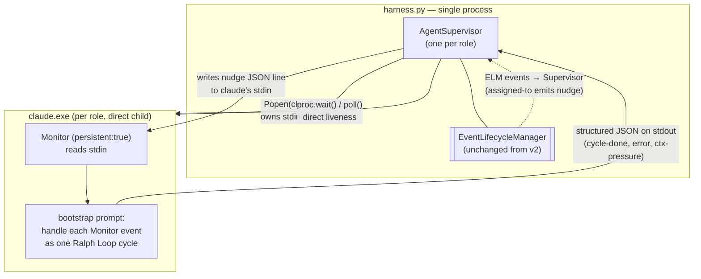

# Harness Direct-Spawn Architecture (draft)

_A proposal to collapse the agent process tree by having the harness spawn `claude` directly and drive cycles through Monitor over an owned stdin pipe._

> **Status**: DRAFT, proposal. Not implemented. Sketches a target architecture that would replace the current `wt → bash → thin_launcher → cmd → claude` chain with `harness → claude`. Companion to [`HARNESS-ARCH.md`](HARNESS-ARCH.md) (current state) and [`AGENT-RUNTIME.md`](AGENT-RUNTIME.md) (cycle integration / v2 event-driven mode).
>
> **Audience**: anyone evaluating whether to take the migration. Open questions in §7 are the ones that need answers before this becomes a build plan.

---

## 1. Goal & scope

This doc proposes a redesign of how the harness spawns and supervises agent Claude processes.

In scope:

- The per-agent process tree (what spawns what, who owns whose stdin)
- The signaling channel between harness and agent (replaces today's `event_poll` sibling + Monitor pipe)
- Lifecycle: spawn, cycle, exit, restart, crash recovery
- What's deleted from the current architecture
- A staged migration plan

Out of scope:

- The event bus *contract* (`booted`, `assigned-to`, `ack-cursor`, `ack-stop`) — unchanged; see [`AGENT-RUNTIME.md`](AGENT-RUNTIME.md) §4.2
- The cycle wrapper (pre → creative → post) — unchanged; see [`AGENT-RUNTIME.md`](AGENT-RUNTIME.md) §6
- Compose / installer / forge integration — orthogonal

---

## 2. Context: what the current chain looks like

Per [`HARNESS-ARCH.md`](HARNESS-ARCH.md) and [`AGENT-RUNTIME.md`](AGENT-RUNTIME.md) §3.2, the agent subprocess tree on Windows today is:

```
wt.exe (Windows Terminal tab)
 └ bash.exe
    └ python.exe (thin_launcher.py)
       └ cmd.exe (npm claude.CMD shim)
          └ claude.exe (the agent)
  +  sibling: python.exe (event_poll.py --target stdout → claude's stdin via Monitor)
```

Five processes per agent, plus a sixth (`event_poll`) for the nudge channel under v2 event-driven mode. The harness is **not** the parent of `claude.exe`; it watches a `.claude-pid` file maintained by `thin_launcher` after a descendant-walk (ticket #10101) to find the real `claude.exe` past the `cmd.exe` shim.

This chain exists for historical reasons, not principled ones:

| Layer | Why it's there |
|---|---|
| `wt.exe` | Operator wants a visible terminal tab to watch / interact |
| `bash.exe` | `_spawn_windows` historically invoked `bash thin_launcher.py` rather than `python` directly |
| `thin_launcher.py` | Singleton lock, `--append-system-prompt`, restart-on-exit-42, atomic `.claude-pid` write |
| `cmd.exe` | npm-installed `claude` is a `.cmd` shim around the real `.exe` |
| `event_poll.py` (v2 only) | Long-lived stdin source for Monitor; can't be `thin_launcher` because the launcher exits when claude exits |

The cost of this layering is non-trivial: `_resolve_claude_exe_pid` + `_win32_list_descendants` + the toolhelp32 ctypes block (~250 lines in `thin_launcher.py`); a singleton check that fails open if the wrapper PID is stale; two duplicate-spawn race classes (concurrent `thin_launcher` invocations, concurrent harness auto-reboots); and an `event_poll` sibling whose only job is to keep a stdin pipe alive.

---

## 3. The proposal in one diagram



**Three properties:**

1. **The harness is the direct parent of `claude.exe`.** No `wt`, no `bash`, no `thin_launcher`, no `cmd` shim, no `event_poll` sibling. `Popen(...).pid` *is* the claude PID, full stop.
2. **The stdin pipe is the nudge channel.** Monitor (with `persistent:true`) wakes the live session on each newline-delimited JSON event the supervisor writes. No file polling, no HTTP round-trip from a sibling process.
3. **Stdout is the response channel.** The agent emits structured JSON for each cycle completion / error / context-pressure exit. The supervisor reads line-by-line. This replaces today's mix of `.event-state.json`, `current-state` file scribbling, and HTTP `POST /events` from the agent side for the cycle-result path. (The HTTP bus stays for inter-role signaling and forge events — see §5.4.)

Process count per agent: **1** (was 5–6).

---

## 4. Process model

### 4.1 Spawning

The supervisor resolves a canonical path to the real `claude.exe` once at startup (skipping the npm shim):

```python
# psuedocode; lives on AgentSupervisor
CLAUDE_EXE = find_claude_exe()  # walks NPM_ROOT / @anthropic-ai/claude-code/bin/claude.exe
                                 # falls back to shutil.which("claude") on POSIX

proc = subprocess.Popen(
    [str(CLAUDE_EXE), "-p", BOOTSTRAP_PROMPT,
     "--append-system-prompt", f"SQUIDSQUAD_ROLE={role}",
     "--name", f"squidsquad-{role}",
     "--effort", effort,
     "--dangerously-skip-permissions"],
    stdin=subprocess.PIPE,
    stdout=subprocess.PIPE,
    stderr=subprocess.PIPE,
    cwd=clone_path,
    env=env_with_role,
)
```

No descendant walk: `proc.pid` is the actual `claude.exe` because we bypassed the `.cmd` shim. No `.claude-pid` file: the supervisor holds the `Popen` handle.

### 4.2 The bootstrap prompt

The single prompt passed via `-p` instructs the agent to arm Monitor and handle events for the rest of the turn:

```text
You are running as SquidSquad role <role>. Use the Monitor tool with
persistent: true on stdin. For each JSON event you receive, treat it
as one Ralph Loop cycle command per .squidsquad/<role>/CLAUDE.md.
After processing each event, emit a single JSON line on stdout:
  {"event":"cycle-done","id":<event_id>,"cycle":<N>, "result":{...}}
On a "stop" event, exit cleanly. On context pressure, emit
  {"event":"context-pressure","cycle":<N>}
and exit with code 42.
```

The agent's first action is to arm Monitor; the turn thereafter stays alive indefinitely on Monitor's wakeup contract. See §7 Open Question 1 for the soak-test requirement.

### 4.3 Nudge protocol (supervisor → agent)

Newline-delimited JSON on stdin. The supervisor writes one event per `flush()`:

```json
{"event":"cycle-start","id":"ev-1436","payload":{"reason":"timer"}}
{"event":"cycle-start","id":"ev-1437","payload":{"reason":"assigned-to","issue":10401}}
{"event":"stop","id":"ev-1438","payload":{"grace":"checkpoint"}}
```

Event types map directly onto the v2 bus catalog from [`AGENT-RUNTIME.md`](AGENT-RUNTIME.md) §4.2 — supervisor is the translation point between the HTTP bus and the agent's stdin.

### 4.4 Response protocol (agent → supervisor)

Newline-delimited JSON on stdout. Anything not parseable as JSON is captured as `agent-log` for the cycle log file.

```json
{"event":"booted","pid":12345,"version":"0.43.0"}
{"event":"cycle-done","id":"ev-1436","cycle":1436,"result":{"shipped":["10401"]}}
{"event":"error","id":"ev-1437","error":"tool 'gh' returned exit 1: ..."}
{"event":"context-pressure","cycle":1438}
```

Cycle responses translate to v2 bus acks (`ack-cursor` for `cycle-done`, the supervisor synthesizes them).

### 4.5 Liveness

`proc.poll()` returns `None` while alive, an integer exit code when dead. The supervisor's main loop is:

```python
while not stopping:
    line = await proc.stdout.readline()
    if not line:
        rc = await proc.wait()
        handle_exit(rc)            # 42 = ctx pressure, !=0 = crash, 0 = clean stop
        if intent_running and rc != 0:
            respawn()
        break
    handle_response(json.loads(line))
```

No HTTP health probe, no PID file staleness, no 30-second polling tick. The supervisor knows the agent is alive iff the `Popen` is alive.

### 4.6 Crash recovery

If the agent dies with unacked events in flight (last cycle was `ev-1437` but no `cycle-done` arrived), the supervisor:

1. Reads the cycle log (`.squidsquad/<role>/cycle-<N>.log`) to determine how far the agent got.
2. Decides per-event-type whether to redeliver:
   - `cycle-start`: idempotent — redeliver. Worst case: one cycle's work is redone.
   - `stop`: not redelivered; supervisor records intent locally instead.
3. Respawns and replays the queue from the last acked cursor.

Stronger guarantee than today's model, because:
- The supervisor has the full cycle log inline (vs. today's grep across git commits to figure out what happened).
- There's only one in-flight event at a time (no race between `event_poll` polling and the agent processing).

---

## 5. What the harness keeps, gains, and loses

### 5.1 Kept verbatim

- HTTP API (`:7373`) and the v2 event bus contract (`booted`, `assigned-to`, `ack-*`)
- EventLifecycleManager (ELM): deque + cursors + in-flight + background tasks
- ExternalActivityDetector (EAD): forge → bus bridge
- Intent state machine: `RUNNING` / `STOPPING` / `RESTARTING`
- Clone path / port discovery / restart safety

### 5.2 Gained

- **Direct liveness:** `proc.poll()` replaces the 30s health-poll loop in `update_health` (`harness.py:218–373`).
- **Synchronous backpressure:** stdin write blocks if the agent's Monitor hasn't consumed prior events. The supervisor cannot over-fire cycles.
- **Crash log inline:** stderr → cycle log file in real time, no after-the-fact reconstruction.
- **Singleton for free:** only the supervisor can spawn its child. Two concurrent spawns are structurally impossible.

### 5.3 Lost (with mitigations)

| Lost | Mitigation |
|---|---|
| Visible terminal tab per agent | New CLI: `squidsquad watch <role>` tails `.squidsquad/<role>/cycle-<N>.log` live. Operator ergonomics close to a tab. |
| Agent survives harness restart | Harness becomes load-bearing for agent lifetime. Run the harness under a supervisor (Windows Service / NSSM / systemd). Trade matches the v2 event-driven assumption already (`AGENT-RUNTIME.md` §2.1). |
| `claude --resume` chat-into-session | An operator wanting to "chat" with a stuck agent loses the wt tab. They can stop the agent, attach a `claude --resume <session>` interactively, then return control to the supervisor. This is a rare-enough op to take the hit. |

### 5.4 Removed (the appealing part)

- `thin_launcher.py` (~700 lines) — gone entirely
- `_resolve_claude_exe_pid` + `_win32_list_descendants` + `_posix_list_descendants` (~250 lines)
- `event_poll.py` as a sibling process (its job becomes "the supervisor writes to stdin")
- `boot_remote._spawn_windows` / `_spawn_macos` / `_spawn_linux` — collapsed to one cross-platform `Popen`
- `.claude-pid` files and the singleton-lock machinery
- `wt new-tab` invocations and the lingering-empty-tab UX bug
- The 60s force-kill safety net in `harness.update_health` (replaced by `Popen.terminate()` + `wait(timeout=30)` + `kill()`)
- The harness's "auto-reboot on death" PID-polling tick (replaced by `proc.wait()` returning, then respawn-if-intent-running)
- The duplicate-spawn race class entirely

---

## 6. Migration

Cutover by role, not big-bang. Suggested ordering:

1. **`skill` first.** Smallest surface (no forge writes, no inter-role choreography on the critical path). The skill agent's Ralph Loop is the closest to a pure cycle pump — easiest to rewrite as a Monitor handler.
2. **`dm` second.** Mostly mechanical (CHANGELOG bumps, releases). Low coordination cost.
3. **`qa` third.** Tooling-heavy but no concurrent coordination with itself.
4. **`pm` last.** Highest coordination load; needs the supervisor to be fully proven before pm migrates.

Each role flips a config flag (`spawn-mode: direct` vs `spawn-mode: legacy`). Old `thin_launcher.py` stays in tree until all four roles are on `direct`. Then it gets deleted in one PR.

Per-role rollout per migration:

- Stand up the supervisor for the role in parallel with the legacy launcher. Different ports / different clone paths if necessary to side-by-side them.
- Soak for 48 hours minimum (covers a context-pressure exit + respawn at least once per role given current cycle rates).
- Compare cycle outcomes against the legacy run; only flip the default after parity.

---

## 7. Open questions / risks

### Q1: Does `claude -p` + `Monitor(persistent:true)` actually run indefinitely?

`-p` is documented as one-shot. Monitor with `persistent: true` is documented as keeping the turn alive on events. The interaction of the two — a `-p` invocation whose turn never ends because Monitor never returns — is **the load-bearing assumption of this entire design**.

**Test:** spike a 24-hour run that fires 1 event per minute on stdin and confirms (a) the turn never auto-ends, (b) Monitor doesn't drop events under sustained pressure, (c) context window grows linearly with events and exits cleanly at the threshold.

If Q1 fails, fall back to **per-cycle spawn**: each event triggers a fresh `claude -p "<one cycle>"` invocation. Higher per-cycle cost (no warm cache) but architecturally identical from the supervisor's POV.

### Q2: How does the agent handle a wedged tool call?

Today: a hung tool call inside the live agent blocks all subsequent events for that role. Today's model recovers via a fresh process per cycle; the new model recovers via supervisor timeout + kill.

**Decision needed:** what's the per-event timeout, and what's the kill semantics (process kill = lose context; tool-cancel signal = preserve context but unknown support)?

### Q3: Stdout JSON discipline

The agent must emit JSON only on completion events, not chat-style text. Claude Code's tendency to narrate work intrudes here.

**Decision needed:** is the bootstrap prompt strong enough to enforce this, or does the supervisor need a parser that filters non-JSON to a log and keeps only the event stream? Probably the latter; cheap to build.

### Q4: Operator ergonomics replacement

The wt tab is gone. The replacement is `squidsquad watch <role>` tailing the cycle log. Need to gut-check whether operators actually use the wt tab today and what they use it for (passive watching vs. active interjection).

### Q5: Windows Service supervision of the harness

If the harness becomes the parent of all agents, it must not die unsupervised. NSSM is the obvious choice on Windows. Need to verify ELM startup recovery handles an NSSM-induced kill -9.

### Q6: How does this interact with the loop-mode fallback?

[`AGENT-RUNTIME.md`](AGENT-RUNTIME.md) §2.1 commits to loop mode as the fallback when the harness is down. Under direct-spawn, the harness *is* the spawn mechanism — there's no agent at all without a live harness. Loop mode survives by definition because the harness is up; the "harness down" failure mode is now "no agents run." Need to confirm this is acceptable given the operator-supervised harness model (Q5).

---

## 8. Estimated impact

| Metric | Today | Under direct-spawn | Delta |
|---|---|---|---|
| Processes per agent | 5–6 | 1 | −80% |
| Files watched for liveness | `.claude-pid` per role | none | −100% |
| Lines deleted from `thin_launcher.py` | n/a | ~700 | — |
| Lines deleted from `harness.py` (PID polling, descendant-walk, force-kill nets) | n/a | ~400 | — |
| Race classes (concurrent spawn, stale-PID singleton, .claude-pid clobber) | 3 | 0 | structurally impossible |
| Per-cycle latency (best case, warm-cache) | full-context reload | event-only round-trip | ~3× faster (estimated; needs Q1 spike) |
| Per-cycle latency (worst case, ctx-pressure respawn) | same as today | same as today | no change |

---

## 9. Decision needed

This doc is a **proposal**, not a plan. To turn it into a plan we need:

- Q1 soak-test result (1 day of engineering)
- A decision on Q2 / Q3 / Q4 / Q5 / Q6 from the human + pm
- A skill-role spike PR demonstrating the supervisor + bootstrap prompt end-to-end

If those land cleanly, the migration in §6 is straightforward: per-role cutover, ~1 sub-phase per role, with `thin_launcher.py` deleted in a final cleanup PR.

---

_Filed as a draft for discussion. Comments / counter-proposals welcome inline on the PR._
