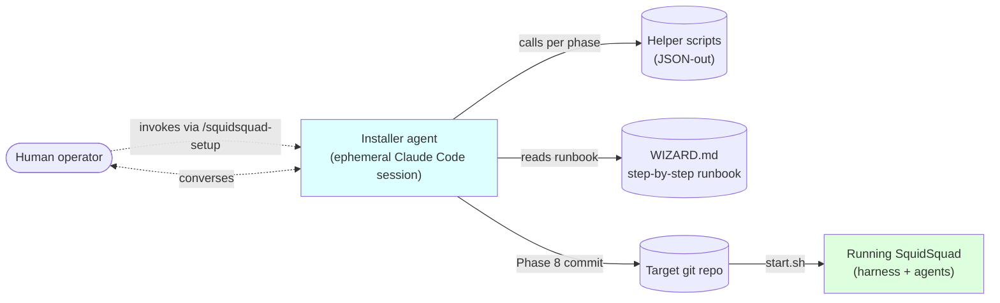
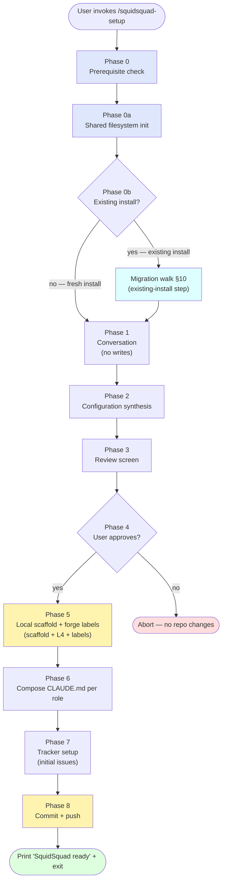
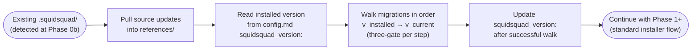

# Installer Architecture (v1 draft)

> **Status**: v1 draft, 2026-05-23. Architecture companion to the step-by-step runbook at [`references/wizard/WIZARD.md`](../references/wizard/WIZARD.md). This doc defines *how* the installer is structured; the runbook defines *what* the installer does at each step.
> **Companion docs**: [`ARCHITECTURE.md`](ARCHITECTURE.md) (overall system), [`AGENT-RUNTIME.md`](AGENT-RUNTIME.md) (what runs after install), [`COMPOSE-ARCHITECTURE.md`](COMPOSE-ARCHITECTURE.md) (how composed CLAUDE.md is generated; the installer invokes this), [`sub-skill-catalog.md`](sub-skill-catalog.md) (sub-skills the installer wires up).

---

## 1. Goal & scope

The SquidSquad installer turns a fresh git repo into a working multi-agent setup. It runs as an **ephemeral Claude Code agent** that walks the user through configuration, generates `.squidsquad/`, composes per-role-class CLAUDE.md outputs, sets up the tracker, and boots the harness.

### 1.1 Terminology — categorical roles vs team preset

This doc uses the four **categorical role classes** from SquidSquad's architecture:

- **PM** — the project manager (singleton; one per install).
- **workers** — the engineering specialists (plural class; one or more per install — e.g. one generalist worker, or two stack-specialized workers).
- **verifiers** — the verification specialists (plural class; typically one, but the model supports multiple).
- **DM** — the delivery manager (singleton; one per install).

The **team preset** is the concrete roster chosen at install — which actual workers and verifiers to instantiate. The default preset has one worker named `worker` and one verifier named `verifier`, alongside the singleton `pm` and `dm` (post-#6274 rename — see AGENT-RUNTIME §10 revision log). Other shipped presets include stack-specialized ones (e.g. workers `fe` + `be`, or `web` + `ios` + `api`). Operators may also define custom presets.

Throughout this doc, **prose talks about the categorical classes** (PM, workers, verifiers, DM). File-layout examples use `<worker-role>/`, `<verifier-role>/`, `pm/`, `dm/` placeholders since concrete names depend on the chosen preset.

### 1.2 Per-agent clone isolation (mandatory)

**Every agent runs in its own git clone of the project repo.** This is a base architectural commitment — not a configurable mode. The installer always sets up per-alias clones (one clone per installed agent instance); there is no flag to disable clone isolation.

Why: agents work autonomously and concurrently. If they shared one working tree they would step on each other's `git pull`, `git checkout`, branch switches, and uncommitted state. Per-agent clones make each agent's working tree disjoint while still coordinating through the same remote (the source-of-truth git repo) and forge (GitHub Issues).

The clones live wherever the operator places them on disk; their paths are registered in `~/.squidsquad/clones/<alias>` (one file per alias, contents = absolute path to that alias's clone). The harness reads this registry at boot, and `start.sh` uses it to sync all clones with `git pull` before booting the squad.

In scope:

- How the installer is structured (agent + helpers + runbook)
- The phases an install passes through
- Inputs (human conversation + repo state) and outputs (`.squidsquad/` tree + GitHub labels + booted harness)
- The migration-walk step that runs when re-installing on top of an existing `.squidsquad/`
- Idempotency and recovery

Out of scope:

- Step-by-step install instructions — see [`references/wizard/WIZARD.md`](../references/wizard/WIZARD.md)
- What agents *do* after install — see [`AGENT-RUNTIME.md`](AGENT-RUNTIME.md)
- How sub-skills compose into CLAUDE.md outputs — see [`COMPOSE-ARCHITECTURE.md`](COMPOSE-ARCHITECTURE.md)
- The L1-L4 model itself — see [COMPOSE-ARCHITECTURE.md §2](COMPOSE-ARCHITECTURE.md)

---

## 2. The installer's mental model



Three commitments:

1. **Ephemeral agent.** The installer is a one-shot Claude Code session. It boots, talks to the human, runs helpers, commits the final state, prints "SquidSquad ready", and exits. No background process, no daemon, no long-lived install state.
2. **Two halves — pure conversation, then writes-and-commit.** Phases 0–4 (per §4 below) are pure conversation + helper queries — no writes to the target repo. From Phase 5 onward the installer writes to the local filesystem; Phase 8 is the atomic git commit + push that publishes everything. The user can abort cleanly through Phase 4; aborting between Phase 5 and Phase 8 is also clean but requires re-running the installer (which detects the partial state per §11.1's interrupted-install recovery — user-initiated mid-flow abort is not a first-class supported path; the installer either completes or is re-run).
3. **One flow, fresh and re-run.** There is no distinct "upgrade flow". Re-running the installer on a repo that already has `.squidsquad/` walks the same phases; the existing-install case is handled by a migration-walk step (§4.4) that consults per-version `references/migrations/v<N-1>-to-v<N>.md` files. Helpers like `shared_fs.py init` are idempotent — safe to run on re-installs.

> **Numbering note.** This doc's "Phases 0–9" are an architectural decomposition of the install flow. The companion runbook [`WIZARD.md`](../references/wizard/WIZARD.md) uses its own "Step 0 / 0a / 0b / 1 / 1b / 2 / 3 / 4 / 5 / 5b / 5c / 5d / 6 / 7" numbering that maps roughly onto these phases. When this doc references a `Step <N>` it means the WIZARD step; `Phase <N>` is always this doc's numbering.

---

## 3. Inputs and outputs

### 3.1 Inputs

| Source | What the installer reads |
|---|---|
| **Human conversation** | Project domain, **team preset** (which workers and verifiers to install — see §1.1), loop interval, model routing preferences, tracker backend (GitHub Issues default, Forgejo alt), git workflow preferences. **NOT collected at install: tool/MCP/CLI configuration** — those are per-agent decisions made post-install (see §8). |
| **Repo state** | Git existence + branch + history; existing `.squidsquad/` (triggers the migration-walk step inside the standard flow — §4.4); language/stack hints from filesystem |
| **Environment** | `gh` CLI installed + authenticated; Python 3 + `pip`; OS (Windows, macOS, Linux); `claude` CLI on PATH |
| **`~/.squidsquad/`** | Cross-install shared filesystem — existing secrets, clone registry, prior config |

### 3.2 Outputs

| Destination | What the installer writes |
|---|---|
| `.squidsquad/config.md` | Project config — iter interval, ship threshold, model routing, tracker backend, git workflow, the install's **SquidSquad version stamp** (`squidsquad_version: <semver>` field; written at Phase 5 from `references/VERSION` (shipped with the pulled SquidSquad sources); read by the upgrade flow §10 step 1) and the **`## Aliases` registry section** mapping each install-time alias to its role-class + L3 domain (used by the harness for `/work/assign` alias-existence validation — see [AGENT-RUNTIME.md §7.3](AGENT-RUNTIME.md)). **No `event-driven:` field** — wake-mode selection happens at agent boot via harness probe (AGENT-RUNTIME §8.3), not via config. |
| `.squidsquad/<alias>/` | Per-alias agent directory (CLAUDE.md composed, working-state.md skeleton, planning/, iterations/) — one per alias in the chosen team preset: PM, each worker, each verifier, DM. *Note: no separate `SOUL.md` per alias — `SOUL.md` is a filename shorthand for the soul-slot source at `references/roles/<role-class>/SOUL.md`; its content is composed into `CLAUDE.md §3 Soul`. The v1 per-alias sidecar is retired per [COMPOSE-ARCHITECTURE.md §5.3](COMPOSE-ARCHITECTURE.md).* |
| `.squidsquad/project/` | L4 project-local files — one unified `<role-class>.md` per role-class (pm.md, `<worker-class>.md`, `<verifier-class>.md`, dm.md) with H2 slot sections. Initial `## Project Context` block in each is seeded from Phase 1 conversational answers (per §4.8 step 4); other slots start empty and accumulate at runtime via `l4-curation` (see [COMPOSE-ARCHITECTURE.md §5.5 + §7](COMPOSE-ARCHITECTURE.md)). |
| `.squidsquad/vault/` | Shared memory layer skeleton (BRIEFING.md + the five vault dirs: projects/, areas/, resources/, archives/, galaxy/). Vault architecture documented in [`VAULT-ARCH.md`](VAULT-ARCH.md). |
| `.squidsquad/.local-config` | Per-clone alias→path mapping for `start.sh` to sync clones. Installer-scaffolded; harness reads it at boot to populate per-alias `clone_path` into in-memory `AgentState` (see HARNESS-ARCH §7.2 step 1 + §7.5). At runtime the harness's `.harness-state.json` is the operational source; `.local-config` is the install-time source of truth. |
| `~/.squidsquad/secrets` | API keys for external models (restricted permissions, never committed to repo) |
| `~/.squidsquad/clones/` | Per-alias clone-path registry. One file per alias (filename = alias literal, no extension — e.g. `~/.squidsquad/clones/pm`, `~/.squidsquad/clones/frontend-1`); file contents = the absolute path to that alias's clone. Always created — clone isolation is mandatory (see §1.2), not a configurable mode. |
| **Forge (GitHub)** | Issue labels created via `gh label create` — status/role/type/priority/severity taxonomy |
| **Git commit** | Single atomic install commit on `main` (or the operator's chosen branch) |

> **Runtime files (not installer outputs):** `.squidsquad/.harness-port`, `.squidsquad/.harness-state.json`, `.squidsquad/.event-state.json` do not exist immediately after `squidsquad init` exits; they appear only after the harness is first started (`start.sh` / HARNESS-ARCH §2). They are harness-owned, not installer outputs. Schemas are documented in [`HARNESS-ARCH.md`](HARNESS-ARCH.md) §7 + [`AGENT-RUNTIME.md`](AGENT-RUNTIME.md) §5. Listed here as a pointer because operators inspecting the directory post-install will see them.

---

## 4. Phases of install



### 4.1 Phase 0 — Prerequisite check

Verify the environment can run a SquidSquad install:

- `gh` CLI installed AND authenticated (`gh auth status`) — required for tracker
- Python 3 + `pip` — required for helpers
- `claude` CLI on PATH — required to spawn agents
- Git repo present + clean working tree (or operator-acknowledged)

Helper: `references/scripts/wizard.py check-gh` returns a JSON envelope with `ok: true | false` and a `stage: ready | installed | authenticated` field. The installer agent acts on the JSON, never invents environment checks.

### 4.2 Phase 0a — Shared filesystem init

`~/.squidsquad/` is the cross-install shared filesystem (one per user, not per repo). The installer creates if missing:

```
~/.squidsquad/
├── secrets        # API keys, restricted perms (0600)
├── config         # cross-install config
└── clones/        # per-alias clone-path registry (one file per alias; mandatory per §1.2)
```

Helper: `references/scripts/shared_fs.py init`. Idempotent — re-runs are safe.

### 4.3 Phase 0b — Re-run detection + migration walk

The installer checks for `.squidsquad/` in the target repo.

- **Fresh case** (directory absent): proceed directly to Phase 1.
- **Existing-install case** (directory present): run the **migration walk** before Phase 1.

The migration walk is the only step that differs between fresh and re-run installs; every other phase (1 through 9) runs identically. The walk reads the existing install's `squidsquad_version:` stamp from `.squidsquad/config.md` and applies per-version migration markdowns shipped under `references/migrations/` to bring the on-disk state forward to the current version. Full mechanics in §10.

The installer never wipes existing-install content as a flow-level rule. Whatever needs to change is changed *by* a migration markdown (under the three-gate model); anything no migration touches is preserved automatically because the installer's other phases write only to fresh-scaffold paths.

### 4.4 Phase 1 — Conversation (no writes)

The installer talks to the human in domain terms — never internal jargon, never file paths, never script names. It collects:

- **Project details**: name, domain, audience, primary language/stack, repositories of record (primary repo paths, related repos), external systems (e.g., issue trackers if not GitHub, CI/CD platforms, monitoring/observability tools). These may be collected directly or via adaptive context questions depending on stack.
- **Adaptive context questions**: branched based on stack and domain (e.g. mobile app vs CLI vs web service have different follow-ups)
- **Team preset**: which preset roster to install. The installer offers a small set of named presets (e.g. a generalist preset with one worker + one verifier; a multi-stack preset with two workers + one verifier; a frontend+backend preset; a multi-platform preset). The wizard suggests a preset based on the project domain and asks the human to confirm or pick another. Custom presets are supported but not the default path.
- **Loop interval**: cycle cadence (default 30 min for polling, irrelevant in event mode)
- **Model routing** (optional): which subagent task types route to which external model
- **Forge backend** (optional): default GitHub Issues; alternate Forgejo
- **Git workflow preferences**: branch model, commit prefix convention

Notably **NOT collected**: tool/MCP/CLI configuration. The installer does not ask "which design tool do you want?" or "which delivery target?". Tool setup is a per-agent runtime concern (see §8) — the human tells each agent post-install what tools it needs, and the agent persists that decision via L4 writes ([COMPOSE-ARCHITECTURE.md §7](COMPOSE-ARCHITECTURE.md)).

This phase writes nothing. All answers are held in the installer agent's conversation context. The user can abort with zero trace.

### 4.5 Phase 2 — Configuration synthesis

The installer assembles a single in-memory **install spec** from the conversation answers — a structured representation of the install:

```yaml
team_preset: <preset-name>     # e.g. "default", "frontend-backend", "multi-platform"
workers: [<worker-role>, …]    # concrete worker names from the preset
verifiers: [<verifier-role>, …] # concrete verifier names from the preset
domain: "developer tooling"
loop_interval: 30
tracker_backend: github
model_routing: { ... }
git_workflow: { ... }
```

Still no writes — the spec is in memory.

### 4.6 Phase 3 — Review screen

The installer shows the user the install spec in plain language: "I'm about to set up SquidSquad with the <preset-name> preset (PM + N workers + M verifiers + DM); GitHub Issues tracker; 30-min polling; deepseek-v4-pro for research; squidsquad-style commit prefixes". No tool/MCP wiring appears here — see §8 for the post-install tool-setup model.

### 4.7 Phase 4 — Approval gate

The installer presents the spec from §4.6 and waits for one of three responses:

- **Approve** (`p` / `proceed` / `yes` / Enter): the installer proceeds to Phase 5. Writes begin.
- **Edit** (`e` / `edit`): the installer routes back to a specific Phase 1 question (the user names which detail to change — team preset, loop interval, tracker, etc.) and re-walks the affected portion of the conversation. The spec is updated; the review screen redisplays.
- **Abort** (`a` / `abort` / `n` / `no`): the installer exits with a one-line "no changes made" message. No files written, no commit, no forge labels created.

The accepted-response set is parsed case-insensitively. Ambiguous input prompts a re-ask rather than guessing. This is the **last clean abort point** — beyond Phase 4 the installer has written to the local filesystem, and abort requires the §11.2 cleanup path.

### 4.8 Phase 5 — Local scaffold + forge labels

Once approved, the installer:

1. **Cleans up** any prior partial state (if a previous interrupted install left artifacts).
2. **Serializes the install spec** to a temporary location for the scaffold step.
3. **Scaffolds `.squidsquad/`** — creates the per-alias agent dirs (CLAUDE.md placeholders, working-state.md skeletons, planning/, iterations/), vault skeleton, project-local L4 directory, `.squidsquad/config.md` (including the **`## Aliases` H2 section** mapping each chosen alias to its role-class and L3 domain), and the **`squidsquad_version:` field** read from `references/VERSION` already present in the installer source tree (fresh install runs from within the pulled SquidSquad sources; upgrade re-reads this same file per §10 step 1). No per-alias `SOUL.md` files (the v1 sidecar is retired; SOUL.md content is composed into `CLAUDE.md §3 Soul` per [COMPOSE-ARCHITECTURE.md §5.3](COMPOSE-ARCHITECTURE.md)). No tool/MCP wiring (per §8).

   Schema example for `## Aliases`:
   ```markdown
   ## Aliases
   | alias | role-class | L3 domain |
   |---|---|---|
   | pm | pm | — |
   | frontend-1 | worker | fe |
   | backend-1 | worker | be |
   | verifier | verifier | — |
   | dm | dm | — |
   ```
4. **Seeds L4 Project Context** — for each role-class in the chosen preset, writes the Phase 1 project-intake answers (domain, audience, primary language/stack, repositories of record, external systems, project-specific tone notes) into `.squidsquad/project/<role-class>.md` under the `## Project Context` H2 section. This is the single unified L4 file per role-class (per [COMPOSE-ARCHITECTURE.md §3.3 + §7.3](COMPOSE-ARCHITECTURE.md) and the "two complementary sources" callout in [§5.5](COMPOSE-ARCHITECTURE.md)). Other L4 slots (Identity / Soul / Instructions / etc.) start empty at install time and are populated at runtime by the `l4-curation` sub-skill (per [COMPOSE-ARCHITECTURE.md §7](COMPOSE-ARCHITECTURE.md)).

   > **Historical context (no installer code needed):** earlier installs used a multi-file L4 seed pattern (`references/sub-skills/project/<role>-instructions.md`, `<role>-responsibility.md`, `<role>-soul-directives.md`, `shared-*.md`, `setup-upgrade-gate.md`). That pattern is retired and replaced by the unified `<role-class>.md` model above. The installer does **not** carry migration code for the legacy pattern — fresh installs never see it, and existing installs are migrated by a separate one-time tool (out of scope for this doc). This callout exists only to disambiguate the docs; an implementer reading §4.8 should write the unified-file path and not the legacy multi-file path.
5. **Ensures GitHub labels** — creates the status/role/type/priority/severity label taxonomy via `gh label create` (idempotent per-label check).

Writes land in the target repo's working tree (`.squidsquad/` appears in `git status`) but are not staged or committed — the atomic commit happens at Phase 8 (per §11.1's "Phase 5 is the first phase that writes to the target repo"). Helpers handle the mechanical work; the installer agent acts on JSON outputs only.

### 4.9 Phase 6 — Compose per-role CLAUDE.md

For each alias in the chosen team preset (PM, each worker, each verifier, DM), the installer invokes:

```bash
python references/scripts/compose.py deploy <role>
```

`compose.py` reads the L1-L3 sub-skill sources + L4 project-local files and emits `.squidsquad/<alias>/CLAUDE.md` per the [compose pipeline](COMPOSE-ARCHITECTURE.md). The output path is **alias-keyed**: `compose.py deploy <alias>` writes to `.squidsquad/<alias>/CLAUDE.md`, regardless of role-class. The composed output is a thin orchestration layer that references sub-skills — see [COMPOSE-ARCHITECTURE.md §4.5](COMPOSE-ARCHITECTURE.md). (The CLI's positional parameter is shown as `<role>` for code-compat — its value is always the alias; the rename to `<alias>` is tracked in [#10358](https://github.com/WallyDoodlez/SquidSquad/issues/10358).) The compose helper takes the alias as its positional argument and internally resolves the role-class (from the alias→class mapping in `.squidsquad/config.md`'s `## Aliases` registry) to pick the correct L4 file. Two aliases of the same role-class share an L4 file by design — see COMPOSE-ARCHITECTURE §3.3.

**Current-state caveat**: as of today, the project-scoped Claude-skills installer that materializes sub-skill references into invokable Skill tool entries is **not yet shipped** (COMPOSE-ARCHITECTURE §4.5.1, tracked in #10362). The composed CLAUDE.md emits sub-skill references either way; until the Skills installer ships, agents resolve `→ run sub-skill: <name>` by looking up `<name>` in [`sub-skill-catalog.md`](sub-skill-catalog.md) to find the source-file path (under `references/sub-skills/`) and executing that file's instructions in-context. The composition output format is stable; only the *invocation mechanism* differs between today and target state.

Two aliases of the same role-class produce byte-identical composed output by design — same L1-L4 sources, same compose pipeline. The output path differs by alias (`.squidsquad/<alias>/CLAUDE.md`); the content is shared per class. See COMPOSE-ARCHITECTURE §3.3.

### 4.10 Phase 7 — Tracker setup

Beyond the labels created in Phase 5, the installer may seed initial issues — e.g. issue #1 with the project's roadmap or onboarding tasks. This is configurable per-install and is the only place where the installer writes to the forge beyond labels.

### 4.11 Phase 8 — Commit + push

A single atomic commit on `main` (or the operator's chosen branch) containing the full `.squidsquad/` tree. Commit message follows the convention `wizard: SquidSquad install — <team_preset>`. Push to origin.

### 4.12 Phase 9 — Print "ready" message and exit

The installer prints a one-line confirmation with next steps — typically how to invoke `start.sh` to boot the harness — and exits its Claude Code session. No background process; the human is now in control.

---

## 5. File layout produced

The full `.squidsquad/` tree post-install. PM and DM dirs are always present (singletons); each chosen worker and verifier from the team preset gets its own dir. The names `pm`, `verifier`, `worker`, `dm` shown below are the *default-preset* names (post-#6274 rename — see AGENT-RUNTIME §10 revision log); other presets use different concrete names (e.g. `fe`, `be`, `web`, `ios` for workers).

```
.squidsquad/
├── config.md                    # project config (interval, threshold, routing, tracker, git workflow, team preset)
├── pm/                          # PM (singleton — always present)
│   ├── CLAUDE.md                # composed orchestration (compose.py deploy pm)
│   ├── working-state.md         # crash-recovery checkpoint (skeleton)
│   ├── enhancements.md          # product backlog seed
│   ├── planning/                # RESEARCH/CONTEXT artifacts
│   └── iterations/              # iter-N.md cycle logs
├── <worker-role>/               # one per worker in the preset (default: worker)
│   ├── CLAUDE.md
│   ├── working-state.md
│   ├── planning/
│   └── iterations/
├── <verifier-role>/             # one per verifier in the preset (default: verifier); adds verifier-log.md
│   ├── CLAUDE.md
│   ├── working-state.md
│   ├── verifier-log.md
│   ├── planning/
│   └── iterations/
├── dm/                          # DM (singleton — always present)
│   ├── CLAUDE.md
│   ├── working-state.md
│   └── iterations/
├── project/                     # L4 — one unified file per role-class
│   ├── pm.md                    # H2 slot sections; ## Project Context seeded from Phase 1
│   ├── worker.md                # default preset: generalist worker class
│   ├── verifier.md              # default preset: verifier class
│   └── dm.md                    # H2 slot sections; ## Project Context seeded from Phase 1
├── vault/                       # shared memory (PM + workers R/W, verifiers + DM read-only)
│   ├── BRIEFING.md
│   ├── projects/
│   ├── areas/
│   ├── resources/
│   ├── archives/
│   └── galaxy/
├── .local-config                # per-clone alias→path map (read by start.sh)
└── (runtime) .harness-port, .harness-state.json, .event-state.json — created when the harness boots
```

> **L4 file naming**: the `project/` tree above shows default-preset filenames (`worker.md`, `verifier.md`). Specialized worker presets use concrete role-class names instead (e.g., `fe-worker.md`, `be-worker.md`). The filename is always the role-class identity, never a generic placeholder. See COMPOSE-ARCHITECTURE §3.3 and §7.3.

And the per-user shared filesystem (not part of any single repo):

```
~/.squidsquad/
├── secrets         # API keys (chmod 0600)
├── config          # cross-install config
└── clones/         # per-alias clone-path registry — one file per alias, contents = absolute path
```

---

## 6. Helper scripts (the installer's mechanical layer)

The installer agent never invents behavior the helpers already implement. Every helper prints a JSON envelope with `ok: true | false` and a payload — the installer acts on the JSON.

| Helper | Purpose |
|---|---|
| `references/scripts/wizard.py` | Main wizard helper with sub-commands per install step (`check-gh`, `detect-stack`, `scaffold`, `enrich-l4`, `ensure-labels`, `serialize-spec`, etc.) |
| `references/scripts/shared_fs.py` | Initializes and manages `~/.squidsquad/` (secrets, clones registry, cross-install config). Sub-commands: `init` (idempotent shared-filesystem bootstrap, invoked Phase 0a). |
| `references/scripts/compose.py deploy <alias>` | Generates `.squidsquad/<alias>/CLAUDE.md` from L1-L4 sources — output path is **alias-keyed**, not role-class-keyed (e.g. `compose.py deploy fe-1` writes `.squidsquad/fe-1/CLAUDE.md`). The CLI positional parameter is named `<role>` in the current codebase but is alias-valued (e.g. `dev`, `frontend-1`); the rename to `<alias>` is tracked in [#10358](https://github.com/WallyDoodlez/SquidSquad/issues/10358). See §4.9 and [COMPOSE-ARCHITECTURE.md](COMPOSE-ARCHITECTURE.md). |
| `references/scripts/compose.py deploy-all` | Regenerate all composed CLAUDE.md outputs. Iterates the alias roster from `.squidsquad/config.md ## Aliases` and runs `deploy <alias>` per entry. Canonical post-L1-L3-source-change action (see COMPOSE-ARCHITECTURE §8.2). |
| `references/scripts/forgejo_setup.py` | Forgejo backend init (alternate tracker; see §9) |
| `references/scripts/tracker.py` | The tracker abstraction layer — agents use this at runtime; the installer uses its label-creation paths at Phase 5 |
| `start.sh` | Post-install boot script — ensures Python deps, syncs all clones, runs the harness |

> **Runtime-shipped components (not installer-invoked):** the SquidSquad source tree also ships `references/scripts/event_poll.py` (per-agent event-bus sidecar; harness-spawned when the agent boots into event-mode wake — see [AGENT-RUNTIME.md §7.0](AGENT-RUNTIME.md) + [HARNESS-ARCH.md §7.2](HARNESS-ARCH.md)) and `references/scripts/harness.py` itself. The installer does NOT invoke these — they're part of the runtime. They're mentioned here because they live alongside the installer's helper scripts under `references/scripts/` and operators inspecting that directory will see them.

---

## 7. The installer agent (Q-new21)

The installer is a Claude Code session activated via the `squidsquad-setup` skill (or `/squidsquad-setup` slash command). Its full runbook is at [`references/wizard/WIZARD.md`](../references/wizard/WIZARD.md) — 700+ lines of per-step instructions.

Key contracts:

- **Reads the runbook**, doesn't improvise. Every step has explicit success/failure pathways.
- **Calls helpers for mechanical work** (file I/O, gh API, label creation). Never replicates helper logic in conversation.
- **Speaks in domain terms** — never mentions internal files, status labels, or script names unless inside a troubleshooting block.
- **One question at a time.** No multi-question forms; conversational pacing.
- **Ephemeral**: exits after Phase 9. The harness, agents, and ongoing operations are handled by [AGENT-RUNTIME.md](AGENT-RUNTIME.md) and are no longer the installer's concern.

---

## 8. Tool/MCP/CLI setup is per-agent and post-install

SquidSquad's install does NOT pre-wire tool integrations. There is no "capability" concept in the install — no design-tool selection, no delivery-target selection, no MCP/CLI bundling per role-class. The installer leaves every agent **tool-naked at first boot**.

### 8.1 Why

The space of role-class × tool combinations is large and project-specific (designer worker uses Figma here, Sketch there, local HTML somewhere else; a `worker` may need `kubectl` here, `gcloud` there, neither in a third install). Predefining role-class+capability bundles would either be too narrow to cover real installs, or too broad to be useful. Trying to capture it via PM-driven "choose your capabilities" conversation at install time produces vague, low-fidelity decisions before the human knows what they need.

### 8.2 The model: agent learns its own tools post-install

After install, each running agent can be told by the human:

> "From now on, when you do design work, use the Figma MCP server at `<URL>`. Here's the API key."
> "When you deploy, use `gcloud` not `kubectl`. The project ID is `<id>`."
> "Install the `playwright` MCP server and use it for E2E browser tests."

The agent treats this as a runtime L4 write per [COMPOSE-ARCHITECTURE.md §7](COMPOSE-ARCHITECTURE.md):

1. Agent classifies the directive (`append` / `insert-before` / `insert-after` / `replace` on its `instructions` or `project-context` slot).
2. DeepSeek audit + mini-CQ ([COMPOSE-ARCHITECTURE.md §7.4](COMPOSE-ARCHITECTURE.md)) gates the write.
3. If approved, the agent persists the directive to a new L4 file in `.squidsquad/project/` with proper frontmatter, then triggers a recompose.
4. The next session boots with the new tool/MCP/CLI wired into its CLAUDE.md as if it had always been there.

API keys and secrets stay in `~/.squidsquad/secrets` (created by the installer's Phase 0a `shared_fs.py init`); the L4 file references them by name, not by value.

### 8.3 What the installer does NOT do

- No `capabilities/` sub-skill set in the install scaffold.
- No `setup.md` walk per tool.
- No `common/capability-check` sub-skill in any role-class's compose manifest.
- No `Capabilities:` section in `.squidsquad/config.md`.

The existing `references/sub-skills/capabilities/` directory and `common/capability-check.md` are slated for removal — they are architectural deadwood from the prior model. Tracker: follow-up issue against the worker class (default-preset assignee: `skill`) when this doc lands.

### 8.4 What if an agent needs a tool it doesn't know about yet?

The agent surfaces the gap to the human via the normal `/work/assign` → PM routing with `event_context="process-concern"` (see [AGENT-RUNTIME.md §7.3](AGENT-RUNTIME.md)). PM either prompts the human for direction or surfaces it at the next check-in. The human's directive becomes an L4 write per §8.2. No installer involvement.

---

## 9. Tracker backend selection

The default tracker backend is **GitHub Issues** — the canonical tracker described throughout SquidSquad's docs and used by the team in `.squidsquad/`.

`references/scripts/tracker.py` is the abstraction layer that decouples agent code from any specific tracker backend — agents always call `tracker.py`, never `gh` directly for status transitions or comments. Non-GitHub backends are planned post-v1. As of this doc:

- **GitHub Issues** (default): the installer creates the standard label taxonomy via `gh label create` in Phase 5.
- **Forgejo** (experimental): `references/scripts/forgejo_setup.py` provides the alternate-backend init flow. The installer offers this during the forge-backend conversation step ([WIZARD.md Step 5c](../references/wizard/WIZARD.md)) if the human explicitly requests it. This conversation happens during this doc's Phase 1.

The choice is recorded in `.squidsquad/config.md` under `Tracker Backend`. Agents read it at boot and route their tracker calls accordingly through `tracker.py`.

---

## 10. Migration walk (existing-install step)

This section details the migration walk introduced at §4.3. **There is no distinct "upgrade flow"** — the migration walk is one step of the standard installer flow, invoked when `.squidsquad/` already exists at Phase 0b. Every other phase (1 through 9) runs identically regardless of whether this is the first installer run on this repo or the hundredth.

The walk model is **sequential per-version migration**: every release that needs to change existing on-disk state (L4 file schema, `.squidsquad/config.md` schema, vault store shape, etc.) ships a per-version migration markdown at `references/migrations/v<N-1>-to-v<N>.md`. The walk reads them in version order and applies them to whatever's currently on disk, under the three-gate model. Migrations are the only mechanism that mutates existing-install content; anything no migration touches is preserved automatically because the installer's other phases write only to fresh-scaffold paths.



**Walk steps:**

1. **Pull**: latest SquidSquad sources into `references/` (L1-L3 sub-skills, role-class files, manifests, helper scripts, and any new `migrations/v*-to-v*.md` files shipped with this release).
2. **Read installed version**: one-line read of `.squidsquad/config.md`'s `squidsquad_version:` field (written by the previous successful installer run per §3.2 + §4.8). If the field is absent — possible on installs predating the version-stamp convention — treat as `pre-1.0` and walk all available migration files in order.

   **Version sources**: `installed-version` reads from `.squidsquad/config.md`'s `squidsquad_version:` field. `installer-version` reads from `references/VERSION` *after* step 1's pull — so the comparison always reflects what the operator is moving *to*. If `installer-version ≤ installed-version`, the walk is a no-op (no migration markdowns to apply); the installer falls through to the standard phases (1+). (The pulled-but-not-migrated `references/` source is still updated on disk — operators who pulled accidentally can `git checkout HEAD references/` to revert.)
3. **Walk migrations**: for each version step between installed → current (e.g. `1.2→1.3`, `1.3→1.4`, `1.4→1.5`), find the matching `references/migrations/v<N-1>-to-v<N>.md` file. If a version step has no migration file, **skip it** — that release shipped no on-disk change. For each found migration file, apply its instructions under the **three-gate model** (same gating as `l4-curation`, per [COMPOSE-ARCHITECTURE.md §7.4](COMPOSE-ARCHITECTURE.md)):
   1. **DeepSeek audit**: a deepseek-class model reviews the proposed edit against the migration prose
   2. **Mini-CQ**: one-line plain-language confirmation to the human ("Migration v1.4 → v1.5 wants to rename `Iteration_Interval` to `Iteration Interval` in your config — OK?"); rejection aborts that step with no file change
   3. **Compose dry-run**: `compose.py deploy-all --check` validates the migrated content composes cleanly before any write

   Migrations are stepped through one at a time — failure at any gate aborts that step (and the rest of the walk) cleanly; nothing partial is written.
4. **Stamp**: after a successful walk, the installer writes the now-current version to `.squidsquad/config.md`'s `squidsquad_version:` field. This is the only field the installer writes outside the three-gate model during the walk. Partial walks (failed at some step k) leave the stamp unchanged so the next run resumes at k. Migration files MUST NOT modify the `squidsquad_version:` field directly.
5. **Continue with Phase 1+**: the installer proceeds with the standard phases exactly as in the fresh case. Phase 5 scaffolding writes only fresh-scaffold paths and never overwrites existing files; Phase 6 recompose regenerates every `.squidsquad/<alias>/CLAUDE.md` from the now-current source + migrated L4; Phase 8 commits + pushes AND issues the harness lifecycle calls below to restart each agent with the new composed CLAUDE.md; Phase 9 prints the ready message and exits (per §4.12).

   The harness remains the sole lifecycle authority. The installer's restarts go through the harness's public HTTP API:

   Detection logic: the installer issues a `GET http://localhost:<port>/status` (port read from `.squidsquad/.harness-port`) with a 5-second timeout. If the harness responds 200, proceed with per-agent lifecycle calls. If the file is missing, the port is unreachable, or the request times out, the installer invokes `start.sh` from the repo root as the cold-start path.

   ```
   POST /agents/<alias>/stop    # graceful stop; harness handles ack-stop / timeout
   POST /agents/<alias>/start   # boot with new composed CLAUDE.md
   ```
   for each agent. The URL-template token is named `{role}` in the source code for legacy compatibility, but the value is always the alias; rename to `{alias}` tracked in HARNESS-ARCH §4.1 + #10358. If the harness is not running, `start.sh` reads `.squidsquad/.local-config` to find clone paths, boots the harness, which in turn boots the agents. If the restarted agent's boot probe succeeds, the harness also spawns its `event_poll.py` sidecar.

   **In-flight-work handling.** Before stopping each agent, the harness checks whether the agent has an active iteration (between `cycle_pre.py` and `cycle_post.py`). If so, the harness waits for the agent's `ack-stop` event — the agent finishes its current iteration, calls `cycle_post.py` (which commits and pushes `working-state.md` + any in-flight changes), and exits via the normal exit-42 path. If the iteration does not complete within a configurable timeout (default 5 minutes), the harness logs a warning and proceeds with the stop; on next boot the agent recovers from `working-state.md` (see AGENT-RUNTIME §5 + §6.5).

### 10.1 Migration file format

Migration files are **prose for the installer's LLM to consume**, not structured rules. One file per version step that breaks schema, at `references/migrations/v<N-1>-to-v<N>.md`. Example:

```markdown
# Migration: v1.4 → v1.5

## config.md changes

- The `Iteration_Interval` field was renamed to `Iteration Interval` (underscore → space).
  If the operator's config has the underscore form, change the key spelling,
  value untouched. Mechanical; apply deterministically.

## L4 changes

- The `## Vault` slot is now L1-exclusive (per #10372). If any L4 file has a
  `## Vault` H2, surface to the operator: "this rule no longer maps to anything
  in the new framework. Options: convert to `## Project Context` append, file
  as upstream feature request, or delete." Judgment call; await operator choice.
```

Migrations describe both **mechanical** changes (deterministic renames, additive defaults — the LLM applies them straight through) and **judgment-call** changes (slot retirements, rule re-routing — the LLM surfaces options to the operator and waits for a choice). The same migration file can mix both.

If the release does NOT break L4 or config schema, **no migration file is needed** — the version walk simply skips that step.

### 10.2 What gets touched, what doesn't

The installer never wipes existing-install content as a flow-level rule. The split is mechanical:

- **Touched only by migration markdowns** (under the three-gate model): `.squidsquad/config.md` body fields, `.squidsquad/project/` L4 files, anything else a per-version migration explicitly names. If no migration markdown touches it, it stays.
- **Touched by the installer outside the three-gate model**: only the `squidsquad_version:` field in `config.md`, stamped after a successful walk per §10 step 4. Migration files MUST NOT modify this field directly.
- **Always regenerated by Phase 6 recompose**: `.squidsquad/<alias>/CLAUDE.md` (composed orchestration; rebuilt from the now-current source + migrated L4 every time the installer runs).
- **Never touched by the installer**: `.squidsquad/vault/` store, per-alias `working-state.md` / `iterations/` / `planning/`, GitHub Issue labels (already present from prior install).

The previous "preserved during upgrade" framing is retired — there is no separate upgrade flow whose preservation rules differ from fresh install. Existing-state preservation is automatic because the installer's other phases write only to fresh-scaffold paths and never to existing content.

### 10.4 Edge cases

- **Missing version stamp** (re-run on a pre-version-stamp install): treat as `pre-1.0` and walk all available migrations in order. After a successful walk the installer writes `squidsquad_version:` to the current version.
- **Missing migration file for a version step**: that release shipped no on-disk change — skip it silently. No error.
- **Operator aborts mid-walk** (mini-CQ rejection at step k): the walk aborts at step k; no further steps run; no Phase 6 recompose; no Phase 9 restart. The changes from steps 1..k-1 (already gated through and written) persist; the version stamp is *not* advanced. The next installer run picks up at step k. This makes partial walks safe.
- **DeepSeek audit rejects a step** (LLM judgment misalignment): same as operator abort — clean stop at step k. Operator can investigate, edit the migration file or their L4 manually, then re-run the installer.
- **Compose dry-run failure at step k**: the migration produced L4 / config that doesn't compose. Same clean-stop semantics. Bug-level: this should not happen if migration files and L4 are well-formed; treat as a release-quality regression and file upstream.
- **Skipped versions** (re-run on v1.0 jumping to v1.5): same flow — walk v1.0→1.1, 1.1→1.2, …, 1.4→1.5 in order. Each step is independently gated; the operator approves each. No "diff two versions of the source tree" computation is needed.

### 10.5 Migration files are framework-shipped, not operator-written

Operators on consuming installs never write migration files — they consume them as part of the source `pull` in step 1. The responsibility for writing migration files belongs to whoever **ships SquidSquad releases**. For SquidSquad's own self-development repo, that responsibility lives in L4 DM (tracked separately).

---

## 11. Idempotency & recovery

### 11.1 Safe re-run guarantees

The installer is designed to be safe to re-run:

- **Phases 0–4** make no changes the user can see in the target repo. (Phase 0a `shared_fs.py init` writes to `~/.squidsquad/` but is idempotent — creates dirs only if absent — and is shared across all installs, not specific to this one.)
- **Phase 5 (local scaffold + forge labels)** is the first phase that writes to the target repo. It uses a "scaffold then write" pattern — failures partway leave the filesystem in a state the next re-run can clean up via WIZARD's Step 7.1 ("Full rebuild cleanup if applicable") cleanup path.
- **Phase 5 label creation on the forge** is per-label idempotent (`gh label create` skips existing labels).
- **Phase 6 compose** is deterministic *for a given set of inputs* — the same L1-L3 sources + L4 file always produce the same composed CLAUDE.md. During an upgrade (§10), the L1-L3 sources change because the installer pulls newer SquidSquad releases, so the composed output legitimately changes; that is not a determinism violation, just a reflection of the input change. Re-running Phase 6 against an unchanged source set is safely idempotent.
- **Phases 5–7** are pre-commit local + forge writes. A `git status` after Phase 5 shows untracked `.squidsquad/` files; forge labels created in Phase 5 / initial issues in Phase 7 are visible on GitHub immediately. The atomic git commit + push happens at Phase 8.

### 11.2 Interrupted install recovery

If the installer is interrupted mid-Phase-5 (filesystem partially scaffolded), re-running detects the partial state and offers a "clean rebuild" option that selectively deletes all files and directories under `.squidsquad/` **except** the preserved items listed in §11.3 (`vault/`, `project/`, per-alias `working-state.md`, `iterations/`, `planning/`), then starts Phase 5 fresh. `.squidsquad/config.md` is **wiped and re-synthesized** from Phase 1 + Phase 2 outputs (the prior partial config is the broken artifact of the interrupted run and is not preserved — the conversational answers are still available in the installer's in-session state for re-synthesis).

If the installer is interrupted between Phase 7 and Phase 8 (forge labels created, no commit yet), re-running detects the no-commit state and offers to commit the existing scaffold rather than redoing it.

### 11.3 What never gets wiped

Across both upgrade and clean-rebuild, these are always preserved:

- `.squidsquad/vault/` — shared memory; lossy here is irrecoverable
- `.squidsquad/project/` — L4 customizations; lossy here means the install loses its bespoke configuration
- `.squidsquad/<alias>/working-state.md`, `iterations/`, `planning/` — agent state

---

## 12. Open questions & gaps

- **G1** — Migration steps for pre-#9925 installs (before the four-layer responsibility model). The migration walk (§10) assumes the existing install already has the L1-L4 structure; pre-#9925 installs would need a one-off migration. Not yet specified.
- **G2** — L4 backfill from the human's auto-memory directory (`~/.claude/projects/<repo>/memory/`) — referenced from [COMPOSE-ARCHITECTURE.md §10.4](COMPOSE-ARCHITECTURE.md) but not yet implemented as an installer step. Open: should the installer offer to import these on upgrade, or is this a separate one-off tool?
- **G3** — Multi-tenant install (one repo hosting multiple SquidSquad teams) — likely deferred. Today's model is one SquidSquad install per repo.
- **G4** — Atomic install across Phase 5–8. Today the scaffold (Phase 5) writes locally before the commit (Phase 8); a hard crash between them leaves the filesystem written but no git history. The interrupted-install recovery path in §11.2 handles this, but the model isn't truly atomic.

---

## 13. References

- [`references/wizard/WIZARD.md`](../references/wizard/WIZARD.md) — the step-by-step installer runbook (700+ lines)
- [`references/scripts/wizard.py`](../references/scripts/wizard.py) — main wizard helper
- [`references/scripts/shared_fs.py`](../references/scripts/shared_fs.py) — shared filesystem init
- [`references/scripts/compose.py`](../references/scripts/compose.py) — compose pipeline
- [`references/scripts/forgejo_setup.py`](../references/scripts/forgejo_setup.py) — Forgejo backend (alt tracker)
- [`start.sh`](../start.sh) — post-install boot script
- [`AGENT-RUNTIME.md`](AGENT-RUNTIME.md) — what runs after install
- [`COMPOSE-ARCHITECTURE.md`](COMPOSE-ARCHITECTURE.md) — composed CLAUDE.md generation
- [`sub-skill-catalog.md`](sub-skill-catalog.md) — sub-skills the installer wires up
- [`ARCHITECTURE.md`](ARCHITECTURE.md) — overall system architecture

---

## 14. Revision log

- **2026-05-23 (v1 draft)** — initial draft. Consolidates the install flow into one architecture doc, distinct from the step-by-step WIZARD.md runbook. Locks the two-phase (conversation, then atomic commit) model, the ephemeral-installer-agent commitment, and the simple "pull latest sources + recompose" upgrade flow. Open gaps in §12 carry forward to follow-up issues.
- **2026-05-23 (v1 draft, capability removal)** — §8 rewritten. SquidSquad no longer has a "capability" framework at install time. Tool/MCP/CLI configuration is per-agent post-install: the human tells each agent what tools to use, the agent persists via L4 writes per [COMPOSE-ARCHITECTURE.md §7](COMPOSE-ARCHITECTURE.md). All references in §3 (inputs), §4 (Phase 1 conversation, Phase 5 atomic write), and §5 (file layout) updated to drop capability mentions. The prior `references/sub-skills/capabilities/` directory and `common/capability-check.md` are marked as architectural deadwood; follow-up task against `worker` (skill) to remove them.
- **2026-05-23 (v1 draft, R1 fixes)** — DS round-1 surfaced 8 findings (4 ERROR, 3 WARNING, 1 LOW). All applied: (1) 3 broken §7→§10 cross-refs for the upgrade flow location; (2) Phase 3 review screen example still leaked "Figma design; local delivery" — replaced with capability-free spec; (3) §11.1 "Phases 0–6 make no changes" rewritten honestly — Phases 0–4 don't touch the target repo, Phases 5–7 are pre-commit local + forge writes, Phase 8 is the atomic commit; (4) Step vs Phase numbering clash — added an explicit numbering-note callout at the end of §2, replaced "Step 7 commit" in the diagram with "Phase 8 commit"; (5) "Phase 5c" for Forgejo → "WIZARD Step 5c" (the wizard's step number, mapped into this doc's Phase 1 conversation); (6) §10 upgrade flow expanded with a user-confirm gate showing a changeset summary, and an explicit harness-restart specification (`POST /agents/<role>/stop` + `POST /agents/<role>/start` per role, falling through to `start.sh` if the harness isn't running); (7) NEW §4.8 Phase 4 dedicated approval section — describes the Approve / Edit / Abort prompt format and the "last clean abort point" semantics; (8) §3.2 outputs row for runtime harness files now lists `.harness-port` + `.harness-state.json` + `.event-state.json` together with a "harness-owned, not installer-written" note. Phase numbering renumbered downstream: old §4.7 (Phase 4–5 bundled) split into §4.7 Phase 4 + §4.8 Phase 5; §4.8–4.11 shifted to §4.9–4.12. DS artifact: `.squidsquad/pm/planning/REVIEW-INSTALLER-ARCH-DEEPSEEK-1.md`.
- **2026-05-23 (v1 draft, clone isolation mandatory + secret-file clarity)** — Two small clarifications. (a) NEW §1.2: clone isolation is a hard architectural commitment, not a configurable mode. The installer always creates the per-role clone-path registry at `~/.squidsquad/clones/`. All conditional phrasing ("if clone isolation enabled", "when enabled") removed across §3.2 outputs row, §4.2 ~/.squidsquad tree, and §5 layout footer. (b) `~/.squidsquad/clones/` was described as containing the clones themselves; corrected — it contains a *registry* (one file per role with the absolute path to that role's clone). Clones live wherever the operator places them on disk.
- **2026-05-23 (v1 draft, categorical roles + R2 fixes)** — Two related changes.
  - **Categorical roles**: prose now talks about the four categorical role classes (**PM / workers / verifiers / DM**) rather than specific concrete role names (`be`, `fe`, `skill`, `qa`, `dev`, etc.). The concrete roster — `pm/dev/qa/dm` for the default preset, `pm/fe/be/qa/dm` for the frontend-backend preset, etc. — is now framed as a *team preset* selected during install. NEW §1.1 introduces this terminology. §3.1 inputs row now says "team preset (which workers and verifiers)" rather than "team shape (which dev roles)". §4.4 Phase 1 conversation reframes "Intent + specialist roster" as "Team preset" with the wizard offering a small named set (default, frontend-backend, multi-platform, custom). §4.5 install spec uses `team_preset:` + `workers:` + `verifiers:` keys. §4.6 review screen example uses preset-shape language ("PM + N workers + M verifiers + DM"). §4.9 compose iterates "PM, each worker, each verifier, DM" not concrete names. §5 file layout uses `<worker-role>/` + `<verifier-role>/` placeholders alongside the always-present `pm/` and `dm/`; explicit note that the default-preset names shown are illustrative.
  - **R2 fixes**: DS round-2 returned 3 new findings (1 ERROR, 2 WARNING) on top of R1. Applied: (1) dead `(MEMORY)` link targets in §3.2 and §9 replaced with inline descriptions (clone isolation principle, tracker abstraction principle); (2) Phase 7 flowchart node "(labels + initial issues)" → "(initial issues)" — labels were already documented as Phase 5 work; (3) §12 G4 reference to "Phase 5.1" → "§11.2" (the interrupted-install recovery path; "Phase 5.1" was not a real section ID). DS artifact: `.squidsquad/pm/planning/REVIEW-INSTALLER-ARCH-DEEPSEEK-2.md`.
- **2026-05-30 — Upgrade flow retired; one installer flow with migration-walk step.** Architectural simplification: there is no distinct "upgrade flow". Re-running the installer on a repo with `.squidsquad/` already present runs the same phases as a fresh install; the existing-install case is handled by a migration-walk step (§10) consulting per-version `references/migrations/v<N-1>-to-v<N>.md` files. §10 retitled "Migration walk (existing-install step)"; §10.2 "What is preserved during upgrade" deleted; replaced by §10.2 "What gets touched, what doesn't" with the rule that the installer never wipes existing-install content (preservation is automatic; migrations are the only mutator). §10.3 "What's regenerated" folded into §10.2. §4.3 Phase 0b retitled "Re-run detection + migration walk" with the inline rule that fresh and re-run cases use the same flow. §2 commitment 3 ("Idempotent re-runs") restated as "One flow, fresh and re-run". The pre-existing INSTALLER M1 audit finding (§10.2 vs §11.2 contradiction) is resolved by removing §10.2's separate preservation list entirely. Memory rule: `project_upgrade_is_fresh_install.md`.
