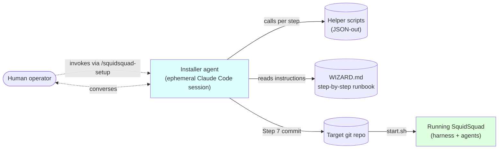
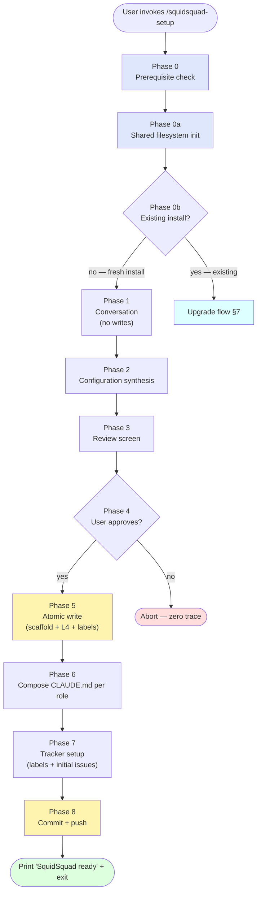
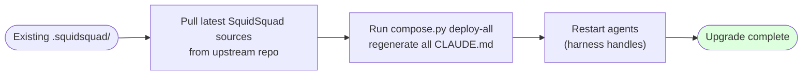

# Installer Architecture (v1 draft)

> **Status**: v1 draft, 2026-05-23. Architecture companion to the step-by-step runbook at [`references/wizard/WIZARD.md`](../references/wizard/WIZARD.md). This doc defines *how* the installer is structured; the runbook defines *what* the installer does at each step.
> **Companion docs**: [`ARCHITECTURE.md`](ARCHITECTURE.md) (overall system), [`AGENT-RUNTIME.md`](AGENT-RUNTIME.md) (what runs after install), [`COMPOSE-ARCHITECTURE.md`](COMPOSE-ARCHITECTURE.md) (how composed CLAUDE.md is generated; the installer invokes this), [`sub-skill-catalog.md`](sub-skill-catalog.md) (sub-skills the installer wires up).

---

## 1. Goal & scope

The SquidSquad installer turns a fresh git repo into a working multi-agent setup. It runs as an **ephemeral Claude Code agent** that walks the user through configuration, generates `.squidsquad/`, composes per-role CLAUDE.md outputs, sets up the tracker, and boots the harness.

In scope:

- How the installer is structured (agent + helpers + runbook)
- The phases an install passes through
- Inputs (human conversation + repo state) and outputs (`.squidsquad/` tree + GitHub labels + booted harness)
- The upgrade flow (vs first install)
- Idempotency and recovery

Out of scope:

- Step-by-step install instructions — see [`references/wizard/WIZARD.md`](../references/wizard/WIZARD.md)
- What agents *do* after install — see [`AGENT-RUNTIME.md`](AGENT-RUNTIME.md)
- How sub-skills compose into CLAUDE.md outputs — see [`COMPOSE-ARCHITECTURE.md`](COMPOSE-ARCHITECTURE.md)
- The L1-L4 model itself — see [COMPOSE-ARCHITECTURE.md §2](COMPOSE-ARCHITECTURE.md)

---

## 2. The installer's mental model



Three commitments:

1. **Ephemeral agent.** The installer is a one-shot Claude Code session. It boots, talks to the human, runs helpers, commits the final state, prints "SquidSquad ready", and exits. No background process, no daemon, no long-lived install state.
2. **Two phases — conversation, then commit.** Steps 0–6 are pure conversation + helper queries. Nothing is written to disk before Step 6 review screen approval. The user can abort at any point up to Step 7 with zero trace. Step 7 commits everything atomically (scaffold + L4 enrichment + labels + push).
3. **Idempotent re-runs.** Re-running the installer detects an existing `.squidsquad/` and routes to the upgrade flow (§7). Helpers like `shared_fs.py init` are idempotent — safe to run on re-installs.

---

## 3. Inputs and outputs

### 3.1 Inputs

| Source | What the installer reads |
|---|---|
| **Human conversation** | Project domain, team shape (which dev roles), loop interval, model routing preferences, tracker backend (GitHub Issues default, Forgejo alt), git workflow preferences. **NOT collected at install: tool/MCP/CLI configuration** — those are per-agent decisions made post-install (see §8). |
| **Repo state** | Git existence + branch + history; existing `.squidsquad/` (triggers upgrade flow); language/stack hints from filesystem |
| **Environment** | `gh` CLI installed + authenticated; Python 3 + `pip`; OS (Windows, macOS, Linux); `claude` CLI on PATH |
| **`~/.squidsquad/`** | Cross-install shared filesystem — existing secrets, clone registry, prior config |

### 3.2 Outputs

| Destination | What the installer writes |
|---|---|
| `.squidsquad/config.md` | Project config — iter interval, ship threshold, model routing, tracker backend, git workflow |
| `.squidsquad/<role>/` | Per-role agent directory (CLAUDE.md composed, SOUL.md, working-state.md skeleton, planning/, iterations/) — one per role in the team shape |
| `.squidsquad/project/` | L4 project-local seeds (copied from `references/sub-skills/project/` and enriched with conversational answers) |
| `.squidsquad/vault/` | Shared memory layer skeleton (BRIEFING.md + the five vault dirs: projects/, areas/, resources/, archives/, galaxy/) |
| `.squidsquad/.local-config` | Per-clone role→path mapping for `start.sh` to sync clones |
| `.squidsquad/.harness-port` (at runtime) | Port the harness listens on; written when the harness starts |
| `~/.squidsquad/secrets` | API keys for external models (restricted permissions, never committed to repo) |
| `~/.squidsquad/clones/` | Per-role git clones (if clone isolation enabled per [`feedback_clone_isolation`](MEMORY) — agents work in their own clones, project-local paths only) |
| **Forge (GitHub)** | Issue labels created via `gh label create` — status/role/type/priority/severity taxonomy |
| **Git commit** | Single atomic install commit on `main` (or the operator's chosen branch) |

---

## 4. Phases of install



### 4.1 Phase 0 — Prerequisite check

Verify the environment can run a SquidSquad install:

- `gh` CLI installed AND authenticated (`gh auth status`) — required for tracker
- Python 3 + `pip` — required for helpers
- `claude` CLI on PATH — required to spawn agents
- Git repo present + clean working tree (or operator-acknowledged)

Helper: `references/scripts/wizard.py check-gh` returns a JSON envelope with `ok: true | false` and a `stage: ready | installed | authenticated` field. The installer agent acts on the JSON, never invents environment checks.

### 4.2 Phase 0a — Shared filesystem init

`~/.squidsquad/` is the cross-install shared filesystem (one per user, not per repo). The installer creates if missing:

```
~/.squidsquad/
├── secrets        # API keys, restricted perms (0600)
├── config         # cross-install config
└── clones/        # per-install per-role clone trees (if clone isolation enabled)
```

Helper: `references/scripts/shared_fs.py init`. Idempotent — re-runs are safe.

### 4.3 Phase 0b — Re-run detection

If `.squidsquad/` exists in the target repo, this is an upgrade, not a fresh install. The installer routes to the upgrade flow (§7). Otherwise it proceeds to Phase 1.

### 4.4 Phase 1 — Conversation (no writes)

The installer talks to the human in domain terms — never internal jargon, never file paths, never script names. It collects:

- **Project details**: name, domain, audience, primary language/stack
- **Adaptive context questions**: branched based on stack and domain (e.g. mobile app vs CLI vs web service have different follow-ups)
- **Intent + specialist roster**: what dev roles are needed (`be`, `fe`, `ios`, `skill`, etc.)
- **Preset confirmation**: the wizard suggests a preset team shape; the human accepts or modifies
- **Loop interval**: cycle cadence (default 30 min for polling, irrelevant in event mode)
- **Model routing** (optional): which subagent task types route to which external model
- **Forge backend** (optional): default GitHub Issues; alternate Forgejo
- **Git workflow preferences**: branch model, commit prefix convention

Notably **NOT collected**: tool/MCP/CLI configuration. The installer does not ask "which design tool do you want?" or "which delivery target?". Tool setup is a per-agent runtime concern (see §8) — the human tells each agent post-install what tools it needs, and the agent persists that decision via L4 writes ([COMPOSE-ARCHITECTURE.md §7](COMPOSE-ARCHITECTURE.md)).

This phase writes nothing. All answers are held in the installer agent's conversation context. The user can abort with zero trace.

### 4.5 Phase 2 — Configuration synthesis

The installer assembles a single in-memory **install spec** from the conversation answers — a structured representation of the install:

```yaml
team_shape: [be, fe]
domain: "developer tooling"
loop_interval: 30
event_driven: no
tracker_backend: github
model_routing: { ... }
git_workflow: { ... }
```

Still no writes — the spec is in memory.

### 4.6 Phase 3 — Review screen

The installer shows the user the install spec in plain language: "I'm about to set up SquidSquad with: [be, fe] roles + pm + qa + dm; GitHub Issues tracker; 30-min loop; Figma design; local delivery; …". The human approves, edits, or aborts.

### 4.7 Phase 4–5 — Atomic write

Once approved, the installer:

1. **Cleans up** any prior partial state (if a previous interrupted install left artifacts).
2. **Serializes the install spec** to a temporary location for the scaffold step.
3. **Scaffolds `.squidsquad/`** — creates the role dirs, vault skeleton, project-local L4 directory, config.md, and per-role SOUL.md files. No tool/MCP wiring (per §8).
4. **Enriches L4 project files** (#6581) — fills in the seed templates from `references/sub-skills/project/` with the conversational answers (e.g. project domain, audience, conventions).
5. **Ensures GitHub labels** — creates the status/role/type/priority/severity label taxonomy via `gh label create` (idempotent per-label check).

Writes are local but not yet committed. Helpers handle the mechanical work; the installer agent acts on JSON outputs only.

### 4.8 Phase 6 — Compose per-role CLAUDE.md

For each role in the team shape (plus pm, qa, dm), the installer invokes:

```bash
python references/scripts/compose.py deploy <role>
```

`compose.py` reads the L1-L3 sub-skill sources + L4 project-local files and emits `.squidsquad/<role>/CLAUDE.md` per the [compose pipeline](COMPOSE-ARCHITECTURE.md). The composed output is a thin orchestration layer that references sub-skills — see [COMPOSE-ARCHITECTURE.md §4.5](COMPOSE-ARCHITECTURE.md).

### 4.9 Phase 7 — Tracker setup

Beyond the labels created in Phase 5, the installer may seed initial issues — e.g. issue #1 with the project's roadmap or onboarding tasks. This is configurable per-install and is the only place where the installer writes to the forge beyond labels.

### 4.10 Phase 8 — Commit + push

A single atomic commit on `main` (or the operator's chosen branch) containing the full `.squidsquad/` tree. Commit message follows the convention `wizard: SquidSquad install — <team_shape>`. Push to origin.

### 4.11 Phase 9 — Print "ready" message and exit

The installer prints a one-line confirmation with next steps — typically how to invoke `start.sh` to boot the harness — and exits its Claude Code session. No background process; the human is now in control.

---

## 5. File layout produced

The full `.squidsquad/` tree post-install (one role dir shown; pm/qa/dm are always present):

```
.squidsquad/
├── config.md                    # project config (interval, threshold, routing, tracker, git workflow)
├── <role>/                      # one per dev agent (be, fe, skill, etc.)
│   ├── CLAUDE.md                # composed orchestration (compose.py deploy <role>)
│   ├── SOUL.md                  # agent personality (copied verbatim from references/roles/<role>/SOUL.md)
│   ├── working-state.md         # crash-recovery checkpoint (skeleton)
│   ├── planning/                # per-task work files
│   └── iterations/              # iter-N.md cycle logs
├── pm/                          # always present
│   ├── CLAUDE.md, SOUL.md
│   ├── enhancements.md          # product backlog seed
│   ├── planning/                # RESEARCH/CONTEXT artifacts
│   ├── iterations/
│   └── migrations/              # legacy migration logs
├── qa/                          # always present; qa-log.md added
├── dm/                          # always present
├── project/                     # L4 (enriched from references/sub-skills/project/ seeds)
│   ├── shared-{instructions,responsibility,soul-directives}.md
│   ├── <role>-{instructions,responsibility,soul-directives}.md per role
│   └── setup-upgrade-gate.md
├── vault/                       # shared memory (pm + worker R/W, qa + dm read-only)
│   ├── BRIEFING.md
│   ├── projects/
│   ├── areas/
│   ├── resources/
│   ├── archives/
│   └── galaxy/
├── .local-config                # per-clone role→path map (read by start.sh)
└── (runtime) .harness-port, .harness-state.json, .event-state.json — created when the harness boots
```

And the per-user shared filesystem (not part of any single repo):

```
~/.squidsquad/
├── secrets         # API keys (chmod 0600)
├── config          # cross-install config
└── clones/         # per-install per-role git clones (if clone isolation enabled)
```

---

## 6. Helper scripts (the installer's mechanical layer)

The installer agent never invents behavior the helpers already implement. Every helper prints a JSON envelope with `ok: true | false` and a payload — the installer acts on the JSON.

| Helper | Purpose |
|---|---|
| `references/scripts/wizard.py` | Main wizard helper with sub-commands per install step (`check-gh`, `detect-stack`, `scaffold`, `enrich-l4`, `ensure-labels`, `serialize-spec`, etc.) |
| `references/scripts/shared_fs.py` | Initializes and manages `~/.squidsquad/` (secrets, clones registry, cross-install config) |
| `references/scripts/compose.py` | Generates `.squidsquad/<role>/CLAUDE.md` from L1-L4 sources — see [COMPOSE-ARCHITECTURE.md](COMPOSE-ARCHITECTURE.md) |
| `references/scripts/forgejo_setup.py` | Forgejo backend init (alternate tracker; see §9) |
| `references/scripts/tracker.py` | The tracker abstraction layer — agents use this at runtime; the installer uses its label-creation paths at Phase 5 |
| `start.sh` | Post-install boot script — ensures Python deps, syncs all clones, runs the harness |

---

## 7. The installer agent (Q-new21)

The installer is a Claude Code session activated via the `squidsquad-setup` skill (or `/squidsquad-setup` slash command). Its full runbook is at [`references/wizard/WIZARD.md`](../references/wizard/WIZARD.md) — 700+ lines of per-step instructions.

Key contracts:

- **Reads the runbook**, doesn't improvise. Every step has explicit success/failure pathways.
- **Calls helpers for mechanical work** (file I/O, gh API, label creation). Never replicates helper logic in conversation.
- **Speaks in domain terms** — never mentions internal files, status labels, or script names unless inside a troubleshooting block.
- **One question at a time.** No multi-question forms; conversational pacing.
- **Ephemeral**: exits after Phase 9. The harness, agents, and ongoing operations are handled by [AGENT-RUNTIME.md](AGENT-RUNTIME.md) and are no longer the installer's concern.

---

## 8. Tool/MCP/CLI setup is per-agent and post-install

SquidSquad's install does NOT pre-wire tool integrations. There is no "capability" concept in the install — no design-tool selection, no delivery-target selection, no MCP/CLI bundling per role. The installer leaves every agent **tool-naked at first boot**.

### 8.1 Why

The space of role × tool combinations is large and project-specific (designer worker uses Figma here, Sketch there, local HTML somewhere else; a `worker` may need `kubectl` here, `gcloud` there, neither in a third install). Predefining role+capability bundles would either be too narrow to cover real installs, or too broad to be useful. Trying to capture it via PM-driven "choose your capabilities" conversation at install time produces vague, low-fidelity decisions before the human knows what they need.

### 8.2 The model: agent learns its own tools post-install

After install, each running agent can be told by the human:

> "From now on, when you do design work, use the Figma MCP server at `<URL>`. Here's the API key."
> "When you deploy, use `gcloud` not `kubectl`. The project ID is `<id>`."
> "Install the `playwright` MCP server and use it for E2E browser tests."

The agent treats this as a runtime L4 write per [COMPOSE-ARCHITECTURE.md §7](COMPOSE-ARCHITECTURE.md):

1. Agent classifies the directive (`append` / `insert-before` / `insert-after` / `replace` on its `instructions` or `project-context` slot).
2. DeepSeek audit + mini-CQ ([COMPOSE-ARCHITECTURE.md §7.4](COMPOSE-ARCHITECTURE.md)) gates the write.
3. If approved, the agent persists the directive to a new L4 file in `.squidsquad/project/` with proper frontmatter, then triggers a recompose.
4. The next session boots with the new tool/MCP/CLI wired into its CLAUDE.md as if it had always been there.

API keys and secrets stay in `~/.squidsquad/secrets` (created by the installer's Phase 0a `shared_fs.py init`); the L4 file references them by name, not by value.

### 8.3 What the installer does NOT do

- No `capabilities/` sub-skill set in the install scaffold.
- No `setup.md` walk per tool.
- No `common/capability-check` sub-skill in any role's compose manifest.
- No `Capabilities:` section in `config.md`.

The existing `references/sub-skills/capabilities/` directory and `common/capability-check.md` are slated for removal — they are architectural deadwood from the prior model. Tracker: follow-up issue against `worker` (skill) when this doc lands.

### 8.4 What if an agent needs a tool it doesn't know about yet?

The agent surfaces the gap to the human via the normal `/work/assign` → `pm` routing with `event_context="process-concern"` (see [AGENT-RUNTIME.md §7.3](AGENT-RUNTIME.md)). PM either prompts the human for direction or surfaces it at the next check-in. The human's directive becomes an L4 write per §8.2. No installer involvement.

---

## 9. Tracker backend selection

The default tracker backend is **GitHub Issues** — the canonical tracker described throughout SquidSquad's docs and used by the team in `.squidsquad/`.

`references/scripts/tracker.py` is the abstraction layer per [`project_tracker_abstraction`](MEMORY) — non-GitHub backends are planned post-v1. As of this doc:

- **GitHub Issues** (default): the installer creates the standard label taxonomy via `gh label create` in Phase 5.
- **Forgejo** (experimental): `references/scripts/forgejo_setup.py` provides the alternate-backend init flow. The installer offers this at Phase 5c if the human explicitly requests it.

The choice is recorded in `config.md` under `Tracker Backend`. Agents read it at boot and route their tracker calls accordingly through `tracker.py`.

---

## 10. Upgrade flow

When the installer detects an existing `.squidsquad/` at Phase 0b, it routes here instead of the fresh-install path.

The upgrade model is intentionally simple:



**Steps:**

1. **Pull** the latest SquidSquad sources from upstream into `references/` (this includes the latest L1-L3 sub-skills, role files, manifests, and helper scripts).
2. **Recompose** every role's CLAUDE.md by running `compose.py deploy-all`. The composed outputs reflect the new sub-skill versions.
3. **Restart** affected agents via the harness so they pick up the new CLAUDE.md on next session start.

**What stays untouched during upgrade:**

- `.squidsquad/project/` — L4 project-local customizations
- `.squidsquad/vault/` — shared memory layer
- `.squidsquad/<role>/working-state.md`, `iterations/`, `planning/` — agent state
- `config.md` — project configuration (the installer may *add* new fields with defaults if the new version requires them, but it never overwrites existing fields)
- GitHub Issue labels — already present from prior install

**What's regenerated:**

- `.squidsquad/<role>/CLAUDE.md` — composed orchestration
- `.squidsquad/<role>/SOUL.md` — copied fresh from the new `references/roles/<role>/SOUL.md`

**Migration steps** when an upgrade requires structural changes (e.g. a new sub-skill that needs a config field, or a renamed L4 file): the upgrade flow may invoke a one-off migration helper before recompose. Each such migration is filed as a separate helper script with idempotent semantics. As of this doc no such migrations exist.

---

## 11. Idempotency & recovery

### 11.1 Safe re-run guarantees

The installer is designed to be safe to re-run:

- **Phases 0–6** make no changes the user can see (Phase 0a `shared_fs.py init` is idempotent — creates dirs only if absent).
- **Phase 5 atomic write** uses a "scaffold then write" pattern — failures partway leave the filesystem in a state the next re-run can clean up via Phase 5.1 ("Full rebuild cleanup if applicable" per WIZARD.md §7.1).
- **Phase 5 label creation** is per-label idempotent (`gh label create` skips existing labels).
- **Phase 6 compose** is fully deterministic — same sources + L4 → same composed CLAUDE.md.

### 11.2 Interrupted install recovery

If the installer is interrupted mid-Phase-5 (filesystem partially scaffolded), re-running detects the partial state and offers a "clean rebuild" option that wipes `.squidsquad/` (preserving `vault/` and `project/`) and starts Phase 5 fresh.

If the installer is interrupted between Phase 7 and Phase 8 (forge labels created, no commit yet), re-running detects the no-commit state and offers to commit the existing scaffold rather than redoing it.

### 11.3 What never gets wiped

Across both upgrade and clean-rebuild, these are always preserved:

- `.squidsquad/vault/` — shared memory; lossy here is irrecoverable
- `.squidsquad/project/` — L4 customizations; lossy here means the install loses its bespoke configuration
- `.squidsquad/<role>/working-state.md`, `iterations/`, `planning/` — agent state

---

## 12. Open questions & gaps

- **G1** — Migration steps for pre-#9925 installs (before the four-layer responsibility model). The upgrade flow assumes the existing install already has the L1-L4 structure; pre-#9925 installs would need a one-off migration. Not yet specified.
- **G2** — L4 backfill from the human's auto-memory directory (`~/.claude/projects/<repo>/memory/`) — referenced from [COMPOSE-ARCHITECTURE.md §10.4](COMPOSE-ARCHITECTURE.md) but not yet implemented as an installer step. Open: should the installer offer to import these on upgrade, or is this a separate one-off tool?
- **G3** — Multi-tenant install (one repo hosting multiple SquidSquad teams) — likely deferred. Today's model is one SquidSquad install per repo.
- **G4** — Atomic install across Phase 5–8. Today the scaffold (Phase 5) writes locally before the commit (Phase 8); a hard crash between them leaves the filesystem written but no git history. The cleanup path in Phase 5.1 handles this, but the model isn't truly atomic.
- **G5** — ✅ MOOT (rev: capability removal). The previous concern about "capability hot-swap at install time" is no longer applicable — tool/MCP/CLI configuration is per-agent post-install per §8, not an install-time concern. Adding or swapping a tool is a runtime L4 write, not a re-run-the-installer flow.

---

## 13. References

- [`references/wizard/WIZARD.md`](../references/wizard/WIZARD.md) — the step-by-step installer runbook (700+ lines)
- [`references/scripts/wizard.py`](../references/scripts/wizard.py) — main wizard helper
- [`references/scripts/shared_fs.py`](../references/scripts/shared_fs.py) — shared filesystem init
- [`references/scripts/compose.py`](../references/scripts/compose.py) — compose pipeline
- [`references/scripts/forgejo_setup.py`](../references/scripts/forgejo_setup.py) — Forgejo backend (alt tracker)
- [`start.sh`](../start.sh) — post-install boot script
- [`AGENT-RUNTIME.md`](AGENT-RUNTIME.md) — what runs after install
- [`COMPOSE-ARCHITECTURE.md`](COMPOSE-ARCHITECTURE.md) — composed CLAUDE.md generation
- [`sub-skill-catalog.md`](sub-skill-catalog.md) — sub-skills the installer wires up
- [`ARCHITECTURE.md`](ARCHITECTURE.md) — overall system architecture

---

## 14. Revision log

- **2026-05-23 (v1 draft)** — initial draft. Consolidates the install flow into one architecture doc, distinct from the step-by-step WIZARD.md runbook. Locks the two-phase (conversation, then atomic commit) model, the ephemeral-installer-agent commitment, and the simple "pull latest sources + recompose" upgrade flow. Open gaps in §12 carry forward to follow-up issues.
- **2026-05-23 (v1 draft, capability removal)** — §8 rewritten. SquidSquad no longer has a "capability" framework at install time. Tool/MCP/CLI configuration is per-agent post-install: the human tells each agent what tools to use, the agent persists via L4 writes per [COMPOSE-ARCHITECTURE.md §7](COMPOSE-ARCHITECTURE.md). All references in §3 (inputs), §4 (Phase 1 conversation, Phase 5 atomic write), and §5 (file layout) updated to drop capability mentions. The prior `references/sub-skills/capabilities/` directory and `common/capability-check.md` are marked as architectural deadwood; follow-up task against `worker` (skill) to remove them.
