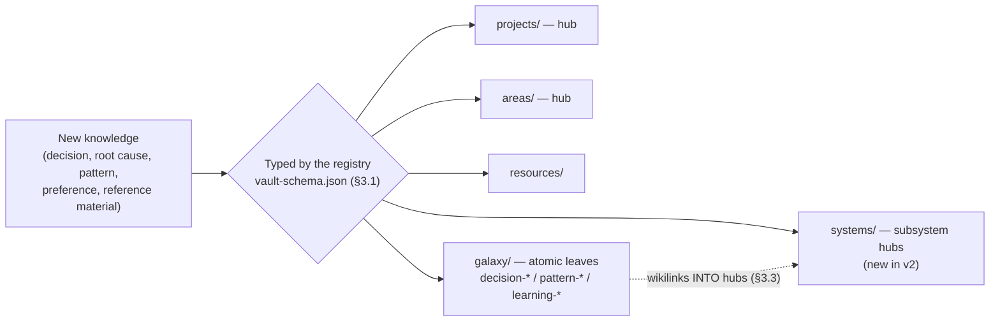
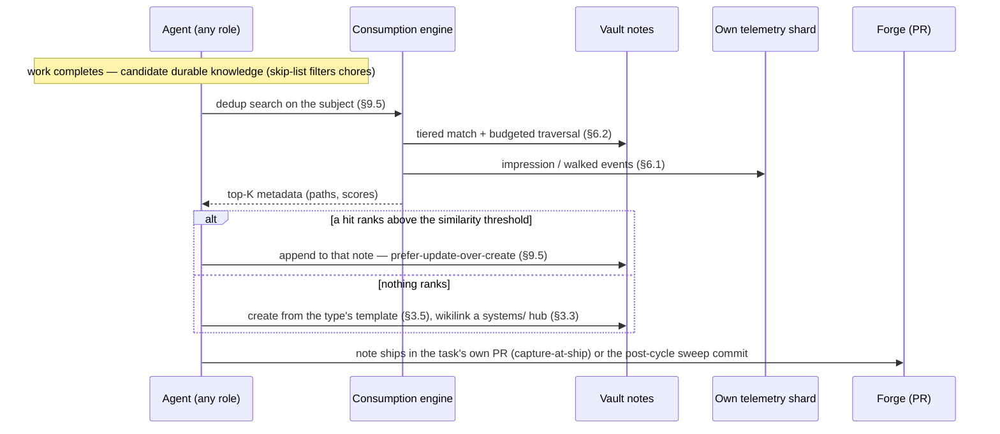
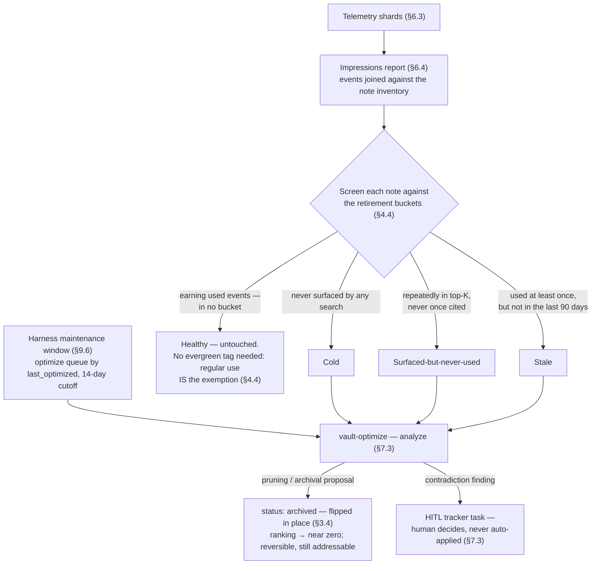

# Vault Architecture (v2 — target design)

> **Status**: v2 TRD draft, **all sections v2 as of 2026-07-18** (tracked on #10003, draft PR #13708 — pending DS audit + operator review). This is a **prescriptive target design**, not a snapshot of current code; v1 behavior remains live until the M4 cutover (§10.5). Locked decisions are marked inline (e.g. §6.3 telemetry storage — operator-confirmed 2026-07-18); open items are consolidated in §11. The one residual unknown: the portable engine package's concrete Skill surface (§7.5/§11 #1).
>
> **Why v2**: research comparing SquidSquad's vault against a reference agent-memory system — a mature, actively-used single-agent memory system studied in the vault comparison — found SquidSquad's vault functions as a static decision log, not living institutional memory — full analysis in the vault-comparison planning doc in `.squidsquad/pm/planning/` (the “planning doc” hereafter). The root cause: consumption (search, ranking, verified usage) was never instrumented, so the write side curates blind and nothing measures whether captured knowledge is ever used. v2 ports the reference system's consumption-pipeline pattern and telemetry-driven ranking as **domain-agnostic infrastructure** — not its SWE-specific taxonomy, which would be wrong for SquidSquad's general-purpose (non-technical-team) audience. See the planning doc §9 (design) and §10 (scope correction + resolved decisions) for the full reasoning this doc formalizes.
>
> **Companion docs**: [`ARCHITECTURE.md`](ARCHITECTURE.md) (overall system; vault appears as "L6 Memory"), [`AGENT-RUNTIME.md`](AGENT-RUNTIME.md) (cycle integration), [`COMPOSE-ARCHITECTURE.md`](COMPOSE-ARCHITECTURE.md) (vault slot in composed CLAUDE.md), [`sub-skill-catalog.md`](sub-skill-catalog.md) (vault sub-skill entries).
>
> **No implementation tasks get filed against this redesign until this TRD is human-reviewed and merged** (doc-first process).

---

## 1. Goal & scope

This doc describes the **v2 target design**:

- What the vault *is* — its purpose, the storage model, the entity types it holds
- The config-driven type registry that replaces v1's hardcoded PARAG (Projects / Areas / Resources / Archives / Galaxy) taxonomy
- The consumption engine (search + telemetry-driven ranking) and how it's invoked
- The consumption-pipeline pattern — mandatory touchpoints producing committed receipts
- The sub-skills and scripts that operate on it
- How it integrates into the cycle (boot, task-creation, creative phase, capture-at-ship, quiet ticks)
- The migration path from v1's live content
- Known open decisions still needing resolution before/during implementation

It does NOT describe per-role-class access (read/write); that lives in [`AGENT-RUNTIME.md`](AGENT-RUNTIME.md) and [`COMPOSE-ARCHITECTURE.md`](COMPOSE-ARCHITECTURE.md) where the per-role-class `includes.yml` mapping is composed.

**Vault slot authorship is L1-exclusive** (guardrail dated 2026-05-29, carried forward into v2). The composed `## Vault` section in every agent's CLAUDE.md is authored entirely by L1 fragments shipped from this repo — L2 / L3 / L4 cannot contribute `slot: vault` content. **What changes in v2**: the type-registry (`vault-schema.json`, §3) IS the sanctioned per-install customization point — a project can define its own note types without touching the L1-exclusive slot content, resolving the old "projects that need bespoke vault behaviour file a framework feature request" limitation for the taxonomy specifically. The read/write *protocol* (search contract, telemetry, receipts) remains framework-owned.

It does NOT describe:

- The actual implementation (vault_search.py, migration script, etc.) — those are implementation tasks this TRD unblocks, filed separately once this lands
- How vault slot content gets into composed CLAUDE.md (see [COMPOSE-ARCHITECTURE.md](COMPOSE-ARCHITECTURE.md) §5.6)
- The L4 project-local layer in `.squidsquad/project/` (different system; see [COMPOSE-ARCHITECTURE.md](COMPOSE-ARCHITECTURE.md) §3)

---

## 2. What the vault is

> **Vault terminology** — this doc and COMPOSE-ARCHITECTURE use three distinct terms; conflating them is the source of long-running audit confusion:
>
> | Term | What it is | Authored by | Read by |
> |---|---|---|---|
> | **vault slot** | The `## Vault` H2 section in composed CLAUDE.md — short framework-shipped prose describing the vault contract | L1 only (this slot is L1-exclusive per COMPOSE-ARCHITECTURE §3.3) | Runtime agents at boot |
> | **vault store** | The on-disk knowledge store at `.squidsquad/vault/` (markdown notes organized via PARAG) | All agents at runtime via vault sub-skills (vault-remember, etc.) | All agents at runtime |
> | **vault contract** | The framework-owned design spec — type registry, entity model, wikilink grammar, search + telemetry contracts | SquidSquad framework (`references/sub-skills/common/vault-protocol.md` + this doc) | Vault sub-skills + agents that read the slot |
>
> When this doc says "vault" without a qualifier, assume the most specific applicable term from context. When the meaning is structurally significant (e.g., "L1-exclusive"), the qualifier is mandatory.

The vault store is a **shared, git-tracked, per-install knowledge store** at `.squidsquad/vault/`. It holds institutional knowledge that outlives any single cycle, task, or session — decisions, learnings, patterns, project context, ongoing concerns, and human preferences as the agents have observed them.

Four properties define it (the fourth is new in v2):

1. **Shared across roles** — all agents in the install read the vault, and so does the human. Write access is restricted; specifics on which agents write live in [`AGENT-RUNTIME.md`](AGENT-RUNTIME.md) (cycle integration) and [`COMPOSE-ARCHITECTURE.md`](COMPOSE-ARCHITECTURE.md) (sub-skill composition).
2. **Git-tracked** — every note has a commit; every change has authorship and timestamp. There is no separate database, indexer, or memory service. (Telemetry, §6, is git-tracked too — but as append-only per-writer event shards under `vault/.telemetry/`, never as note content; see §6.3.)
3. **Per-install** — `.squidsquad/vault/` lives inside the project repo's `.squidsquad/` tree. A separate SquidSquad install has its own vault; there is no cross-install vault today.
4. **Consumption-instrumented (v2)** — every search and every cited use is an event (`impression`/`walked`/`used`, §6.1). This is the property v1 lacked entirely: nothing measured whether a written note was ever read, so the write side curated blind and dead notes accumulated indefinitely. v2 makes consumption a first-class, measurable signal that ranking and maintenance both consume.

The vault is **distinct from**:

- **L4 project-local content** (`.squidsquad/project/`): instruction overlays composed into CLAUDE.md. L4 is *what the agent does*; vault is *what the squad knows*.
- **Working state** (`.squidsquad/<role>/working-state.md`): per-cycle crash-recovery checkpoint, single-agent-owned. Working state is *what this agent is doing right now*; vault is *what the squad has learned over time*.
- **Iteration logs** (`.squidsquad/<role>/iterations/iter-N.md`): per-cycle activity log. Iteration logs are *what happened this cycle*; vault is the *durable filtered residue*.

### 2.1 The vault at a glance

Three high-level orientation views before the deep sections: where documents live and flow (§3), how information enters (§9.5 + §6), and a worked retrieval example (§9.2–§9.4). Every element shown is specified in the cited section — these views add no semantics of their own.

**How documents flow through the PARAG structure** (§3):



A note never moves after that: its lifecycle is a `status:` flip in place (`active → archived / superseded`, §3.4), and §6.2's ranking — not a folder move — is what removes retired notes from default search results. Hubs (`projects/`, `areas/`, `systems/`) are free to traverse; galaxy leaves cost traversal budget (§3.2) — which is why leaves link *into* hubs: the hub layer is what makes graph search productive.

**How information enters the vault** (§9.5 write paths, §6 engine):



Both write paths — capture-at-ship (worker, pre-PR) and the end-of-cycle `vault-remember` sweep (every role) — funnel through this same engine-gated shape; write budgets and role lanes throttle them (§9.5).

**Worked example — matching a vault item** (illustrative names; the consumption pipeline, §9.2–§9.4):

> **1. PM files a task** — *"harness restart loses status-bar state."* Intake runs an engine search on the task's keywords. The engine matches the `[[harness]]` systems hub (filename tier) and walks one budgeted hop through its inbound links to two galaxy leaves. The issue body gains:
>
> ```
> ## Vault context
> - [[harness]] — subsystem hub: restart semantics, intent state machine
> - [[learning-proactor-loop-two-bugs]] — prior restart-adjacent root cause
> - [[decision-harness-sole-lifecycle]] — harness owns all agent start/stop
> ```
>
> Each listed note earns an `impression` event tagged with the task number (§9.2).
>
> **2. The dev agent picks up the task** — reads the issue body first (house rule), Reads the notes it judges relevant, and its plan/lineage file — shipped in the PR diff — carries the receipt (§9.3):
>
> ```
> ## Vault context consumed
> - [[decision-harness-sole-lifecycle]] — constrained the fix to harness-side persistence
> ## Applicable rules
> - none matched
> ```
>
> The cited note earns a `used` event — written by the consumer, never by the engine (§6.1's load-bearing split).
>
> **3. The verifier checks** — receipt sections present in the lineage file in the PR diff (the canonical location)? Implementation violates no listed rule? A missing receipt routes the task back, same as any other gap (§9.4).
>
> **4. Telemetry closes the loop** — the cited note now sits outside all three retirement buckets of the impressions report (§4.4, §6.4); a note that keeps surfacing without ever earning `used` drifts toward the pruning proposals instead.

**How notes retire — the optimization decision** (§4.4 buckets, §6.4 report, §7.3/§9.6 maintenance):



The decision input is **usage, never age**: v1's time-based confidence decay is gone entirely (§4.4), so an old-but-consulted note never retires, and a young-but-dead note doesn't get a grace period. Archival is a reversible status flip, not a deletion — §6.2's ranking is what takes the note out of circulation, and a direct query can always still reach it. Only contradiction findings cross a human gate; bucket-driven archival proposals ride the normal analyze-then-apply maintenance flow.

---

## 3. On-disk layout — PARAG

### 3.0 What actually changes here, and why

**PARAG (Projects / Areas / Resources / Archives / Galaxy — the five-folder taxonomy; `archives/` is no longer a physical destination per §3.4, and `systems/` post-dates the acronym) itself is not the diagnosis.** Nothing in the vault comparison shows PARAG's actionability-based sorting caused SquidSquad's vault to underperform — SquidSquad simply never ran long enough, at scale, with real consumption pressure, to find out whether the folder axis mattered. What the comparison *does* show is that the reference system's two structural additions — **a connected graph via dedicated hub/entity notes with budgeted traversal**, and **telemetry-driven ranking** (§6) — are directly responsible for its vault staying useful under real load. SquidSquad had neither. §3 replaces the *hardcoded* part of v1's layout (a single taxonomy baked into scripts and sub-skill prose, with no reachable hub layer) and adds the *missing* part (graph connectivity); it does not throw away PARAG on the strength of an unproven complaint.

Two changes, independent of each other:

1. **The taxonomy becomes configurable** (`vault-schema.json`, §3.1) — required regardless of what SquidSquad's own install picks, because SquidSquad is general-purpose (marketing/ops/content teams, not just SWE) and a hardcoded taxonomy is wrong for installs that aren't SquidSquad-on-SquidSquad.
2. **SquidSquad's own default profile keeps PARAG** (§3.2) — the folders don't change — but gains a genuine **hub/connective layer** (the reference system's missing-in-v1 piece, gap G6 in the planning doc) and a **traversal-budget** classification per type, so search can walk the graph instead of grepping a flat pile.

### 3.1 The type registry — `vault-schema.json`

Each install's vault ships a `vault-schema.json` at the vault root defining its own note types. Nothing in the engine, the validator, or the templates hardcodes folder names — everything reads this registry.

```json
{
  "traversalBudget": 2,
  "searchTopK": 12,
  "dedupThreshold": "<set at implementation — §11 #6>",
  "tieBreakWeights": { "used": 2.0, "impression": 0.25, "walked": 0.5, "recency": 0.25 },
  "types": {
    "<type-name>": {
      "folder": "<folder>",
      "traversal": "free | budgeted",
      "weight": "<number 0.0-1.0>",
      "hub": "<true | false>",
      "prefix": "<optional filename prefix, for types sharing a folder>"
    }
  }
}
```

- **`traversal: free`** — connective/hub types. Free to traverse — following a wikilink through one of these doesn't cost budget. Dense knowledge notes can cluster around them without the traversal budget running out before reaching related content.
- **`traversal: budgeted`** — dense knowledge types (SquidSquad's galaxy leaves). Each hop through one of these costs 1 unit of `traversalBudget` (default 2, per the reference system's tuned value) — keeps search on-topic instead of wandering the whole graph.
- **`hub: true`** — marks a type as the connective layer specifically (a stronger signal than `traversal: free` alone — used by §3.3's hub-linking convention and by the search engine's ranking to slightly favor hub notes as entry points).
- **`weight`** — per-type multiplier in the ranking tiebreak (§6.2), separate from the traversal classification.

An install customizes its taxonomy by editing this file — no code or sub-skill change required. `vault-init`, `vault-create`, `vault_check.py`, and the search engine all read it.

### 3.2 SquidSquad's own default profile — PARAG kept, hub layer added

```json
{
  "traversalBudget": 2,
  "searchTopK": 12,
  "dedupThreshold": "<number 0.0-1.0>",
  "tieBreakWeights": { "used": 2.0, "impression": 0.25, "walked": 0.5, "recency": 0.25 },
  "types": {
    "project":  { "folder": "projects",  "traversal": "free",     "weight": 0.8, "hub": true },
    "area":     { "folder": "areas",     "traversal": "free",     "weight": 0.8, "hub": true },
    "resource": { "folder": "resources", "traversal": "free",     "weight": 0.6, "hub": false },
    "decision": { "folder": "galaxy",    "traversal": "budgeted", "weight": 1.0, "hub": false, "prefix": "decision-" },
    "pattern":  { "folder": "galaxy",    "traversal": "budgeted", "weight": 1.0, "hub": false, "prefix": "pattern-" },
    "learning": { "folder": "galaxy",    "traversal": "budgeted", "weight": 1.0, "hub": false, "prefix": "learning-" },
    "system":   { "folder": "systems",   "traversal": "free",     "weight": 0.8, "hub": true }
  }
}
```

The folder layout stays PARAG, unchanged:

```
.squidsquad/vault/
├── BRIEFING.md         # active-context summary, ~50 lines target
├── vault-schema.json   # the type registry above
├── projects/           # active project context, goals, constraints
├── areas/              # ongoing concerns: human prefs, code conventions
├── resources/          # reference material, external docs, research
├── systems/            # NEW — hub notes for subsystems the squad keeps learning
│                        #   about (harness, event bus, compose pipeline, tracker,
│                        #   pr_merge, vault itself, ...): connective tissue with
│                        #   no actionability semantics, just a place galaxy
│                        #   leaves link INTO
├── archives/            # shipped features, closed decisions (now: status:archived
│                        #   on any type, no forced folder move — see §3.4)
├── galaxy/              # atomic knowledge notes (Zettelkasten):
│                        # decision-*, pattern-*, learning-*
└── .obsidian/           # optional Obsidian app config (gitignored)
```

**What's new**: `systems/` — the one gap PARAG genuinely had no answer for. §11.4 of v1 (gap G6, "no connective entity layer") observed that galaxy notes are 95% flat leaves with almost no hubs, so even a working search engine would have little graph to traverse. `systems/` notes are entity references for subsystems the squad repeatedly learns about — one note per subsystem (harness, event bus, compose pipeline, tracker, pr_merge, launcher, vault itself), each accumulating inbound wikilinks from the galaxy leaves that touch it. This is the direct fix for G6, and it's additive — nothing existing moves.

**What's dropped**: `style-*` galaxy notes (zero ever written in ~3 months of operation, per v1 §10.2 — folded into `pattern-*`, no evidence a fourth prefix was ever needed) and the `pattern-posture-*` subtype tag (superseded by `system` hub notes for cross-cutting principles — a posture is really "a decision that spans multiple systems," which the graph now expresses via wikilinks rather than a special tag).

**Migration cost**: near-zero for existing content — every current galaxy/areas/projects/resources note keeps its folder and (mostly) its type. The only *new* content required is authoring the initial `systems/` hub set (~7-10 notes) and retroactively linking existing galaxy leaves to the hub they're about — this is the M2 distillation pass from the planning doc §9.5.

### 3.3 Hub-linking convention

A galaxy note SHOULD wikilink to at least one `systems/` hub if its subject matter clearly belongs to one (e.g., a `learning-*` about a harness restart bug links `[[harness]]`). This isn't enforced at write time (a false requirement would just get rubber-stamped), but `vault_check.py`'s Level 2 sweep flags galaxy notes with zero hub links as a maintenance signal — "orphaned from the graph" is a distinct, cheaper-to-fix defect from "orphaned from any other note" (v1's existing orphan check).

### 3.4 How notes move — archived by status, not by folder

v1 moved notes physically from an active folder to `archives/` on archival. v2 drops the forced move: any note's `status:` flips to `archived` in place. Two reasons this is better, both learned from the reference system:

1. **Simpler engine.** The search engine and the file-path-based dedup logic don't need a "did this note's path change" special case — a note's identity (its path) never changes on status transitions, only on explicit rename (a distinct operation; §4.5's redirect-map mechanism covers it).
2. **Ranking, not relocation, does the work.** §6.2's ranking formula scores `superseded`/`archived` notes near zero (still discoverable via direct search, just never surfaces as a default top-K result) — the same effect v1's folder-move achieved, without a file-move needing to happen at all.

`archives/` survives as a *type* (`status: archived` on any note, any folder) rather than a folder notes get physically relocated into. Existing physically-archived v1 notes migrate in place (folder stays, `status:` already says `archived`) — no data movement needed at migration time.

### 3.5 Templates

Vault templates live at `references/vault-templates/` and are the seed content for new notes — framework-shipped, only consulted by vault sub-skill operations, never read at agent runtime. What changes in v2: **the template set is derived from the type registry, not a hardcoded list.** Every type registered in `vault-schema.json` (§3.1) has a corresponding template (`<type>.md`), resolved by folder+type at note-creation time; an install that registers a custom type supplies a template for it (falling back to a generic skeleton if absent). Plus one special template outside the registry: `briefing.md` (the `BRIEFING.md` skeleton + section order, §5 — BRIEFING is not a typed note).

For SquidSquad's own profile (§3.2) that means: `project.md`, `area.md`, `resource.md`, `system.md` (new — hub-note skeleton), `decision.md`, `pattern.md`, `learning.md`. The v1 `style.md` template is deleted with its type (§4.2). Templates are not subject to the §4 frontmatter spec themselves; their job is to produce notes that conform.

---

## 4. Entity model

### 4.1 By folder

Derived entirely from the install's `vault-schema.json` (§3.1) — the table below is SquidSquad's own default profile (§3.2), not a framework-hardcoded mapping.

| Folder | Entity types | Traversal | Lifespan | Growth model |
|---|---|---|---|---|
| `projects/` | `project` | free (hub) | While project active | One note per project; updated as scope evolves |
| `areas/` | `area` | free (hub) | Ongoing | Few notes (typical: human-profile, code-conventions); grow freely |
| `resources/` | `resource` | free | While referenced | One note per reference; prefer linking to externals |
| `systems/` | `system` | free (hub) | Forever (connective) | ~7-10 initial notes (harness, event bus, compose pipeline, ...); grows slowly, one per subsystem the squad repeatedly learns about |
| `galaxy/` | `decision`, `pattern`, `learning` | **budgeted** | Forever (Zettelkasten) | Atomic; max ~500 lines each; split if larger |

`archives/` is **retired as a folder** (§3.4) — archival is a `status:` value on any note, any type, in its existing folder.

### 4.2 By note name prefix (galaxy only)

| Prefix | Type | Purpose |
|---|---|---|
| `decision-` | `decision` | Architectural choice, trade-off, or commitment |
| `pattern-` | `pattern` | Reusable pattern discovered or confirmed |
| `learning-` | `learning` | Something that failed or succeeded unexpectedly |

**Dropped from v1**: `style-` (zero notes ever written; folds into `pattern-` — a style preference is just a pattern about how, not what) and the `pattern + posture` tag subtype (superseded by `systems/` hub notes, §3.2 — a posture is a decision that spans multiple systems, now expressed via wikilinks to the relevant `systems/` hubs rather than a special tag).

### 4.2a Consistency rules (folder + prefix + type)

Same two-field agreement as v1, now checked against the schema registry instead of a hardcoded table:

1. **Folder ↔ type**: a note's folder must match its `type:`'s registered `folder` in `vault-schema.json` (§3.1).
2. **Prefix ↔ type**: where a type declares a `prefix` in the registry (§3.1 — SquidSquad's profile declares them for the three galaxy types sharing one folder), filenames must carry it: `decision-X.md` → `type: decision`; `pattern-X.md` → `type: pattern`; `learning-X.md` → `type: learning`. Types without a declared prefix skip this check — so custom installs get prefix validation only when they opt in via the registry.
3. **Validation**: `vault_check.py check-structure` reads `vault-schema.json` at runtime — an install that adds a custom type gets consistency checking for free, no code change needed. (v1's hardcoded version of this check is tracked at #10098, closed as superseded — the schema-driven version replaces it, not extends it.)

### 4.3 Required frontmatter (all notes)

```yaml
---
type: <per vault-schema.json registry>
tags: [list]                          # see Tag convention below
created: YYYY-MM-DD
updated: YYYY-MM-DD
status: active | superseded | archived
owner: pm | worker | verifier | dm | shared   # primary author role-class
community: <string>                   # optional — cluster label, set by vault-optimize (§7.3)
subcommunity: <string>                # optional — sub-cluster within community
last_optimized: YYYY-MM-DD            # optional — last time an optimize pass touched this note
---
```

**Dropped from v1**: `confidence` (was write-only — nothing ever consumed it for ranking or filtering; operator decision 2026-07-18, reintroduce only if a real ranking need surfaces with an actual consumer) and `source` (conversation/review/observation/research — provenance-of-claim metadata that, like `confidence`, had no downstream consumer). `links` is also dropped — v1 auto-maintained a `links:` field from body wikilinks via `vault_optimize.py reindex`; v2's search engine computes the link graph live from body content instead, so a stored, driftable copy is unnecessary.

**Not in frontmatter, ever**: `impression` / `used` / `walked` / `last_impression` — these look like note-level counters but are **telemetry**, not content. They live in the git-tracked per-writer telemetry shards (§6.3) and are joined against note content at query/read time — never written to the `.md` file. This is a deliberate divergence from the reference system (which bumps these as frontmatter counters, livable for one dev on one checkout but a merge-conflict generator for N agents in N clones — the planning doc §9.4 P1). The shard design (§6.3) makes the conflict class structurally impossible instead of auto-resolving it — "notes stay pure content" was always the load-bearing half of the planning doc §9.4 rule, and it survives unchanged.

**Ownership note** (`owner:` field): unchanged from v1 — authored role-class of the note's content, `owner: shared` for content that benefits multiple roles. The pre-#6274 naming drift (`qa`/`skill` vs `verifier`/`worker`) and the `<role>` vs `<role>-lead` convention drift (v1 §10.3) both get swept during migration (§10.2 M1) rather than patched in place.

**Tag convention** (for searchability) — unchanged from v1:

- **Required**: at least one **domain tag** identifying the subsystem, feature, or area the note is about. Domain tags are **project-specific** — they reflect the vocabulary of the codebase the vault serves. Use whatever a teammate searching for related notes would naturally type.
- **Recommended**: one **category tag** identifying the kind of insight. Categories are **universal** across projects: `architecture`, `process`, `testing`, `convention`, `migration`, `incident`, `lifecycle`.
- **Optional, role-relevance**: `role:<name>` prefix when the note is most useful to one role.
- **Free-form**: any additional keywords for searchability.

**Empty values**: `tags: []` is not allowed (the required domain tag rule means at least one tag is always present).

### 4.4 Staleness — usage-based, not time-based confidence decay

v1 had a `confidence` field that decayed `high → medium → low` purely on time since `updated:` (§4.4 in the v1 snapshot). **This entire mechanism is dropped**, not adapted — it's the exact thing the vault comparison identifies as inferior (the planning doc §3.2/§9.2.6): a note that's old but heavily used decayed anyway (unless manually tagged `evergreen` at creation, which requires foresight); a note that's young but never consulted didn't decay at all despite being dead weight from day one.

**Replacement**: staleness is now a **usage** signal, computed from the telemetry ledger (§6), not stored on the note. The impressions report (§6.4, port of the reference system's `vault-impressions-report`) screens every note against three retirement buckets — a note in none of them is healthy and untouched:

- **Cold** — never surfaced by a search.
- **Surfaced-but-never-used** — shown in results repeatedly, never cited (`used`) by any consumer.
- **Stale** — was `used` at least once, but not in the last N days (config, default 90 — the reference system's tuned value).

These three buckets feed `vault_optimize.py`'s pruning decisions (§7.3) — the same *function* v1's time-decay served (deciding what to archive), computed from a signal that actually correlates with whether the note is helping anyone.

No `evergreen` opt-out tag exists in v2 — it's unnecessary once staleness is usage-based: a genuinely evergreen note gets `used` regularly by definition and never enters the Stale bucket.

### 4.5 Wikilinks

Bare wikilink syntax in the body: `[[note-name]]`. No aliases. Cross-note references resolve via filename match anywhere under `.squidsquad/vault/` — unchanged from v1.

**What changes**: the link graph is no longer a stored, auto-maintained `links:` frontmatter field (dropped, §4.3) — the search engine (§6.1) computes it live by parsing body wikilinks at query/index time. This removes an entire class of v1 drift risk (a `links:` field that's out of sync with the body because `reindex` didn't run) at the cost of the engine needing to parse bodies rather than trust cached frontmatter — an acceptable tradeoff at vault scale (hundreds, not millions, of notes).

**Broken-link validation**: `vault_check.py check-wikilinks` — same contract as v1 (walks all notes, flags any `[[name]]` whose target doesn't exist, exit 1 if any found).

**Note renames**: v1's proposed fix was a CI/CD enforcement layer (#10100, closed as superseded by this redesign). v2's answer is different and more durable: the migration script (the planning doc §9.5 M1) already builds an old→new redirect map and rewrites every wikilink vault-wide as part of the one-time v1→v2 migration. Post-migration, the same redirect-map mechanism is the generalizable answer to *any* future rename — a rename becomes "run the redirect tool," not "hope nobody renamed a file by hand." Whether to formalize this as an enforced CI gate (v1's prohibit-vs-reconcile question) is deferred — not needed for the TRD to be complete, since the redirect-map tool makes renames cheap to fix after the fact even without a gate.

---

## 5. BRIEFING.md — the hot layer

`.squidsquad/vault/BRIEFING.md` is the **active-context summary** every agent reads at session start and re-reads when more than one cycle has passed. It is the one vault file injected *wholesale* into agent context rather than reached through search — the hot layer over the searchable store.

**Outside the engine, by design.** BRIEFING.md is excluded from the search index, the ranking, and telemetry (the planning doc §9.2.3): it is a *digest* of the vault and the tracker, not a knowledge note — indexing it would double-count every note it summarizes, and impression-counting a file every agent reads unconditionally would only add noise to the usage signal. It carries no §4 frontmatter and no `type:` — it is not a registry entity.

Spec (all carried from v1, now stated prescriptively):

- **Target length ~50 lines.** The hot layer's value is inverse to its size — it is read every session by every agent, so every line is a standing per-session token cost multiplied by the roster.
- **Trim-or-graduate, never delete.** Content that outgrows the budget graduates to a galaxy note or a dated archive note (e.g. `archives/briefing-active-priorities-<range>.md`) with a pointer if still relevant. BRIEFING is a cache; the vault proper is the store.
- **Update trigger: staleness check every cycle, including quiet cycles.** Fixing stale fields (version mismatch, agent-list mismatch, priority list diverging from tracker) does **not** consume the vault-remember write budget — staleness repair is hygiene, not knowledge capture.
- **New-content token budget** per `.squidsquad/config.md` (`BRIEFING Token Budget`).
- **Sections**: Active Priorities, Recently Shipped, Core Architecture, Recent Decisions, Human Preferences (a pointer to `[[human-profile]]`, never a copy), Constraints & Blockers, Team State.

**New in v2 — the auto-digest section** (target state; depends on §6 telemetry being live): a small auto-generated **Vault Pulse** section built from telemetry aggregates — hottest notes this period, newly added binding rules, missed-consultation count (§9's outcome-linking). This is the planning doc §7 4.4 leapfrog item: it keeps the hot layer honest (the digest reflects measured usage, not what an agent remembered to write) and gives the operator a vault health pulse for free. The rest of BRIEFING stays hand-maintained by the write path exactly as in v1.

---

## 6. Consumption engine — search, ranking, telemetry

This section is the heart of v2: the consumption side v1 never had. It specifies three contracts — the **event model** (§6.1), the **search + ranking contract** (§6.2), and the **telemetry storage** (§6.3) — plus the two consumers built on them (§6.4 impressions report, §6.5 compaction).

**Contracts, not implementation.** Per the planning doc §10.2/§10.3, the engine is planned to be consumed as the portable reference-system extraction invoked via the Skill tool (two feasibility checks still pending — see §7/§8). The contracts below hold regardless of how the engine is packaged: they are what any implementation must satisfy, and what the sub-skills and verifier check against.

### 6.1 Event model

Three counters, written by different parties, disjoint per run:

| Counter | Meaning | Written by |
|---|---|---|
| `impression` | The note surfaced in a search's top-K results | The engine, automatically, per search |
| `walked` | The engine traversed *through* this note's wikilinks to reach a result (connective credit) | The engine, automatically, per search |
| `used` | A consumer actually cited the note in a committed artifact (receipt section in the lineage file, research doc) | **Consumers only** — never the engine |

The engine/consumer split is load-bearing: `impression` measures what search *offers*, `used` measures what work *actually consumed*. Conflating them (letting the engine write `used`, or counting reads as usage) would collapse the signal that makes §4.4's staleness buckets and §6.2's ranking meaningful.

Every event is one JSONL record: `{id: <uuid>, ts, agent, task, slug, counter}` — `agent` is the acting agent's **alias** (e.g. `pm`, `skill`); the writing *instance* is not a field because it is encoded in which shard the event lands in (§6.3). (Aliases are a distinct namespace from §4.3's `owner` role-classes — an alias like `skill` identifies the acting caller for telemetry routing and maps to a class like `worker`; `owner` records note authorship by class lane.) Callers pass their identity (instance id + alias) on every engine call (§8.5). `task` (the tracker issue number) is deliberately carried on every event — per-task attribution is richer than the reference system's flat per-note integers and is what enables outcome-linked telemetry (§9: joining events against tracker outcomes to detect missed consultations). `id` is the dedup key (§6.3).

A `--no-write` dry-run flag suppresses event emission for diagnostic searches — telemetry should measure real consumption, not debugging.

### 6.2 Search contract & ranking

- **Tiered matching**: filename match > inbound-wikilink match > tag match > content match. Tier is the primary sort key — a filename hit always outranks a content hit.
- **Budgeted graph traversal**: from each matched note, the engine follows body wikilinks outward. Hops through `traversal: budgeted` types (galaxy leaves) cost 1 unit of `traversalBudget` (§3.1, default 2); hops through `traversal: free` types (hubs) are free. This keeps traversal on-topic while letting dense knowledge cluster around hubs without exhausting the budget (§3.2's `systems/` layer is what makes this productive).
- **Two-stage ranking**: Stage 1 orders by match tier. Stage 2 tiebreaks within a tier by the telemetry-weighted score — `used×2.0 + impression×0.25 + walked×0.5 + recency×0.25` (weights from `vault-schema.json` `tieBreakWeights`, tunable per install; **recency** = a 0–1 freshness score computed from days since the note's `updated:` frontmatter date, newer → higher — telemetry-independent, which is why it survives in the degraded path) — multiplied by the type's `weight` (§3.1) and by a status multiplier: `status: superseded|archived` rank near zero (still discoverable by direct query, never a default top-K result — this is what lets §3.4 retire the physical `archives/` move).
- **Top-K output** (`searchTopK`, default 12): metadata-only JSON — paths, tiers, scores, link map. The consuming agent Reads the note bodies it chooses; the engine never inlines content. Each note in the returned top-K gets an `impression` event; traversed connectors get `walked`.
- **Graceful degradation**: when telemetry is unavailable (fresh install, cold start, shard read failure), Stage 2 falls back to tier + recency + type weight. Search never blocks on telemetry.
- **Raw-grep ban**: sub-skills must reach the vault through the engine, never `grep -r`. The rationale is telemetry blindness, not style: a grep that finds the right note leaves no `impression`/`used` trail, so the note reads as dead to §6.4 and gets pruned — silent consumption actively corrupts the maintenance signal. (v1's sub-skill grep snippets are replaced wholesale at migration.)
- **BRIEFING.md is excluded** from index, ranking, and telemetry (§5).

### 6.3 Telemetry storage — git-tracked per-writer shards

> **Design status**: **LOCKED — operator-confirmed 2026-07-18** (inline session; granularity refined during review from per-harness-instance to per-writing-clone). Supersedes the planning doc §9.4 point 1 (2026-07-12: harness-owned gitignored store) — see the planning doc §10.5 for the full supersession history; the load-bearing rationale is restated inline below.

**Why the planning doc §9.4's harness-local store had to change**: a SquidSquad install can run **multiple independent harness instances** — e.g. each teammate runs their own harness against their own clone, with no shared always-on server. A harness-local store fragments telemetry into N per-teammate partial pictures, defeating team-wide ranking. This is the same many-independent-checkouts topology the reference system has — which is why the reference system routes telemetry through git. The reference system's *mechanism* (frontmatter counters + a custom `vault-note` merge driver) is still not the model: custom merge drivers require per-clone opt-in registration, and counters-in-notes is the conflict *source*, not a solution.

The design — telemetry is a grow-only counter, a solved distributed-systems shape (CRDT G-counter): **per-writer shards, sum at read**:

1. **Per-writing-clone, append-only JSONL shards, git-tracked**: `.squidsquad/vault/.telemetry/<harness-instance-id>-<role>.jsonl`. The shard axis is *the writer* — the working copy that actually appends and pushes — and under clone isolation that is each agent's clone, not the harness as a whole (one harness supervises N agents in N separate clones, each committing independently; a shared per-harness file would recreate concurrent writers within one squad). Every shard has exactly one author, ever — merge conflicts between writers are *structurally impossible*, not auto-resolved. Which note an event concerns is carried per-record in `slug` (§6.1), never in the file layout: sharding is by **who writes**, not what is written about (per-note files would give the hottest notes the most concurrent writers — the reference system's conflict problem in a different shape).
   - **Instance identity**: `<harness-instance-id>` is a UUID minted at harness provision time and persisted in the instance's own **gitignored local state** — never derived from hostname or username (one developer running several squads in parallel would collide), and never stored in a committed file (all clones would inherit the same id). This makes the multi-squad-per-developer case (one install, X harness instances, same or different machines) safe by construction: X squads → X disjoint shard sets, one shared ranking. File count stays bounded: roles × squads, not notes.
2. **`merge=union` via a directory-local `.squidsquad/vault/.telemetry/.gitattributes`** (containing `*.jsonl merge=union`), seeded by the install scaffold — git's built-in union strategy, no per-clone registration, works for every clone on day one, and never touches the host repo's root `.gitattributes`. It covers the one residual divergence case (the same shard diverging across machines — restored backup, cloned VM); union-merge on append-only lines is safe because readers dedupe by event `id`, so a double-merged line is harmless.
3. **Sync layer = the git remote already serving as the bus.** `git pull` = telemetry sync; no new infrastructure — consistent with the house philosophy that git is the audit trail and GitHub the coordination bus.
4. **Read path**: any consumer (ranking Stage 2, impressions report, viewer) reads all shards + aggregates, dedupes by `id`, sums per note.
5. **PR-noise control**: shard commits ride routine `main` commits only, **never task branches** — telemetry stays out of review diffs. This preserves the intent behind planning doc §9.4's original "never in a PR" directive under the new storage model.
6. **Durability** (planning doc §9.6 #5) largely **dissolves**: telemetry lives in repo history; a lost machine costs only its unpushed events (bounded by push cadence). No snapshot mechanism needed.

**What survives from planning doc §9.4 unchanged**: notes stay pure content, forever — no counter fields in frontmatter (§4.3). That rule was always the load-bearing half.

**Cloud agents considered and rejected** as the sync/storage layer (operator floated, 2026-07-18): ephemeral compute is not a datastore — the data still needs a durable home, which is either a hosted DB (new auth/availability/cost/privacy surface; note slugs leak repo content to a third party) or the git repo, i.e. where this design already is. Legitimate future niche: running scheduled compaction/report passes for installs with no always-on machine — optional convenience, not architecture.

### 6.4 Impressions report

The port of the reference system's `vault-impressions-report`: reads the shards (§6.3), joins against the note inventory, and screens every note against §4.4's three retirement buckets (definitions canonical there; a note in none of them is healthy and untouched):

- **Cold** — never surfaced by any search.
- **Surfaced-but-never-used** — repeatedly offered in top-K, never once cited by a consumer.
- **Stale** — `used` at least once, but not within the last N days (config, default 90).

The report is the **purge signal**: it feeds `vault_optimize.py`'s pruning/archival proposals (§7.3) and PM's improvement scan. It replaces v1's time-based confidence decay entirely — the same maintenance function, computed from a signal that correlates with whether the note is helping anyone.

### 6.5 Compaction

A quiet-cycle maintenance pass rolls events older than N days into a **per-writer aggregate file** (still per-writer, so still conflict-free by construction), truncating the raw shard. Aggregates preserve per-note, per-counter totals plus last-event timestamps — sufficient for §6.2 ranking and §6.4 bucketing; per-task attribution older than the compaction horizon is dropped (outcome-linking consumes recent events, not deep history). Readers treat `aggregate + live shard` as one logical stream.

Three invariants make compaction safe. They are architectural — any implementation must satisfy them:

1. **Only the owning writer compacts its own shard, in its own clone.** The single-writer invariant (§6.3) extends to compaction: no maintenance pass ever rewrites another writer's shard, so truncation can never race an append.
2. **Aggregate-before-truncate, one commit.** The updated aggregate and the truncated shard land in the same commit, so no observable state — local after the commit, or remote after the push — ever shows a truncated shard without its absorbed aggregate.
3. **Idempotent re-compaction.** The aggregate records the id of the last event it absorbed; compaction skips events at or before that id. A crash between the file writes (before the commit lands) or a re-run over an already-compacted range therefore re-absorbs nothing. This must hold structurally because aggregates carry summed totals without per-event ids — §6.3's dedup-by-id backstop cannot catch a double-count after the fact.

The N-day horizon and the aggregate file's naming/format are implementation-level, resolved at PRD time. Scheduling is the harness maintenance window (§9.6).

---

## 7. The sub-skills

All vault behavior still ships as markdown sub-skills under `references/sub-skills/`, composed into agents' CLAUDE.md by `compose.py` — the delivery mechanism and the vault slot's L1-exclusivity (§1) are unchanged from v1. What changes is the content: every sub-skill is rewritten around the engine (§6) and the receipts pipeline (§9). Every role has full R/W access via `vault-protocol` (the read-only slim variant stayed retired). Per house rule, each rewritten sub-skill lands with comprehension-test specs.

The engine itself is *not* a sub-skill — see §7.5 for how sub-skills reach it.

### 7.1 vault-protocol — the read contract

- **All vault search goes through the engine** — the raw-grep ban (§6.2) with its telemetry-blindness rationale replaces v1's four grep modes.
- Carries the two consumption steps of §9: context injection at task filing (PM intake, §9.2) and mandatory consultation + rules matching at pickup (§9.3), including the receipt section formats (`## Vault context consumed`, `## Applicable rules`) and the explicit none-variants.
- **Citation duty**: any consumer that actually uses a note in a committed artifact records a `used` event (§6.1) — the engine cannot do this for you, and silent use corrupts the maintenance signal.
- BRIEFING read rules per §5 (boot read, staleness re-read; BRIEFING is outside the engine).

### 7.2 vault-remember — the write path

- End-of-cycle sweep, kept from v1 with its throttles (write budget, quiet-gate, role lanes) intact.
- **Dedup gate reroutes through the engine**: prefer-update-over-create (§9.5) — the top-ranked hit above the dedup threshold becomes the merge target; creation only when nothing ranks. v1's title/tag `dedup-check` is retired. Dedup is **not a separate engine operation**: it is a §8.5 `search` call using the draft note's title + body as the query; the threshold applies to the top hit's Stage-2 score (§6.2), with the cutoff configured as `vault-schema.json` `dedupThreshold` (default tuned at implementation — §11 #6).
- The four gates persist with gate 2 re-based on engine dedup: (1) write budget → (2) engine dedup / merge-target selection → (3) reusability → (4) fresh-context test.
- Companion step in the worker's ship flow: capture-at-ship (§9.5 item 1) — same gates, notes ride the feature PR.
- BRIEFING staleness check unchanged (every cycle, budget-free, §5).

### 7.3 vault-optimize — maintenance

- Analyze phase **harness-scheduled** (§9.6); queue by `last_optimized` (14-day cutoff); community detection + subsplit write `community`/`subcommunity`/`last_optimized` (§4.3).
- Pruning/archival proposals consume the impressions report (§6.4) — usage-based staleness (§4.4), never time decay.
- **Contradictions are human-gated** — filed as HITL tracker tasks, never auto-applied.
- Drives telemetry compaction (§6.5) in the same maintenance window.

### 7.4 vault-synthesis — cross-agent patterns

Kept from v1: PM-lane, fires on sustained quiet, proposes cross-agent posture patterns, human-gated before becoming active guidance. Output target updated per §3.2: a synthesized posture lands as a `systems/` hub note or `pattern-*` note (the `pattern-posture-*` subtype is retired).

### 7.5 Engine packaging & invocation

Resolved direction (planning doc §10.3, verified §10.7): the engine — search, telemetry write, impressions report — is the **portable reference-system extraction, invoked via the Skill tool** from inside agent sessions, not ported to Python and not vendored as subprocess scripts.

- **Mechanism: verified.** A harness-spawned agent session invoked a Claude Skill live with no prompt and no interactivity (2026-07-18). The real dependency is **availability**: the package's skills must be installed (user- or project-level) on the machine running the agents — an install-time concern, not a runtime one.
- **Node is a checkable soft prerequisite, not an assumption.** npm-mode Claude Code installs imply Node; native-binary installs do not. The wizard/installer preflights `node --version` when enabling the engine; absent Node, the feature degrades per §6.2/§9.9 (search falls back to engine-unavailable receipts; ranking to tier + recency) — and the Python-port fallback (planning doc §9.4.2) remains the contingency if Skill-based packaging proves unreliable in practice.
- **Concrete skill names/contracts bind at implementation.** The portable package's published Skill surface is the §11 residual unknown; sub-skills reference the abstract interface in §8.5 so their prose survives the binding.
- Zero-maintenance-drift rationale: upstream engine improvements arrive without a SquidSquad release; SquidSquad's Python installer gains no new runtime dependency of its own.

---

## 8. The scripts

v1 shipped four deterministic Python scripts; v2 keeps the **deterministic, test-pinned Python** posture for everything SquidSquad owns — but the ranking/telemetry brain moves behind the engine boundary (§8.5). SquidSquad scripts never reimplement ranking.

### 8.1 vault_check.py — validation

- `check-structure`: folder ↔ type ↔ prefix consistency, now **driven by `vault-schema.json`** (§4.2a) — a custom type gets validation for free.
- Frontmatter validation against §4.3 (including rejecting counter fields in frontmatter — telemetry belongs in shards, §6.3).
- `check-wikilinks`: unchanged contract (walk all notes, flag unresolved `[[name]]`, exit 1 on any).
- **New Level-2 signal**: galaxy notes with zero hub links flagged as graph-orphaned (§3.3) — maintenance signal, not a write-time block.

### 8.2 vault_remember.py — write mechanics

Budget counter, quiet-gate detection, BRIEFING token budget — the deterministic halves of §7.2, kept. The dedup subcommand is retired; the sub-skill calls the engine for dedup instead.

### 8.3 vault_optimize.py — maintenance mechanics

Analyze/apply split per §7.3; consumes the impressions report (§6.4); executes compaction (§6.5). The v1 `reindex` (stored `links:` maintenance) and confidence-decay paths are deleted — the link graph is engine-computed live (§4.5), decay is gone (§4.4). `.relevance-index.json` handling is deleted with the file (§10.2).

### 8.4 vault_entity.py — note creation

Materializes a template into a new note: resolves template by registered type (§3.5), fills frontmatter per §4.3, validates via `vault_check.py` before write. Generic-skeleton fallback for custom types without a shipped template.

### 8.5 The engine boundary — what SquidSquad deliberately does NOT implement

The engine interface the sub-skills (§7) and scripts above depend on, satisfied by the packaged engine (§7.5) regardless of its concrete skill names:

| Operation | Contract (mirrors §6) |
|---|---|
| **search** | Query + **caller identity (instance id + alias — required)** → tiered match + budgeted traversal (§6.2) → top-K metadata-only JSON (paths, tiers, scores, link map); writes `impression`/`walked` events to the caller's shard; `--no-write` dry-run |
| **record** | Consumer-cited slugs + task number + **caller identity (instance id + alias — required)** → `used` events appended to the caller's shard (§6.3) |
| **report** | Shards + note inventory → cold / surfaced-never-used / stale buckets (§6.4), JSON |

Shard append discipline (one writer, one file, trailing-newline JSONL) is part of the engine's write contract; the installer seeds `.telemetry/.gitattributes` (`merge=union`) and the harness owns instance-id minting (§6.3) — neither is engine work. If any operation is unavailable at runtime, callers follow §9.9's degradation rows; no SquidSquad script grows a fallback ranking implementation.

## 9. Cycle integration

v1 touched the vault at three points (boot read, an advisory "consult before work," post-cycle write sweep) — all of them **optional in practice**: nothing verified the consult happened, so it usually didn't (the root finding of the vault comparison). v2's cycle integration is the **consumption pipeline**: vault touchpoints become mandatory, verifiable steps that produce **committed receipts**, with telemetry (§6) flowing from every touch. Nothing about the pipeline blocks at *runtime* — the enforcement is process-level (verifier gates), preserving the non-blocking philosophy (§9.6).

### 9.1 Boot — BRIEFING read

Unchanged from v1: every agent reads `BRIEFING.md` (§5) at session start and re-reads when stale. No write, no telemetry (§5 exclusion).

### 9.2 Task filing — context injection (PM intake)

When PM files a task, the intake flow runs an engine search (§6.2) on the task's keywords and appends a **`## Vault context`** section to the issue body — top-K note names + one-line relevance each. Dev agents read the issue body first (house rule), so relevant vault context arrives *with the task*, deterministically, before any agent has to remember to search. The search's `impression` events attribute to the task number. This is the leapfrog item the reference system structurally can't do (single-agent, no intake step) — the planning doc §7 4.1.

### 9.3 Task pickup — mandatory consultation + receipts

Before implementing, the working agent's task flow runs two engine-backed steps whose *output is committed*, not just performed:

1. **Context consultation**: an engine search on the task's subject; the result lands in the task's plan/lineage file (§9.3's receipt-location rule) as a **`## Vault context consumed`** section — wikilink + one-line relevance per cited note, or an explicit "none relevant." Cited notes get `used` events with the task number.
2. **Rules matching**: a two-stage match against the binding-rules lane — stage 1 matches the task's keywords against the rules lane's tag catalog to shortlist candidate rules; stage 2 reads the shortlisted rules and keeps (and cites) only those actually applicable; the result lands as **`## Applicable rules`** (explicit "none matched" required). Matched rules get `used` events. *(The rules lane's placement in the type registry — a dedicated `rule` type vs. binding-flagged notes in an existing type — is an open decision, §11; the receipt contract here is independent of where the rules live.)*

The step *cannot be skipped silently*: an artifact without the receipt sections is an incomplete artifact (§9.4). "None relevant" is always available, so the cost floor is one honest line — the receipt is evidence the search ran, not busywork.

**Receipt location rule (amended 2026-07-20, operator directive)**: every issue has exactly one **plan/lineage file** — the planning artifact for planned tasks (CONTEXT.md), or a lean **fix-plan** the worker creates at pickup for bug-flow issues (root cause, intended fix direction, impact — what a human reviews to judge the direction before reading the diff, when they choose to review an auto-fix rather than auto-merge). Receipts (`## Vault context consumed`, `## Applicable rules`) append to that file, and the file **ships in the task's PR diff** — all work rides a PR (branch-per-feature is the only mode, #9478), so the lineage is always in the verifier's reviewed surface. This one file is the canonical location that alone decides the §9.4 gate — no verifier judgment call, no PR-body/artifact split. The PR body may carry a summary or pointer, but it is not the canonical record: the lineage file is in-repo, survives forge metadata, and is the surface §9.7's outcome-linked telemetry can later consume. (Supersedes the earlier PR-body-canonical rule — that draft hedged on PR-less work, a case the branch-per-feature architecture does not produce.)

**The pattern is domain-agnostic, and lineage files are graph nodes** (operator, 2026-07-20): in a non-software squad the same flow holds — the agent presents a plan to fix a problem, the human reviews it, work proceeds; the PR is simply the delivery unit whatever the deliverable. And because lineage files are durable in-repo artifacts, vault notes may **wikilink to them** (and lineage receipts already wikilink back to notes): knowledge ↔ work-record navigation becomes bidirectional, so "which PR ships the work this note informed" and "what knowledge shaped this PR" are both one hop. Lineage files live outside `vault/` (planning artifacts), so §4.5's wikilink resolution gains a defined citation form for them at implementation (P4/§9.7 scope) — they are link *targets*, not vault notes: no frontmatter spec, no telemetry counters of their own.

### 9.4 Verification — receipt enforcement

The verifier adds two cheap checks to every verification pass:

1. The receipt sections (`## Vault context consumed`, `## Applicable rules`) exist in the task artifacts.
2. The implementation does not violate any rule listed in `## Applicable rules`.

Missing receipt = back to dev, same as any other gap (zero-gap gate). This is the step that turns the reference system's single-agent self-discipline into **team-enforced process** — the multi-agent structure is what makes the pipeline verifiable rather than aspirational.

### 9.5 Ship — capture-at-ship + end-of-cycle sweep

Two complementary write paths (the reference system has only the first):

1. **Capture-at-ship** (worker, pre-PR): decide whether the task produced durable knowledge (decision / root cause / pattern — with a skip-list for chores); if yes, write the note **on the feature branch so it ships in the same PR** as the change that produced it, issue number in the note's references. Counts against the write budget; dedup gate applies.
2. **End-of-cycle `vault-remember`** (every role, post-cycle): the sweep for what per-task capture missed. Carried from v1 with one structural change: **dedup reroutes through the engine** — the gate calls the engine's search instead of v1's title/tag `dedup-check`, and adopts **prefer-update-over-create**: the top-ranked hit above a similarity threshold becomes the merge target; a new note is created only when nothing ranks. Most cycle output becomes *appends to existing notes* — the correct pressure for a vault that should consolidate, not sprawl. Write throttles survive v1 unchanged (budget, quiet-gate, role lanes — autonomy needs them).

### 9.6 Quiet cycles — maintenance

- **vault-optimize**: the analyze phase is **harness-scheduled** (not "hope a quiet cycle notices" — the v1 bug where `vault_optimize.py run` never fired). Queue ordered by `last_optimized` (14-day cutoff); community detection + subsplit; analyze-then-apply with **contradiction findings human-gated** as HITL tracker tasks, never auto-applied. Pruning/archival proposals consume the impressions report (§6.4) — usage-based, replacing v1's time decay.
- **Telemetry compaction** (§6.5) rides the same maintenance window.
- **vault-synthesis** (PM, cross-agent pattern detection): carried from v1, still human-gated. Its output target changes with §3.2: cross-cutting posture notes become `systems/` hub content or `pattern-*` notes (the `pattern-posture-*` subtype is retired).

### 9.7 Outcome-linked telemetry (target state)

Joining the event stream (§6.1, per-task attribution) with tracker outcomes — the second leapfrog the reference system can't reach (it has no tracker):

- A task that fails verification, where the failure matches an existing note that was **never consulted** during §9.3 → a **missed-consultation** finding: direct evidence the read side failed. PM's improvement scan reviews these.
- A note repeatedly `used` by tasks that pass verification first-try → ranking boost signal.

The reference system measures *usage*; this measures *effectiveness*. Depends on §6 telemetry + §9.3 receipts being live first — sequenced last.

### 9.8 Git integration

- Vault notes stay under `.squidsquad/vault/` on **main**, committed as part of normal cycle commits — unchanged from v1.
- **New**: telemetry shards (§6.3) also live under the vault tree and ride **routine main commits only, never task branches** — review diffs stay telemetry-free.
- The one PR that legitimately carries a vault note is capture-at-ship (§9.5 item 1) — a content note, deliberately atomic with its change.

### 9.9 Failure modes and recovery paths

The vault remains **non-blocking and degradation-tolerant** — no vault failure ever blocks a cycle from committing. v1's file-level failure rows (malformed note mid-write, missing counter state files, BRIEFING budget exhaustion, idempotent re-init, crash-before-commit) carry forward unchanged and are not repeated here. What changes or is new in v2:

| Failure | v2 behavior |
|---|---|
| **Engine unavailable** (Skill invocation fails, package missing) | Consultation steps (§9.2/§9.3) degrade to an honest receipt line stating the engine was unavailable — never a fabricated "none relevant." The verifier treats an engine-unavailable receipt as pass-with-note; PM sees recurrences via improvement scan. Search never blocks a cycle. |
| **Telemetry write fails** (shard I/O error) | Event dropped with a log line. Telemetry is operational signal, not content — losing an event is fine, blocking work on it is not. |
| **Telemetry unavailable at read** (cold start, shard read failure) | Ranking degrades to tier + recency + type weight (§6.2). Impressions report skips the run. |
| **Same-shard divergence across machines** (restored backup, cloned VM) | `merge=union` auto-resolves (§6.3); duplicate lines are read-time-deduped by event `id`. |
| **Cross-writer shard conflict** | Structurally impossible — each writer appends only to its own shard (§6.3). |
| **Merge conflict on a vault *note*** | Unchanged from v1: keep both versions, never discard vault content; human or PM reconciles. Rarer in v2 — prefer-update-over-create (§9.5) plus receipts reduce blind concurrent creation of near-duplicate notes. |
| **Contradiction found by optimize analyze** | Never auto-applied — filed as a HITL tracker task (§9.6). |
| **Receipt section missing from an artifact** | Not a runtime failure — a verification gap (§9.4): back to dev. |

### 9.10 What the vault does NOT do (v2)

- **No automatic propagation across SquidSquad installs.** Per-install vaults; no federated layer. (The cross-install memory-layer vision remains aspirational and out of scope here.)
- **No embeddings, no RAG.** The engine is tiered lexical matching + graph traversal + telemetry ranking (§6.2) — a CLI with a JSON contract, pinned by tests. The second-brain RAG vision stays a separate, later track.
- **No write-ahead log or transactional guarantees.** Writes are file writes + git commits.
- **No per-note access control.** Access is role-class-level; every role has R/W via the vault protocol.
- **No runtime blocking on any vault subsystem.** Enforcement is process-level (§9.4), never a cycle-blocking runtime gate.

---

## 10. Migration from v1

> v1's §10 was a static inventory of this repo's vault (snapshot 2026-05-24, already materially stale by 2026-06-20). v2 drops the inventory from the doc entirely — counts are computed at migration time (M0) and recorded as migration artifacts, not maintained prose. This section replaces it with the thing the TRD actually owes: the migration design.

**Product framing**: this is not a one-off cleanup of this repo. Every installed project has its own vault content, so the migration ships as a **product feature** — a deterministic transform script, an optional distillation pass, and a `references/migrations/` entry per the upgrade-is-fresh-install model. Our own repo (~140 notes, ~93 galaxy) is simply the first and hardest install to run it.

**Sequencing wrapper** (v1-coexistence pattern): this TRD lands human-reviewed first → v2 tooling/templates land side-by-side behind an opt-in compose flag, v1 stays the runtime contract → M0–M4 below run → one atomic cutover PR flips the default and deletes v1 machinery → the target-state layers (§5 Vault Pulse, §9.7 outcome-linking) build on top.

### 10.1 M0 — snapshot & freeze

- Freeze vault writes by setting the existing write-budget gate to 0 via config — deterministic, reuses the shipped budget mechanism. Vault writes are low-volume; a 1–2 day freeze is harmless and beats delta-replay complexity.
- Snapshot v1 (git tag or branch) as the rollback point and the migration input. The M0 snapshot computes the input inventory (note counts per type, owner/status distributions) that M3's reconciliation checks against.
- **Rehearse first**: before M0 touches live state, run the entire M0→M3 walk on a test clone (house rule: rehearse on test environments, never live state). The rehearsal is a precondition of starting, not an M3 gate.

### 10.2 M1 — mechanical transform (deterministic script, tested, no judgment)

Far smaller than the wholesale-adoption version the planning doc first sketched (its galaxy→`knowledge/` remap is superseded by §3's PARAG-kept profile). What actually transforms:

- **Folders and galaxy prefixes: unchanged.** No mass slug rename — prefixes still carry type (§4.2), so wikilinks overwhelmingly survive as-is.
- **Frontmatter** (per §4.3): drop `confidence`, `source`, `links`; add empty `community` / `subcommunity` / `last_optimized`; keep `created` / `updated` / `tags` / `status` / `owner`. Owner-label drift (`<role>-lead` variants, pre-#6274 role names) swept to bare role-class values in the same pass.
- **`style-*` notes fold into `pattern-*`** (zero exist in our vault; the rule exists for installs that have them). The `pattern-posture-*` tag is dropped where present.
- **Physically-archived notes migrate in place** (§3.4): folder stays, `status: archived` already says what matters. `archives/` stops receiving new moves.
- **`.relevance-index.json` deleted** (replaced by engine ranking + §6.4 report).
- **Redirect map + wikilink rewrite**: the script maintains an old→new map for any note that does move or rename, rewrites every wikilink vault-wide, and greps the whole repo (`docs/`, `references/`, `.squidsquad/`) for out-of-vault references to old slugs, fixing or flagging each. The map ships as a migration artifact (§4.5's durable rename answer).
- **Changelog**: every migrated note gets one appended entry (`- **<date>** — migrated to vault v2.`).
- Idempotent, dry-runnable, pinned by tests — the `vault_check.py` treatment.

### 10.3 M2 — distillation (agent judgment, analyze-only)

Modeled on the reference system's optimize analyze phase: lightweight-tier model subagents per topical cluster (per the house lower-models-for-subagents rule), **proposing, never applying**:

- Per note or cluster, a verdict — `keep` / `merge-into <target>` (with merged draft) / `prune` (with one-line justification). The single-incident `learning-*` pile (~56 live) is the main target.
- Author the initial `systems/` hub set (~7–10; exemplars per §3.2) and propose which surviving leaves link to which hub — this is what makes §6.2's traversal productive on day one (§3.2).
- Output: one reviewable **migration manifest** (every v1 note → disposition).
- **Skippable per config** for installs with small young vaults (product framing — a 20-note vault doesn't need distillation).

### 10.4 M3 — human gate, then apply

- Operator reviews the manifest — merges and prunes are the judgment calls that must not be autonomous. Filed as a HITL tracker item, never a blocking terminal prompt.
- Apply executes the approved manifest on top of M1's output.
- **Verification gates (all must pass)**: full `vault_check` sweep with zero errors; zero broken wikilinks; reconciliation — M0's note count = Σ(migrated + merged-into + pruned), committed as a per-note-disposition artifact. (The test-clone rehearsal happens before M0 — see §10.1.)

### 10.5 M4 — cutover & unfreeze

- Atomic PR: compose default flips to the v2 sub-skills (rewritten around the engine + receipts, with CQ specs per house rule); v1 machinery deleted (grep-protocol prose, relevance index, confidence-decay paths, `style.md` template).
- `references/migrations/v<N>-to-v<N+1>.md` documents the same M0→M4 walk for installed projects: the mechanical script always runs; M2 is offered but skippable; M3's human gate scales down to reviewing whatever M2 proposed.
- Unfreeze writes (budget restored). **Telemetry starts cold — by design**: usage signal rebuilds within weeks of normal operation, and §6.2's ranking degrades gracefully (tier + recency + type weight) until it does.

## 11. Open decisions & gaps

v1's §11 re-verified #5855's claims against a 2026-05-24 snapshot; that audit did its job — it seeded the vault comparison that produced this redesign, and **#5855 (vault is a static decision log) is the umbrella gap this entire TRD answers**: it closes at M4 cutover, not before. What remains open, with owners and resolution points:

| # | Open item | Blocks | Resolve by / owner |
|---|---|---|---|
| 1 | **Skill-invocation feasibility** — does invoking the portable reference-system package's Claude Skills work reliably from an autonomous, non-interactive agent session? | §7/§8 concrete shape (engine packaging) | PM research, before §7/§8 are drafted — the two-path fallback is a Python port per the planning doc §9.4.2 |
| 2 | **Node-alongside-Claude-Code guarantee** — is Node present on a target machine just because Claude Code is? | Same as #1 | Same as #1 |
| 3 | **Rules-lane registry placement** — dedicated `rule` type vs `binding: true` flag on existing types (§9.3 item 2's receipt contract is independent of this) | Rules matching implementation, M1 mapping for binding content | Operator + PM at §7 drafting; recommendation forthcoming with the sub-skill design |
| 4 | **Distillation aggressiveness** — how hard M2 prunes the single-incident learning pile (planning doc §9.6 #3; recommendation: aggressive — telemetry vindicates or refutes survivors within weeks) | M2/M3 only | Operator at M3 manifest review |
| 5 | **Viewer priority** — vendored graph viewer + harness `/vault` route: cutover scope or post-cutover polish (planning doc §9.6 #4) | Nothing in M0–M4 | Operator, any time before M4 scoping |
| 6 | **Compaction horizon + staleness threshold + dedup-threshold defaults** — N days for §6.5 rollup, §4.4's stale bucket (default 90), and §7.2's `dedupThreshold` cutoff (§3.2 profile carries the placeholder) | Implementation config only | Dev at implementation, config-overridable |
| 7 | **Multi-instance state layer** (adjacent, NOT vault-v2 scope) — parallel squads per developer expose that fixed-path per-role state files are not instance-safe; telemetry (§6.3) is instance-safe by design | A future parallel-squads workflow, not this TRD | CONFIRMED + filed as **#13725** (multi-instance state layer, backlog per operator 2026-07-18; `instances/<id>/` tree shape locked) |

## 12. Cross-references to other docs

### 12.1 Where vault appears in other docs today (verified)

| Doc | What it says about vault | Lines / sections | Depth |
|---|---|---|---|
| [ARCHITECTURE.md](ARCHITECTURE.md) | "L6 Memory" is one of the **six-layer stack**'s layers and gets a full §L6 Memory Layer section (file list, "what changes here," cycle interplay, PARAG explanation) which already carries a deep-dive pointer to this doc. Also referenced in the "Where to make changes" table. Line anchors intentionally omitted — navigate by section. | layer stack, §L6 Memory Layer, where-to-make-changes table | Substantial — second only to this doc |
| [COMPOSE-ARCHITECTURE.md](COMPOSE-ARCHITECTURE.md) | Vault is one of the 6 composed-output slots (`identity / responsibility / soul / instructions / project-context / vault`). §5.6 ("Vault") is intentionally short and points to `vault-protocol.md` for the per-cycle usage contract and to this doc for the architecture. §3.3 + §5.6 + §11.2 G4 lock the slot to **L1-exclusive** authoring (no L2/L3/L4 fragments) — see §1 of this doc for the policy summary. | §3.3, §5.6, §11.2 G4 | Slot-machinery + L1-exclusive policy |
| [AGENT-RUNTIME.md](AGENT-RUNTIME.md) | State-persistence table row ("Decisions / institutional memory" in `.squidsquad/vault/`), a dedicated **§7.6 vault touchpoints** subsection (which cites this doc — including a now-dead "VAULT-ARCH §11.5" backref, see §12.2), and in-vault decision-note citations. Line anchors intentionally omitted — they drift; navigate by section. | state-persistence table, §7.6, decision-note citations | Dedicated vault-touchpoints subsection + table row |
| [INSTALLER-ARCH.md](INSTALLER-ARCH.md) | Vault skeleton is part of the install scaffold (L100 §3.2 outputs row, L228 Phase 5 scaffold step, L292-293 file layout tree). Vault is explicitly preserved across clean-rebuild and upgrade (L436, L464, L472). | L100, L228, L292-293, L436, L464, L472 | Install-time scaffolding + preservation rules |
| [sub-skill-catalog.md](sub-skill-catalog.md) | Lists the 4 vault sub-skills (`vault-protocol`, `vault-remember`, `vault-optimize`, `vault-synthesis`) with one-line descriptions under the "Vault (institutional memory)" subheading. The `vault-protocol-slim` read-only variant was retired in #11331 (Iter 56). | "common/" → "Vault (institutional memory)" subsection | Catalog entries only |

This doc (`VAULT-ARCH.md`) is the first **dedicated** architecture treatment of the vault. ARCHITECTURE.md §L6 has the most content elsewhere, but it's overview-level — not an architecture spec.

### 12.2 Reconciliation needs when this TRD lands (v2)

The §12.1 map is directionally current (re-verify anchors at reconciliation time — AGENT-RUNTIME in particular has grown a §7.6 vault subsection since the v1 snapshot). What v2 changes in each doc — reconcile alongside the cutover, per the prose-drift discipline (DS audit before merge):

- **ARCHITECTURE.md §L6 Memory Layer**: the canonical deep-dive pointer to this doc already exists (added post-v1); remaining reconciliation — the overview gains the fourth defining property (consumption-instrumented), the PARAG explanation gains the `systems/` hub layer and the schema registry, and the pointer's parenthetical (still saying "current inventory") updates to v2's section list.
- **AGENT-RUNTIME.md**: cycle-integration touchpoints change materially — task filing gains context injection (§9.2), pickup gains mandatory consultation + receipts (§9.3), verification gains receipt enforcement (§9.4). Heaviest reconciliation: the **§7.1 cycle diagram** and the **§7.6 vault-touchpoints subsection** (rewritten around the consumption pipeline; its dead "VAULT-ARCH §11.5" backref — v2's §11 is a flat table — fixed in the same pass). The state-persistence table gains the `.telemetry/` shard row (git-tracked, per-writing-clone, instance id from gitignored harness state).
- **COMPOSE-ARCHITECTURE.md §5.6 / §3.3**: the L1-exclusive vault slot survives; add the §3.1 carve-out — `vault-schema.json` is the sanctioned per-install taxonomy customization point, distinct from slot authoring. Also scrub v1-vocabulary vestiges: COMPOSE's vault mentions (§3.3, §5.6, §11.2 G4) still name `confidence levels` as part of the vault contract — dropped in v2 (§4.3); grep every companion doc for `confidence` at reconciliation time, the vestige class likely generalizes.
- **INSTALLER-ARCH.md**: install scaffold seeds `vault-schema.json` (default profile) + `.telemetry/.gitattributes` (`merge=union`); the migrations model gains the M0–M4 `references/migrations/` entry; vault preservation rules extend to shards.
- **sub-skill-catalog.md**: vault sub-skill entries are rewritten at M4 (engine-backed vault-protocol/remember/optimize/synthesis + the new consultation/receipt steps); catalog updates ride the cutover PR.
- **HARNESS-ARCH.md**: harness gains the instance-id mint/persist responsibility (§6.3) and the scheduled optimize-analyze + compaction maintenance windows (§9.6).

## 13. Revision log

- **2026-05-24 (v1 draft, descriptive snapshot)** — initial draft. Consolidates the vault's specification (from 5 sub-skills + 4 scripts) and current state (from on-disk inventory) into one architecture doc. No design changes proposed. References open issue #5855 for the known living-memory gap; resolution out of scope.
- **2026-05-24 (v1 draft, expanded)** — added §9.6 failure modes + recovery paths, §9.7 explicit non-functionality, §10.3-§10.6 ownership/confidence/status/recency distributions, §11 re-verified #5855 claims (each verdict CONFIRMED / PARTIALLY TRUE / NOT TRUE TODAY) + new drift findings (owner label `<role>` vs `<role>-lead`; zero `superseded` notes), §12.1 verified cross-refs with line numbers, §12.2 reconciliation needs for ARCHITECTURE / COMPOSE-ARCHITECTURE / AGENT-RUNTIME / INSTALLER-ARCH / sub-skill-catalog.
- **2026-07-18 (v2 rewrite in progress, #10003)** — §1–§6 rewritten as prescriptive target design per the planning doc §9+§10: consumption-instrumented as a defining property; `vault-schema.json` type registry replacing hardcoded PARAG (folders kept, `systems/` hub layer added); entity model drops `confidence`/`source`/`links`, staleness becomes usage-based; templates registry-derived (§3.5); §5 BRIEFING restated prescriptively + Vault Pulse auto-digest (target state); §6 replaced (was Templates) by the consumption engine — event model, search/ranking contract, **git-tracked per-writer telemetry shards** (supersedes planning doc §9.4's harness-owned store; operator lock-in pending), impressions report, compaction. **§6.3 LOCKED same day** (operator-confirmed inline, after stress-testing per-note vs per-writer sharding and the multi-squad-per-developer topology; granularity refined to per-writing-clone, instance ids specified as provision-time UUIDs in gitignored local state). Same day: §9 rewritten as the consumption pipeline — context injection at intake, mandatory consultation + committed receipts at pickup, verifier receipt enforcement, capture-at-ship + engine-rerouted prefer-update-over-create sweep, harness-scheduled maintenance, outcome-linked telemetry (target state), v2 failure-mode table. Later same day: §10 reframed from stale inventory to the M0–M4 migration design (product feature, lean transform for the PARAG-kept profile); §11 rewritten as the open-decisions table (#5855 noted as closing at M4); §12.2 rewritten as the v2 reconciliation list (ARCHITECTURE / AGENT-RUNTIME / COMPOSE / INSTALLER / catalog / HARNESS). Same evening: the two §10.3 packaging verifications resolved by live probe (Skill invocation from a harness-spawned session CONFIRMED; Node NOT guaranteed → preflight soft-prerequisite model), unblocking §7/§8 — rewritten as the engine-based sub-skill layer (consultation/receipt steps, engine-rerouted dedup, harness-scheduled maintenance, §7.5 packaging-via-Skill-invocation) and the v2 script surface with the §8.5 engine-boundary contract table. **All sections now v2**; doc ready for DS audit.
- **2026-07-19 (post-audit operator pass, #10003)** -- external-system naming removed from the established TRD (neutral "reference system" phrasing; planning-doc citation trail preserved -- operator directive). SS6.5 tightened with the three compaction-safety invariants (owner-only compaction, aggregate-before-truncate in one commit, idempotent re-absorption via last-absorbed event id). New SS2.1 "The vault at a glance": PARAG flow diagram, vault-entry sequence diagram, worked matching example, note-retirement decision diagram (orientation only, no new semantics). SS4.4/SS6.4 wording fix: "classifies/buckets every note" corrected to "screens every note against three retirement buckets" -- the healthy no-bucket case was implicit, now explicit. DS audit r3 (post-operator-pass): 4/4 change-criteria clean; 6 doc-wide findings fixed (SS-equivalent vestiges, planning-doc citation shorthand x4, PARAG expanded on first use, JSON range placeholders quoted, dedupThreshold default tracked under SS11 #6); 1 finding rejected as false positive (SS6.1 alias example 'skill' vs SS4.3 owner classes -- events route by alias, ownership by class, both correct). Convergence r4: 4/6 criteria PASS; 2 residuals fixed (SS3.1 hub placeholder quoted; alias-vs-owner-class namespace clarified inline at SS6.1) and close-verified deterministically (both JSON blocks parse, clarification present, scrub intact). CONVERGED.
- **2026-07-20 (post-merge amendment, operator directive)** -- SS9.3 receipt-location rule replaced: uniform per-issue **plan/lineage file** (planned tasks: CONTEXT.md; bug flow: lean fix-plan created at pickup) is the single canonical receipt location, shipped in the PR diff; all work rides a PR (branch-per-feature #9478), so the prior PR-body/artifact split hedged on a case the architecture does not produce. Bug fix-plans double as the human review surface when an operator opts to review auto-fixes before merge. SS2.1 walkthrough + SS6.1 used-definition + SS9.3 consultation step updated to match.
- **2026-07-20 (same-day addendum)** -- SS9.3 amendment extended: plan-review-proceed pattern stated domain-agnostic (non-SWE squads present plans for human review identically); lineage files defined as wikilink targets (knowledge <-> work-record bidirectional navigation; citation-form mechanics deferred to P4/SS9.7 implementation). Operator decisions locked: M2 distillation = AGGRESSIVE (M3 manifest veto is the net); graph viewer = post-cutover.
