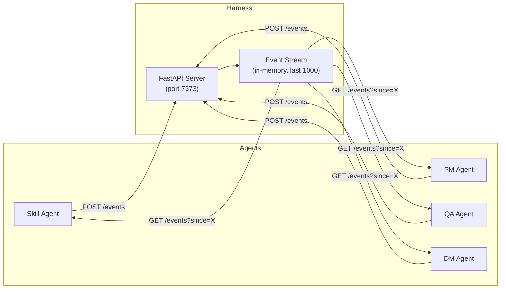
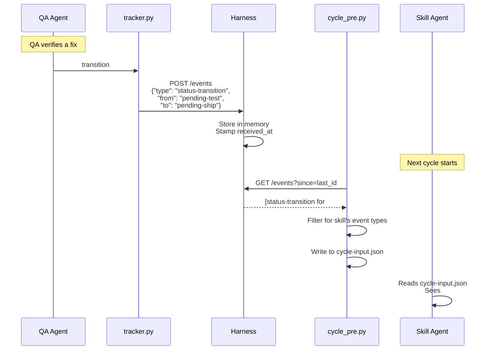
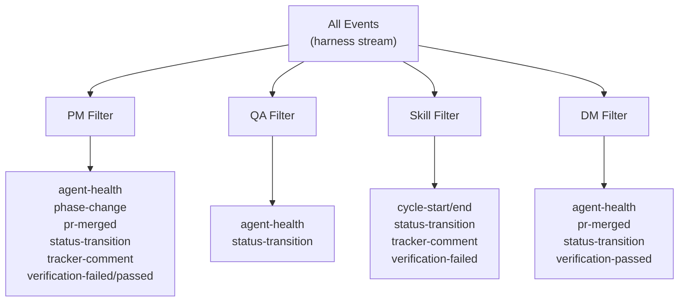
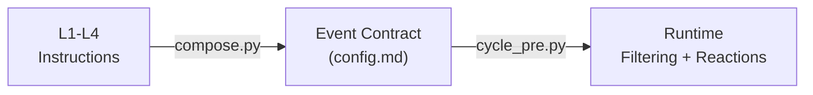
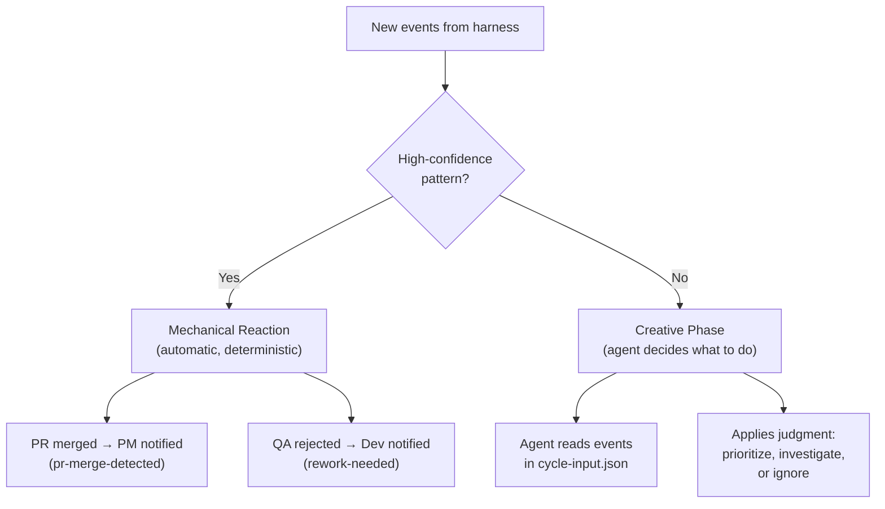
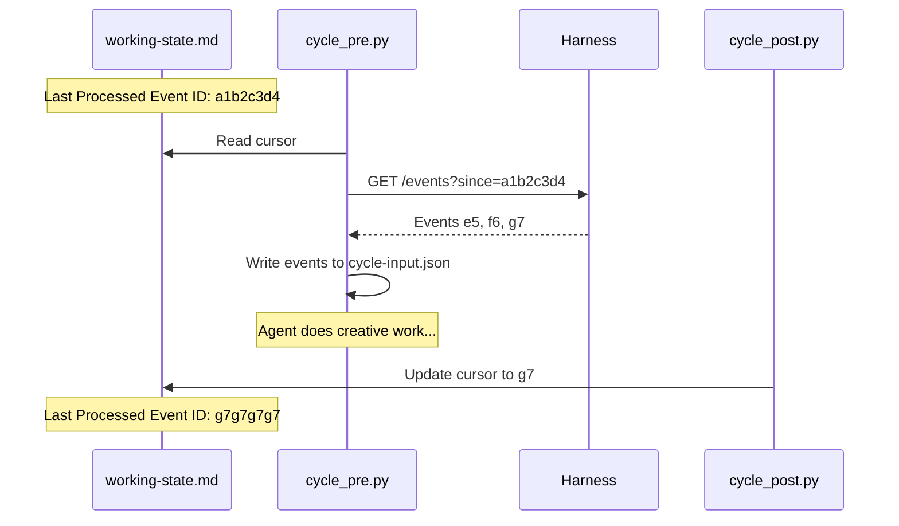

# Event Bus — How Agents Coordinate in Real-Time

SquidSquad agents normally coordinate through git — each agent pulls, works, pushes, and the next agent picks up changes on its next cycle. This works reliably but means agents wait up to 30 minutes to notice each other's work.

The **event bus** eliminates that delay. When QA verifies a fix, the dev agent knows within seconds. When a PR is merged, PM reacts immediately. Agents still use git as the durable record — the event bus is a fast, ephemeral notification layer on top.

---

## The Big Picture



Every agent emits events during its work (status changes, PR merges, commits). The harness collects them in memory. At the start of each cycle, every agent reads new events and decides how to react.

---

## How an Event Flows



The key design: **emitting never blocks** (500ms timeout, silent on failure) and **reading never breaks** (returns empty list on failure). If the harness is down, agents fall back to their normal 30-minute git polling — zero behavior change.

---

## Event Types

The event catalog uses a **three-tier model** to classify events:

- **Emitted** — actively produced by mechanical scripts during normal operations. These fire automatically whenever the triggering action occurs.
- **Recognized** — agents can subscribe and react to these, but they are emitted by the agent's creative phase (not mechanical scripts). They require the agent to explicitly emit them as part of its reasoning.
- **Unknown** — any event type not in the catalog. Silently ignored by the system.

This distinction matters because emitted events are guaranteed (the script always fires them) while recognized events depend on agent judgment (the agent decides when to emit them).

### Emitted Events (Mechanical)

| Event | Source Script | When | What It Tells Other Agents |
|-------|-------------|------|---------------------------|
| `status-transition` | tracker.py | Any status label change | "Issue #42 moved from pending-test to pending-ship" |
| `tracker-comment` | tracker.py | A comment is posted on an issue | "QA commented on #42 — mentioned skill agent" |
| `pr-merged` | harness | A PR is merged (emitted by the harness after `POST /merge` completes) | "PR #99 was merged — related issue can ship" |
| `pr-create` | git_ops.py | A PR is opened | "New PR #99 for review" |
| `git-commit` | git_ops.py | Agent creates a commit | "Skill committed code changes" |
| `git-push` | git_ops.py | Agent pushes changes | "New commits on main from skill" |
| `git-pull` | git_ops.py | Agent pulls latest | "Skill agent synced with remote" |
| `cycle-start` | cycle_pre.py | Agent begins a cycle | "Skill agent started cycle 862" |
| `cycle-end` | cycle_post.py | Agent finishes a cycle | "Skill agent finished — quiet cycle" |
| `branch-checkout` | git_ops.py | Agent switches branches | "Skill checked out task/5868" |

### Recognized Events (Agent-Emitted)

| Event | Typical Emitter | When | What It Tells Other Agents |
|-------|----------------|------|---------------------------|
| `verification-failed` | QA or PM | QA/PM rejects work | "Issue #42 failed verification — dev needs to rework" |
| `verification-passed` | QA or PM | QA/PM approves work | "Issue #42 passed verification — ready to ship" |
| `agent-health` | QA | Agent health observation | "Skill agent hasn't cycled in 45 minutes" |
| `phase-change` | PM or harness | Task lifecycle phase change | "Issue #42 moved from planning to execution" |

### Event Format

Every event is a JSON object:

```json
{
  "id": "a1b2c3d4",
  "event_type": "status-transition",
  "role": "qa",
  "timestamp": "2026-05-07T14:30:00",
  "payload": {
    "issue_number": "42",
    "from": "pending-test",
    "to": "pending-ship"
  },
  "received_at": 1746538200.123
}
```

The `id` is a content hash — the same event at the same time always produces the same ID, which prevents duplicate processing.

---

## What Each Agent Sees

Not every agent needs every event. Each role has a filter that surfaces only relevant signals:



PM has the widest filter because it coordinates the whole pipeline — it needs health alerts, phase changes, PR merges, status transitions, comments, and verification results. QA watches agent health and status transitions to know when work is ready for verification. Skill watches for cycle signals, comments mentioning it, and verification failures that mean rework. DM watches for status transitions (to catch pending-ship items), PR merges, health alerts, and verification signals.

---

## Event Contracts — Compose-Time Configuration

Event filtering and reactions are not hardcoded — they are **derived at compose time**. When you run `compose.py deploy-all`, the system reads each role's L1-L4 instructions and automatically generates an event contract in `config.md` under `## Event Reactions`.



You never write event configuration manually. The compose step figures out:
- **What events each role emits** and when
- **What events each role reacts to** and what action to take

If the `## Event Reactions` section is missing (fresh install, pre-compose), agents fall back to hardcoded defaults — zero behavior change. The first `compose.py deploy-all` populates it automatically.

After composing, a **cross-agent validator** checks the full bus wiring:
- Every emitted event has at least one consumer
- No contradictory reactions between agents
- No circular reaction chains
- Complete workflow coverage (no silent gaps)

Validation failures are warnings, not blockers — agents gracefully degrade to cycle polling.

---

## Mechanical Reactions vs. Creative Decisions

When an agent reads events, some patterns are so predictable that the system handles them automatically. Others require the agent's judgment.



**Mechanical reactions** are conservative — only two patterns currently qualify:
1. **PR merge detected** (PM): "PR #99 was merged for issue #42" — surfaces merge context
2. **Rework needed** (dev): "QA rejected issue #42" — surfaces the failure reason

Everything else lands in `recent_events` in the agent's `cycle-input.json` for the creative phase to interpret.

---

## The Cursor — Tracking What's Been Read

Each agent tracks a **cursor** — the ID of the last event it processed. This prevents re-reading the same events every cycle.



If the agent crashes mid-cycle, the cursor hasn't advanced yet — events are safely re-delivered next cycle. This is crash-safe by design.

---

## Cascade Protection

Events can trigger actions that emit more events. Without safeguards, this could create infinite loops — QA emits a status change, PM reacts and emits a comment, which triggers skill to react, which emits another status change, and so on.

Two mechanisms prevent this:

1. **Self-event filter**: An agent never reacts to its own events. If QA emits a `status-transition`, QA's mechanical reaction phase skips it. Only other agents see it.

2. **Cursor deduplication**: Events emitted during a cycle land *after* the cursor position. The emitting agent won't re-read them on its next cycle because the cursor has already advanced past them.

Together, these guarantee that event chains always terminate. Agent A emits → Agent B reacts → Agent B emits → Agent A sees it next cycle (but doesn't re-trigger the original action because the cursor has moved).

---

## What Happens When the Bus Is Down

The event bus is **strictly optional**. Every interaction is wrapped in error handling that silently falls back:

| Scenario | What Happens | Agent Impact |
|----------|-------------|-------------|
| Harness not running | Port file missing, no network calls made | Zero — agents cycle normally via git |
| Harness crashes mid-cycle | Emit timeout (500ms), returns silently | Event not recorded, no other effect |
| Network blip on read | `query()` returns `[]` | Agent sees no events, works from git state |
| Cursor points to evicted event | Harness returns oldest available events | Possible replay, but reactions are idempotent |
| Harness restarts | In-memory events lost, stream starts fresh | Agents resume from cursor, no gap errors |

The contract: **agents behave identically with or without the event bus.** The bus makes them faster, not different.

---

## Architecture in Context

The event bus sits at **L1 (Transport)** in SquidSquad's [six-layer architecture](ARCHITECTURE.md). It's mechanical plumbing — deterministic scripts emit and read events. The agent's creative phase (L3 Behavior) decides what the events mean.

```
L6  Memory        ← what the squad knows
L5  Soul          ← how the agent thinks
L4  Sub-skills    ← reusable capabilities
L3  Behavior ★    ← decides what events MEAN
L2  Orchestration ← timing & lifecycle
L1  Transport     ← event bus lives here (emit/read)
```

---

## Port Discovery

Each agent needs to know the harness port to emit and read events. The harness writes its port to `.squidsquad/.harness-port` at startup. Agents discover it by checking this file, walking up to 5 parent directories if needed (supporting per-agent clone isolation where agents run in separate git clones).

If the port file doesn't exist (harness not running), all event operations silently no-op. No configuration required — it just works when the harness is running and gracefully disappears when it isn't.

---

## Future Work

The event bus is actively evolving. Planned enhancements:

- **Event-driven agent scheduling** (#6056) — replace timer-based `/loop` with harness-driven wake signals, so agents only cycle when there's work. Hybrid model: harness emits timer events, agents subscribe to relevant triggers. Significant token savings for quiet periods.
- **Harness-owned PR merge + compose** (#6126) — centralize PR merge and template recomposition in the harness, enabling new event types like `request-merge` and `compose-completed`.
- **Additional event types** (#5613) — richer payload data for existing events and new domain-specific signals.

---

## Quick Reference

**Emit an event** (from any script):
```python
from event_bus import emit
emit("status-transition", "qa", {"issue_number": "42", "from": "pending-test", "to": "pending-ship"})
```

**Read events** (handled automatically by `cycle_pre.py`):
```python
from event_bus_reader import query
events = query(since="a1b2c3d4", limit=100)
```

**Check harness status**:
```bash
python references/scripts/squidsquad_cli.py status
```

**View the event stream** (direct API):
```bash
curl http://127.0.0.1:7373/events?limit=10
```
