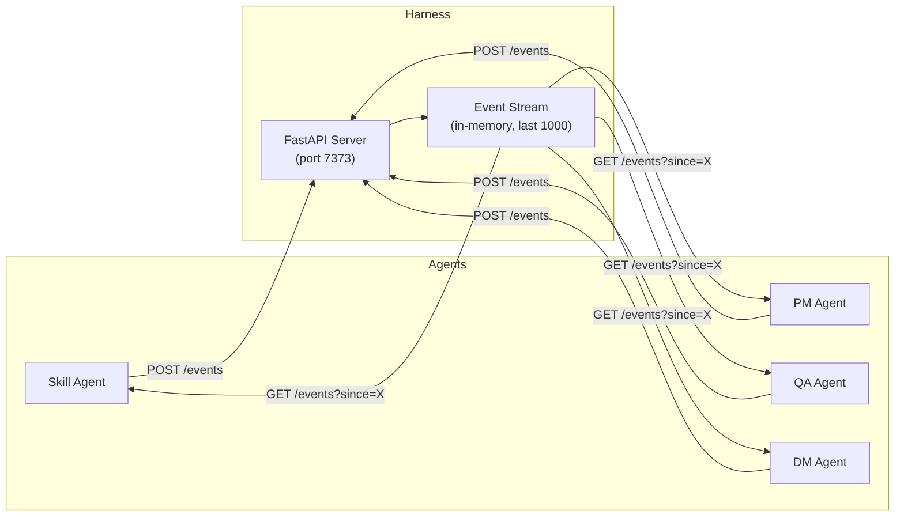
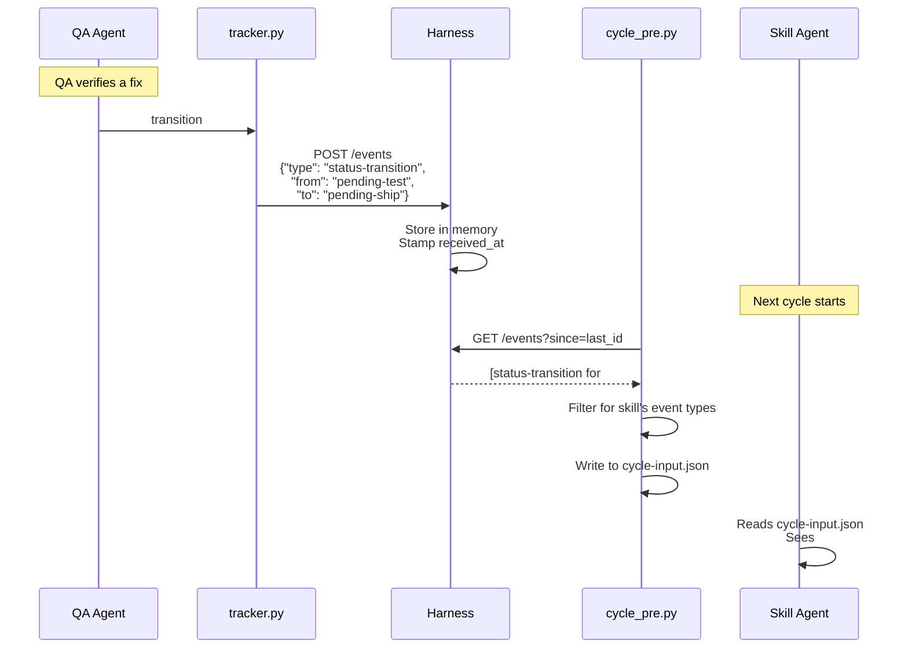
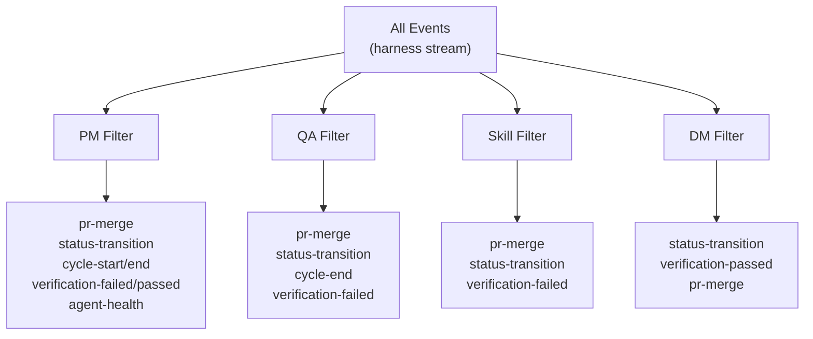
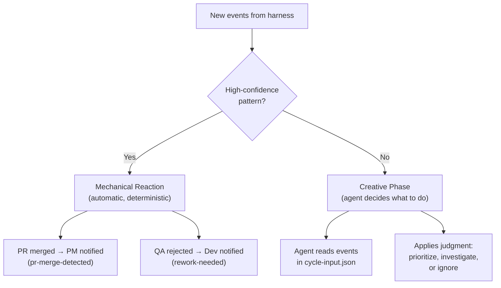
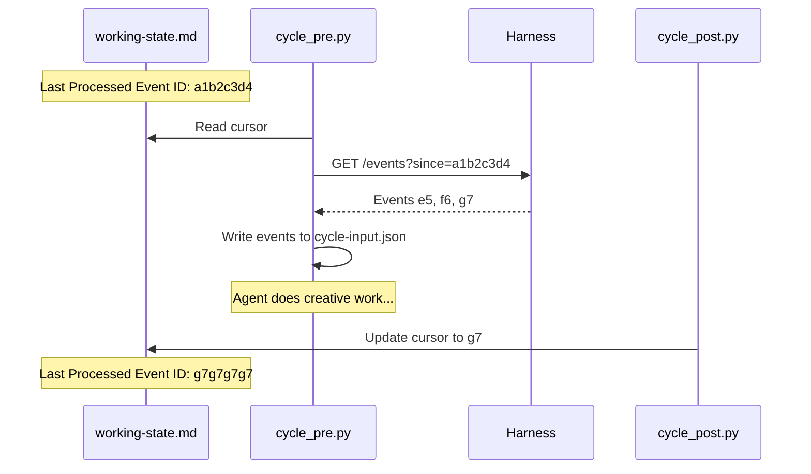

# Event Bus — How Agents Coordinate in Real-Time

SquidSquad agents normally coordinate through git — each agent pulls, works, pushes, and the next agent picks up changes on its next cycle. This works reliably but means agents wait up to 30 minutes to notice each other's work.

The **event bus** eliminates that delay. When QA verifies a fix, the dev agent knows within seconds. When a PR is merged, PM reacts immediately. Agents still use git as the durable record — the event bus is a fast, ephemeral notification layer on top.

---

## The Big Picture



Every agent emits events during its work (status changes, PR merges, commits). The harness collects them in memory. At the start of each cycle, every agent reads new events and decides how to react.

---

## How an Event Flows



The key design: **emitting never blocks** (500ms timeout, silent on failure) and **reading never breaks** (returns empty list on failure). If the harness is down, agents fall back to their normal 30-minute git polling — zero behavior change.

---

## Event Types

Agents emit these events during normal operations:

### Work Coordination

| Event | Emitted By | When | What It Tells Other Agents |
|-------|-----------|------|---------------------------|
| `status-transition` | tracker.py | Any status label change | "Issue #42 moved from pending-test to pending-ship" |
| `pr-merge` | git_ops.py | A PR is merged | "PR #99 was merged — related issue can ship" |
| `pr-create` | git_ops.py | A PR is opened | "New PR #99 for review" |
| `verification-failed` | QA scripts | QA rejects work | "Issue #42 failed verification — dev needs to rework" |

### Lifecycle

| Event | Emitted By | When | What It Tells Other Agents |
|-------|-----------|------|---------------------------|
| `cycle-start` | cycle_pre.py | Agent begins a cycle | "Skill agent started cycle 862" |
| `cycle-end` | cycle_post.py | Agent finishes a cycle | "Skill agent finished — quiet cycle" |
| `git-pull` | git_ops.py | Agent pulls latest | "Skill agent synced with remote" |
| `git-push` | git_ops.py | Agent pushes changes | "New commits on main from skill" |
| `git-commit` | git_ops.py | Agent creates a commit | "Skill committed code changes" |
| `branch-checkout` | git_ops.py | Agent switches branches | "Skill checked out task/5868" |

### Event Format

Every event is a JSON object:

```json
{
  "id": "a1b2c3d4",
  "event_type": "status-transition",
  "role": "qa",
  "timestamp": "2026-05-07T14:30:00",
  "payload": {
    "issue_number": "42",
    "from": "pending-test",
    "to": "pending-ship"
  },
  "received_at": 1746538200.123
}
```

The `id` is a content hash — the same event at the same time always produces the same ID, which prevents duplicate processing.

---

## What Each Agent Sees

Not every agent needs every event. Each role has a filter that surfaces only relevant signals:



For example, DM only cares about status transitions (to catch pending-ship items) and PR merges. It doesn't need to see every git pull or cycle start.

---

## Mechanical Reactions vs. Creative Decisions

When an agent reads events, some patterns are so predictable that the system handles them automatically. Others require the agent's judgment.



**Mechanical reactions** are conservative — only two patterns currently qualify:
1. **PR merge detected** (PM): "PR #99 was merged for issue #42" — surfaces merge context
2. **Rework needed** (dev): "QA rejected issue #42" — surfaces the failure reason

Everything else lands in `recent_events` in the agent's `cycle-input.json` for the creative phase to interpret.

---

## The Cursor — Tracking What's Been Read

Each agent tracks a **cursor** — the ID of the last event it processed. This prevents re-reading the same events every cycle.



If the agent crashes mid-cycle, the cursor hasn't advanced yet — events are safely re-delivered next cycle. This is crash-safe by design.

---

## What Happens When the Bus Is Down

The event bus is **strictly optional**. Every interaction is wrapped in error handling that silently falls back:

| Scenario | What Happens | Agent Impact |
|----------|-------------|-------------|
| Harness not running | Port file missing, no network calls made | Zero — agents cycle normally via git |
| Harness crashes mid-cycle | Emit timeout (500ms), returns silently | Event not recorded, no other effect |
| Network blip on read | `query()` returns `[]` | Agent sees no events, works from git state |
| Cursor points to evicted event | Harness returns oldest available events | Possible replay, but reactions are idempotent |
| Harness restarts | In-memory events lost, stream starts fresh | Agents resume from cursor, no gap errors |

The contract: **agents behave identically with or without the event bus.** The bus makes them faster, not different.

---

## Architecture in Context

The event bus sits at **L1 (Transport)** in SquidSquad's [six-layer architecture](ARCHITECTURE.md). It's mechanical plumbing — deterministic scripts emit and read events. The agent's creative phase (L3 Behavior) decides what the events mean.

```
L6  Memory        ← what the squad knows
L5  Soul          ← how the agent thinks
L4  Sub-skills    ← reusable capabilities
L3  Behavior ★    ← decides what events MEAN
L2  Orchestration ← timing & lifecycle
L1  Transport     ← event bus lives here (emit/read)
```

---

## Quick Reference

**Emit an event** (from any script):
```python
from event_bus import emit
emit("status-transition", "qa", {"issue_number": "42", "from": "pending-test", "to": "pending-ship"})
```

**Read events** (handled automatically by `cycle_pre.py`):
```python
from event_bus_reader import query
events = query(since="a1b2c3d4", limit=100)
```

**Check harness status**:
```bash
python references/scripts/squidsquad_cli.py status
```

**View the event stream** (direct API):
```bash
curl http://127.0.0.1:7373/events?limit=10
```
