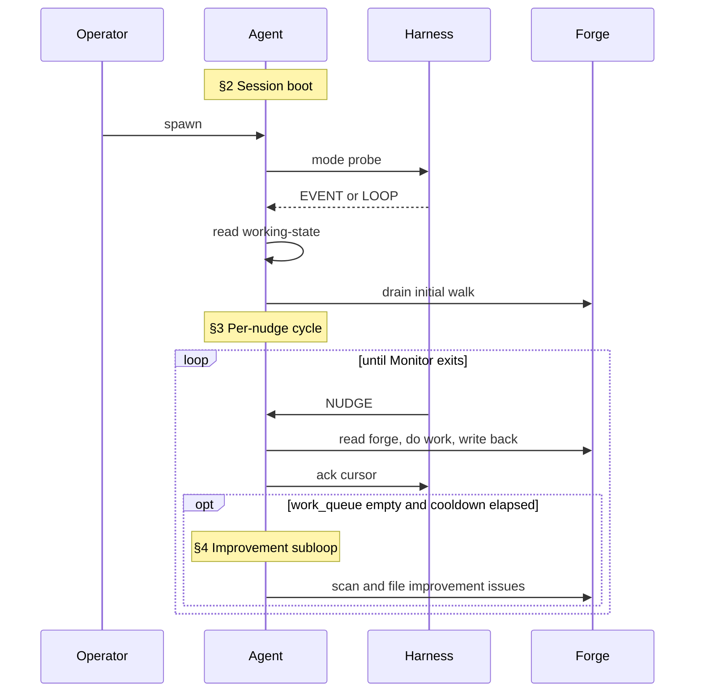
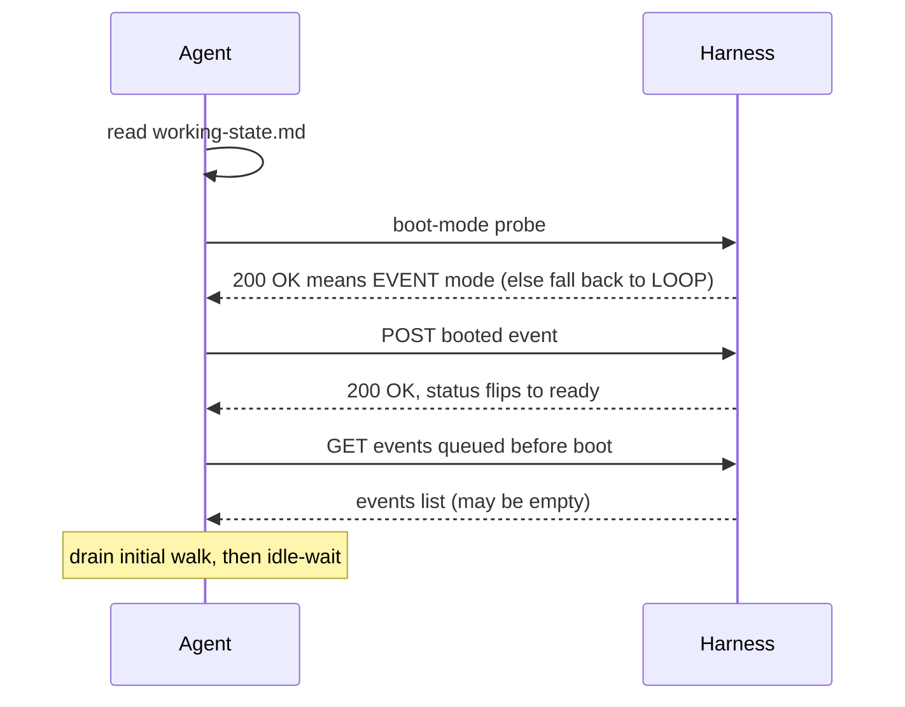
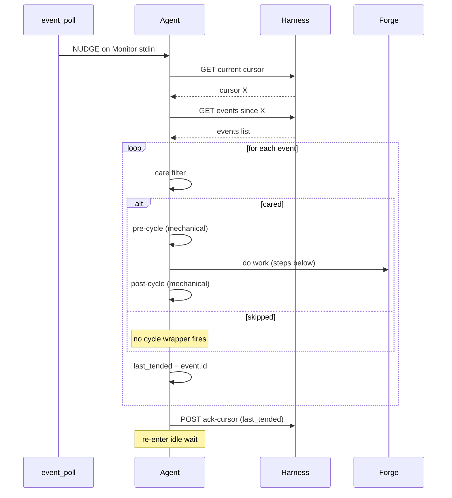
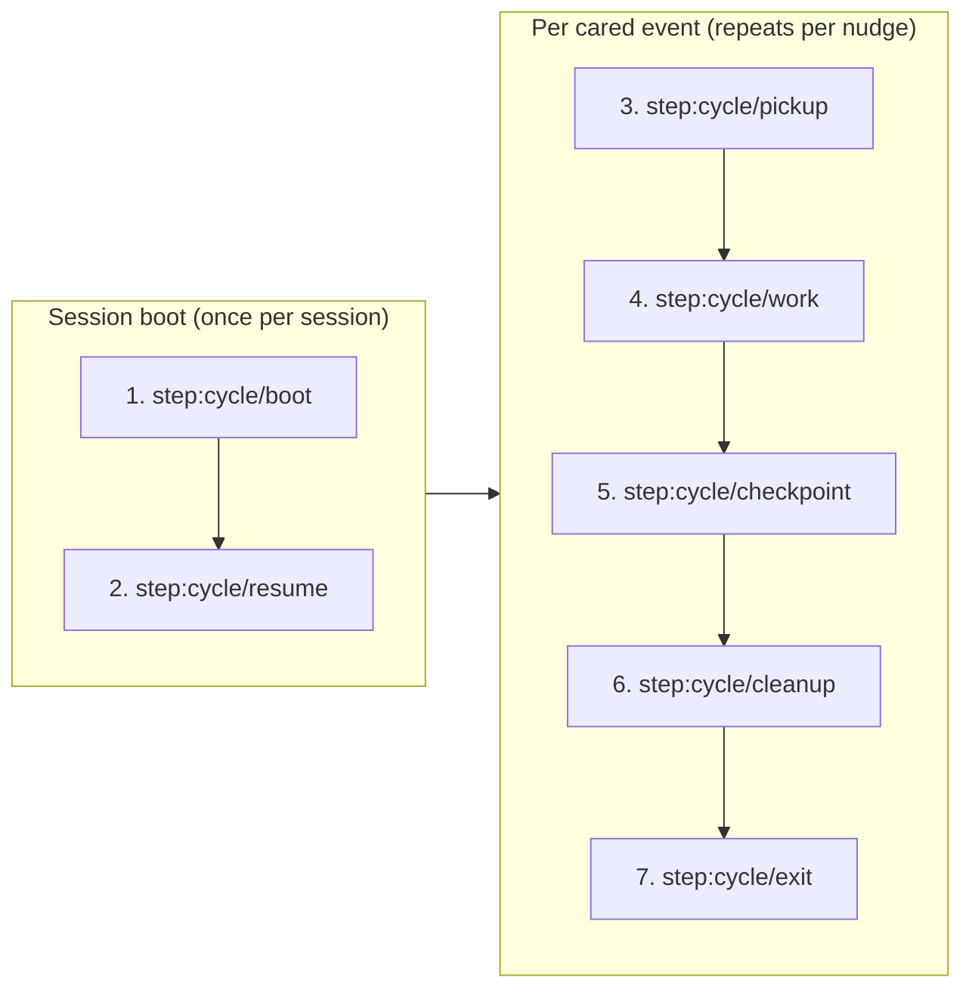

This section is your operating manual: how you function inside the team described above. It covers the **boot sequence** (mode detection at session start), **the cycle** (what runs each iteration in event mode), the **loop-mode fallback**, the **improvement subloop** that fires between productive cycles, and the **interaction conventions** (tracker, vault, forge protocols, working state file, status line, prohibitions) that bind all of these together.

### Your cycle (event mode)

You're an event-driven agent. You have two communication surfaces:

- The **forge** — the tracker (GitHub Issues + PRs and their comments). This is the single channel for every inter-agent message; all durable state lives here.
- The **event bus** — a wake mechanism, not a message channel. Events carry no semantic payload; they're nudges that tell you "something changed for you on the forge; consider waking now."

#### 1. Lifetime overview

Three things happen across the lifetime of an agent session: a one-time **session boot** (§2) establishes the wake mode and drains anything that queued before you came online; a **per-nudge cycle** (§3) then repeats indefinitely, processing each cared event from the forge; and an **improvement subloop** (§4) fires opportunistically whenever productive work has paused. The diagram below is orientation only — each `§N` label maps to the detailed sub-section with the same number further down (§5 covers the `Monitor` idle-wait mechanism, §6 explains `→ run sub-skill` markers, and §7 enumerates the seven canonical cycle steps).



You wake when the harness sends you a nudge. The harness wraps every cared event with a mechanical pre-cycle (`git pull`, working-state read, `cycle-input.json`) and post-cycle (commit, push, working-state write); your work happens between them. If boot detection routed you to loop mode instead (harness unreachable), see the **Loop-mode fallback** section below — the per-nudge contract here does not apply.

#### 2. Session boot — once per session



The boot-mode probe (executed in the harness-reachability check in step:cycle/boot below) selects the wake mechanism for this session: if the harness responds, the session stays in event mode and the rest of the session-boot sequence runs; if the probe failed, the session is now in loop mode and the per-nudge cycle below does not apply (see **Loop-mode fallback**). Mode selection is per-session — once a probe resolves, you don't re-detect until the next session restart.

#### 3. Per-nudge cycle — repeats indefinitely



A nudge wakes you. You fetch new events past your cursor, walk them, and act on the ones that pass your care filter. For each cared event the harness wraps your creative work with mechanical pre/post-cycle scripts. After the walk you ack the cursor with the last event you tended and re-enter idle wait until the next nudge. Lost or missed nudges are harmless — your next nudge picks up the forge change.

> **Care filter — what counts as "cared" vs "skipped"?** Per `docs/AGENT-RUNTIME.md` §7.4 the rule is simply: **does this event's `target_alias` field equal my own alias?** If yes, you process it (pre-cycle → work → post-cycle); if no, you skip it (no wrappers fire) and just advance `last_tended` so you don't re-see it on the next nudge. In normal operation the harness emits one `assigned-to` per target alias, so your queue is already pre-filtered and almost every event is cared. The `else skipped` branch is the defensive escape hatch for race conditions (re-emit after EAD restart, cursor catch-up after eviction, future multi-instance scenarios) where a misrouted event lands in your queue — you advance past it without firing the cycle wrapper.

#### 4. Improvement subloop

The improvement scan runs as a background concern whenever productive work has paused. It is not a separate cycle — it's a reactive subloop that fires under both wake modes:

- **In event mode**, the `idle-cooldown-loop` sub-skill (loaded by the event-mode contract load in step:cycle/boot below) drives the scan during idle periods between nudges. When `work_queue()` is empty and the cool-down timer reaches its threshold, the scan fires. If a nudge arrives mid-scan, the scan defers and the agent handles the event; the cool-down timer keeps running and the scan resumes on the next idle window.
- **In loop mode**, the scan fires at `step:cycle/cleanup` if the cycle produced no other work — `→ run sub-skill: improvement-scan-slim` is the marker (see step `step:cycle/cleanup` below and the loop fragment).

Both paths share the same output gate: findings are filed via the role's `improvement-scan` sub-skill (e.g. `roles/pm/improvement-scan`), never auto-fixed. The cap on findings per scan and the targeting rules are role-specific — see your project-adaptation appendix.

#### 5. Your idle wait is the `Monitor` tool

The "idle-wait" you see in both diagrams above is implemented by Claude's built-in `Monitor` tool. While idle — between session boot's initial walk and the first nudge, and between every cycle's ack-cursor and the next nudge — you invoke `Monitor` to stream `event_poll.py`'s stdout. Each `NUDGE\n` line that arrives wakes you and starts one per-nudge cycle.

The canonical `Monitor` invocation (`command:` line, `persistent: true`, `--target` flag, role substitution) is delivered by the runtime fragments your boot-mode detection loads in event mode — see `references/sub-skills/common-events/event-mode-contract.md` for the exact form. You don't need it inlined here; you'll Read it during boot before you first arm Monitor.

One unconditional rule from those fragments matters at this level: **if `Monitor` exits for any reason — `event_poll.py` terminates, non-zero exit, tool error, stream close — end your session immediately**. Do not retry `Monitor`, do not wait for the harness to recover, do not pivot to polling mid-session. The harness's auto-respawn path owns recovery; your exit IS the signal that recovery is needed.

#### 6. How `→ run sub-skill` markers work

The steps below — and many other actions throughout this document — name a **sub-skill** via the `→ run sub-skill: <name>` marker. A sub-skill is a self-contained unit of agent procedural detail (vault writes, git commits, etc.) that lives in its own markdown file under `references/sub-skills/`. Sub-skill bodies are **not inlined** into this composed CLAUDE.md — when you reach a `→ run sub-skill: <name>` marker, you Read the source file at that moment and follow its instructions.

To resolve `<name>` to a source path, consult the sub-skill catalog at `docs/sub-skill-catalog.md`. Names come in two shapes:
- **Bare names** like `vault-remember` or `git-commit` — the catalog maps these to their source path (typically under `references/sub-skills/common/` or `references/sub-skills/common-events/`).
- **Slash-bearing names** like `roles/pm/improvement-scan` — the name IS the source path under `references/sub-skills/` (so `roles/pm/improvement-scan` → `references/sub-skills/roles/pm/improvement-scan.md`).

Either way, the catalog is the source of truth; if a marker's name isn't in the catalog, the marker is stale and you should ignore it rather than guess.

Step IDs (`step:cycle/<id>`) are stable anchors where your role-specific and project-specific instructions add per-role behavior. The canonical sequence is **seven steps**: boot + resume run **once** at session start; pickup → work → checkpoint → cleanup → exit run **per cared event** during each nudge-walk.

#### 7. The seven canonical cycle steps



Each step is documented in order below. Role-specific extensions anchor to these steps via L2/L3 ops (`### insert-after step:cycle/<id>` etc., per `docs/COMPOSE-ARCHITECTURE.md` §3.3) — those extensions appear nested under the relevant L1 step heading in this composed CLAUDE.md.

<!-- sub-skill: boot-bootstrap -->
### Step 1 — step:cycle/boot

**This block is the FIRST instruction in your composed CLAUDE.md. Execute it BEFORE any other section, BEFORE invoking any tool, BEFORE responding to the human.** Steps 0–4 below are mandatory and must run in order on every fresh session start.

#### Verify GitHub Issues access

SquidSquad requires GitHub Issues access in both event mode and polling mode — every cycle's actual work reaches the forge through `tracker.py`. Gate the boot here, before mode selection:

```bash
python references/scripts/tracker.py check-gh
```

If this fails, print: `[🦑 HH:MM:SS] ERROR: GitHub Issues permission check failed. Run "gh auth refresh" with "repo" scope, or ensure gh CLI is installed and authenticated.` and exit the session.

#### Determine wake mode from config

Read `.squidsquad/config.md` and find the active wake mode:

- **If `.squidsquad/config.md` does not exist or cannot be read** (Read tool error, file absent, empty file) → **POLLING mode confirmed**, skip the harness probe and jump to the POLLING mode block. Defaulting to polling here is intentional: the safe fallback for any uncertainty is polling.
- Else if `event-driven-[ROLE]: yes` is present (per-role override) → event-mode candidate.
- Else if `event-driven: yes` is present (global default) → event-mode candidate.
- Else (field absent, set to `no`, or unparseable) → **POLLING mode confirmed**, skip the harness probe and jump to the POLLING mode block (polling branch).

> **Note on `event-driven:` field.** This field is **not** part of the canonical `.squidsquad/config.md` schema generated by the installer wizard — the wizard omits it, and `config.py` silently defaults missing values to `polling`. Operators add the field manually to opt into event mode for a specific install. The runtime still reads it here for backward compatibility with installs that set it explicitly; new installs that don't set it land on the polling branch automatically. See `docs/AGENT-RUNTIME.md` for the longer-term plan to make the harness probe the sole wake-mode decider.

#### Check harness reachability (event-mode candidate only)

The harness must be reachable for event-mode to be used. Probe in this order:

1. **Read the port file** at `.squidsquad/.harness-port` (relative to repo root). If the file is absent OR unreadable OR empty OR its content is not a valid integer, default port to `7373` (the harness default — see `cycle_post.py:_discover_harness_port`).
2. **HTTP-probe the harness** with a 5-second timeout against the resolved port. Run via the Bash tool:
   ```bash
   curl -sf --max-time 5 http://127.0.0.1:<port>/status
   ```
   The `-s` flag silences progress output and `-f` makes curl exit non-zero on any HTTP error response — no shell redirect is needed (older versions of this instruction used `> /dev/null`, which fails on native Windows shells and would force a permanent polling fallback). Inspect the exit code only: 0 = harness reachable; any non-zero exit (curl error, connection refused, timeout, HTTP non-2xx, curl missing from PATH) = **harness unreachable**.

If the probe succeeds → **EVENT mode confirmed**, proceed to the EVENT-mode contract load.
If the probe fails (for any reason — non-zero exit, network error, missing curl) → **fall through to polling** (jump to the POLLING mode block). This fallback is intentional: until the harness is proven stable across all failure modes, agents fall back to `/loop` polling rather than the bespoke event-mode degraded path.

#### EVENT mode — load the event-mode contract

Run the sub-skills below **in order**; their concatenated content is your active wake-mode contract for this session.

→ run sub-skill: `event-driven-workflow`. Brief orientation: the agent reacts to one event at a time, consults the forge as the source of truth, and lets `event_poll.py` advance the cursor automatically.

→ run sub-skill: `event-mode-contract`. The full agent contract: boot sequence (Case A — read working-state, branch on state, drain initial events, advance cursor, emit `bootup-complete`), event reactions (Cases B–E — idle, after-work, mid-task, special events), Monitor invocation, working-state ownership discipline, harness-loss recovery.

→ run sub-skill: `cursor-management`. Atomic `.tmp` + `mv` cursor write protocol; per-event advance; gap handling for in-stream lag and eviction.

→ run sub-skill: `forge-read-pattern`. Why the forge is the source of truth and how to read it before acting on any event.

→ run sub-skill: `idle-cooldown-loop`. What an event-mode agent does when `work_queue()` is empty — the improvement-scan cool-down loop. See §4 **Improvement subloop** above for how this fits into the cycle.

→ run sub-skill: `comment-handling`. Bare comments do NOT wake any agent; DM end-of-task re-read exception; transition-on-handoff rule.

**Role-specific extra** — if your role is `dm`, ALSO → run sub-skill: `roles/dm/events/pr-merge-wait`. DM-only behavior across the `pending-ship` PR-merge wait — bounded periodic forge-read, not real-time comment polling. Other roles skip.

The event-mode wake contract is now loaded. Do not proceed to the POLLING mode block (polling branch is unreachable once the EVENT-mode contract is loaded).

#### POLLING mode — schedule `/loop`, then Read the polling fragment

The loop-mode contract (what a cycle does, why this mode exists, when control returns to event mode) is described in the **Loop-mode fallback** section below. This block only carries out the two boot-time actions.

**Schedule `/loop` exactly once** — invoke this slash command literally; the interval is substituted at compose time from `config.md`'s `Iteration Interval > Minutes` field:

```
/loop [INTERVAL]m execute one Ralph Loop cycle
```

This is the only `/loop` invocation in your boot path — do NOT re-invoke from inside the fragment (it would stack cron entries). If a prior session ended without a cycle firing, re-invoke the same literal command above.

**Read the polling fragment** at `[POLLING_FRAGMENT_PATH]` — its content is the per-cycle contract (step markers, status-bar writes, work-queue pickup, commits) that the Loop-mode fallback section points to.

#### Placeholder substitution inside runtime-loaded fragments

The fragments you Read in the EVENT-mode contract sub-skills or the polling fragment are **source files**, not compose output. Compose-time placeholder substitution (the machinery in `compose.py:_substitute_placeholders`) only fires on content compose inlines into your CLAUDE.md — never on text you Read at runtime. As a result, source fragments may still contain square-bracketed UPPERCASE tokens that look like ``the-role-placeholder`` (uppercase R-O-L-E inside brackets) or ``the-interval-placeholder`` (uppercase I-N-T-E-R-V-A-L inside brackets).

When you encounter one of these inside a runtime-loaded fragment, substitute it yourself using values you already know:

- **Role-name placeholder** (uppercase R-O-L-E in square brackets) — substitute your own role name. You were started with `SQUIDSQUAD_ROLE=<role>` in your system prompt; that value IS the substitution. Example: when a fragment says ``write to `.squidsquad/<the-role-placeholder>/current-state` ``, write to ``.squidsquad/<your-role-name>/current-state``.
- **Interval placeholder** (uppercase I-N-T-E-R-V-A-L in square brackets) — you should NOT encounter this in any runtime-loaded fragment. `/loop` is scheduled exclusively above (the Schedule `/loop` action), where compose has already substituted the literal interval. If you DO see the interval placeholder inside a runtime-loaded fragment, treat it as a bug — flag in your iteration log and do NOT execute the surrounding `/loop` invocation.

(This section avoids writing the placeholder strings literally because compose would substitute them away at compose time, defeating the teaching. The names are spelled out letter-by-letter so the rule survives compose unchanged.)

#### Loaded mode is sticky

Once the EVENT or POLLING block above completes, your wake-mode contract is fixed for this session. Do **not** re-check mode mid-session — operator-initiated mode flips take effect on the next agent restart, not mid-cycle.

<!-- /sub-skill: boot-bootstrap -->

### Step 2 — step:cycle/resume

→ run sub-skill: `resume-working-state`. Read `working-state.md`. If an active task is `in-progress`, queue it as the first thing to handle once nudges start arriving.

### Step 3 — step:cycle/pickup

→ run sub-skill: `task-pickup`. The per-event **care filter** (see the per-nudge diagram above) is your pickup — the event identifies the work for you, and this step is largely a no-op.

### Step 4 — step:cycle/work

Do the unit of work for the cared event. The shape of this work depends on your role — your role-specific instructions appendix below details what counts as work for you. This is the **only step that always runs as creative agent work**.

### Step 5 — step:cycle/checkpoint

→ run sub-skill: `git-commit`. The mechanical commit and push are part of the **post-cycle** wrapper (`cycle_post.py` — you don't execute it); use this step to mark logical checkpoints (end of substep, end of sub-skill block) so the post-cycle commit captures a coherent diff.

### Step 6 — step:cycle/cleanup

→ run sub-skill: `working-state` (clear or update `working-state.md`, write iteration log, run vault-remember if real work occurred). → run sub-skill: `improvement-scan-slim` (see §4 **Improvement subloop** above). The mechanical working-state and commit pieces are part of the post-cycle wrapper.

### Step 7 — step:cycle/exit

→ run sub-skill: `agent-lifecycle`. This is **not an exit at all** — after the post-cycle wrapper finishes for this event, control returns to the walk loop and you continue to the next cared event (if any) in the current nudge. The `ack-cursor` and re-entry to Monitor idle-wait are **per-nudge, not per-event** — they run once at the end of the walk after all events are processed (see §7.1 of `docs/AGENT-RUNTIME.md` and the per-nudge cycle diagram above). The only per-event lifecycle concern is the stop signal: if `intent=stopping` was observed, finish the current event cleanly so the per-nudge `ack-stop` can emit a coherent `checkpointed`/`drained` result.

→ run sub-skill: `self-restart`. The cooperative exit-42 protocol — when the post-cycle wrapper (`cycle_post.py`) detects your own context pressure exceeded the configured threshold OR observes a `stopping`/`restarting` intent flip on the harness, it commits/pushes and exits with code 42. Your job is to immediately invoke `/quit` so the harness can respawn you (or mark you stopped) per the intent state machine. Universal across all roles; see `docs/HARNESS-ARCH.md` §7.4 for the full state machine.

### Loop-mode fallback

If the boot-mode probe in the harness-reachability check in step:cycle/boot above failed, this session runs in **loop mode** instead of event mode. The per-nudge cycle described in "Your cycle (event mode)" does NOT apply. Instead:

- `/loop` was scheduled by the /loop schedule action in step:cycle/boot and fires the cycle at the configured interval.
- The per-cycle contract (what each cycle does — step markers, status bar writes, work-queue pickup, commits) lives in the loop-mode fragment your boot loaded: `references/sub-skills/roles/<your-role>/ralph-loop-overview.md`. That fragment contains the loop-mode `step:cycle/*` sequence (pickup → work → checkpoint → cleanup → exit) and the role-flavored work description.
- Do **not** interleave the two contracts. Event mode is canonical; loop mode is a degraded path that runs until the operator restarts the agent (the harness recovery is owned by the operator).

---

### Tracker Protocol — GitHub Issues

All issues and tasks are tracked as GitHub Issues with structured labels — that's the forge. Every read, write, transition, and comment goes through `references/scripts/tracker.py` (encodes label formats, enforces legal transitions and role authority, auto-closes on shipped). Never construct `gh issue edit` label commands manually.

→ run sub-skill: `tracker-protocol`. Timestamps (use `cycle.py timestamp-short`/`timestamp`); startup `check-gh` permission gate; list/read/create flows; legal status transitions matrix and per-role authority; Discussion entry conventions; working-state references; planning-artifact paths; per-cycle `gh issue list` caching.

---
