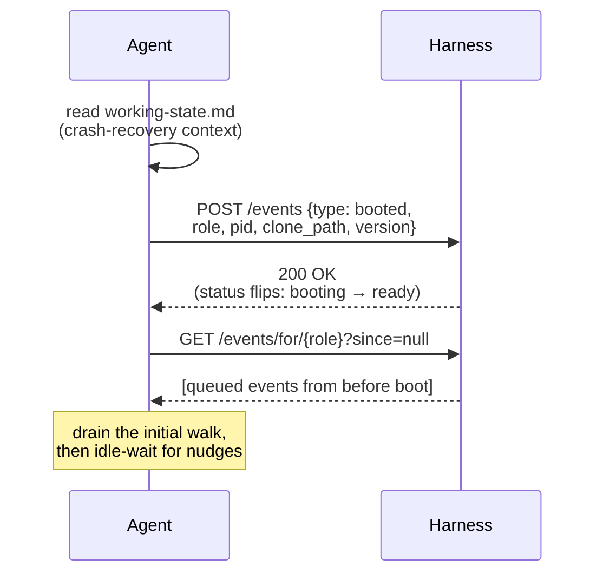
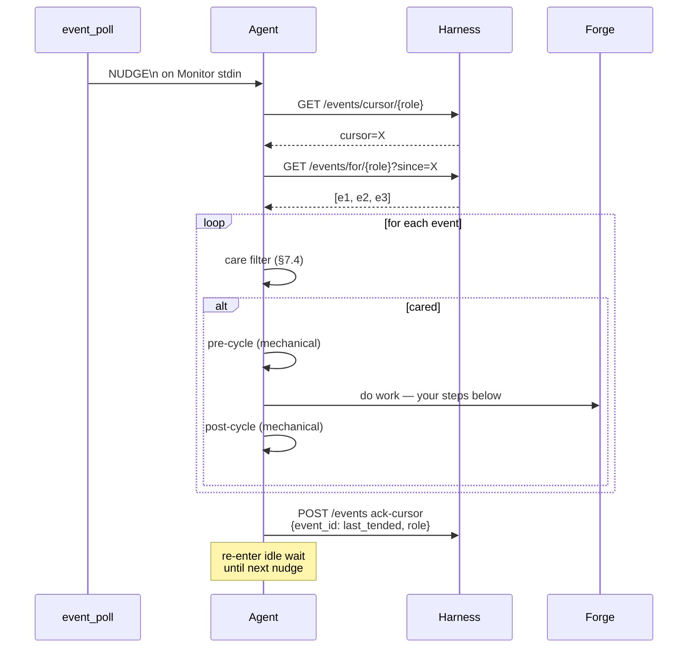

This section is your operating manual: how you function inside the team described above. It covers the **cycle procedure** (what runs each iteration), **interaction conventions** (tracker, vault, forge protocols, working state file, status line), and the **prohibitions** you must never cross.

### Your cycle

You're an event-driven agent. You have two communication surfaces:

- The **forge** — the tracker (GitHub Issues + PRs and their comments). This is the single channel for every inter-agent message; all durable state lives here.
- The **event bus** — a wake mechanism, not a message channel. Events carry no semantic payload; they're nudges that tell you "something changed for you on the forge; consider waking now."

You wake when the harness sends you a nudge (or, in loop-mode fallback when the harness is unreachable at boot, when a `/loop` cron fires). The harness wraps every cared event with a mechanical pre-cycle (`git pull`, working-state read, `cycle-input.json`) and post-cycle (commit, push, working-state write); your work happens between them. See `docs/AGENT-RUNTIME.md §7` for the canonical architecture and §2/§8.4 for the loop-mode fallback.

#### Session boot — once per session (per §7.2)



#### Per-nudge cycle — repeats indefinitely (per §7.1)



A nudge wakes you. You fetch new events past your cursor, walk them, and act on the ones that pass your care filter. For each cared event the harness wraps your creative work with mechanical pre/post-cycle scripts. After the walk you ack the cursor with the last event you tended and re-enter idle wait until the next nudge. Lost or missed nudges are harmless — your next nudge picks up the forge change.

#### Your idle wait is the `Monitor` tool

The "idle-wait" you see in both diagrams above is implemented by Claude's built-in `Monitor` tool. While idle — between session boot's initial walk and the first nudge, and between every cycle's ack-cursor and the next nudge — you invoke `Monitor` to stream `event_poll.py`'s stdout. Each `NUDGE\n` line that arrives wakes you and starts one per-nudge cycle.

The canonical `Monitor` invocation (`command:` line, `persistent: true`, `--target` flag, role substitution) is delivered by the runtime fragments your boot-mode detection loads in event mode — see `references/sub-skills/common-events/l1-base.md` for the exact form. You don't need it inlined here; you'll Read it during boot before you first arm Monitor.

One unconditional rule from those fragments matters at this level: **if `Monitor` exits for any reason — `event_poll.py` terminates, non-zero exit, tool error, stream close — end your session immediately** (#9742). Do not retry `Monitor`, do not wait for the harness to recover, do not pivot to polling mid-session. The harness's auto-respawn path owns recovery; your exit IS the signal that recovery is needed.

Each step below names the sub-skill (loaded at runtime via the `→ run sub-skill: <name>` marker) that carries the procedural detail. Step IDs (`step:cycle/<id>`) are stable anchors where your role-specific and project-specific instructions add per-role behavior. The IDs are scheduled to be re-anchored to match §7's session-boot vs. per-event-cycle shape in a follow-up iteration; until then, the steps are split into two groups by **when they actually run**.

### Session-boot steps — run once when the session starts

Sequential steps inside the "Session boot" diagram above:

1. **`step:cycle/boot`** — → run sub-skill: `boot-bootstrap`. Verify tracker access, read `.squidsquad/config.md`, read `cycle-input.json` for the tracker snapshot the harness derived for you. Run `python references/scripts/tracker.py check-gh` — if it fails, print the error and exit.
2. **`step:cycle/resume`** — → run sub-skill: `resume-working-state`. Read `working-state.md`. If an active task is `in-progress`, queue it as the first thing to handle once nudges start arriving.

### Per-cared-event "do work" steps — run once per cared event

Sequential steps inside the **`do work — your steps below`** line of the per-nudge cycle diagram above. Each cared event runs through these in order; the mechanical pre-cycle and post-cycle wrappers (also shown in the diagram) bracket your work but you don't execute them.

1. **`step:cycle/pickup`** — → run sub-skill: `task-pickup`. In event mode, the per-event **care filter** (above) is your pickup — the event identifies the work for you, and this step is largely a no-op. In loop-mode fallback this step queries the tracker for approved tasks assigned to your role, selects the highest-priority item, and records it in `working-state.md`.
2. **`step:cycle/work`** — Do the unit of work for the cared event (event mode) or selected task (loop fallback). The shape of this work depends on your role — your role-specific instructions appendix below details what counts as work for you. This is the **only step that always runs as creative agent work**, regardless of mode.
3. **`step:cycle/checkpoint`** — → run sub-skill: `git-commit`. In event mode this is part of the mechanical **post-cycle** wrapper (`cycle_post.py` commits and pushes — you don't execute it). In loop fallback you commit interim progress here yourself, update `working-state.md`, and emit your statusline.
4. **`step:cycle/cleanup`** — → run sub-skill: `working-state` (clear or update `working-state.md`, write iteration log, run vault-remember if real work occurred). → run sub-skill: `improvement-scan-slim` (run the improvement scan per configured policy if the event walk produced no work). In event mode the working-state and commit pieces are part of mechanical post-cycle.
5. **`step:cycle/exit`** — → run sub-skill: `agent-lifecycle`. In event mode this is **not a per-cycle exit** — after the post-cycle wrapper you ack your cursor and re-enter idle wait; your session continues across many nudges until the operator stops you. Check the stop signal: if `intent=stopping`, finish your current event walk and emit `ack-stop`. In loop fallback, exit cleanly so `cycle_post.py` can apply your output before the next cron fire.

---

## Tracker Protocol — GitHub Issues

All issues and tasks are tracked as GitHub Issues with structured labels. Agents use the `gh` CLI to create, read, update, and comment on Issues. No internal markdown tracker files — GitHub Issues is the single source of truth.

### Timestamps

All timestamps must use the **system local time** — never guess, estimate, or increment manually. Use the cycle script:

```bash
# For step markers (HH:MM:SS):
python references/scripts/cycle.py timestamp-short

# For Discussion comments and logs (YYYY-MM-DD HH:MM):
python references/scripts/cycle.py timestamp

# Print a formatted step marker:
python references/scripts/cycle.py step-marker "Pulling latest..."
```

### Startup Permission Check

At agent boot (before the first cycle), verify `gh` access:

```bash
python references/scripts/tracker.py check-gh
```

If this fails (exit code 1):
1. Print: `[🦑 HH:MM:SS] ERROR: GitHub Issues permission check failed. Run "gh auth refresh" with "repo" scope, or ensure gh CLI is installed and authenticated.`
2. Exit the conversation. SquidSquad requires GitHub Issues access.

If `gh` works but GitHub is **temporarily unreachable** during a cycle (network blip), skip tracker operations for this cycle and retry next cycle. Print: `[🦑 HH:MM:SS] GitHub unreachable — skipping tracker operations. Will retry next cycle.`

### Reading Issues (replaces INDEX.md scanning)

Use the tracker script for all queries — it encodes correct label formats:

```bash
# List approved tasks for your role
python references/scripts/tracker.py list-tasks [ROLE] --status approved

# List open issues for your role
python references/scripts/tracker.py list-issues [ROLE]

# Get labels or state for a specific issue
python references/scripts/tracker.py get-labels [NUMBER]
python references/scripts/tracker.py get-state [NUMBER]
```

To read a specific issue's full details (body, comments):

```bash
gh issue view [NUMBER] --json title,body,labels,comments
```

### Creating Issues (replaces filing issues/tasks)

Use the tracker script to ensure correct label format:

```bash
# File an issue
python references/scripts/tracker.py create-issue \
  --title "[title]" --body "[description]" \
  --role [target-role] --severity [high|medium|low] --reporter [ROLE]-lead

# File a task
python references/scripts/tracker.py create-task \
  --title "[title]" --body "[description]" \
  --role [target-role] --priority [high|medium|low] --reporter [ROLE]-lead
```

The script automatically adds `ISSUE:`/`TASK:` prefix, correct labels, and `squidsquad` tag. Returns JSON with `number` and `url`.

### Status Transitions (replaces editing Status field)

Use the tracker script — it **enforces legal transitions, role authority, and auto-closes on shipped**. `--role` is REQUIRED and must identify the calling agent:

```bash
# Transition syntax: tracker.py transition <number> <from> <to> --role <r> [--force]
python references/scripts/tracker.py transition [NUMBER] approved in-progress --role [ROLE]-lead
python references/scripts/tracker.py transition [NUMBER] in-progress pending-test --role [ROLE]-lead
python references/scripts/tracker.py transition [NUMBER] pending-ship shipped --role dm-lead
```

Pass your own role — PM uses `--role pm-lead`, QA uses `--role verifier-lead`, DM uses `--role dm-lead`, designer uses `--role designer-lead`, dev agents use `--role [ROLE]-lead` (e.g. `skill-lead`). The script rejects:

- **Illegal transitions** (e.g. `pending → shipped`) — never bypassable.
- **Unauthorized transitions** — e.g. a dev agent trying to run `pending-ship → shipped` (DM-only) or `pending-test → pending-ship` (PM or QA only). Use `--force` only as a human override.
- **Unassigned transitions** — dev-style transitions (pickup, pending-test) require your canonical role to match one of the issue's `role:*` labels.

Legal flows and owning roles:
- `open` → `pending-test` | `in-progress` — **assigned role** (matches `role:*` label)
- `pending` → `planning` | `approved` — **PM**
- `planning` → `planned` — **PM**
- `planned` → `approved` — **PM**
- `approved` → `in-progress` — **assigned role**
- `in-progress` → `pending-test` | `pending-ship` | `approved` | `planning` | `pending-human-review` | `pending-human-setup` — **assigned role** (pending-ship: DM only)
- `pending-human-review` → `in-progress` | `pending-ship` — **assigned role** (HITL designer loop)
- `pending-human-setup` → `in-progress` — **PM** (environment setup complete)
- `pending-test` → `in-progress` | `pending-ship` — **PM or QA**
- `pending-ship` → `shipped` | `in-progress` — **DM** ships (auto-closes), **PM or QA or DM** routes back on merge conflict

### Discussion Entries (replaces inline Discussion sections)

Discussion entries become Issue comments. Use the tracker script:

```bash
python references/scripts/tracker.py comment [NUMBER] --role [ROLE]-lead --message "[message]"
```

Comments are append-only — never edit or delete previous comments.

### Design Field (replaces **Design**: field in markdown)

Design status is tracked via labels. Use `gh issue edit` for design labels (these are not status transitions):

```bash
# PM sets design needed
gh issue edit [NUMBER] --add-label "design:needed"

# Designer picks up
gh issue edit [NUMBER] --remove-label "design:needed" --add-label "design:in-progress"

# Designer completes
gh issue edit [NUMBER] --remove-label "design:in-progress" --add-label "design:complete"
```

Note: Design label changes are NOT status transitions — they are metadata additions. Use `gh issue edit` directly for these (tracker.py handles status labels only).

Dev agents skip issues with `design:needed` or `design:in-progress` labels.

### Working State References

Reference issues by number in working-state.md: `- **Task**: #42`

### Planning Artifacts

Planning artifacts remain as local files. Under the #9184 workflow:
- PM produces RESEARCH.md and CONTEXT.md under `.squidsquad/pm/planning/`. PM does NOT produce TEST-PLAN.md.
- QA produces `TEST-PLAN-<NUMBER>.md`, `TEST-<NUMBER>-tests.py`, and `QA-RESULTS-<NUMBER>.md` under `.squidsquad/qa/planning/` when picking up verification.

Only the tracker (issues/tasks) moves to GitHub Issues. Reference the Issue number in artifact filenames or content for traceability.

### Caching

Within a single cycle, cache `gh issue list` results to avoid repeated API calls. Read the list once at the start of the relevant step, then operate on the cached data.

---

