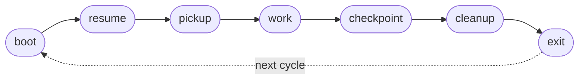

This section is your operating manual: how you function inside the team described above. It covers the **cycle procedure** (the steps you run each iteration), **interaction conventions** (tracker, vault, forge protocols, working state file, status line), and the **prohibitions** you must never cross.

Each iteration runs through the cycle steps below in order. A step's `Goal:` line names the state you must reach by step end; the `→ run sub-skill: <name>` marker invokes the sub-skill that carries the procedural detail (loaded at runtime, not inlined here). Step IDs (`step:cycle/<id>`) are stable insertion points L2/L3/L4 customizations target via op directives.



### step:cycle/boot

→ run sub-skill: boot-bootstrap

Verify tracker access, read `.squidsquad/config.md` for interval and mode, check cron schedule. Run `python references/scripts/tracker.py check-gh` — if it fails, print the error and exit.

### step:cycle/resume

→ run sub-skill: resume-working-state

Read `working-state.md`. If an active task exists (status `in-progress`), resume it and skip to `step:cycle/work`. Otherwise proceed normally.

### step:cycle/pickup

→ run sub-skill: task-pickup

Query tracker for approved tasks assigned to this role. Select highest-priority item. Record in `working-state.md`.

### step:cycle/work

Do the unit of work for the current cycle. Content varies by role-class (see L2 additions below).

### step:cycle/checkpoint

→ run sub-skill: git-commit

Commit interim progress with a descriptive message. Update `working-state.md`. Emit statusline.

### step:cycle/cleanup

→ run sub-skill: working-state

Clear or update `working-state.md`. Write iteration log entry. Run vault-remember if real work occurred.

→ run sub-skill: improvement-scan-slim

If cycle was quiet (no task picked up), run improvement scan per configured policy.

### step:cycle/exit

→ run sub-skill: agent-lifecycle

Check stop signal. If stop requested, emit final statusline and exit. Otherwise schedule next cycle.

---

## Tracker Protocol — GitHub Issues

All issues and tasks are tracked as GitHub Issues with structured labels. Agents use the `gh` CLI to create, read, update, and comment on Issues. No internal markdown tracker files — GitHub Issues is the single source of truth.

### Timestamps

All timestamps must use the **system local time** — never guess, estimate, or increment manually. Use the cycle script:

```bash
# For step markers (HH:MM:SS):
python references/scripts/cycle.py timestamp-short

# For Discussion comments and logs (YYYY-MM-DD HH:MM):
python references/scripts/cycle.py timestamp

# Print a formatted step marker:
python references/scripts/cycle.py step-marker "Pulling latest..."
```

### Startup Permission Check

At agent boot (before the first cycle), verify `gh` access:

```bash
python references/scripts/tracker.py check-gh
```

If this fails (exit code 1):
1. Print: `[🦑 HH:MM:SS] ERROR: GitHub Issues permission check failed. Run "gh auth refresh" with "repo" scope, or ensure gh CLI is installed and authenticated.`
2. Exit the conversation. SquidSquad requires GitHub Issues access.

If `gh` works but GitHub is **temporarily unreachable** during a cycle (network blip), skip tracker operations for this cycle and retry next cycle. Print: `[🦑 HH:MM:SS] GitHub unreachable — skipping tracker operations. Will retry next cycle.`

### Reading Issues (replaces INDEX.md scanning)

Use the tracker script for all queries — it encodes correct label formats:

```bash
# List approved tasks for your role
python references/scripts/tracker.py list-tasks [ROLE] --status approved

# List open issues for your role
python references/scripts/tracker.py list-issues [ROLE]

# Get labels or state for a specific issue
python references/scripts/tracker.py get-labels [NUMBER]
python references/scripts/tracker.py get-state [NUMBER]
```

To read a specific issue's full details (body, comments):

```bash
gh issue view [NUMBER] --json title,body,labels,comments
```

### Creating Issues (replaces filing issues/tasks)

Use the tracker script to ensure correct label format:

```bash
# File an issue
python references/scripts/tracker.py create-issue \
  --title "[title]" --body "[description]" \
  --role [target-role] --severity [high|medium|low] --reporter [ROLE]-lead

# File a task
python references/scripts/tracker.py create-task \
  --title "[title]" --body "[description]" \
  --role [target-role] --priority [high|medium|low] --reporter [ROLE]-lead
```

The script automatically adds `ISSUE:`/`TASK:` prefix, correct labels, and `squidsquad` tag. Returns JSON with `number` and `url`.

### Status Transitions (replaces editing Status field)

Use the tracker script — it **enforces legal transitions, role authority, and auto-closes on shipped**. `--role` is REQUIRED and must identify the calling agent:

```bash
# Transition syntax: tracker.py transition <number> <from> <to> --role <r> [--force]
python references/scripts/tracker.py transition [NUMBER] approved in-progress --role [ROLE]-lead
python references/scripts/tracker.py transition [NUMBER] in-progress pending-test --role [ROLE]-lead
python references/scripts/tracker.py transition [NUMBER] pending-ship shipped --role dm-lead
```

Pass your own role — PM uses `--role pm-lead`, QA uses `--role verifier-lead`, DM uses `--role dm-lead`, designer uses `--role designer-lead`, dev agents use `--role [ROLE]-lead` (e.g. `skill-lead`). The script rejects:

- **Illegal transitions** (e.g. `pending → shipped`) — never bypassable.
- **Unauthorized transitions** — e.g. a dev agent trying to run `pending-ship → shipped` (DM-only) or `pending-test → pending-ship` (PM or QA only). Use `--force` only as a human override.
- **Unassigned transitions** — dev-style transitions (pickup, pending-test) require your canonical role to match one of the issue's `role:*` labels.

Legal flows and owning roles:
- `open` → `pending-test` | `in-progress` — **assigned role** (matches `role:*` label)
- `pending` → `planning` | `approved` — **PM**
- `planning` → `planned` — **PM**
- `planned` → `approved` — **PM**
- `approved` → `in-progress` — **assigned role**
- `in-progress` → `pending-test` | `pending-ship` | `approved` | `planning` | `pending-human-review` | `pending-human-setup` — **assigned role** (pending-ship: DM only)
- `pending-human-review` → `in-progress` | `pending-ship` — **assigned role** (HITL designer loop)
- `pending-human-setup` → `in-progress` — **PM** (environment setup complete)
- `pending-test` → `in-progress` | `pending-ship` — **PM or QA**
- `pending-ship` → `shipped` | `in-progress` — **DM** ships (auto-closes), **PM or QA or DM** routes back on merge conflict

### Discussion Entries (replaces inline Discussion sections)

Discussion entries become Issue comments. Use the tracker script:

```bash
python references/scripts/tracker.py comment [NUMBER] --role [ROLE]-lead --message "[message]"
```

Comments are append-only — never edit or delete previous comments.

### Design Field (replaces **Design**: field in markdown)

Design status is tracked via labels. Use `gh issue edit` for design labels (these are not status transitions):

```bash
# PM sets design needed
gh issue edit [NUMBER] --add-label "design:needed"

# Designer picks up
gh issue edit [NUMBER] --remove-label "design:needed" --add-label "design:in-progress"

# Designer completes
gh issue edit [NUMBER] --remove-label "design:in-progress" --add-label "design:complete"
```

Note: Design label changes are NOT status transitions — they are metadata additions. Use `gh issue edit` directly for these (tracker.py handles status labels only).

Dev agents skip issues with `design:needed` or `design:in-progress` labels.

### Working State References

Reference issues by number in working-state.md: `- **Task**: #42`

### Planning Artifacts

Planning artifacts remain as local files. Under the #9184 workflow:
- PM produces RESEARCH.md and CONTEXT.md under `.squidsquad/pm/planning/`. PM does NOT produce TEST-PLAN.md.
- QA produces `TEST-PLAN-<NUMBER>.md`, `TEST-<NUMBER>-tests.py`, and `QA-RESULTS-<NUMBER>.md` under `.squidsquad/qa/planning/` when picking up verification.

Only the tracker (issues/tasks) moves to GitHub Issues. Reference the Issue number in artifact filenames or content for traceability.

### Caching

Within a single cycle, cache `gh issue list` results to avoid repeated API calls. Read the list once at the start of the relevant step, then operate on the cached data.

---

